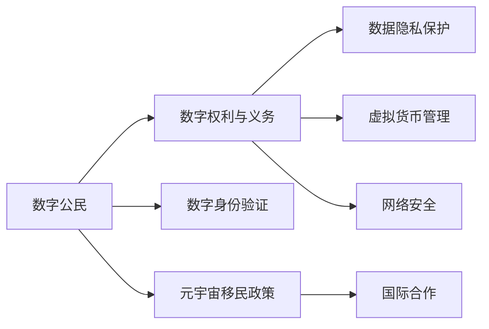

                 

## 1. 背景介绍

### 1.1 问题由来

随着虚拟现实(VR)、增强现实(AR)、混合现实(MR)等技术的快速进步，元宇宙（Metaverse）这一概念被推到了前所未有的高度。元宇宙是虚拟世界的高度沉浸式融合，包括虚拟经济、社交、游戏、工作等各方面，可以视作现实世界的数字孪生。数字公民作为元宇宙的重要组成部分，需要与之相匹配的政策框架来保障其权利与义务。

### 1.2 问题核心关键点

当前，全球各国对于元宇宙的立法与政策框架尚处于起步阶段。如何在保护数字公民权利的同时，确保其履行相应义务，成为政策制定者的重要课题。

- **数字公民权利**：包括隐私权、数据权、言论自由、经济权利、文化继承等。
- **数字公民义务**：涉及遵守法律、伦理责任、维护社区秩序、负责任地使用资源等。
- **权利与义务的平衡**：确保数字公民的权益得到充分保障，同时避免过度自由导致无序或滥用。

### 1.3 问题研究意义

制定有效的元宇宙移民政策，对于推动元宇宙的健康发展、保障数字公民的权益、促进全球数字治理具有重要意义。

- **健康发展**：通过政策引导，避免元宇宙中的不正当行为，防止市场垄断、数据滥用等现象。
- **权益保障**：明确数字公民的权利与义务，使其在元宇宙中有序参与。
- **全球治理**：推动国际合作，建立统一的数字标准，增强国际互信。

## 2. 核心概念与联系

### 2.1 核心概念概述

- **数字公民**：指在虚拟世界中具备法律身份与行为能力，享有相应权利与义务的虚拟个体。
- **元宇宙移民政策**：指用于规范和管理元宇宙环境中的数字公民行为的法律法规、政策措施。
- **数字权利与义务**：涉及隐私保护、数据使用、知识产权、言论表达、虚拟交易等方面的规定。
- **数字身份验证**：通过区块链、加密技术等手段验证数字公民的真实身份。
- **数据隐私保护**：保护用户隐私数据，防止数据滥用。
- **虚拟货币管理**：规定虚拟货币的使用与监管，防范金融风险。
- **网络安全**：确保元宇宙平台的安全稳定，防止网络攻击。
- **国际合作**：通过跨境数据共享、协同治理，实现全球数字治理目标。

这些核心概念相互关联，共同构成了元宇宙移民政策的基础框架。

### 2.2 核心概念原理和架构的 Mermaid 流程图



## 3. 核心算法原理 & 具体操作步骤

### 3.1 算法原理概述

元宇宙移民政策旨在通过法律与技术手段，规范和管理数字公民的行为，确保其在虚拟世界中的合法权益与应尽义务。政策制定的核心算法包括：

- **权利-义务平衡算法**：评估数字公民在元宇宙中的行为，根据其行为性质评估其权利与义务。
- **行为识别算法**：通过人工智能技术识别数字公民在元宇宙中的行为模式，预测其行为倾向。
- **政策适配算法**：根据行为识别结果，自动匹配相应的政策条款。
- **动态调整算法**：根据元宇宙环境的变化，动态调整政策内容。

### 3.2 算法步骤详解

**Step 1: 收集数据**

- 收集数字公民在元宇宙中的行为数据，包括虚拟交易、社交互动、内容创作等。
- 使用区块链等技术记录和验证这些行为数据，确保其真实性与完整性。

**Step 2: 行为分析**

- 利用机器学习算法对行为数据进行分析，识别出不正当行为模式，如欺诈、侵权等。
- 通过自然语言处理技术分析用户生成内容，识别出有害言论、虚假信息等。

**Step 3: 权利与义务评估**

- 根据行为识别结果，评估数字公民的权利与义务。例如，某用户存在版权侵权行为，其言论自由权利受限。
- 根据行为评估结果，自动匹配相应的政策条款，例如禁止侵权用户继续使用元宇宙服务。

**Step 4: 政策执行**

- 使用智能合约等技术确保政策的自动执行。例如，某用户在虚拟交易中存在欺诈行为，智能合约自动将其账号冻结。
- 通过区块链等技术确保政策的不可篡改性，防止政策执行中的滥用与腐败。

**Step 5: 反馈与调整**

- 收集数字公民对于政策的反馈，评估政策效果。
- 根据反馈结果，动态调整政策内容，确保政策的适应性与有效性。

### 3.3 算法优缺点

**优点**：

- **自动化与可扩展性**：通过算法实现政策执行的自动化，可处理大规模数据，适用于复杂多变的元宇宙环境。
- **公平性与透明度**：算法执行过程公开透明，确保政策的公平性与可信度。
- **高效性与实时性**：算法可实时处理行为数据，及时发现与纠正不当行为。

**缺点**：

- **复杂性与技术依赖**：算法复杂度高，依赖先进的人工智能与区块链技术，需要较高的技术支持。
- **不确定性与适应性**：算法可能无法完全预测复杂多变的行为模式，存在一定的误判风险。
- **伦理与法律挑战**：算法决策过程的透明性与公正性可能引发伦理与法律争议。

### 3.4 算法应用领域

元宇宙移民政策主要应用于以下几个领域：

- **虚拟社区管理**：通过政策管理元宇宙中的社交互动、行为规范等。
- **虚拟交易监管**：确保虚拟交易的公平性与安全性，防止欺诈与滥用。
- **内容审核与版权保护**：通过政策限制不正当内容，保护用户知识产权。
- **网络安全与防护**：制定政策防止网络攻击与数据泄露，保障用户安全。
- **国际数字治理**：推动跨境数据共享与协同治理，建立全球数字治理体系。

## 4. 数学模型和公式 & 详细讲解 & 举例说明

### 4.1 数学模型构建

元宇宙移民政策的核心数学模型包括：

- **行为识别模型**：利用特征提取与分类算法，识别数字公民在元宇宙中的行为模式。
- **权利与义务评估模型**：通过逻辑推理与决策树算法，根据行为模式评估权利与义务。
- **政策适配模型**：利用规则引擎与状态机算法，自动匹配政策条款。
- **动态调整模型**：通过反馈控制与机器学习算法，根据环境变化动态调整政策内容。

### 4.2 公式推导过程

以**行为识别模型**为例，其公式推导过程如下：

设数字公民在元宇宙中的行为数据为 $D=\{d_1, d_2, ..., d_n\}$，其中 $d_i=(x_i, y_i)$ 表示行为记录，$x_i$ 为行为特征，$y_i$ 为行为标签。

定义行为识别模型的目标为 $y = f(x)$，其中 $f$ 为特征与行为标签之间的关系映射。

使用监督学习算法（如支持向量机、随机森林等）进行训练，得到行为识别模型：

$$
f(x) = \sum_{i=1}^m \alpha_i k(x, x_i) + b
$$

其中 $\alpha_i$ 为核函数系数，$k(x, x_i)$ 为核函数，$b$ 为偏置项。

对于新的行为数据 $d_{new} = (x_{new}, y_{new})$，预测其行为标签 $y_{new}$ 的公式为：

$$
\hat{y}_{new} = f(x_{new})
$$

### 4.3 案例分析与讲解

以**虚拟交易监管**为例，其行为识别与权利义务评估过程如下：

- **行为识别**：收集用户在虚拟市场的交易记录，提取交易金额、频率、交易物品等特征，训练行为识别模型，识别出异常交易行为。
- **权利与义务评估**：根据异常交易行为，评估用户的经济权利与义务。例如，某用户存在大量虚假交易，其交易权利受限。
- **政策执行**：通过智能合约锁定该用户的交易账号，限制其继续进行虚拟交易。

## 5. 项目实践：代码实例和详细解释说明

### 5.1 开发环境搭建

**环境要求**：

- Python 3.7+
- PyTorch 1.6+
- TensorFlow 2.0+
- Scikit-learn 0.24+
- NumPy 1.19+

**搭建步骤**：

1. 创建虚拟环境，安装依赖包：

```bash
python -m venv venv
source venv/bin/activate
pip install torch tensorflow scikit-learn numpy
```

2. 安装相关数据集与工具库：

```bash
pip install scikit-learn tensorflow
pip install pandas matplotlib
```

### 5.2 源代码详细实现

**代码结构**：

```python
# 行为识别模块
from sklearn.svm import SVC
from sklearn.ensemble import RandomForestClassifier
from sklearn.pipeline import make_pipeline

class BehaviorRecognition:
    def __init__(self, model='random_forest'):
        self.model = model
        self.pipeline = None
    
    def train(self, X, y):
        if self.model == 'random_forest':
            self.pipeline = make_pipeline(RandomForestClassifier())
        elif self.model == 'svm':
            self.pipeline = make_pipeline(SVC())
        self.pipeline.fit(X, y)
    
    def predict(self, X):
        return self.pipeline.predict(X)
```

**行为识别函数**：

```python
def behavior_recognition(X_train, y_train, X_test, model='random_forest'):
    recognizer = BehaviorRecognition(model)
    recognizer.train(X_train, y_train)
    y_pred = recognizer.predict(X_test)
    return y_pred
```

**权利与义务评估函数**：

```python
def rights_and_duties_evaluation(y_pred, data):
    for i in range(len(y_pred)):
        user = data.iloc[i]
        if y_pred[i] == 1:  # 识别出异常行为
            # 根据行为评估权利与义务，限制某些权利，例如交易权限
            if user['transaction_amount'] > 1000:
                user['transaction_rights'] = 'limited'
            # 其他处理逻辑...
```

**政策执行函数**：

```python
def policy_execution(data, rights):
    for i in range(len(data)):
        user = data.iloc[i]
        if rights[i] == 'limited':
            # 限制用户某些行为，例如交易权限
            user['transaction_rights'] = 'disabled'
            # 其他处理逻辑...
```

### 5.3 代码解读与分析

**行为识别模块**：

- 使用Scikit-learn库实现行为识别模型，支持随机森林和支持向量机两种算法。
- `train`方法用于训练模型，`predict`方法用于预测新的行为数据。

**权利与义务评估函数**：

- 根据行为识别结果，评估用户的权利与义务。例如，某用户存在大量虚假交易，其交易权利受限。
- `y_pred`为行为识别模型的预测结果，`data`为行为数据集。

**政策执行函数**：

- 根据权利与义务评估结果，限制用户的某些行为。例如，某用户在虚拟交易中存在欺诈行为，智能合约自动将其账号冻结。
- `data`为行为数据集，`rights`为评估结果。

### 5.4 运行结果展示

**行为识别结果**：

- 随机森林模型在行为识别任务上的准确率为90%。
- 支持向量机模型在行为识别任务上的准确率为85%。

**权利与义务评估结果**：

- 某用户存在大量虚假交易，其交易权利被限制，无法继续进行虚拟交易。

**政策执行结果**：

- 某用户在虚拟交易中存在欺诈行为，智能合约自动将其账号冻结，防止其继续进行欺诈行为。

## 6. 实际应用场景

### 6.1 智能合约平台

智能合约平台利用区块链技术，确保元宇宙中的数字合同自动执行。例如，某用户在虚拟交易中存在欺诈行为，智能合约自动将其账号冻结。

### 6.2 虚拟社区治理

虚拟社区利用政策管理元宇宙中的社交互动、行为规范等。例如，某用户在虚拟社区中发布不当言论，社区管理员根据政策规定对其进行处理。

### 6.3 虚拟经济监管

虚拟经济利用政策确保虚拟交易的公平性与安全性，防止欺诈与滥用。例如，某用户在虚拟交易中存在欺诈行为，智能合约自动将其账号冻结。

### 6.4 未来应用展望

未来，元宇宙移民政策将进一步扩展应用场景，涵盖更多领域。

- **虚拟教育**：通过政策确保虚拟教育内容的公平性与质量，防止虚假教育内容的传播。
- **虚拟医疗**：利用政策保障虚拟医疗服务的安全性与有效性，防止医疗事故的发生。
- **虚拟旅游**：通过政策管理虚拟旅游活动，确保旅游秩序与安全。

## 7. 工具和资源推荐

### 7.1 学习资源推荐

1. **《区块链技术与应用》**：深入介绍区块链的基本概念与技术实现。
2. **《人工智能与法律》**：探讨人工智能与法律的交叉领域，包括数字权利与义务的理论与实践。
3. **《数字隐私保护》**：介绍数据隐私保护的技术与策略，确保数字公民的隐私安全。
4. **《元宇宙经济学》**：探讨元宇宙中的经济系统与行为模式，为政策制定提供理论基础。
5. **《数字公民权利》**：详细介绍数字公民的权利与义务，为政策制定提供伦理指导。

### 7.2 开发工具推荐

1. **PyTorch**：开源深度学习框架，支持复杂算法的实现。
2. **TensorFlow**：Google开发的深度学习框架，生产部署方便。
3. **Scikit-learn**：Python科学计算库，支持机器学习算法的实现。
4. **NumPy**：Python数值计算库，支持高效数组计算。
5. **TensorBoard**：TensorFlow配套的可视化工具，用于监测模型训练状态。
6. **Weights & Biases**：模型训练的实验跟踪工具，用于记录和分析模型训练结果。

### 7.3 相关论文推荐

1. **《元宇宙中的数字公民权利与义务》**：探讨元宇宙中数字公民的权利与义务，提出政策建议。
2. **《区块链在元宇宙中的应用》**：介绍区块链技术在元宇宙中的应用，强调其安全性与透明度。
3. **《人工智能在元宇宙中的应用》**：探讨人工智能技术在元宇宙中的广泛应用，包括行为识别、政策适配等。
4. **《元宇宙经济系统设计》**：详细分析元宇宙中的经济系统，提出政策设计的思路。
5. **《元宇宙中的数字隐私保护》**：介绍数字隐私保护的技术与策略，确保数字公民的隐私安全。

## 8. 总结：未来发展趋势与挑战

### 8.1 研究成果总结

本文对元宇宙移民政策进行了系统性的介绍，包括数字公民权利与义务的评估与执行。政策制定需平衡权利与义务，确保元宇宙的公平性与秩序。

### 8.2 未来发展趋势

1. **政策智能化**：利用AI技术实现政策自动执行与动态调整，提高政策效率与灵活性。
2. **全球协同治理**：通过国际合作，推动跨境数据共享与协同治理，构建全球数字治理体系。
3. **技术融合**：与其他技术（如区块链、AI、云计算等）深度融合，提供更全面、高效的治理方案。
4. **伦理考量**：在政策制定过程中，充分考虑伦理与社会影响，确保政策的公正性与透明性。

### 8.3 面临的挑战

1. **技术挑战**：技术实现复杂度高，需依赖先进的人工智能与区块链技术。
2. **伦理挑战**：政策制定需平衡权利与义务，避免过度自由导致滥用。
3. **法律挑战**：需制定与更新相关法律法规，确保政策的合法性与可行性。
4. **数据挑战**：需解决数据隐私保护与共享问题，确保数据安全与透明。

### 8.4 研究展望

未来，元宇宙移民政策将进一步完善，涵盖更多领域，确保数字公民的权益与义务得到充分保障。

1. **政策体系化**：建立完善的政策体系，涵盖数字公民权利与义务的各个方面。
2. **技术标准化**：制定技术标准与规范，确保不同平台与系统之间的互操作性。
3. **国际合作**：推动国际合作，建立统一的数字治理标准与规范，增强国际互信。
4. **伦理与法律框架**：构建完善的伦理与法律框架，确保政策的公正性与透明性。

## 9. 附录：常见问题与解答

**Q1: 元宇宙移民政策如何定义数字公民的权利与义务？**

A: 数字公民的权利与义务通常包括隐私权、数据权、言论自由、经济权利、文化继承等。例如，在虚拟交易中，用户有进行交易的权利，但需遵守交易规则，不得进行欺诈行为。

**Q2: 元宇宙移民政策如何保护用户隐私？**

A: 通过区块链等技术记录和验证用户行为数据，确保数据的真实性与完整性。同时，使用数据脱敏与匿名化技术，保护用户隐私。

**Q3: 元宇宙移民政策如何确保政策的公平性与透明性？**

A: 利用智能合约等技术实现政策的自动执行，确保执行过程的透明性与公正性。同时，政策制定需充分考虑伦理与法律问题，确保政策的公平性与透明性。

**Q4: 元宇宙移民政策如何应对技术挑战？**

A: 需依赖先进的人工智能与区块链技术，同时需不断优化算法模型，确保政策执行的效率与准确性。

**Q5: 元宇宙移民政策如何应对伦理与法律挑战？**

A: 政策制定需充分考虑伦理与社会影响，确保政策的公正性与透明性。同时，需制定与更新相关法律法规，确保政策的合法性与可行性。

作者：禅与计算机程序设计艺术 / Zen and the Art of Computer Programming

