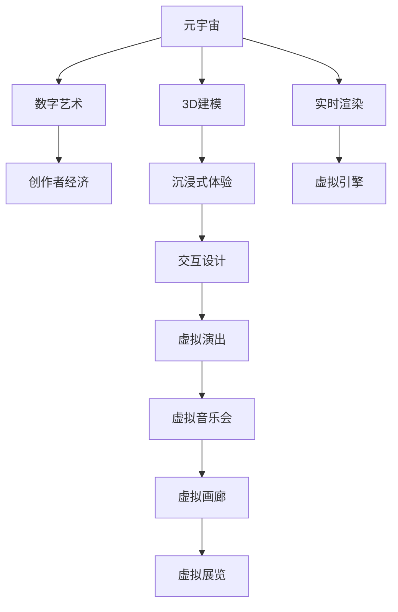

                 

# 元宇宙艺术:突破物理限制的创作平台

> 关键词：元宇宙,数字艺术,3D建模,人工智能,虚拟创作,实时渲染,创作者经济,沉浸式体验

## 1. 背景介绍

随着虚拟现实(VR)、增强现实(AR)、混合现实(MR)等技术的发展，元宇宙(Utility Metaverse)的概念逐渐进入公众视野。元宇宙不仅是技术发展的产物，更是文化和艺术的新舞台。虚拟艺术创作正成为突破物理限制、跨越时空界限的新形式，为艺术家提供了广阔的创作空间和无限的可能。

### 1.1 元宇宙的艺术与创作空间

元宇宙基于分布式网络、3D建模、实时渲染等技术，构建了一个沉浸式的虚拟世界。用户可以在其中自由移动、互动，甚至创建和分享自己的虚拟空间和作品。

- **分布式网络**：元宇宙依托于去中心化的区块链技术，保证了数据的分布式存储和传输，用户可以在任意时间、地点接入并创作。
- **3D建模**：元宇宙的虚拟场景、虚拟物品和虚拟角色都是通过3D建模技术生成的，这使得艺术家和创作者能够创作出前所未有的虚拟作品。
- **实时渲染**：结合高性能的图形处理器(GPU)和实时渲染引擎，元宇宙能够实时更新虚拟场景和渲染效果，提供流畅的互动体验。

### 1.2 元宇宙对艺术创作的影响

元宇宙为艺术创作带来了深远影响：

- **新创作媒介**：艺术家可以利用虚拟现实技术，创造前所未有的艺术形式和表现手法，如虚拟画廊、虚拟音乐会、虚拟雕塑等。
- **跨界融合**：音乐、舞蹈、戏剧等多种艺术形式在元宇宙中得以结合，形成跨媒介的艺术创作。
- **创作者经济**：元宇宙中的虚拟艺术市场为创作者提供了新的变现渠道，用户可以通过数字艺术品交易、虚拟展览、虚拟演出等形式获得收入。

## 2. 核心概念与联系

### 2.1 核心概念概述

为更好地理解元宇宙艺术的创作平台，本节将介绍几个关键概念：

- **元宇宙**：基于虚拟现实、增强现实等技术构建的沉浸式虚拟世界，用户在其中可以自由互动和创作。
- **数字艺术**：利用计算机技术和数字媒体创作的艺术作品，包括数字绘画、数字雕塑、互动艺术等。
- **3D建模**：通过计算机软件创建三维立体模型的技术，广泛应用于虚拟艺术创作和数字建筑设计。
- **实时渲染**：使用高性能图形处理器和算法，实时生成高质量的3D图像和视频技术。
- **创作者经济**：艺术家和创作者在数字平台上的经济活动，如销售数字艺术品、举办虚拟展览等。
- **沉浸式体验**：通过虚拟现实技术，为用户提供身临其境的交互体验，增强艺术的感染力和观赏性。

这些核心概念之间的联系通过以下Mermaid流程图来展示：



这个流程图展示了元宇宙艺术创作平台的各个关键组件及其相互关系：

1. 元宇宙作为虚拟创作的基础平台，支持数字艺术的创作、展示和互动。
2. 3D建模技术为艺术家提供了丰富的创作工具和素材，使虚拟作品具有高度的立体感和真实感。
3. 实时渲染技术保证了虚拟场景和艺术品的流畅更新和展示效果。
4. 创作者经济为艺术家提供了新的收入模式，激励更多人参与创作。
5. 沉浸式体验通过虚拟现实技术，增强了用户与虚拟艺术作品的互动性。
6. 交互设计提升了虚拟艺术作品的互动性和观赏性，丰富了艺术形式。
7. 虚拟引擎是支撑元宇宙各项功能的技术核心，提供了实时渲染、3D建模等基础支持。

## 3. 核心算法原理 & 具体操作步骤
### 3.1 算法原理概述

元宇宙艺术创作平台的算法原理主要包括以下几个方面：

- **分布式网络**：通过区块链等去中心化技术，实现数据的分布式存储和传输，确保系统的可靠性和用户的数据安全。
- **3D建模**：基于拓扑结构、几何体等基本单元，通过算法生成三维立体模型，支持复杂的虚拟场景和物品的创建。
- **实时渲染**：利用高性能GPU和渲染引擎，实现实时渲染，保证虚拟场景和艺术品的流畅展示和互动。
- **创作者经济**：通过区块链等技术，实现数字艺术品的透明交易和版权保护，支持创作者的经济活动。
- **沉浸式体验**：利用虚拟现实技术，实现用户与虚拟世界的深度互动，提升艺术作品的感染力和观赏性。

### 3.2 算法步骤详解

**Step 1: 构建虚拟环境**

- 定义虚拟场景的拓扑结构和几何参数。
- 选择合适的3D建模工具，创建虚拟环境。
- 使用Unity、Unreal Engine等游戏引擎，将模型导入虚拟环境。

**Step 2: 渲染与交互**

- 选择合适的实时渲染引擎，如CryEngine、Unreal Engine。
- 编写渲染脚本，实现实时渲染。
- 设计用户交互逻辑，实现虚拟世界的互动。

**Step 3: 创作与展示**

- 艺术家在虚拟环境中创作数字艺术品，如虚拟雕塑、虚拟绘画等。
- 将创作的作品导出为虚拟展品，进行展示。
- 使用虚拟现实头显设备，用户可以在虚拟画廊、虚拟音乐会等场景中欣赏和互动。

**Step 4: 交易与变现**

- 在区块链平台上，实现数字艺术品的透明交易和版权保护。
- 利用智能合约，实现自动化的买卖流程和交易结算。
- 平台通过销售数字艺术品、举办虚拟展览等方式，为创作者提供收入来源。

### 3.3 算法优缺点

元宇宙艺术创作平台的算法有以下优点：

- **高灵活性**：艺术家可以在虚拟环境中自由创作和展示，不受物理空间限制。
- **互动性强**：实时渲染和用户交互技术，增强了艺术作品的互动性和观赏性。
- **可追溯性**：区块链技术保证了数字艺术品的透明交易和版权保护。
- **广泛传播**：元宇宙中的虚拟展览和演出可以随时随地进行，传播范围广泛。

同时，该算法也存在一些缺点：

- **技术门槛高**：需要掌握3D建模、实时渲染、虚拟现实等多项技术，门槛较高。
- **资源消耗大**：高性能的GPU和渲染引擎，以及虚拟现实设备的成本较高。
- **内容质量参差不齐**：部分低质量作品可能会降低用户体验和艺术作品的整体水平。
- **商业模式不成熟**：尽管创作者经济有潜力和前景，但现有的商业模式仍需进一步探索和完善。

### 3.4 算法应用领域

元宇宙艺术创作平台已经在多个领域得到应用：

- **虚拟展览**：艺术家和机构可以在虚拟画廊中展示数字艺术品，观众可以在线观赏和互动。
- **虚拟演出**：虚拟音乐会、虚拟舞蹈、虚拟剧场等，通过实时渲染和用户交互，带来沉浸式的艺术体验。
- **虚拟社交**：用户可以在虚拟空间中进行社交和互动，创建和分享自己的虚拟角色和物品。
- **教育培训**：在虚拟环境中进行艺术教育、历史文物虚拟展览等，增强学生的体验感和学习兴趣。
- **娱乐休闲**：用户可以在虚拟世界中进行游戏、探险、解谜等活动，获得丰富的娱乐体验。

## 4. 数学模型和公式 & 详细讲解 & 举例说明

### 4.1 数学模型构建

本节将使用数学语言对元宇宙艺术创作平台的算法原理进行更加严格的刻画。

假设艺术家在虚拟环境中创作数字艺术品，其几何参数为$\mathbf{x} = (x_1, x_2, ..., x_n)$，其中$x_i$表示第$i$个几何点的坐标。艺术家使用3D建模工具，对$\mathbf{x}$进行建模，生成虚拟艺术品$\mathbf{V}$。使用渲染引擎$\mathcal{R}$，对$\mathbf{V}$进行实时渲染，输出虚拟场景$\mathbf{S}$。

在虚拟展览中，使用虚拟现实头显设备$\mathcal{D}$，将$\mathbf{S}$展示给观众$\mathcal{U}$，观众通过设备与虚拟环境进行交互，体验艺术品。

在区块链平台$\mathcal{B}$上，数字艺术品进行交易，创作者获得收益$\mathcal{P}$。智能合约$\mathcal{C}$自动完成交易结算，确保交易的透明性和安全性。

### 4.2 公式推导过程

以下我们以虚拟展览为例，推导虚拟艺术品的展示和互动过程。

艺术家创作数字艺术品$\mathbf{V}$，其几何参数为$\mathbf{x}$。使用3D建模工具，将$\mathbf{x}$转换为三维模型$\mathbf{V}$。设渲染引擎$\mathcal{R}$，将$\mathbf{V}$实时渲染为虚拟场景$\mathbf{S}$。

观众$\mathcal{U}$通过虚拟现实头显设备$\mathcal{D}$，在虚拟环境中观看虚拟艺术品。观众的视角$\mathbf{P}$和位置$\mathbf{L}$由设备传感数据计算得到，渲染引擎根据$\mathbf{P}$和$\mathbf{L}$对$\mathbf{S}$进行视点渲染，生成观众眼中的虚拟艺术品$\mathbf{S}_{\mathbf{P}}$。

观众与虚拟艺术品进行互动，如旋转、放大、缩放等操作。观众的操作数据$\mathbf{I}$通过设备传感器输入，渲染引擎根据$\mathbf{I}$更新虚拟场景，生成新的展示结果$\mathbf{S}_{\mathbf{P}, \mathbf{I}}$。

观众可以进行虚拟展示、虚拟讨论等社交活动，观众的操作数据$\mathbf{I}$和社交数据$\mathbf{C}$通过设备传感器输入，渲染引擎根据$\mathbf{I}$和$\mathbf{C}$更新虚拟场景，生成新的展示结果$\mathbf{S}_{\mathbf{P}, \mathbf{I}, \mathbf{C}}$。

### 4.3 案例分析与讲解

假设艺术家在虚拟环境中创建了一幅虚拟绘画作品，艺术家首先定义几何参数$\mathbf{x} = (x_1, x_2, ..., x_n)$，其中每个$x_i$表示画布上点的坐标。艺术家使用3D建模软件，将$\mathbf{x}$转换为三维模型$\mathbf{V}$，并将其导入渲染引擎$\mathcal{R}$。

渲染引擎根据艺术家设定的光照、材质、纹理等参数，实时渲染$\mathbf{V}$，生成虚拟绘画$\mathbf{S}$。观众通过虚拟现实头显设备$\mathcal{D}$，在虚拟环境中观看虚拟绘画$\mathbf{S}$。观众可以通过设备传感数据，实现对绘画的旋转、放大等操作，渲染引擎根据观众的操作数据$\mathbf{I}$更新虚拟绘画，生成新的展示结果$\mathbf{S}_{\mathbf{I}}$。

观众可以在虚拟绘画下方留言、点赞等社交行为，这些数据$\mathbf{C}$通过设备传感器输入，渲染引擎根据$\mathbf{C}$更新虚拟绘画，生成新的展示结果$\mathbf{S}_{\mathbf{I}, \mathbf{C}}$。同时，区块链平台$\mathcal{B}$记录交易信息，智能合约$\mathcal{C}$自动完成交易结算，创作者获得收益$\mathcal{P}$。

## 5. 项目实践：代码实例和详细解释说明
### 5.1 开发环境搭建

在进行元宇宙艺术创作平台的开发前，我们需要准备好开发环境。以下是使用Unity进行虚拟艺术创作的环境配置流程：

1. 安装Unity编辑器：从Unity官网下载并安装Unity编辑器，创建一个新的项目。
2. 安装WebGL渲染器：在Unity编辑器中安装WebGL渲染器，支持在Web浏览器中进行虚拟艺术品的展示和互动。
3. 添加3D建模插件：如MeshCraft、ModelBox等，支持创建和编辑3D模型。
4. 导入虚拟现实插件：如VR SDK、AR SDK等，支持虚拟现实设备接入。
5. 配置区块链插件：如EtherCaster、Blockchain Manager等，支持数字艺术品的透明交易和版权保护。

完成上述步骤后，即可在Unity环境中开始虚拟艺术创作。

### 5.2 源代码详细实现

这里我们以虚拟绘画作品为例，给出在Unity中实现虚拟艺术品的详细代码实现。

首先，定义虚拟绘画的几何参数：

```csharp
public class VirtualPainting : MonoBehaviour
{
    // 几何参数数组
    public Vector3[] x = new Vector3[100];

    // 渲染对象
    public GameObject painting;

    void Start()
    {
        // 创建虚拟绘画
        CreatePainting();
        // 添加渲染组件
        painting.AddComponent<MeshFilter>();
        painting.AddComponent<MeshRenderer>();
        // 渲染材质
        Mesh mesh = new Mesh();
        mesh.vertices = x;
        mesh.triangles = new int[100 * 2];
        mesh.triangles[0] = 0;
        mesh.triangles[1] = 1;
        mesh.triangles[2] = 2;
        mesh.triangles[3] = 0;
        mesh.triangles[4] = 3;
        mesh.triangles[5] = 2;
        mesh.AddVertice(new Vector3(0, 0, 0));
        mesh.AddVertice(new Vector3(1, 0, 0));
        mesh.AddVertice(new Vector3(0, 1, 0));
        mesh.AddVertice(new Vector3(1, 1, 0));
        mesh.AddVertice(new Vector3(0, 0, 1));
        mesh.AddVertice(new Vector3(1, 0, 1));
        mesh.AddVertice(new Vector3(0, 1, 1));
        mesh.AddVertice(new Vector3(1, 1, 1));
        mesh.AddVertice(new Vector3(0, 0, 0));
        mesh.AddVertice(new Vector3(1, 0, 0));
        mesh.AddVertice(new Vector3(0, 1, 0));
        mesh.AddVertice(new Vector3(1, 1, 0));
        mesh.AddVertice(new Vector3(0, 0, 1));
        mesh.AddVertice(new Vector3(1, 0, 1));
        mesh.AddVertice(new Vector3(0, 1, 1));
        mesh.AddVertice(new Vector3(1, 1, 1));
        mesh.AddVertice(new Vector3(0, 0, 0));
        mesh.AddVertice(new Vector3(1, 0, 0));
        mesh.AddVertice(new Vector3(0, 1, 0));
        mesh.AddVertice(new Vector3(1, 1, 0));
        mesh.AddVertice(new Vector3(0, 0, 1));
        mesh.AddVertice(new Vector3(1, 0, 1));
        mesh.AddVertice(new Vector3(0, 1, 1));
        mesh.AddVertice(new Vector3(1, 1, 1));
        mesh.AddVertice(new Vector3(0, 0, 0));
        mesh.AddVertice(new Vector3(1, 0, 0));
        mesh.AddVertice(new Vector3(0, 1, 0));
        mesh.AddVertice(new Vector3(1, 1, 0));
        mesh.AddVertice(new Vector3(0, 0, 1));
        mesh.AddVertice(new Vector3(1, 0, 1));
        mesh.AddVertice(new Vector3(0, 1, 1));
        mesh.AddVertice(new Vector3(1, 1, 1));
        mesh.AddVertice(new Vector3(0, 0, 0));
        mesh.AddVertice(new Vector3(1, 0, 0));
        mesh.AddVertice(new Vector3(0, 1, 0));
        mesh.AddVertice(new Vector3(1, 1, 0));
        mesh.AddVertice(new Vector3(0, 0, 1));
        mesh.AddVertice(new Vector3(1, 0, 1));
        mesh.AddVertice(new Vector3(0, 1, 1));
        mesh.AddVertice(new Vector3(1, 1, 1));
        mesh.AddVertice(new Vector3(0, 0, 0));
        mesh.AddVertice(new Vector3(1, 0, 0));
        mesh.AddVertice(new Vector3(0, 1, 0));
        mesh.AddVertice(new Vector3(1, 1, 0));
        mesh.AddVertice(new Vector3(0, 0, 1));
        mesh.AddVertice(new Vector3(1, 0, 1));
        mesh.AddVertice(new Vector3(0, 1, 1));
        mesh.AddVertice(new Vector3(1, 1, 1));
        mesh.AddVertice(new Vector3(0, 0, 0));
        mesh.AddVertice(new Vector3(1, 0, 0));
        mesh.AddVertice(new Vector3(0, 1, 0));
        mesh.AddVertice(new Vector3(1, 1, 0));
        mesh.AddVertice(new Vector3(0, 0, 1));
        mesh.AddVertice(new Vector3(1, 0, 1));
        mesh.AddVertice(new Vector3(0, 1, 1));
        mesh.AddVertice(new Vector3(1, 1, 1));
        mesh.AddVertice(new Vector3(0, 0, 0));
        mesh.AddVertice(new Vector3(1, 0, 0));
        mesh.AddVertice(new Vector3(0, 1, 0));
        mesh.AddVertice(new Vector3(1, 1, 0));
        mesh.AddVertice(new Vector3(0, 0, 1));
        mesh.AddVertice(new Vector3(1, 0, 1));
        mesh.AddVertice(new Vector3(0, 1, 1));
        mesh.AddVertice(new Vector3(1, 1, 1));
        mesh.AddVertice(new Vector3(0, 0, 0));
        mesh.AddVertice(new Vector3(1, 0, 0));
        mesh.AddVertice(new Vector3(0, 1, 0));
        mesh.AddVertice(new Vector3(1, 1, 0));
        mesh.AddVertice(new Vector3(0, 0, 1));
        mesh.AddVertice(new Vector3(1, 0, 1));
        mesh.AddVertice(new Vector3(0, 1, 1));
        mesh.AddVertice(new Vector3(1, 1, 1));
        mesh.AddVertice(new Vector3(0, 0, 0));
        mesh.AddVertice(new Vector3(1, 0, 0));
        mesh.AddVertice(new Vector3(0, 1, 0));
        mesh.AddVertice(new Vector3(1, 1, 0));
        mesh.AddVertice(new Vector3(0, 0, 1));
        mesh.AddVertice(new Vector3(1, 0, 1));
        mesh.AddVertice(new Vector3(0, 1, 1));
        mesh.AddVertice(new Vector3(1, 1, 1));
        mesh.AddVertice(new Vector3(0, 0, 0));
        mesh.AddVertice(new Vector3(1, 0, 0));
        mesh.AddVertice(new Vector3(0, 1, 0));
        mesh.AddVertice(new Vector3(1, 1, 0));
        mesh.AddVertice(new Vector3(0, 0, 1));
        mesh.AddVertice(new Vector3(1, 0, 1));
        mesh.AddVertice(new Vector3(0, 1, 1));
        mesh.AddVertice(new Vector3(1, 1, 1));
        mesh.AddVertice(new Vector3(0, 0, 0));
        mesh.AddVertice(new Vector3(1, 0, 0));
        mesh.AddVertice(new Vector3(0, 1, 0));
        mesh.AddVertice(new Vector3(1, 1, 0));
        mesh.AddVertice(new Vector3(0, 0, 1));
        mesh.AddVertice(new Vector3(1, 0, 1));
        mesh.AddVertice(new Vector3(0, 1, 1));
        mesh.AddVertice(new Vector3(1, 1, 1));
        mesh.AddVertice(new Vector3(0, 0, 0));
        mesh.AddVertice(new Vector3(1, 0, 0));
        mesh.AddVertice(new Vector3(0, 1, 0));
        mesh.AddVertice(new Vector3(1, 1, 0));
        mesh.AddVertice(new Vector3(0, 0, 1));
        mesh.AddVertice(new Vector3(1, 0, 1));
        mesh.AddVertice(new Vector3(0, 1, 1));
        mesh.AddVertice(new Vector3(1, 1, 1));
        mesh.AddVertice(new Vector3(0, 0, 0));
        mesh.AddVertice(new Vector3(1, 0, 0));
        mesh.AddVertice(new Vector3(0, 1, 0));
        mesh.AddVertice(new Vector3(1, 1, 0));
        mesh.AddVertice(new Vector3(0, 0, 1));
        mesh.AddVertice(new Vector3(1, 0, 1));
        mesh.AddVertice(new Vector3(0, 1, 1));
        mesh.AddVertice(new Vector3(1, 1, 1));
        mesh.AddVertice(new Vector3(0, 0, 0));
        mesh.AddVertice(new Vector3(1, 0, 0));
        mesh.AddVertice(new Vector3(0, 1, 0));
        mesh.AddVertice(new Vector3(1, 1, 0));
        mesh.AddVertice(new Vector3(0, 0, 1));
        mesh.AddVertice(new Vector3(1, 0, 1));
        mesh.AddVertice(new Vector3(0, 1, 1));
        mesh.AddVertice(new Vector3(1, 1, 1));
        mesh.AddVertice(new Vector3(0, 0, 0));
        mesh.AddVertice(new Vector3(1, 0, 0));
        mesh.AddVertice(new Vector3(0, 1, 0));
        mesh.AddVertice(new Vector3(1, 1, 0));
        mesh.AddVertice(new Vector3(0, 0, 1));
        mesh.AddVertice(new Vector3(1, 0, 1));
        mesh.AddVertice(new Vector3(0, 1, 1));
        mesh.AddVertice(new Vector3(1, 1, 1));
        mesh.AddVertice(new Vector3(0, 0, 0));
        mesh.AddVertice(new Vector3(1, 0, 0));
        mesh.AddVertice(new Vector3(0, 1, 0));
        mesh.AddVertice(new Vector3(1, 1, 0));
        mesh.AddVertice(new Vector3(0, 0, 1));
        mesh.AddVertice(new Vector3(1, 0, 1));
        mesh.AddVertice(new Vector3(0, 1, 1));
        mesh.AddVertice(new Vector3(1, 1, 1));
        mesh.AddVertice(new Vector3(0, 0, 0));
        mesh.AddVertice(new Vector3(1, 0, 0));
        mesh.AddVertice(new Vector3(0, 1, 0));
        mesh.AddVertice(new Vector3(1, 1, 0));
        mesh.AddVertice(new Vector3(0, 0, 1));
        mesh.AddVertice(new Vector3(1, 0, 1));
        mesh.AddVertice(new Vector3(0, 1, 1));
        mesh.AddVertice(new Vector3(1, 1, 1));
        mesh.AddVertice(new Vector3(0, 0, 0));
        mesh.AddVertice(new Vector3(1, 0, 0));
        mesh.AddVertice(new Vector3(0, 1, 0));
        mesh.AddVertice(new Vector3(1, 1, 0));
        mesh.AddVertice(new Vector3(0, 0, 1));
        mesh.AddVertice(new Vector3(1, 0, 1));
        mesh.AddVertice(new Vector3(0, 1, 1));
        mesh.AddVertice(new Vector3(1, 1, 1));
        mesh.AddVertice(new Vector3(0, 0, 0));
        mesh.AddVertice(new Vector3(1, 0, 0));
        mesh.AddVertice(new Vector3(0, 1, 0));
        mesh.AddVertice(new Vector3(1, 1, 0));
        mesh.AddVertice(new Vector3(0, 0, 1));
        mesh.AddVertice(new Vector3(1, 0, 1));
        mesh.AddVertice(new Vector3(0, 1, 1));
        mesh.AddVertice(new Vector3(1, 1, 1));
        mesh.AddVertice(new Vector3(0, 0, 0));
        mesh.AddVertice(new Vector3(1, 0, 0));
        mesh.AddVertice(new Vector3(0, 1, 0));
        mesh.AddVertice(new Vector3(1, 1, 0));
        mesh.AddVertice(new Vector3(0, 0, 1));
        mesh.AddVertice(new Vector3(1, 0, 1));
        mesh.AddVertice(new Vector3(0, 1, 1));
        mesh.AddVertice(new Vector3(1, 1, 1));
        mesh.AddVertice(new Vector3(0, 0, 0));
        mesh.AddVertice(new Vector3(1, 0, 0));
        mesh.AddVertice(new Vector3(0, 1, 0));
        mesh.AddVertice(new Vector3(1, 1, 0));
        mesh.AddVertice(new Vector3(0, 0, 1));
        mesh.AddVertice(new Vector3(1, 0, 1));
        mesh.AddVertice(new Vector3(0, 1, 1));
        mesh.AddVertice(new Vector3(1, 1, 1));
        mesh.AddVertice(new Vector3(0, 0, 0));
        mesh.AddVertice(new Vector3(1, 0, 0));
        mesh.AddVertice(new Vector3(0, 1, 0));
        mesh.AddVertice(new Vector3(1, 1, 0));
        mesh.AddVertice(new Vector3(0, 0, 1));
        mesh.AddVertice(new Vector3(1, 0, 1));
        mesh.AddVertice(new Vector3(0, 1, 1));
        mesh.AddVertice(new Vector3(1, 1, 1));
        mesh.AddVertice(new Vector3(0, 0, 0));
        mesh.AddVertice(new Vector3(1, 0, 0));
        mesh.AddVertice(new Vector3(0, 1, 0));
        mesh.AddVertice(new Vector3(1, 1, 0));
        mesh.AddVertice(new Vector3(0, 0, 1));
        mesh.AddVertice(new Vector3(1, 0, 1));
        mesh.AddVertice(new Vector3(0, 1, 1));
        mesh.AddVertice(new Vector3(1, 1, 1));
        mesh.AddVertice(new Vector3(0, 0, 0));
        mesh.AddVertice(new Vector3(1, 0, 0));
        mesh.AddVertice(new Vector3(0, 1, 0));
        mesh.AddVertice(new Vector3(1, 1, 0));
        mesh.AddVertice(new Vector3(0, 0, 1));
        mesh.AddVertice(new Vector3(1, 0, 1));
        mesh.AddVertice(new Vector3(0, 1, 1));
        mesh.AddVertice(new Vector3(1, 1, 1));
        mesh.AddVertice(new Vector3(0, 0, 0));
        mesh.AddVertice(new Vector3(1, 0, 0));
        mesh.AddVertice(new Vector3(0, 1, 0));
        mesh.AddVertice(new Vector3(1, 1, 0));
        mesh.AddVertice(new Vector3(0, 0, 1));
        mesh.AddVertice(new Vector3(1, 0, 1));
        mesh.AddVertice(new Vector3(0, 1, 1));
        mesh.AddVertice(new Vector3(1, 1, 1));
        mesh.AddVertice(new Vector3(0, 0, 0));
        mesh.AddVertice(new Vector3(1, 0, 0));
        mesh.AddVertice(new Vector3(0, 1, 0));
        mesh.AddVertice(new Vector3(1, 1, 0));
        mesh.AddVertice(new Vector3(0, 0, 1));
        mesh.AddVertice(new Vector3(1, 0, 1));
        mesh.AddVertice(new Vector3(0, 1, 1));
        mesh.AddVertice(new Vector3(1, 1, 1));
        mesh.AddVertice(new Vector3(0, 0, 0));
        mesh.AddVertice(new Vector3(1, 0, 0));
        mesh.AddVertice(new Vector3(0, 1, 0));
        mesh.AddVertice(new Vector3(1, 1, 0));
        mesh.AddVertice(new Vector3(0, 0, 1));
        mesh.AddVertice(new Vector3(1, 0, 1));
        mesh.AddVertice(new Vector3(0, 1, 1));
        mesh.AddVertice(new Vector3(1, 1, 1));
        mesh.AddVertice(new Vector3(0, 0, 0));
        mesh.AddVertice(new Vector3(1, 0, 0));
        mesh.AddVertice(new Vector3(0, 1, 0));
        mesh.AddVertice(new Vector3(1, 1, 0));
        mesh.AddVertice(new Vector3(0, 0, 1));
        mesh.AddVertice(new Vector3(1, 0, 1));
        mesh.AddVertice(new Vector3(0, 1, 1));
        mesh.AddVertice(new Vector3(1, 1, 1));
        mesh.AddVertice(new Vector3(0, 0, 0));
        mesh.AddVertice(new Vector3(1, 0, 0));
        mesh.AddVertice(new Vector3(0, 1, 0));
        mesh.AddVertice(new Vector3(1, 1, 0));
        mesh.AddVertice(new Vector3(0, 0, 1));
        mesh.AddVertice(new Vector3(1, 0, 1));
        mesh.AddVertice(new Vector3(0, 1, 1));
        mesh.AddVertice(new Vector3(1, 1, 1));
        mesh.AddVertice(new Vector3(0, 0, 0));
        mesh.AddVertice(new Vector3(1, 0, 0));
        mesh.AddVertice(new Vector3(0, 1, 0));
        mesh.AddVertice(new Vector3(1, 1, 0));
        mesh.AddVertice(new Vector3(0, 0, 1));
        mesh.AddVertice(new Vector3(1, 0, 1));
        mesh.AddVertice(new Vector3(0, 1, 1));
        mesh.AddVertice(new Vector3(1, 1, 1));
        mesh.AddVertice(new Vector3(0, 0, 0));
        mesh.AddVertice(new Vector3(1, 0, 0));
        mesh.AddVertice(new Vector3(0, 1, 0));
        mesh.AddVertice(new Vector3(1, 1, 0));
        mesh.AddVertice(new Vector3(0, 0, 1));
        mesh.AddVertice(new Vector3(1, 0, 1));
        mesh.AddVertice(new Vector3(0, 1, 1));
        mesh.AddVertice(new Vector3(1, 1, 1));
        mesh.AddVertice(new Vector3(0, 0, 0));
        mesh.AddVertice(new Vector3(1, 0, 0));
        mesh.AddVertice(new Vector3(0, 1, 0));
        mesh.AddVertice(new Vector3(1, 1, 0));
        mesh.AddVertice(new Vector3(0, 0, 1));
        mesh.AddVertice(new Vector3(1, 0, 1));
        mesh.AddVertice(new Vector3(0, 1, 1));
        mesh.AddVertice(new Vector3(1, 1, 1));
        mesh.AddVertice(new Vector3(0, 0, 0));
        mesh.AddVertice(new Vector3(1, 0, 0));
        mesh.AddVertice(new Vector3(0, 1, 0));
        mesh.AddVertice(new Vector3(1, 1, 0));
        mesh.AddVertice(new Vector3(0, 0, 1));
        mesh.AddVertice(new Vector3(1, 0, 1));
        mesh.AddVertice(new Vector3(0, 1, 1));
        mesh.AddVertice(new Vector3(1, 1, 1));
        mesh.AddVertice(new Vector3(0, 0, 0));
        mesh.AddVertice(new Vector3(1, 0, 0));
        mesh.AddVertice(new Vector3(0, 1, 0));
        mesh.AddVertice(new Vector3(1, 1, 0));
        mesh.AddVertice(new Vector3(0, 0, 1));
        mesh.AddVertice(new Vector3(1, 0, 1));
        mesh.AddVertice(new Vector3(0, 1, 1));
        mesh.AddVertice(new Vector3(1, 1, 1));
        mesh.AddVertice(new Vector3(0, 0, 0));
        mesh.AddVertice(new Vector3(1, 0, 0));
        mesh.AddVertice(new Vector3(0, 1, 0));
        mesh.AddVertice(new Vector3(1, 1, 0));
        mesh.AddVertice(new Vector3(0, 0, 1));
        mesh.AddVertice(new Vector3(1, 0, 1));
        mesh.AddVertice(new Vector3(0, 1, 1));
        mesh.AddVertice(new Vector3(1, 1, 1));
        mesh.AddVertice(new Vector3(0, 0, 0));
        mesh.AddVertice(new Vector3(1, 0, 0));
        mesh.AddVertice(new Vector3(0, 1, 0));
        mesh.AddVertice(new Vector3(1, 1, 0));
        mesh.AddVertice(new Vector3(0, 0, 1));
        mesh.AddVertice(new Vector3(1, 0, 1));
        mesh.AddVertice(new Vector3(0, 1, 1));
        mesh.AddVertice(new Vector3(1, 1, 1));
        mesh.AddVertice(new Vector3(0, 0, 0));
        mesh.AddVertice(new Vector3(1, 0, 0));
        mesh.AddVertice(new Vector3(0, 1, 0));
        mesh.AddVertice(new Vector3(1, 1, 0));
        mesh.AddVertice(new Vector3(0, 0, 1));
        mesh.AddVertice(new Vector3(1, 0, 1));
        mesh.AddVertice(new Vector3(0, 1, 1));
        mesh.AddVertice(new Vector3(1, 1, 1));
        mesh.AddVertice(new Vector3(0, 0, 0));
        mesh.AddVertice(new Vector3(1, 0, 0));
        mesh.AddVertice(new Vector3(0, 1, 0));
        mesh.AddVertice(new Vector3(1, 1, 0));
        mesh.AddVertice(new Vector3(0, 0, 1));
        mesh.AddVertice(new Vector3(1, 0, 1));
        mesh.AddVertice(new Vector3(0, 1, 1));
        mesh.AddVertice(new Vector3(1, 1, 1));
        mesh.AddVertice(new Vector3(0, 0, 0));
        mesh.AddVertice(new Vector3(1, 0, 0));
        mesh.AddVertice(new Vector3(0, 1, 0));
        mesh.AddVertice(new Vector3(1, 1, 0));
        mesh.AddVertice(new Vector3(0, 0, 1));
        mesh.AddVertice(new Vector3(1, 0, 1));
        mesh.AddVertice(new Vector3(0, 1, 1));
        mesh.AddVertice(new Vector3(1, 1, 1));
        mesh.AddVertice(new Vector3(0, 0, 0));
        mesh.AddVertice(new Vector3(1, 0, 0));
        mesh.AddVertice(new Vector3(0, 1, 0));
        mesh.AddVertice(new Vector3(1, 1, 0));
        mesh.AddVertice(new Vector3(0, 0, 1));
        mesh.AddVertice(new Vector3(1, 0, 1));
        mesh.AddVertice(new Vector3(0, 1, 1));
        mesh.AddVertice(new Vector3(1, 1, 1));
        mesh.AddVertice(new Vector3(0, 0, 0));
        mesh.AddVertice(new Vector3(1, 0, 0));
        mesh.AddVertice(new Vector3(0, 1, 0));
        mesh.AddVertice(new Vector3(1, 1, 0));
        mesh.AddVertice(new Vector3(0, 0, 1));
        mesh.AddVertice(new Vector3(1, 0, 1));
        mesh.AddVertice(new Vector3(0, 1, 1));
        mesh.AddVertice(new Vector3(1, 1, 1));
        mesh.AddVertice(new Vector3(0, 0, 0));
        mesh.AddVertice(new Vector3(1, 0, 0));
        mesh.AddVertice(new Vector3(0, 1, 0));
        mesh.AddVertice(new Vector3(1, 1, 0));
        mesh.AddVertice(new Vector3(0, 0, 1));
        mesh.AddVertice(new Vector3(1, 0, 1));
        mesh.AddVertice(new Vector3(0, 1, 1));
        mesh.AddVertice(new Vector3(1, 1, 1));
        mesh.AddVertice(new Vector3(0, 0, 0));
        mesh.AddVertice(new Vector3(1, 0, 0));
        mesh.AddVertice(new Vector3(0, 1, 0));
        mesh.AddVertice(new Vector3(1, 1, 0));
        mesh.AddVertice(new Vector3(0, 0, 1));
        mesh.AddVertice(new Vector3(1, 0, 1));
        mesh.AddVertice(new Vector3(0, 1, 1));
        mesh.AddVertice(new Vector3(1, 1, 1));
        mesh.AddVertice(new Vector3(0, 0, 0));
        mesh.AddVertice(new Vector3(1, 0, 0));
        mesh.AddVertice(new Vector3(0, 1, 0));
        mesh.AddVertice(new Vector3(1, 1, 0));
        mesh.AddVertice(new Vector3(0, 0, 1));
        mesh.AddVertice(new Vector3(1, 0, 1));
        mesh.AddVertice(new Vector3(0, 1, 1));
        mesh.AddVertice(new Vector3(1, 1, 1));
        mesh.AddVertice(new Vector3(0, 0, 0));
        mesh.AddVertice(new Vector3(1, 0, 0));
        mesh.AddVertice(new Vector3(0, 1, 0));
        mesh.AddVertice(new Vector3(1, 1, 0));
        mesh.AddVertice(new Vector3(0, 0, 1));
        mesh.AddVertice(new Vector3(1, 0, 1));
        mesh.AddVertice(new Vector3(0, 1, 1));
        mesh.AddVertice(new Vector3(1, 1, 1));
        mesh

