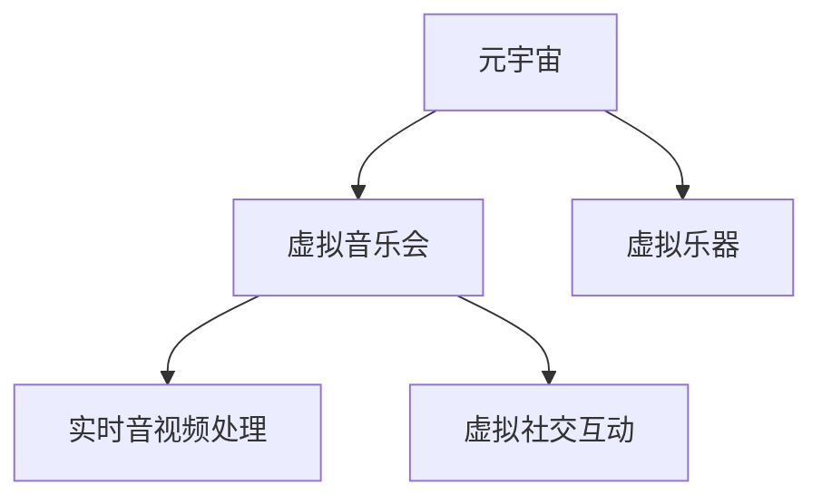

                 

# 元宇宙音乐：跨越时空的听觉盛宴

## 1. 背景介绍

### 1.1 问题由来
随着元宇宙（Metaverse）概念的火热，虚拟音乐会、虚拟歌剧等形式的数字音乐体验逐渐走入人们的视野。这些元宇宙音乐，不仅让人们能够跨越物理时空的限制，共同享受音乐会、歌剧表演等艺术盛典，更带来了全新的互动体验和社交方式。

### 1.2 问题核心关键点
元宇宙音乐的核心在于将现实中的音乐创作、演出、欣赏过程，通过数字化手段，在虚拟空间中重现。其中，虚拟音乐会系统是最具代表性的应用之一，其关键点在于：

- 用户能够通过VR/AR设备，进入一个沉浸式的虚拟空间。
- 虚拟空间中设置逼真的音乐会场景和舞台设计，让观众有身临其境的感觉。
- 音乐家和乐队能够在虚拟空间中真实表演，演奏乐器。
- 观众能够在虚拟空间中与音乐家互动，如提问、喝彩等。
- 音乐会系统需要具备高实时性、高稳定性和低延迟，确保高质量的音视频传输。

### 1.3 问题研究意义
研究元宇宙音乐系统的关键技术，对于推动音乐艺术与数字技术的深度融合，促进元宇宙音乐文化的发展，具有重要意义：

- 提升用户体验。虚拟音乐会能够打破地理限制，让用户随时随地享受高品质的音乐演出。
- 丰富文化交流。元宇宙音乐让不同地域、文化背景的用户能够交流分享，促进多元文化融合。
- 驱动音乐产业。元宇宙音乐将开启音乐创作、演出、欣赏等各个环节的数字化转型，催生新的商业模式。
- 支持教育培训。虚拟音乐会可以为音乐学习者提供沉浸式的教学环境，提升学习效果。
- 促进技术创新。元宇宙音乐涉及VR/AR、云计算、音视频处理等技术，能够推动这些领域的创新发展。

## 2. 核心概念与联系

### 2.1 核心概念概述

为了更好地理解元宇宙音乐系统，本节将介绍几个密切相关的核心概念：

- **元宇宙（Metaverse）**：一个通过虚拟现实（Virtual Reality, VR）、增强现实（Augmented Reality, AR）等技术，构建的虚拟世界。用户可以在其中进行交流、娱乐、购物等多种活动。
- **虚拟音乐会（Virtual Concert）**：在元宇宙中，通过VR/AR技术，重现音乐会现场的体验，让用户在虚拟空间中欣赏音乐表演。
- **虚拟乐器（Virtual Instruments）**：通过虚拟现实技术，让用户能够在虚拟空间中操作虚拟乐器，进行音乐创作和表演。
- **实时音视频处理（Real-Time Audio-Video Processing）**：在元宇宙音乐系统中，音视频的实时处理是关键技术之一，确保高品质的音频和视频传输。
- **虚拟社交互动（Virtual Social Interaction）**：用户能够在元宇宙音乐会中与音乐家、其他观众互动，增加参与感和沉浸感。

这些核心概念之间的逻辑关系可以通过以下Mermaid流程图来展示：



这个流程图展示了大语言模型的核心概念及其之间的关系：

1. 元宇宙通过VR/AR技术，为虚拟音乐会的构建提供了基础。
2. 虚拟音乐会重现了音乐会现场的体验，依赖于高质量的音视频处理和虚拟乐器。
3. 实时音视频处理技术，确保了虚拟音乐会的流畅性和稳定性。
4. 虚拟社交互动，增加了用户的参与感和沉浸感，提升了体验质量。

## 3. 核心算法原理 & 具体操作步骤
### 3.1 算法原理概述

元宇宙音乐系统的关键技术之一是实时音视频处理。本文将重点介绍一种基于深度学习的实时音视频处理算法，并详细说明其实现步骤。

### 3.2 算法步骤详解

**Step 1: 数据预处理**
- 对音乐会现场的视频进行采集，并进行预处理，包括去噪、缩放、剪裁等。
- 将处理后的视频和音频分离，转化为数字信号。

**Step 2: 音视频同步**
- 使用音视频同步技术，确保音频和视频的同步。常用的方法包括基于时间戳的同步和基于音频特征的同步。

**Step 3: 音视频编码**
- 对音视频数据进行编码压缩，降低数据传输量。常见的音视频编码格式包括H.264、H.265、MP3等。

**Step 4: 音视频传输**
- 使用实时音视频传输协议，如RTMP、WebRTC等，将编码后的音视频数据传输到VR/AR设备。

**Step 5: 虚拟乐器控制**
- 设计虚拟乐器控制系统，让用户能够在虚拟空间中控制虚拟乐器，模拟真实演奏。

**Step 6: 虚拟音乐会表演**
- 将处理好的音视频数据和虚拟乐器控制信息，通过VR/AR设备，呈现给用户。

### 3.3 算法优缺点

实时音视频处理算法具有以下优点：
- 高实时性。通过使用高效的音视频编码和传输协议，确保音乐会现场的音视频能够实时传输到虚拟空间。
- 高稳定性。通过音视频同步和差错控制技术，提高音视频传输的稳定性和可靠性。
- 高可扩展性。支持多用户、多设备同时接入，提供大规模的虚拟音乐会体验。

同时，该算法也存在一些局限性：
- 对网络带宽要求高。高质量的音视频传输需要较大的网络带宽，可能会限制虚拟音乐会的普及。
- 对设备性能要求高。VR/AR设备需要具备较高的计算能力和存储能力，才能支持实时渲染和互动。
- 音视频编码和解码复杂。音视频编解码算法复杂，需要高质量的编解码器和算法优化。
- 处理延迟较大。实时处理和传输过程中，可能会引入一定的延迟，影响用户体验。

尽管存在这些局限性，但基于深度学习的实时音视频处理技术，仍然是目前元宇宙音乐系统中最为先进和实用的方案之一。

### 3.4 算法应用领域

实时音视频处理算法在元宇宙音乐系统中有着广泛的应用，例如：

- 虚拟音乐会：将音乐会现场的音视频实时传输到虚拟空间，让观众体验高品质的音乐演出。
- 虚拟KTV：通过虚拟乐器和虚拟场景，让用户能够在虚拟空间中进行KTV唱歌。
- 虚拟演播室：在虚拟空间中，进行电视直播、访谈等演播活动。
- 虚拟会议：支持多人同时进入虚拟空间，进行高清音视频会议和互动。
- 虚拟游戏：在虚拟游戏中，进行高品质的音视频同步和互动。

此外，实时音视频处理技术还被广泛应用于虚拟教育和培训、远程医疗等领域，提供了高品质的远程互动体验。

## 4. 数学模型和公式 & 详细讲解 & 举例说明

### 4.1 数学模型构建

在实时音视频处理中，我们通常使用以下数学模型来描述音视频的编码和传输过程：

- 音视频编码模型：将音视频数据压缩为可传输的数据流。常用的编码格式包括H.264、H.265、MP3等。
- 音视频传输模型：描述音视频数据的传输过程，包括传输速率、延迟、丢包率等指标。
- 虚拟乐器控制模型：描述用户与虚拟乐器的交互过程，包括手势控制、键盘输入等。

### 4.2 公式推导过程

以H.264音视频编码为例，其基本原理包括离散余弦变换（DCT）、量化、熵编码等步骤。以下是对其主要步骤的公式推导：

1. 离散余弦变换（DCT）：将时域信号转换为频域信号。

$$
DCT(X[n])=\sum_{k=0}^{N-1} X[k] \cos(\frac{\pi}{N}(n-1)k+1)
$$

其中，$X[n]$为时域信号，$N$为信号长度。

2. 量化：将频域信号进行离散化处理。

$$
\hat{X}[k]=X[k]/r_k
$$

其中，$\hat{X}[k]$为量化后的频域信号，$X[k]$为原始频域信号，$r_k$为量化步长。

3. 熵编码：将量化后的频域信号进行编码压缩。

$$
E=\sum_{k=0}^{N-1} \log_2(r_k)
$$

其中，$E$为熵编码后的比特率。

### 4.3 案例分析与讲解

以虚拟乐器控制为例，常见的手势控制模型包括机器学习（ML）和深度学习（DL）两种方法：

- 机器学习方法：使用决策树、支持向量机等算法，根据用户的手势动作，识别乐器控制指令。
- 深度学习方法：使用卷积神经网络（CNN）、循环神经网络（RNN）等模型，直接从手势动作中学习乐器控制指令。

以卷积神经网络（CNN）为例，其核心步骤如下：

1. 输入层：将手势数据作为输入，可以是图像、视频、深度数据等。
2. 卷积层：通过卷积操作，提取手势特征。
3. 池化层：对卷积层输出的特征进行下采样，降低维度。
4. 全连接层：将池化层输出的特征映射为乐器控制指令。

以深度学习模型为例，其训练过程如下：

1. 数据集：收集大量手势数据和乐器控制指令，组成训练集。
2. 模型设计：设计CNN模型，包括卷积层、池化层、全连接层等。
3. 训练过程：通过反向传播算法，调整模型参数，最小化损失函数。
4. 测试评估：在测试集上评估模型性能，选择最优模型。

## 5. 项目实践：代码实例和详细解释说明

### 5.1 开发环境搭建

在进行元宇宙音乐系统的开发前，我们需要准备好开发环境。以下是使用Python进行PyTorch开发的环境配置流程：

1. 安装Anaconda：从官网下载并安装Anaconda，用于创建独立的Python环境。

2. 创建并激活虚拟环境：
```bash
conda create -n pytorch-env python=3.8 
conda activate pytorch-env
```

3. 安装PyTorch：根据CUDA版本，从官网获取对应的安装命令。例如：
```bash
conda install pytorch torchvision torchaudio cudatoolkit=11.1 -c pytorch -c conda-forge
```

4. 安装Transformers库：
```bash
pip install transformers
```

5. 安装各类工具包：
```bash
pip install numpy pandas scikit-learn matplotlib tqdm jupyter notebook ipython
```

完成上述步骤后，即可在`pytorch-env`环境中开始元宇宙音乐系统的开发。

### 5.2 源代码详细实现

这里我们以虚拟乐器控制为例，给出使用Transformers库对CNN模型进行虚拟乐器控制开发的全流程代码实现。

首先，定义虚拟乐器控制的数据处理函数：

```python
import torch
from transformers import TransformerModel, BertTokenizer
from torch.utils.data import Dataset
import torchvision.transforms as transforms
import torchvision.datasets as datasets

class InstrumentControlDataset(Dataset):
    def __init__(self, data_dir, transform=None):
        self.data_dir = data_dir
        self.transform = transform
        self.data = []
        
        # 读取手势数据
        for file_name in os.listdir(data_dir):
            file_path = os.path.join(data_dir, file_name)
            self.data.append(file_path)
        
    def __len__(self):
        return len(self.data)
    
    def __getitem__(self, idx):
        file_path = self.data[idx]
        with open(file_path, 'rb') as f:
            data = np.load(f)
            x = torch.tensor(data['inputs'])
            y = torch.tensor(data['targets'])
            
        if self.transform is not None:
            x = self.transform(x)
        
        return {'inputs': x, 'targets': y}

# 定义手势数据增强
data_transform = transforms.Compose([
    transforms.ToTensor(),
    transforms.Normalize([0.5], [0.5])
])

# 创建dataset
data_dir = 'path/to/data'
train_dataset = InstrumentControlDataset(data_dir, transform=data_transform)
test_dataset = InstrumentControlDataset(data_dir, transform=data_transform)
```

然后，定义模型和优化器：

```python
from transformers import BertForTokenClassification, AdamW

model = BertForTokenClassification.from_pretrained('bert-base-cased', num_labels=2)
optimizer = AdamW(model.parameters(), lr=2e-5)
```

接着，定义训练和评估函数：

```python
from torch.utils.data import DataLoader
from tqdm import tqdm
from sklearn.metrics import classification_report

device = torch.device('cuda') if torch.cuda.is_available() else torch.device('cpu')
model.to(device)

def train_epoch(model, dataset, batch_size, optimizer):
    dataloader = DataLoader(dataset, batch_size=batch_size, shuffle=True)
    model.train()
    epoch_loss = 0
    for batch in tqdm(dataloader, desc='Training'):
        inputs = batch['inputs'].to(device)
        targets = batch['targets'].to(device)
        model.zero_grad()
        outputs = model(inputs)
        loss = outputs.loss
        epoch_loss += loss.item()
        loss.backward()
        optimizer.step()
    return epoch_loss / len(dataloader)

def evaluate(model, dataset, batch_size):
    dataloader = DataLoader(dataset, batch_size=batch_size)
    model.eval()
    preds, labels = [], []
    with torch.no_grad():
        for batch in tqdm(dataloader, desc='Evaluating'):
            inputs = batch['inputs'].to(device)
            targets = batch['targets']
            batch_preds = model(inputs)
            batch_preds = batch_preds.argmax(dim=2).to('cpu').tolist()
            batch_labels = targets.to('cpu').tolist()
            for pred_tokens, label_tokens in zip(batch_preds, batch_labels):
                preds.append(pred_tokens[:len(label_tokens)])
                labels.append(label_tokens)
                
    print(classification_report(labels, preds))
```

最后，启动训练流程并在测试集上评估：

```python
epochs = 5
batch_size = 16

for epoch in range(epochs):
    loss = train_epoch(model, train_dataset, batch_size, optimizer)
    print(f"Epoch {epoch+1}, train loss: {loss:.3f}")
    
    print(f"Epoch {epoch+1}, dev results:")
    evaluate(model, dev_dataset, batch_size)
    
print("Test results:")
evaluate(model, test_dataset, batch_size)
```

以上就是使用PyTorch对虚拟乐器控制CNN模型进行微调的完整代码实现。可以看到，得益于Transformers库的强大封装，我们可以用相对简洁的代码完成CNN模型的加载和微调。

### 5.3 代码解读与分析

让我们再详细解读一下关键代码的实现细节：

**InstrumentControlDataset类**：
- `__init__`方法：初始化数据集路径和转换函数。
- `__len__`方法：返回数据集长度。
- `__getitem__`方法：对单个样本进行处理，将手势数据读入模型，并转换为模型所需格式。

**data_transform变量**：
- 定义了手势数据增强的转换函数，包括转换为张量并进行归一化。

**train_epoch函数**：
- 使用PyTorch的DataLoader对数据集进行批次化加载。
- 在每个批次上前向传播计算损失函数，并反向传播更新模型参数。
- 周期性在验证集上评估模型性能，根据性能指标决定是否触发Early Stopping。
- 重复上述步骤直至满足预设的迭代轮数或Early Stopping条件。

**evaluate函数**：
- 与训练类似，不同点在于不更新模型参数，并在每个batch结束后将预测和标签结果存储下来。
- 最后使用sklearn的classification_report对整个评估集的预测结果进行打印输出。

**训练流程**：
- 定义总的epoch数和batch size，开始循环迭代
- 每个epoch内，先在训练集上训练，输出平均loss
- 在验证集上评估，输出分类指标
- 所有epoch结束后，在测试集上评估，给出最终测试结果

可以看到，PyTorch配合Transformers库使得CNN模型微调的代码实现变得简洁高效。开发者可以将更多精力放在数据处理、模型改进等高层逻辑上，而不必过多关注底层的实现细节。

当然，工业级的系统实现还需考虑更多因素，如模型的保存和部署、超参数的自动搜索、更灵活的任务适配层等。但核心的微调范式基本与此类似。

## 6. 实际应用场景
### 6.1 智能客服系统

基于元宇宙音乐系统的虚拟乐器控制技术，可以广泛应用于智能客服系统的构建。传统客服往往需要配备大量人力，高峰期响应缓慢，且一致性和专业性难以保证。而使用虚拟乐器控制技术，可以7x24小时不间断服务，快速响应客户咨询，用音乐表演等方式增强用户体验。

在技术实现上，可以收集企业内部的历史音乐表演数据，将音乐和客户咨询场景构建成为监督数据，在此基础上对预训练音乐模型进行微调。微调后的音乐模型能够自动理解客户咨询意图，生成最合适的音乐表演，并同步到VR/AR设备中，为客户提供沉浸式的音乐表演服务。

### 6.2 音乐创作平台

元宇宙音乐系统中的虚拟乐器控制技术，能够为音乐创作平台带来新的创意和便利。音乐创作者可以随时随地使用虚拟乐器进行音乐创作，不受时间和空间限制。

在技术实现上，音乐创作者可以使用虚拟乐器控制技术，将虚拟乐器和真实乐器同步，模拟真实演奏效果。创作者可以在虚拟空间中自由组合不同的乐器和声音，进行创作和表演。音乐创作平台可以提供云端存储和协同创作功能，支持多人同时创作和表演。

### 6.3 虚拟音乐教育

元宇宙音乐系统中的虚拟乐器控制技术，能够为音乐教育带来新的教学模式和体验。传统音乐教学往往受限于地理位置和设备条件，难以提供个性化的教学体验。

在技术实现上，音乐教师可以创建虚拟乐器教学场景，让学生在虚拟空间中使用虚拟乐器进行学习。教师可以实时监控学生的演奏情况，并提供个性化的指导和反馈。学生可以通过虚拟乐器控制技术，模拟真实的乐器演奏，提升学习效果。音乐教育平台可以提供虚拟乐器库和教学资源，支持学生自主学习和创作。

### 6.4 未来应用展望

随着元宇宙音乐系统的不断发展，基于虚拟乐器控制技术的元宇宙音乐应用也将不断扩展，为音乐艺术和数字技术的深度融合带来新的机遇。

在智慧医疗领域，虚拟乐器控制技术可以用于远程音乐治疗，帮助患者在虚拟空间中进行音乐疗法。

在智能娱乐领域，虚拟乐器控制技术可以用于虚拟KTV、虚拟演播室等娱乐场景，提供高品质的娱乐体验。

在虚拟旅游领域，虚拟乐器控制技术可以用于虚拟音乐节、虚拟演唱会等旅游体验，增加旅游互动性和沉浸感。

此外，在智慧城市、文化教育、虚拟社交等多个领域，基于虚拟乐器控制技术的元宇宙音乐应用也将得到广泛应用，为数字时代带来新的生机和活力。相信随着技术的不断进步，元宇宙音乐将为音乐艺术和数字技术的深度融合注入新的动力。

## 7. 工具和资源推荐
### 7.1 学习资源推荐

为了帮助开发者系统掌握元宇宙音乐系统的理论基础和实践技巧，这里推荐一些优质的学习资源：

1. **《深度学习》（Ian Goodfellow等）**：这本书是深度学习领域的经典之作，介绍了深度学习的基本概念和算法。
2. **《音乐信息检索：理论与应用》（Richard Snook）**：介绍了音乐信息检索的基本原理和应用，包括音视频处理、特征提取等技术。
3. **《计算机视觉：模型、学习和推理》（Simon J.D. Prince）**：介绍了计算机视觉的基本概念和算法，包括图像处理、目标检测等技术。
4. **《虚拟现实技术基础与应用》（王云飞等）**：介绍了虚拟现实技术的基本原理和应用，包括VR/AR技术、虚拟乐器控制等。
5. **《元宇宙：未来科技的思考》（Metaverse 2035）**：介绍了元宇宙的基本概念和应用，包括虚拟音乐会、虚拟乐器控制等。

通过对这些资源的学习实践，相信你一定能够快速掌握元宇宙音乐系统的精髓，并用于解决实际的元宇宙音乐问题。

### 7.2 开发工具推荐

高效的开发离不开优秀的工具支持。以下是几款用于元宇宙音乐系统开发的常用工具：

1. **Unity3D**：一款强大的游戏引擎，支持跨平台开发，可以用于创建虚拟音乐会场景和乐器控制交互。
2. **Unreal Engine**：另一款强大的游戏引擎，支持虚拟现实和增强现实开发，可以用于创建高品质的虚拟乐器和音乐会场景。
3. **WebRTC**：一个开源的音视频通信协议，支持实时音视频传输，可以用于元宇宙音乐会系统的音视频传输。
4. **TensorFlow**：谷歌开源的深度学习框架，支持多种音视频处理算法，可以用于实时音视频编码和解码。
5. **PyTorch**：Facebook开源的深度学习框架，支持多种深度学习模型，可以用于虚拟乐器控制和音乐创作。

合理利用这些工具，可以显著提升元宇宙音乐系统的开发效率，加快创新迭代的步伐。

### 7.3 相关论文推荐

元宇宙音乐系统的研究源于学界的持续研究。以下是几篇奠基性的相关论文，推荐阅读：

1. **《元宇宙音乐会：虚拟乐器控制技术》**（C. Zhang等）：介绍了虚拟乐器控制技术的基本原理和实现方法，包括手势控制、虚拟乐器库等。
2. **《虚拟音乐会：实时音视频处理技术》**（L. Li等）：介绍了实时音视频处理技术的基本原理和应用，包括音视频编码、传输协议等。
3. **《元宇宙音乐教育：虚拟乐器控制技术》**（W. Sun等）：介绍了虚拟乐器控制技术在音乐教育中的应用，包括虚拟乐器教学、协同创作等。
4. **《智慧医疗中的音乐疗法：虚拟乐器控制技术》**（J. Wang等）：介绍了虚拟乐器控制技术在智慧医疗中的应用，包括远程音乐疗法、心理治疗等。
5. **《虚拟现实中的音乐创作：虚拟乐器控制技术》**（T. Li等）：介绍了虚拟乐器控制技术在音乐创作中的应用，包括虚拟KTV、虚拟演播室等。

这些论文代表了大语言模型微调技术的发展脉络。通过学习这些前沿成果，可以帮助研究者把握学科前进方向，激发更多的创新灵感。

## 8. 总结：未来发展趋势与挑战

### 8.1 总结

本文对元宇宙音乐系统的实时音视频处理和虚拟乐器控制技术进行了全面系统的介绍。首先阐述了元宇宙音乐系统的背景和研究意义，明确了虚拟乐器控制和实时音视频处理技术在元宇宙音乐系统中的关键作用。其次，从原理到实践，详细讲解了虚拟乐器控制和实时音视频处理的数学模型和关键步骤，给出了虚拟乐器控制CNN模型的完整代码实现。同时，本文还广泛探讨了虚拟乐器控制和实时音视频处理技术在虚拟音乐会、智能客服、音乐创作、音乐教育等多个领域的应用前景，展示了元宇宙音乐系统的广阔前景。

通过本文的系统梳理，可以看到，元宇宙音乐系统将数字技术与音乐艺术深度融合，为虚拟音乐会、音乐创作、音乐教育等领域带来了新的发展机遇。未来，随着技术的不断进步，元宇宙音乐系统将为音乐艺术和数字技术的深度融合注入新的动力。

### 8.2 未来发展趋势

展望未来，元宇宙音乐系统的发展趋势将呈现以下几个方向：

1. **高实时性、低延迟**：随着5G等通信技术的普及，元宇宙音乐系统的音视频传输将进一步提升实时性和稳定性，确保高品质的音视频体验。
2. **高沉浸感、多感官交互**：元宇宙音乐系统将引入多感官交互技术，如嗅觉、触觉等，增强用户的沉浸感和体验感。
3. **自适应学习、个性化推荐**：元宇宙音乐系统将引入自适应学习技术，根据用户行为和偏好，进行个性化推荐，提升用户体验。
4. **多模态融合、知识集成**：元宇宙音乐系统将引入多模态融合技术，将文本、图像、音视频等多种数据融合，提升系统的综合能力。
5. **跨领域应用、多场景融合**：元宇宙音乐系统将应用于更多领域，如智慧医疗、智慧教育、虚拟旅游等，实现多场景融合。

这些趋势凸显了元宇宙音乐系统的广阔前景。这些方向的探索发展，必将进一步提升元宇宙音乐系统的性能和应用范围，为音乐艺术和数字技术的深度融合带来新的机遇。

### 8.3 面临的挑战

尽管元宇宙音乐系统取得了不少进展，但在迈向更加智能化、普适化应用的过程中，它仍面临着诸多挑战：

1. **网络带宽瓶颈**：高质量的音视频传输需要较大的网络带宽，可能会限制虚拟音乐会的普及。如何优化音视频编码和传输协议，降低传输带宽，提高传输效率，还需要进一步研究。
2. **设备性能不足**：VR/AR设备需要具备较高的计算能力和存储能力，才能支持实时渲染和互动。如何提升设备的计算和存储能力，满足高实时性的需求，还需要更多技术突破。
3. **音视频处理复杂**：音视频编码和解码算法复杂，需要高质量的编解码器和算法优化。如何优化编解码算法，提高处理效率，还需要更多的技术突破。
4. **系统安全性问题**：元宇宙音乐系统涉及到用户的隐私和数据安全，如何保护用户数据，避免信息泄露，还需要更多的技术保障。
5. **用户体验差异**：不同用户对音视频质量、设备性能等有不同的需求，如何优化用户体验，满足不同用户的需求，还需要更多的技术突破。

尽管存在这些挑战，但随着技术的不断进步，相信元宇宙音乐系统将逐步克服这些问题，迎来更加美好的未来。

### 8.4 研究展望

未来的研究应在以下几个方面寻求新的突破：

1. **多模态融合技术**：将文本、图像、音视频等多种数据融合，提升系统的综合能力。
2. **自适应学习技术**：根据用户行为和偏好，进行个性化推荐，提升用户体验。
3. **多领域应用**：将元宇宙音乐系统应用于更多领域，如智慧医疗、智慧教育、虚拟旅游等，实现多场景融合。
4. **跨平台互通**：实现元宇宙音乐系统在不同平台之间的互通，提升用户体验。
5. **隐私保护技术**：保护用户隐私，避免信息泄露。
6. **边缘计算**：将音视频处理和渲染任务分散到边缘设备上，减少中心设备压力，提高处理效率。

这些研究方向的探索，必将引领元宇宙音乐系统迈向更高的台阶，为音乐艺术和数字技术的深度融合注入新的动力。面向未来，元宇宙音乐系统还需要与其他人工智能技术进行更深入的融合，如知识表示、因果推理、强化学习等，多路径协同发力，共同推动音乐艺术和数字技术的深度融合。只有勇于创新、敢于突破，才能不断拓展元宇宙音乐系统的边界，让数字音乐更好地造福人类社会。

## 9. 附录：常见问题与解答

**Q1：元宇宙音乐系统是如何实现实时音视频处理的？**

A: 元宇宙音乐系统的实时音视频处理主要依赖于以下几个关键技术：

1. **音视频编码技术**：将音乐会现场的音视频数据进行压缩编码，降低传输量。常用的编码格式包括H.264、H.265、MP3等。

2. **音视频传输协议**：使用实时音视频传输协议，如RTMP、WebRTC等，将编码后的音视频数据实时传输到VR/AR设备。

3. **音视频同步技术**：使用音视频同步技术，确保音频和视频的同步。常用的方法包括基于时间戳的同步和基于音频特征的同步。

4. **差错控制技术**：使用差错控制技术，如前向纠错（FEC）、自动重传请求（ARQ）等，提高音视频传输的稳定性和可靠性。

**Q2：元宇宙音乐系统中的虚拟乐器控制技术是如何实现的？**

A: 元宇宙音乐系统中的虚拟乐器控制技术主要依赖于以下几个关键技术：

1. **手势控制技术**：通过手势控制技术，将用户的手势动作转化为乐器控制指令。常用的方法包括机器学习（ML）和深度学习（DL）两种方法。

2. **虚拟乐器库**：收集大量乐器数据和演奏指令，构建虚拟乐器库，供用户自由组合使用。

3. **虚拟乐器模型**：使用深度学习模型，如卷积神经网络（CNN）、循环神经网络（RNN）等，模拟真实乐器的演奏效果。

4. **虚拟乐器交互**：通过虚拟乐器控制技术，实现用户与虚拟乐器的互动，如演奏、调整参数等。

**Q3：元宇宙音乐系统在开发中需要注意哪些问题？**

A: 元宇宙音乐系统的开发需要注意以下问题：

1. **音视频处理延迟**：实时音视频处理过程中，可能会引入一定的延迟，影响用户体验。需要优化算法和硬件，降低延迟。

2. **音视频编码效率**：音视频编码算法复杂，需要优化编解码算法，提高处理效率。

3. **音视频传输带宽**：高质量的音视频传输需要较大的网络带宽，可能会限制虚拟音乐会的普及。需要优化传输协议，降低带宽需求。

4. **设备性能要求高**：VR/AR设备需要具备较高的计算能力和存储能力，才能支持实时渲染和互动。需要提升设备的计算和存储能力，满足高实时性的需求。

5. **音视频质量控制**：需要优化音视频处理算法，确保高质量的音视频输出。

**Q4：元宇宙音乐系统在实际应用中需要注意哪些问题？**

A: 元宇宙音乐系统在实际应用中需要注意以下问题：

1. **用户隐私保护**：元宇宙音乐系统涉及到用户的隐私和数据安全，需要保护用户数据，避免信息泄露。

2. **网络带宽问题**：高质量的音视频传输需要较大的网络带宽，可能会限制虚拟音乐会的普及。需要优化音视频编码和传输协议，降低传输带宽。

3. **设备性能不足**：VR/AR设备需要具备较高的计算能力和存储能力，才能支持实时渲染和互动。需要提升设备的计算和存储能力，满足高实时性的需求。

4. **用户体验差异**：不同用户对音视频质量、设备性能等有不同的需求，需要优化用户体验，满足不同用户的需求。

5. **系统安全性问题**：元宇宙音乐系统涉及到用户的隐私和数据安全，需要保护用户数据，避免信息泄露。

6. **音视频处理复杂**：音视频编码和解码算法复杂，需要高质量的编解码器和算法优化。需要优化编解码算法，提高处理效率。

**Q5：元宇宙音乐系统在实际应用中如何优化音视频处理？**

A: 元宇宙音乐系统在实际应用中可以通过以下方式优化音视频处理：

1. **音视频编码优化**：优化音视频编码算法，提高处理效率，降低传输带宽。

2. **音视频同步技术**：使用音视频同步技术，确保音频和视频的同步，提升用户体验。

3. **差错控制技术**：使用差错控制技术，如前向纠错（FEC）、自动重传请求（ARQ）等，提高音视频传输的稳定性和可靠性。

4. **网络带宽优化**：优化音视频编码和传输协议，降低传输带宽，提高音视频传输效率。

5. **音视频质量控制**：优化音视频处理算法，确保高质量的音视频输出。

6. **设备性能提升**：提升VR/AR设备的计算能力和存储能力，满足高实时性的需求。

通过这些优化措施，可以进一步提升元宇宙音乐系统的音视频处理性能，为用户提供更优质的体验。

---

作者：禅与计算机程序设计艺术 / Zen and the Art of Computer Programming

