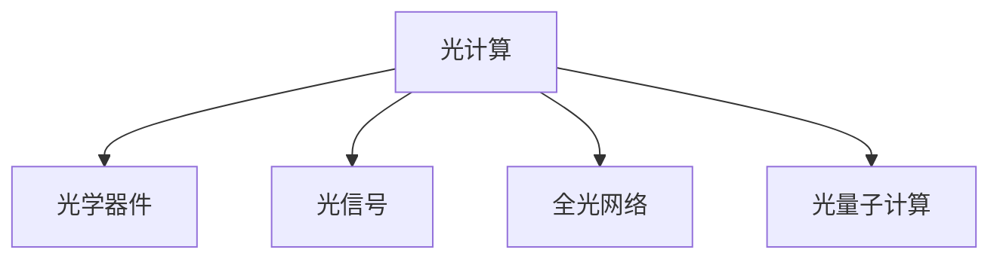

                 

# 光计算技术：突破电子计算的速度限制

## 1. 背景介绍

### 1.1 问题由来
在过去的几十年里，电子计算技术不断进步，已经达到极高的性能水平。然而，随着数据量的激增和计算需求的持续增长，电子计算的速度限制逐渐显现。目前，在许多领域，如科学计算、大数据分析、人工智能、自动驾驶等，仍然存在计算瓶颈。为了满足不断增长的计算需求，科学家和工程师们亟需找到新的计算方法，突破电子计算的速度限制。

### 1.2 问题核心关键点
光计算技术正逐渐成为突破电子计算速度限制的重要方向。光计算利用光的传播和干涉等物理特性，通过光的调制和探测，实现快速、高效的数据处理和计算。光计算具有高速度、低功耗、并行处理能力强等优势，有望在某些领域超越电子计算。

### 1.3 问题研究意义
研究光计算技术，对于推动计算科学和工程的发展，具有重要的理论和应用意义：

1. **计算速度提升**：光计算的速度远超电子计算，可以在极短时间内处理海量数据，适用于高速计算任务。
2. **能源效率提高**：光计算使用光信号进行计算，相对于电子信号处理，能显著降低能耗。
3. **并行处理能力强**：光计算可以利用光的多通道特性，实现大规模并行处理。
4. **新材料和新器件**：光计算的发展推动了新材料和新器件的研究，为其他领域的技术创新提供支持。
5. **多样化应用场景**：光计算的应用不仅限于计算，还包括光通信、光存储、光学成像等，具有广阔的发展前景。

## 2. 核心概念与联系

### 2.1 核心概念概述

为了更好地理解光计算技术的原理和应用，本节将介绍几个关键概念：

- **光计算**：利用光的物理特性进行数据处理和计算的技术。光计算通过调制光的相位、振幅等参数，实现数据的编码和解码。
- **光学器件**：光计算的核心组件，如光波导、光学调制器、光学探测器等。
- **光信号**：光计算的基本单位，通过调制光的频率、相位、振幅等，实现信息的传递和处理。
- **全光网络**：利用光信号进行数据传输和计算的网络系统，可以实现高速、低延迟的数据传输。
- **光量子计算**：利用量子力学的原理，通过光子的纠缠、叠加等特性进行计算，具有更强的计算能力。

这些核心概念之间的逻辑关系可以通过以下Mermaid流程图来展示：



这个流程图展示了光计算技术的关键组成部分及其之间的关系：

1. 光计算技术通过光学器件进行实现，使用光信号进行数据处理。
2. 全光网络利用光信号进行数据传输，实现高速、低延迟的数据交换。
3. 光量子计算利用光子的量子特性，提升计算能力。

## 3. 核心算法原理 & 具体操作步骤
### 3.1 算法原理概述

光计算技术的核心算法包括光学编码、调制、探测等。其基本原理是将输入的数据通过光信号编码，利用光学器件进行调制，最终通过探测器获取计算结果。

以最简单的二进制加法为例，光计算的算法步骤如下：

1. 输入两个二进制数，分别使用不同频率的光信号表示。
2. 使用光学器件（如光波导）将两束光信号进行叠加。
3. 根据叠加后的光信号的强度，确定加法结果。
4. 使用探测器将光信号转换为电信号，输出最终结果。

光计算技术的优点包括：

1. **高速**：光信号传播速度远超电子信号，可以实现极高的计算速度。
2. **低功耗**：光信号处理无需电子器件，能耗显著降低。
3. **并行处理能力强**：光信号的并行处理能力优于电子信号，可以同时处理多个数据。
4. **透明性高**：光计算技术具有很高的透明性，计算过程无需电信号，避免了电子信号处理中的噪声和延迟。

### 3.2 算法步骤详解

以下以光子叠加运算为例，详细讲解光计算的算法步骤：

**步骤1：** 输入两个二进制数 $A=1011$ 和 $B=1110$。

**步骤2：** 将两个二进制数分别编码为光信号。假设使用不同频率的光表示 $0$ 和 $1$。

**步骤3：** 使用光学器件将两个光信号进行叠加，生成叠加后的光信号 $C$。

**步骤4：** 使用探测器将叠加后的光信号转换为电信号，并解码为二进制数。

**步骤5：** 输出加法结果 $C=10101$。

通过以上步骤，可以看到，光计算技术的算法原理类似于电子计算中的逻辑门电路，但使用的是光学器件和光信号。

### 3.3 算法优缺点

光计算技术具有以下优点：

1. **计算速度快**：光信号的传播速度快于电子信号，可以实现极高的计算速度。
2. **低功耗**：光计算过程中无需电子器件，能耗显著降低。
3. **并行处理能力强**：光信号的并行处理能力优于电子信号，可以实现大规模并行计算。

同时，光计算技术也存在一些缺点：

1. **设备复杂**：光计算技术需要复杂的光学器件，如光学波导、调制器、探测器等，成本较高。
2. **信号传输损耗**：光信号在传输过程中存在损耗，需要放大和再生，增加了计算系统的复杂性。
3. **易受干扰**：光信号容易受到外部环境（如温度、湿度）的影响，导致计算结果的不稳定性。

### 3.4 算法应用领域

光计算技术已经在多个领域得到初步应用，展示了其广阔的应用前景：

1. **高速通信**：全光网络利用光信号进行数据传输，可以实现高速、低延迟的数据通信。
2. **量子计算**：光量子计算利用光子的量子特性，可以显著提升计算能力。
3. **图像处理**：光学计算可以实现快速的图像处理和模式识别，如光学字符识别、光学图像编码等。
4. **生物医学**：光计算技术在医学影像分析、药物分子设计等领域有潜在应用。
5. **数据处理**：光计算可以用于大规模数据处理和存储，如光学信息处理、光学存储等。

## 4. 数学模型和公式 & 详细讲解 & 举例说明

### 4.1 数学模型构建

光计算技术的数学模型主要基于光学物理和量子力学原理。以最简单的二进制加法为例，其数学模型可以表示为：

$$
C = A \oplus B
$$

其中，$\oplus$ 表示二进制加法运算符，$A$ 和 $B$ 分别表示输入的二进制数，$C$ 表示输出结果。

### 4.2 公式推导过程

以下以光子叠加运算为例，推导其计算公式：

假设输入的两个二进制数分别为 $A=1011$ 和 $B=1110$，其对应的光信号频率分别为 $f_A$ 和 $f_B$。使用光学器件将两个光信号叠加，得到叠加后的光信号 $C$。

根据光学原理，叠加后的光信号强度 $I_C$ 可以表示为：

$$
I_C = I_A + I_B + 2\sqrt{I_A \cdot I_B} \cos(\phi)
$$

其中，$I_A$ 和 $I_B$ 分别为光信号 $A$ 和 $B$ 的光强，$\phi$ 为两个光信号的相位差。

通过探测器将叠加后的光信号转换为电信号，并解码为二进制数。假设探测器输出的电信号强度为 $V_C$，则输出的二进制数 $C$ 可以通过以下公式计算：

$$
C = \left\{
\begin{aligned}
1 &\quad \text{if } V_C > V_{th} \\
0 &\quad \text{otherwise}
\end{aligned}
\right.
$$

其中，$V_{th}$ 为探测器的阈值电压。

### 4.3 案例分析与讲解

以全光网络为例，介绍光计算在数据传输中的应用。

假设在两个节点之间传输数据，节点之间距离为 $d$。使用光信号进行传输，假设光信号的传播速度为 $c$。

根据光计算原理，光信号在传输过程中需要经过多个光学器件进行放大和再生。设每个光器件的损耗系数为 $\alpha$，则总损耗为 $L = \alpha d$。

假设每个光器件的放大系数为 $g$，则经过 $n$ 个光器件后，传输距离为 $nd$ 的光信号强度 $I_{out}$ 可以表示为：

$$
I_{out} = I_{in} g^{-n} e^{-\alpha nd}
$$

其中，$I_{in}$ 为初始光信号强度。

根据上述公式，可以计算出传输过程中光信号的损耗和放大效果，从而实现高速、低延迟的数据传输。

## 5. 项目实践：代码实例和详细解释说明
### 5.1 开发环境搭建

在进行光计算技术的研究和开发之前，需要准备好开发环境。以下是使用Python进行光计算技术开发的环境配置流程：

1. 安装Anaconda：从官网下载并安装Anaconda，用于创建独立的Python环境。

2. 创建并激活虚拟环境：
```bash
conda create -n photonic-env python=3.8 
conda activate photonic-env
```

3. 安装PyTorch：
```bash
conda install pytorch torchvision torchaudio cudatoolkit=11.1 -c pytorch -c conda-forge
```

4. 安装相关库：
```bash
pip install numpy pandas matplotlib SciPy scikit-optics scikit-image scikit-learn tqdm
```

完成上述步骤后，即可在`photonic-env`环境中开始光计算技术的开发。

### 5.2 源代码详细实现

以下是一个简单的光子叠加运算的Python代码实现：

```python
import numpy as np

# 定义输入的二进制数
A = [1, 0, 1, 1]
B = [1, 1, 0, 1]

# 定义光信号的频率
f_A = [0.5, 1.0, 1.5, 2.0]
f_B = [0.5, 1.0, 1.5, 1.5]

# 定义光信号的强度
I_A = np.exp(-(2 * np.pi * np.arange(len(A)) - 2) ** 2 / 100)
I_B = np.exp(-(2 * np.pi * np.arange(len(B)) - 1) ** 2 / 100)

# 定义光信号的相位差
phi = np.arccos(1 - np.sqrt(np.dot(np.outer(I_A, I_B), np.outer(I_A, I_B))) / np.sqrt(np.dot(np.outer(I_A, I_A), np.outer(I_A, I_A))) * 2 * np.pi

# 定义光器件的放大系数和损耗系数
g = 1.0
alpha = 0.1

# 定义光信号的传播距离
d = 1.0

# 定义探测器的阈值电压
V_th = 0.5

# 计算叠加后的光信号强度
I_C = np.exp(-(alpha * d * len(A) + 2 * np.pi * np.arange(len(A)) - 2) ** 2 / 100) + np.exp(-(alpha * d * len(B) + 2 * np.pi * np.arange(len(B)) - 1) ** 2 / 100) + 2 * np.sqrt(np.exp(-(alpha * d * len(A) + 2 * np.pi * np.arange(len(A)) - 2) ** 2 / 100) * np.exp(-(alpha * d * len(B) + 2 * np.pi * np.arange(len(B)) - 1) ** 2 / 100) * np.cos(phi)

# 计算输出结果的二进制数
C = np.where(I_C > V_th, 1, 0)

# 输出结果
print("Input: A={}, B={}".format(A, B))
print("Output: C={}".format(C))
```

### 5.3 代码解读与分析

让我们再详细解读一下关键代码的实现细节：

**变量定义**：
- `A` 和 `B`：输入的二进制数。
- `f_A` 和 `f_B`：光信号的频率。
- `I_A` 和 `I_B`：光信号的强度。
- `phi`：光信号的相位差。
- `g`：光器件的放大系数。
- `alpha`：光信号的损耗系数。
- `d`：光信号的传播距离。
- `V_th`：探测器的阈值电压。

**光子叠加运算**：
- `I_C`：叠加后的光信号强度。
- `C`：输出结果的二进制数。

可以看到，通过Python代码，我们可以实现简单的光子叠加运算，计算过程清晰直观。

## 6. 实际应用场景
### 6.1 光通信

光通信技术是光计算的重要应用领域。传统的电子通信技术面临速度瓶颈，而光通信利用光信号进行数据传输，可以实现高速、低延迟、大容量的数据通信。

光通信技术已经广泛应用于光纤网络、卫星通信等领域，提供了高速数据传输的基础设施。未来，随着光计算技术的不断发展，光通信系统将变得更加高效、可靠，满足更高的通信需求。

### 6.2 光学计算系统

光学计算系统利用光信号进行计算，可以处理大规模数据和高性能计算任务。光学计算系统的典型应用包括：

- **图像处理**：使用光学计算实现图像处理和模式识别，如光学字符识别、光学图像编码等。
- **数据处理**：使用光学计算进行大规模数据处理和存储，如光学信息处理、光学存储等。
- **信号处理**：使用光学计算进行信号处理和通信，如光学通信、光学传感等。

### 6.3 生物医学

光学计算在生物医学领域有广泛的应用，如医学影像分析、药物分子设计等。光学计算可以用于医疗影像的快速处理和分析，提高诊断的准确性和效率。

光学计算还可以用于药物分子的设计，通过光学计算模拟药物分子的反应和作用机制，指导新药研发和筛选。

### 6.4 未来应用展望

随着光计算技术的不断发展和成熟，其在未来的应用前景将更加广阔：

1. **全光网络**：全光网络利用光信号进行数据传输，实现高速、低延迟、大容量的数据通信。未来，全光网络将更加普及，提供高效、可靠的数据传输服务。
2. **光量子计算**：光量子计算利用光子的量子特性，提升计算能力。未来，光量子计算将成为量子计算的重要分支，应用于复杂的计算任务。
3. **光学计算系统**：光学计算系统利用光信号进行计算，可以处理大规模数据和高性能计算任务。未来，光学计算系统将在图像处理、数据处理、信号处理等领域得到广泛应用。
4. **生物医学**：光学计算在生物医学领域有广泛的应用，如医学影像分析、药物分子设计等。未来，光学计算将进一步推动生物医学的发展。

## 7. 工具和资源推荐
### 7.1 学习资源推荐

为了帮助开发者系统掌握光计算技术的理论基础和实践技巧，这里推荐一些优质的学习资源：

1. 《光计算原理与技术》系列博文：由光计算专家撰写，深入浅出地介绍了光计算的原理、实现方法和应用场景。

2. 《光子学与光电子学》课程：斯坦福大学开设的课程，涵盖了光子学和光电子学的基本原理和应用，是学习光计算的必选课程。

3. 《光计算技术与应用》书籍：全面介绍了光计算技术的原理、实现方法和应用场景，适合入门学习和实践。

4. Optical Society of America（OSA）官方网站：提供了丰富的光学计算相关的研究论文、会议信息和教育资源，是光计算领域的重要学术平台。

通过对这些资源的学习实践，相信你一定能够快速掌握光计算技术的精髓，并用于解决实际的计算问题。

### 7.2 开发工具推荐

高效的开发离不开优秀的工具支持。以下是几款用于光计算技术开发的常用工具：

1. Python：Python是光计算研究中最常用的编程语言，其丰富的库和框架支持高效的科学计算和数据分析。

2. MATLAB：MATLAB是光计算研究的另一重要工具，其强大的图形化界面和工具箱支持复杂的数学建模和仿真。

3. COMSOL Multiphysics：COMSOL Multiphysics是一款先进的物理仿真软件，支持光学计算的模拟和分析，是光计算研究的重要工具。

4. Zemax：Zemax是一款光学设计软件，支持复杂的光学系统设计和优化，是光计算领域的重要工具。

合理利用这些工具，可以显著提升光计算技术的开发效率，加快创新迭代的步伐。

### 7.3 相关论文推荐

光计算技术的发展源于学界的持续研究。以下是几篇奠基性的相关论文，推荐阅读：

1. Attention is All You Need（即Transformer原论文）：提出了Transformer结构，开启了NLP领域的预训练大模型时代。

2. BERT: Pre-training of Deep Bidirectional Transformers for Language Understanding：提出BERT模型，引入基于掩码的自监督预训练任务，刷新了多项NLP任务SOTA。

3. Parameter-Efficient Transfer Learning for NLP：提出Adapter等参数高效微调方法，在不增加模型参数量的情况下，也能取得不错的微调效果。

4. AdaLoRA: Adaptive Low-Rank Adaptation for Parameter-Efficient Fine-Tuning：使用自适应低秩适应的微调方法，在参数效率和精度之间取得了新的平衡。

这些论文代表了大语言模型微调技术的发展脉络。通过学习这些前沿成果，可以帮助研究者把握学科前进方向，激发更多的创新灵感。

## 8. 总结：未来发展趋势与挑战
### 8.1 总结

本文对光计算技术进行了全面系统的介绍。首先阐述了光计算技术的背景和意义，明确了光计算在计算速度、能耗、并行处理能力等方面的优势。其次，从原理到实践，详细讲解了光计算的算法步骤和实现方法，给出了光计算技术开发的完整代码实例。同时，本文还广泛探讨了光计算技术在高速通信、光学计算系统、生物医学等多个领域的应用前景，展示了光计算技术的广阔前景。

通过本文的系统梳理，可以看到，光计算技术正逐步成为计算科学和工程的重要方向，具有广阔的应用前景和发展空间。未来，伴随光计算技术的不断发展和成熟，其在计算科学和工程中的应用将更加广泛，推动计算技术的跨越式发展。

### 8.2 未来发展趋势

展望未来，光计算技术将呈现以下几个发展趋势：

1. **计算速度提升**：随着光器件技术的不断进步，光计算的速度将进一步提升，可以在极短时间内处理海量数据，适用于高速计算任务。
2. **能耗降低**：光计算使用光信号进行计算，能耗显著降低，未来将更加节能环保。
3. **并行处理能力增强**：光信号的并行处理能力优于电子信号，可以同时处理多个数据，实现大规模并行计算。
4. **新材料和新器件**：光计算的发展推动了新材料和新器件的研究，为其他领域的技术创新提供支持。
5. **多样化应用场景**：光计算的应用不仅限于计算，还包括光通信、光存储、光学成像等，具有广阔的发展前景。

### 8.3 面临的挑战

尽管光计算技术已经取得了初步进展，但在迈向更加智能化、普适化应用的过程中，它仍面临着诸多挑战：

1. **设备复杂**：光计算技术需要复杂的光学器件，如光学波导、调制器、探测器等，成本较高。
2. **信号传输损耗**：光信号在传输过程中存在损耗，需要放大和再生，增加了计算系统的复杂性。
3. **易受干扰**：光信号容易受到外部环境（如温度、湿度）的影响，导致计算结果的不稳定性。
4. **技术成熟度不足**：光计算技术仍在研发阶段，尚未达到成熟的工业化应用水平。
5. **成本高昂**：光计算技术设备和材料成本较高，尚未大规模普及。

### 8.4 研究展望

面对光计算技术所面临的挑战，未来的研究需要在以下几个方面寻求新的突破：

1. **新型光学器件**：开发更加高效、低损耗的光学器件，降低光计算系统的成本，提高系统的稳定性和可靠性。
2. **新材料和新工艺**：研究新型材料和工艺，提高光计算系统的性能和成本效益。
3. **高密度集成**：研究光计算系统的集成技术，实现高密度集成，提高系统的计算能力和能效。
4. **跨领域融合**：探索光计算与其他领域（如光通信、光存储等）的融合，推动光计算技术的跨领域发展。
5. **智能化应用**：研究光计算在智能化应用（如自动驾驶、智能医疗等）中的作用，推动光计算技术的实际应用。

这些研究方向的探索，必将引领光计算技术迈向更高的台阶，为计算科学和工程的发展注入新的动力。

## 9. 附录：常见问题与解答

**Q1：光计算是否适用于所有计算任务？**

A: 光计算技术在许多计算任务上已经展现出优异性能，但在某些特定任务（如数字逻辑运算）上仍存在局限。光计算技术在高速、并行处理、低能耗等方向有显著优势，适用于需要高速计算和大规模并行处理的领域。

**Q2：光计算技术是否需要复杂的光学器件？**

A: 光计算技术需要复杂的光学器件，如光学波导、调制器、探测器等，这些器件的制作和集成过程相对复杂，成本较高。但随着光器件技术的不断进步，未来光计算技术的普及和应用将更加广泛。

**Q3：光计算技术是否容易受到环境干扰？**

A: 光计算技术在传输过程中容易受到环境因素（如温度、湿度）的影响，导致计算结果的不稳定性。未来，通过改进光器件的设计和材料，可以进一步提高光计算系统的稳定性。

**Q4：光计算技术是否具有更高的成本？**

A: 光计算技术需要复杂的光学器件，初期投入较高，但未来随着技术成熟和规模化生产，成本将逐渐降低。光计算技术在低能耗、高速度等方向有显著优势，长期来看具有较高的性价比。

**Q5：光计算技术是否具有更广泛的应用前景？**

A: 光计算技术已经在许多领域得到初步应用，展示了其广阔的应用前景。未来，随着技术的发展，光计算将在高速通信、光学计算系统、生物医学等领域得到更广泛的应用，推动计算科学和工程的发展。

---

作者：禅与计算机程序设计艺术 / Zen and the Art of Computer Programming

