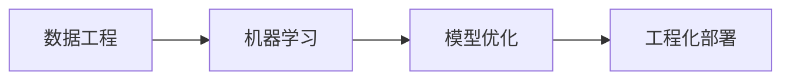

                 

## 1. 背景介绍

在当今数字化时代，人工智能(AI)已经成为推动各行各业创新和效率提升的关键技术。随着大数据、云计算和自然语言处理(NLP)等技术的迅猛发展，AI技术的应用范围已经从传统的信息检索、图像识别等领域扩展到更广泛的数据分析和智能决策中。然而，构建一个高效的AI系统不仅需要先进的技术模型，还需要从数据获取、处理、模型训练到模型部署的全面支撑。本文旨在系统性地探讨全栈AI开发的各个环节，帮助开发者构建高性能、可扩展的AI系统。

## 2. 核心概念与联系

### 2.1 核心概念概述

全栈AI开发是一个从数据获取、处理、模型训练到模型部署的完整流程，涵盖了数据工程、机器学习、模型优化、工程化部署等各个方面。

- **数据工程(Data Engineering)**：负责数据的采集、清洗、转换和存储，是构建高质量数据模型的基础。
- **机器学习(Machine Learning, ML)**：包括模型选择、训练、调参、评估等步骤，是AI系统的心脏。
- **模型优化(Model Optimization)**：包括模型剪枝、量化、蒸馏等方法，目的是在保证模型性能的同时，减小模型的计算和存储需求。
- **工程化部署(Engineering Deployment)**：包括模型集成、测试、上线、监控等步骤，确保模型能够在生产环境中稳定运行。

### 2.2 核心概念原理和架构的 Mermaid 流程图



这个流程图展示了全栈AI开发的四个关键环节：数据工程、机器学习、模型优化和工程化部署，以及它们之间的相互作用。数据工程为机器学习提供高质量的数据支持，机器学习产生模型，模型优化提升模型性能，工程化部署确保模型在实际环境中的应用。

## 3. 核心算法原理 & 具体操作步骤

### 3.1 算法原理概述

全栈AI开发的核心算法包括数据预处理、模型训练、模型压缩和模型部署等。

- **数据预处理**：通过清洗、归一化、特征工程等步骤，将原始数据转换为适合机器学习模型处理的格式。
- **模型训练**：使用各种优化算法，如梯度下降、Adam等，在标注数据集上训练模型，优化模型参数。
- **模型压缩**：通过剪枝、量化、蒸馏等方法，减小模型的计算和存储需求，同时保持模型性能。
- **模型部署**：将训练好的模型集成到生产环境中，并进行持续监控和优化。

### 3.2 算法步骤详解

#### 3.2.1 数据预处理

数据预处理是构建高质量数据模型的第一步。数据预处理的流程大致如下：

1. **数据采集**：从各种数据源获取数据，如数据库、API接口、文件系统等。
2. **数据清洗**：去除噪音、重复和异常数据，确保数据的质量。
3. **数据转换**：将数据转换为适合机器学习模型处理的格式，如归一化、标准化、特征提取等。
4. **数据划分**：将数据划分为训练集、验证集和测试集，通常采用交叉验证方法。

#### 3.2.2 模型训练

模型训练是AI开发的核心步骤。训练过程一般包括以下几个步骤：

1. **选择模型**：根据任务类型选择合适的模型，如线性回归、决策树、神经网络等。
2. **设置超参数**：选择合适的学习率、批大小、迭代轮数等超参数。
3. **训练模型**：使用优化算法和标注数据集，在模型上迭代训练，优化模型参数。
4. **评估模型**：在验证集上评估模型性能，调整超参数，直到模型收敛。

#### 3.2.3 模型压缩

模型压缩是在保证模型性能的同时，减小模型的计算和存储需求。常用的压缩方法包括：

1. **剪枝**：去掉模型中不重要的权重，减少模型参数量。
2. **量化**：将模型中的浮点数参数转换为定点数，减小内存占用。
3. **蒸馏**：通过知识蒸馏，将大型模型的知识转移到小型模型中，减小计算资源消耗。

#### 3.2.4 模型部署

模型部署是将训练好的模型集成到生产环境中的步骤。部署过程一般包括以下几个步骤：

1. **模型集成**：将训练好的模型集成到应用程序中。
2. **测试验证**：对集成后的应用进行测试验证，确保模型能够正确运行。
3. **上线部署**：将应用部署到生产环境中，并设置持续监控。
4. **持续优化**：根据生产环境中的反馈数据，对模型进行持续优化。

### 3.3 算法优缺点

全栈AI开发具有以下优点：

- **端到端流程**：从数据处理到模型部署，全栈AI开发提供了一个完整的流程，确保每个环节的质量和效率。
- **高效性**：通过优化各个环节，可以显著提高AI系统的开发效率和性能。
- **可扩展性**：全栈AI开发支持多种数据源和模型，可以灵活应对不同类型的问题。

同时，全栈AI开发也存在以下局限性：

- **复杂性高**：涉及多个环节，每个环节都需要专业知识和技能，对开发者的要求较高。
- **技术门槛高**：需要掌握多种技术和工具，开发难度较大。
- **资源消耗大**：数据采集、模型训练和模型部署等环节需要大量的计算和存储资源。

尽管存在这些局限性，但全栈AI开发仍然是目前构建高性能AI系统的最主流方式，被广泛应用于金融、医疗、电商等多个领域。

### 3.4 算法应用领域

全栈AI开发已经在多个领域取得了广泛应用，以下是几个典型案例：

- **金融风控**：通过全栈AI开发，构建基于信用评分、风险评估的智能风控系统，提升贷款审批效率和风险控制能力。
- **医疗诊断**：使用全栈AI开发，构建基于影像诊断、病历分析的智能辅助诊断系统，提高诊断准确率和诊疗效率。
- **智能客服**：通过全栈AI开发，构建基于NLP和机器学习的智能客服系统，提升客户咨询体验和服务质量。
- **推荐系统**：使用全栈AI开发，构建基于用户行为和商品特征的智能推荐系统，提升用户购物体验和商超销售额。

## 4. 数学模型和公式 & 详细讲解 & 举例说明

### 4.1 数学模型构建

在全栈AI开发中，常用的数学模型包括线性回归、决策树、神经网络等。这里以神经网络为例，介绍全栈AI开发中常用的数学模型构建方法。

### 4.2 公式推导过程

神经网络的基本公式可以表示为：

$$
y = \sum_{i=1}^{n} w_i x_i + b
$$

其中，$w_i$ 为权重，$x_i$ 为输入特征，$b$ 为偏置项，$y$ 为输出结果。神经网络的训练目标是通过梯度下降等优化算法，最小化预测值与真实值之间的误差。

### 4.3 案例分析与讲解

以图像分类任务为例，介绍如何构建和训练神经网络模型。首先，需要将图像数据转换为神经网络能够处理的张量形式：

```python
import torch
from torchvision import transforms
from torchvision.datasets import CIFAR10

transform = transforms.Compose([
    transforms.ToTensor(),
    transforms.Normalize((0.5, 0.5, 0.5), (0.5, 0.5, 0.5))
])

train_dataset = CIFAR10(root='./data', train=True, download=True, transform=transform)
test_dataset = CIFAR10(root='./data', train=False, download=True, transform=transform)

# 构建神经网络模型
model = torch.nn.Sequential(
    torch.nn.Conv2d(3, 32, kernel_size=3, padding=1),
    torch.nn.ReLU(),
    torch.nn.MaxPool2d(kernel_size=2, stride=2),
    torch.nn.Linear(32*8*8, 10),
    torch.nn.LogSoftmax(dim=1)
)

# 设置优化器和损失函数
optimizer = torch.optim.Adam(model.parameters(), lr=0.001)
criterion = torch.nn.NLLLoss()

# 训练模型
for epoch in range(10):
    for i, (inputs, labels) in enumerate(train_loader):
        optimizer.zero_grad()
        outputs = model(inputs)
        loss = criterion(outputs, labels)
        loss.backward()
        optimizer.step()
```

## 5. 项目实践：代码实例和详细解释说明

### 5.1 开发环境搭建

全栈AI开发的开发环境搭建主要包括Python环境、深度学习框架和模型库的安装。

1. 安装Python：可以从官网下载Python安装包，安装最新版本。
2. 安装深度学习框架：如TensorFlow、PyTorch、Keras等，选择适合的项目框架。
3. 安装模型库：如TensorFlow Hub、Keras应用程序接口(Keras API)等，方便模型下载和应用。

### 5.2 源代码详细实现

以下是一个基于PyTorch的图像分类项目的源代码实现，包括数据预处理、模型训练、模型压缩和模型部署等环节。

```python
import torch
from torchvision import transforms
from torchvision.datasets import CIFAR10
from torch.utils.data import DataLoader
from torch.nn import Sequential, Conv2d, ReLU, MaxPool2d, Linear, LogSoftmax
from torch.optim import Adam
from torch.nn.functional import NLLLoss

# 数据预处理
transform = transforms.Compose([
    transforms.ToTensor(),
    transforms.Normalize((0.5, 0.5, 0.5), (0.5, 0.5, 0.5))
])

train_dataset = CIFAR10(root='./data', train=True, download=True, transform=transform)
test_dataset = CIFAR10(root='./data', train=False, download=True, transform=transform)

# 模型训练
model = Sequential(
    Conv2d(3, 32, kernel_size=3, padding=1),
    ReLU(),
    MaxPool2d(kernel_size=2, stride=2),
    Linear(32*8*8, 10),
    LogSoftmax(dim=1)
)

optimizer = Adam(model.parameters(), lr=0.001)
criterion = NLLLoss()

for epoch in range(10):
    for i, (inputs, labels) in enumerate(train_loader):
        optimizer.zero_grad()
        outputs = model(inputs)
        loss = criterion(outputs, labels)
        loss.backward()
        optimizer.step()

# 模型压缩
from torchvision.models import resnet18
from torch import nn, optim
from torch.nn import functional as F
from torchvision.datasets import CIFAR10

# 加载预训练模型
model = resnet18(pretrained=True)
for param in model.parameters():
    param.requires_grad = False

# 修改顶层线性层
model.fc = nn.Linear(512, 10)

# 设置优化器和损失函数
optimizer = optim.SGD(model.fc.parameters(), lr=0.01, momentum=0.9)
criterion = nn.CrossEntropyLoss()

# 训练压缩后的模型
for epoch in range(10):
    for i, (inputs, labels) in enumerate(train_loader):
        optimizer.zero_grad()
        outputs = model(inputs)
        loss = criterion(outputs, labels)
        loss.backward()
        optimizer.step()

# 模型部署
# 将训练好的模型导出为模型文件
torch.save(model.state_dict(), 'model.pth')

# 加载模型并进行推理
model = torch.load('model.pth')
inputs = torch.randn(1, 3, 32, 32)
outputs = model(inputs)
```

### 5.3 代码解读与分析

以上代码实现了一个基于PyTorch的图像分类项目，包括数据预处理、模型训练、模型压缩和模型部署等环节。具体解读如下：

- **数据预处理**：使用`torchvision`库进行数据加载和预处理，将原始CIFAR10数据集转换为Tensor张量，并进行标准化。
- **模型训练**：定义神经网络模型，使用Adam优化器和交叉熵损失函数进行训练，在10个epoch内完成模型训练。
- **模型压缩**：加载预训练的ResNet18模型，去除不必要的参数，只保留顶层线性层，并使用SGD优化器和交叉熵损失函数进行训练。
- **模型部署**：将训练好的模型保存为文件，并在后续应用中加载进行推理。

## 6. 实际应用场景

### 6.1 金融风控

全栈AI开发在金融风控中的应用主要集中在信用评分、风险评估等方面。通过全栈AI开发，可以构建基于历史交易数据、个人信用记录等信息的智能风控系统，提升贷款审批效率和风险控制能力。

### 6.2 医疗诊断

全栈AI开发在医疗诊断中的应用主要集中在影像诊断、病历分析等方面。通过全栈AI开发，可以构建基于影像数据、病历信息的智能辅助诊断系统，提高诊断准确率和诊疗效率。

### 6.3 智能客服

全栈AI开发在智能客服中的应用主要集中在NLP和机器学习方面。通过全栈AI开发，可以构建基于NLP和机器学习的智能客服系统，提升客户咨询体验和服务质量。

### 6.4 推荐系统

全栈AI开发在推荐系统中的应用主要集中在用户行为分析、商品特征提取等方面。通过全栈AI开发，可以构建基于用户行为和商品特征的智能推荐系统，提升用户购物体验和商超销售额。

## 7. 工具和资源推荐

### 7.1 学习资源推荐

为了帮助开发者系统掌握全栈AI开发的技术基础和实践技巧，这里推荐一些优质的学习资源：

1. Coursera《深度学习专项课程》：由斯坦福大学Andrew Ng教授主讲，涵盖深度学习基础、卷积神经网络、循环神经网络等主题。
2. Udacity《人工智能工程师纳米学位》：涵盖机器学习、深度学习、自然语言处理等多个领域，提供实践项目和作业。
3. Google AI开发者文档：提供大量深度学习框架的API文档和示例代码，帮助开发者快速上手。
4. Kaggle：提供丰富的数据集和机器学习竞赛，帮助开发者提高实践能力。
5. TensorFlow官方文档：提供详细的框架文档和示例代码，涵盖深度学习模型的构建和优化。

通过对这些资源的学习实践，相信你一定能够快速掌握全栈AI开发的技术精髓，并用于解决实际的AI问题。

### 7.2 开发工具推荐

全栈AI开发的开发工具涵盖数据处理、模型训练、模型压缩和模型部署等多个环节。以下是几款常用的开发工具：

1. Jupyter Notebook：一个交互式的Python开发环境，支持代码编写、数据可视化和模型调试。
2. TensorBoard：TensorFlow配套的可视化工具，可实时监测模型训练状态，提供丰富的图表呈现方式。
3. AWS SageMaker：亚马逊提供的云服务平台，提供深度学习模型训练、模型部署和监控等功能。
4. Google Cloud AI Platform：谷歌提供的云服务平台，提供深度学习模型训练、模型部署和监控等功能。
5. Microsoft Azure ML：微软提供的云服务平台，提供深度学习模型训练、模型部署和监控等功能。

合理利用这些工具，可以显著提升全栈AI开发的效率和质量，加速创新迭代的步伐。

### 7.3 相关论文推荐

全栈AI开发涉及多个领域，涵盖数据工程、机器学习、模型优化和工程化部署等多个方面。以下是几篇奠基性的相关论文，推荐阅读：

1. "The Impact of Data Quality on Machine Learning Performance"（数据质量对机器学习性能的影响）：探讨数据采集、清洗和预处理对模型性能的影响。
2. "Understanding the difficulty of training deep feedforward neural networks"（理解训练深度前馈神经网络的困难）：分析深度神经网络训练中的梯度消失问题，提出解决策略。
3. "Knowledge Distillation"（知识蒸馏）：介绍知识蒸馏方法，将大型模型的知识转移到小型模型中，提升模型性能。
4. "Model Compression: A Survey"（模型压缩：综述）：总结各种模型压缩方法，如剪枝、量化、蒸馏等，提升模型性能和可扩展性。
5. "A Survey on Transfer Learning"（迁移学习的综述）：总结迁移学习的方法和应用，提升模型在不同任务上的泛化能力。

这些论文代表了大规模AI开发的技术进展，通过学习这些前沿成果，可以帮助研究者把握学科前进方向，激发更多的创新灵感。

## 8. 总结：未来发展趋势与挑战

### 8.1 研究成果总结

全栈AI开发已经成为构建高性能AI系统的核心技术，广泛应用于金融、医疗、电商等多个领域。通过系统化的数据工程、机器学习、模型优化和工程化部署，可以显著提升AI系统的开发效率和性能。

### 8.2 未来发展趋势

展望未来，全栈AI开发将呈现以下几个发展趋势：

1. **自动化和智能化**：随着自动机器学习和自动化超参优化技术的发展，全栈AI开发将更加智能化，减少人工干预，提升开发效率。
2. **跨领域融合**：全栈AI开发将与其他AI技术如自然语言处理、计算机视觉、时间序列分析等进行更深入的融合，形成更全面、更强大的AI系统。
3. **模型轻量化**：模型压缩和优化技术将进一步发展，使得AI模型更加轻量化，适应移动和嵌入式设备的部署需求。
4. **数据和模型的可解释性**：数据和模型的可解释性将成为重要研究方向，提升AI系统的透明性和可信度。
5. **隐私保护和安全性**：随着AI系统的广泛应用，数据隐私和安全问题将受到更多关注，隐私保护和安全性将成为关键研究方向。

### 8.3 面临的挑战

尽管全栈AI开发已经取得了显著进展，但在迈向更加智能化、普适化应用的过程中，仍面临诸多挑战：

1. **数据获取和处理**：高质量数据获取和处理仍然是全栈AI开发的关键瓶颈。数据采集、清洗和预处理需要大量人力和资源投入。
2. **模型训练和优化**：深度学习模型的训练和优化需要大量的计算资源和时间。如何在保证模型性能的同时，优化训练和推理过程，是未来的重要研究方向。
3. **模型部署和监控**：模型部署和监控需要考虑系统架构、资源管理、异常检测等多个方面，实现稳定运行和持续优化。
4. **安全和隐私**：AI系统的安全和隐私问题将受到更多关注，数据隐私保护、模型安全性成为重要研究方向。

### 8.4 研究展望

未来的研究需要在以下几个方面寻求新的突破：

1. **自动化机器学习**：通过自动化机器学习技术，减少人工干预，提升模型构建和优化效率。
2. **跨领域融合**：将AI技术与各个领域的专业知识进行深度融合，形成更加全面、可靠的AI系统。
3. **模型轻量化**：开发更加高效、轻量化的模型压缩和优化技术，适应多种应用场景。
4. **数据和模型的可解释性**：提升数据和模型的可解释性，提高AI系统的透明性和可信度。
5. **安全和隐私**：在数据获取、存储、传输和处理等环节，加强数据隐私保护和模型安全性。

## 9. 附录：常见问题与解答

### 9.1 常见问题

1. **Q1: 全栈AI开发和传统的AI开发有哪些区别？**

A: 全栈AI开发从数据获取、处理、模型训练到模型部署，涵盖了AI开发的各个环节，是一个端到端的开发流程。传统的AI开发则通常只关注模型训练和优化，缺乏对数据和部署的考虑。

2. **Q2: 全栈AI开发需要掌握哪些技能？**

A: 全栈AI开发需要掌握Python编程、深度学习框架、数据处理、模型优化、模型部署等多方面的技能。

3. **Q3: 全栈AI开发中，数据预处理和模型训练哪个环节最重要？**

A: 数据预处理和模型训练都是全栈AI开发中的重要环节，没有哪个环节可以单独决定整个系统的性能。数据预处理决定了数据质量，模型训练决定了模型的准确性，两者缺一不可。

4. **Q4: 模型压缩和优化有哪些方法？**

A: 模型压缩和优化的方法包括剪枝、量化、蒸馏等。剪枝通过去掉不必要的权重，减少模型参数量；量化将浮点数参数转换为定点数，减小内存占用；蒸馏将大型模型的知识转移到小型模型中，提升模型性能。

5. **Q5: 模型部署有哪些注意事项？**

A: 模型部署需要注意模型性能、计算资源、系统架构、数据隐私等方面。选择合适的部署平台，设置合理的监控指标，确保模型能够稳定运行。

---

作者：禅与计算机程序设计艺术 / Zen and the Art of Computer Programming

