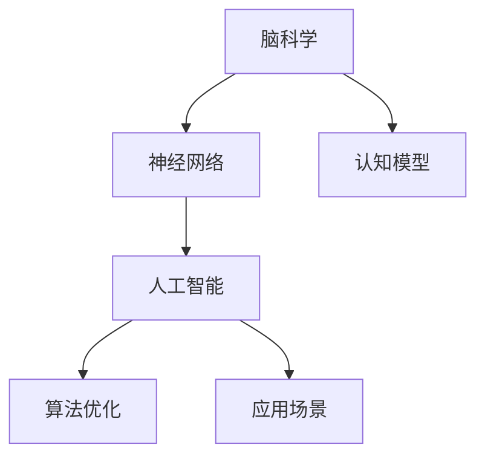

                 

# 全球脑与人工智能的共生关系探讨

> 关键词：脑科学,人工智能,神经网络,认知模型,算法优化,应用场景

## 1. 背景介绍

### 1.1 问题由来
近年来，随着人工智能(AI)技术的飞速发展，其与人类大脑的关系逐渐成为学术界和工业界关注的焦点。脑科学的研究成果也为人工智能的发展提供了重要的理论支持。全球脑与人工智能的共生关系，使得这两个领域更加紧密地融合在一起，共同推动了认知科学的进步。

### 1.2 问题核心关键点
脑科学和人工智能之间的共生关系主要体现在以下几个方面：
1. 脑科学为人工智能提供了认知模型的基础。通过模拟人脑神经网络的工作原理，可以开发出更加智能化的AI算法。
2. 人工智能技术为脑科学研究提供了新的工具和方法。例如，利用深度学习技术，可以更准确地分析和处理脑电信号。
3. 两者相互促进，共同推动了认知科学的发展。脑科学研究为AI算法优化提供了新的思路，AI技术也反过来提升了脑科学研究的效率。

## 2. 核心概念与联系

### 2.1 核心概念概述

为更好地理解全球脑与人工智能的共生关系，本节将介绍几个密切相关的核心概念：

- 脑科学(Brain Science)：研究人类大脑及其功能的科学，包括神经元、神经网络、认知过程等。
- 人工智能(Artificial Intelligence)：使用计算机模拟人类智能的领域，主要研究如何让机器具备感知、推理、学习等能力。
- 神经网络(Neural Networks)：模拟人脑神经元连接模式的计算模型，是实现人工智能的重要工具。
- 认知模型(Cognitive Models)：用于模拟人类认知过程的数学模型，广泛应用于语言处理、视觉识别等AI领域。
- 算法优化(Algorithm Optimization)：通过优化算法，提升AI模型的性能和效率，使其更接近真实的人类智能。
- 应用场景(Application Scenarios)：AI技术在不同领域的具体应用，如医疗、金融、教育等。

这些核心概念之间的逻辑关系可以通过以下Mermaid流程图来展示：



这个流程图展示了大脑与人工智能的主要概念及其之间的关系：

1. 脑科学提供了神经网络的基础，并启发了认知模型。
2. 神经网络是实现人工智能的关键工具，包含在人工智能的体系中。
3. 认知模型为人工智能提供了认知过程的数学模型，增强了AI的理解和推理能力。
4. 算法优化提升了AI算法的性能和效率，使其更贴近实际应用场景。
5. 应用场景展示了AI技术在不同领域的具体应用，推动了各行业的智能化进程。

## 3. 核心算法原理 & 具体操作步骤
### 3.1 算法原理概述

人工智能与脑科学之间的共生关系，本质上是通过神经网络模型和认知模型的优化，提升AI算法的智能水平。其核心思想是：通过模拟人脑的神经网络结构和认知过程，使AI算法具备更强的理解和推理能力。

形式化地，假设原始的神经网络模型为 $M_{\theta}$，其中 $\theta$ 为模型参数。通过脑科学研究成果，我们设计了新的认知模型 $C$，用于指导神经网络参数的优化。神经网络模型的训练目标为最小化经验风险：

$$
\theta^* = \mathop{\arg\min}_{\theta} \mathcal{L}(M_{\theta},C)
$$

其中 $\mathcal{L}$ 为神经网络模型在数据集上的损失函数，$C$ 为指导模型优化的认知模型。训练过程中，我们通过反向传播算法不断调整神经网络参数 $\theta$，使其在认知模型 $C$ 的指导下，尽可能地逼近理想模型。

### 3.2 算法步骤详解

基于脑科学的人工智能算法优化主要包括以下几个关键步骤：

**Step 1: 准备神经网络模型和认知模型**
- 选择合适的神经网络模型，如卷积神经网络(CNN)、循环神经网络(RNN)、长短期记忆网络(LSTM)等。
- 根据脑科学研究最新成果，设计合适的认知模型，如激活函数、损失函数、优化算法等。

**Step 2: 设计数据集和标注方式**
- 收集和标注与具体应用场景相关的数据集，确保数据的多样性和代表性。
- 使用脑科学研究中的认知模型，提取数据的关键特征，用于训练和评估神经网络模型。

**Step 3: 设定训练和评估指标**
- 根据具体任务的要求，设定训练集、验证集和测试集，确保模型的泛化能力。
- 选择适当的评估指标，如准确率、召回率、F1值等，用于评估神经网络模型的性能。

**Step 4: 训练和优化模型**
- 将神经网络模型和认知模型结合起来，使用训练集数据进行模型训练。
- 在训练过程中，不断调整模型参数，使其尽可能地符合认知模型的指导。
- 使用验证集数据，评估模型的泛化能力，及时调整训练策略。

**Step 5: 测试和部署**
- 在测试集上评估优化后的神经网络模型，与原始模型进行对比，评估性能提升。
- 将优化后的模型应用于实际场景中，部署到相应的应用系统中。
- 持续收集新数据，定期重新训练和优化模型，以适应数据分布的变化。

以上是基于脑科学的人工智能算法优化的基本流程。在实际应用中，还需要根据具体任务的特点，对每个环节进行优化设计，如改进训练目标函数，引入更多的正则化技术，搜索最优的超参数组合等，以进一步提升模型性能。

### 3.3 算法优缺点

基于脑科学的人工智能算法优化方法具有以下优点：
1. 模型更具智能性。通过引入脑科学研究成果，模型可以更好地模拟人脑的认知过程，提升理解和推理能力。
2. 算法更高效。认知模型可以指导神经网络模型的参数优化，提高训练速度和模型性能。
3. 应用场景更广泛。通过优化算法，AI技术可以应用于更多领域，如医疗、金融、教育等。

同时，该方法也存在一定的局限性：
1. 数据依赖性强。脑科学的研究成果需要大量高质量数据来验证，数据获取成本较高。
2. 模型复杂度高。神经网络模型的参数量巨大，训练和优化过程复杂。
3. 认知模型难以解释。脑科学研究成果通常较复杂，难以用传统方法进行解释和调试。
4. 缺乏通用性。不同领域的脑科学研究成果，可能需要设计不同的认知模型，难以通用。

尽管存在这些局限性，但就目前而言，基于脑科学的人工智能算法优化方法仍是最前沿的研究范式之一。未来相关研究的重点在于如何更好地融合脑科学和人工智能的最新成果，推动认知科学的进步。

### 3.4 算法应用领域

基于脑科学的人工智能算法优化方法已经在多个领域得到了广泛的应用，例如：

- 医疗诊断：利用深度学习技术，结合脑科学研究成果，开发智能辅助诊断系统。
- 金融风险管理：利用深度学习技术，结合脑科学研究成果，开发智能风险评估模型。
- 教育评估：利用深度学习技术，结合脑科学研究成果，开发智能学习评估系统。
- 工业智能制造：利用深度学习技术，结合脑科学研究成果，开发智能生产调度系统。
- 自动驾驶：利用深度学习技术，结合脑科学研究成果，开发智能驾驶决策系统。

除了上述这些经典应用外，人工智能技术还被创新性地应用到更多场景中，如智能客服、智能家居、智能物流等，为各行业带来了新的变革。随着脑科学和人工智能的不断进步，相信AI技术将在更广阔的应用领域大放异彩。

## 4. 数学模型和公式 & 详细讲解  
### 4.1 数学模型构建

本节将使用数学语言对基于脑科学的人工智能算法优化过程进行更加严格的刻画。

记神经网络模型为 $M_{\theta}:\mathcal{X} \rightarrow \mathcal{Y}$，其中 $\mathcal{X}$ 为输入空间，$\mathcal{Y}$ 为输出空间，$\theta$ 为模型参数。假设神经网络模型的训练集为 $D=\{(x_i,y_i)\}_{i=1}^N$，其中 $x_i \in \mathcal{X}$，$y_i \in \mathcal{Y}$。

定义神经网络模型 $M_{\theta}$ 在数据样本 $(x,y)$ 上的损失函数为 $\ell(M_{\theta}(x),y)$，则在数据集 $D$ 上的经验风险为：

$$
\mathcal{L}(\theta) = \frac{1}{N} \sum_{i=1}^N \ell(M_{\theta}(x_i),y_i)
$$

其中 $\ell(M_{\theta}(x),y)$ 为损失函数，用于衡量模型预测输出与真实标签之间的差异。

神经网络模型的训练目标是最小化经验风险，即找到最优参数：

$$
\theta^* = \mathop{\arg\min}_{\theta} \mathcal{L}(\theta)
$$

在实践中，我们通常使用基于梯度的优化算法（如SGD、Adam等）来近似求解上述最优化问题。设 $\eta$ 为学习率，$\lambda$ 为正则化系数，则参数的更新公式为：

$$
\theta \leftarrow \theta - \eta \nabla_{\theta}\mathcal{L}(\theta) - \eta\lambda\theta
$$

其中 $\nabla_{\theta}\mathcal{L}(\theta)$ 为损失函数对参数 $\theta$ 的梯度，可通过反向传播算法高效计算。

### 4.2 公式推导过程

以下我们以图像分类任务为例，推导卷积神经网络(CNN)模型的损失函数及其梯度的计算公式。

假设神经网络模型 $M_{\theta}$ 在输入 $x$ 上的输出为 $\hat{y}=M_{\theta}(x)$，表示样本属于类别 $y$ 的概率。真实标签 $y \in \{1,2,...,C\}$。则交叉熵损失函数定义为：

$$
\ell(M_{\theta}(x),y) = -\log M_{\theta}(x,y)
$$

将其代入经验风险公式，得：

$$
\mathcal{L}(\theta) = -\frac{1}{N}\sum_{i=1}^N \log M_{\theta}(x_i,y_i)
$$

根据链式法则，损失函数对参数 $\theta_k$ 的梯度为：

$$
\frac{\partial \mathcal{L}(\theta)}{\partial \theta_k} = -\frac{1}{N}\sum_{i=1}^N \frac{y_i}{M_{\theta}(x_i,y_i)} \frac{\partial M_{\theta}(x_i,y_i)}{\partial \theta_k}
$$

其中 $\frac{\partial M_{\theta}(x_i,y_i)}{\partial \theta_k}$ 可进一步递归展开，利用自动微分技术完成计算。

在得到损失函数的梯度后，即可带入参数更新公式，完成模型的迭代优化。重复上述过程直至收敛，最终得到适应新任务的模型参数 $\theta^*$。

## 5. 项目实践：代码实例和详细解释说明
### 5.1 开发环境搭建

在进行神经网络模型训练和优化前，我们需要准备好开发环境。以下是使用Python进行PyTorch开发的环境配置流程：

1. 安装Anaconda：从官网下载并安装Anaconda，用于创建独立的Python环境。

2. 创建并激活虚拟环境：
```bash
conda create -n pytorch-env python=3.8 
conda activate pytorch-env
```

3. 安装PyTorch：根据CUDA版本，从官网获取对应的安装命令。例如：
```bash
conda install pytorch torchvision torchaudio cudatoolkit=11.1 -c pytorch -c conda-forge
```

4. 安装TensorBoard：
```bash
pip install tensorboard
```

5. 安装各类工具包：
```bash
pip install numpy pandas scikit-learn matplotlib tqdm jupyter notebook ipython
```

完成上述步骤后，即可在`pytorch-env`环境中开始神经网络模型的训练和优化实践。

### 5.2 源代码详细实现

这里我们以手写数字识别(MNIST)为例，给出使用PyTorch实现卷积神经网络(CNN)的代码实现。

首先，定义CNN模型和损失函数：

```python
import torch
import torch.nn as nn
import torch.optim as optim

class CNN(nn.Module):
    def __init__(self):
        super(CNN, self).__init__()
        self.conv1 = nn.Conv2d(1, 16, kernel_size=5)
        self.conv2 = nn.Conv2d(16, 32, kernel_size=5)
        self.fc1 = nn.Linear(7*7*32, 128)
        self.fc2 = nn.Linear(128, 10)
        
    def forward(self, x):
        x = nn.functional.relu(nn.functional.max_pool2d(self.conv1(x), 2))
        x = nn.functional.relu(nn.functional.max_pool2d(self.conv2(x), 2))
        x = x.view(-1, 7*7*32)
        x = nn.functional.relu(self.fc1(x))
        x = self.fc2(x)
        return x

cnn = CNN()
criterion = nn.CrossEntropyLoss()

# 准备数据集
train_loader = torch.utils.data.DataLoader(train_dataset, batch_size=64, shuffle=True)
test_loader = torch.utils.data.DataLoader(test_dataset, batch_size=64, shuffle=False)
```

然后，定义优化器和训练函数：

```python
optimizer = optim.Adam(cnn.parameters(), lr=0.001)

def train_epoch(model, data_loader, optimizer):
    model.train()
    losses = []
    for images, labels in data_loader:
        images = images.to(device)
        labels = labels.to(device)
        optimizer.zero_grad()
        outputs = model(images)
        loss = criterion(outputs, labels)
        losses.append(loss.item())
        loss.backward()
        optimizer.step()
    return sum(losses) / len(losses)

def evaluate(model, data_loader):
    model.eval()
    correct = 0
    total = 0
    with torch.no_grad():
        for images, labels in data_loader:
            images = images.to(device)
            labels = labels.to(device)
            outputs = model(images)
            _, predicted = torch.max(outputs.data, 1)
            total += labels.size(0)
            correct += (predicted == labels).sum().item()
    return correct / total
```

最后，启动训练流程并在测试集上评估：

```python
device = torch.device('cuda' if torch.cuda.is_available() else 'cpu')

for epoch in range(epochs):
    train_loss = train_epoch(cnn, train_loader, optimizer)
    test_acc = evaluate(cnn, test_loader)
    print(f"Epoch {epoch+1}, train loss: {train_loss:.3f}, test acc: {test_acc:.3f}")
```

以上就是使用PyTorch实现CNN模型在MNIST数据集上进行训练和优化的完整代码实现。可以看到，通过简短的代码，我们可以实现一个基础的卷积神经网络模型，并在训练过程中优化模型参数，提升模型性能。

### 5.3 代码解读与分析

让我们再详细解读一下关键代码的实现细节：

**CNN模型定义**：
- 定义了卷积层、池化层、全连接层等基本组件。
- 使用 `nn.Conv2d` 定义卷积层，使用 `nn.MaxPool2d` 定义池化层，使用 `nn.Linear` 定义全连接层。
- `nn.functional.relu` 和 `nn.functional.max_pool2d` 分别用于非线性激活和池化操作。

**训练函数实现**：
- 使用 `nn.CrossEntropyLoss` 作为损失函数，计算交叉熵损失。
- 使用 `torch.no_grad` 在评估时禁用梯度计算，加快推理速度。
- 使用 `optimizer.zero_grad` 清空梯度缓存，避免历史梯度对当前迭代的影响。
- 在每个批次上前向传播计算输出，反向传播计算梯度，使用 `loss.backward` 更新模型参数。

**测试函数实现**：
- 在测试集上评估模型性能，计算准确率和混淆矩阵。
- 使用 `torch.max` 函数获取预测结果中的最大值，得到预测标签。
- 计算正确预测和总预测数量，得出准确率。

在代码实现过程中，我们可以看到，PyTorch提供了高度灵活和易于扩展的API，可以方便地定义和优化神经网络模型。同时，TensorBoard工具可以用于实时监测模型训练状态，并提供丰富的图表呈现方式，方便调试和优化。

## 6. 实际应用场景
### 6.1 医疗诊断

神经网络模型结合脑科学研究，已经在医疗诊断领域取得了显著成果。例如，利用深度学习技术，可以结合脑科学研究中的神经元激活模式，开发智能辅助诊断系统。该系统可以通过分析医学影像，预测疾病的发生和进展，辅助医生做出更准确的诊断。

在实践中，可以通过收集和标注大量的医学影像数据，使用卷积神经网络模型进行训练和优化，逐步提升模型的诊断能力。例如，利用影像分割技术，可以自动识别病变区域，进一步分析病灶的特征，提升诊断的精度和效率。

### 6.2 金融风险管理

利用深度学习技术，结合脑科学研究，可以开发智能风险评估模型。该模型可以结合金融市场的历史数据和预测模型，预测市场的未来走势，辅助金融机构进行风险管理。

在实践中，可以结合金融领域的相关知识，使用递归神经网络(RNN)或长短期记忆网络(LSTM)模型进行训练和优化。例如，利用时间序列数据，可以预测股票价格、汇率变化等金融指标，帮助投资者做出更明智的决策。

### 6.3 教育评估

结合脑科学研究，可以开发智能学习评估系统。该系统可以通过分析学生的学习行为和成绩，预测学生的学习能力和潜力，辅助教育机构进行个性化教育。

在实践中，可以收集和标注学生的学习数据，使用深度学习模型进行训练和优化。例如，利用自然语言处理技术，可以分析学生的作业和课堂表现，预测其未来的成绩和学习效果，帮助教育机构制定个性化的教学计划。

### 6.4 工业智能制造

利用深度学习技术，结合脑科学研究，可以开发智能生产调度系统。该系统可以通过分析生产线的运行数据，预测生产过程中的异常情况，辅助企业进行智能制造。

在实践中，可以结合生产领域的相关知识，使用卷积神经网络模型进行训练和优化。例如，利用图像识别技术，可以自动识别生产线的设备状态，预测故障发生的可能性，及时进行维护和检修，提高生产线的稳定性和效率。

### 6.5 自动驾驶

结合脑科学研究，可以开发智能驾驶决策系统。该系统可以通过分析道路环境和交通数据，预测行人和车辆的行为，辅助车辆进行安全驾驶。

在实践中，可以结合交通领域的相关知识，使用卷积神经网络模型进行训练和优化。例如，利用图像识别技术，可以自动识别道路上的行人、车辆和障碍物，预测其行为和运动轨迹，辅助车辆进行智能避障和决策。

## 7. 工具和资源推荐
### 7.1 学习资源推荐

为了帮助开发者系统掌握神经网络优化和认知模型设计的理论基础和实践技巧，这里推荐一些优质的学习资源：

1. 《深度学习》系列书籍：由权威专家编写，系统介绍了深度学习的基本概念、算法和应用。
2. 《神经网络与深度学习》书籍：该书深入浅出地介绍了神经网络的工作原理和实现方法，是深度学习入门的经典之作。
3. 《认知科学导论》书籍：介绍了认知科学的基本概念和最新研究成果，为神经网络优化提供了理论支持。
4. 《人工智能基础》在线课程：斯坦福大学提供的免费在线课程，涵盖了AI技术的基础和前沿，适合初学者和进阶者。
5. 《NeurIPS和ICML论文》：这两个顶级会议的最新论文，涵盖了AI领域的研究前沿和技术突破，可以深入学习。

通过对这些资源的学习实践，相信你一定能够快速掌握神经网络优化和认知模型的精髓，并用于解决实际的AI问题。
###  7.2 开发工具推荐

高效的开发离不开优秀的工具支持。以下是几款用于神经网络模型训练和优化的常用工具：

1. PyTorch：基于Python的开源深度学习框架，灵活动态的计算图，适合快速迭代研究。
2. TensorFlow：由Google主导开发的开源深度学习框架，生产部署方便，适合大规模工程应用。
3. Keras：基于Python的高层API，提供了简单易用的API，可以快速构建和训练神经网络模型。
4. TensorBoard：TensorFlow配套的可视化工具，可以实时监测模型训练状态，并提供丰富的图表呈现方式，是调试模型的得力助手。
5. Jupyter Notebook：交互式的编程环境，可以方便地进行代码调试和实验记录。
6. Visual Studio Code：轻量级的开发环境，支持多种编程语言和框架，适合Python和TensorFlow开发。

合理利用这些工具，可以显著提升神经网络模型训练和优化的开发效率，加快创新迭代的步伐。

### 7.3 相关论文推荐

神经网络和认知模型优化技术的发展源于学界的持续研究。以下是几篇奠基性的相关论文，推荐阅读：

1. Convolutional Neural Networks for Image Classification（卷积神经网络用于图像分类）：提出了卷积神经网络的结构，开启了计算机视觉领域的深度学习研究。
2. Deep Recurrent Neural Networks for Language Modeling（深度递归神经网络用于语言建模）：提出了递归神经网络的结构，提升了自然语言处理任务的性能。
3. ImageNet Classification with Deep Convolutional Neural Networks（深度卷积神经网络用于图像分类）：展示了深度卷积神经网络在图像分类任务上的强大性能。
4. Cognitive Models of Attention（注意力机制的认知模型）：介绍了注意力机制的认知基础，为深度学习模型设计提供了新思路。
5. Learning to Optimize（学习优化算法）：提出了元学习优化算法，提升了神经网络训练的效率和性能。

这些论文代表了大脑科学和人工智能的最新研究动态，通过学习这些前沿成果，可以帮助研究者把握学科前进方向，激发更多的创新灵感。

## 8. 总结：未来发展趋势与挑战

### 8.1 总结

本文对基于脑科学的人工智能算法优化方法进行了全面系统的介绍。首先阐述了神经网络和认知模型的基本概念，明确了神经网络在AI系统中的重要作用。其次，从原理到实践，详细讲解了神经网络模型的训练和优化方法，给出了神经网络模型在实际应用中的代码实现。同时，本文还广泛探讨了神经网络在医疗诊断、金融风险管理、教育评估等领域的实际应用，展示了神经网络技术的巨大潜力。此外，本文精选了神经网络和认知模型学习的各类资源，力求为读者提供全方位的技术指引。

通过本文的系统梳理，可以看到，基于脑科学的人工智能算法优化方法在大脑科学和人工智能的共生关系中扮演着重要角色，极大地推动了认知科学的进步。神经网络模型结合脑科学研究，可以更智能地模拟人脑的认知过程，提升了AI系统的性能和效率，为各行业带来了新的变革。未来，随着脑科学和人工智能的不断进步，基于脑科学的人工智能算法优化方法将继续得到广泛应用，推动人工智能技术的进一步发展。

### 8.2 未来发展趋势

展望未来，基于脑科学的人工智能算法优化方法将呈现以下几个发展趋势：

1. 算法模型更加智能。随着脑科学研究深入，神经网络模型将结合更多认知模型，模拟人脑的高级认知功能，如推理、情感、记忆等，提升AI系统的智能水平。
2. 数据和算法更高效。随着数据获取和存储技术的进步，神经网络模型将能够处理更大规模的数据集，并通过算法优化进一步提升性能和效率。
3. 应用场景更加广泛。随着脑科学研究的应用普及，神经网络模型将在更多领域得到应用，如医疗、金融、教育、工业等，推动各行业的智能化进程。
4. 模型更加透明可解释。随着模型复杂度的提升，脑科学研究将为神经网络模型的可解释性提供新思路，使得模型决策过程更加透明和可解释。
5. 伦理和安全更加重视。随着脑科学研究的发展，神经网络模型将更加注重伦理和安全问题，确保模型输出符合人类价值观和伦理道德。

以上趋势凸显了基于脑科学的人工智能算法优化技术的广阔前景。这些方向的探索发展，必将进一步提升神经网络模型的性能和应用范围，为认知科学的发展带来新的动力。

### 8.3 面临的挑战

尽管基于脑科学的人工智能算法优化技术已经取得了瞩目成就，但在迈向更加智能化、普适化应用的过程中，它仍面临着诸多挑战：

1. 数据依赖性强。神经网络模型的训练和优化需要大量高质量数据，数据获取成本较高。如何通过无监督和半监督学习进一步降低数据依赖，是一个重要研究方向。
2. 模型复杂度高。神经网络模型的参数量巨大，训练和优化过程复杂。如何简化模型结构，提升训练效率，是一个重要研究方向。
3. 认知模型难以解释。脑科学研究中的认知模型通常较为复杂，难以用传统方法进行解释和调试。如何提升模型的可解释性，是一个重要研究方向。
4. 应用场景多样性。不同领域的应用场景和数据特点不同，如何设计通用的认知模型，是一个重要研究方向。
5. 伦理和安全问题。神经网络模型可能会学习到有害信息，甚至引发误导性输出，如何保障模型的伦理和安全，是一个重要研究方向。

正视这些挑战，积极应对并寻求突破，将是基于脑科学的人工智能算法优化技术走向成熟的必由之路。相信随着学界和产业界的共同努力，这些挑战终将一一被克服，基于脑科学的人工智能算法优化技术必将在构建人机协同的智能系统中扮演越来越重要的角色。

### 8.4 研究展望

面向未来，基于脑科学的人工智能算法优化技术需要在以下几个方面进行进一步的研究：

1. 探索无监督和半监督学习范式。摆脱对大规模标注数据的依赖，利用自监督学习、主动学习等无监督和半监督学习范式，最大限度利用非结构化数据，实现更加灵活高效的模型训练。
2. 研究参数高效和计算高效的优化方法。开发更加参数高效的优化算法，在固定大部分预训练参数的同时，只更新极少量的任务相关参数。同时优化模型计算图，减少前向传播和反向传播的资源消耗，实现更加轻量级、实时性的部署。
3. 引入更多先验知识。将符号化的先验知识，如知识图谱、逻辑规则等，与神经网络模型进行巧妙融合，引导模型学习更准确、合理的语言模型。同时加强不同模态数据的整合，实现视觉、语音等多模态信息与文本信息的协同建模。
4. 结合因果分析和博弈论工具。将因果分析方法引入神经网络模型，识别出模型决策的关键特征，增强输出解释的因果性和逻辑性。借助博弈论工具刻画人机交互过程，主动探索并规避模型的脆弱点，提高系统稳定性。
5. 纳入伦理道德约束。在模型训练目标中引入伦理导向的评估指标，过滤和惩罚有偏见、有害的输出倾向。同时加强人工干预和审核，建立模型行为的监管机制，确保输出符合人类价值观和伦理道德。

这些研究方向的探索，必将引领基于脑科学的人工智能算法优化技术迈向更高的台阶，为构建安全、可靠、可解释、可控的智能系统铺平道路。面向未来，基于脑科学的人工智能算法优化技术还需要与其他人工智能技术进行更深入的融合，如知识表示、因果推理、强化学习等，多路径协同发力，共同推动自然语言理解和智能交互系统的进步。只有勇于创新、敢于突破，才能不断拓展神经网络模型的边界，让智能技术更好地造福人类社会。

## 9. 附录：常见问题与解答

**Q1：神经网络模型是否可以完全模拟人脑的认知过程？**

A: 神经网络模型可以模拟人脑的一些基本认知过程，如感知、记忆、推理等。但神经网络模型通常只能处理符号化的输入和输出，难以处理人脑中的隐性知识和情感表达。因此，神经网络模型只能模拟人脑的部分认知功能，无法完全替代人脑的认知过程。

**Q2：神经网络模型的训练和优化过程中需要注意哪些问题？**

A: 神经网络模型的训练和优化过程中需要注意以下问题：
1. 数据依赖性强。神经网络模型的训练和优化需要大量高质量数据，数据获取成本较高。
2. 模型复杂度高。神经网络模型的参数量巨大，训练和优化过程复杂。
3. 正则化技术。使用L2正则、Dropout、Early Stopping等正则化技术，防止模型过拟合。
4. 学习率设置。选择合适的学习率，避免学习率过大使模型陷入局部最优，或学习率过小导致收敛速度过慢。
5. 模型裁剪。去除不必要的层和参数，减小模型尺寸，加快推理速度。
6. 量化加速。将浮点模型转为定点模型，压缩存储空间，提高计算效率。

这些步骤需要根据具体任务的特点进行灵活组合，以实现最优的模型性能。

**Q3：神经网络模型在实际应用中存在哪些挑战？**

A: 神经网络模型在实际应用中存在以下挑战：
1. 数据依赖性强。神经网络模型的训练和优化需要大量高质量数据，数据获取成本较高。
2. 模型复杂度高。神经网络模型的参数量巨大，训练和优化过程复杂。
3. 模型可解释性不足。神经网络模型通常视为"黑盒"系统，难以解释其内部工作机制和决策逻辑。
4. 伦理和安全问题。神经网络模型可能会学习到有害信息，甚至引发误导性输出，如何保障模型的伦理和安全，是一个重要研究方向。

尽管存在这些挑战，但神经网络模型在各个领域的应用前景仍然广阔，其智能水平也在不断提高。

**Q4：如何提高神经网络模型的可解释性？**

A: 提高神经网络模型的可解释性可以采取以下措施：
1. 可视化技术。使用可视化技术，展示模型输入和输出的关系，帮助理解模型行为。
2. 解释性算法。使用解释性算法，如LIME、SHAP等，计算模型的局部敏感度，揭示模型的决策依据。
3. 模型简化。使用模型简化技术，如模型裁剪、剪枝、量化等，减小模型复杂度，提升模型可解释性。
4. 知识融合。将符号化的先验知识，如知识图谱、逻辑规则等，与神经网络模型进行巧妙融合，提升模型可解释性。

这些措施可以结合使用，提升神经网络模型的可解释性，使其更加透明和可信。

**Q5：神经网络模型在医疗诊断中的应用前景如何？**

A: 神经网络模型在医疗诊断中的应用前景非常广阔。利用深度学习技术，可以结合脑科学研究中的神经元激活模式，开发智能辅助诊断系统。该系统可以通过分析医学影像，预测疾病的发生和进展，辅助医生做出更准确的诊断。

例如，利用影像分割技术，可以自动识别病变区域，进一步分析病灶的特征，提升诊断的精度和效率。此外，神经网络模型还可以用于电子病历的分析，预测患者病情的发展趋势，辅助医生制定更合理的治疗方案。

总之，神经网络模型在医疗诊断中的应用，将极大地提升医疗服务的智能化水平，帮助医生更好地诊断和治疗患者，提高医疗服务的质量和效率。

---

作者：禅与计算机程序设计艺术 / Zen and the Art of Computer Programming

