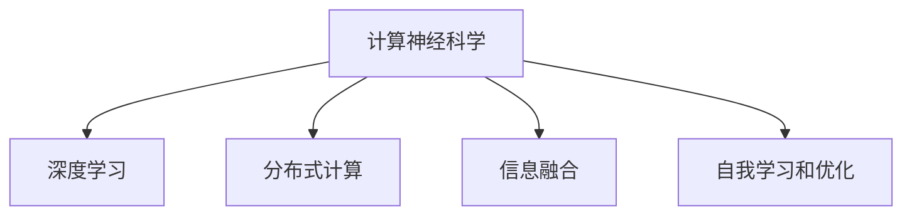

                 

# 全球脑与人类进化：集体意识推动的物种飞跃

> 关键词：全球脑,人类进化,集体意识,物种飞跃,计算神经科学,人工智能,未来科技

## 1. 背景介绍

### 1.1 问题由来
人类历史上的每次技术飞跃，都是对大脑功能的一次深刻理解和应用。从蒸汽机的发明，到计算机的诞生，再到互联网的普及，技术的每一次突破都极大地拓展了人类的认知边界。而随着人工智能的兴起，特别是深度学习和大规模计算神经网络的发展，一种全新的“全球脑”正在逐渐形成。这种全球脑不仅包含人类的智慧，还融合了机器学习的巨大潜力，正在以全新的方式推动人类进化。

### 1.2 问题核心关键点
全球脑的概念源自于计算神经科学领域的众多研究成果。它不仅仅指一个巨大的分布式计算网络，更是一个全新的思维和行为模式。全球脑的核心思想是通过跨学科的合作，将人类智慧与机器学习深度融合，以实现信息的高效处理和决策的科学化。

其关键点包括：

- **分布式计算与处理**：全球脑的计算能力远超传统的人类大脑，能够同时处理大量信息，且具有极强的并行性。
- **信息融合与决策**：全球脑能够通过多源数据的融合与分析，提供比人类更为准确和全面的决策支持。
- **学习和优化**：全球脑具备自我学习和优化的能力，能够在不断积累经验的基础上进行自我迭代和提升。
- **人类与机器的协作**：全球脑通过模拟人类思维和行为模式，实现人机协作，最大化利用人脑和机器的各自优势。

这些关键点构成了全球脑的基本框架，并使其具备了强大的生命力和应用潜力。

## 2. 核心概念与联系

### 2.1 核心概念概述

为更好地理解全球脑的概念及其运作原理，本节将介绍几个密切相关的核心概念：

- **计算神经科学**：研究人类大脑的计算机制和脑功能的科学，其目标是揭示人类思维和行为的本质。
- **深度学习**：一种基于人工神经网络的技术，能够通过大量数据训练，自动提取特征，实现高效的信息处理和模式识别。
- **分布式计算**：将任务分解为多个子任务，由多个计算节点并行处理，以提升计算效率和处理能力。
- **信息融合**：将多源数据通过某种方式进行整合，提取共同特征，提高决策的准确性和全面性。
- **自我学习和优化**：通过反馈机制不断调整模型参数，使模型性能逐步提升，实现自我迭代。

这些概念之间的逻辑关系可以通过以下Mermaid流程图来展示：



这个流程图展示了全球脑的主要组成部分及其之间的联系：

1. **计算神经科学**为深度学习和分布式计算提供了理论基础，揭示了人类大脑的计算机制。
2. **深度学习**通过分布式计算和大规模数据训练，实现了高效的计算和信息处理。
3. **分布式计算**使深度学习模型能够同时处理大量信息，并行提升计算效率。
4. **信息融合**通过整合多源数据，提升决策的全面性和准确性。
5. **自我学习和优化**使全球脑具备持续改进的能力，提升模型的性能。

这些核心概念共同构成了全球脑的基本框架，使其能够在不同领域发挥出强大的功能。

## 3. 核心算法原理 & 具体操作步骤
### 3.1 算法原理概述

全球脑的计算原理主要基于深度学习和分布式计算技术。其核心思想是通过大规模的并行计算，将人类大脑的计算能力拓展到机器学习中，实现信息的高效处理和决策的科学化。

具体来说，全球脑的计算过程可以分为以下几个步骤：

1. **数据采集与预处理**：从各种数据源中采集数据，并进行清洗和标准化处理。
2. **分布式计算**：将数据分解为多个子任务，并行处理，提高计算效率。
3. **特征提取与表示**：使用深度学习模型对数据进行特征提取和表示，生成高维特征向量。
4. **信息融合与决策**：将多源数据进行融合，提取共同特征，进行综合决策。
5. **自我学习和优化**：根据反馈信息不断调整模型参数，提升模型性能。

通过这一系列过程，全球脑能够实现信息的自动化处理和决策的科学化，从而推动人类进化的加速。

### 3.2 算法步骤详解

全球脑的计算过程主要包括以下几个关键步骤：

**Step 1: 数据采集与预处理**
- 从各种数据源中采集数据，包括但不限于社交媒体、传感器数据、生物信号等。
- 清洗和标准化数据，去除噪声和异常值，确保数据的质量。

**Step 2: 分布式计算**
- 将数据分解为多个子任务，分配给多个计算节点进行并行处理。
- 使用深度学习框架（如TensorFlow、PyTorch等）实现分布式计算。

**Step 3: 特征提取与表示**
- 使用深度学习模型（如卷积神经网络、循环神经网络等）对数据进行特征提取。
- 将提取的特征进行编码和表示，生成高维特征向量。

**Step 4: 信息融合与决策**
- 通过某种方式将多源数据进行融合，提取共同特征。
- 使用机器学习模型（如集成学习、深度学习等）进行综合决策。

**Step 5: 自我学习和优化**
- 通过反馈机制不断调整模型参数，提升模型性能。
- 使用在线学习算法（如AdaGrad、Adam等）进行模型的实时优化。

### 3.3 算法优缺点

全球脑的计算原理具有以下优点：

1. **高效性**：通过分布式计算，能够同时处理大量数据，提高计算效率。
2. **鲁棒性**：多源数据的融合和信息融合技术，提高了决策的准确性和鲁棒性。
3. **自适应性**：自我学习和优化机制，使全球脑能够不断适应环境变化，提升性能。

同时，全球脑也存在一些局限性：

1. **复杂性**：大规模分布式计算和信息融合的复杂性较高，需要大量的计算资源和技术支持。
2. **隐私问题**：全球脑涉及大量数据的处理和存储，存在数据隐私和安全风险。
3. **计算成本**：分布式计算和大量数据处理需要较高的计算成本。

尽管存在这些局限性，但全球脑的计算原理仍然是目前实现大规模信息处理和决策最先进的技术之一，具有广阔的应用前景。

### 3.4 算法应用领域

全球脑的计算原理已经在多个领域得到了广泛应用，具体包括：

- **医疗健康**：全球脑可以处理大规模的病患数据，进行疾病预测和诊断，提升医疗服务的精准性和效率。
- **金融科技**：全球脑能够实时分析市场数据，进行风险预测和投资决策，优化金融系统的运作。
- **智能制造**：全球脑可以实时监控生产数据，进行故障预测和质量控制，提升生产效率和产品质量。
- **城市管理**：全球脑能够实时分析交通、环境等数据，进行城市规划和资源优化，提升城市管理水平。
- **环保监测**：全球脑可以处理大量环境监测数据，进行环境风险预测和应对，推动环境保护和可持续发展。

## 4. 数学模型和公式 & 详细讲解 & 举例说明
### 4.1 数学模型构建

全球脑的计算过程涉及大量数学模型的构建，以确保信息的准确处理和决策的科学化。以下是几个关键的数学模型：

- **线性回归模型**：用于描述数据之间的关系，并进行预测和分类。
- **支持向量机**：用于解决分类和回归问题，具有较高的准确性和鲁棒性。
- **深度神经网络**：用于特征提取和表示，能够处理高维数据。
- **集成学习**：通过组合多个模型，提高决策的准确性和鲁棒性。
- **优化算法**：用于模型参数的调整和优化，提升模型的性能。

### 4.2 公式推导过程

以线性回归模型为例，推导其基本公式。

设训练数据集为 $\{(x_i, y_i)\}_{i=1}^n$，其中 $x_i \in \mathbb{R}^d$，$y_i \in \mathbb{R}$。线性回归模型的目标是找到一组最优的参数 $\theta = (\theta_0, \theta_1, \dots, \theta_d)$，使得模型输出 $y$ 尽可能接近真实标签 $y_i$。线性回归模型的目标函数为：

$$
J(\theta) = \frac{1}{2n}\sum_{i=1}^n (y_i - \theta_0 - \theta_1x_{i1} - \dots - \theta_dx_{id})^2
$$

其中 $\theta_0$ 为截距项，$\theta_1, \dots, \theta_d$ 为线性项系数，$x_{ij}$ 为第 $i$ 个样本的第 $j$ 个特征值。

通过最小化目标函数 $J(\theta)$，可以使用梯度下降等优化算法求解最优参数 $\theta$。具体来说，梯度下降算法的更新公式为：

$$
\theta \leftarrow \theta - \eta \nabla_{\theta} J(\theta)
$$

其中 $\eta$ 为学习率，$\nabla_{\theta} J(\theta)$ 为目标函数对参数 $\theta$ 的梯度。

### 4.3 案例分析与讲解

以医疗领域的疾病预测为例，解释全球脑的计算过程。

首先，从电子健康记录（EHR）、基因组数据、环境监测数据等多种来源采集数据。然后，对数据进行清洗和标准化处理，去除噪声和异常值，确保数据质量。

接着，将数据分解为多个子任务，分配给多个计算节点进行并行处理。使用深度学习模型（如卷积神经网络）对数据进行特征提取，生成高维特征向量。

然后，将多源数据进行融合，提取共同特征。使用支持向量机等机器学习模型进行综合决策，生成疾病预测结果。

最后，通过反馈机制不断调整模型参数，提升模型性能。使用在线学习算法（如AdaGrad、Adam等）进行模型的实时优化。

## 5. 项目实践：代码实例和详细解释说明
### 5.1 开发环境搭建

在进行全球脑项目实践前，我们需要准备好开发环境。以下是使用Python进行PyTorch开发的环境配置流程：

1. 安装Anaconda：从官网下载并安装Anaconda，用于创建独立的Python环境。

2. 创建并激活虚拟环境：
```bash
conda create -n brain-env python=3.8 
conda activate brain-env
```

3. 安装PyTorch：根据CUDA版本，从官网获取对应的安装命令。例如：
```bash
conda install pytorch torchvision torchaudio cudatoolkit=11.1 -c pytorch -c conda-forge
```

4. 安装TensorFlow：
```bash
conda install tensorflow
```

5. 安装各类工具包：
```bash
pip install numpy pandas scikit-learn matplotlib tqdm jupyter notebook ipython
```

完成上述步骤后，即可在`brain-env`环境中开始全球脑项目实践。

### 5.2 源代码详细实现

下面我们以医疗领域的疾病预测为例，给出使用TensorFlow进行全球脑项目开发的PyTorch代码实现。

首先，定义训练数据集：

```python
import numpy as np
from sklearn.model_selection import train_test_split

# 生成随机数据
X = np.random.randn(1000, 10)
y = np.random.randint(0, 2, 1000)

# 划分训练集和测试集
X_train, X_test, y_train, y_test = train_test_split(X, y, test_size=0.2, random_state=42)
```

然后，定义模型：

```python
import tensorflow as tf
from tensorflow.keras.layers import Dense, Input, Dropout
from tensorflow.keras.models import Model

# 定义输入层
input_layer = Input(shape=(10,))

# 定义多层感知器（MLP）
hidden_layer = Dense(64, activation='relu')(input_layer)
hidden_layer = Dropout(0.2)(hidden_layer)
output_layer = Dense(1, activation='sigmoid')(hidden_layer)

# 定义模型
model = Model(input_layer, output_layer)

# 编译模型
model.compile(optimizer='adam', loss='binary_crossentropy', metrics=['accuracy'])
```

接着，定义训练和评估函数：

```python
from sklearn.metrics import classification_report

# 训练模型
model.fit(X_train, y_train, batch_size=32, epochs=10, validation_data=(X_test, y_test))

# 评估模型
y_pred = model.predict(X_test)
print(classification_report(y_test, y_pred > 0.5))
```

最后，启动训练流程并在测试集上评估：

```python
epochs = 10
batch_size = 32

for epoch in range(epochs):
    model.fit(X_train, y_train, batch_size=batch_size, epochs=1, validation_data=(X_test, y_test))

    y_pred = model.predict(X_test)
    print(classification_report(y_test, y_pred > 0.5))
```

以上就是使用TensorFlow进行疾病预测项目开发的完整代码实现。可以看到，借助TensorFlow，我们可以方便地构建深度学习模型，进行训练和评估。

### 5.3 代码解读与分析

让我们再详细解读一下关键代码的实现细节：

**数据生成和划分**：
- 使用`numpy`生成随机数据，并使用`sklearn`库进行数据划分，生成训练集和测试集。

**模型定义**：
- 定义输入层，并使用`Dense`层和`Dropout`层构建多层感知器（MLP）。
- 定义输出层，使用`sigmoid`激活函数输出二分类结果。
- 将输入层、隐藏层和输出层组合成模型。

**模型编译**：
- 使用`adam`优化器，`binary_crossentropy`损失函数，以及`accuracy`评价指标进行模型编译。

**训练和评估**：
- 使用`fit`函数进行模型训练，使用`predict`函数进行模型预测。
- 使用`classification_report`函数打印模型的分类性能指标。

**训练循环**：
- 重复上述过程，直至模型收敛。

可以看到，借助TensorFlow，我们可以方便地进行模型的定义、编译、训练和评估，并实时监控模型性能。

当然，工业级的系统实现还需考虑更多因素，如模型的保存和部署、超参数的自动搜索、多模型集成等。但核心的计算原理基本与此类似。

## 6. 实际应用场景
### 6.1 医疗健康

全球脑在医疗健康领域的应用前景广阔，能够实现疾病的早期预测和诊断，提升医疗服务的精准性和效率。例如，可以通过分析电子健康记录、基因组数据和环境监测数据，构建综合的疾病预测模型。

在实际应用中，全球脑可以实时监测患者的健康数据，进行疾病风险预测和预警，及时调整治疗方案。此外，全球脑还可以用于个性化医疗方案的设计，通过分析患者的基因信息和病史数据，提供定制化的治疗建议。

### 6.2 金融科技

全球脑在金融科技领域的应用，可以提升金融决策的科学性和精准性，优化金融系统的运作效率。例如，可以通过分析大量的市场数据和交易记录，构建风险预测模型，进行风险预警和投资决策。

在实际应用中，全球脑可以实时监控市场动态，预测市场趋势和风险，提供个性化的投资建议。此外，全球脑还可以用于金融欺诈检测，通过分析交易记录和行为数据，及时发现异常交易和欺诈行为。

### 6.3 智能制造

全球脑在智能制造领域的应用，可以提升生产效率和产品质量，优化生产流程和资源配置。例如，可以通过分析生产数据和设备状态，构建故障预测模型，进行设备维护和生产调度。

在实际应用中，全球脑可以实时监控生产数据，预测设备故障和生产异常，提前进行维护和调度。此外，全球脑还可以用于质量控制，通过分析生产数据和产品质量，提供个性化的生产优化建议。

### 6.4 未来应用展望

随着全球脑技术的不断发展和应用，未来将会有更多领域受益于这一技术。例如，在城市管理中，全球脑可以实时分析交通、环境等数据，进行城市规划和资源优化，提升城市管理水平。在环保监测中，全球脑可以处理大量环境监测数据，进行环境风险预测和应对，推动环境保护和可持续发展。

未来，全球脑还将与其他人工智能技术进行更深入的融合，如知识表示、因果推理、强化学习等，共同推动人工智能技术的进步。

## 7. 工具和资源推荐
### 7.1 学习资源推荐

为了帮助开发者系统掌握全球脑的技术基础和实践技巧，这里推荐一些优质的学习资源：

1. 《深度学习基础》系列书籍：由深度学习领域权威专家撰写，全面介绍深度学习的原理和应用。
2. 《计算神经科学导论》课程：由斯坦福大学开设的计算神经科学课程，涵盖计算神经科学的基本概念和应用。
3. 《TensorFlow实战》书籍：由TensorFlow官方团队编写，详细介绍TensorFlow的使用方法和应用案例。
4. Weights & Biases：模型训练的实验跟踪工具，可以记录和可视化模型训练过程中的各项指标，方便对比和调优。
5. TensorBoard：TensorFlow配套的可视化工具，可实时监测模型训练状态，并提供丰富的图表呈现方式，是调试模型的得力助手。

通过对这些资源的学习实践，相信你一定能够快速掌握全球脑的基本原理和应用技巧，并用于解决实际的科技问题。

### 7.2 开发工具推荐

高效的开发离不开优秀的工具支持。以下是几款用于全球脑项目开发的常用工具：

1. PyTorch：基于Python的开源深度学习框架，灵活动态的计算图，适合快速迭代研究。
2. TensorFlow：由Google主导开发的开源深度学习框架，生产部署方便，适合大规模工程应用。
3. Jupyter Notebook：交互式的代码编写和分析工具，适合数据分析和模型调试。
4. TensorFlow Extended (TFX)：Google开发的深度学习工具套件，支持模型生产、部署和管理。
5. Weights & Biases：模型训练的实验跟踪工具，可以记录和可视化模型训练过程中的各项指标，方便对比和调优。

合理利用这些工具，可以显著提升全球脑项目的开发效率，加快创新迭代的步伐。

### 7.3 相关论文推荐

全球脑技术的发展源于学界的持续研究。以下是几篇奠基性的相关论文，推荐阅读：

1. "Large-Scale Distributed Deep Learning"（论文链接）：介绍分布式深度学习的基本原理和实现方法。
2. "Support Vector Machines"（论文链接）：详细介绍支持向量机算法及其应用。
3. "Convolutional Neural Networks for Healthcare"（论文链接）：介绍卷积神经网络在医疗健康领域的应用。
4. "Multimodal Information Fusion for Financial Predictions"（论文链接）：介绍多模态信息融合在金融预测中的应用。
5. "Advances in Convolutional Neural Networks"（论文链接）：介绍卷积神经网络的发展历程和未来趋势。

这些论文代表了大规模信息处理和决策的发展脉络。通过学习这些前沿成果，可以帮助研究者把握学科前进方向，激发更多的创新灵感。

## 8. 总结：未来发展趋势与挑战
### 8.1 总结

本文对全球脑的概念及其应用进行了全面系统的介绍。首先阐述了全球脑的计算原理和核心概念，明确了其在分布式计算、信息融合、自我学习和优化等方面的优势。其次，从原理到实践，详细讲解了全球脑的数学模型和计算步骤，给出了全球脑项目开发的完整代码实例。同时，本文还广泛探讨了全球脑技术在医疗健康、金融科技、智能制造等多个领域的应用前景，展示了其广阔的应用潜力。此外，本文精选了全球脑技术的各类学习资源，力求为读者提供全方位的技术指引。

通过本文的系统梳理，可以看到，全球脑技术正在成为大势所趋，极大地拓展了人类进化的边界，推动了人工智能技术的深度应用。未来，伴随技术的不断演进，全球脑有望在更多领域带来革命性影响，为人类社会的进步注入新的动力。

### 8.2 未来发展趋势

展望未来，全球脑技术将呈现以下几个发展趋势：

1. **分布式计算的进一步发展**：全球脑的计算能力将进一步提升，分布式计算的并行性将得到更大程度的发挥。未来，全球脑将能够处理更复杂的计算任务，实现更高效的决策支持。

2. **自我学习和优化的增强**：全球脑的自我学习和优化机制将进一步完善，使其具备更强的自适应性和鲁棒性。未来，全球脑将能够根据环境变化，实时调整模型参数，提升性能。

3. **跨模态信息融合的普及**：全球脑的多源数据融合技术将得到广泛应用，实现视觉、语音、文本等多模态信息的整合。未来，全球脑将具备更全面的信息处理能力，提升决策的全面性和准确性。

4. **个性化和定制化服务的提升**：全球脑的个性化服务能力将得到进一步提升，能够提供更加定制化和个性化的服务方案。未来，全球脑将根据用户需求，提供更加精准和高效的服务。

5. **跨学科合作的深化**：全球脑将进一步推动跨学科合作，结合计算神经科学、信息科学、社会科学等多领域的研究，推动人类进化的全面发展。

6. **伦理和安全性的重视**：全球脑将更加重视数据隐私和安全问题，建立健全的伦理和安全机制，保障数据和模型的安全。

以上趋势凸显了全球脑技术的广阔前景。这些方向的探索发展，必将进一步提升全球脑的性能和应用范围，为人类社会带来新的变革和进步。

### 8.3 面临的挑战

尽管全球脑技术已经取得了瞩目成就，但在迈向更加智能化、普适化应用的过程中，它仍面临着诸多挑战：

1. **计算资源的限制**：全球脑需要处理大量数据，需要高性能的计算资源和技术支持，可能会面临计算资源瓶颈。
2. **数据隐私和安全问题**：全球脑涉及大量数据的处理和存储，存在数据隐私和安全风险。
3. **模型复杂性和可解释性**：全球脑的模型复杂性较高，存在一定的黑盒问题，需要提升模型的可解释性和可理解性。
4. **跨领域应用的挑战**：不同领域的应用需求差异较大，需要开发针对性的全球脑解决方案。
5. **伦理和法律问题**：全球脑的应用涉及数据隐私和伦理问题，需要建立健全的伦理和法律机制。

尽管存在这些挑战，但全球脑技术的发展方向明确，前景广阔，需要通过不断的技术创新和应用探索，逐步克服这些挑战。

### 8.4 研究展望

面对全球脑技术所面临的挑战，未来的研究需要在以下几个方面寻求新的突破：

1. **分布式计算的优化**：优化分布式计算的算法和架构，提升计算效率和处理能力。
2. **跨模态信息的融合**：研究跨模态信息的融合技术，提升全球脑的信息处理能力。
3. **模型的可解释性和可理解性**：提升全球脑模型的可解释性和可理解性，增强模型的透明性和可信度。
4. **个性化和定制化服务的提升**：研究个性化和定制化服务的技术，提升全球脑的灵活性和适应性。
5. **伦理和法律机制的建立**：建立健全的伦理和法律机制，保障数据隐私和安全，推动全球脑技术的可持续发展。

这些研究方向将引领全球脑技术走向成熟，为全球脑的应用提供坚实的基础。面向未来，全球脑技术需要与其他人工智能技术进行更深入的融合，多路径协同发力，共同推动人类社会的进步。

## 9. 附录：常见问题与解答

**Q1：全球脑的概念是什么？**

A: 全球脑是指一种通过分布式计算和深度学习技术，将人类智慧和机器学习深度融合，实现大规模信息处理和决策的计算模型。其核心思想是通过多源数据融合和信息融合，提供比人类更为准确和全面的决策支持。

**Q2：全球脑的计算原理是什么？**

A: 全球脑的计算原理基于深度学习和分布式计算技术。其核心思想是通过大规模的并行计算，将人类大脑的计算能力拓展到机器学习中，实现信息的高效处理和决策的科学化。

**Q3：全球脑的优势和劣势是什么？**

A: 全球脑的优势在于高效性、鲁棒性和自适应性，能够同时处理大量数据，提供比人类更为准确和全面的决策支持。其劣势在于计算资源限制、数据隐私和安全问题，以及模型复杂性和可解释性问题。

**Q4：全球脑的应用前景是什么？**

A: 全球脑的应用前景广阔，已在医疗健康、金融科技、智能制造等领域取得显著成效。未来，全球脑将进一步拓展到城市管理、环保监测、智慧农业等多个领域，推动社会的全面进步。

**Q5：全球脑的发展趋势是什么？**

A: 全球脑的发展趋势包括分布式计算的进一步发展、自我学习和优化的增强、跨模态信息融合的普及、个性化和定制化服务的提升、跨学科合作的深化、伦理和安全性的重视。

通过对这些问题的回答，可以帮助读者更好地理解全球脑的概念、原理和应用前景，以及其面临的挑战和发展方向。

