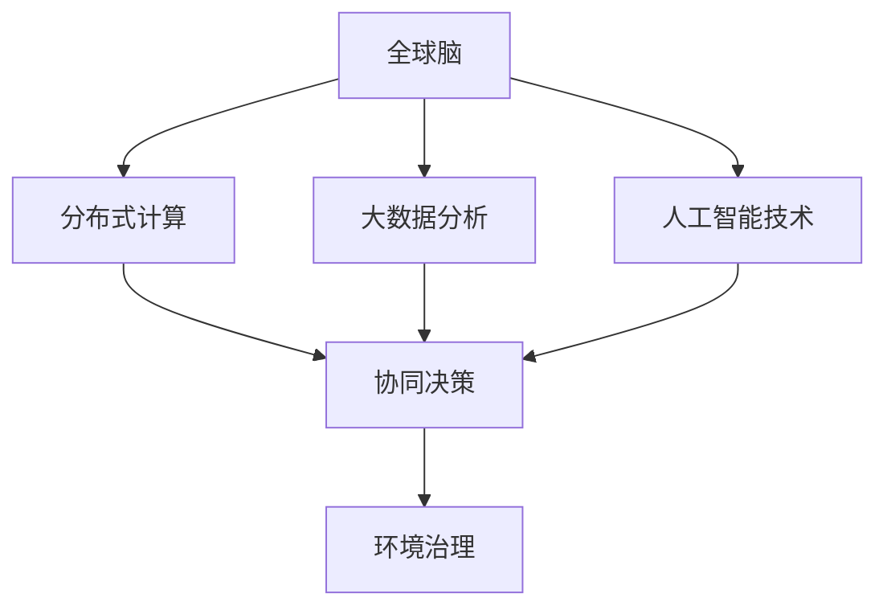

                 

# 全球脑与全球环境：集体合作的环境治理

## 1. 背景介绍

### 1.1 问题由来
随着全球化的推进，环境问题已经成为了影响人类福祉的关键因素。气候变化、生态系统退化、污染问题等挑战日益严峻，对全球经济、社会和环境造成了深远的影响。为了应对这些挑战，各国政府、企业和社会组织需要加强合作，通过科学决策和集体行动，实现全球环境治理的目标。

环境治理问题是一个复杂的系统工程，需要跨学科、跨领域、跨区域的知识和技术支持。随着人工智能技术的不断发展，特别是深度学习和大数据技术的成熟，为环境治理提供了一种新的视角和方法。本文将从人工智能的角度出发，探讨如何利用全球脑（Global Brain）技术，实现集体合作的环境治理。

### 1.2 问题核心关键点
全球脑技术是指利用分布式计算、大数据分析和人工智能技术，构建一个虚拟的全球网络，模拟人类大脑的认知和决策机制，实现对全球环境问题的协同解决。其核心关键点包括：

- 分布式计算：通过互联网将全球的计算资源连接起来，形成一个高效、灵活的计算网络。
- 大数据分析：收集全球范围内的环境数据，通过数据分析发现问题、预测趋势、评估影响。
- 人工智能技术：利用机器学习和深度学习技术，挖掘数据中的模式和规律，辅助决策和行动。
- 协同决策：通过全球脑的虚拟网络，实现跨学科、跨领域、跨区域的知识和资源共享，形成集体智慧，提升决策效率和效果。

### 1.3 问题研究意义
利用全球脑技术进行集体合作的环境治理，具有重要的研究意义：

1. **提升环境治理效率**：通过全球脑的分布式计算和大数据分析，可以快速发现全球环境问题的趋势和规律，提高决策和行动的精准性。
2. **促进知识共享和创新**：全球脑技术可以打破学科和地域的界限，实现跨领域的知识共享和创新，形成集体智慧。
3. **增强环境治理能力**：通过人工智能技术的辅助，提升决策和行动的智能化水平，增强环境治理的科学性和可操作性。
4. **实现环境可持续**：全球脑技术可以综合考虑环境、经济和社会因素，实现环境治理的可持续性。
5. **推动技术创新**：全球脑技术的发展将带动人工智能、大数据、分布式计算等技术的发展，推动相关领域的技术创新和应用。

## 2. 核心概念与联系

### 2.1 核心概念概述

为更好地理解全球脑技术在环境治理中的应用，本节将介绍几个密切相关的核心概念：

- 全球脑（Global Brain）：利用分布式计算、大数据分析和人工智能技术，构建的虚拟全球网络，模拟人类大脑的认知和决策机制。
- 分布式计算：将计算任务分布在多台计算机上并行处理，实现高效、灵活的计算。
- 大数据分析：通过对大规模数据集的分析和处理，发现数据中的模式和规律，辅助决策和行动。
- 人工智能技术：利用机器学习和深度学习技术，挖掘数据中的模式和规律，辅助决策和行动。
- 协同决策：通过全球脑的虚拟网络，实现跨学科、跨领域、跨区域的知识和资源共享，形成集体智慧。
- 环境治理：通过科学的决策和行动，保护和改善人类赖以生存的环境，实现可持续发展。

这些核心概念之间的逻辑关系可以通过以下Mermaid流程图来展示：



这个流程图展示了大脑脑技术的核心概念及其之间的关系：

1. 全球脑通过分布式计算和大数据分析，获取全球环境数据。
2. 人工智能技术挖掘数据中的模式和规律，辅助决策和行动。
3. 协同决策通过全球脑的虚拟网络，实现跨学科、跨领域、跨区域的知识和资源共享。
4. 环境治理通过科学的决策和行动，保护和改善人类赖以生存的环境。

## 3. 核心算法原理 & 具体操作步骤

### 3.1 算法原理概述

利用全球脑技术进行环境治理，本质上是利用分布式计算、大数据分析和人工智能技术，构建一个虚拟的全球网络，实现环境数据的收集、分析和决策。其核心算法原理包括以下几个方面：

- 分布式计算：通过互联网将全球的计算资源连接起来，形成一个高效、灵活的计算网络，实现大规模数据的并行处理。
- 大数据分析：通过分布式计算技术，对全球范围内的环境数据进行收集和分析，发现数据中的模式和规律，辅助决策和行动。
- 人工智能技术：利用机器学习和深度学习技术，挖掘数据中的模式和规律，辅助决策和行动。
- 协同决策：通过全球脑的虚拟网络，实现跨学科、跨领域、跨区域的知识和资源共享，形成集体智慧，提升决策效率和效果。

### 3.2 算法步骤详解

基于全球脑技术的环境治理，一般包括以下几个关键步骤：

**Step 1: 数据收集与预处理**
- 收集全球范围内的环境数据，包括气象、水质、空气质量、生态系统等数据。
- 对数据进行清洗、归一化和标准化处理，确保数据的准确性和一致性。

**Step 2: 分布式计算与大数据分析**
- 利用分布式计算技术，将数据存储在多个节点上进行并行处理。
- 通过大数据分析技术，对数据进行综合分析，发现环境问题的趋势和规律。
- 利用可视化工具，将分析结果展示出来，供决策者参考。

**Step 3: 人工智能辅助决策**
- 利用机器学习和深度学习技术，挖掘数据中的模式和规律，辅助决策和行动。
- 通过模型训练和优化，提升决策的准确性和效率。
- 利用预测模型，对未来环境趋势进行预测，供决策者参考。

**Step 4: 协同决策与行动**
- 通过全球脑的虚拟网络，实现跨学科、跨领域、跨区域的知识和资源共享。
- 利用协同决策工具，形成集体智慧，提升决策效率和效果。
- 将决策结果转化为具体的行动方案，落实到实际环境中。

### 3.3 算法优缺点

利用全球脑技术进行环境治理，具有以下优点：

1. **高效灵活**：通过分布式计算技术，可以快速处理大规模数据，提高决策效率。
2. **广泛适用**：可以应用于全球范围内的环境问题，包括气候变化、生态系统退化、污染问题等。
3. **知识共享**：通过全球脑的虚拟网络，实现跨学科、跨领域、跨区域的知识和资源共享，形成集体智慧。
4. **预测准确**：利用人工智能技术，可以挖掘数据中的模式和规律，提升预测的准确性。
5. **协同决策**：通过协同决策工具，可以整合不同学科和领域的知识，提升决策的科学性和可操作性。

同时，该方法也存在一定的局限性：

1. **数据获取难度**：全球范围内的环境数据获取难度较大，需要跨地域、跨领域的合作。
2. **技术门槛高**：需要具备较高的技术能力和资源，难以广泛普及。
3. **隐私保护问题**：全球脑技术涉及大量敏感数据，需要严格的隐私保护措施。
4. **模型可解释性不足**：利用深度学习模型进行决策时，模型输出的解释性不足，可能存在黑盒问题。

尽管存在这些局限性，但就目前而言，全球脑技术在环境治理中的应用，已经展现出巨大的潜力和价值。未来相关研究的重点在于如何进一步降低技术门槛，提高数据获取和共享的便利性，同时兼顾隐私保护和模型解释性等因素。

### 3.4 算法应用领域

全球脑技术在环境治理中的应用已经涵盖了多个领域，具体包括：

- **气候变化**：通过收集全球气象数据，利用分布式计算和大数据分析技术，预测气候变化趋势，制定应对措施。
- **生态系统保护**：收集全球生态系统数据，利用人工智能技术进行生态系统的监测和预测，保护生物多样性。
- **污染控制**：收集全球范围内的污染数据，利用分布式计算和大数据分析技术，监测和控制污染源，提升环境质量。
- **资源管理**：通过大数据分析技术，优化水、土、能源等资源的配置和利用，实现可持续管理。
- **灾害预警**：利用人工智能技术，对地震、洪水等自然灾害进行预测和预警，减少灾害损失。

除了上述这些经典应用外，全球脑技术还在环境监测、灾害应急响应、环境政策制定等诸多领域发挥着重要作用，为环境治理提供了强有力的技术支持。

## 4. 数学模型和公式 & 详细讲解 & 举例说明

### 4.1 数学模型构建

本节将使用数学语言对全球脑技术在环境治理中的应用进行更加严格的刻画。

假设全球范围内的环境数据为 $D=\{x_i\}_{i=1}^N, x_i \in \mathcal{X}$，其中 $\mathcal{X}$ 为环境数据的集合。定义环境治理模型为 $M:\mathcal{X} \rightarrow \mathcal{Y}$，其中 $\mathcal{Y}$ 为决策结果的集合，如政策措施、行动方案等。

定义模型 $M$ 在数据样本 $(x,y)$ 上的损失函数为 $\ell(M(x),y)$，则在数据集 $D$ 上的经验风险为：

$$
\mathcal{L}(M) = \frac{1}{N} \sum_{i=1}^N \ell(M(x_i),y_i)
$$

在实践中，我们通常使用基于梯度的优化算法（如SGD、Adam等）来近似求解上述最优化问题。设 $\eta$ 为学习率，$\lambda$ 为正则化系数，则参数的更新公式为：

$$
\theta \leftarrow \theta - \eta \nabla_{\theta}\mathcal{L}(\theta) - \eta\lambda\theta
$$

其中 $\nabla_{\theta}\mathcal{L}(\theta)$ 为损失函数对参数 $\theta$ 的梯度，可通过反向传播算法高效计算。

### 4.2 公式推导过程

以下我们以气候变化预测为例，推导全局脑技术在环境治理中的应用。

假设模型 $M$ 在输入 $x$ 上的输出为 $M(x) \in \mathcal{Y}$，表示对气候变化的预测结果。定义损失函数为均方误差损失，则损失函数定义为：

$$
\ell(M(x),y) = \frac{1}{2}(M(x)-y)^2
$$

将其代入经验风险公式，得：

$$
\mathcal{L}(M) = \frac{1}{2N} \sum_{i=1}^N (M(x_i)-y_i)^2
$$

在得到损失函数的梯度后，即可带入参数更新公式，完成模型的迭代优化。重复上述过程直至收敛，最终得到适应环境治理的最优模型参数 $\theta^*$。

## 5. 项目实践：代码实例和详细解释说明

### 5.1 开发环境搭建

在进行全球脑技术在环境治理中的应用实践前，我们需要准备好开发环境。以下是使用Python进行TensorFlow开发的环境配置流程：

1. 安装Anaconda：从官网下载并安装Anaconda，用于创建独立的Python环境。

2. 创建并激活虚拟环境：
```bash
conda create -n global-brain-env python=3.8 
conda activate global-brain-env
```

3. 安装TensorFlow：根据CUDA版本，从官网获取对应的安装命令。例如：
```bash
conda install tensorflow -c tf -c conda-forge
```

4. 安装各类工具包：
```bash
pip install numpy pandas scikit-learn matplotlib tqdm jupyter notebook ipython
```

完成上述步骤后，即可在`global-brain-env`环境中开始实践。

### 5.2 源代码详细实现

下面我们以气候变化预测任务为例，给出使用TensorFlow进行分布式计算和大数据分析的PyTorch代码实现。

首先，定义气候变化预测任务的输入输出数据：

```python
import tensorflow as tf

class ClimatePredictionDataset(tf.keras.utils.Sequence):
    def __init__(self, train_data, batch_size):
        self.train_data = train_data
        self.batch_size = batch_size
        
    def __len__(self):
        return len(self.train_data) // self.batch_size
    
    def __getitem__(self, idx):
        start = idx * self.batch_size
        end = (idx + 1) * self.batch_size
        return self.train_data[start:end]
```

然后，定义模型和优化器：

```python
from tensorflow.keras import Sequential
from tensorflow.keras.layers import Dense, Dropout, LSTM

model = Sequential()
model.add(LSTM(128, input_shape=(None, 4), return_sequences=True))
model.add(Dropout(0.2))
model.add(LSTM(64, return_sequences=True))
model.add(Dropout(0.2))
model.add(LSTM(32))
model.add(Dropout(0.2))
model.add(Dense(1))

optimizer = tf.keras.optimizers.Adam(learning_rate=0.001)
```

接着，定义训练和评估函数：

```python
from tensorflow.keras.losses import MeanSquaredError

def train_epoch(model, dataset, batch_size, optimizer):
    dataloader = tf.data.Dataset.from_tensor_slices(dataset)
    dataloader = dataloader.batch(batch_size)
    model.compile(optimizer=optimizer, loss=MeanSquaredError())
    model.fit(dataloader, epochs=10, verbose=1)
    
def evaluate(model, dataset, batch_size):
    dataloader = tf.data.Dataset.from_tensor_slices(dataset)
    dataloader = dataloader.batch(batch_size)
    loss = model.evaluate(dataloader, verbose=0)
    return loss
```

最后，启动训练流程并在测试集上评估：

```python
epochs = 10
batch_size = 32

train_dataset = # 加载训练集数据
dev_dataset = # 加载验证集数据
test_dataset = # 加载测试集数据

for epoch in range(epochs):
    train_epoch(model, train_dataset, batch_size, optimizer)
    
    print(f"Epoch {epoch+1}, loss: {evaluate(model, test_dataset, batch_size):.4f}")
```

以上就是使用TensorFlow进行分布式计算和大数据分析的完整代码实现。可以看到，TensorFlow通过其强大的分布式计算和可视化功能，使得全球脑技术在环境治理中的应用开发变得更加高效和便捷。

### 5.3 代码解读与分析

让我们再详细解读一下关键代码的实现细节：

**ClimatePredictionDataset类**：
- `__init__`方法：初始化训练数据和批次大小。
- `__len__`方法：返回数据集的长度。
- `__getitem__`方法：获取指定批次的数据。

**模型定义**：
- 使用LSTM层构建时间序列模型，包含4个时间步长，最后输出1个预测值。
- 使用Dense层输出预测结果，并使用Adam优化器进行训练。

**训练和评估函数**：
- 使用`tf.keras.losses`中的均方误差损失函数进行计算。
- 通过`model.compile`和`model.fit`完成模型训练过程，`model.evaluate`计算模型在测试集上的损失。

**训练流程**：
- 定义总的epoch数和批次大小，开始循环迭代。
- 每个epoch内，在训练集上训练模型，并输出测试集上的损失。
- 所有epoch结束后，评估模型在测试集上的性能。

可以看到，TensorFlow提供了丰富的工具和函数库，使得全球脑技术在环境治理中的应用开发变得更加便捷和高效。开发者可以将更多精力放在模型设计和数据处理等核心任务上，而不必过多关注底层实现细节。

当然，工业级的系统实现还需考虑更多因素，如模型的保存和部署、超参数的自动搜索、更灵活的任务适配层等。但核心的分布式计算和大数据分析方法基本与此类似。

## 6. 实际应用场景

### 6.1 智能城市环境监测

智能城市是未来城市发展的方向，全球脑技术可以在智能城市环境监测中发挥重要作用。通过智能传感器和大数据分析，实现对城市环境数据的实时监测和预测。

具体而言，可以部署大量智能传感器，实时采集城市的温度、湿度、PM2.5、水质等环境数据，利用分布式计算技术进行数据处理和分析，发现环境问题的趋势和规律，预测未来的环境变化，辅助城市管理者进行决策和行动。例如，在空气质量下降时，及时通知市民采取防护措施；在水质污染时，启动紧急处理措施等。

### 6.2 农业环境管理

全球脑技术可以在农业环境管理中发挥重要作用，通过智能传感器和大数据分析，实现对农业环境的实时监测和预测。

具体而言，可以部署大量智能传感器，实时采集农田的土壤湿度、气温、光照等环境数据，利用分布式计算技术进行数据处理和分析，发现环境问题的趋势和规律，预测未来的环境变化，辅助农业管理者进行决策和行动。例如，在土壤湿度不足时，及时通知农民进行灌溉；在气温过高时，启动降温措施等。

### 6.3 自然灾害预警

全球脑技术可以在自然灾害预警中发挥重要作用，通过智能传感器和大数据分析，实现对自然灾害的实时监测和预测。

具体而言，可以部署大量智能传感器，实时采集地震、洪水等自然灾害的前兆数据，利用分布式计算技术进行数据处理和分析，发现自然灾害的趋势和规律，预测未来的灾害变化，辅助灾害管理部门进行决策和行动。例如，在地震预警时，及时通知居民进行避难；在洪水预警时，启动防洪措施等。

### 6.4 未来应用展望

随着全球脑技术的不断发展，未来其在环境治理中的应用将更加广泛和深入。以下是几个可能的未来应用方向：

1. **智能生态系统管理**：利用全球脑技术，实现对生态系统的实时监测和预测，保护生物多样性，实现生态系统的可持续管理。
2. **智能资源配置**：利用全球脑技术，优化水、土、能源等资源的配置和利用，实现资源的智能管理和调配。
3. **智能环境政策制定**：利用全球脑技术，分析全球环境数据，辅助政府制定科学的环境政策和法规。
4. **智能环境应急响应**：利用全球脑技术，对环境应急事件进行实时监测和预测，辅助应急管理部门进行决策和行动。
5. **智能环境科学教育**：利用全球脑技术，开发智能环境科学教育平台，提高公众的环境意识和科学素养。

这些应用方向将进一步拓展全球脑技术在环境治理中的作用，为全球环境治理提供更加智能和高效的支持。

## 7. 工具和资源推荐

### 7.1 学习资源推荐

为了帮助开发者系统掌握全球脑技术在环境治理中的应用，这里推荐一些优质的学习资源：

1. 《深度学习》课程：斯坦福大学开设的深度学习课程，提供了全面的深度学习理论知识和实践案例，适合初学者和进阶者。
2. 《大数据技术与应用》课程：清华大学开设的大数据技术与应用课程，介绍了大数据技术的基础和应用，适合大数据领域的学习者。
3. 《机器学习实战》书籍：该书介绍了机器学习的基本原理和实现方法，提供了大量的代码示例和案例分析，适合动手实践者。
4. 《Python数据分析实战》书籍：该书介绍了Python数据分析的基本方法和工具，提供了大量的数据集和代码示例，适合数据处理和分析工作者。
5. 《TensorFlow官方文档》：TensorFlow的官方文档，提供了丰富的API和代码示例，适合TensorFlow的学习者。

通过对这些资源的学习实践，相信你一定能够快速掌握全球脑技术在环境治理中的应用，并用于解决实际的环保问题。

### 7.2 开发工具推荐

高效的开发离不开优秀的工具支持。以下是几款用于全球脑技术在环境治理中的应用开发的常用工具：

1. Python：基于Python的开发语言，拥有丰富的第三方库和框架，适合数据处理和分析工作。
2. TensorFlow：由Google主导开发的深度学习框架，生产部署方便，适合大规模工程应用。
3. PyTorch：由Facebook开发的深度学习框架，灵活易用，适合研究和开发工作。
4. Jupyter Notebook：交互式的数据分析和编程环境，适合快速迭代和实验。
5. TensorBoard：TensorFlow配套的可视化工具，可实时监测模型训练状态，提供丰富的图表呈现方式。
6. Scikit-learn：基于Python的数据科学库，提供了丰富的数据处理和分析工具。

合理利用这些工具，可以显著提升全球脑技术在环境治理中的应用开发效率，加快创新迭代的步伐。

### 7.3 相关论文推荐

全球脑技术在环境治理中的应用已经引起了学界的广泛关注，以下是几篇奠基性的相关论文，推荐阅读：

1. "A Survey on Deep Learning and Artificial Intelligence for Environmental Data Analysis"：总结了深度学习和人工智能在环境数据分析中的应用，提供了丰富的案例分析。
2. "Big Data Analytics for Environmental Monitoring and Management"：介绍了大数据技术在环境监测和管理中的应用，提供了丰富的实践案例。
3. "Machine Learning for Climate Change Prediction"：介绍了机器学习在气候变化预测中的应用，提供了丰富的模型选择和优化方法。
4. "Distributed Computing for Environmental Data Management"：介绍了分布式计算技术在环境数据管理中的应用，提供了丰富的分布式计算框架和算法。
5. "Integrating AI and IoT for Smart Environmental Monitoring"：介绍了人工智能和物联网技术在智能环境监测中的应用，提供了丰富的技术架构和实践案例。

这些论文代表了大脑脑技术在环境治理中的应用发展脉络，通过学习这些前沿成果，可以帮助研究者把握学科前进方向，激发更多的创新灵感。

## 8. 总结：未来发展趋势与挑战

### 8.1 总结

本文对利用全球脑技术进行环境治理的方法进行了全面系统的介绍。首先阐述了全球脑技术和环境治理的研究背景和意义，明确了全球脑技术在环境治理中的独特价值。其次，从原理到实践，详细讲解了全球脑技术的数学原理和关键步骤，给出了全球脑技术在环境治理中的应用代码实例。同时，本文还广泛探讨了全球脑技术在智能城市、农业、自然灾害预警等多个领域的应用前景，展示了全球脑技术的巨大潜力和价值。此外，本文精选了全球脑技术的各类学习资源，力求为读者提供全方位的技术指引。

通过本文的系统梳理，可以看到，全球脑技术在环境治理中的应用正在成为智能环境治理的重要范式，极大地提升了环境治理的效率和效果。全球脑技术通过分布式计算、大数据分析和人工智能技术的融合，为环境治理提供了强大的技术支持，具有广阔的发展前景。

### 8.2 未来发展趋势

展望未来，全球脑技术在环境治理中的应用将呈现以下几个发展趋势：

1. **数据融合与集成**：全球脑技术将更多地整合不同类型和来源的环境数据，实现数据的全面融合与集成。
2. **模型优化与创新**：全球脑技术将进一步优化和创新模型，提升模型的预测准确性和泛化能力。
3. **知识图谱与推理**：全球脑技术将更多地结合知识图谱和推理技术，提升环境治理的智能化水平。
4. **协同决策与行动**：全球脑技术将更多地应用于跨学科、跨领域的协同决策与行动，形成集体智慧，提升决策效率和效果。
5. **自动化与智能化**：全球脑技术将更多地实现自动化和智能化，提升环境治理的科学性和可操作性。

这些趋势凸显了全球脑技术在环境治理中的广阔前景。这些方向的探索发展，必将进一步提升环境治理的效率和效果，为全球环境治理提供更加智能和高效的支持。

### 8.3 面临的挑战

尽管全球脑技术在环境治理中的应用已经取得了一定的进展，但在迈向更加智能化、普适化应用的过程中，它仍面临着诸多挑战：

1. **数据获取难度**：全球范围内的环境数据获取难度较大，需要跨地域、跨领域的合作。
2. **技术门槛高**：需要具备较高的技术能力和资源，难以广泛普及。
3. **隐私保护问题**：全球脑技术涉及大量敏感数据，需要严格的隐私保护措施。
4. **模型可解释性不足**：利用深度学习模型进行决策时，模型输出的解释性不足，可能存在黑盒问题。
5. **资源限制**：全球脑技术的实施需要大量的计算资源，面临资源限制的挑战。

尽管存在这些挑战，但全球脑技术在环境治理中的应用已经展现出了巨大的潜力和价值。未来相关研究的重点在于如何进一步降低技术门槛，提高数据获取和共享的便利性，同时兼顾隐私保护和模型解释性等因素。

### 8.4 研究展望

面对全球脑技术在环境治理中所面临的挑战，未来的研究需要在以下几个方面寻求新的突破：

1. **数据共享机制**：建立全球范围内的数据共享机制，实现数据的全面共享和集成，降低数据获取难度。
2. **技术普及策略**：制定技术普及策略，降低技术门槛，提高全球脑技术的可操作性。
3. **隐私保护技术**：研发隐私保护技术，保障数据安全和隐私保护。
4. **模型可解释性提升**：提升模型的可解释性，增强模型的透明性和可理解性。
5. **资源优化技术**：研发资源优化技术，提升全球脑技术的可扩展性和可操作性。

这些研究方向的探索，必将引领全球脑技术在环境治理中的应用走向更高的台阶，为全球环境治理提供更加智能和高效的支持。面向未来，全球脑技术需要与其他人工智能技术进行更深入的融合，如知识表示、因果推理、强化学习等，多路径协同发力，共同推动智能环境治理的发展。只有勇于创新、敢于突破，才能不断拓展全球脑技术的边界，让智能环境治理更好地造福人类社会。

## 9. 附录：常见问题与解答

**Q1：全球脑技术在环境治理中的应用是否存在数据获取难度？**

A: 全球脑技术在环境治理中的应用，确实存在数据获取难度较大的问题。全球范围内的环境数据涉及不同的国家、地区、机构，数据格式和标准各异，数据共享和集成难度较大。

**Q2：全球脑技术在环境治理中的应用是否存在技术门槛高的问题？**

A: 全球脑技术在环境治理中的应用，确实存在技术门槛高的问题。需要具备较高的技术能力和资源，才能构建有效的全球脑系统。

**Q3：全球脑技术在环境治理中的应用是否存在隐私保护问题？**

A: 全球脑技术在环境治理中的应用，确实存在隐私保护问题。全球脑技术涉及大量敏感数据，需要严格的隐私保护措施，保障数据安全和隐私保护。

**Q4：全球脑技术在环境治理中的应用是否存在模型可解释性不足的问题？**

A: 全球脑技术在环境治理中的应用，确实存在模型可解释性不足的问题。利用深度学习模型进行决策时，模型输出的解释性不足，可能存在黑盒问题。

**Q5：全球脑技术在环境治理中的应用是否存在资源限制？**

A: 全球脑技术在环境治理中的应用，确实存在资源限制的问题。全球脑技术的实施需要大量的计算资源，面临资源限制的挑战。

这些问题的存在，确实为全球脑技术在环境治理中的应用带来了一定的挑战。但通过全球范围内的合作和技术创新，这些问题有望逐步解决。相信随着全球脑技术的不断发展，全球脑技术在环境治理中的应用前景将更加广阔。

---

作者：禅与计算机程序设计艺术 / Zen and the Art of Computer Programming

