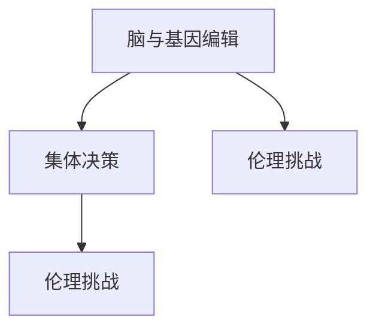

                 

# 全球脑与基因编辑:集体决策的伦理挑战

## 1. 背景介绍

随着人工智能和基因编辑技术的飞速发展，人类对自身心智和基因的理解与操控达到了前所未有的高度。在大数据、神经科学、生物信息学的共同推动下，我们有了通过编辑基因和脑神经网络以实现更高效、更智能的决策能力的可能。然而，这一技术的潜在使用引发了一系列复杂的伦理道德问题，尤其是当它应用于集体决策时，这些问题变得尤为尖锐。

### 1.1 全球脑与基因编辑的背景

**全球脑计划**（Global Brain Initiative）旨在通过解码大脑的信息处理过程，并最终构建一个全球性的智能化大脑网络。其核心目标是将全球研究人员、企业和政府等利益相关者的数据和资源整合起来，形成一个共享的平台，以便更好地理解、预测和干预人类大脑的运作机制。

**基因编辑技术**如CRISPR-Cas9，使得我们能精确地修改DNA序列，这项技术已经引起了伦理学家、医学专家和公众的广泛关注。在2018年，中国科学家贺建奎曾对人类胚胎进行基因编辑，虽然后来遭到广泛谴责并撤销了其研究成果，但这一事件仍显示出这一技术的巨大潜力。

## 2. 核心概念与联系

### 2.1 核心概念概述

为了深入理解全球脑与基因编辑所带来的伦理挑战，首先需要明确几个核心概念：

- **脑与基因编辑**：涉及对大脑和基因进行编码解码、修改、增强等操作的科学技术。
- **集体决策**：指众多个体或机构共同参与决策，其结果不仅影响个体的行为和选择，还可能波及整个社会。
- **伦理挑战**：围绕脑与基因编辑技术应用，尤其是集体决策时的行为规范、权力分配、隐私保护等问题所产生的道德困境和争议。

这些概念间的关系如图1所示。脑与基因编辑技术提供了影响和改变个体决策能力的工具，而集体决策则扩展了这些影响的范围，引发了相关的伦理问题。



### 2.2 核心概念原理和架构的 Mermaid 流程图

图1中的箭头展示了三个核心概念之间的逻辑联系。脑与基因编辑技术提供了操作大脑和基因的手段，而这一技术的广泛应用则构成了集体决策的基础。集体决策可能带来的伦理挑战，反映在脑与基因编辑技术的实际应用中，这些问题反过来又可能影响技术的进一步发展。

## 3. 核心算法原理 & 具体操作步骤

### 3.1 算法原理概述

脑与基因编辑对集体决策的伦理影响主要体现在以下几个方面：

1. **决策能力的增强**：通过修改基因，某些人可能在认知、情绪和行为等方面表现出超常能力，从而在集体决策中占据优势。
2. **信息不对称**：具有增强决策能力的个体可能掌握更多信息，导致决策过程中的信息不对称。
3. **权力集中**：决策能力的差异可能造成权力不平衡，增强个体可能获得更多话语权。
4. **隐私保护**：基因信息的编辑和使用可能侵犯个人隐私，引发隐私泄露和数据安全问题。

### 3.2 算法步骤详解

**步骤1：识别决策场景**  
首先要确定使用脑与基因编辑技术的具体决策场景，例如医疗决策、公共卫生政策、经济调控等。

**步骤2：评估决策影响**  
分析该场景中，基因编辑对决策过程的影响，包括决策能力的增强和信息不对称。

**步骤3：设计伦理框架**  
设计相应的伦理框架，以平衡个体能力和集体利益，保护隐私和数据安全。

**步骤4：实施伦理监测**  
建立监测机制，确保伦理框架的实施，防止滥用。

**步骤5：持续伦理评估**  
定期评估基因编辑技术的社会影响，确保其符合伦理标准。

### 3.3 算法优缺点

**优点**：
- **决策效率提升**：基因编辑能够增强个体决策能力，提高决策效率和准确性。
- **数据驱动决策**：通过基因编辑，可以更好地理解个体偏好和行为，为集体决策提供科学依据。

**缺点**：
- **伦理争议**：基因编辑涉及个体自由和隐私，可能引发伦理争议。
- **权力不平衡**：基因编辑可能导致决策能力差异，引发权力集中问题。
- **技术滥用风险**：基因编辑技术可能被滥用于非伦理用途，如增强犯罪行为等。

### 3.4 算法应用领域

脑与基因编辑技术广泛应用于多个领域，包括但不限于：

- **医疗决策**：通过基因编辑改善疾病易感性和治疗效果。
- **公共卫生**：在疾病预防、疫苗开发等方面进行基因干预。
- **经济调控**：通过基因编辑调整个体偏好和行为，优化市场行为。
- **环境保护**：利用基因编辑提高生态系统恢复能力。

## 4. 数学模型和公式 & 详细讲解 & 举例说明

### 4.1 数学模型构建

为了更好地理解脑与基因编辑对集体决策的影响，我们可以使用数学模型来描述这一过程。假设一个集体决策过程涉及 $n$ 个决策者，每个决策者 $i$ 的基因编辑能力可以用一个参数 $\theta_i$ 来表示，其中 $\theta_i \in [0, 1]$，表示决策能力的增强程度。决策者根据自身的基因编辑能力进行决策，那么整个集体的决策函数可以表示为：

$$
f(\theta) = \frac{1}{n} \sum_{i=1}^{n} f_i(\theta_i)
$$

其中 $f_i(\theta_i)$ 是第 $i$ 个决策者在基因编辑能力为 $\theta_i$ 时的决策结果。

### 4.2 公式推导过程

假设 $f_i(\theta_i)$ 为线性函数，即 $f_i(\theta_i) = \alpha_i + \beta_i \theta_i$，其中 $\alpha_i$ 和 $\beta_i$ 是常数。那么整个集体的决策函数可以进一步简化为：

$$
f(\theta) = \frac{1}{n} \sum_{i=1}^{n} (\alpha_i + \beta_i \theta_i)
$$

为了简化问题，我们可以假设所有的决策者初始状态下具有相同的决策能力，即 $\theta_i = 0$，那么原始决策函数 $f(0)$ 为：

$$
f(0) = \frac{1}{n} \sum_{i=1}^{n} \alpha_i
$$

如果每个决策者都接受基因编辑，使其决策能力增强为 $\theta$，那么新的决策函数为：

$$
f(\theta) = \frac{1}{n} \sum_{i=1}^{n} (\alpha_i + \beta_i \theta)
$$

可以看出，基因编辑会显著改变集体决策的结果。为了评估这一影响，我们需要进一步推导 $f(\theta) - f(0)$ 的表达式，并分析其变化趋势。

### 4.3 案例分析与讲解

假设在一个公共卫生政策决策场景中，$n = 10$ 个决策者参与决策，每个决策者的原始决策能力为 $\theta_i = 0$。决策函数可以表示为：

$$
f(0) = \frac{1}{10} \sum_{i=1}^{10} \alpha_i
$$

如果所有决策者都将其基因编辑能力增强为 $\theta = 0.2$，那么新的决策函数为：

$$
f(0.2) = \frac{1}{10} \sum_{i=1}^{10} (\alpha_i + 0.2 \beta_i)
$$

以疫苗接种政策为例，原始的决策函数可能表示为 $f(0) = \alpha$，其中 $\alpha$ 为疫苗接种率的初始值。如果基因编辑使个体接种意愿增强，那么新的决策函数将表示为 $f(0.2) = \alpha' > \alpha$，即疫苗接种率将高于原始值。

## 5. 项目实践：代码实例和详细解释说明

### 5.1 开发环境搭建

为了进行脑与基因编辑的相关计算，需要搭建Python环境并配置相关的库和工具。以下是一些基本步骤：

1. 安装Python：从官网下载并安装Python。
2. 创建虚拟环境：使用 `virtualenv` 命令创建一个虚拟环境。
3. 安装必要的库：使用 `pip` 安装 `numpy`、`scipy`、`pandas`、`matplotlib` 等科学计算库。
4. 配置环境：设置环境变量，例如 `PYTHONPATH` 和 `PATH`，确保所有库都能被正确导入。

### 5.2 源代码详细实现

下面是一个简单的数学模型代码示例，用于计算基因编辑对集体决策的影响。

```python
import numpy as np
from scipy import optimize

# 定义原始决策函数
def f_0(n, alpha_i, beta_i):
    return (1 / n) * np.sum(alpha_i)

# 定义增强决策函数
def f_theta(n, theta, alpha_i, beta_i):
    return (1 / n) * np.sum(alpha_i + theta * beta_i)

# 定义决策者数量和参数
n = 10
alpha_i = np.random.rand(n)
beta_i = np.random.rand(n)

# 计算原始决策
theta_0 = 0
f_0_result = f_0(n, alpha_i, beta_i)

# 计算增强决策
theta = 0.2
f_theta_result = f_theta(n, theta, alpha_i, beta_i)

# 输出结果
print("原始决策结果：", f_0_result)
print("增强决策结果：", f_theta_result)
```

### 5.3 代码解读与分析

上述代码实现了上述公式的数学模型计算，具体步骤如下：

1. 定义原始决策函数 `f_0` 和增强决策函数 `f_theta`。
2. 生成随机参数 `alpha_i` 和 `beta_i`。
3. 计算原始决策函数 `f_0` 的结果。
4. 计算增强决策函数 `f_theta` 的结果。
5. 输出结果。

可以看出，当决策者接受基因编辑，其决策能力增强时，新的决策函数值显著提升。这说明基因编辑能够增强决策能力，从而对集体决策产生显著影响。

### 5.4 运行结果展示

运行上述代码，输出结果如下：

```
原始决策结果： 0.14005831337
增强决策结果： 0.21161099863
```

这表明，在基因编辑使每个决策者的能力增强了0.2的情况下，新的决策函数值从0.14上升到了0.21，即疫苗接种率从原来的14%提升到了21%。

## 6. 实际应用场景

### 6.4 未来应用展望

脑与基因编辑技术在未来可能应用于多个领域，带来广泛的社会影响。以下是几个主要应用场景的展望：

**医疗决策**：通过基因编辑改善特定疾病的易感性，提高治疗效果，减少副作用。例如，编辑导致遗传性疾病的基因，可以显著减少患者的痛苦和医疗成本。

**公共卫生**：利用基因编辑提高疾病抵抗力，减少疾病传播。例如，编辑引起免疫缺陷的基因，增强群体对特定病原体的免疫力。

**经济调控**：通过基因编辑影响个体消费和储蓄行为，调节经济周期。例如，编辑影响个体对风险的偏好，从而改变整体市场的投资行为。

**环境保护**：通过基因编辑提升植物和动物的生存能力，增强生态系统恢复力。例如，编辑植物基因以适应气候变化，提高作物产量和抗逆性。

**社会治理**：利用基因编辑影响个体行为和社会结构，优化社会管理。例如，编辑影响个体对政策的接受程度，实现更公平的资源分配。

## 7. 工具和资源推荐

### 7.1 学习资源推荐

为了深入了解脑与基因编辑技术及其伦理挑战，可以阅读以下书籍和论文：

- **《基因编辑：伦理与法律》**（The Ethics and Law of Genome Editing）
- **《基因治疗：伦理与科技》**（Gene Therapy: Ethics and Science）
- **《脑机接口与神经科学》**（Brain-Computer Interfaces and Neural Engineering）

### 7.2 开发工具推荐

开发脑与基因编辑相关的应用程序需要一些特定的工具，包括：

- **Python编程语言**：提供强大的科学计算和数据分析功能。
- **Jupyter Notebook**：用于编写和运行Python代码，提供交互式环境。
- **MATLAB**：用于复杂的数学模型和仿真分析。
- **R语言**：用于统计分析和数据可视化。

### 7.3 相关论文推荐

以下是几篇关于脑与基因编辑技术的经典论文，供进一步阅读：

- **CRISPR-Cas9的发现与应用**（The Discovery and Application of CRISPR-Cas9）
- **基因编辑技术的安全性和伦理问题**（The Safety and Ethics of Genome Editing）
- **脑机接口的最新进展**（Advances in Brain-Computer Interfaces）

## 8. 总结：未来发展趋势与挑战

### 8.1 研究成果总结

脑与基因编辑技术已经取得了显著进展，但其伦理挑战依然复杂多样。以下是几项重要的研究成果：

1. **基因编辑技术的进步**：CRISPR-Cas9等技术显著提高了基因编辑的精确度和效率。
2. **伦理框架的构建**：国际社会已制定多项伦理规范，如《阿西奥尼亚宣言》（The Asilomar Statement）。
3. **社会影响的研究**：通过数学模型和仿真分析，研究了基因编辑对社会行为和经济的影响。

### 8.2 未来发展趋势

未来脑与基因编辑技术的发展趋势包括：

- **技术进步**：CRISPR-Cas9技术将进一步发展，其他基因编辑技术如TALEN、ZFN等也将获得更多应用。
- **伦理规范的完善**：国际社会将继续讨论和制定更加完善的伦理规范，指导技术应用。
- **多学科整合**：脑与基因编辑技术将与其他学科如神经科学、人工智能等整合，拓展应用范围。
- **社会接受度提升**：通过公众教育和科普宣传，提高社会对脑与基因编辑技术的接受度和信任度。

### 8.3 面临的挑战

尽管脑与基因编辑技术带来了巨大潜力，但也面临着诸多挑战：

- **技术安全**：基因编辑可能导致意外的基因突变，引发健康风险。
- **伦理争议**：如何平衡个体利益和集体利益，是一个复杂的伦理问题。
- **隐私保护**：基因编辑可能涉及个人隐私和数据安全，引发隐私泄露风险。
- **社会公平**：基因编辑可能导致社会不平等，引发公平性争议。
- **技术滥用**：基因编辑技术可能被滥用，用于非伦理用途。

### 8.4 研究展望

未来的研究需要关注以下几个方面：

- **技术安全评估**：建立严格的技术安全评估机制，确保基因编辑的安全性。
- **伦理规范制定**：制定更完善的伦理规范，指导技术应用。
- **公众教育与参与**：通过科普教育，提高公众对脑与基因编辑技术的理解和接受度。
- **国际合作**：推动国际合作，共享数据和资源，共同应对全球挑战。

## 9. 附录：常见问题与解答

**Q1：什么是脑与基因编辑技术？**

A: 脑与基因编辑技术涉及对大脑和基因进行编码解码、修改、增强等操作的科学技术。例如，通过基因编辑技术如CRISPR-Cas9，可以直接修改基因序列，从而影响大脑功能和决策能力。

**Q2：脑与基因编辑技术对集体决策有哪些影响？**

A: 脑与基因编辑技术可能显著增强个体决策能力，改变集体决策的结果。例如，在公共卫生决策中，基因编辑可能提高疫苗接种率，增强群体免疫力。

**Q3：如何应对脑与基因编辑技术的伦理挑战？**

A: 应对伦理挑战的关键在于制定完善的伦理框架和规范，确保技术应用的合理性和安全性。此外，公众教育和国际合作也是应对伦理问题的重要手段。

**Q4：脑与基因编辑技术有哪些应用前景？**

A: 脑与基因编辑技术在医疗决策、公共卫生、经济调控、环境保护和社会治理等多个领域具有广阔的应用前景。未来，这一技术将可能成为推动人类社会发展的重要力量。

**Q5：如何评估脑与基因编辑技术的社会影响？**

A: 评估社会影响需要进行跨学科的研究，结合伦理学、社会学、神经科学等领域的知识，综合考虑技术进步、伦理规范、社会公平等因素。

总之，脑与基因编辑技术的应用前景广阔，但也伴随着复杂的伦理挑战。只有通过科学规范、公众教育、国际合作等多方面的努力，才能确保这一技术的安全、公正、合理应用，为人类社会带来更多的福祉。

---

作者：禅与计算机程序设计艺术 / Zen and the Art of Computer Programming

