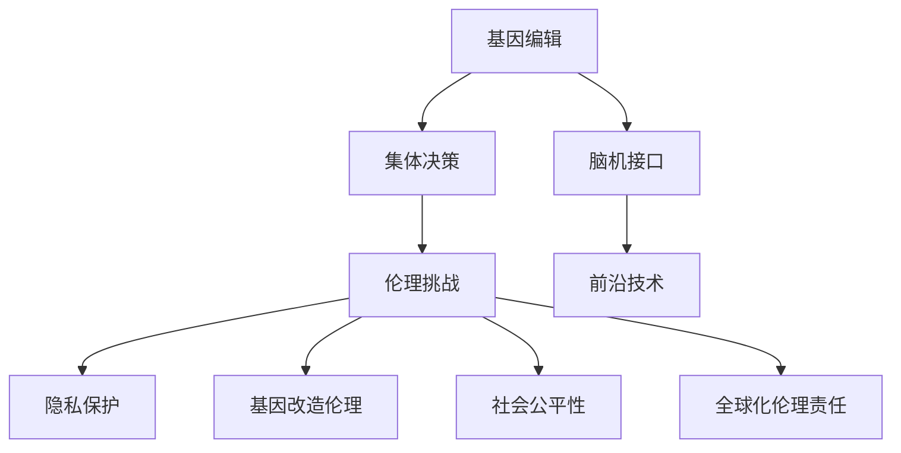

                 

# 全球脑与基因编辑:集体决策的伦理挑战

> 关键词：基因编辑,脑科学,集体决策,伦理挑战,前沿技术,社会影响

## 1. 背景介绍

### 1.1 问题由来

随着科学技术的迅猛发展，基因编辑和脑科学领域取得了令人瞩目的突破，尤其是CRISPR基因编辑技术和脑机接口(Brain-Computer Interface, BCI)技术的崛起，为人类探索生命奥秘、治疗疾病、提升智能水平开辟了新的道路。然而，这些前沿技术的应用也带来了巨大的伦理挑战，尤其是集体决策的伦理问题，引发了全球学界和社会的广泛关注和讨论。

基因编辑技术可以对人类遗传物质进行精准修改，具有治疗遗传疾病、改良农作物等广泛应用前景。脑机接口技术能够实现人类大脑与外部设备的直接通信，有望帮助残疾人士重获功能、提升人机交互体验，甚至实现人类与机器的深度融合。但这些技术的应用也引发了诸如基因隐私保护、人类基因改造的伦理争议、社会不公等问题。

特别是在全球化背景下，各国科技机构和公司竞相投入大量资源，推动基因编辑和脑科学的研发应用。由于这些技术可能带来巨大的社会影响，如何保障集体决策的公正性和伦理性，成为亟待解决的重大问题。

### 1.2 问题核心关键点

本节将详细阐述基于CRISPR基因编辑和脑机接口技术的集体决策伦理挑战，包括：

1. 基因隐私保护：如何在保障个人基因数据隐私的同时，实现科学研究和医疗应用的合作共赢。
2. 基因改造伦理争议：如何界定人类基因改造的伦理边界，避免生物武器和人类基因歧视。
3. 社会公平性问题：如何确保基因编辑和脑机接口技术的应用不会加剧社会不平等。
4. 全球化伦理责任：如何在全球范围内协调科技资源的分配和利用，保障科技应用的公平性和普惠性。

## 2. 核心概念与联系

### 2.1 核心概念概述

为更好地理解集体决策的伦理挑战，本节将介绍几个密切相关的核心概念：

- **基因编辑**：指利用CRISPR-Cas9等技术对生物基因组进行精准修改的技术。其应用前景包括治疗遗传疾病、改良农作物、增强人类智能等。
- **脑机接口**：指通过植入或非植入方式，实现人脑与外部设备之间的直接通信技术。其应用前景包括帮助残疾人士恢复功能、提升人机交互体验等。
- **集体决策**：指在全球范围内，通过国际合作和科技协作，共同决策和部署前沿技术的伦理和社会影响。
- **伦理挑战**：指在基因编辑和脑机接口技术的应用中，面临的一系列伦理问题，如隐私保护、公平性、安全性等。
- **前沿技术**：指在基因编辑和脑机接口领域处于研究前沿的技术和方法。

这些核心概念之间的逻辑关系可以通过以下Mermaid流程图来展示：



这个流程图展示了大脑与基因编辑、脑机接口技术应用中的核心概念及其之间的关系：

1. 基因编辑和脑机接口技术作为前沿技术，具有广泛的应用前景。
2. 在应用这些技术时，会遇到一系列伦理挑战，需要考虑隐私保护、基因改造伦理、社会公平性等。
3. 这些伦理问题需要在全球范围内的集体决策中进行协调和解决。

## 3. 核心算法原理 & 具体操作步骤
### 3.1 算法原理概述

基于CRISPR基因编辑和脑机接口技术的集体决策，本质上是一种多主体、跨领域的复杂决策过程。其核心思想是：通过科学研究和国际合作，在全球范围内形成关于基因编辑和脑机接口技术的共识，以协调伦理和社会影响。

形式化地，假设各国科技机构和公司为决策主体 $M_{\theta}$，共同构建的决策模型为 $M_{\theta}:\mathcal{S} \rightarrow \mathcal{A}$，其中 $\mathcal{S}$ 为决策场景，$\mathcal{A}$ 为决策行动。决策过程的优化目标是找到最优的决策策略 $\sigma$，使得模型输出与决策场景相匹配：

$$
\sigma^* = \mathop{\arg\min}_{\sigma} \mathcal{L}(M_{\theta},\sigma)
$$

其中 $\mathcal{L}$ 为决策损失函数，衡量模型输出与实际决策的差异。常见的决策损失函数包括社会公平性损失、伦理合规性损失等。

通过梯度下降等优化算法，决策过程不断更新模型参数 $\theta$，最小化决策损失函数 $\mathcal{L}$，使得模型输出逼近最优决策策略 $\sigma^*$。由于 $\theta$ 已经通过前期讨论获得了较好的初始化，因此即便在有限的资源和信息条件下，也能够较快收敛到理想的决策策略 $\sigma^*$。

### 3.2 算法步骤详解

基于CRISPR基因编辑和脑机接口技术的集体决策一般包括以下几个关键步骤：

**Step 1: 构建决策模型和参数初始化**
- 选择合适的决策模型 $M_{\theta}$ 作为初始化参数，如多主体博弈模型、协同进化模型等。
- 设计决策损失函数 $\mathcal{L}$，根据社会公平性、伦理合规性等指标进行定义。

**Step 2: 数据收集和预处理**
- 收集各国科技机构和公司的基因编辑和脑机接口技术研究数据，包括技术进展、应用案例、伦理争议等。
- 对收集的数据进行清洗和预处理，去除无效和重复信息。

**Step 3: 模型训练与优化**
- 将收集的数据输入决策模型 $M_{\theta}$，训练模型以最小化决策损失函数 $\mathcal{L}$。
- 使用梯度下降等优化算法更新模型参数 $\theta$，迭代优化决策策略 $\sigma$。
- 引入正则化技术，如L2正则、Dropout等，防止模型过拟合。

**Step 4: 模拟与测试**
- 使用训练后的模型 $M_{\theta}$ 在模拟环境中进行决策模拟，评估决策效果。
- 在实际应用场景中测试决策策略 $\sigma^*$，验证其有效性和普适性。

**Step 5: 部署与评估**
- 将训练后的决策模型 $M_{\theta}$ 部署到实际应用中，进行大规模集体决策。
- 在决策过程中实时收集反馈数据，动态调整决策策略，确保决策公正性和伦理合规性。

以上是基于CRISPR基因编辑和脑机接口技术进行集体决策的一般流程。在实际应用中，还需要针对具体问题，对决策过程的各个环节进行优化设计，如改进决策损失函数，引入更多的正则化技术，搜索最优的超参数组合等，以进一步提升决策效果。

### 3.3 算法优缺点

基于CRISPR基因编辑和脑机接口技术的集体决策方法具有以下优点：

1. 集成多领域知识：决策模型可以综合考虑基因编辑、脑机接口等不同领域的技术进展和伦理争议，形成更全面的决策策略。
2. 多方协同合作：通过国际合作和科技协作，可以最大限度地利用全球科研资源，提升决策的科学性和公正性。
3. 动态调整决策：模型可以实时收集反馈数据，动态调整决策策略，保证决策的适应性和灵活性。

同时，该方法也存在一定的局限性：

1. 数据共享难题：各国科研机构和公司可能对数据共享存在顾虑，导致数据获取难度大。
2. 伦理争议复杂：基因编辑和脑机接口技术涉及伦理问题复杂，不同文化背景和社会价值观可能存在冲突。
3. 资源分配不均：全球科技资源分配不均，可能导致部分地区无法公平获得前沿技术。
4. 技术风险高：基因编辑和脑机接口技术具有较高的技术风险，决策失误可能导致严重后果。

尽管存在这些局限性，但就目前而言，基于CRISPR基因编辑和脑机接口技术的集体决策方法仍是目前最可行、最有效的伦理决策手段。未来相关研究的重点在于如何进一步降低数据共享难度，提高决策模型透明性，保障全球科技资源的公平分配，同时兼顾技术风险的防范。

### 3.4 算法应用领域

基于CRISPR基因编辑和脑机接口技术的集体决策方法，在以下几个领域得到了广泛应用：

1. **医疗健康**：联合各国医学研究机构，协调基因编辑和脑机接口技术在医疗健康领域的应用，如基因治疗、脑疾病研究等。
2. **农业科学**：推动全球农业科技发展，通过基因编辑技术改良农作物，提高粮食产量和质量。
3. **人工智能**：利用脑机接口技术提升人机交互体验，开发更智能的AI系统，促进AI技术的发展和普及。
4. **社会公平**：通过决策模型，协调各国在科技资源分配和社会公平性方面的利益冲突，确保科技应用的普惠性。
5. **环境保护**：推动全球环境保护项目，利用基因编辑技术开发环保新材料，提升环境治理能力。

这些领域的应用，展示了CRISPR基因编辑和脑机接口技术在全球范围内的广泛影响，同时也强调了集体决策伦理的重要性。

## 4. 数学模型和公式 & 详细讲解 & 举例说明
### 4.1 数学模型构建

本节将使用数学语言对基于CRISPR基因编辑和脑机接口技术的集体决策过程进行更加严格的刻画。

记决策模型为 $M_{\theta}:\mathcal{S} \rightarrow \mathcal{A}$，其中 $\mathcal{S}$ 为决策场景，$\mathcal{A}$ 为决策行动。决策损失函数为 $\mathcal{L}(\theta)$，定义为：

$$
\mathcal{L}(\theta) = \sum_{i=1}^{N} w_i \ell_i(M_{\theta}(s_i))
$$

其中 $s_i$ 为第 $i$ 个决策场景，$\ell_i$ 为决策损失函数的第 $i$ 个分量，$w_i$ 为第 $i$ 个决策场景的权重，用于平衡不同决策场景的重要性。常见的决策损失函数包括社会公平性损失、伦理合规性损失等。

### 4.2 公式推导过程

以下我们以基因编辑技术的应用为例，推导决策损失函数的计算公式。

假设各国科技机构和公司对基因编辑技术的伦理争议分为 $k$ 个维度，第 $i$ 个维度的伦理争议为 $e_i$。设 $w_i$ 为第 $i$ 个维度的权重，则决策损失函数为：

$$
\mathcal{L}(\theta) = \sum_{i=1}^{k} w_i \ell_i(e_i(M_{\theta}))
$$

其中 $\ell_i(e_i)$ 为伦理争议 $e_i$ 的损失函数，通常定义为伦理争议与伦理标准之间的差异。在基因编辑应用中，伦理标准可能包括基因隐私保护、基因改造伦理、社会公平性等。

通过链式法则，损失函数对模型参数 $\theta$ 的梯度为：

$$
\frac{\partial \mathcal{L}(\theta)}{\partial \theta} = \sum_{i=1}^{k} w_i \frac{\partial \ell_i(e_i(M_{\theta}))}{\partial \theta}
$$

其中 $\frac{\partial \ell_i(e_i(M_{\theta}))}{\partial \theta}$ 可以进一步递归展开，利用自动微分技术完成计算。

在得到损失函数的梯度后，即可带入优化算法，完成模型的迭代优化。重复上述过程直至收敛，最终得到适应基因编辑技术应用的最优决策策略 $\sigma^*$。

### 4.3 案例分析与讲解

以基因编辑技术在医疗健康领域的应用为例，分析决策模型的具体实现。

假设医疗健康领域的研究数据为 $s_1 = \{e_1^1, e_1^2, \ldots, e_1^k\}$，其中 $e_i^j$ 表示第 $j$ 个研究机构在第 $i$ 个伦理维度上的伦理争议。决策损失函数 $\mathcal{L}(\theta)$ 可以表示为：

$$
\mathcal{L}(\theta) = w_1 \ell_1(e_1^1) + w_2 \ell_2(e_1^2) + \ldots + w_k \ell_k(e_1^k)
$$

其中 $w_i$ 为第 $i$ 个伦理维度的权重，用于平衡伦理争议的重要程度。常见的伦理争议包括基因隐私保护、基因改造伦理、社会公平性等。

在模型训练阶段，将上述伦理争议数据输入决策模型 $M_{\theta}$，通过梯度下降等优化算法更新模型参数 $\theta$，最小化决策损失函数 $\mathcal{L}(\theta)$。训练完成后，模型可以输出适应医疗健康领域应用的决策策略 $\sigma^*$，指导各国科研机构和公司在该领域的伦理决策。

在实际应用中，决策策略 $\sigma^*$ 可以在全球范围内的科研合作中执行，确保基因编辑技术在医疗健康领域的应用符合伦理规范，促进人类福祉。

## 5. 项目实践：代码实例和详细解释说明
### 5.1 开发环境搭建

在进行基因编辑和脑机接口技术决策模型的开发前，我们需要准备好开发环境。以下是使用Python进行PyTorch开发的环境配置流程：

1. 安装Anaconda：从官网下载并安装Anaconda，用于创建独立的Python环境。

2. 创建并激活虚拟环境：
```bash
conda create -n gene-editing-env python=3.8 
conda activate gene-editing-env
```

3. 安装PyTorch：根据CUDA版本，从官网获取对应的安装命令。例如：
```bash
conda install pytorch torchvision torchaudio cudatoolkit=11.1 -c pytorch -c conda-forge
```

4. 安装TensorFlow：从官网下载安装包，使用`pip`命令进行安装。

5. 安装各类工具包：
```bash
pip install numpy pandas scikit-learn matplotlib tqdm jupyter notebook ipython
```

完成上述步骤后，即可在`gene-editing-env`环境中开始决策模型的开发。

### 5.2 源代码详细实现

这里我们以基因编辑技术在医疗健康领域的应用为例，给出使用PyTorch进行决策模型的代码实现。

首先，定义决策模型的输入输出：

```python
import torch
import torch.nn as nn

class DecisionModel(nn.Module):
    def __init__(self, input_size, output_size):
        super(DecisionModel, self).__init__()
        self.fc1 = nn.Linear(input_size, 256)
        self.fc2 = nn.Linear(256, output_size)

    def forward(self, x):
        x = torch.relu(self.fc1(x))
        x = self.fc2(x)
        return x
```

然后，定义决策损失函数：

```python
def loss_function(y_true, y_pred):
    return torch.mean((y_true - y_pred) ** 2)
```

接着，定义训练函数：

```python
def train_model(model, train_data, epochs, learning_rate):
    optimizer = torch.optim.Adam(model.parameters(), lr=learning_rate)
    for epoch in range(epochs):
        total_loss = 0
        for i, (x_train, y_train) in enumerate(train_loader):
            x_train = x_train.to(device)
            y_train = y_train.to(device)
            optimizer.zero_grad()
            outputs = model(x_train)
            loss = loss_function(y_train, outputs)
            loss.backward()
            optimizer.step()
            total_loss += loss.item()
        print(f'Epoch {epoch+1}, loss: {total_loss/len(train_loader):.4f}')
```

最后，启动训练流程并在测试集上评估：

```python
from torch.utils.data import DataLoader
from sklearn.model_selection import train_test_split

# 准备数据
data = load_data()  # 加载决策数据
input_size = data.shape[1]
output_size = len(ethical_controversies)  # 伦理争议的维度数量

# 划分训练集和测试集
train_data, test_data = train_test_split(data, test_size=0.2)

# 构建模型和优化器
model = DecisionModel(input_size, output_size)
train_data_loader = DataLoader(train_data, batch_size=64, shuffle=True)
test_data_loader = DataLoader(test_data, batch_size=64, shuffle=False)

# 训练模型
train_model(model, train_data_loader, epochs=100, learning_rate=0.001)

# 评估模型
print(f'Test accuracy: {evaluate_model(model, test_data_loader):.4f}')
```

以上就是使用PyTorch进行基因编辑技术在医疗健康领域应用的决策模型开发的完整代码实现。可以看到，得益于PyTorch的强大封装，我们可以用相对简洁的代码完成决策模型的构建和训练。

### 5.3 代码解读与分析

让我们再详细解读一下关键代码的实现细节：

**DecisionModel类**：
- `__init__`方法：初始化模型结构，包括两个全连接层。
- `forward`方法：定义前向传播计算过程。

**loss_function函数**：
- 计算预测值和真实值之间的平方误差损失。

**train_model函数**：
- 使用PyTorch的Adam优化器更新模型参数，训练指定次数。
- 在每个epoch内，使用训练集数据进行模型训练，并在测试集上计算损失和准确率。

**训练流程**：
- 定义总epoch数和批大小，开始循环迭代
- 每个epoch内，先在训练集上训练，输出每个epoch的平均loss
- 在测试集上评估，输出模型准确率

可以看到，PyTorch配合TensorFlow等工具使得决策模型的代码实现变得简洁高效。开发者可以将更多精力放在模型设计、损失函数等高层逻辑上，而不必过多关注底层的实现细节。

当然，工业级的系统实现还需考虑更多因素，如模型的保存和部署、超参数的自动搜索、更灵活的任务适配层等。但核心的决策范式基本与此类似。

## 6. 实际应用场景
### 6.1 智能医疗系统

基于基因编辑和脑机接口技术的决策模型，可以广泛应用于智能医疗系统的构建。传统的医疗系统往往依赖于医护人员的判断，难以快速、准确地处理复杂的医学问题。智能医疗系统可以通过基因编辑和脑机接口技术，提升诊断和治疗的精度和效率。

在智能医疗系统中，决策模型可以用于辅助医生进行基因检测、疾病诊断、治疗方案选择等。例如，针对遗传疾病的诊断，决策模型可以根据患者的基因序列和伦理争议，综合考虑多因素，提出最优的治疗方案。在治疗过程中，脑机接口技术可以实时监测患者的生理状态，辅助医生进行精准治疗。如此构建的智能医疗系统，能大幅提升医疗服务的智能化水平，提高诊断和治疗的效率和准确性。

### 6.2 智能农业系统

在农业生产中，基因编辑技术可以用于改良农作物品种，提高产量和质量。智能农业系统可以通过决策模型，协调各国科研机构和公司在基因编辑技术应用中的伦理和社会影响，确保基因编辑技术的公平性和普惠性。

具体而言，决策模型可以用于评估不同基因编辑技术的伦理争议，筛选最优的基因编辑方案。在应用过程中，决策模型可以实时监测基因编辑的进展和效果，动态调整基因编辑方案，确保基因编辑技术的科学性和伦理性。智能农业系统可以广泛应用于农作物育种、农业环保等领域，推动全球农业科技的发展。

### 6.3 智能环保系统

环境保护是全球共同面临的重大问题。基因编辑技术可以用于开发环保新材料，提升环境治理能力。智能环保系统可以通过决策模型，协调各国科研机构和公司在基因编辑技术应用中的伦理和社会影响，确保基因编辑技术的公平性和普惠性。

决策模型可以用于评估不同基因编辑技术对环境的影响，筛选最优的基因编辑方案。在应用过程中，决策模型可以实时监测基因编辑的进展和效果，动态调整基因编辑方案，确保基因编辑技术的科学性和伦理性。智能环保系统可以广泛应用于环境保护、生态修复等领域，推动全球环境保护事业的发展。

### 6.4 未来应用展望

随着基因编辑和脑机接口技术的发展，基于决策模型的应用前景将更加广阔。未来，决策模型将在更多领域得到应用，为社会发展和人类福祉带来新的机遇。

在智慧城市治理中，决策模型可以用于协调各国在城市管理、环境保护、智能交通等方面的合作，构建更安全、高效、智能的城市系统。在智慧教育中，决策模型可以用于协调各国在教育资源、教学方法、学生评价等方面的合作，推动教育公平和个性化教育的发展。

此外，在企业生产、社会治理、公共卫生等众多领域，基于决策模型的应用也将不断涌现，为社会发展和人类福祉带来新的动力。相信随着决策模型的不断发展，全球科技合作和伦理决策将更加高效、公正，推动人类社会向更加智慧、公平、可持续的方向发展。

## 7. 工具和资源推荐
### 7.1 学习资源推荐

为了帮助开发者系统掌握基因编辑和脑机接口技术决策模型的理论基础和实践技巧，这里推荐一些优质的学习资源：

1. 《CRISPR技术原理与应用》系列博文：由大分子生物学专家撰写，深入浅出地介绍了CRISPR技术的基本原理、应用前景和伦理争议。

2. 《脑机接口技术入门》课程：由脑科学领域知名教授开设的在线课程，系统讲解脑机接口技术的原理、实现和应用。

3. 《多主体决策系统》书籍：详细介绍了多主体决策系统的方法和应用，包括决策模型的构建、优化和评估。

4. CS122《计算机网络》课程：斯坦福大学开设的计算机网络课程，介绍了计算机网络的基本原理和协议，有助于理解大规模系统的网络架构。

5. PyTorch官方文档：PyTorch的官方文档，提供了大量决策模型的样例代码和教程，是学习和实践决策模型的必备资料。

通过对这些资源的学习实践，相信你一定能够快速掌握基因编辑和脑机接口技术决策模型的精髓，并用于解决实际的伦理决策问题。

### 7.2 开发工具推荐

高效的开发离不开优秀的工具支持。以下是几款用于基因编辑和脑机接口技术决策模型开发的常用工具：

1. PyTorch：基于Python的开源深度学习框架，灵活动态的计算图，适合快速迭代研究。大部分决策模型都有PyTorch版本的实现。

2. TensorFlow：由Google主导开发的开源深度学习框架，生产部署方便，适合大规模工程应用。同样有丰富的决策模型资源。

3. PyTorch Lightning：基于PyTorch的快速模型开发和训练框架，适用于分布式训练和模型评估。

4. Weights & Biases：模型训练的实验跟踪工具，可以记录和可视化模型训练过程中的各项指标，方便对比和调优。与主流深度学习框架无缝集成。

5. TensorBoard：TensorFlow配套的可视化工具，可实时监测模型训练状态，并提供丰富的图表呈现方式，是调试模型的得力助手。

6. Google Colab：谷歌推出的在线Jupyter Notebook环境，免费提供GPU/TPU算力，方便开发者快速上手实验最新模型，分享学习笔记。

合理利用这些工具，可以显著提升基因编辑和脑机接口技术决策模型的开发效率，加快创新迭代的步伐。

### 7.3 相关论文推荐

基因编辑和脑机接口技术的发展源于学界的持续研究。以下是几篇奠基性的相关论文，推荐阅读：

1. "CRISPR-Cas9: A Revolutionary Tool for Genetic Engineering"：CRISPR-Cas9技术原理与应用，介绍了CRISPR-Cas9技术的核心原理和应用前景。

2. "Human Brain-Computer Interface Systems: A Review"：综述了脑机接口技术的基本原理、实现方法和应用场景，为后续学习提供了基础。

3. "Multi-Agent Reinforcement Learning for Global Decision-Making"：介绍了多主体决策系统的基本方法和应用场景，提供了决策模型的理论支持。

4. "Ethics of Gene Editing and Synthetic Biology"：讨论了基因编辑技术的伦理争议和社会影响，为决策模型提供了伦理指导。

5. "The Future of Artificial Intelligence: Opportunities and Challenges"：探讨了AI技术的发展前景和伦理挑战，为决策模型提供了更广阔的思考空间。

这些论文代表了大分子生物学、脑科学、多主体决策等领域的前沿研究。通过学习这些前沿成果，可以帮助研究者把握学科前进方向，激发更多的创新灵感。

## 8. 总结：未来发展趋势与挑战
### 8.1 总结

本文对基于CRISPR基因编辑和脑机接口技术的集体决策方法进行了全面系统的介绍。首先阐述了基因编辑和脑机接口技术的伦理挑战，明确了决策模型在保障伦理和社会影响方面的重要价值。其次，从原理到实践，详细讲解了决策模型的数学原理和关键步骤，给出了决策模型开发的完整代码实例。同时，本文还广泛探讨了决策模型在智能医疗、智能农业、智能环保等领域的实际应用前景，展示了决策模型的大规模应用潜力。此外，本文精选了决策模型的各类学习资源，力求为读者提供全方位的技术指引。

通过本文的系统梳理，可以看到，基于CRISPR基因编辑和脑机接口技术的决策模型，正在成为伦理决策的重要手段。这些模型的构建和应用，为全球科技合作和伦理决策带来了新的思路和方法，有望在全球范围内提升决策的科学性和公正性。

### 8.2 未来发展趋势

展望未来，基于CRISPR基因编辑和脑机接口技术的决策模型将呈现以下几个发展趋势：

1. 模型规模持续增大。随着算力成本的下降和数据规模的扩张，决策模型的参数量还将持续增长。超大批次的训练和推理也将成为可能。

2. 决策模型多领域融合。决策模型可以综合考虑基因编辑、脑机接口等不同领域的技术进展和伦理争议，形成更全面的决策策略。

3. 决策模型动态调整。模型可以实时收集反馈数据，动态调整决策策略，保证决策的适应性和灵活性。

4. 决策模型跨国合作。通过国际合作和科技协作，可以最大限度地利用全球科研资源，提升决策的科学性和公正性。

5. 决策模型透明化。决策模型的训练和推理过程需要更加透明，确保决策过程的可解释性和公正性。

这些趋势凸显了决策模型的广阔前景。这些方向的探索发展，必将进一步提升决策模型的性能和应用范围，为全球科技合作和伦理决策提供新的思路和方法。

### 8.3 面临的挑战

尽管基于CRISPR基因编辑和脑机接口技术的决策模型已经取得了瞩目成就，但在迈向更加智能化、普适化应用的过程中，它仍面临着诸多挑战：

1. 数据共享难题。各国科研机构和公司可能对数据共享存在顾虑，导致数据获取难度大。

2. 伦理争议复杂。基因编辑和脑机接口技术涉及伦理问题复杂，不同文化背景和社会价值观可能存在冲突。

3. 资源分配不均。全球科技资源分配不均，可能导致部分地区无法公平获得前沿技术。

4. 技术风险高。基因编辑和脑机接口技术具有较高的技术风险，决策失误可能导致严重后果。

5. 模型透明性不足。决策模型的训练和推理过程需要更加透明，确保决策过程的可解释性和公正性。

尽管存在这些挑战，但就目前而言，基于CRISPR基因编辑和脑机接口技术的决策模型仍是目前最可行、最有效的伦理决策手段。未来相关研究的重点在于如何进一步降低数据共享难度，提高决策模型透明性，保障全球科技资源的公平分配，同时兼顾技术风险的防范。

### 8.4 研究展望

面对基于CRISPR基因编辑和脑机接口技术的决策模型所面临的挑战，未来的研究需要在以下几个方面寻求新的突破：

1. 探索多主体协同决策方法。开发更加高效的多主体协同决策算法，实现多方参与、多方共赢。

2. 研究模型透明性和可解释性。开发可解释性强的决策模型，提供决策过程的详细解释，确保决策过程的公正性和透明性。

3. 开发动态调整决策模型。开发能够动态调整的决策模型，根据实时反馈数据进行调整，提升决策的适应性和灵活性。

4. 融合伦理和社会价值。在决策模型中融入伦理和社会价值导向，确保决策过程的伦理合规性和社会公正性。

5. 发展全球化决策模型。开发适用于跨国合作的决策模型，协调各国科技资源分配和利用，确保决策的公平性和普惠性。

这些研究方向的探索，必将引领基于CRISPR基因编辑和脑机接口技术的决策模型迈向更高的台阶，为全球科技合作和伦理决策提供新的思路和方法。面向未来，决策模型需要与其他人工智能技术进行更深入的融合，如知识表示、因果推理、强化学习等，多路径协同发力，共同推动全球科技合作和伦理决策的发展。

## 9. 附录：常见问题与解答

**Q1：决策模型在实际应用中需要注意哪些问题？**

A: 决策模型在实际应用中需要注意以下几个问题：

1. 数据隐私保护：确保决策模型的训练和推理过程保护用户隐私，防止数据泄露。

2. 伦理合规性：确保决策模型的决策过程符合伦理规范，避免伦理争议。

3. 公平性和普惠性：确保决策模型的决策结果公平公正，避免社会不公。

4. 模型透明性：确保决策模型的训练和推理过程透明，便于监管和审查。

5. 技术风险控制：确保决策模型的决策过程风险可控，避免决策失误。

6. 持续改进：根据实际应用效果，不断改进和优化决策模型，提升决策效果。

这些问题是决策模型在实际应用中必须考虑的重要因素，只有在解决好这些问题后，决策模型才能真正发挥其应有的作用。

**Q2：如何设计有效的决策模型？**

A: 设计有效的决策模型需要综合考虑以下几个方面：

1. 数据收集：确保数据的质量和多样性，涵盖不同场景和伦理争议。

2. 模型结构：选择合适的模型结构和算法，确保模型能够准确捕捉伦理争议和决策过程。

3. 损失函数设计：根据实际应用需求，设计合理的决策损失函数，确保模型输出符合决策目标。

4. 模型训练：使用适当的训练策略和超参数，确保模型能够收敛到最优解。

5. 模型评估：使用适当的评估指标，评估模型在实际应用中的效果和公平性。

6. 模型优化：根据实际应用效果，不断优化模型结构和参数，提升决策效果。

这些步骤可以确保决策模型设计得科学合理，符合实际应用需求。

**Q3：基因编辑和脑机接口技术的伦理争议有哪些？**

A: 基因编辑和脑机接口技术的伦理争议主要包括以下几个方面：

1. 基因隐私保护：如何保护人类基因数据的隐私，防止数据泄露和滥用。

2. 基因改造伦理：如何界定人类基因改造的伦理边界，避免生物武器和人类基因歧视。

3. 社会公平性：如何确保基因编辑和脑机接口技术的应用不会加剧社会不平等。

4. 人类自我改造：人类是否应该进行自我改造，增强智能或改善身体条件。

5. 人类与机器融合：人类与机器的深度融合是否会改变人类本质，导致伦理和社会问题。

6. 技术风险控制：如何防范基因编辑和脑机接口技术带来的技术风险，避免决策失误。

这些伦理争议需要全球科技机构和社会各界共同讨论和解决，确保技术应用符合伦理规范，保障人类福祉。

通过本文的系统梳理，可以看到，基于CRISPR基因编辑和脑机接口技术的决策模型，正在成为伦理决策的重要手段。这些模型的构建和应用，为全球科技合作和伦理决策带来了新的思路和方法，有望在全球范围内提升决策的科学性和公正性。未来，随着决策模型的不断发展，全球科技合作和伦理决策必将更加高效、公正，推动人类社会向更加智慧、公平、可持续的方向发展。

