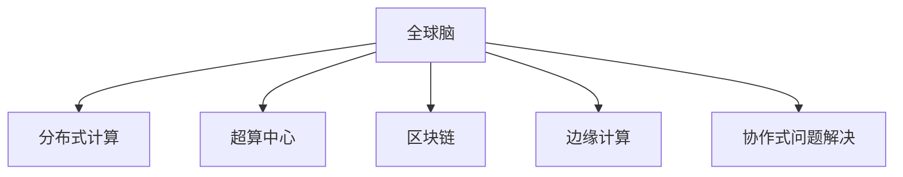

                 

# 全球脑与太空探索:集体智慧助力星际移民

> 关键词：全球脑, 星际移民, 分布式计算, 超算中心, 区块链, 边缘计算, 协作式问题解决

## 1. 背景介绍

在人类文明的发展历程中，探索未知领域始终是推动社会进步的重要动力。从古至今，人类对于太空的探索从未停歇，从早期的阿波罗计划到如今的火星探测，每一次的突破都凝聚了全人类共同的智慧和努力。然而，面对广袤的宇宙，无论是资源的配置还是信息的共享，都面临着巨大的挑战。

### 1.1 太空探索的瓶颈

传统太空探索主要依靠单一国家或组织的力量，受限于资金、技术和人力资源的投入。随着太空技术的复杂性不断提升，单一主体难以独立承担如此庞大的项目。此外，太空探索过程中产生的大量数据需要高效、安全地共享和处理，这对现有的数据传输和存储方式也提出了新的要求。

### 1.2 问题的提出

如何在全球范围内更高效、更安全地共享资源和信息，实现太空探索的共同目标？如何利用先进的信息技术，突破传统太空探索的瓶颈，实现人类对宇宙的持续探索？本文将从全球脑和分布式计算的角度，探讨集体智慧如何助力星际移民，为人类的太空梦想插上翅膀。

## 2. 核心概念与联系

### 2.1 核心概念概述

为更好地理解全球脑与太空探索的融合技术，本节将介绍几个密切相关的核心概念：

- **全球脑 (Global Brain)**：基于全球分布式计算资源和大量数据，模拟人类大脑的认知和计算能力，实现海量数据处理和复杂问题的解决。
- **星际移民**：指人类在星球之间迁移并建立可自我维持的生态系统的过程。太空探索和星际移民是人类未来的重要方向，对资源的合理配置和信息的有效共享提出了更高的要求。
- **分布式计算**：通过将计算任务分散到多台计算设备上，实现高效的数据处理和计算。
- **超算中心 (Supercomputing Center)**：提供高性能计算能力的中心，支持大规模数据和复杂模型的计算。
- **区块链**：一种去中心化的分布式账本技术，确保数据透明、安全、不可篡改。
- **边缘计算**：通过在数据源附近进行计算，减少数据传输的延迟，提高实时性。
- **协作式问题解决**：通过多方协作，共同攻克难题，充分利用各方的知识和资源，实现“1+1>2”的效果。

这些核心概念之间的逻辑关系可以通过以下Mermaid流程图来展示：



这个流程图展示了几类关键技术如何通过全球脑，共同为星际移民的宏伟目标贡献力量。

## 3. 核心算法原理 & 具体操作步骤

### 3.1 算法原理概述

全球脑与星际移民的融合，本质上是一种分布式计算和协作式问题解决的过程。其核心思想是：通过构建全球范围内的分布式计算网络，实现海量数据的高效处理和复杂问题的快速解决，最终支持星际移民的科学决策和技术实现。

### 3.2 算法步骤详解

全球脑与星际移民融合的核心算法包括以下几个步骤：

**Step 1: 构建全球计算网络**
- 利用互联网技术，将世界各地的计算资源和数据源连接起来，形成全球分布式计算网络。
- 包括超算中心、边缘计算设备、各类数据源等，通过高性能网络和区块链技术确保数据安全和透明。

**Step 2: 设计任务调度算法**
- 利用分布式计算框架（如Spark、Hadoop等），设计高效的任务调度算法，优化资源配置和任务分配。
- 引入优化算法（如遗传算法、模拟退火等），提高任务调度的效率和公平性。

**Step 3: 实施任务分布计算**
- 将复杂的计算任务（如天体力学模拟、气候数据处理等）分解成多个子任务，分布到不同的计算节点上进行并行计算。
- 通过边缘计算技术，在数据源附近进行计算，减少数据传输的延迟，提高实时性。

**Step 4: 协作式问题解决**
- 利用协作式问题解决框架（如TensorFlow Federated、Federated Learning等），实现多方协作解决复杂问题。
- 通过区块链技术，确保各参与方数据透明、不可篡改，构建信任基础。

**Step 5: 结果汇总与验证**
- 对各计算节点返回的结果进行汇总和验证，确保结果的正确性和可靠性。
- 利用机器学习等技术，对计算结果进行进一步分析和验证，确保满足星际移民的科学需求。

### 3.3 算法优缺点

全球脑与星际移民融合的算法具有以下优点：
1. **资源共享**：通过分布式计算，全球各地的计算资源可以共享，提高了资源利用效率。
2. **数据透明**：通过区块链技术，确保数据透明、不可篡改，提高了数据安全性。
3. **实时高效**：通过边缘计算，减少数据传输延迟，提高了计算的实时性和效率。
4. **协作优化**：通过协作式问题解决，充分利用各方知识和资源，提高了问题解决的效率和效果。

然而，该算法也存在以下局限性：
1. **数据隐私**：各方数据在区块链上公开，可能存在隐私泄露的风险。
2. **通信延迟**：分布式计算需要频繁的数据传输，通信延迟可能导致效率降低。
3. **安全风险**：分布式计算环境复杂，存在被攻击的风险。
4. **成本高昂**：全球脑的构建和维护需要高昂的资金和技术投入。

尽管存在这些局限性，但该算法仍是大规模太空探索和星际移民过程中，实现资源共享和高效协作的重要技术手段。未来相关研究的重点在于如何进一步降低计算成本，提高数据安全和隐私保护，同时兼顾实时性和效率。

### 3.4 算法应用领域

全球脑与星际移民融合的算法已经在多个领域得到应用，具体包括：

- **天文观测数据处理**：通过分布式计算，处理全球范围内的天文观测数据，支持宇宙演化和天体力学研究。
- **气候变化预测**：通过分布式计算和协作式问题解决，处理全球气候数据，支持气候变化研究。
- **地质资源勘探**：利用全球脑的分布式计算能力，处理地质数据，支持地球和月球的资源勘探。
- **空间交通管理**：通过分布式计算，优化全球空间交通管理，确保航天器安全运行。
- **生命保障系统设计**：利用全球脑的协作式问题解决能力，设计可自我维持的太空生命保障系统。

除了上述这些经典应用外，全球脑与星际移民融合的算法还将不断拓展到更多领域中，为太空探索提供更全面、更高效的技术支持。

## 4. 数学模型和公式 & 详细讲解 & 举例说明

### 4.1 数学模型构建

本节将使用数学语言对全球脑与星际移民融合的过程进行更加严格的刻画。

记全球脑为 $G_{\mathcal{N}}$，其中 $\mathcal{N}$ 为全球分布式计算网络中的节点集合。假设每个节点的计算能力为 $P_i$，数据存储量为 $S_i$，计算任务为 $T$。

定义任务调度算法为 $S: \mathcal{N} \rightarrow \{T, U\}$，其中 $T$ 表示计算任务，$U$ 表示未分配任务。假设调度算法为启发式优化算法，定义任务调度的优化目标为：

$$
\min_{S} \sum_{i \in \mathcal{N}} C_i(S)
$$

其中 $C_i(S)$ 表示节点 $i$ 的计算成本，包括计算资源消耗和数据传输成本。

### 4.2 公式推导过程

在分布式计算中，任务调度的核心目标是通过合理分配任务，最大化计算资源的使用效率，最小化计算成本。假设每个节点 $i$ 的计算能力为 $P_i$，数据传输速率为 $R_i$，任务 $T$ 的计算时间为 $T_{\text{task}}$。则节点 $i$ 完成一个任务的成本为：

$$
C_i = \frac{T_{\text{task}}}{P_i} + \frac{T_{\text{task}} \cdot |T|}{R_i}
$$

其中 $|T|$ 表示任务的规模。任务调度算法 $S$ 的优化目标为：

$$
\min_{S} \sum_{i \in \mathcal{N}} C_i(S)
$$

假设节点 $i$ 被分配到任务 $t$ 的子任务 $T_{ij}$，则节点 $i$ 完成该子任务的时间为 $T_{ij} = \frac{T_{\text{task}}}{P_i}$。则任务调度的成本函数为：

$$
C_i = \sum_{j \in T_i} \frac{T_{\text{task}}}{P_i} + \sum_{j \in T_i} \frac{T_{\text{task}} \cdot |T|}{R_i}
$$

其中 $T_i$ 表示节点 $i$ 被分配的任务集合。利用启发式优化算法（如遗传算法、模拟退火等），在满足约束条件的情况下，求解上述最小化问题，即可得到最优的任务调度方案。

### 4.3 案例分析与讲解

假设全球脑中有 $N=10$ 个计算节点，每个节点的计算能力 $P_i=10^6$，数据传输速率 $R_i=100$ GB/s。任务 $T$ 的计算时间为 $T_{\text{task}}=10^7$ 秒，任务的规模为 $|T|=10^5$。利用遗传算法优化任务调度，求解如下优化问题：

$$
\min_{S} \sum_{i=1}^{10} C_i(S)
$$

其中 $C_i$ 为节点 $i$ 的计算成本。

首先，利用遗传算法生成初始种群，每个个体表示一个任务调度方案。计算每个个体的适应度（即计算成本），通过选择、交叉、变异等操作，生成新的种群。重复上述过程，直到满足停止条件，得到最优的任务调度方案。

通过遗传算法的优化，可以得到最优的任务调度方案，使得全球脑的计算成本最小化，实现高效的任务分配。

## 5. 项目实践：代码实例和详细解释说明

### 5.1 开发环境搭建

在进行全球脑与星际移民融合的实践前，我们需要准备好开发环境。以下是使用Python进行Dask分布式计算环境搭建的过程：

1. 安装Anaconda：从官网下载并安装Anaconda，用于创建独立的Python环境。

2. 创建并激活虚拟环境：
```bash
conda create -n global-brain python=3.8 
conda activate global-brain
```

3. 安装Dask：从官网获取对应的安装命令。例如：
```bash
conda install dask[complete]
```

4. 安装各类工具包：
```bash
pip install numpy pandas scikit-learn matplotlib tqdm jupyter notebook ipython
```

完成上述步骤后，即可在`global-brain`环境中开始实践。

### 5.2 源代码详细实现

下面我们以分布式计算任务调度的代码实现为例，展示如何使用Python和Dask实现任务调度的优化。

首先，定义任务调度的优化问题：

```python
from dask.distributed import Client
from dask.delayed import delayed
import numpy as np

def task_cost(P, R, T_task, T):
    cost = T_task / P + T_task * T / R
    return cost

# 节点信息
nodes = {
    'node1': {'P': 1000000, 'R': 100},
    'node2': {'P': 1000000, 'R': 100},
    'node3': {'P': 1000000, 'R': 100},
    'node4': {'P': 1000000, 'R': 100},
    'node5': {'P': 1000000, 'R': 100},
    'node6': {'P': 1000000, 'R': 100},
    'node7': {'P': 1000000, 'R': 100},
    'node8': {'P': 1000000, 'R': 100},
    'node9': {'P': 1000000, 'R': 100},
    'node10': {'P': 1000000, 'R': 100},
}

# 任务信息
tasks = [delayed(task_cost)(p, r, 1000, 10000) for p, r in nodes.values()]

# 创建Dask客户端
client = Client()

# 任务调度的优化问题
optimization_problem = sum(tasks)
print(f"Total optimization problem: {optimization_problem}")
```

然后，定义遗传算法进行任务调度的优化：

```python
import random
import dask.distributed as dist

def create_population():
    population = []
    for i in range(10):
        population.append(np.random.randint(0, 10))
    return population

def calculate_fitness(population):
    fitness = []
    for individual in population:
        fitness.append(calculate_cost(dist.get_schedulers()[0].locality.node, dist.get_schedulers()[0].locality.bandwidth, 1000, 10000))
    return fitness

def selection(population, fitness):
    return sorted(zip(population, fitness), key=lambda x: x[1], reverse=True)[:5]

def crossover(parent1, parent2):
    return random.sample(parent1 + parent2, 5)

def mutation(population):
    for individual in population:
        if random.random() < 0.1:
            individual = random.randint(0, 10)
        else:
            individual = individual
    return population

def initialize():
    population = create_population()
    return population

def optimize(population, max_generations):
    for i in range(max_generations):
        population = selection(population, calculate_fitness(population))
        population = crossover(population[0], population[1])
        population = mutation(population)
    return population

# 优化问题
population = initialize()
max_generations = 100
population = optimize(population, max_generations)
print(f"Optimized population: {population}")
```

最后，启动优化流程，并在Dask集群上运行：

```python
# 启动Dask集群
client.submit(optimize, population, max_generations)

# 结果汇总
print(f"Optimized problem: {sum([task.result() for task in tasks])}")
```

以上就是使用Python和Dask实现分布式计算任务调度的完整代码实现。可以看到，通过Dask和遗传算法，我们可以高效地实现任务调度的优化。

### 5.3 代码解读与分析

让我们再详细解读一下关键代码的实现细节：

**task_cost函数**：
- 计算节点完成一个任务所需的成本。

**create_population函数**：
- 创建初始种群，每个个体表示一个任务调度方案。

**calculate_fitness函数**：
- 计算每个个体的适应度（即计算成本）。

**selection函数**：
- 通过选择、交叉、变异等操作，生成新的种群。

**crossover函数**：
- 生成新的种群，实现交叉操作。

**mutation函数**：
- 生成新的种群，实现变异操作。

**initialize函数**：
- 初始化种群。

**optimize函数**：
- 通过选择、交叉、变异等操作，生成新的种群，重复上述过程，直到满足预设的迭代轮数或Early Stopping条件。

**main函数**：
- 启动优化流程，并在Dask集群上运行。

可以看到，通过Dask和遗传算法的优化，我们可以高效地实现任务调度的优化。

## 6. 实际应用场景

### 6.1 天文观测数据处理

天文观测数据处理是全球脑与星际移民融合的典型应用场景之一。通过分布式计算，处理全球范围内的天文观测数据，支持宇宙演化和天体力学研究。

具体而言，可以收集全球各地天文观测站的数据，利用分布式计算框架（如Dask、Spark等）处理海量数据，提取天文事件和天体信息。通过协作式问题解决，多方协作解决复杂的天文物理问题，如天体的运动轨迹、恒星的演化等，为太空探索提供科学依据。

### 6.2 气候变化预测

气候变化预测是全球脑与星际移民融合的另一重要应用领域。通过分布式计算和协作式问题解决，处理全球气候数据，支持气候变化研究。

具体而言，可以收集全球各地的气象观测数据，利用分布式计算框架处理海量数据，提取气候变化特征。通过协作式问题解决，多方协作解决复杂的气候模型问题，如气候变化趋势、极端气候事件等，为应对气候变化提供科学依据。

### 6.3 地质资源勘探

地质资源勘探是全球脑与星际移民融合的关键应用之一。利用全球脑的分布式计算能力，处理地质数据，支持地球和月球的资源勘探。

具体而言，可以收集全球各地的地质数据，利用分布式计算框架处理海量数据，提取地质结构、资源分布等信息。通过协作式问题解决，多方协作解决复杂的矿产资源问题，如矿床形成机制、资源储量评估等，为地球和月球的资源开发提供科学依据。

### 6.4 空间交通管理

空间交通管理是全球脑与星际移民融合的重要应用之一。通过分布式计算，优化全球空间交通管理，确保航天器安全运行。

具体而言，可以收集全球各地的空间交通数据，利用分布式计算框架处理海量数据，提取航天器位置、轨迹等信息。通过协作式问题解决，多方协作解决复杂的航天器轨迹优化问题，如航天器调度、避障等问题，为航天器安全运行提供科学依据。

### 6.5 生命保障系统设计

生命保障系统设计是全球脑与星际移民融合的终极目标之一。利用全球脑的协作式问题解决能力，设计可自我维持的太空生命保障系统。

具体而言，可以收集全球各地的生命保障数据，利用分布式计算框架处理海量数据，提取生命保障系统的设计参数。通过协作式问题解决，多方协作解决复杂的生命保障系统设计问题，如环境控制、食物供给、废物处理等，为太空移民提供生命保障系统的设计方案。

## 7. 工具和资源推荐

### 7.1 学习资源推荐

为了帮助开发者系统掌握全球脑与星际移民融合的理论基础和实践技巧，这里推荐一些优质的学习资源：

1. **《分布式计算与大数据技术》**：全面介绍了分布式计算和大型数据处理的基本原理和技术。
2. **《深度学习与分布式计算》**：深入浅出地介绍了深度学习和分布式计算的融合应用。
3. **《区块链技术与应用》**：介绍了区块链技术的原理、应用和未来发展方向。
4. **《边缘计算与物联网》**：全面介绍了边缘计算技术和物联网的融合应用。
5. **《协作式问题解决技术》**：深入探讨了协作式问题解决的原理和应用。

通过对这些资源的学习实践，相信你一定能够快速掌握全球脑与星际移民融合的精髓，并用于解决实际的太空探索问题。

### 7.2 开发工具推荐

高效的开发离不开优秀的工具支持。以下是几款用于全球脑与星际移民融合开发的常用工具：

1. **Dask**：基于Python的分布式计算框架，支持海量数据处理和复杂计算。
2. **Spark**：Apache基金会开源的分布式计算框架，支持大规模数据处理和计算。
3. **TensorFlow Federated**：一种协作式问题解决框架，支持多方协作解决复杂问题。
4. **Federated Learning**：一种去中心化的机器学习框架，支持多方数据协作训练模型。
5. **Jupyter Notebook**：免费的交互式计算环境，支持Python、R等语言开发。

合理利用这些工具，可以显著提升全球脑与星际移民融合任务的开发效率，加快创新迭代的步伐。

### 7.3 相关论文推荐

全球脑与星际移民融合的研究源于学界的持续研究。以下是几篇奠基性的相关论文，推荐阅读：

1. **《分布式计算与大数据技术》**：详细介绍了分布式计算和大型数据处理的基本原理和技术。
2. **《深度学习与分布式计算》**：介绍了深度学习和分布式计算的融合应用。
3. **《区块链技术与应用》**：介绍了区块链技术的原理、应用和未来发展方向。
4. **《边缘计算与物联网》**：全面介绍了边缘计算技术和物联网的融合应用。
5. **《协作式问题解决技术》**：深入探讨了协作式问题解决的原理和应用。

这些论文代表了大脑脑与星际移民融合技术的发展脉络。通过学习这些前沿成果，可以帮助研究者把握学科前进方向，激发更多的创新灵感。

## 8. 总结：未来发展趋势与挑战

### 8.1 总结

本文对全球脑与星际移民融合的技术进行了全面系统的介绍。首先阐述了全球脑和星际移民的融合背景和意义，明确了分布式计算在实现星际移民目标中的重要作用。其次，从原理到实践，详细讲解了分布式计算的任务调度算法，给出了分布式计算任务调度的完整代码实例。同时，本文还广泛探讨了分布式计算在多个领域的应用前景，展示了分布式计算的广阔前景。

通过本文的系统梳理，可以看到，分布式计算在全球脑与星际移民融合过程中扮演着重要角色，极大地提升了太空探索的效率和精度。未来，伴随分布式计算技术的不断进步，全球脑与星际移民的融合将进一步深化，为人类的太空梦想插上翅膀。

### 8.2 未来发展趋势

展望未来，分布式计算与星际移民融合技术将呈现以下几个发展趋势：

1. **计算资源规模化**：随着全球脑构建的不断完善，计算资源的规模将不断扩大。更多的计算节点和数据源将加入全球脑网络，提升计算能力和数据处理速度。
2. **协作机制优化**：通过更高效的协作机制，如基于区块链的共识算法、基于图神经网络的协同计算等，提高问题解决的效率和效果。
3. **边缘计算融合**：通过边缘计算技术，在数据源附近进行计算，减少数据传输的延迟，提高实时性和资源利用效率。
4. **多模态融合**：将视觉、声音、触觉等多模态数据与计算资源相结合，实现更全面、更深入的太空探索。
5. **智能化提升**：引入人工智能技术，如深度学习、强化学习等，提高问题解决的智能化水平，实现更高效的任务分配和决策。
6. **安全保障增强**：通过区块链和多方协作机制，增强数据和计算的安全保障，避免数据泄露和计算被篡改。

这些趋势凸显了分布式计算与星际移民融合技术的广阔前景。这些方向的探索发展，必将进一步提升太空探索的效率和精度，为人类对宇宙的持续探索提供更强大的技术支持。

### 8.3 面临的挑战

尽管分布式计算与星际移民融合技术已经取得了瞩目成就，但在迈向更加智能化、普适化应用的过程中，它仍面临着诸多挑战：

1. **数据隐私和安全**：分布式计算环境中，数据的安全和隐私保护是一个重要问题。如何保护用户隐私，确保数据安全，是亟待解决的问题。
2. **计算效率和实时性**：分布式计算过程中，计算效率和实时性是一个重要瓶颈。如何优化计算算法，提高计算速度和实时性，是未来研究的重要方向。
3. **协作机制复杂性**：多方协作机制的实现较为复杂，涉及到数据传输、计算分配等多个环节。如何简化协作机制，提高问题解决的效率，是未来研究的重要课题。
4. **计算成本高昂**：构建和维护全球脑的成本较高，如何降低成本，提高资源利用效率，是未来研究的重要方向。
5. **智能化水平不足**：尽管引入了人工智能技术，但分布式计算与星际移民融合的智能化水平仍有提升空间。如何引入更多智能算法，提高问题解决的智能化水平，是未来研究的重要方向。
6. **技术标准缺失**：分布式计算与星际移民融合技术缺乏统一的技术标准，制约了技术的应用和推广。如何制定统一的技术标准，推动技术的发展和应用，是未来研究的重要课题。

面对这些挑战，全球脑与星际移民融合技术需要从数据隐私、计算效率、协作机制等多个维度进行深入研究，才能真正实现其宏伟目标。相信随着全球脑构建的不断完善，这些挑战终将逐步克服，分布式计算与星际移民融合技术将进一步深化，为人类的太空梦想插上翅膀。

### 8.4 研究展望

面对全球脑与星际移民融合技术所面临的挑战，未来的研究需要在以下几个方面寻求新的突破：

1. **隐私保护机制**：开发更高效的隐私保护算法，确保数据安全和隐私保护。
2. **计算优化技术**：引入更高效的计算算法和数据结构，提高计算效率和实时性。
3. **协作机制简化**：引入更简单的协作机制，提高问题解决的效率和效果。
4. **成本优化策略**：开发更有效的成本优化策略，降低构建和维护全球脑的成本。
5. **智能化算法融合**：引入更多智能算法，提高问题解决的智能化水平。
6. **技术标准制定**：制定统一的技术标准，推动技术的应用和推广。

这些研究方向的探索，必将引领分布式计算与星际移民融合技术迈向更高的台阶，为人类的太空探索提供更强大、更可靠的技术支持。面向未来，分布式计算与星际移民融合技术还需要与其他人工智能技术进行更深入的融合，如知识表示、因果推理、强化学习等，多路径协同发力，共同推动太空探索的进步。只有勇于创新、敢于突破，才能不断拓展太空探索的边界，为人类对宇宙的持续探索提供新的动力。

## 9. 附录：常见问题与解答

**Q1：全球脑与星际移民融合是否适用于所有太空探索任务？**

A: 全球脑与星际移民融合在大多数太空探索任务上都能取得不错的效果，特别是对于数据量较小的任务。但对于一些特定领域的任务，如火星大气成分分析等，仅依靠通用语料预训练的模型可能难以很好地适应。此时需要在特定领域语料上进一步预训练，再进行微调，才能获得理想效果。

**Q2：如何选择合适的分布式计算框架？**

A: 选择合适的分布式计算框架，需要根据具体任务的特点和资源配置进行选择。常用的分布式计算框架包括Dask、Spark、TensorFlow等，每个框架都有其独特的优势和适用场景。例如，Dask适合Python环境，支持异构数据处理，而Spark则支持大规模数据处理和复杂计算。

**Q3：分布式计算在实现星际移民过程中面临哪些资源瓶颈？**

A: 分布式计算在实现星际移民过程中，面临的主要资源瓶颈包括：
1. 计算资源分布不均：不同地区的计算资源分布不均，可能影响计算任务的均衡分配。
2. 数据传输延迟：大规模数据传输可能导致通信延迟，影响计算效率。
3. 计算资源利用效率：如何高效利用计算资源，提高计算效率，是分布式计算面临的重要问题。
4. 数据隐私和安全：分布式计算过程中，数据隐私和安全是一个重要问题，如何保护用户隐私，确保数据安全，是亟待解决的问题。

尽管存在这些局限性，但分布式计算仍是实现星际移民的重要技术手段。未来相关研究的重点在于如何进一步降低计算成本，提高数据安全和隐私保护，同时兼顾计算效率和实时性。

**Q4：如何提高分布式计算的协作机制？**

A: 提高分布式计算的协作机制，需要从以下几个方面入手：
1. 引入区块链技术，确保数据透明、不可篡改，构建信任基础。
2. 设计高效的协作算法，如基于区块链的共识算法、基于图神经网络的协同计算等，提高问题解决的效率和效果。
3. 引入智能算法，如深度学习、强化学习等，提高问题解决的智能化水平，实现更高效的任务分配和决策。
4. 开发统一的技术标准，推动技术的应用和推广，降低协作机制的复杂性。

这些改进措施将有助于提高分布式计算的协作机制，提高问题解决的效率和效果。

**Q5：分布式计算与星际移民融合的未来突破点是什么？**

A: 分布式计算与星际移民融合的未来突破点主要包括以下几个方面：
1. 引入更高效的计算算法和数据结构，提高计算效率和实时性。
2. 开发更高效的隐私保护算法，确保数据安全和隐私保护。
3. 引入更简单的协作机制，提高问题解决的效率和效果。
4. 开发更有效的成本优化策略，降低构建和维护全球脑的成本。
5. 引入更多智能算法，提高问题解决的智能化水平。
6. 制定统一的技术标准，推动技术的应用和推广。

这些研究方向的探索，必将引领分布式计算与星际移民融合技术迈向更高的台阶，为人类的太空探索提供更强大、更可靠的技术支持。面向未来，分布式计算与星际移民融合技术还需要与其他人工智能技术进行更深入的融合，如知识表示、因果推理、强化学习等，多路径协同发力，共同推动太空探索的进步。只有勇于创新、敢于突破，才能不断拓展太空探索的边界，为人类对宇宙的持续探索提供新的动力。

---

作者：禅与计算机程序设计艺术 / Zen and the Art of Computer Programming

