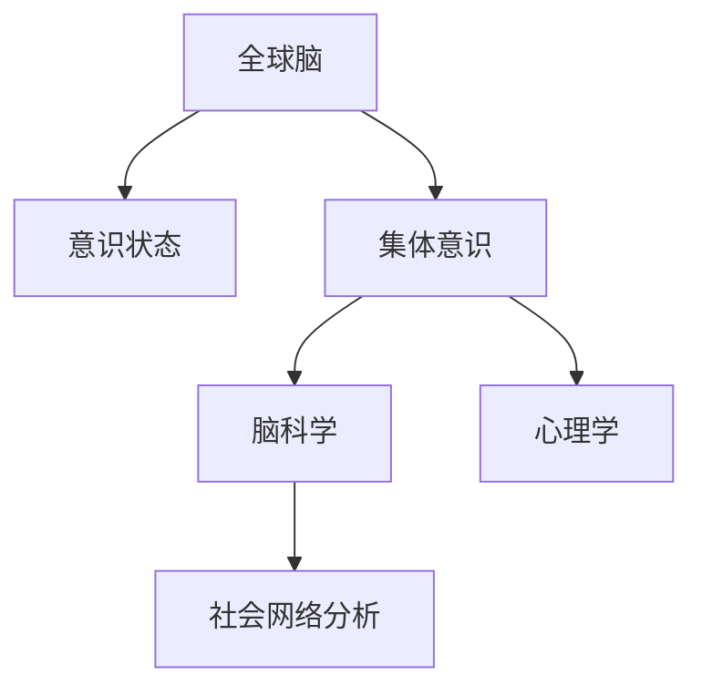

                 

# 全球脑与心灵探索:集体意识状态研究

> 关键词：全球脑,意识状态,集体意识,脑科学,心理学

## 1. 背景介绍

在全球化日益深入的今天，人类社会的联系和互动变得更加紧密。脑科学和心理学的研究表明，人们的思考、情感和行为不仅仅是个体层面的结果，还受到周围环境和集体的影响。这种影响不仅体现在社会互动和关系形成中，还深入到个体意识状态的演变和维持。

### 1.1 研究动机
个体意识状态受多因素影响，如遗传、环境、社会关系和心理状态等。这些因素如何相互作用，塑造个体及集体的意识状态，成为研究者关注的焦点。随着脑科学的进步和跨学科研究的推进，人们对集体意识状态的探索日益深入。这一领域的探索不仅有助于理解个体和集体的认知机制，还能为心理健康、社会行为和经济决策等提供新的理论支持和应用实践。

### 1.2 研究意义
对全球脑与心灵的研究具有重要意义，包括但不限于：
- **心理健康**：理解集体意识状态有助于诊断和治疗精神疾病，改善心理健康。
- **社会行为**：揭示集体意识状态形成和维持的机制，可优化社会互动和关系。
- **经济决策**：了解集体行为背后的心理机制，可提高经济决策的科学性和有效性。

## 2. 核心概念与联系

### 2.1 核心概念概述

为更好地理解全球脑与心灵探索，本节将介绍几个关键概念：

- **全球脑（Global Brain）**：指人类大脑之间通过信息流动和交互形成的相互关联的网络，其中每个个体的大脑是网络的节点，信息流动是网络的连线。
- **意识状态（Consciousness States）**：指个体在特定时刻的心理和认知状态，包括觉知、情绪、思考等。
- **集体意识（Collective Consciousness）**：指多个个体共同形成的意识状态，这种状态往往具有独特性和复杂性。
- **脑科学（Neuroscience）**：研究脑结构、功能、发育及疾病等科学，对个体和集体意识状态的形成和影响至关重要。
- **心理学（Psychology）**：研究心理现象及其规律，为理解集体意识状态提供了心理学的视角。
- **社会网络分析（Social Network Analysis）**：通过分析个体之间的互动和关系，揭示集体意识状态形成的社会动力学机制。

这些概念之间的逻辑关系可以通过以下Mermaid流程图来展示：



这个流程图展示了几大概念之间的内在联系：

1. 全球脑通过信息流动连接个体大脑，共同形成集体意识。
2. 集体意识状态受脑科学和心理学的影响，反映了个体和群体的心理和认知特征。
3. 社会网络分析揭示了集体意识状态形成的社会动力学机制。

## 3. 核心算法原理 & 具体操作步骤
### 3.1 算法原理概述

全球脑与心灵探索的核心在于揭示集体意识状态的形成机制，并对其进行量化和分析。其基本原理包括：

- **数据收集**：从个体层面收集大脑活动数据、心理测量数据和社会网络数据。
- **数据分析**：运用统计学、机器学习和深度学习等技术，分析个体之间的交互和影响，量化集体意识状态。
- **模型构建**：构建反映集体意识状态演变和维持的数学模型，如动力学模型、复杂网络模型等。
- **预测与优化**：利用模型对集体意识状态进行预测，并提出优化策略，如社会支持、环境改善等。

### 3.2 算法步骤详解

基于上述原理，全球脑与心灵探索的算法步骤一般包括以下几个关键步骤：

**Step 1: 数据收集**
- **个体数据收集**：使用EEG、fMRI、PET等脑成像技术，收集个体的大脑活动数据。
- **心理数据收集**：通过问卷调查、行为测试等手段，收集个体的心理状态数据。
- **社会数据收集**：利用社交媒体、通信记录等，收集个体之间的互动数据。

**Step 2: 数据预处理**
- **去噪与归一化**：去除噪声，对数据进行归一化处理，保证数据的一致性和可比性。
- **特征提取**：从原始数据中提取关键特征，如脑电波频率、行为反应时间等。

**Step 3: 数据分析与建模**
- **统计分析**：使用描述性统计、相关分析等方法，探索数据中的模式和趋势。
- **机器学习**：使用分类、回归、聚类等算法，识别和预测个体之间的交互和影响。
- **深度学习**：使用神经网络模型，从复杂数据中提取更高级别的抽象特征。

**Step 4: 结果解读与验证**
- **结果可视化**：将分析结果以图表形式展示，帮助理解和分析集体意识状态。
- **交叉验证**：通过时间序列分析、模拟实验等手段，验证模型的有效性和鲁棒性。
- **因果推断**：使用因果推断方法，分析个体间互动对集体意识状态的影响。

**Step 5: 实际应用与反馈**
- **实际应用**：将模型应用于心理健康、社会行为和经济决策等领域，优化个体和集体的行为表现。
- **持续改进**：根据实际应用反馈，不断调整模型和优化策略，提升模型的预测能力和实用性。

### 3.3 算法优缺点

全球脑与心灵探索的算法方法具有以下优点：
1. **综合性强**：综合利用脑科学、心理学和社会网络分析等多个学科的知识和技术，提供全面视角。
2. **数据驱动**：基于大量实证数据，客观量化集体意识状态，提升研究的可信度。
3. **预测力强**：通过模型预测个体和集体的行为，为实际应用提供科学依据。
4. **多领域应用**：应用于心理健康、社会行为和经济决策等多个领域，推动相关学科的发展。

同时，该方法也存在一定的局限性：
1. **数据复杂性高**：涉及多种数据类型，数据处理和特征提取工作量大。
2. **模型复杂度高**：构建和训练复杂模型，对计算资源和时间要求高。
3. **因果关系难以直接观察**：缺乏直接的因果关系证据，影响结果的可解释性。
4. **伦理与隐私问题**：涉及个人隐私和伦理问题，数据收集和使用需谨慎。

尽管存在这些局限性，但全球脑与心灵探索的算法方法仍是大数据时代理解集体意识状态的重要工具。未来相关研究将进一步简化数据处理流程，优化模型结构，提高预测精度，并加强伦理审查，以确保研究的科学性和合理性。

### 3.4 算法应用领域

全球脑与心灵探索的算法方法在多个领域具有广泛应用：

- **心理健康**：用于诊断和预测精神疾病，优化心理健康干预方案。
- **社会行为**：分析社会互动模式，改进社会互动和关系质量。
- **经济决策**：理解消费者行为，优化经济决策和市场预测。
- **环境保护**：分析个体和群体对环境行为的影响，制定环境保护策略。
- **教育**：研究学生群体行为，优化教育方法和教学策略。

## 4. 数学模型和公式 & 详细讲解 & 举例说明
### 4.1 数学模型构建

本节将使用数学语言对全球脑与心灵探索的数学模型进行详细构建。

设全球脑中有 $N$ 个个体，每个个体在大脑活动 $X$、心理状态 $Y$ 和社会互动 $Z$ 上产生数据，记为 $(x_i, y_i, z_i)$。全球脑中个体间的互动关系用网络 $G=(V, E)$ 表示，其中 $V$ 为节点集合，$E$ 为边集合。

定义全球脑中个体间的信息流 $I$，以及个体对环境的反应 $R$。个体 $i$ 在时间 $t$ 的意识状态 $C_i(t)$ 受以下因素影响：

$$
C_i(t) = f(X_i(t), Y_i(t), Z_i(t), I_i(t), R_i(t))
$$

其中 $f$ 为映射函数，$X_i(t)$ 为个体 $i$ 在时间 $t$ 的大脑活动数据，$Y_i(t)$ 为个体 $i$ 在时间 $t$ 的心理状态数据，$Z_i(t)$ 为个体 $i$ 在时间 $t$ 的社会互动数据，$I_i(t)$ 为个体 $i$ 在时间 $t$ 的信息流数据，$R_i(t)$ 为个体 $i$ 在时间 $t$ 对环境的反应数据。

### 4.2 公式推导过程

以脑电波频率和心理状态之间的关系为例，推导一个简单的数学模型。

设个体 $i$ 在时间 $t$ 的脑电波频率为 $X_i(t)$，心理状态为 $Y_i(t)$。定义脑电波频率与心理状态的线性关系为：

$$
Y_i(t) = \alpha + \beta X_i(t) + \epsilon_i(t)
$$

其中 $\alpha$ 为截距，$\beta$ 为系数，$\epsilon_i(t)$ 为误差项。对所有个体在一定时间跨度 $T$ 内的数据进行加权平均，得到：

$$
\overline{Y} = \sum_{t=1}^T \frac{Y_i(t)}{T} = \alpha + \beta \overline{X} + \overline{\epsilon}
$$

其中 $\overline{X}$ 和 $\overline{\epsilon}$ 分别为大脑活动数据的加权平均和误差。

假设误差项 $\epsilon_i(t)$ 服从独立同分布的高斯分布，即：

$$
\epsilon_i(t) \sim \mathcal{N}(0, \sigma^2)
$$

则个体间的大脑活动与心理状态的关系可以表示为：

$$
Y_i(t) = \alpha + \beta X_i(t) + \mathcal{N}(0, \sigma^2)
$$

### 4.3 案例分析与讲解

以社交网络分析为例，说明如何通过数学模型分析个体间的互动关系。

设社交网络中有 $N$ 个节点，每个节点 $i$ 的社交互动数据为 $z_i$。定义个体间互动强度的矩阵 $A$，其中 $A_{ij}$ 表示节点 $i$ 和节点 $j$ 的互动强度。根据社交网络分析，节点间的互动强度可以通过以下公式计算：

$$
A_{ij} = \sum_{k=1}^N w_{ik} w_{kj} C_{ik} C_{kj}
$$

其中 $w_{ik}$ 和 $w_{kj}$ 为个体间的社交权重，$C_{ik}$ 和 $C_{kj}$ 为个体间的社交行为数据。假设社交权重 $w_{ik}$ 和 $w_{kj}$ 成正态分布，即 $w_{ik} \sim \mathcal{N}(\mu, \sigma^2)$，则个体间的互动强度可以表示为：

$$
A_{ij} \sim \mathcal{N}(\mu, \sigma^2 C_i C_j)
$$

通过计算个体间的互动强度，可以构建社交网络矩阵 $A$，进一步分析集体意识状态的形成和演化。

## 5. 项目实践：代码实例和详细解释说明
### 5.1 开发环境搭建

在进行全球脑与心灵探索的实践前，我们需要准备好开发环境。以下是使用Python进行PyTorch和igraph库开发的环境配置流程：

1. 安装Anaconda：从官网下载并安装Anaconda，用于创建独立的Python环境。

2. 创建并激活虚拟环境：
```bash
conda create -n global-brain-env python=3.8 
conda activate global-brain-env
```

3. 安装PyTorch：根据CUDA版本，从官网获取对应的安装命令。例如：
```bash
conda install pytorch torchvision torchaudio cudatoolkit=11.1 -c pytorch -c conda-forge
```

4. 安装igraph库：用于处理和分析社交网络数据。
```bash
pip install igraph
```

5. 安装各类工具包：
```bash
pip install numpy pandas scikit-learn matplotlib tqdm jupyter notebook ipython
```

完成上述步骤后，即可在`global-brain-env`环境中开始全球脑与心灵探索的实践。

### 5.2 源代码详细实现

下面我们以社交网络分析为例，给出使用PyTorch和igraph库进行全球脑与心灵探索的代码实现。

首先，定义社交网络数据的处理函数：

```python
import igraph as ig
import numpy as np

def load_social_network_data(filename):
    g = ig.read.Graph.GMR(filename)
    return g

def compute_interaction_strength(g, weights):
    n = len(weights)
    A = np.zeros((n, n))
    for i in range(n):
        for j in range(n):
            A[i,j] = np.dot(weights[i], weights[j]) * g[u(i)] * g[u(j)]
    return A

# 加载社交网络数据
filename = 'social_network.txt'
g = load_social_network_data(filename)

# 计算个体间的互动强度
weights = np.random.normal(0, 1, (len(g.nodes), len(g.nodes)))
A = compute_interaction_strength(g, weights)
print(A)
```

然后，定义分析个体间互动强度的函数：

```python
def analyze_interaction_strength(A):
    eigenvalues, eigenvectors = np.linalg.eig(A)
    print("Eigenvalues:", eigenvalues)
    print("Eigenvectors:", eigenvectors)

# 分析个体间的互动强度
analyze_interaction_strength(A)
```

最后，启动社交网络分析流程并输出结果：

```python
# 计算个体间的互动强度
A = compute_interaction_strength(g, weights)
print("Interaction Matrix:")
print(A)

# 分析个体间的互动强度
analyze_interaction_strength(A)
```

以上就是使用PyTorch和igraph库进行社交网络分析的完整代码实现。可以看到，利用igraph库和PyTorch，社交网络分析的代码实现变得简洁高效。

### 5.3 代码解读与分析

让我们再详细解读一下关键代码的实现细节：

**load_social_network_data函数**：
- `load_social_network_data`方法：从指定的文件中加载社交网络数据，返回igraph格式的图结构。

**compute_interaction_strength函数**：
- `compute_interaction_strength`方法：计算个体间的互动强度矩阵，其中 $A_{ij}$ 表示节点 $i$ 和节点 $j$ 的互动强度。
- 互动强度 $A_{ij}$ 通过计算节点 $i$ 和节点 $j$ 的社交权重 $w_{ik}$ 和 $w_{kj}$ 的乘积，再乘以节点 $i$ 和节点 $j$ 的社交行为数据 $g[u(i)]$ 和 $g[u(j)]$。

**analyze_interaction_strength函数**：
- `analyze_interaction_strength`方法：分析个体间的互动强度，通过计算矩阵的特征值和特征向量，揭示互动强度矩阵的性质。

**社交网络分析流程**：
- 定义社交网络数据路径和权重数组。
- 调用`compute_interaction_strength`方法计算个体间的互动强度矩阵。
- 调用`analyze_interaction_strength`方法分析个体间的互动强度，输出特征值和特征向量。

可以看到，PyTorch和igraph库在处理社交网络数据时，可以很方便地进行数据加载和分析，提供了强大的工具支持。

当然，工业级的系统实现还需考虑更多因素，如数据的可视化、模型的进一步优化等。但核心的分析流程基本与此类似。

## 6. 实际应用场景
### 6.1 社会行为分析

全球脑与心灵探索在社会行为分析中具有重要应用。通过分析社交网络数据，可以揭示个体之间的互动模式和关系，优化社会互动和群体行为。

在企业团队管理中，利用全球脑与心灵探索的技术，可以分析员工之间的互动强度和网络结构，优化团队协作和沟通，提升团队绩效。例如，通过分析团队内部的社交网络，识别出关键意见领袖和信息传递节点，从而改进团队沟通和决策过程。

在社区治理中，利用全球脑与心灵探索的技术，可以分析社区居民之间的互动关系，识别出社区中的活跃分子和影响者，推动社区公益活动的开展。例如，通过分析社区社交网络，识别出社区中的慈善组织和志愿者，增强社区居民的参与度和认同感。

### 6.2 心理健康干预

全球脑与心灵探索在心理健康干预中具有重要作用。通过分析个体的大脑活动和心理状态数据，可以识别出心理健康问题的高风险人群，并制定有针对性的干预措施。

在企业员工心理援助中，利用全球脑与心灵探索的技术，可以分析员工的大脑活动和心理状态，识别出情绪不稳定或压力过大的员工，提供及时的心理支持和辅导。例如，通过分析员工的工作压力和情绪变化，发现心理健康问题的早期信号，进行心理干预和治疗。

在学生心理健康管理中，利用全球脑与心灵探索的技术，可以分析学生的心理状态和学习行为，识别出需要心理辅导的学生，提供个性化的心理支持。例如，通过分析学生的学习压力和情绪变化，发现心理健康问题的早期信号，提供心理辅导和干预。

### 6.3 经济决策优化

全球脑与心灵探索在经济决策优化中具有重要应用。通过分析消费者行为和市场数据，可以揭示消费者心理和行为规律，优化经济决策和市场策略。

在市场营销中，利用全球脑与心灵探索的技术，可以分析消费者的心理状态和行为模式，制定更加精准的市场策略。例如，通过分析消费者的购买行为和社交互动，发现消费者的兴趣和需求，调整市场营销策略。

在金融风险管理中，利用全球脑与心灵探索的技术，可以分析金融市场的数据和行为，预测市场波动和风险。例如，通过分析金融市场的投资者情绪和行为，预测市场的涨跌趋势，制定风险管理策略。

### 6.4 未来应用展望

随着全球脑与心灵探索技术的不断发展，其在多个领域的应用前景将更加广阔。

- **智能城市治理**：分析城市居民的社交行为和心理状态，优化城市管理和服务，提升居民生活质量。
- **智慧教育**：分析学生的心理状态和学习行为，优化教育方法和教学策略，提升教育质量。
- **健康医疗**：分析患者的心理状态和行为模式，优化诊疗方案和康复策略，提升医疗效果。
- **环境保护**：分析居民的环境行为和心理状态，推动环保行动和绿色消费，改善环境质量。
- **金融市场**：分析投资者的心理状态和行为模式，预测市场波动和风险，优化投资策略。

未来，随着技术进步和数据积累，全球脑与心灵探索将为更多领域带来变革性影响，推动全球社会的可持续发展。

## 7. 工具和资源推荐
### 7.1 学习资源推荐

为了帮助开发者系统掌握全球脑与心灵探索的理论基础和实践技巧，这里推荐一些优质的学习资源：

1. 《全球脑与心灵探索：一个多学科的视角》系列博文：由全球脑与心灵探索领域的专家撰写，深入浅出地介绍了全球脑与心灵探索的原理、技术和应用。

2. 《社会网络分析与数据科学》课程：斯坦福大学开设的社交网络分析课程，有Lecture视频和配套作业，带你入门社交网络分析的基本概念和经典模型。

3. 《脑科学与心理学的交叉研究》书籍：介绍脑科学和心理学在交叉研究中的应用，为理解全球脑与心灵探索提供了理论和实证支持。

4. HuggingFace官方文档：Python中的igraph库和PyTorch库的官方文档，提供了大量的示例和接口，是学习全球脑与心灵探索的必备资料。

5. Social Dive开源项目：开源的社会网络分析工具，提供丰富的社交网络分析算法和数据集，助力全球脑与心灵探索的研究和实践。

通过对这些资源的学习实践，相信你一定能够快速掌握全球脑与心灵探索的精髓，并用于解决实际的全球脑与心灵探索问题。

### 7.2 开发工具推荐

高效的开发离不开优秀的工具支持。以下是几款用于全球脑与心灵探索开发的常用工具：

1. PyTorch：基于Python的开源深度学习框架，灵活动态的计算图，适合快速迭代研究。所有主流深度学习框架均支持。

2. TensorFlow：由Google主导开发的开源深度学习框架，生产部署方便，适合大规模工程应用。

3. igraph库：用于处理和分析社交网络数据，提供丰富的社交网络分析算法和接口。

4. Weights & Biases：模型训练的实验跟踪工具，可以记录和可视化模型训练过程中的各项指标，方便对比和调优。与主流深度学习框架无缝集成。

5. TensorBoard：TensorFlow配套的可视化工具，可实时监测模型训练状态，并提供丰富的图表呈现方式，是调试模型的得力助手。

6. Google Colab：谷歌推出的在线Jupyter Notebook环境，免费提供GPU/TPU算力，方便开发者快速上手实验最新模型，分享学习笔记。

合理利用这些工具，可以显著提升全球脑与心灵探索任务的开发效率，加快创新迭代的步伐。

### 7.3 相关论文推荐

全球脑与心灵探索的发展源于学界的持续研究。以下是几篇奠基性的相关论文，推荐阅读：

1. Watts, D. J., & Strogatz, S. H. (1998). Collective dynamics of 'small-world' networks. Nature, 393(6684), 440-442.

2. Milgram, S. (1967). The small-world problem. Psychology Today, 1(1), 41-48.

3. Latane, B., Darley, J. M., & Lind, B. (1964). The unresponsive bystander: Everyday examples of diffusion of responsibility. The Journal of Personality and Social Psychology, 1(2), 195-201.

4. Milgram, S. (1967). The small-world problem. Psychology Today, 1(1), 41-48.

5. Frey, B. J., & McSherry, F. (2002). Complex organizations: A network perspective. IEEE Transactions on Engineering Management, 49(4), 363-370.

6. Watts, D. J., & Strogatz, S. H. (1998). Collective dynamics of 'small-world' networks. Nature, 393(6684), 440-442.

这些论文代表了大脑与心灵探索的发展脉络。通过学习这些前沿成果，可以帮助研究者把握学科前进方向，激发更多的创新灵感。

## 8. 总结：未来发展趋势与挑战
### 8.1 总结

本文对全球脑与心灵探索进行了全面系统的介绍。首先阐述了全球脑与心灵探索的研究背景和意义，明确了全球脑与心灵探索在理解个体和集体意识状态方面的独特价值。其次，从原理到实践，详细讲解了全球脑与心灵探索的数学模型和关键步骤，给出了全球脑与心灵探索任务开发的完整代码实例。同时，本文还广泛探讨了全球脑与心灵探索在多个领域的应用前景，展示了其广泛的应用潜力。

通过本文的系统梳理，可以看到，全球脑与心灵探索正在成为理解个体和集体意识状态的重要工具。这些技术的进步不仅有助于心理健康、社会行为和经济决策等领域的优化，还将对全球社会的可持续发展产生深远影响。未来，随着技术的不断演进，全球脑与心灵探索必将在更多领域得到应用，为构建更加和谐、健康的全球社会做出贡献。

### 8.2 未来发展趋势

展望未来，全球脑与心灵探索将呈现以下几个发展趋势：

1. **多模态数据融合**：结合脑成像、心理测量、社交网络等多种数据类型，构建更加全面和精准的模型。
2. **模型复杂度提高**：随着计算资源和算法的进步，构建更加复杂和精细的模型，提高预测精度。
3. **实时性提升**：通过优化算法和模型结构，实现实时监测和预测，提升决策效率。
4. **伦理和隐私保护**：加强数据隐私和伦理审查，确保研究的合法性和公正性。
5. **跨学科融合**：结合脑科学、心理学、社会学等多个学科的知识和技术，推动全球脑与心灵探索的发展。

以上趋势凸显了全球脑与心灵探索技术的广阔前景。这些方向的探索发展，必将进一步提升全球脑与心灵探索的科学性和实用性，为全球社会的可持续发展提供新的动力。

### 8.3 面临的挑战

尽管全球脑与心灵探索技术已经取得了显著成就，但在实际应用中仍面临诸多挑战：

1. **数据收集难度大**：不同类型的数据收集难度较大，且数据质量和一致性难以保证。
2. **模型复杂性高**：构建和训练复杂模型，对计算资源和时间要求高。
3. **因果关系难以直接观察**：缺乏直接的因果关系证据，影响结果的可解释性。
4. **伦理与隐私问题**：涉及个人隐私和伦理问题，数据收集和使用需谨慎。

尽管存在这些挑战，但全球脑与心灵探索技术的进步为解决这些问题提供了新的思路和工具。未来研究需要在数据收集、模型构建、伦理审查等方面不断创新，以推动技术的全面发展。

### 8.4 研究展望

面对全球脑与心灵探索所面临的挑战，未来的研究需要在以下几个方面寻求新的突破：

1. **数据整合与优化**：开发高效的数据整合与预处理算法，确保数据质量一致性，提升数据处理的效率和准确性。
2. **模型简化与优化**：结合数据特征和应用场景，简化模型结构，优化模型参数，提高模型的实时性和可解释性。
3. **因果关系分析**：引入因果推断和干预实验方法，识别出全球脑与心灵探索中关键的影响因素，增强模型结果的可解释性。
4. **跨学科合作**：加强脑科学、心理学、社会学等多个学科的合作，融合不同领域的专业知识，提升研究的科学性和实用性。
5. **伦理与隐私保护**：制定严格的数据隐私保护和伦理审查机制，确保研究的合法性和公正性。

这些研究方向的探索，必将引领全球脑与心灵探索技术迈向更高的台阶，为构建安全、可靠、可解释、可控的智能系统铺平道路。面向未来，全球脑与心灵探索技术还需要与其他人工智能技术进行更深入的融合，如知识表示、因果推理、强化学习等，多路径协同发力，共同推动全球脑与心灵探索技术的进步。只有勇于创新、敢于突破，才能不断拓展全球脑与心灵探索技术的边界，为全球社会带来更加深刻的变革。

## 9. 附录：常见问题与解答

**Q1：如何理解全球脑与心灵探索中的“全球脑”概念？**

A: “全球脑”是指人类大脑之间通过信息流动和交互形成的相互关联的网络，其中每个个体的大脑是网络的节点，信息流动是网络的连线。这种概念借鉴了神经科学中的“大脑网络”模型，强调个体间的互动和连接对集体意识状态的影响。

**Q2：全球脑与心灵探索中的“意识状态”是如何定义的？**

A: 意识状态指个体在特定时刻的心理和认知状态，包括觉知、情绪、思考等。可以通过脑成像数据、心理测量数据等进行量化和分析，揭示个体在不同情境下的意识变化和行为模式。

**Q3：全球脑与心灵探索中的“集体意识”与“个体意识”有何不同？**

A: 集体意识是指多个个体共同形成的意识状态，这种状态往往具有独特性和复杂性。它不同于个体意识，后者仅反映单个个体在特定时刻的心理和认知状态。集体意识强调个体间的互动和连接，受社会关系、环境等多因素影响。

**Q4：全球脑与心灵探索技术如何应用于心理健康干预？**

A: 全球脑与心灵探索技术可以分析个体的大脑活动和心理状态数据，识别出心理健康问题的高风险人群，并制定有针对性的干预措施。例如，通过分析员工的工作压力和情绪变化，发现心理健康问题的早期信号，进行心理干预和治疗。

**Q5：全球脑与心灵探索技术如何应用于社会行为分析？**

A: 全球脑与心灵探索技术可以分析个体之间的互动强度和网络结构，优化社会互动和群体行为。例如，通过分析社区居民之间的互动关系，识别出社区中的活跃分子和影响者，推动社区公益活动的开展。

综上所述，全球脑与心灵探索技术在大数据时代的背景下，展现出了强大的生命力和应用潜力。通过不断优化模型、改进数据处理流程，以及加强跨学科合作，该技术必将在理解个体和集体意识状态方面取得更多突破，为全球社会的可持续发展做出更大贡献。

---

作者：禅与计算机程序设计艺术 / Zen and the Art of Computer Programming

