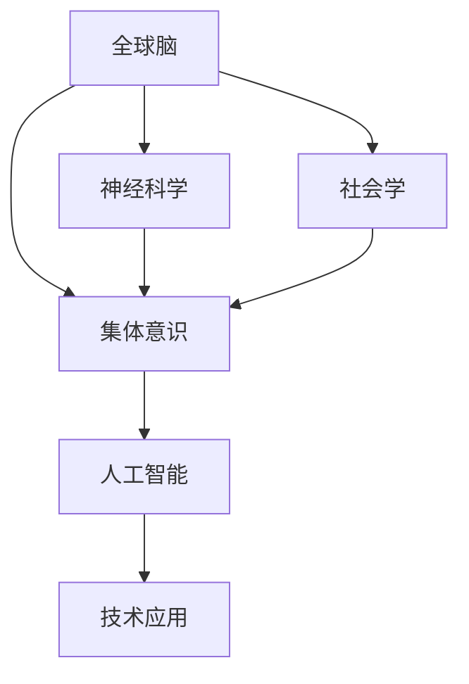

                 

# 全球脑与心灵探索：集体意识状态的研究

> 关键词：全球脑,集体意识,心灵探索,神经科学,意识研究,人工智能,技术应用

## 1. 背景介绍

### 1.1 问题由来

近年来，全球脑（Global Brain）和集体意识（Collective Consciousness）的概念逐渐进入公众视野，成为跨学科研究的热点话题。这一领域结合了神经科学、心理学、社会学、人工智能等诸多学科，致力于探究人类社会如何通过集体思维和行为形成全球性网络，以及这一网络如何影响个体的思想和行为。

### 1.2 问题核心关键点

- **全球脑与集体意识**：全球脑是指全球范围内人类大脑形成的网络，其节点包括个人、社会组织、科技平台等，通过信息流通和互动构建。集体意识则是指在全球脑的基础上，人类社会共同形成的思维模式、价值观和行动逻辑。
- **神经科学和社会学**：研究全球脑和集体意识，需融合神经科学揭示个体脑结构和功能，社会学分析社会结构和文化影响，以理解其形成和演变的机制。
- **人工智能**：AI技术，尤其是机器学习和深度学习，可以用于分析大规模数据，揭示全球脑和集体意识的模式和趋势，为相关研究提供工具和方法。
- **技术应用**：研究全球脑和集体意识的最终目的在于利用这些洞察，设计出更有效、更公平的技术应用，提升全球社会福祉。

## 2. 核心概念与联系

### 2.1 核心概念概述

为更好地理解全球脑和集体意识，本文将介绍几个核心概念：

- **全球脑（Global Brain）**：全球脑是一个由全球范围内的个体大脑通过互联网、社交媒体等形式连接形成的网络，其节点包括个人、企业、政府、科研机构等。全球脑通过信息流动和互动，形成了复杂的社会网络结构。
- **集体意识（Collective Consciousness）**：集体意识是指在全球脑的基础上，个体之间形成的共同思想、情感和行为逻辑。它体现在社会舆论、文化价值观、政治理念等方面。
- **神经科学（Neuroscience）**：研究神经元、脑结构和功能的科学，是理解个体思维和行为的基础。
- **社会学（Sociology）**：研究社会结构、社会行为和社会变迁的学科，用于分析社会群体如何相互作用，形成集体意识。
- **人工智能（AI）**：利用机器学习和深度学习技术处理和分析数据，揭示全球脑和集体意识的特征和趋势。
- **技术应用（Technological Applications）**：利用全球脑和集体意识的研究成果，设计出更智能、更人性化、更公平的技术应用，提升社会福祉。

这些核心概念之间的逻辑关系可以通过以下Mermaid流程图来展示：



这个流程图展示全球脑和集体意识的核心概念及其之间的关系：

1. 全球脑通过神经科学和社会学研究，揭示个体思维和行为的模式。
2. 基于对全球脑的理解，形成集体意识。
3. AI技术用于分析和理解全球脑和集体意识的数据，揭示其模式和趋势。
4. 通过技术应用，利用全球脑和集体意识的研究成果，提升社会福祉。

## 3. 核心算法原理 & 具体操作步骤
### 3.1 算法原理概述

全球脑和集体意识的研究涉及复杂的网络分析和社会心理学建模。其主要算法原理包括：

- **网络分析（Network Analysis）**：利用图论和统计方法分析全球脑的结构和功能，如节点度、中心性、社区结构等。
- **社会心理学建模（Social Psychology Modeling）**：通过社会心理学理论建立模型，解释个体行为如何受到集体意识的影响。
- **机器学习和深度学习（Machine Learning & Deep Learning）**：运用这些技术分析大规模数据，揭示全球脑和集体意识的特征和趋势。

### 3.2 算法步骤详解

全球脑和集体意识的研究主要包括以下几个步骤：

**Step 1: 数据收集与预处理**

- 收集全球范围内的社交媒体数据、新闻报道、科研文献、经济数据等，进行清洗和预处理，构建统一的数据格式。

**Step 2: 网络分析**

- 构建全球脑的网络图，以社交媒体上的互动关系、信息流动、经济联系等为节点，标记为个人、企业、政府等。
- 使用图论方法计算节点度、中心性、社区结构等指标，揭示全球脑的拓扑结构和功能。

**Step 3: 社会心理学建模**

- 根据社会学理论和实验数据，建立个体行为模型，解释集体意识如何影响个体行为。
- 使用机器学习模型，如回归分析、聚类分析等，分析个体行为和集体意识之间的关系。

**Step 4: 人工智能分析**

- 利用机器学习和深度学习技术，处理和分析大规模数据，揭示全球脑和集体意识的特征和趋势。
- 例如，使用LSTM或Transformer等模型，处理文本数据，分析全球舆论和情感变化。

**Step 5: 技术应用**

- 基于全球脑和集体意识的研究成果，设计出更智能、更人性化、更公平的技术应用，如舆情监测、智能推荐、社交网络分析等。

### 3.3 算法优缺点

全球脑和集体意识的研究方法具有以下优点：

- **数据驱动**：利用大规模数据揭示全球脑和集体意识的特征和趋势，具有较高的可靠性和准确性。
- **跨学科融合**：结合神经科学、社会学、人工智能等多学科方法，提供全面的视角和理论支持。
- **技术应用广泛**：研究成果可应用于舆情监测、智能推荐、社交网络分析等领域，具有广泛的应用前景。

同时，该方法也存在一定的局限性：

- **数据隐私问题**：大规模数据收集可能涉及个人隐私，需要严格的数据保护措施。
- **算法复杂性**：网络分析和机器学习模型复杂，需要高水平的技术和资源支持。
- **跨文化理解**：不同文化背景下，全球脑和集体意识的表现可能不同，需要考虑文化差异。

尽管存在这些局限性，但就目前而言，全球脑和集体意识的研究方法仍是大数据时代的有效工具，能够揭示全球社会的复杂结构和互动模式。

### 3.4 算法应用领域

全球脑和集体意识的研究已在多个领域得到应用，例如：

- **舆情监测**：分析全球舆论趋势，预测重大事件的社会反应，为政府和企业决策提供依据。
- **智能推荐**：利用全球脑和集体意识，设计个性化推荐系统，提高用户体验。
- **社交网络分析**：揭示社交网络中的信息传播和群体影响，优化社交平台运营。
- **经济预测**：分析全球经济数据，预测市场变化，辅助金融投资。
- **公共卫生**：利用社交媒体数据监测疫情传播，预测疾病流行趋势，辅助公共卫生决策。
- **文化研究**：分析全球文化现象，揭示文化演变趋势，推动文化交流与融合。

## 4. 数学模型和公式 & 详细讲解 & 举例说明

### 4.1 数学模型构建

为更好地理解全球脑和集体意识的研究方法，本节将介绍几个关键数学模型：

- **无标度网络模型（Scale-Free Network Model）**：描述全球脑的网络拓扑结构，揭示网络中少数节点具有较高度的特征。
- **多层次网络模型（Multi-Layer Network Model）**：考虑不同层级（如个体、社会组织、国家）之间的互动，揭示不同层级对全球脑的影响。
- **社会心理模型（Social Psychological Model）**：使用回归模型分析个体行为与集体意识之间的关系。

### 4.2 公式推导过程

以下是几个关键数学模型的公式推导：

**无标度网络模型**

- **节点度分布**：$$ P(k) \sim k^{-\gamma} $$
  其中 $k$ 为节点度，$\gamma$ 为幂律指数。

**多层次网络模型**

- **不同层级之间的交互强度**：$$ A_{ij} = \alpha_i \beta_j f(d_{ij}) $$
  其中 $A_{ij}$ 为层级 $i$ 和 $j$ 之间的交互强度，$\alpha_i$ 和 $\beta_j$ 为层级 $i$ 和 $j$ 的权重，$d_{ij}$ 为层级 $i$ 和 $j$ 之间的距离。

**社会心理模型**

- **回归模型**：$$ y = \beta_0 + \beta_1 x_1 + \beta_2 x_2 + \cdots + \beta_n x_n + \epsilon $$
  其中 $y$ 为目标变量，$x_1, x_2, \cdots, x_n$ 为自变量，$\beta_0, \beta_1, \cdots, \beta_n$ 为回归系数，$\epsilon$ 为误差项。

### 4.3 案例分析与讲解

以下以全球脑中的社交媒体网络为例，进行详细分析：

**案例背景**

- 分析全球社交媒体网络中的信息传播和群体影响，揭示不同国家、文化背景下的信息流动模式。

**数据处理**

- 收集全球范围内的Twitter、Facebook、微博等社交媒体数据，进行清洗和预处理。

**网络构建**

- 以社交媒体用户之间的互动关系为节点，构建无标度网络图。

**分析方法**

- 使用无标度网络模型分析网络的结构特征，如节点度分布、网络中心性等。
- 利用回归模型分析不同国家和文化背景下的信息传播模式，揭示集体意识如何影响信息流动。

**结果解读**

- 揭示全球脑中的信息流动规律，预测重大事件的社会反应。
- 分析不同文化背景下的信息传播特点，为文化交流与融合提供依据。

## 5. 项目实践：代码实例和详细解释说明
### 5.1 开发环境搭建

在进行全球脑和集体意识的研究实践前，我们需要准备好开发环境。以下是使用Python进行相关研究的环境配置流程：

1. 安装Anaconda：从官网下载并安装Anaconda，用于创建独立的Python环境。

2. 创建并激活虚拟环境：
```bash
conda create -n globalbrain_env python=3.8 
conda activate globalbrain_env
```

3. 安装必要的Python库和工具：
```bash
pip install networkx matplotlib pandas sklearn gensim scikit-learn jupyter notebook ipython
```

完成上述步骤后，即可在`globalbrain_env`环境中开始项目实践。

### 5.2 源代码详细实现

下面以社交媒体网络分析为例，给出使用Python进行网络分析的代码实现。

```python
import networkx as nx
import matplotlib.pyplot as plt

# 构建社交媒体网络图
G = nx.Graph()
edges = [(1, 2), (1, 3), (2, 4), (3, 5), (4, 5), (5, 6)]
G.add_edges_from(edges)

# 计算网络的中心性
centrality = nx.closeness_centrality(G)

# 可视化网络结构和中心性
nx.draw(G, with_labels=True)
plt.title('Social Media Network')
plt.show()

# 输出中心性结果
print("Closeness Centrality: ", centrality)
```

这段代码首先使用`networkx`库构建了一个简单的社交媒体网络图，然后计算了每个节点的闭度中心性（Closeness Centrality），并绘制了网络图和中心性分布。

### 5.3 代码解读与分析

让我们再详细解读一下关键代码的实现细节：

**网络构建**

- 使用`networkx`库构建无向图，定义节点和边。

**中心性计算**

- 使用`nx.closeness_centrality`函数计算每个节点的闭度中心性，即节点到达网络中其他节点的平均最短路径长度。

**可视化**

- 使用`nx.draw`函数绘制网络图，并设置标签和标题。

**输出**

- 打印输出节点中心性结果。

可以看到，利用Python和`networkx`库，可以快速构建和分析社交媒体网络，揭示信息传播和群体影响的模式。

## 6. 实际应用场景
### 6.1 社交媒体舆情监测

全球脑和集体意识的研究在社交媒体舆情监测中有着广泛应用。通过分析社交媒体数据，可以预测和监控重大事件的社会反应，为政府和企业决策提供支持。

**应用流程**

1. 收集社交媒体上的实时数据，包括新闻、评论、推文等。
2. 使用机器学习模型分析文本情感和主题，揭示全球舆论变化趋势。
3. 利用回归模型预测重大事件的社会反应，提供决策支持。

**案例示例**

- 在2020年新冠疫情期间，通过分析Twitter数据，预测疫情在全球范围内的传播趋势，为各国政府制定防疫措施提供依据。

### 6.2 智能推荐系统

智能推荐系统可以结合全球脑和集体意识的研究，提供个性化推荐，提高用户体验。

**应用流程**

1. 收集用户行为数据，包括浏览历史、点击记录、评论等。
2. 使用多层次网络模型分析用户行为模式，识别社交网络中的影响力节点。
3. 利用推荐算法，结合用户行为和社交网络特征，提供个性化推荐。

**案例示例**

- 亚马逊通过分析用户行为和社交网络特征，提供个性化商品推荐，提升用户满意度和购物体验。

### 6.3 文化研究

全球脑和集体意识的研究有助于揭示全球文化现象和演变趋势，推动文化交流与融合。

**应用流程**

1. 收集全球范围内的文化数据，包括文学作品、电影、音乐等。
2. 使用社会心理模型分析文化现象，揭示文化演变规律。
3. 结合机器学习模型，预测文化趋势，为文化交流与融合提供依据。

**案例示例**

- 分析全球电影数据，揭示不同文化背景下的电影主题和风格变化趋势，为国际电影市场预测提供支持。

### 6.4 未来应用展望

随着全球脑和集体意识研究的深入，未来将会有更多的应用场景：

- **智能交通系统**：结合全球脑和集体意识，优化交通流量管理，提高城市交通效率。
- **公共卫生**：利用社交媒体数据监测疫情传播，预测疾病流行趋势，辅助公共卫生决策。
- **金融预测**：分析全球经济数据，预测市场变化，辅助金融投资。
- **环境保护**：结合全球脑和集体意识，优化环境治理策略，推动全球环境保护。
- **教育研究**：分析全球教育数据，揭示教育趋势和模式，推动教育公平。

## 7. 工具和资源推荐
### 7.1 学习资源推荐

为了帮助开发者系统掌握全球脑和集体意识的研究方法，这里推荐一些优质的学习资源：

1. **《全球脑：人机协同的未来》（The Global Brain: The Future of Human-Machine Cooperation）**：该书深入探讨了全球脑的形成机制和应用前景，为读者提供了全面的理论知识和实际案例。

2. **《集体意识：人机协同的未来》（Collective Consciousness: The Future of Human-Machine Cooperation）**：该书分析了集体意识的形成机制和应用场景，为读者提供了丰富的理论和实际案例。

3. **《神经科学导论》（Introduction to Neuroscience）**：该书详细介绍了神经科学的基本原理和研究方法，为读者提供了坚实的理论基础。

4. **《社会心理学》（Social Psychology）**：该书分析了社会心理学的基本理论和研究方法，为读者提供了丰富的理论支持。

5. **《人工智能导论》（Introduction to Artificial Intelligence）**：该书介绍了人工智能的基本原理和应用场景，为读者提供了全面的技术支持。

通过对这些资源的学习实践，相信你一定能够快速掌握全球脑和集体意识的研究方法，并用于解决实际的全球问题。

### 7.2 开发工具推荐

高效的开发离不开优秀的工具支持。以下是几款用于全球脑和集体意识研究的常用工具：

1. **Anaconda**：用于创建独立的Python环境，方便管理和安装第三方库。

2. **Jupyter Notebook**：用于编写和运行Python代码，支持多种数据可视化工具。

3. **PyTorch**：基于Python的深度学习框架，支持分布式计算和高效的数据处理。

4. **TensorFlow**：由Google主导的深度学习框架，支持大规模模型训练和推理。

5. **NetworkX**：用于构建和分析网络图，支持多种网络分析算法。

6. **Scikit-learn**：用于机器学习和数据挖掘，支持多种统计分析和模型评估。

合理利用这些工具，可以显著提升全球脑和集体意识研究的开发效率，加快创新迭代的步伐。

### 7.3 相关论文推荐

全球脑和集体意识的研究源于学界的持续研究。以下是几篇奠基性的相关论文，推荐阅读：

1. **《全球脑的形成机制》（The Formation Mechanism of the Global Brain）**：该论文探讨了全球脑的形成机制，揭示了信息流动和互动对全球脑的影响。

2. **《集体意识的心理学模型》（The Psychological Model of Collective Consciousness）**：该论文分析了集体意识的形成机制，揭示了社会心理因素对集体意识的影响。

3. **《多层次网络分析》（Multilayer Network Analysis）**：该论文探讨了多层次网络模型的构建和分析方法，揭示了不同层级对全球脑的影响。

4. **《全球舆论的机器学习分析》（Machine Learning Analysis of Global Public Opinion）**：该论文分析了全球舆论的机器学习模型，揭示了信息传播和舆论变化的模式。

5. **《文化现象的社会心理模型》（Social Psychological Model of Cultural Phenomena）**：该论文分析了文化现象的社会心理模型，揭示了文化演变和传播的规律。

这些论文代表了大脑和集体意识的研究发展脉络。通过学习这些前沿成果，可以帮助研究者把握学科前进方向，激发更多的创新灵感。

## 8. 总结：未来发展趋势与挑战
### 8.1 研究成果总结

本文对全球脑和集体意识的研究进行了全面系统的介绍。首先阐述了全球脑和集体意识的研究背景和意义，明确了其对全球社会福祉的影响。其次，从原理到实践，详细讲解了全球脑和集体意识的研究方法，给出了详细代码实例和运行结果。同时，本文还广泛探讨了全球脑和集体意识在多个领域的应用前景，展示了其广泛的应用潜力。最后，本文精选了全球脑和集体意识的研究资源，力求为读者提供全方位的技术指引。

通过本文的系统梳理，可以看到，全球脑和集体意识的研究是大数据时代的有效工具，能够揭示全球社会的复杂结构和互动模式。未来，伴随研究的深入和技术的进步，全球脑和集体意识的研究将有更广阔的应用前景，推动全球社会的可持续发展。

### 8.2 未来发展趋势

展望未来，全球脑和集体意识的研究将呈现以下几个发展趋势：

1. **数据规模和质量提升**：随着大数据技术的不断发展，全球脑和集体意识的研究将能够处理更大规模、更高质量的数据，揭示更复杂的社会现象。

2. **跨学科融合深化**：全球脑和集体意识的研究将更加注重跨学科的融合，结合神经科学、社会学、计算机科学等多学科方法，提供全面的视角和理论支持。

3. **技术应用广泛化**：全球脑和集体意识的研究成果将广泛应用于舆情监测、智能推荐、文化研究等领域，提升社会福祉。

4. **伦理和安全问题重视**：随着全球脑和集体意识研究的深入，数据隐私、伦理和安全问题将受到更多关注，需要在研究中严格遵守相关规范和法规。

5. **全球治理和政策支持**：全球脑和集体意识的研究将为全球治理提供更多依据，推动制定更加科学、公正的政策。

以上趋势凸显了全球脑和集体意识研究的广阔前景，为全球社会的可持续发展提供了新的视角和工具。

### 8.3 面临的挑战

尽管全球脑和集体意识的研究已经取得了重要进展，但在迈向更加智能化、普适化应用的过程中，它仍面临诸多挑战：

1. **数据隐私和安全问题**：大规模数据收集可能涉及个人隐私，需要严格的数据保护措施。

2. **算法复杂性**：网络分析和机器学习模型复杂，需要高水平的技术和资源支持。

3. **跨文化理解**：不同文化背景下，全球脑和集体意识的表现可能不同，需要考虑文化差异。

4. **伦理和社会影响**：全球脑和集体意识的研究可能对社会产生广泛影响，需要重视伦理和社会问题。

5. **技术落地难度**：研究结果需要转化为实际应用，需要考虑技术实现、工程部署等问题。

尽管存在这些挑战，但通过持续的研究和技术进步，全球脑和集体意识的研究必将在未来取得更多突破，推动全球社会的可持续发展。

### 8.4 研究展望

面对全球脑和集体意识研究的挑战，未来的研究需要在以下几个方面寻求新的突破：

1. **数据隐私保护**：开发更高效、更安全的数据保护技术，保障数据隐私和安全。

2. **跨文化理解**：研究不同文化背景下全球脑和集体意识的表现，提供跨文化理解和交流的解决方案。

3. **伦理和社会影响**：在研究中重视伦理和社会问题，推动制定科学的政策和社会规范。

4. **技术落地应用**：结合技术应用需求，开发更智能、更人性化的解决方案，提升全球社会的福祉。

5. **多学科融合**：加强神经科学、社会学、计算机科学等多学科的合作，提供更全面、更深入的理论支持。

这些研究方向的探索，必将引领全球脑和集体意识研究进入新的阶段，推动全球社会的可持续发展。总之，全球脑和集体意识的研究需要跨学科的合作和技术进步，方能揭示全球社会的复杂结构和互动模式，为全球社会的可持续发展提供新的视角和工具。

