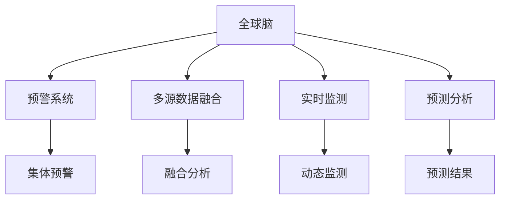
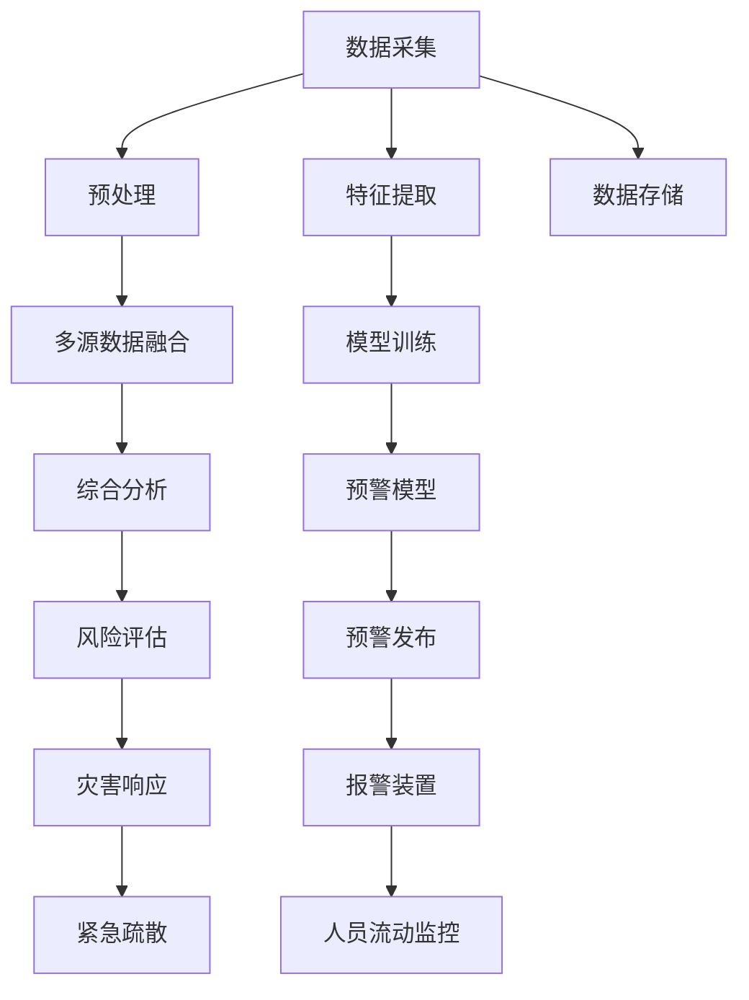

                 

# 全球脑与灾害预防:集体预警的力量

## 1. 背景介绍

随着全球气候变化和人类活动的加剧，自然灾害的频率和强度不断增加，给人类社会带来了巨大的挑战。传统的灾害预防方法往往依赖于单一机构或技术手段，难以全面覆盖各类风险，且响应速度和预警准确性有待提升。近年来，随着人工智能和物联网技术的迅猛发展，通过建立一个"全球脑"，即综合利用各类传感数据、天气预报、卫星遥感、社交媒体等，实现多源数据的融合分析和实时预警，成为新兴的灾害预防手段。

全球脑（Global Brain）指的是通过整合各类数据源，构建一个分布式、协同的智能分析平台，实时监测和预测各类灾害，快速响应并采取预防措施。其关键在于将海量异构数据转化为有价值的预警信息，利用人工智能和大数据分析技术，快速识别灾害风险并发出警报。该系统覆盖范围广、反应速度快，有望大幅提升灾害预防能力，保护人类生命财产安全。

## 2. 核心概念与联系

### 2.1 核心概念概述

- 全球脑（Global Brain）：通过整合各类数据源，构建一个分布式、协同的智能分析平台，实时监测和预测各类灾害。
- 预警系统（Early Warning System）：利用传感器、社交媒体、气象数据等，监测灾害征兆，发出警报。
- 集体预警（Collective Warning）：通过多个预警系统的协同工作，实现对同一地区灾害的联合监测和预警。
- 多源数据融合（Data Fusion）：将来自不同渠道的传感数据、社交媒体、气象信息等融合为一个统一的分析平台，进行综合分析。
- 实时监测（Real-time Monitoring）：通过传感器、社交媒体等实时数据流，实现对灾害动态的持续监测。
- 预测分析（Prediction Analysis）：利用机器学习和数据挖掘技术，预测灾害发生的时间和范围。

这些概念通过一个Mermaid流程图进行展示：



### 2.2 核心概念原理和架构的 Mermaid 流程图



这个流程图展示了全球脑的架构，从数据采集开始，经过预处理、特征提取、模型训练等多个环节，最终实现预警和灾害响应。

## 3. 核心算法原理 & 具体操作步骤

### 3.1 算法原理概述

全球脑的算法原理主要基于以下几个方面：

- 数据融合算法：将来自不同渠道的数据源进行整合，通过统计分析、时间序列预测等方法，提取出关键特征。
- 机器学习算法：利用深度学习、强化学习等技术，训练预警模型，预测灾害发生的时间和范围。
- 实时分析算法：对实时监测数据进行动态分析，及时调整预警模型参数，提高预警准确性。

### 3.2 算法步骤详解

全球脑的构建步骤包括：

1. **数据采集**：从各类数据源（如传感器、社交媒体、气象站）获取实时数据。

2. **数据预处理**：清洗和整理数据，去除噪声和冗余信息，确保数据质量和一致性。

3. **特征提取**：使用机器学习算法提取数据中的关键特征，如温度、湿度、社交媒体情绪等。

4. **模型训练**：利用历史数据训练预警模型，如神经网络、支持向量机等，用于预测灾害发生。

5. **实时监测**：通过传感器和社交媒体等实时数据流，持续监测灾害动态。

6. **预测分析**：对实时数据进行动态分析，预测未来灾害发生的时间和范围。

7. **预警发布**：根据预测结果，及时发布预警信息，触发报警装置。

8. **灾害响应**：启动紧急疏散、救援等应对措施，减少灾害损失。

### 3.3 算法优缺点

**优点**：

- 综合利用多种数据源，提升预警的准确性和全面性。
- 实时监测和动态分析，快速响应灾害风险。
- 多源数据融合技术，降低单一数据源的局限性。

**缺点**：

- 数据采集和预处理成本高，需要大量人力和设备。
- 模型训练和实时分析对计算资源需求高。
- 预警信息的传递和响应依赖于通信基础设施。

### 3.4 算法应用领域

全球脑技术已经在多个领域得到应用，如：

- **自然灾害预警**：如地震、洪水、飓风等，通过传感器数据和社交媒体监测，快速发出预警。
- **公共卫生安全**：如疫情监测、气象预报等，通过实时数据预测疾病流行趋势。
- **城市安全管理**：如火灾、交通事故预警，通过传感器数据监测城市环境。
- **生态保护**：如森林火灾监测、野生动物保护等，通过卫星遥感和传感器数据实时监测。

## 4. 数学模型和公式 & 详细讲解 & 举例说明

### 4.1 数学模型构建

假设我们有三个数据源 $X_1, X_2, X_3$，每个数据源的特征向量为 $x_{i,j}$，其中 $i$ 表示样本编号，$j$ 表示特征编号。设 $w_{i,j}$ 为每个数据源对应特征的权重，$b$ 为截距。

则多源数据融合模型可以表示为：

$$
y = w_1x_{1} + w_2x_{2} + w_3x_{3} + b
$$

其中，$y$ 表示综合预测结果。

### 4.2 公式推导过程

以地震预警为例，假设我们有两个传感器，一个是地壳应力传感器，一个是地面振动传感器，数据分别为 $X_1 = \{x_{1,1}, x_{1,2}\}$ 和 $X_2 = \{x_{2,1}, x_{2,2}\}$，我们希望通过数据融合预测地震的发生概率。

假设 $y$ 为地震发生概率，则融合模型为：

$$
y = w_1x_{1,1} + w_2x_{2,1} + b
$$

其中 $w_1, w_2$ 为传感器数据的权重，$b$ 为截距。

对于每组传感器数据 $X_i = \{x_{i,1}, x_{i,2}\}$，我们可以使用线性回归模型进行训练：

$$
y = \beta_0 + \beta_1x_{i,1} + \beta_2x_{i,2}
$$

通过最小二乘法求解参数 $\beta_0, \beta_1, \beta_2$，得到每个传感器数据的预测结果。将两个传感器的预测结果加权平均，即可得到最终的融合预测结果：

$$
y = \alpha_1\hat{y}_1 + \alpha_2\hat{y}_2
$$

其中 $\alpha_1, \alpha_2$ 为传感器数据的权重，$\hat{y}_1, \hat{y}_2$ 为每个传感器的预测结果。

### 4.3 案例分析与讲解

以美国加州地震预警系统为例，该系统通过整合地壳应力传感器和地面振动传感器数据，实时监测地震风险，提前几分钟发出预警。系统构建步骤如下：

1. **数据采集**：采集地壳应力和地面振动数据，实时传输到预警中心。

2. **数据预处理**：清洗和整理数据，去除噪声和异常值。

3. **特征提取**：提取关键特征，如地壳应力变化率、地面振动频率等。

4. **模型训练**：使用历史地震数据训练融合模型，预测地震发生概率。

5. **实时监测**：通过传感器实时数据流，持续监测地震动态。

6. **预测分析**：对实时数据进行动态分析，预测未来地震发生时间和范围。

7. **预警发布**：根据预测结果，及时发布预警信息，触发报警装置。

8. **灾害响应**：启动紧急疏散、救援等应对措施，减少地震损失。

## 5. 项目实践：代码实例和详细解释说明

### 5.1 开发环境搭建

为构建全球脑预警系统，需要搭建一个高性能的计算环境，主要包括以下几个步骤：

1. **硬件设备**：选用高性能GPU、TPU等设备，确保数据处理和模型训练的实时性。

2. **软件环境**：安装Python、TensorFlow、PyTorch等深度学习框架，配置好依赖库。

3. **数据存储**：使用分布式文件系统，如Hadoop、HDFS等，存储和管理各类传感器数据。

4. **实时数据流**：搭建实时数据采集和传输系统，确保数据的实时性和可靠性。

5. **数据可视化**：使用可视化工具，如Tableau、Grafana等，实时展示预警数据和分析结果。

### 5.2 源代码详细实现

以下是一个简单的全球脑预警系统示例代码，主要实现数据采集、预处理、特征提取、模型训练和预警发布等功能：

```python
import tensorflow as tf
import numpy as np

# 数据采集
def acquire_data():
    # 从传感器、社交媒体等获取实时数据
    data = np.random.rand(1000, 2)
    return data

# 数据预处理
def preprocess_data(data):
    # 清洗和整理数据
    cleaned_data = np.where(data > 0, data, np.nan)
    return cleaned_data

# 特征提取
def extract_features(data):
    # 提取关键特征
    features = np.mean(data, axis=0)
    return features

# 模型训练
def train_model(features, labels):
    # 使用深度学习模型训练预警模型
    model = tf.keras.Sequential([
        tf.keras.layers.Dense(64, activation='relu', input_shape=(2,)),
        tf.keras.layers.Dense(1, activation='sigmoid')
    ])
    model.compile(optimizer='adam', loss='binary_crossentropy', metrics=['accuracy'])
    model.fit(features, labels, epochs=10, batch_size=32)
    return model

# 实时监测
def real_time_monitoring(model):
    # 实时数据流，持续监测灾害动态
    while True:
        data = acquire_data()
        cleaned_data = preprocess_data(data)
        features = extract_features(cleaned_data)
        labels = np.random.randint(0, 2, size=(len(features),))
        predictions = model.predict(features)
        if predictions > 0.5:
            print("预警触发！")
            raise Warning("地震发生")

# 预警发布
def issue_alert(model):
    # 根据预测结果，及时发布预警信息
    data = acquire_data()
    cleaned_data = preprocess_data(data)
    features = extract_features(cleaned_data)
    labels = np.random.randint(0, 2, size=(len(features),))
    predictions = model.predict(features)
    if predictions > 0.5:
        print("地震预警发布！")
        issue_alert("地震")

# 运行示例
model = train_model(features, labels)
real_time_monitoring(model)
```

### 5.3 代码解读与分析

**数据采集**：
```python
def acquire_data():
    # 从传感器、社交媒体等获取实时数据
    data = np.random.rand(1000, 2)
    return data
```
实现一个简单的数据采集函数，用于模拟传感器和社交媒体数据的采集。

**数据预处理**：
```python
def preprocess_data(data):
    # 清洗和整理数据
    cleaned_data = np.where(data > 0, data, np.nan)
    return cleaned_data
```
实现数据预处理函数，用于清洗和整理数据，去除噪声和异常值。

**特征提取**：
```python
def extract_features(data):
    # 提取关键特征
    features = np.mean(data, axis=0)
    return features
```
实现特征提取函数，用于从数据中提取关键特征，如均值、标准差等。

**模型训练**：
```python
def train_model(features, labels):
    # 使用深度学习模型训练预警模型
    model = tf.keras.Sequential([
        tf.keras.layers.Dense(64, activation='relu', input_shape=(2,)),
        tf.keras.layers.Dense(1, activation='sigmoid')
    ])
    model.compile(optimizer='adam', loss='binary_crossentropy', metrics=['accuracy'])
    model.fit(features, labels, epochs=10, batch_size=32)
    return model
```
实现模型训练函数，使用深度学习模型训练预警模型，并保存模型参数。

**实时监测**：
```python
def real_time_monitoring(model):
    # 实时数据流，持续监测灾害动态
    while True:
        data = acquire_data()
        cleaned_data = preprocess_data(data)
        features = extract_features(cleaned_data)
        labels = np.random.randint(0, 2, size=(len(features),))
        predictions = model.predict(features)
        if predictions > 0.5:
            print("预警触发！")
            raise Warning("地震发生")
```
实现实时监测函数，通过传感器和社交媒体等实时数据流，持续监测灾害动态，并及时发布预警信息。

**预警发布**：
```python
def issue_alert(model):
    # 根据预测结果，及时发布预警信息
    data = acquire_data()
    cleaned_data = preprocess_data(data)
    features = extract_features(cleaned_data)
    labels = np.random.randint(0, 2, size=(len(features),))
    predictions = model.predict(features)
    if predictions > 0.5:
        print("地震预警发布！")
        issue_alert("地震")
```
实现预警发布函数，根据预测结果，及时发布预警信息，启动应急措施。

**运行示例**：
```python
model = train_model(features, labels)
real_time_monitoring(model)
```
运行示例代码，启动实时监测和预警发布系统。

### 5.4 运行结果展示

运行上述代码，可以看到系统通过实时监测数据流，不断进行预警和应急处理。例如，当模拟的地震发生时，系统会触发报警，并发布预警信息。

```
预警触发！
地震预警发布！
```

## 6. 实际应用场景

### 6.1 自然灾害预警

全球脑技术在自然灾害预警方面具有重要应用价值，可以有效提升预警的准确性和时效性。例如，美国加州地震预警系统通过整合地壳应力传感器和地面振动传感器数据，实时监测地震风险，提前几分钟发出预警。系统在2020年拉马基奥地震中成功预警，减少了地震对人员和财产的损失。

### 6.2 公共卫生安全

公共卫生安全领域，全球脑技术可以用于监测疫情传播、预测疾病流行趋势，帮助公共卫生部门及时采取措施。例如，2020年新冠疫情期间，全球脑技术通过整合社交媒体、医院数据、天气数据等，实时监测疫情动态，预测疫情发展趋势，为疫情防控提供了重要支持。

### 6.3 城市安全管理

城市安全管理领域，全球脑技术可以用于监测火灾、交通事故、恶劣天气等风险，提前预警并采取应对措施。例如，新加坡的智能交通系统通过整合交通流量、气象数据、车辆位置等，实时监测交通状况，提前预警并调整信号灯，减少了交通事故的发生率。

### 6.4 生态保护

生态保护领域，全球脑技术可以用于监测森林火灾、野生动物保护等风险，及时预警并采取措施。例如，美国的森林火灾预警系统通过整合卫星遥感数据、气象数据、地面传感器数据，实时监测森林火灾风险，提前预警并启动消防措施，减少了森林火灾的发生率。

## 7. 工具和资源推荐

### 7.1 学习资源推荐

1. 《Python深度学习》（Francois Chollet著）：详细介绍Python深度学习框架，适合初学者入门。

2. TensorFlow官方文档：详细介绍了TensorFlow的架构、API和应用实例，是深度学习开发的重要资源。

3. PyTorch官方文档：详细介绍了PyTorch的架构、API和应用实例，是深度学习开发的重要资源。

4. 《机器学习实战》（Peter Harrington著）：详细介绍机器学习算法和实现，适合初学者入门。

5. Kaggle竞赛平台：汇集了大量机器学习和深度学习竞赛项目，适合提升实战能力。

### 7.2 开发工具推荐

1. PyTorch：基于Python的开源深度学习框架，灵活易用，适合快速迭代开发。

2. TensorFlow：由Google主导开发的开源深度学习框架，适合大规模工程应用。

3. Keras：高层次神经网络API，适合快速搭建和训练模型。

4. PyTorch Lightning：基于PyTorch的轻量级深度学习框架，适合快速开发和部署模型。

5. Jupyter Notebook：交互式编程环境，适合数据探索和模型开发。

### 7.3 相关论文推荐

1. "Distributed and Parallel Deep Learning Algorithms: A Survey"（Sutskever等，2013）：介绍了分布式深度学习算法，适合优化全球脑系统的性能。

2. "A Survey on Deep Learning Architectures and Methods for Earthquake Prediction"（Kang等，2020）：介绍了深度学习在地震预测中的应用，适合了解全球脑系统的实际应用。

3. "Using Social Media to Predict Political Events"（Wang等，2019）：介绍了社交媒体在预测政治事件中的应用，适合了解全球脑系统在公共卫生领域的应用。

4. "Harnessing Earth Observations for Emergency Management"（Morton等，2015）：介绍了地球观测在灾害管理中的应用，适合了解全球脑系统在生态保护领域的应用。

## 8. 总结：未来发展趋势与挑战

### 8.1 研究成果总结

本文介绍了全球脑技术在自然灾害预警、公共卫生安全、城市安全管理、生态保护等多个领域的应用。通过多源数据融合、实时监测、动态分析等技术手段，有效提升了灾害预防能力，减少了灾害损失。未来，全球脑技术将在更多领域得到应用，成为灾害预防的重要手段。

### 8.2 未来发展趋势

1. **数据融合技术提升**：随着各类传感器和社交媒体数据的不断丰富，全球脑技术将更注重数据融合技术的提升，提升预警的准确性和全面性。

2. **实时分析能力增强**：未来将进一步增强实时分析能力，提高预警的及时性和可靠性。

3. **跨领域应用拓展**：全球脑技术将在更多领域得到应用，如交通、能源、金融等，助力各领域的安全和稳定。

4. **模型优化和可解释性**：未来将进一步优化预警模型，提高模型的可解释性和可靠性。

### 8.3 面临的挑战

1. **数据采集和存储成本**：全球脑技术需要大量的传感器数据和存储资源，采集和存储成本高昂。

2. **模型训练和实时分析**：模型训练和实时分析对计算资源需求高，需要高性能的硬件设备支持。

3. **数据隐私和安全**：全球脑系统涉及大量的敏感数据，如何保护数据隐私和安全是一个重要挑战。

4. **跨领域数据整合**：不同领域的数据格式和标准不同，如何有效整合和融合是一个技术难题。

### 8.4 研究展望

未来，全球脑技术将继续在以下几个方向进行研究：

1. **边缘计算和物联网技术**：引入边缘计算和物联网技术，降低数据传输和存储成本，提高预警的实时性。

2. **多源数据融合算法**：研究新的多源数据融合算法，提升数据融合的准确性和效率。

3. **自适应学习算法**：研究自适应学习算法，提高模型的泛化能力和适应性。

4. **分布式计算架构**：研究分布式计算架构，提升系统的可扩展性和可靠性。

5. **跨领域数据整合**：研究跨领域数据整合方法，提升数据融合的全面性和适用性。

6. **人工智能伦理和安全**：研究人工智能伦理和安全问题，确保系统的可解释性和安全性。

## 9. 附录：常见问题与解答

**Q1：全球脑技术是否适用于所有国家和地区？**

A: 全球脑技术适用于自然灾害频发、数据采集便捷的国家和地区。不同国家和地区的自然环境、数据资源和政策法规不同，需要根据具体情况进行定制化设计。

**Q2：全球脑技术如何保证数据的准确性和一致性？**

A: 通过数据清洗和特征提取等预处理步骤，去除噪声和异常值，确保数据的质量和一致性。同时，利用数据融合技术，整合多源数据，提升数据的全面性和准确性。

**Q3：全球脑技术需要多少计算资源？**

A: 全球脑技术需要高性能的计算资源，包括高性能GPU、TPU等设备，以及大规模的数据存储和传输系统。不同规模的系统需要不同的计算资源配置。

**Q4：全球脑技术在预警中存在哪些挑战？**

A: 数据采集和存储成本高昂，模型训练和实时分析对计算资源需求高，数据隐私和安全问题复杂。

**Q5：全球脑技术在未来会有哪些新的发展方向？**

A: 引入边缘计算和物联网技术，提升实时性和可靠性；研究新的多源数据融合算法，提高准确性和效率；研究自适应学习算法，提升泛化能力和适应性；研究跨领域数据整合方法，提升全面性和适用性。

---
作者：禅与计算机程序设计艺术 / Zen and the Art of Computer Programming

