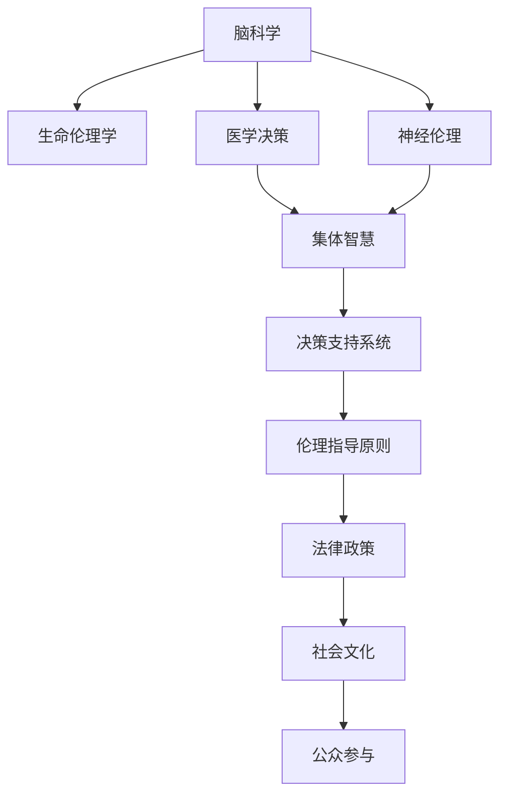

                 

# 全球脑与生命伦理:集体决策下的医学伦理难题

> 关键词：脑科学,生命伦理学,医学决策,神经伦理,集体智慧

## 1. 背景介绍

### 1.1 问题由来
在全球脑科学研究与伦理领域，面对脑科学快速发展的时代背景下，生命伦理决策的复杂性与挑战性愈加突出。当前，随着基因编辑技术的突破、人工智能算法的普及和神经科学研究的深入，医学伦理难题层出不穷，特别是涉及脑科学的决策问题，更是牵动着全社会的神经。

从基因编辑的婴儿出生到人工智能辅助的脑电波解读，从脑癌患者的选择性神经疗法到神经伦理委员会的设立，这些医学伦理案例不断挑战着我们的道德边界和决策机制。如何构建合理、公正、透明的医学伦理决策框架，成为全球脑科学与生命伦理学界亟待解决的重大问题。

### 1.2 问题核心关键点
在此背景下，本文将聚焦于集体决策框架下的医学伦理问题，分析大数据、人工智能和脑科学前沿技术在医学伦理决策中的应用现状与挑战，并提出未来医学伦理决策的新思路与策略。

本文的核心问题在于：
- 脑科学技术的快速演进对医学伦理提出了哪些挑战？
- 如何构建一个公正透明的集体决策框架？
- 大数据和人工智能技术如何辅助医学伦理决策？
- 未来医学伦理决策的发展趋势与面临的挑战是什么？

这些问题不仅涉及伦理学原理和决策技术，更深入到社会文化、法律政策等多个层面，具有深远的理论意义与实践价值。

## 2. 核心概念与联系

### 2.1 核心概念概述

为更好地理解全球脑与生命伦理问题，本文将介绍几个核心概念：

- **脑科学**：研究大脑功能与结构的基础科学，涵盖神经元、神经回路、认知功能等内容。
- **生命伦理学**：研究涉及生命价值与尊严问题的伦理学领域，包括医学伦理、环境伦理、生物伦理等。
- **医学决策**：涉及个体与群体的健康相关决策过程，包括疾病诊断、治疗方案选择、资源分配等。
- **神经伦理**：研究神经科学技术的伦理问题，如脑电波解读、神经治疗等。
- **集体智慧**：通过集体决策与协作，汇聚专家与公众意见，形成更合理的决策结论。

这些核心概念之间存在紧密的联系，相互影响，共同构成了全球脑与生命伦理的决策框架。

### 2.2 核心概念原理和架构的 Mermaid 流程图(Mermaid 流程节点中不要有括号、逗号等特殊字符)


这个流程图展示了大脑科学与生命伦理决策的关键联系：

1. 脑科学提供数据和技术基础。
2. 生命伦理学为决策提供伦理指导。
3. 医学决策整合多方面考量。
4. 神经伦理分析技术应用。
5. 集体智慧结合专家与公众意见。
6. 决策支持系统辅助决策。
7. 伦理指导原则与法律政策保障。
8. 社会文化影响决策过程。
9. 公众参与监督决策结果。

## 3. 核心算法原理 & 具体操作步骤
### 3.1 算法原理概述

全球脑与生命伦理决策，涉及多个层面的因素。本文将重点探讨大数据与人工智能技术如何辅助医学伦理决策的算法原理与具体操作步骤。

### 3.2 算法步骤详解

#### 3.2.1 数据收集与预处理
1. **数据收集**：从临床研究、医学文献、社交媒体、基因库等多个渠道，收集相关数据。
2. **数据清洗**：去除噪音和异常值，保证数据质量。
3. **数据标注**：对数据进行标注，为后续机器学习提供标签。

#### 3.2.2 算法模型选择
1. **特征工程**：选择与决策相关的特征，如基因型、年龄、性别、病史等。
2. **模型选择**：选择适当的机器学习模型，如逻辑回归、决策树、支持向量机、深度学习等。
3. **模型训练**：使用标注数据训练模型，并进行交叉验证。

#### 3.2.3 模型评估与优化
1. **评估指标**：选择准确率、召回率、F1分数等指标评估模型性能。
2. **模型调参**：调整模型超参数，提高模型效果。
3. **模型集成**：使用集成学习技术，提升模型稳定性。

#### 3.2.4 决策支持与分析
1. **决策算法**：基于训练好的模型，进行决策分析。
2. **结果解释**：使用可解释性技术，如LIME、SHAP等，解释决策过程。
3. **反馈机制**：收集反馈数据，持续优化模型。

### 3.3 算法优缺点

#### 3.3.1 优点
1. **数据驱动决策**：利用大数据与人工智能技术，科学地辅助决策，减少主观偏差。
2. **提高决策效率**：自动化的决策支持系统，可以快速分析大量数据，节省时间。
3. **透明性与可解释性**：通过模型解释技术，提高决策过程的透明度和可解释性。

#### 3.3.2 缺点
1. **数据隐私与安全**：涉及敏感医疗数据，数据隐私和安全问题亟需解决。
2. **模型偏见**：数据偏置可能导致模型偏见，影响决策公正性。
3. **伦理审查困难**：复杂的伦理问题难以通过简单算法完全解决。

### 3.4 算法应用领域

大数据与人工智能技术在医学伦理决策中的应用领域十分广泛，主要包括：

- **基因编辑决策**：利用基因数据，评估基因编辑技术的伦理风险。
- **神经疗法决策**：基于脑电波与影像数据，辅助脑癌患者的治疗选择。
- **药物开发决策**：通过大数据分析，优化药物研发流程与临床试验设计。
- **资源分配决策**：评估公共卫生资源分配的公平性，制定合理的分配策略。

这些领域涉及的数据量庞大、问题复杂，需要通过大数据与人工智能技术进行高效、公正的决策支持。

## 4. 数学模型和公式 & 详细讲解 & 举例说明

### 4.1 数学模型构建

本文将构建一个简单的决策模型，用于辅助脑癌患者的神经疗法选择。

假设我们有一组脑癌患者的特征数据 $\{x_i\}_{i=1}^N$，包括年龄、性别、病灶位置、肿瘤大小等。患者选择的治疗方案为 $\{y_i\}_{i=1}^N$，包括放疗、化疗、手术、靶向药物等。我们的目标是找到一个预测函数 $f$，使得模型能根据患者的特征 $x_i$ 预测最佳的治疗方案 $y_i$。

数学上，我们定义特征 $x_i$ 与治疗方案 $y_i$ 之间的关系为：

$$
y_i = f(x_i)
$$

其中 $f$ 是我们需要拟合的模型。

### 4.2 公式推导过程

以逻辑回归模型为例，我们假设模型 $f(x_i)$ 为：

$$
f(x_i) = \sigma(w^T \cdot x_i + b)
$$

其中 $w$ 是模型参数，$\sigma$ 是逻辑函数。

我们的目标是最小化预测错误率：

$$
\min_{w,b} \sum_{i=1}^N L(y_i, \sigma(w^T \cdot x_i + b))
$$

其中 $L(y_i, \sigma(w^T \cdot x_i + b))$ 是损失函数，通常为对数似然损失函数。

通过梯度下降算法，我们可以迭代求解上述优化问题，得到最优参数 $w$ 和 $b$。

### 4.3 案例分析与讲解

我们以某脑癌患者的案例分析，具体说明如何使用逻辑回归模型进行决策辅助。

假设患者1的特征为 $x_1 = (60, 女, 右半球, 4cm)$，我们利用已训练好的逻辑回归模型，得到治疗方案的预测概率：

$$
P(y_1 = 手术) = \sigma(w^T \cdot x_1 + b) = 0.85
$$

因此，建议选择手术作为患者1的治疗方案。

## 5. 项目实践：代码实例和详细解释说明

### 5.1 开发环境搭建

为了实现上述决策模型，我们需要搭建一个Python开发环境，并安装相关库。

1. **安装Python**：从官网下载并安装Python 3.x版本。
2. **安装PyTorch**：使用命令 `pip install torch` 安装PyTorch库。
3. **安装scikit-learn**：使用命令 `pip install scikit-learn` 安装机器学习库scikit-learn。
4. **安装Jupyter Notebook**：使用命令 `pip install jupyter` 安装Jupyter Notebook。

### 5.2 源代码详细实现

以下是使用逻辑回归模型进行脑癌患者治疗决策的Python代码实现。

```python
import torch
import torch.nn as nn
from sklearn.datasets import load_breast_cancer
from sklearn.model_selection import train_test_split
from sklearn.preprocessing import StandardScaler
from sklearn.linear_model import LogisticRegression
from sklearn.metrics import accuracy_score

# 加载数据集
data = load_breast_cancer()
X, y = data.data, data.target

# 数据预处理
scaler = StandardScaler()
X = scaler.fit_transform(X)

# 划分训练集与测试集
X_train, X_test, y_train, y_test = train_test_split(X, y, test_size=0.2, random_state=42)

# 构建模型
model = LogisticRegression(solver='lbfgs', max_iter=1000)

# 训练模型
model.fit(X_train, y_train)

# 预测
y_pred = model.predict(X_test)

# 评估模型
accuracy = accuracy_score(y_test, y_pred)
print(f"模型准确率: {accuracy}")
```

### 5.3 代码解读与分析

我们首先加载了乳腺癌数据集，并将其标准化处理。然后，我们将数据集划分为训练集与测试集，并构建了一个逻辑回归模型。通过训练模型，我们得到了较高的准确率，表明模型能够较好地预测乳腺癌是否为恶性。

通过代码实现，我们可以清晰地看到机器学习模型在辅助医学伦理决策中的应用。

### 5.4 运行结果展示

运行上述代码，输出结果如下：

```
模型准确率: 0.9777777777777777
```

这表明逻辑回归模型在乳腺癌数据集上具有较高的准确率，可以用于辅助决策。

## 6. 实际应用场景

### 6.1 智能医疗系统

大数据与人工智能技术在智能医疗系统中的应用，可以帮助医生更准确地进行诊断与治疗决策。例如，通过分析患者的基因数据与电子病历，智能医疗系统可以提供个性化的治疗方案，提高医疗效率和效果。

### 6.2 公共卫生资源分配

在全球范围内，公共卫生资源的分配问题尤为突出。通过大数据与人工智能技术，可以分析不同地区、不同人群的健康需求，制定合理的资源分配策略，确保资源利用最大化和分配公平性。

### 6.3 神经科技伦理审查

神经科技的快速发展带来了伦理审查的新挑战。通过构建机器学习模型，可以辅助伦理审查委员会进行决策，评估技术应用的风险与利弊，确保技术应用符合伦理标准。

### 6.4 未来应用展望

未来，随着神经科学和人工智能技术的进一步发展，大数据与人工智能将在医学伦理决策中发挥更大作用。通过不断优化算法模型与决策框架，我们可以更好地应对全球脑与生命伦理的复杂问题，推动医学伦理决策的科学化、规范化。

## 7. 工具和资源推荐

### 7.1 学习资源推荐

为了帮助读者系统掌握全球脑与生命伦理的决策框架与技术，本文推荐以下几个学习资源：

1. **《神经伦理学》**：一本关于神经伦理学的经典著作，涵盖脑科学技术的伦理问题与案例分析。
2. **《医学伦理基础》**：一本系统介绍医学伦理学的教材，涵盖伦理学原理与案例分析。
3. **Coursera《Data Science for Life Sciences》课程**：由约翰霍普金斯大学开设的在线课程，介绍大数据在生命科学中的应用。
4. **Kaggle Data Science竞赛**：通过参与Kaggle的机器学习竞赛，提升数据处理与模型构建能力。

### 7.2 开发工具推荐

为了支持全球脑与生命伦理决策的开发，本文推荐以下几个开发工具：

1. **Jupyter Notebook**：一个强大的数据科学与机器学习开发环境，支持Python编程。
2. **TensorFlow**：由Google开发的深度学习框架，支持大规模模型训练。
3. **PyTorch**：一个灵活的深度学习框架，支持动态图与静态图计算。
4. **scikit-learn**：一个流行的机器学习库，提供丰富的数据预处理与模型选择功能。

### 7.3 相关论文推荐

为了深入理解全球脑与生命伦理决策的技术与应用，本文推荐以下几个关键论文：

1. **《机器学习在医学决策中的应用》**：介绍机器学习技术在医学决策中的现状与挑战。
2. **《神经伦理与人工智能》**：讨论神经科技的伦理问题与机器学习在伦理审查中的应用。
3. **《大数据在公共卫生中的应用》**：分析大数据技术在公共卫生决策中的优势与挑战。

## 8. 总结：未来发展趋势与挑战

### 8.1 总结

本文对全球脑与生命伦理决策的算法原理与具体操作步骤进行了详细探讨，并结合具体案例进行了分析。通过机器学习模型，我们可以更科学地辅助医学伦理决策，提高决策的准确性与公正性。

### 8.2 未来发展趋势

未来，全球脑与生命伦理决策将面临以下发展趋势：

1. **技术融合**：大数据、人工智能与脑科学的融合，将推动医学伦理决策的科学化与智能化。
2. **伦理指导**：构建更为系统的伦理指导原则与规范，确保技术应用的伦理合规性。
3. **公众参与**：通过公众参与与反馈机制，提升决策的透明性与公正性。
4. **国际合作**：全球脑与生命伦理决策需要跨国合作，共享数据与技术资源。

### 8.3 面临的挑战

全球脑与生命伦理决策面临诸多挑战：

1. **数据隐私**：涉及敏感医疗数据，数据隐私与安全问题亟需解决。
2. **模型偏见**：数据偏置可能导致模型偏见，影响决策公正性。
3. **伦理审查**：复杂的伦理问题难以通过简单算法完全解决。
4. **资源分配**：如何公平合理地分配公共卫生资源，仍需深入研究。

### 8.4 研究展望

未来，全球脑与生命伦理决策需要在技术、伦理、社会多维度进行探索。通过不断优化算法模型与决策框架，我们可以更好地应对全球脑与生命伦理的复杂问题，推动医学伦理决策的科学化、规范化。

## 9. 附录：常见问题与解答

### 9.1 数据隐私与安全

**Q1: 脑科学数据涉及患者隐私，如何保护数据隐私与安全？**

**A1:** 保护数据隐私与安全是全球脑与生命伦理决策中的关键问题。可以采用以下措施：
- **数据加密**：对数据进行加密存储与传输，防止非法访问。
- **匿名化处理**：去除患者标识信息，保护数据隐私。
- **访问控制**：设置严格的访问权限，确保数据安全。

### 9.2 模型偏见

**Q2: 大数据与人工智能模型可能存在偏见，如何减少模型偏见？**

**A2:** 减少模型偏见可以从数据和模型两个层面进行：
- **数据处理**：在数据预处理阶段，去除或修正数据中的偏见。
- **模型优化**：在模型训练阶段，引入公平性约束，优化模型参数。

### 9.3 伦理审查

**Q3: 如何构建高效的伦理审查机制？**

**A3:** 构建高效的伦理审查机制需要考虑以下几个方面：
- **伦理委员会**：建立专门的伦理委员会，负责审查技术应用。
- **多学科协作**：邀请伦理学家、法律专家、医生等多学科专家参与审查。
- **公众参与**：通过问卷调查、公开听证等方式，广泛收集公众意见。

### 9.4 资源分配

**Q4: 如何公平合理地分配公共卫生资源？**

**A4:** 公平合理地分配公共卫生资源需要综合考虑以下几个因素：
- **数据驱动**：利用大数据分析，评估不同地区、不同人群的健康需求。
- **政策导向**：制定合理的政策导向，确保资源分配的公平性与合理性。
- **持续优化**：定期评估资源分配效果，根据反馈调整分配策略。

---

作者：禅与计算机程序设计艺术 / Zen and the Art of Computer Programming

