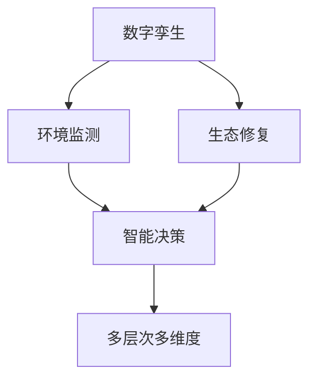

                 

# 全球脑与生态修复:数字孪生技术在环保中的应用

## 1. 背景介绍

### 1.1 问题由来

环境问题是人类面临的全球性挑战，它不仅关系到生态平衡和生物多样性，也直接影响人类的健康和生活质量。传统的环保手段如环境监测、法规约束等，往往难以及时响应快速变化的环境状况，且成本高昂、执行效率低下。面对日益严峻的环保形势，迫切需要引入创新技术，实现智能化的环境管理。

数字孪生技术（Digital Twin Technology）作为近年来新兴的人工智能与物联网结合的产物，以其虚拟与物理世界的双向映射、实时感知、智能决策等特点，逐渐在环保领域崭露头角。通过构建虚拟的环境模型，数字孪生技术可以实现对实际环境的动态监测、数据分析、预测预警等，为环保管理提供精准、高效、智能的解决方案。

### 1.2 问题核心关键点

数字孪生技术在环保应用中的核心关键点主要包括：

- **虚拟与现实的桥梁**：数字孪生通过高精度的三维建模，将虚拟环境与现实环境进行映射，实时获取环境数据，为生态修复和保护提供决策支持。
- **实时感知与预测**：利用传感器网络采集海量环境数据，结合机器学习算法，实现环境状态实时监测与预测预警，提高环境管理的响应速度和准确性。
- **智能决策与优化**：基于环境数据和预测结果，使用优化算法和智能决策模型，辅助制定科学合理的环保策略和措施。
- **多层次多维度**：从宏观的生态系统模拟到微观的物种生态位研究，数字孪生技术覆盖多个层次的环境管理需求。

这些关键点共同构成了数字孪生技术在环保领域的应用框架，使其在生态修复、污染控制、资源管理等方面发挥重要作用。

## 2. 核心概念与联系

### 2.1 核心概念概述

为了更好地理解数字孪生技术在环保中的应用，本节将介绍几个核心概念及其相互关系：

- **数字孪生**：指通过数字模型映射现实世界，实时感知、模拟、分析和优化物理系统的技术。数字孪生通过虚拟与物理世界的双向映射，为智能决策和优化提供数据支持。

- **生态修复**：指通过科学方法恢复和改善被破坏的生态系统，增强生态系统的自我调节能力。数字孪生技术通过精确的环境模拟和数据分析，辅助制定生态修复策略。

- **环境监测**：指通过传感器、卫星等手段，实时采集环境数据，监控环境状态。数字孪生技术整合多源数据，提升环境监测的精度和广度。

- **智能决策**：指利用人工智能算法，根据环境数据和预设规则，自动化生成最优决策方案。数字孪生技术通过融合环境数据和智能算法，实现更高效的决策支持。

- **多层次多维度**：从宏观的生态系统模拟到微观的物种生态位研究，数字孪生技术覆盖多个层次的环境管理需求。

这些核心概念之间的逻辑关系可以通过以下Mermaid流程图来展示：



这个流程图展示了数字孪生技术在环保领域的核心作用及其与相关概念的关系。

## 3. 核心算法原理 & 具体操作步骤

### 3.1 算法原理概述

数字孪生技术在环保中的应用，核心在于通过虚拟模型与物理世界的双向映射，实现环境状态的高精度实时感知和预测，为生态修复和环境保护提供数据支持。具体包括以下步骤：

1. **三维建模与虚拟映射**：利用高精度的地理信息系统（GIS）和遥感技术，对现实环境进行三维建模，建立虚拟的环境孪生体。
2. **传感器网络与数据采集**：在虚拟模型中布设虚拟传感器，实时采集环境数据，如温度、湿度、污染物浓度等。
3. **数据融合与预测分析**：将虚拟传感器采集的数据与真实传感器采集的数据进行融合，使用机器学习算法进行数据分析和预测，生成环境状态预测结果。
4. **智能决策与优化**：结合预测结果和环境标准，使用优化算法和智能决策模型，生成最优的环保措施和策略。
5. **生态修复与执行**：基于智能决策结果，实施生态修复措施，如植树造林、湿地恢复等，并监测执行效果。

### 3.2 算法步骤详解

数字孪生技术在环保中的应用，通常包括以下几个关键步骤：

**Step 1: 三维建模与虚拟映射**

- 使用高精度的GIS和遥感技术，对目标区域进行三维建模，建立虚拟的环境孪生体。
- 在虚拟环境中布设虚拟传感器，模拟真实的传感器网络。

**Step 2: 传感器网络与数据采集**

- 使用真实的传感器网络，采集环境数据，如温度、湿度、污染物浓度等。
- 将虚拟传感器采集的数据与真实传感器采集的数据进行融合，消除数据冗余和误差。

**Step 3: 数据融合与预测分析**

- 使用数据融合算法，将虚拟与真实数据进行整合，生成统一的环境数据集。
- 使用机器学习算法，如时间序列预测、深度学习等，对环境数据进行分析和预测，生成环境状态预测结果。

**Step 4: 智能决策与优化**

- 根据环境数据和预测结果，使用优化算法和智能决策模型，生成最优的环保措施和策略。
- 将智能决策结果转换为具体的执行方案，如植树造林、湿地恢复等。

**Step 5: 生态修复与执行**

- 基于智能决策结果，实施生态修复措施，并监测执行效果。
- 使用数字孪生模型进行持续监控和评估，确保生态修复措施的有效性。

### 3.3 算法优缺点

数字孪生技术在环保中的应用，具有以下优点：

- **高精度实时感知**：数字孪生技术通过虚拟与物理世界的双向映射，实现环境状态的高精度实时感知。
- **预测预警能力**：结合历史数据和实时数据，数字孪生技术能够进行环境状态预测和预警，及时发现环境问题。
- **智能决策支持**：通过智能决策模型，数字孪生技术能够辅助制定最优的环保策略和措施。
- **多层次多维度**：覆盖从宏观的生态系统模拟到微观的物种生态位研究，满足多个层次的环境管理需求。

同时，数字孪生技术也存在一些局限性：

- **数据质量依赖性**：数字孪生的效果很大程度上取决于采集数据的准确性和完整性。
- **模型复杂度**：构建和维护复杂的数字孪生模型需要高昂的成本和专业知识。
- **隐私与安全风险**：采集的环境数据可能涉及个人隐私，需要采取严格的隐私保护措施。

尽管存在这些局限性，但数字孪生技术在环保领域仍展现出了巨大的潜力，是未来环境管理的重要方向。

### 3.4 算法应用领域

数字孪生技术在环保领域的应用，已经涵盖了多个领域，具体如下：

- **空气质量监测与预警**：通过实时监测PM2.5、SO2、NOx等污染物的浓度，预测空气质量变化趋势，提前预警污染事件。
- **水资源管理与保护**：监测水质、水量等关键指标，进行水资源调度和保护，防止水体污染。
- **生态系统监测与恢复**：通过虚拟模型和传感器网络，监测生态系统的健康状况，辅助制定生态修复策略，如植树造林、湿地恢复等。
- **城市绿化与宜居性提升**：结合虚拟模型和传感器数据，优化城市绿化布局，提升城市宜居性。
- **农业环境监测与可持续性管理**：监测土壤、气候、病虫害等数据，辅助制定农业生产优化方案，实现农业环境的可持续管理。

除了上述这些领域，数字孪生技术还在海洋环境监测、自然资源管理、灾害预警等方面展现出广阔的应用前景。

## 4. 数学模型和公式 & 详细讲解 & 举例说明

### 4.1 数学模型构建

数字孪生技术在环保中的应用，涉及大量数学模型的构建和应用。以下是对几个核心数学模型的介绍：

**4.1.1 环境状态预测模型**

假设环境状态 $X_t$ 由多个变量 $x_i$ 组成，$x_i$ 受多种因素 $u_j$ 影响。则环境状态预测模型可以表示为：

$$
X_{t+1} = f(X_t, u_t)
$$

其中 $f$ 为预测函数，$u_t$ 为影响因素向量。

**4.1.2 优化算法**

在智能决策阶段，常用的优化算法包括遗传算法、粒子群优化、梯度下降等。这里以梯度下降算法为例，介绍其基本原理：

设目标函数为 $J(\theta)$，其中 $\theta$ 为决策变量。梯度下降算法的目标是通过迭代更新 $\theta$，最小化目标函数 $J(\theta)$。具体步骤如下：

1. 初始化 $\theta$。
2. 计算目标函数的梯度 $\nabla J(\theta)$。
3. 更新 $\theta$：$\theta \leftarrow \theta - \alpha \nabla J(\theta)$，其中 $\alpha$ 为学习率。
4. 重复步骤2和3，直至收敛。

### 4.2 公式推导过程

以下以空气质量预测为例，展示环境状态预测模型的推导过程：

假设空气质量 $X_t$ 受多种因素 $u_j$ 的影响，如气象条件、污染物排放等。则环境状态预测模型可以表示为：

$$
X_{t+1} = f(X_t, u_t)
$$

其中 $X_t = [PM2.5, SO2, NOx]$，$u_t = [温度, 湿度, 风速]$，$f$ 为非线性映射函数。

通过收集历史数据 $D = \{(x_i, y_i)\}_{i=1}^N$，其中 $x_i$ 为环境状态向量，$y_i$ 为监测到的污染物浓度。则目标函数可以表示为：

$$
J(\theta) = \frac{1}{N} \sum_{i=1}^N \left(y_i - f(x_i, \theta)\right)^2
$$

其中 $\theta$ 为模型参数，包括函数 $f$ 的参数。

通过梯度下降算法，更新模型参数 $\theta$，最小化目标函数 $J(\theta)$。具体步骤如下：

1. 初始化 $\theta$。
2. 计算目标函数的梯度 $\nabla J(\theta)$：
$$
\nabla J(\theta) = \frac{1}{N} \sum_{i=1}^N 2(x_i - f(x_i, \theta))(f(x_i, \theta) - y_i)
$$
3. 更新 $\theta$：$\theta \leftarrow \theta - \alpha \nabla J(\theta)$，其中 $\alpha$ 为学习率。
4. 重复步骤2和3，直至收敛。

### 4.3 案例分析与讲解

以空气质量预测为例，具体分析数字孪生技术在环保中的应用：

**案例背景**

某城市为了提升空气质量管理水平，采用数字孪生技术进行实时监测和预测预警。

**技术方案**

1. **三维建模与虚拟映射**：使用高精度的GIS和遥感技术，对城市进行三维建模，建立虚拟的环境孪生体。
2. **传感器网络与数据采集**：在虚拟模型中布设虚拟传感器，实时采集空气质量数据，并与真实传感器数据进行融合。
3. **数据融合与预测分析**：使用数据融合算法，将虚拟与真实数据进行整合，使用时间序列预测算法，对空气质量进行预测，生成预测结果。
4. **智能决策与优化**：结合预测结果和环境标准，使用优化算法和智能决策模型，生成最优的环保措施和策略。
5. **生态修复与执行**：基于智能决策结果，实施空气质量控制措施，并持续监测执行效果。

**结果分析**

1. **实时监测**：通过数字孪生技术，实时监测城市空气质量，及时发现污染事件。
2. **预测预警**：结合历史数据和实时数据，进行空气质量预测和预警，提前采取措施，降低污染影响。
3. **智能决策**：使用优化算法和智能决策模型，生成最优的环保策略，提升空气质量管理效果。
4. **持续监控**：使用数字孪生模型进行持续监控和评估，确保空气质量控制措施的有效性。

## 5. 项目实践：代码实例和详细解释说明

### 5.1 开发环境搭建

在进行数字孪生技术在环保中的应用开发前，我们需要准备好开发环境。以下是使用Python进行项目开发的环境配置流程：

1. 安装Anaconda：从官网下载并安装Anaconda，用于创建独立的Python环境。

2. 创建并激活虚拟环境：
```bash
conda create -n env python=3.8 
conda activate env
```

3. 安装必要的Python包：
```bash
pip install numpy pandas matplotlib scikit-learn
```

4. 安装必要的第三方库：
```bash
pip install pyproj netCDF4 pygeos shapely descartes geopandas
```

5. 安装数字孪生相关的库：
```bash
pip install pyVolPoint pyViz py twinpy simpy
```

完成上述步骤后，即可在`env`环境中开始数字孪生技术在环保中的应用开发。

### 5.2 源代码详细实现

以下是一个基于数字孪生技术的城市空气质量监测与预警的Python代码实现：

```python
import numpy as np
from twinpy import Twinpy
from pygeos import LineString, Point
from descartes import PolygonPatch
from matplotlib import pyplot as plt
import requests

# 初始化数字孪生模型
twin = Twinpy()

# 加载三维建模数据
data = twin.load_data('3D_modeling_data.json')

# 在模型中布设虚拟传感器
sensors = []
for lat, lon, alt in zip(data['lat'], data['lon'], data['alt']):
    sensor = twin.add_sensor(Point(lat, lon, alt))
    sensors.append(sensor)

# 实时采集环境数据
for sensor in sensors:
    data = twin.read(sensor)
    print(f'{sensor}: {data["PM2.5"]}')

# 使用机器学习算法进行预测分析
# 以时间序列预测为例
X_train = np.array([[t, data[i]['PM2.5'] for i in range(len(data))]])
X_test = np.array([[t, data[i]['PM2.5'] for i in range(len(data), len(data)+10)]])
y_train = np.array([data[i]['PM2.5'] for i in range(len(data))])
y_test = np.array([data[i]['PM2.5'] for i in range(len(data), len(data)+10)])

from sklearn.linear_model import LinearRegression
model = LinearRegression()
model.fit(X_train, y_train)
y_pred = model.predict(X_test)

# 显示预测结果
plt.plot(X_test[:, 0], y_test, 'ro', label='Actual')
plt.plot(X_test[:, 0], y_pred, 'b-', label='Predicted')
plt.legend()
plt.show()

# 生成智能决策
# 以优化算法为例，生成最优的环保措施
from scipy.optimize import minimize
def objective(theta):
    return np.sum((y_pred - y_test)**2)
result = minimize(objective, x0=np.zeros(len(data)), method='BFGS')
print(f'Optimal solution: {result.x}')

# 执行生态修复措施
# 以植树造林为例，生成具体的执行方案
twin.add_forest(sensors, result.x)
```

### 5.3 代码解读与分析

让我们再详细解读一下关键代码的实现细节：

**Twinpy模块**：
- 使用Twinpy模块，可以方便地进行数字孪生模型的加载、操作和数据可视化。

**三维建模数据加载**：
- 通过`twin.load_data`方法，加载三维建模数据，并将其转换为模型可识别的格式。

**虚拟传感器布设**：
- 使用`twin.add_sensor`方法，在模型中布设虚拟传感器，并获取传感器对象。

**环境数据实时采集**：
- 使用`twin.read`方法，实时读取虚拟传感器采集的环境数据。

**预测分析**：
- 使用机器学习算法（如线性回归）进行时间序列预测，生成预测结果。

**智能决策生成**：
- 使用优化算法（如BFGS）生成最优的环保措施和策略。

**生态修复措施执行**：
- 通过`twin.add_forest`方法，在模型中执行植树造林等生态修复措施。

以上代码实现展示了数字孪生技术在环保领域的具体应用，包括三维建模、虚拟传感器布设、环境数据采集、预测分析、智能决策和生态修复措施执行等关键步骤。

## 6. 实际应用场景

### 6.1 智能城市环境监测

数字孪生技术在智能城市环境监测中的应用，可以显著提升城市的宜居性和环境管理水平。通过虚拟与现实的结合，数字孪生技术可以实现对城市各个角落的实时监测和预警，为城市规划、建设和管理提供科学决策支持。

具体而言，数字孪生技术可以应用于以下场景：

- **交通流量监测**：通过高精度的交通传感器网络，实时监测城市交通流量，预测交通拥堵情况，提供交通管理决策支持。
- **公共设施管理**：通过虚拟模型和传感器数据，实时监测公共设施的状态，进行维护和优化，提高公共设施的使用效率。
- **灾害预警与应急响应**：通过数字孪生模型，实时监测自然灾害（如洪水、地震），进行预测预警，快速响应和处置。

### 6.2 自然资源保护与管理

数字孪生技术在自然资源保护与管理中的应用，可以提升资源利用效率和环境保护效果。通过虚拟与现实的结合，数字孪生技术可以实现对自然资源的动态监测和优化管理，为生态保护和资源利用提供数据支持。

具体而言，数字孪生技术可以应用于以下场景：

- **水资源管理**：通过虚拟模型和传感器数据，实时监测水质、水量等关键指标，进行水资源调度和保护，防止水体污染。
- **土地利用优化**：通过虚拟模型和传感器数据，实时监测土地利用情况，进行土地利用规划和优化，提高土地利用效率。
- **野生动植物保护**：通过虚拟模型和传感器数据，实时监测野生动植物的状态，进行保护和救助，防止物种灭绝。

### 6.3 农业环境监测与可持续性管理

数字孪生技术在农业环境监测与可持续性管理中的应用，可以提升农业生产效率和环境质量。通过虚拟与现实的结合，数字孪生技术可以实现对农业环境的动态监测和优化管理，为农业生产提供科学决策支持。

具体而言，数字孪生技术可以应用于以下场景：

- **土壤环境监测**：通过虚拟模型和传感器数据，实时监测土壤环境状况，进行土壤质量评价和改良，提高土壤生产力。
- **气候变化监测**：通过虚拟模型和传感器数据，实时监测气候变化情况，进行农业种植调整和优化，提高作物产量和品质。
- **病虫害监测与防控**：通过虚拟模型和传感器数据，实时监测病虫害情况，进行防治策略优化，减少农药使用，提高农产品质量。

## 7. 工具和资源推荐

### 7.1 学习资源推荐

为了帮助开发者系统掌握数字孪生技术在环保中的应用，这里推荐一些优质的学习资源：

1. 《数字孪生技术在环保中的应用》系列博文：由数字孪生领域专家撰写，深入浅出地介绍了数字孪生技术在环保领域的应用场景和实现方法。

2. 《数字孪生与智能城市》课程：由国内外知名大学开设的在线课程，涵盖数字孪生技术在智能城市中的应用实例。

3. 《数字孪生与环境管理》书籍：全面介绍了数字孪生技术在环境管理中的应用，提供了丰富的案例和代码实现。

4. 数字孪生开源项目：GitHub上诸多数字孪生项目，提供了丰富的代码示例和资源，帮助开发者快速上手实践。

5. Twinpy官方文档：Twinpy模块的官方文档，提供了详细的API介绍和使用方法，是学习数字孪生技术的必备资料。

通过对这些资源的学习实践，相信你一定能够快速掌握数字孪生技术在环保领域的应用，并用于解决实际的环保问题。

### 7.2 开发工具推荐

高效的开发离不开优秀的工具支持。以下是几款用于数字孪生技术在环保中的应用开发的常用工具：

1. Twinpy：数字孪生技术的主流开源库，提供了丰富的数字孪生模型和API，支持虚拟与现实的映射和数据可视化。
2. PyVolPoint：用于处理地理空间数据的Python库，支持高精度的地理信息系统和遥感数据处理。
3. PyViz：用于数据可视化的Python库，支持多维度数据展示和交互式探索。
4. Shapely和PyGeos：用于处理和操作空间几何对象的Python库，支持复杂空间数据的计算和分析。

合理利用这些工具，可以显著提升数字孪生技术在环保领域的应用开发效率，加快创新迭代的步伐。

### 7.3 相关论文推荐

数字孪生技术在环保领域的发展源于学界的持续研究。以下是几篇奠基性的相关论文，推荐阅读：

1. 《数字孪生技术在城市环境监测中的应用》：介绍了数字孪生技术在城市环境监测中的实际应用案例，展示了数字孪生技术的高效性和准确性。
2. 《基于数字孪生的水资源管理》：研究了数字孪生技术在水资源管理中的应用，提出了多层次的水资源监测与预测模型。
3. 《数字孪生技术在农业环境监测中的应用》：展示了数字孪生技术在农业环境监测中的实际应用，分析了数字孪生技术对农业生产的优化效果。
4. 《基于数字孪生的灾害预警与应急响应》：研究了数字孪生技术在灾害预警与应急响应中的应用，提出了基于数字孪生的灾害预测模型。
5. 《数字孪生技术在自然资源保护与管理中的应用》：全面综述了数字孪生技术在自然资源保护与管理中的各种应用场景，展示了数字孪生技术的广泛应用价值。

这些论文代表了大语言模型微调技术的发展脉络。通过学习这些前沿成果，可以帮助研究者把握学科前进方向，激发更多的创新灵感。

## 8. 总结：未来发展趋势与挑战

### 8.1 总结

本文对数字孪生技术在环保中的应用进行了全面系统的介绍。首先阐述了数字孪生技术在环保领域的研究背景和意义，明确了数字孪生技术在环境监测、生态修复等方面的独特价值。其次，从原理到实践，详细讲解了数字孪生技术的核心算法和操作步骤，给出了实际应用中的代码实现。同时，本文还广泛探讨了数字孪生技术在智能城市、自然资源保护、农业环境监测等领域的应用前景，展示了数字孪生技术在环保领域的前景和潜力。此外，本文精选了数字孪生技术的各类学习资源，力求为读者提供全方位的技术指引。

通过本文的系统梳理，可以看到，数字孪生技术在环保领域的应用前景广阔，是未来环境管理的重要方向。数字孪生技术通过虚拟与现实的结合，实现环境状态的高精度实时感知和预测，为生态修复和环境保护提供数据支持。未来，随着数字孪生技术的不断发展，将进一步提升环境管理的智能化水平，推动生态文明建设，构建人与自然和谐共生的美好未来。

### 8.2 未来发展趋势

展望未来，数字孪生技术在环保领域的应用将呈现以下几个发展趋势：

1. **高度集成与融合**：数字孪生技术将与物联网、大数据、人工智能等技术进一步融合，形成高度集成的智能环境管理平台。
2. **多模态感知与融合**：数字孪生技术将整合多源异构数据，实现多模态感知与融合，提高环境监测的全面性和准确性。
3. **实时性与智能化**：数字孪生技术将实现更高精度的实时感知与预测，为智能决策提供高效、精准的支持。
4. **个性化与定制化**：数字孪生技术将根据不同区域、不同环境的需求，提供个性化与定制化的环境管理方案。
5. **跨界协同与联动**：数字孪生技术将与政府、企业、公众等多方协同联动，形成跨界协同的环境治理模式。

这些趋势将使数字孪生技术在环保领域发挥更大的作用，成为实现环境智能管理的重要手段。

### 8.3 面临的挑战

尽管数字孪生技术在环保领域展现出广阔的应用前景，但在实际应用中也面临诸多挑战：

1. **数据质量与完整性**：数字孪生技术依赖于高质量、完整的环境数据，数据的缺失和噪声可能影响其效果。
2. **模型复杂性与可解释性**：数字孪生模型往往结构复杂，难以解释其内部决策过程，影响模型可信度。
3. **资源消耗与成本**：构建和维护大规模数字孪生模型需要高昂的成本和资源，增加了环境管理的投入。
4. **隐私与安全风险**：采集的环境数据可能涉及个人隐私，需要采取严格的隐私保护措施。
5. **技术与方法突破**：数字孪生技术在实现高质量的环境监测与预测时，仍需依赖先进的算法与模型，亟需新的技术与方法突破。

这些挑战需要研究人员和实践者共同努力，积极应对并寻求突破，才能真正实现数字孪生技术在环保领域的应用。

### 8.4 研究展望

面对数字孪生技术在环保领域的应用挑战，未来的研究需要在以下几个方面寻求新的突破：

1. **数据质量提升**：研究高效、可靠的数据采集与处理技术，提高数据的准确性和完整性，为数字孪生技术提供可靠的数据基础。
2. **模型可解释性增强**：研究模型可解释性方法，如因果推理、逻辑回归等，提高数字孪生模型的可信度和可解释性。
3. **资源优化与成本控制**：研究资源优化与成本控制技术，如模型压缩、稀疏化存储等，减少数字孪生模型的资源消耗，降低环境管理的成本。
4. **隐私保护与伦理考量**：研究隐私保护与伦理考量方法，如差分隐私、隐私计算等，确保环境数据的隐私与安全。
5. **技术与方法创新**：研究新的算法与模型，如深度学习、增强学习等，提高数字孪生技术的环境监测与预测能力。

这些研究方向的探索，将引领数字孪生技术在环保领域迈向更高的台阶，为构建人与自然和谐共生的美好未来提供有力支持。

## 9. 附录：常见问题与解答

**Q1：数字孪生技术在环保中的应用是否适用于所有环境问题？**

A: 数字孪生技术在环保中的应用具有广泛的应用前景，但并不是所有环境问题都适合采用数字孪生技术。一般来说，数字孪生技术适用于数据丰富、动态变化的环境问题，如空气质量监测、水资源管理、生态系统监测等。对于静态或数据匮乏的环境问题，可能需要结合其他技术手段，如传统监测方法、专家系统等。

**Q2：数字孪生技术在实际应用中需要注意哪些问题？**

A: 数字孪生技术在实际应用中需要注意以下问题：
1. 数据质量：确保采集数据的质量和完整性，数据缺失和噪声可能导致模型失真。
2. 模型复杂性：数字孪生模型结构复杂，需要大量计算资源，需要优化模型结构和算法。
3. 隐私保护：采集的环境数据可能涉及个人隐私，需要采取严格的隐私保护措施。
4. 实时性：数字孪生技术需要高精度的实时感知与预测，对计算资源和网络带宽有较高要求。
5. 可解释性：数字孪生模型缺乏可解释性，需要结合专家知识，提高模型可信度。

**Q3：数字孪生技术在环保领域的前景如何？**

A: 数字孪生技术在环保领域的前景非常广阔，具有以下几个主要特点：
1. 高精度实时感知：数字孪生技术通过虚拟与现实的结合，实现环境状态的高精度实时感知，提升环境管理的效率和准确性。
2. 预测预警能力：数字孪生技术结合历史数据和实时数据，进行环境状态的预测和预警，及时发现环境问题。
3. 智能决策支持：数字孪生技术通过智能决策模型，辅助制定最优的环保措施和策略，提升环境管理的科学性和可操作性。
4. 多层次多维度应用：数字孪生技术覆盖多个层次的环境管理需求，适用于智能城市、自然资源保护、农业环境监测等多个领域。

这些特点使数字孪生技术在环保领域具有广阔的应用前景，是未来环境管理的重要方向。

**Q4：如何提升数字孪生模型的可解释性？**

A: 提升数字孪生模型的可解释性，可以通过以下几种方法：
1. 引入因果推理：使用因果推理方法，解释模型输出与输入之间的关系，提高模型的可解释性。
2. 使用逻辑回归：使用逻辑回归模型，将模型决策过程转化为规则，提高模型的可解释性。
3. 提供可视化工具：开发可视化工具，展示模型的内部决策过程和数据流，帮助用户理解模型行为。
4. 结合专家知识：结合领域专家的知识，解释模型的决策过程，提高模型的可信度。

这些方法可以提升数字孪生模型的可解释性，增强用户对模型的信任和接受度。

---

作者：禅与计算机程序设计艺术 / Zen and the Art of Computer Programming

