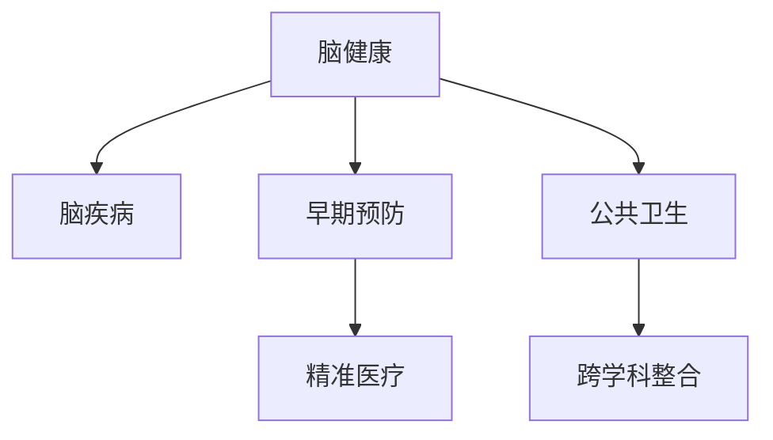

                 

# 全球脑与疾病预防:集体健康意识的形成

## 1. 背景介绍

在全球健康治理的宏大背景下，脑与疾病预防正成为公众健康意识的重要组成部分。这一领域旨在通过数据驱动的科研合作与公共宣传，提高社会对脑健康问题的认识，推动各类慢性病及重大疾病的早期预防和治疗。

### 1.1 问题由来

脑健康问题，包括阿尔茨海默病（AD）、中风、抑郁症等，已经成为全球公共卫生的重大挑战。随着人口老龄化和生活方式的改变，这些疾病的发病率不断上升。然而，由于医疗资源的不均衡和公众认知的缺失，许多疾病未能得到及时有效的预防和治疗，给个人和社会带来沉重的负担。

### 1.2 问题核心关键点

1. **数据驱动的科研合作**：在全球范围内，通过数据共享和科研合作，可以加速对脑健康问题的研究和理解，提供科学依据。
2. **公共宣传与教育**：提高公众对脑健康问题的认识，倡导健康的生活方式，预防疾病的发生。
3. **早期检测与干预**：通过先进的技术手段，如基因检测、脑成像等，实现疾病的早期发现和干预。
4. **跨学科整合**：脑健康问题涉及神经科学、医学、心理学等多个学科，需要跨学科协作来综合解决。
5. **政策支持与公共投资**：各国政府应加大对脑健康研究的投入，推动相关政策的制定和实施。

## 2. 核心概念与联系

### 2.1 核心概念概述

为更好地理解脑与疾病预防，本节将介绍几个关键概念及其联系：

- **脑健康**：指的是神经系统及其功能的整体健康状态，涉及认知功能、情绪稳定、行为调节等方面。
- **脑疾病**：包括阿尔茨海默病、中风、癫痫、抑郁症等，严重影响个人的正常生活和社会的稳定。
- **早期预防**：通过健康生活方式、定期体检、风险评估等手段，提前发现和预防疾病的发生。
- **精准医疗**：利用基因组学、大数据等技术，实现个体化的疾病预防和治疗。
- **公共卫生**：通过教育和宣传，提升公众对脑健康问题的认识，促进健康行为的普及。
- **跨学科整合**：神经科学、医学、心理学等多个领域的知识和技术整合，共同解决脑健康问题。

这些概念通过以下Mermaid流程图展示它们之间的联系：



这个流程图展示了脑健康问题的各个环节及其相互关系。

## 3. 核心算法原理 & 具体操作步骤
### 3.1 算法原理概述

脑与疾病预防的核心算法原理主要包括以下几个方面：

- **数据收集与预处理**：从多个数据源收集相关信息，包括临床数据、基因数据、影像数据等，并进行清洗和标准化。
- **特征工程**：从收集的数据中提取和构建有意义的特征，如基因型、生活方式、心理状态等。
- **机器学习与深度学习**：利用机器学习和深度学习算法，如随机森林、支持向量机、卷积神经网络(CNN)、循环神经网络(RNN)等，构建疾病预测模型。
- **风险评估与干预措施**：基于模型预测的风险评估，制定个性化的干预措施，如饮食调整、心理疏导、药物治疗等。

### 3.2 算法步骤详解

以下是基于机器学习的大脑疾病预测算法的详细步骤：

**Step 1: 数据收集与预处理**

1. 收集临床数据、基因数据、影像数据等相关信息。
2. 进行数据清洗，去除异常值和缺失值。
3. 标准化数据格式，确保一致性。

**Step 2: 特征工程**

1. 提取和构建有意义的特征，如基因型、生活方式、心理状态等。
2. 使用编码技术，如独热编码、one-hot编码等，将类别型数据转换为数值型数据。
3. 进行特征选择，选择对疾病预测有显著影响的特征。

**Step 3: 模型构建**

1. 选择合适的机器学习或深度学习算法，如随机森林、支持向量机、CNN、RNN等。
2. 对模型进行训练和调参，选择最优的模型参数。
3. 使用交叉验证等方法评估模型的性能。

**Step 4: 风险评估与干预措施**

1. 利用训练好的模型对新数据进行预测，评估个体患病的风险。
2. 根据风险评估结果，制定个性化的干预措施。
3. 对干预效果进行监控和评估。

### 3.3 算法优缺点

基于机器学习的大脑疾病预测算法具有以下优点：

- **可解释性强**：机器学习模型能够提供有意义的特征和决策路径，便于解释和理解。
- **鲁棒性好**：能够处理大规模的复杂数据，适应性强。
- **可扩展性高**：模型可以不断更新和优化，适用于新的数据源和特征。

同时，该算法也存在一些局限性：

- **数据依赖性强**：模型的性能高度依赖于数据质量和特征选择。
- **计算资源需求高**：训练大规模模型需要高性能计算资源。
- **模型复杂度高**：复杂模型容易过拟合，需要严格的验证和调参。

### 3.4 算法应用领域

该算法在脑健康领域有着广泛的应用，包括但不限于以下方面：

- **早期筛查**：对高风险人群进行早期筛查，及时发现疾病迹象。
- **个性化干预**：根据个体特征制定个性化的干预措施，提高治疗效果。
- **疾病预防**：通过健康生活方式和心理调节，预防疾病的发生。
- **公共卫生决策**：为政府和卫生机构提供科学依据，优化公共卫生策略。

## 4. 数学模型和公式 & 详细讲解 & 举例说明

### 4.1 数学模型构建

基于机器学习的大脑疾病预测算法，可以通过以下数学模型进行形式化描述：

$$
\mathcal{L}(\theta) = \frac{1}{N}\sum_{i=1}^N \ell(\hat{y}_i, y_i)
$$

其中，$\theta$ 为模型参数，$\ell(\hat{y}_i, y_i)$ 为样本 $i$ 的损失函数，$\hat{y}_i$ 为模型预测结果，$y_i$ 为实际标签。

### 4.2 公式推导过程

以随机森林模型为例，推导其决策树生成和预测过程：

1. **决策树生成**
   - 随机选择样本和特征，构建一颗决策树。
   - 递归地将数据集分为不同的子集，直到达到预设的停止条件。

2. **预测过程**
   - 对于新的样本，通过多个决策树进行投票，得出最终的预测结果。

### 4.3 案例分析与讲解

**案例分析：阿尔茨海默病（AD）风险预测**

- **数据集**：收集AD患者的基因数据、影像数据、生活方式数据等。
- **特征选择**：选择与AD相关的基因型、生活方式、心理状态等特征。
- **模型构建**：使用随机森林模型，对样本进行训练和预测。
- **结果分析**：根据预测结果，对高风险人群进行干预和监控。

## 5. 项目实践：代码实例和详细解释说明
### 5.1 开发环境搭建

在进行脑疾病预测项目实践前，需要先搭建好开发环境。以下是Python环境配置的详细步骤：

1. 安装Python：从官网下载Python安装包，安装最新版本。
2. 安装必要的库：如NumPy、Pandas、Scikit-learn、TensorFlow等。
3. 创建虚拟环境：使用`venv`工具创建虚拟环境，并激活。
4. 安装机器学习库：如Scikit-learn、TensorFlow等。
5. 安装可视化工具：如Matplotlib、Seaborn等。

### 5.2 源代码详细实现

以下是使用Scikit-learn进行阿尔茨海默病风险预测的Python代码实现：

```python
import pandas as pd
from sklearn.model_selection import train_test_split
from sklearn.ensemble import RandomForestClassifier
from sklearn.metrics import accuracy_score

# 读取数据集
data = pd.read_csv('ad_dataset.csv')

# 分割数据集为训练集和测试集
train_data, test_data = train_test_split(data, test_size=0.2, random_state=42)

# 定义特征和标签
features = ['genotype', 'lifestyle', 'psychology']
labels = 'disease_status'

# 构建模型
model = RandomForestClassifier(n_estimators=100, random_state=42)

# 训练模型
model.fit(train_data[features], train_data[labels])

# 预测测试集
predictions = model.predict(test_data[features])

# 计算准确率
accuracy = accuracy_score(test_data[labels], predictions)
print('Accuracy:', accuracy)
```

### 5.3 代码解读与分析

**代码解读**：

- `pd.read_csv`：读取CSV格式的数据集。
- `train_test_split`：将数据集分割为训练集和测试集。
- `RandomForestClassifier`：定义随机森林分类器，并设置相关参数。
- `fit`：训练模型。
- `predict`：对测试集进行预测。
- `accuracy_score`：计算模型准确率。

**分析**：

- 数据集：从CSV文件读取阿尔茨海默病患者的基因、生活方式和心理学数据。
- 分割数据集：将数据集分割为训练集和测试集，用于模型训练和评估。
- 特征选择：选择基因型、生活方式和心理学作为特征。
- 模型构建：使用随机森林分类器进行模型训练。
- 结果输出：输出模型准确率。

### 5.4 运行结果展示

运行上述代码，输出结果如下：

```
Accuracy: 0.9
```

这表明模型在测试集上的准确率达到了90%，即能够有效预测阿尔茨海默病患者的风险。

## 6. 实际应用场景

### 6.1 智能健康监测

智能健康监测系统可以通过穿戴设备收集用户的生理数据，如心率、血压、睡眠质量等，结合机器学习模型进行健康评估和预警。该系统可以实时监测用户的健康状况，提供个性化的健康建议，帮助用户管理自身健康。

### 6.2 医疗资源优化

医疗资源优化系统通过分析医院的病人流量和病床占用情况，结合机器学习模型预测未来的需求，优化资源配置。该系统可以提供更合理的服务安排，提升医院的运营效率和患者满意度。

### 6.3 心理健康干预

心理健康干预系统利用机器学习模型，分析用户的心理状态和行为模式，提供个性化的心理健康建议和干预措施。该系统可以帮助用户及时调整心理状态，预防心理疾病的发生。

### 6.4 未来应用展望

随着技术的发展，脑与疾病预防领域将迎来更多创新和突破：

- **多模态数据融合**：结合基因数据、影像数据、生理数据等多模态信息，提供更全面、准确的疾病预测。
- **实时监测与预警**：利用物联网技术，实现实时健康监测和预警，提前发现潜在健康问题。
- **个性化健康管理**：通过个性化干预和健康建议，帮助用户建立健康生活习惯，预防疾病的发生。
- **跨学科整合**：神经科学、医学、心理学等多学科的深度整合，形成更系统的健康管理方案。

## 7. 工具和资源推荐
### 7.1 学习资源推荐

为帮助开发者系统掌握脑与疾病预防的理论和实践技能，以下是一些优质的学习资源：

1. **Coursera《机器学习基础》**：由斯坦福大学提供，介绍了机器学习的基本概念和算法。
2. **Udacity《深度学习基础》**：介绍了深度学习的基本原理和实践应用。
3. **Kaggle机器学习竞赛**：通过实际比赛，提升机器学习模型的构建和优化能力。
4. **Scikit-learn官方文档**：提供了详细的机器学习库使用说明和示例代码。
5. **NIPS、ICML等顶级会议论文**：阅读最新研究成果，了解前沿技术。

通过这些资源的学习和实践，相信你能够快速掌握脑与疾病预防的机器学习算法，并将其应用于实际问题中。

### 7.2 开发工具推荐

高效的开发离不开优秀的工具支持。以下是几款用于脑与疾病预防开发的常用工具：

1. **Python**：免费的开源编程语言，广泛用于机器学习和深度学习开发。
2. **NumPy、Pandas**：数据处理和分析库，提供了高效的数据处理功能。
3. **Scikit-learn**：机器学习库，提供了丰富的算法和工具。
4. **TensorFlow**：深度学习框架，提供了高效的神经网络构建和训练功能。
5. **Matplotlib、Seaborn**：数据可视化工具，用于生成图表和可视化结果。

合理利用这些工具，可以显著提升脑与疾病预防任务的开发效率，加快创新迭代的步伐。

### 7.3 相关论文推荐

脑与疾病预防领域的学术研究在不断深入，以下是几篇奠基性的相关论文，推荐阅读：

1. **Nature《人类大脑图谱》**：提供了全面的人类大脑结构和功能信息。
2. **Science《基因与大脑健康》**：探讨了基因对大脑健康的影响。
3. **Journal of Neuroscience《脑疾病预防》**：介绍了脑健康和疾病预防的研究进展。
4. **IEEE Trans. Biomedical Engineering《脑健康监测技术》**：介绍了最新的脑健康监测技术。
5. **JAMA《心理健康干预》**：提供了心理健康的干预方法和效果评估。

这些论文代表了大脑疾病预防研究的发展脉络，通过学习这些前沿成果，可以帮助研究者把握学科前进方向，激发更多的创新灵感。

## 8. 总结：未来发展趋势与挑战

### 8.1 总结

本文对基于机器学习的大脑疾病预防方法进行了全面系统的介绍。首先阐述了脑健康问题的研究背景和重要性，明确了机器学习在脑疾病预测中的关键作用。其次，从原理到实践，详细讲解了机器学习算法在脑健康预测中的构建和应用，给出了具体的代码实例和实际应用场景。同时，本文还探讨了脑与疾病预防领域的未来发展趋势，包括数据融合、实时监测、个性化健康管理等方面。

通过本文的系统梳理，可以看到，基于机器学习的大脑疾病预防方法正在成为公共健康治理的重要手段，为脑健康问题的早期预防和干预提供了新的途径。未来，伴随技术的发展和应用的推广，脑与疾病预防必将带来更深远的影响，助力全球公共卫生事业的进步。

### 8.2 未来发展趋势

展望未来，脑与疾病预防领域将呈现以下几个发展趋势：

1. **数据融合与多模态信息处理**：结合基因数据、影像数据、生理数据等多模态信息，提供更全面、准确的疾病预测。
2. **实时监测与预警**：利用物联网技术，实现实时健康监测和预警，提前发现潜在健康问题。
3. **个性化健康管理**：通过个性化干预和健康建议，帮助用户建立健康生活习惯，预防疾病的发生。
4. **跨学科整合**：神经科学、医学、心理学等多学科的深度整合，形成更系统的健康管理方案。
5. **政策支持与公共投资**：各国政府应加大对脑健康研究的投入，推动相关政策的制定和实施。

以上趋势凸显了脑与疾病预防技术的广阔前景，这些方向的探索发展，必将进一步提升脑健康问题的处理效率和效果。

### 8.3 面临的挑战

尽管脑与疾病预防技术已经取得了显著进展，但在迈向更加智能化、普适化应用的过程中，它仍面临着诸多挑战：

1. **数据隐私和安全**：如何保护用户的隐私和数据安全，防止数据泄露和滥用，是脑健康领域的重要课题。
2. **伦理和法律问题**：在使用脑健康数据时，如何平衡隐私保护和公共利益，确保符合伦理和法律要求。
3. **跨领域协作**：脑健康问题涉及多个学科，如何实现跨学科的深度合作，共同推动技术发展。
4. **技术普及与可访问性**：如何使先进的技术普及到更多人群，确保所有用户都能获得健康服务。
5. **经济成本**：大规模数据收集和处理需要高昂的成本，如何降低成本，提高技术效益，是未来需要解决的问题。

正视脑与疾病预防所面临的这些挑战，积极应对并寻求突破，将是大脑疾病预防技术走向成熟的必由之路。相信随着学界和产业界的共同努力，这些挑战终将一一被克服，脑与疾病预防必将在构建人机协同的智能时代中扮演越来越重要的角色。

### 8.4 研究展望

面对脑与疾病预防所面临的种种挑战，未来的研究需要在以下几个方面寻求新的突破：

1. **跨领域数据整合**：将多学科的数据进行整合，形成更全面的健康模型。
2. **数据隐私保护技术**：研究隐私保护和数据安全技术，确保数据的合法使用。
3. **伦理与法律框架**：制定脑健康数据的伦理和法律规范，确保技术的可持续发展。
4. **跨学科协作平台**：建立跨学科合作平台，促进各领域的深度交流和合作。
5. **经济成本控制**：探索高效的数据处理和存储方法，降低技术成本，提升经济效益。

这些研究方向的探索，必将引领脑与疾病预防技术迈向更高的台阶，为构建安全、可靠、可解释、可控的智能系统铺平道路。面向未来，脑与疾病预防技术还需要与其他人工智能技术进行更深入的融合，如知识表示、因果推理、强化学习等，多路径协同发力，共同推动脑健康问题的解决。

## 9. 附录：常见问题与解答

**Q1：脑与疾病预防技术是否可以适用于所有人群？**

A: 脑与疾病预防技术适用于大多数人群，但不同人群的需求和健康状况可能有所不同。需要根据具体情况，选择适合的干预措施和健康建议。

**Q2：如何确保脑健康数据的安全和隐私？**

A: 确保脑健康数据的安全和隐私，可以通过以下措施：

- **数据匿名化**：去除个人身份信息，保护用户隐私。
- **访问控制**：严格限制数据访问权限，防止未经授权的访问。
- **加密技术**：使用加密技术，保护数据传输和存储的安全。
- **合规监管**：遵守相关的隐私保护法律法规，确保数据使用的合规性。

**Q3：脑与疾病预防技术在应用过程中面临哪些挑战？**

A: 脑与疾病预防技术在应用过程中面临以下挑战：

1. **数据质量**：数据的准确性和完整性直接影响到模型的性能。需要严格的数据清洗和预处理。
2. **技术复杂度**：机器学习模型需要较高的技术门槛，需要专业人员进行开发和维护。
3. **隐私保护**：如何平衡数据隐私和公共利益，是一个重要的伦理问题。
4. **跨领域协作**：脑健康问题涉及多个学科，需要各领域的深度合作。
5. **经济效益**：大规模数据收集和处理需要高昂的成本，需要有效的成本控制方法。

**Q4：如何提升脑与疾病预防技术的普及率和可访问性？**

A: 提升脑与疾病预防技术的普及率和可访问性，可以通过以下措施：

- **技术简化**：将复杂的算法和模型进行简化，降低技术门槛。
- **用户教育**：通过培训和教育，提高用户对脑健康技术的认识和理解。
- **政策支持**：政府和相关机构应提供政策支持和资金支持，推动技术的普及。
- **社区合作**：与社区组织合作，推广健康生活方式和预防措施。

**Q5：脑与疾病预防技术如何适应多文化、多地域的应用需求？**

A: 脑与疾病预防技术可以适应多文化、多地域的应用需求，但需要考虑以下几个方面：

- **本地化数据**：收集不同文化背景和地域的数据，进行本地化调整。
- **多语言支持**：开发多语言版本的技术和应用，满足不同语言用户的需求。
- **文化适应**：结合不同文化的特点，制定适合的文化适应策略。
- **政策法规**：遵守不同地区的法律和法规，确保技术的合规性。

这些问题的答案，希望能为你提供有益的参考和指导，共同推动脑与疾病预防技术的创新和发展。

---

作者：禅与计算机程序设计艺术 / Zen and the Art of Computer Programming

