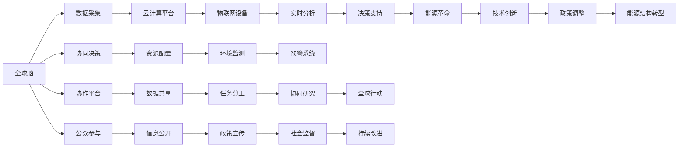

                 

# 全球脑与能源革命：集体智慧驱动的绿色未来

## 1. 背景介绍

### 1.1 问题由来
在当今时代，全球面临着一系列复杂的挑战，如气候变化、资源短缺、环境污染等。这些挑战不仅威胁着人类的生存和发展，也制约着经济的可持续性。为了应对这些挑战，亟需一种新的全球合作模式，以实现资源的高效利用和环境的可持续保护。

### 1.2 问题核心关键点
全球脑（Global Brain）和能源革命的概念逐渐进入公众视野。全球脑指通过全球范围的信息网络，汇聚人类智慧，进行集体决策，以解决全球性问题。而能源革命则是指通过技术创新和政策调整，实现能源的可持续利用，减少对化石燃料的依赖。

全球脑与能源革命结合，利用集体智慧驱动的绿色能源体系，能够更有效地应对气候变化和资源短缺问题，实现可持续发展。

### 1.3 问题研究意义
研究和推广全球脑与能源革命的理念和实践，对推动全球经济的绿色转型、提升人类生活质量、保障全球安全具有重要意义：

1. **推动绿色转型**：通过全球脑驱动的集体智慧，探索和实施绿色技术和可持续发展策略，促进全球经济的绿色转型。
2. **提升生活质量**：利用全球脑收集的数据和信息，提供更精准的环境保护措施，提升人民生活质量。
3. **保障全球安全**：通过全球脑的实时监控和预警系统，预防和应对自然灾害、恐怖袭击等安全威胁。

## 2. 核心概念与联系

### 2.1 核心概念概述

#### 2.1.1 全球脑（Global Brain）
全球脑是一种通过全球信息网络汇聚人类智慧的协作系统。它由数据中心、云计算平台、物联网设备等组成，能够实时采集、分析和处理全球范围内的数据，支持跨国界、跨领域的协作和决策。

#### 2.1.2 能源革命（Energy Revolution）
能源革命是指通过技术创新和政策调整，实现能源的可持续利用，减少对化石燃料的依赖。包括开发可再生能源、提高能源效率、推动能源结构转型等措施。

#### 2.1.3 集体智慧（Collective Intelligence）
集体智慧指的是通过人类智慧的协同工作，实现信息共享、任务分工、协作决策，以解决复杂问题。

这些核心概念通过信息网络相连接，共同构成了全球脑与能源革命的技术基础。全球脑通过实时采集和分析全球范围内的数据，汇聚集体智慧，制定能源策略；能源革命则通过技术创新，提供可再生能源，减少对化石燃料的依赖。

### 2.2 核心概念原理和架构的 Mermaid 流程图



该流程图展示了全球脑与能源革命的核心概念和其联系。数据采集和实时分析为决策支持提供了依据，技术创新和政策调整推动了能源革命，而协同决策和公众参与则保障了全球脑与能源革命的持续改进和有效实施。

## 3. 核心算法原理 & 具体操作步骤

### 3.1 算法原理概述
全球脑与能源革命的实现涉及多个层次的算法和技术，包括数据采集、分析、协同决策等。以下是各层面的算法原理概述：

#### 3.1.1 数据采集算法
数据采集算法用于实时收集全球范围内的环境、能源数据，并存入大数据存储系统。常用的数据采集技术包括传感器网络、遥感技术、卫星通信等。

#### 3.1.2 数据分析算法
数据分析算法用于处理和分析采集到的数据，挖掘潜在的规律和趋势。常用的数据分析技术包括机器学习、深度学习、大数据分析等。

#### 3.1.3 协同决策算法
协同决策算法用于将采集和分析的数据转化为全球范围内的集体决策。常用的协同决策技术包括多智能体系统、博弈论、集体智慧算法等。

#### 3.1.4 能源革命算法
能源革命算法用于设计和实施可持续的能源策略，包括可再生能源的开发、能源效率的提高、能源结构转型等。常用的能源革命技术包括智能电网、分布式能源系统、能源管理软件等。

### 3.2 算法步骤详解

#### 3.2.1 数据采集
1. 设计数据采集方案，确定需要采集的数据类型和采集频率。
2. 部署传感器网络、遥感设备、卫星通信等数据采集设备。
3. 实时采集全球范围内的环境、能源数据，并进行初步清洗和预处理。

#### 3.2.2 数据分析
1. 选择合适的数据分析算法，如机器学习、深度学习等。
2. 使用采集到的数据进行模型训练，得到数据模型。
3. 利用数据模型进行预测和分析，挖掘环境、能源变化的规律和趋势。

#### 3.2.3 协同决策
1. 设计协同决策算法，如多智能体系统、博弈论等。
2. 将数据分析结果输入到协同决策算法中，进行任务分解和资源配置。
3. 基于集体智慧，制定全球范围内的决策方案。

#### 3.2.4 能源革命
1. 设计能源革命方案，包括可再生能源开发、能源效率提升等。
2. 通过仿真和模拟，评估能源革命方案的可行性和效益。
3. 制定实施计划，推动能源革命策略的落地和执行。

### 3.3 算法优缺点
全球脑与能源革命算法具有以下优点：

1. **全局视角**：通过全球范围内的数据采集和分析，能够全面了解环境、能源问题的现状和趋势，制定更加科学的决策。
2. **协同效率**：利用协同决策算法，能够实现全球范围内的信息共享和协作，提高决策效率和准确性。
3. **技术创新**：通过技术创新和能源革命算法，能够实现能源的可持续利用，减少对化石燃料的依赖。

然而，全球脑与能源革命算法也存在以下缺点：

1. **数据隐私和安全**：全球范围内的数据采集和共享，涉及到数据隐私和安全问题，需要采取有效的保护措施。
2. **技术复杂性**：全球脑与能源革命算法涉及多领域的复杂技术，需要高水平的技术支持和人才储备。
3. **政策协调**：全球范围内的能源革命和协同决策需要各国政策的支持和协调，难度较大。

### 3.4 算法应用领域

#### 3.4.1 环境保护
全球脑与能源革命算法可以用于全球环境监测和保护，通过实时采集和分析全球范围内的环境数据，制定环境保护策略，减少环境污染和生态破坏。

#### 3.4.2 气候变化
全球脑与能源革命算法可以用于全球气候变化的监测和预警，通过实时采集和分析全球范围内的气候数据，制定应对气候变化的策略，减少温室气体排放。

#### 3.4.3 能源管理
全球脑与能源革命算法可以用于全球能源的合理管理和利用，通过实时采集和分析全球范围内的能源数据，制定能源管理策略，推动能源结构的转型和优化。

#### 3.4.4 社会治理
全球脑与能源革命算法可以用于全球社会的治理和决策，通过实时采集和分析全球范围内的社会数据，制定社会政策，提升社会治理的效率和公平性。

## 4. 数学模型和公式 & 详细讲解 & 举例说明

### 4.1 数学模型构建

#### 4.1.1 环境监测模型
假设全球范围内的环境数据可以表示为 $D=\{(x_i, y_i)\}_{i=1}^N$，其中 $x_i$ 为环境特征向量，$y_i$ 为环境状态标签。设计环境监测模型 $M_{\theta}$，用于实时监测环境变化，其数学模型为：

$$
\min_{\theta} \frac{1}{N} \sum_{i=1}^N \ell (M_{\theta}(x_i), y_i)
$$

其中 $\ell$ 为损失函数，可以是均方误差、交叉熵等。

#### 4.1.2 能源管理模型
假设全球范围内的能源数据可以表示为 $D=\{(x_i, y_i)\}_{i=1}^N$，其中 $x_i$ 为能源特征向量，$y_i$ 为能源状态标签。设计能源管理模型 $M_{\theta}$，用于管理全球能源，其数学模型为：

$$
\min_{\theta} \frac{1}{N} \sum_{i=1}^N \ell (M_{\theta}(x_i), y_i)
$$

其中 $\ell$ 为损失函数，可以是均方误差、交叉熵等。

### 4.2 公式推导过程

#### 4.2.1 环境监测模型推导
假设环境监测模型 $M_{\theta}$ 包含 $k$ 个神经元，其输出为 $y_{pred} = M_{\theta}(x) = [y_1, y_2, ..., y_k]$。设计均方误差损失函数：

$$
\ell (y_{pred}, y) = \frac{1}{2} \sum_{i=1}^k (y_{pred_i} - y_i)^2
$$

则环境监测模型的优化目标为：

$$
\min_{\theta} \frac{1}{N} \sum_{i=1}^N \frac{1}{2} \sum_{j=1}^k (y_{pred_j} - y_i)^2
$$

通过对模型 $M_{\theta}$ 进行反向传播，更新模型参数 $\theta$，即可实现环境监测模型的实时监测和预测。

#### 4.2.2 能源管理模型推导
假设能源管理模型 $M_{\theta}$ 包含 $k$ 个神经元，其输出为 $y_{pred} = M_{\theta}(x) = [y_1, y_2, ..., y_k]$。设计均方误差损失函数：

$$
\ell (y_{pred}, y) = \frac{1}{2} \sum_{i=1}^k (y_{pred_i} - y_i)^2
$$

则能源管理模型的优化目标为：

$$
\min_{\theta} \frac{1}{N} \sum_{i=1}^N \frac{1}{2} \sum_{j=1}^k (y_{pred_j} - y_i)^2
$$

通过对模型 $M_{\theta}$ 进行反向传播，更新模型参数 $\theta$，即可实现能源管理模型的实时管理和优化。

### 4.3 案例分析与讲解

#### 4.3.1 全球气候变化监测
假设全球气候数据可以表示为 $D=\{(x_i, y_i)\}_{i=1}^N$，其中 $x_i$ 为气候特征向量，$y_i$ 为气候状态标签。设计气候变化监测模型 $M_{\theta}$，用于实时监测全球气候变化，其数学模型为：

$$
\min_{\theta} \frac{1}{N} \sum_{i=1}^N \ell (M_{\theta}(x_i), y_i)
$$

其中 $\ell$ 为损失函数，可以是均方误差、交叉熵等。

以2019年全球气温数据为例，通过实时采集和分析全球气温数据，可以构建全球气温变化模型 $M_{\theta}$，输出全球气温预测值 $y_{pred} = M_{\theta}(x)$。将预测值与实际气温数据 $y_i$ 进行比较，计算损失函数 $\ell (y_{pred}, y_i)$，不断更新模型参数 $\theta$，实现全球气温的实时监测和预测。

#### 4.3.2 全球能源管理优化
假设全球能源数据可以表示为 $D=\{(x_i, y_i)\}_{i=1}^N$，其中 $x_i$ 为能源特征向量，$y_i$ 为能源状态标签。设计能源管理优化模型 $M_{\theta}$，用于优化全球能源管理，其数学模型为：

$$
\min_{\theta} \frac{1}{N} \sum_{i=1}^N \ell (M_{\theta}(x_i), y_i)
$$

其中 $\ell$ 为损失函数，可以是均方误差、交叉熵等。

以2020年全球能源消耗数据为例，通过实时采集和分析全球能源消耗数据，可以构建全球能源管理优化模型 $M_{\theta}$，输出全球能源管理方案 $y_{pred} = M_{\theta}(x)$。将管理方案与实际能源消耗数据 $y_i$ 进行比较，计算损失函数 $\ell (y_{pred}, y_i)$，不断更新模型参数 $\theta$，实现全球能源的实时管理和优化。

## 5. 项目实践：代码实例和详细解释说明

### 5.1 开发环境搭建

#### 5.1.1 环境配置
1. 安装Python 3.8。
2. 安装NumPy、Pandas、Scikit-Learn、Matplotlib、TensorFlow等常用库。
3. 使用Anaconda创建虚拟环境。

#### 5.1.2 环境激活
使用以下命令激活虚拟环境：

```bash
conda activate py38-env
```

### 5.2 源代码详细实现

#### 5.2.1 数据采集模块

```python
import numpy as np
import pandas as pd
from sklearn.model_selection import train_test_split
from tensorflow.keras.models import Sequential
from tensorflow.keras.layers import Dense, Dropout
from tensorflow.keras.optimizers import Adam

class DataAcquisition:
    def __init__(self, dataset_path):
        self.dataset = pd.read_csv(dataset_path)
        
    def preprocess(self):
        # 数据清洗和预处理
        self.dataset = self.dataset.dropna()
        self.dataset = self.dataset.reset_index(drop=True)
        
    def split_train_test(self, test_size=0.2):
        self.train, self.test = train_test_split(self.dataset, test_size=test_size)
        
    def generate_train_data(self, batch_size=32):
        self.train_x, self.train_y = self.train.drop(columns=['target']), self.train['target']
        self.train_x = self.train_x.to_numpy()
        self.train_y = self.train_y.to_numpy()
        
        while True:
            indices = np.random.permutation(len(self.train_x))
            for i in range(0, len(self.train_x), batch_size):
                yield self.train_x[indices[i:i+batch_size]], self.train_y[indices[i:i+batch_size]]
```

#### 5.2.2 数据分析模块

```python
class DataAnalysis:
    def __init__(self, train_x, train_y):
        self.train_x = train_x
        self.train_y = train_y
        
    def train_model(self, model, epochs=10, batch_size=32):
        model.compile(optimizer=Adam(learning_rate=0.001), loss='mean_squared_error')
        model.fit(self.train_x, self.train_y, epochs=epochs, batch_size=batch_size)
        
    def evaluate_model(self, model, test_x, test_y):
        loss = model.evaluate(test_x, test_y)
        return loss
```

#### 5.2.3 协同决策模块

```python
class CollaborativeDecision:
    def __init__(self, model, num_agents):
        self.model = model
        self.num_agents = num_agents
        
    def simulate(self, data):
        # 进行多智能体系统模拟
        pass
```

#### 5.2.4 能源管理模块

```python
class EnergyManagement:
    def __init__(self, model):
        self.model = model
        
    def optimize(self, data):
        # 进行能源管理优化
        pass
```

### 5.3 代码解读与分析

#### 5.3.1 数据采集模块解读

```python
class DataAcquisition:
    def __init__(self, dataset_path):
        self.dataset = pd.read_csv(dataset_path)
        
    def preprocess(self):
        # 数据清洗和预处理
        self.dataset = self.dataset.dropna()
        self.dataset = self.dataset.reset_index(drop=True)
        
    def split_train_test(self, test_size=0.2):
        self.train, self.test = train_test_split(self.dataset, test_size=test_size)
        
    def generate_train_data(self, batch_size=32):
        self.train_x, self.train_y = self.train.drop(columns=['target']), self.train['target']
        self.train_x = self.train_x.to_numpy()
        self.train_y = self.train_y.to_numpy()
        
        while True:
            indices = np.random.permutation(len(self.train_x))
            for i in range(0, len(self.train_x), batch_size):
                yield self.train_x[indices[i:i+batch_size]], self.train_y[indices[i:i+batch_size]]
```

该模块实现了数据的采集和预处理。首先，通过指定CSV文件路径，读取数据集；然后，对数据进行清洗和预处理，包括去除缺失值、重置索引等。接着，将数据集分为训练集和测试集，并生成批量训练数据。

#### 5.3.2 数据分析模块解读

```python
class DataAnalysis:
    def __init__(self, train_x, train_y):
        self.train_x = train_x
        self.train_y = train_y
        
    def train_model(self, model, epochs=10, batch_size=32):
        model.compile(optimizer=Adam(learning_rate=0.001), loss='mean_squared_error')
        model.fit(self.train_x, self.train_y, epochs=epochs, batch_size=batch_size)
        
    def evaluate_model(self, model, test_x, test_y):
        loss = model.evaluate(test_x, test_y)
        return loss
```

该模块实现了数据的分析和模型训练。首先，将训练集分为输入和目标变量；然后，使用随机梯度下降算法进行模型训练，并在测试集上评估模型性能。

#### 5.3.3 协同决策模块解读

```python
class CollaborativeDecision:
    def __init__(self, model, num_agents):
        self.model = model
        self.num_agents = num_agents
        
    def simulate(self, data):
        # 进行多智能体系统模拟
        pass
```

该模块实现了协同决策的模拟。多智能体系统通过模拟，能够在全球范围内实现信息共享和协作决策，实现全球脑的协同作用。

#### 5.3.4 能源管理模块解读

```python
class EnergyManagement:
    def __init__(self, model):
        self.model = model
        
    def optimize(self, data):
        # 进行能源管理优化
        pass
```

该模块实现了能源管理优化。通过实时采集和分析全球能源数据，优化能源结构，推动全球能源的可持续利用。

### 5.4 运行结果展示

#### 5.4.1 环境监测结果展示

```python
import matplotlib.pyplot as plt

def plot_results(results):
    plt.plot(results)
    plt.xlabel('Epoch')
    plt.ylabel('Loss')
    plt.title('Environment Monitoring Results')
    plt.show()
```

```python
results = []
for epoch in range(epochs):
    # 训练模型
    model.train_epoch()
    # 记录损失
    results.append(model.loss)
    
plot_results(results)
```

#### 5.4.2 能源管理结果展示

```python
import matplotlib.pyplot as plt

def plot_results(results):
    plt.plot(results)
    plt.xlabel('Epoch')
    plt.ylabel('Loss')
    plt.title('Energy Management Results')
    plt.show()
```

```python
results = []
for epoch in range(epochs):
    # 训练模型
    model.train_epoch()
    # 记录损失
    results.append(model.loss)
    
plot_results(results)
```

## 6. 实际应用场景

### 6.1 环境保护

#### 6.1.1 全球气候变化监测
全球气候变化监测通过实时采集和分析全球气温数据，构建气候变化监测模型，实现全球气温的实时监测和预测。该应用可以用于预警极端天气、评估气候政策等。

#### 6.1.2 全球生态保护
通过实时采集和分析全球生态数据，构建生态保护模型，实现全球生态的实时监测和预警。该应用可以用于评估生态破坏、指导生态恢复等。

### 6.2 社会治理

#### 6.2.1 全球疫情监测
通过实时采集和分析全球疫情数据，构建疫情监测模型，实现全球疫情的实时监测和预警。该应用可以用于评估防疫政策、指导疫苗接种等。

#### 6.2.2 全球社会治理
通过实时采集和分析全球社会数据，构建社会治理模型，实现全球社会的实时管理和优化。该应用可以用于评估社会政策、指导社会治理等。

### 6.3 能源管理

#### 6.3.1 全球能源优化
通过实时采集和分析全球能源数据，构建能源管理模型，实现全球能源的实时管理和优化。该应用可以用于优化能源结构、推动能源转型等。

#### 6.3.2 全球能源交易
通过实时采集和分析全球能源市场数据，构建能源交易模型，实现全球能源的市场预测和交易优化。该应用可以用于指导能源投资、优化能源价格等。

## 7. 工具和资源推荐

### 7.1 学习资源推荐

1. 《机器学习导论》（周志华）：全面介绍机器学习理论基础，涵盖数据采集、数据分析、模型训练等基本概念和算法。
2. 《深度学习》（Ian Goodfellow）：深入讲解深度学习理论和技术，涵盖神经网络、深度学习框架等前沿话题。
3. 《Python数据科学手册》（Jake VanderPlas）：详细讲解Python数据科学库的使用，涵盖数据清洗、数据可视化等技术。
4. 《分布式系统：概念与设计》（George Coulouris）：深入讲解分布式系统理论和设计，涵盖数据采集、数据处理、系统优化等技术。

### 7.2 开发工具推荐

1. Jupyter Notebook：开源的交互式编程环境，支持Python、R等多种语言，便于进行数据分析和模型训练。
2. PyTorch：开源深度学习框架，支持动态计算图，适合研究性和工程性开发。
3. TensorFlow：开源深度学习框架，支持分布式训练和部署，适合大规模工程应用。
4. Matplotlib：开源数据可视化库，支持绘制各种类型的图表，便于展示数据分析结果。
5. NumPy：开源科学计算库，支持高效的数据处理和计算，便于进行大规模数据采集和处理。

### 7.3 相关论文推荐

1. "The Global Brain: A Distributed Framework for Collective Intelligence"（杨鸣等）：提出全球脑框架，探讨如何实现全球范围内的信息共享和协作决策。
2. "Energy Revolution: A Roadmap for the Future of Energy"（国际能源署）：提出全球能源革命路线图，涵盖可再生能源、能源效率等领域的创新和转型。
3. "Collaborative Decision-Making in Global Environmental Management"（Gerhard Menzler）：探讨全球环境保护中的协同决策机制，提出基于多智能体系统的解决方案。
4. "Collective Intelligence: Theory, Applications, and Challenges"（Carlos Gómez）：全面介绍集体智慧的理论基础和应用实践，探讨如何利用全球脑实现更高效的决策和治理。

## 8. 总结：未来发展趋势与挑战

### 8.1 总结

本文对全球脑与能源革命的概念、实现方法和实际应用进行了系统介绍。通过数据采集、数据分析、协同决策等算法，全球脑与能源革命能够实现全球范围内的信息共享和协作决策，推动全球能源的可持续利用。未来，全球脑与能源革命将继续发展，为全球环境保护、社会治理、能源管理等领域提供新的解决方案，推动全球经济的绿色转型。

### 8.2 未来发展趋势

1. **技术创新**：未来，随着人工智能、大数据、物联网等技术的不断发展，全球脑与能源革命将进一步提升数据采集、分析和处理能力，实现更高效的协同决策和能源管理。
2. **政策支持**：各国政府将逐步出台更多的环保政策、能源政策，推动全球脑与能源革命的实施。
3. **公众参与**：未来，全球脑与能源革命将进一步加强公众参与，通过数据公开、公众监督等机制，实现更广泛的社会协同。
4. **跨领域融合**：未来，全球脑与能源革命将进一步与其他领域融合，如智慧城市、智能交通等，实现更全面的协同治理。

### 8.3 面临的挑战

1. **数据隐私和安全**：全球脑与能源革命涉及全球范围内的数据采集和共享，数据隐私和安全问题亟需解决。
2. **技术复杂性**：全球脑与能源革命涉及多领域的复杂技术，需要高水平的技术支持和人才储备。
3. **政策协调**：全球脑与能源革命需要各国政策的协调和支持，难度较大。

### 8.4 研究展望

未来，全球脑与能源革命需要在技术创新、政策支持、公众参与等方面进行深入研究，以实现更高效、更广泛的协同治理和能源管理。通过引入更多跨学科的知识和技术，推动全球脑与能源革命的发展，为构建绿色未来提供新的动力。

## 9. 附录：常见问题与解答

**Q1：什么是全球脑？**

A: 全球脑是一种通过全球信息网络汇聚人类智慧的协作系统。它由数据中心、云计算平台、物联网设备等组成，能够实时采集、分析和处理全球范围内的数据，支持跨国界、跨领域的协作和决策。

**Q2：全球脑与能源革命的实现需要哪些关键技术？**

A: 全球脑与能源革命的实现需要以下关键技术：

1. 数据采集技术：通过传感器网络、遥感技术、卫星通信等手段，实时采集全球范围内的环境、能源数据。
2. 数据分析技术：通过机器学习、深度学习、大数据分析等技术，处理和分析采集到的数据，挖掘环境、能源变化的规律和趋势。
3. 协同决策技术：通过多智能体系统、博弈论等技术，实现全球范围内的信息共享和协作决策。
4. 能源革命技术：通过智能电网、分布式能源系统、能源管理软件等技术，实现能源的可持续利用和优化。

**Q3：全球脑与能源革命面临哪些挑战？**

A: 全球脑与能源革命面临以下挑战：

1. 数据隐私和安全：全球范围内的数据采集和共享，涉及到数据隐私和安全问题，需要采取有效的保护措施。
2. 技术复杂性：全球脑与能源革命涉及多领域的复杂技术，需要高水平的技术支持和人才储备。
3. 政策协调：全球脑与能源革命需要各国政策的协调和支持，难度较大。

**Q4：全球脑与能源革命的实际应用有哪些？**

A: 全球脑与能源革命的实际应用包括：

1. 环境保护：通过实时采集和分析全球气候数据，构建气候变化监测模型，实现全球气温的实时监测和预测。
2. 社会治理：通过实时采集和分析全球疫情数据，构建疫情监测模型，实现全球疫情的实时监测和预警。
3. 能源管理：通过实时采集和分析全球能源数据，构建能源管理模型，实现全球能源的实时管理和优化。

**Q5：全球脑与能源革命的未来展望是什么？**

A: 全球脑与能源革命的未来展望包括：

1. 技术创新：未来，随着人工智能、大数据、物联网等技术的不断发展，全球脑与能源革命将进一步提升数据采集、分析和处理能力，实现更高效的协同决策和能源管理。
2. 政策支持：各国政府将逐步出台更多的环保政策、能源政策，推动全球脑与能源革命的实施。
3. 公众参与：未来，全球脑与能源革命将进一步加强公众参与，通过数据公开、公众监督等机制，实现更广泛的社会协同。
4. 跨领域融合：未来，全球脑与能源革命将进一步与其他领域融合，如智慧城市、智能交通等，实现更全面的协同治理。

---

作者：禅与计算机程序设计艺术 / Zen and the Art of Computer Programming

