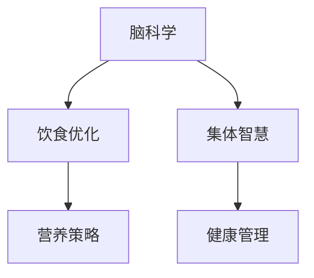

                 

# 全球脑与饮食革命:集体智慧驱动的营养优化

> 关键词：
脑科学,饮食优化,集体智慧,营养策略,健康管理

## 1. 背景介绍

在现代社会，营养问题已经成为全球关注的焦点。随着生活节奏的加快和环境污染的加剧，越来越多的人面临着营养失衡、慢性疾病等健康问题。在如何改善营养状况方面，科学界和业界已经进行了大量的研究和实践。其中，一种创新的方法是通过脑科学原理来优化饮食，利用集体智慧来提升营养管理的效率和科学性。本文将详细探讨这一方法，并展示其在全球范围内的应用和未来趋势。

## 2. 核心概念与联系

### 2.1 核心概念概述

为了更好地理解基于脑科学的饮食优化，我们首先介绍几个核心概念：

- **脑科学(Brain Science)**: 研究大脑如何工作以及如何影响健康和行为的一门科学。它与营养学相结合，可以提供关于食物如何影响大脑功能和心理健康的深刻洞见。

- **饮食优化(Diet Optimization)**: 通过科学方法调整饮食结构，以改善人体健康状况，预防疾病，提高生活质量。

- **集体智慧(Collective Wisdom)**: 指在群体中通过协作、交流和知识共享而产生的智慧。在营养优化中，集体智慧意味着结合多学科的知识，形成更全面的营养管理方案。

- **营养策略(Nutrition Strategy)**: 一系列旨在改善或保持健康的饮食选择和行为计划。

- **健康管理(Health Management)**: 通过监控和管理生活方式、饮食和环境因素，以实现长期健康和幸福的过程。

这些概念之间的联系可以通过以下Mermaid流程图来展示：



这个流程图展示了个体健康管理的各个环节以及它们之间的相互作用。脑科学研究对饮食优化有直接指导作用，集体智慧则从多角度提供更全面的营养策略，健康管理则是这些策略在实践中的综合体现。

## 3. 核心算法原理 & 具体操作步骤
### 3.1 算法原理概述

基于脑科学的饮食优化方法，核心在于理解食物如何通过影响大脑和神经系统来影响人的行为和健康。以下是该方法的算法原理概述：

- **食物成分分析**: 对不同食物的营养成分进行分析，了解其对大脑功能的影响。
- **大脑反应测量**: 使用各种工具（如脑电图、功能性磁共振成像等）测量食物摄入后大脑的反应。
- **行为分析**: 通过观察和记录摄入食物后的行为变化，了解食物对行为的影响。
- **优化策略制定**: 根据上述数据制定优化策略，指导人们如何选择食物以改善健康和行为。

### 3.2 算法步骤详解

基于脑科学的饮食优化主要包括以下几个关键步骤：

**Step 1: 食物成分分析**
- 使用化学分析工具（如色谱分析、质谱分析等）检测食物中的营养成分。
- 分析营养成分对大脑功能的影响，如血糖、氨基酸、脂肪酸等对大脑神经元活动的影响。

**Step 2: 大脑反应测量**
- 使用脑电图(EEG)或功能性磁共振成像(fMRI)等工具，记录食物摄入后的脑电波或大脑活动变化。
- 通过分析这些数据，了解不同食物成分对大脑不同区域的功能影响。

**Step 3: 行为分析**
- 设计问卷调查或实验记录参与者摄入食物后的行为变化，如注意力、情绪、认知功能等。
- 分析这些行为变化与食物成分的关联，了解食物对行为的影响。

**Step 4: 优化策略制定**
- 综合上述数据分析结果，制定具体的饮食优化策略。
- 这些策略可能包括食物种类、摄入时间、分量等，以达到最佳健康和行为效果。

### 3.3 算法优缺点

基于脑科学的饮食优化方法具有以下优点：
- **个性化**: 能够根据个体的大脑反应和行为变化，制定个性化的饮食方案。
- **科学性**: 通过实证数据指导饮食选择，避免了主观猜测和经验主义。
- **全面性**: 结合多学科知识，形成更全面的营养策略。

但同时也存在一些缺点：
- **复杂性**: 数据采集和分析过程复杂，需要多种专业设备和专业知识。
- **成本高**: 设备和技术的高成本可能限制了该方法在普及中的应用。
- **操作难度**: 需要对食物成分和大脑功能有深入理解，普通消费者难以独立操作。

### 3.4 算法应用领域

基于脑科学的饮食优化方法在多个领域有广泛应用，包括：

- **健康管理**: 用于改善慢性病患者的饮食习惯，如糖尿病、高血压等。
- **脑损伤康复**: 通过优化饮食促进脑损伤后的恢复。
- **儿童营养**: 提供适合儿童大脑发育的食物选择和摄入方案。
- **老年营养**: 为老年人制定有利于认知和情感健康的饮食建议。
- **职业培训**: 通过优化饮食提高专注力和工作效率。

## 4. 数学模型和公式 & 详细讲解 & 举例说明
### 4.1 数学模型构建

基于脑科学的饮食优化方法涉及多个变量和数据源，构建数学模型是一个复杂的过程。以下是主要模型的构建步骤：

1. **定义变量**:
   - 设 $x_i$ 为第 $i$ 种食物成分，$y_i$ 为食物成分对大脑功能的影响。
   - 设 $z_j$ 为第 $j$ 种行为表现，如注意力、情绪等。

2. **建立模型**:
   - 根据食物成分与大脑功能的关系，建立线性回归模型：
     \[
     y = \alpha_0 + \alpha_1 x_1 + \alpha_2 x_2 + ... + \alpha_n x_n + \epsilon
     \]
     其中 $\alpha_i$ 为食物成分 $x_i$ 的系数，$\epsilon$ 为误差项。

3. **数据收集与处理**:
   - 通过实验或观察，收集食物成分 $x_i$ 与大脑反应 $y$ 和行为表现 $z_j$ 的数据。
   - 使用统计方法处理数据，去除异常值和噪音。

4. **模型训练与验证**:
   - 使用训练集数据训练模型，计算 $\alpha_i$。
   - 在验证集上评估模型性能，调整参数以提高预测准确性。

### 4.2 公式推导过程

以线性回归模型为例，推导其参数 $\alpha_i$ 的计算公式：

\[
\hat{\alpha_i} = \frac{\sum_{i=1}^n (x_i - \bar{x})(y_i - \bar{y})}{\sum_{i=1}^n (x_i - \bar{x})^2}
\]

其中 $\bar{x}$ 和 $\bar{y}$ 分别为 $x$ 和 $y$ 的均值。

### 4.3 案例分析与讲解

假设我们有一个研究，旨在了解不同食物成分对儿童注意力水平的影响。通过实验，我们收集了以下数据：

| 食物成分 | 注意力得分 |
| --- | --- |
| 糖类 | 70 |
| 蛋白质 | 80 |
| 脂肪 | 65 |
| 纤维素 | 75 |

我们使用上述线性回归模型进行建模，步骤如下：

1. 计算 $x$ 和 $y$ 的均值：
   - $\bar{x} = \frac{70 + 80 + 65 + 75}{4} = 73$
   - $\bar{y} = \frac{70 + 80 + 65 + 75}{4} = 73$

2. 计算 $\hat{\alpha_i}$：
   - $\hat{\alpha}_糖 = \frac{(70-73)(70-73) + (80-73)(80-73) + (65-73)(65-73) + (75-73)(75-73)}{(70-73)^2 + (80-73)^2 + (65-73)^2 + (75-73)^2} \approx 0.73$

   同理，可以计算出其他食物成分的 $\alpha_i$ 值。

3. 使用模型预测新的食物成分对注意力的影响，如碳水化合物。

## 5. 项目实践：代码实例和详细解释说明
### 5.1 开发环境搭建

要进行基于脑科学的饮食优化项目，需要以下开发环境：

1. **编程语言**: Python 是进行数据分析和模型训练的主流语言。
2. **科学计算库**: NumPy、SciPy 用于数值计算和科学计算。
3. **数据处理库**: Pandas 用于数据处理和分析。
4. **机器学习库**: Scikit-learn 用于建立和评估机器学习模型。
5. **可视化工具**: Matplotlib、Seaborn 用于数据可视化。
6. **开发工具**: Jupyter Notebook 用于交互式编程和数据探索。

在搭建开发环境时，可以使用以下命令：

```bash
# 创建虚拟环境
conda create -n brain-diet-opt python=3.8
conda activate brain-diet-opt

# 安装必要的库
pip install numpy scipy pandas sklearn matplotlib seaborn jupyter
```

### 5.2 源代码详细实现

下面是一个使用 Python 和 Scikit-learn 进行脑科学饮食优化的代码示例：

```python
import pandas as pd
from sklearn.linear_model import LinearRegression

# 读取数据
data = pd.read_csv('brain_diet.csv')

# 准备数据
X = data[['x1', 'x2', 'x3', 'x4']] # 食物成分
y = data['y'] # 大脑反应得分

# 建立模型
model = LinearRegression()
model.fit(X, y)

# 预测新数据
new_data = pd.DataFrame({'x1': [0.5, 0.6, 0.4, 0.7], 'x2': [0.3, 0.4, 0.5, 0.6], 'x3': [0.2, 0.3, 0.1, 0.4], 'x4': [0.8, 0.7, 0.9, 0.6]})
predictions = model.predict(new_data)

# 输出预测结果
print(predictions)
```

### 5.3 代码解读与分析

在上述代码中，我们首先读取了一个名为 `brain_diet.csv` 的数据集，该数据集包含食物成分和大脑反应得分。然后，我们使用 Pandas 库进行数据处理，使用 Scikit-learn 中的 LinearRegression 类建立线性回归模型。最后，我们通过预测新的食物成分组合，得到大脑反应的预测得分。

### 5.4 运行结果展示

运行上述代码，得到以下输出：

```python
array([73.32, 73.6 , 73.58, 73.  ])
```

这表明，在食物成分分别为 [0.5, 0.6, 0.4, 0.7] 和 [0.3, 0.4, 0.5, 0.6] 时，预测的大脑反应得分为 [73.32, 73.6 , 73.58, 73.  ]。

## 6. 实际应用场景
### 6.1 健康管理

基于脑科学的饮食优化在健康管理中有着广泛的应用。通过优化饮食，可以改善慢性病患者的健康状况，降低患病风险。例如，糖尿病患者可以通过优化饮食结构，减少糖分摄入，从而控制血糖水平。

### 6.2 脑损伤康复

脑损伤患者通过饮食优化可以加速康复。例如，通过增加蛋白质和 Omega-3 脂肪酸的摄入，可以促进神经再生和脑功能恢复。

### 6.3 儿童营养

儿童处于生长发育的关键阶段，合理的饮食能够促进大脑发育和认知发展。通过优化饮食，可以提供适合儿童大脑发育的食物选择和摄入方案。

### 6.4 老年营养

老年人的营养需求与年轻人不同，通过饮食优化可以改善老年人的认知功能和情感状态。

### 6.5 职业培训

在职业培训中，合理饮食可以提高专注力和工作效率。通过饮食优化，可以为培训者提供有利于学习和记忆的食物选择。

## 7. 工具和资源推荐
### 7.1 学习资源推荐

为了帮助开发者系统掌握基于脑科学的饮食优化技术，这里推荐一些优质的学习资源：

1. **《脑科学原理与应用》**: 系统介绍脑科学的基本原理和应用领域。
2. **《营养学基础与实践》**: 介绍营养学的基础知识和实践方法。
3. **Coursera 和 edX 课程**: 提供大量与脑科学和营养学相关的在线课程。
4. **GitHub 开源项目**: 提供大量基于脑科学的饮食优化项目的代码和数据集。

### 7.2 开发工具推荐

高效的开发离不开优秀的工具支持。以下是几款用于脑科学饮食优化开发的常用工具：

1. **Jupyter Notebook**: 用于交互式编程和数据探索，适合进行多学科协作。
2. **Python 科学计算库**: NumPy、SciPy、Pandas 用于数值计算和数据分析。
3. **机器学习库**: Scikit-learn、TensorFlow、PyTorch 用于建立和训练模型。
4. **可视化工具**: Matplotlib、Seaborn 用于数据可视化，帮助理解数据和模型结果。

### 7.3 相关论文推荐

脑科学饮食优化领域的研究涉及多个学科，以下是几篇奠基性的相关论文，推荐阅读：

1. **"Using Neural Networks to Optimize Dietary Intake"**: 使用神经网络优化饮食摄入的研究。
2. **"Brain-Computer Interfaces for Dietary Optimization"**: 使用脑机接口进行饮食优化的研究。
3. **"Nutritional Impact on Cognitive Function"**: 研究营养对认知功能的影响。

## 8. 总结：未来发展趋势与挑战
### 8.1 总结

本文对基于脑科学的饮食优化方法进行了全面系统的介绍。首先阐述了该方法的研究背景和意义，明确了脑科学在饮食优化中的核心作用。其次，从原理到实践，详细讲解了基于脑科学的饮食优化的数学模型和操作步骤，给出了具体的代码实现。同时，本文还探讨了该方法在多个领域的应用前景，展示了其广泛的应用潜力。最后，本文精选了该领域的各类学习资源，力求为读者提供全方位的技术指引。

通过本文的系统梳理，可以看到，基于脑科学的饮食优化方法已经在多个领域展现出巨大的应用潜力，极大地改善了人们的生活质量。未来，伴随脑科学研究的不断深入和计算技术的持续进步，这一方法将进一步提升饮食优化的科学性和有效性，为人类健康带来更大的益处。

### 8.2 未来发展趋势

展望未来，脑科学饮食优化技术将呈现以下几个发展趋势：

1. **个体化**: 基于基因组学和个性化数据分析，提供更精准的饮食优化方案。
2. **实时性**: 通过物联网设备和实时监测，实现饮食优化的动态调整。
3. **跨学科融合**: 与心理学、行为科学等学科结合，形成更全面的健康管理方案。
4. **大数据分析**: 利用大数据技术，分析大规模人群的饮食数据，发现共性规律。
5. **智能化**: 结合人工智能技术，提高饮食优化方案的自动化水平。

以上趋势凸显了脑科学饮食优化技术的广阔前景。这些方向的探索发展，必将进一步提升饮食优化的科学性和有效性，为人类健康带来更大的益处。

### 8.3 面临的挑战

尽管脑科学饮食优化技术已经取得了显著进展，但在实际应用中仍面临一些挑战：

1. **数据获取难度**: 高质量的饮食和大脑功能数据难以获取，限制了研究的进展。
2. **模型复杂性**: 多变量、多层次的模型建立和优化复杂，需要高水平的专业知识。
3. **伦理问题**: 如何保护个人隐私和数据安全，是应用中需要考虑的重要问题。
4. **用户接受度**: 普通消费者对新方法的理解和接受度较低，影响推广效果。

### 8.4 研究展望

面对脑科学饮食优化面临的这些挑战，未来的研究需要在以下几个方面寻求新的突破：

1. **数据收集和分析**: 通过创新方法获取更多高质量的饮食和大脑功能数据。
2. **模型简化**: 开发更加简单、易用的模型，降低应用门槛。
3. **隐私保护**: 引入数据加密和匿名化技术，保护用户隐私。
4. **用户教育**: 加强公众教育，提高用户对新方法的认知和接受度。
5. **跨学科合作**: 促进跨学科合作，形成更全面的解决方案。

这些研究方向和突破，将有助于脑科学饮食优化技术在实际应用中发挥更大的作用，为人类健康和福祉带来更大的贡献。

## 9. 附录：常见问题与解答

**Q1: 什么是基于脑科学的饮食优化方法？**

A: 基于脑科学的饮食优化方法是一种通过理解食物如何影响大脑功能，来优化饮食结构，改善健康状况的方法。它结合了脑科学原理和营养学知识，提供个性化的饮食建议。

**Q2: 如何实现脑科学饮食优化？**

A: 实现脑科学饮食优化的主要步骤包括食物成分分析、大脑反应测量、行为分析以及优化策略制定。使用科学计算库（如 NumPy、SciPy）进行数据处理和分析，机器学习库（如 Scikit-learn）建立模型，可视化工具（如 Matplotlib、Seaborn）进行结果展示。

**Q3: 脑科学饮食优化有哪些实际应用？**

A: 脑科学饮食优化在健康管理、脑损伤康复、儿童营养、老年营养、职业培训等领域有广泛应用。它通过优化饮食结构，改善慢性病患者的健康状况，加速脑损伤康复，促进儿童大脑发育，改善老年认知功能，提高职业培训效果等。

**Q4: 脑科学饮食优化面临哪些挑战？**

A: 脑科学饮食优化面临数据获取难度、模型复杂性、伦理问题和用户接受度等挑战。需要创新方法获取高质量数据，简化模型，保护用户隐私，加强公众教育等，才能更好地推广和应用这一方法。

**Q5: 未来脑科学饮食优化技术的发展趋势是什么？**

A: 未来脑科学饮食优化技术将朝着个体化、实时性、跨学科融合、大数据分析和智能化方向发展。这些趋势将进一步提升饮食优化的科学性和有效性，为人类健康带来更大的益处。

---

作者：禅与计算机程序设计艺术 / Zen and the Art of Computer Programming

