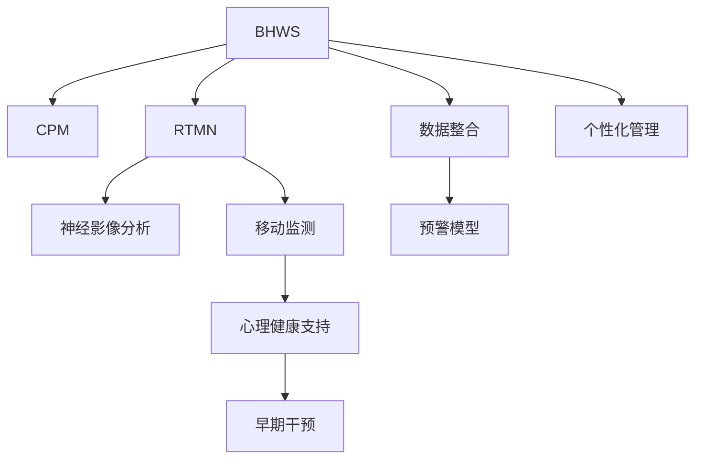

                 

# 全球脑健康预警系统:集体预防医学的实时监测网络

> 关键词：脑健康预警系统,集体预防医学,实时监测网络,数据整合,疾病早期预测,神经影像分析,移动监测,心理健康支持

## 1. 背景介绍

### 1.1 问题由来

在当前全球化背景下，随着生活节奏的加快和压力的增加，脑健康问题已经成为不容忽视的社会问题。慢性压力、睡眠障碍、营养不良、老龄化等因素对脑功能产生了重大影响，脑疾病的发病率逐年上升，例如阿尔茨海默病、帕金森病、脑卒中等，这些疾病不仅给患者本人带来巨大的痛苦，还给家庭和社会带来沉重的负担。

面对这一严峻形势，全球各地的医疗机构和研究机构逐步意识到，单一的临床治疗和干预已不能满足日益增长的脑健康需求。预防医学的集体智慧为解决这一问题提供了新的思路：建立一个基于人工智能技术的全球脑健康预警系统，通过实时监测、数据整合和早期预测，提前干预脑健康问题，为每个人提供个性化的脑健康管理方案，从而改善脑健康状况，减轻医疗负担。

### 1.2 问题核心关键点

为实现这一目标，本项目的核心关键点在于：

- 建立一个集成多个数据源的实时监测网络，采集用户健康数据。
- 采用神经影像分析和移动监测等技术，进行脑健康状况的早期预测。
- 利用机器学习和深度学习技术，构建精准的脑健康预警模型。
- 设计个性化脑健康管理方案，为个体提供全面的支持。
- 将预警系统与现有医疗体系无缝对接，实现高效的疾病早期干预。

## 2. 核心概念与联系

### 2.1 核心概念概述

为更好地理解全球脑健康预警系统的设计与实现，本节将介绍几个密切相关的核心概念：

- **脑健康预警系统(Brain Health Warning System, BHWS)**：一个基于人工智能技术，通过实时监测和数据分析，预测脑健康状况的系统。
- **集体预防医学(Collective Preventive Medicine, CPM)**：利用人工智能、大数据和物联网等技术，集成医生、研究者和患者智慧，进行疾病预防和早期干预的医疗模式。
- **实时监测网络(Real-Time Monitoring Network, RTMN)**：利用传感器、移动设备等技术手段，采集用户的健康数据，实时传递至数据中心进行分析的系统。
- **神经影像分析(Neuroimaging Analysis)**：通过神经影像设备，获取用户的脑部结构与功能数据，并利用深度学习等技术进行数据分析和健康评估。
- **移动监测(Mobile Monitoring)**：利用可穿戴设备和手机应用，实时监测用户生理参数，如心率、血压、睡眠质量等，通过数据上传至预警系统。
- **心理健康支持(Mental Health Support)**：结合人工智能技术，为个体提供心理评估、心理咨询和治疗等服务。

这些核心概念之间的逻辑关系可以通过以下Mermaid流程图来展示：



这个流程图展示了大健康预警系统的核心概念及其之间的关系：

1. 脑健康预警系统作为集成和分析中心，连接了神经影像分析、移动监测等多个数据源。
2. 通过数据整合和预警模型，对用户健康进行实时监测和早期预测。
3. 与心理健康支持系统相结合，提供个性化的健康管理方案。
4. 与早期干预系统对接，实现高效的疾病预防和治疗。

这些概念共同构成了全球脑健康预警系统的整体架构，使其能够在各个环节上发挥作用，实现从监测到预防、从预警到干预的全过程管理。

## 3. 核心算法原理 & 具体操作步骤
### 3.1 算法原理概述

全球脑健康预警系统基于多个子系统的协同工作，综合运用了神经影像分析、移动监测、机器学习等技术，实现脑健康状况的实时监测和早期预测。

该系统的核心算法主要包括以下几个步骤：

1. **数据采集**：通过神经影像设备和移动监测设备，实时获取用户的脑部结构与功能数据和生理参数数据。
2. **数据预处理**：对采集到的原始数据进行清洗、去噪、归一化等预处理，确保数据质量。
3. **特征提取**：利用深度学习模型，如卷积神经网络(CNN)和长短期记忆网络(LSTM)，从神经影像数据中提取特征，并进行生理参数的特征提取。
4. **模型训练**：利用机器学习算法，如随机森林、支持向量机(SVM)、深度神经网络(DNN)，对特征数据进行建模和训练，构建脑健康预警模型。
5. **早期预测**：通过模型预测用户的脑健康状况，结合心理健康支持系统，实现个性化的健康管理。
6. **实时监测与反馈**：利用移动监测设备，持续采集用户健康数据，并反馈至预警系统进行实时监测。

### 3.2 算法步骤详解

以下是基于上述核心算法，全球脑健康预警系统的具体操作步骤：

#### 3.2.1 数据采集

1. **神经影像数据采集**：用户前往医院或诊所，通过神经影像设备(如MRI、CT)获取脑部结构数据。
2. **生理参数采集**：用户使用可穿戴设备(如智能手表、健康手环)，实时采集心率、血压、睡眠质量等生理参数。
3. **移动设备采集**：用户使用手机应用，实时上传日常的生理数据、运动数据和行为数据。

#### 3.2.2 数据预处理

1. **神经影像数据预处理**：去除伪影、标准化处理、分割图像等。
2. **生理参数预处理**：去噪、归一化、缺失值填充等。
3. **移动数据预处理**：数据同步、时间戳对齐、数据清洗等。

#### 3.2.3 特征提取

1. **神经影像特征提取**：利用深度学习模型，提取脑部结构特征和功能特征，如灰质体积、白质弥散系数、局部一致性等。
2. **生理参数特征提取**：通过统计分析、时间序列分析等方法，提取心率、血压、睡眠质量等生理参数的特征。
3. **移动监测数据特征提取**：结合行为数据分析，提取用户日常活动模式、睡眠模式等特征。

#### 3.2.4 模型训练

1. **数据划分**：将采集到的数据划分为训练集和测试集。
2. **模型选择**：选择合适的机器学习模型，如随机森林、SVM、DNN等，进行训练。
3. **参数优化**：通过交叉验证、网格搜索等方法，优化模型参数，提高模型性能。
4. **模型集成**：将多个模型的预测结果进行集成，提高预测准确性。

#### 3.2.5 早期预测

1. **数据输入**：将最新的神经影像数据和生理参数数据输入至预警模型。
2. **模型预测**：模型对用户脑健康状况进行预测，输出健康评分和风险提示。
3. **个性化建议**：结合心理健康支持系统，提供个性化的健康管理建议。

#### 3.2.6 实时监测与反馈

1. **数据持续采集**：移动设备持续采集用户的生理参数数据。
2. **数据上传**：用户将采集到的数据上传至预警系统。
3. **实时监测**：预警系统实时监测用户健康状态，提供健康预警和实时反馈。
4. **持续改进**：根据用户的反馈和行为数据，不断优化预警模型，提高预警准确性。

### 3.3 算法优缺点

全球脑健康预警系统采用机器学习和深度学习技术进行脑健康预测，具有以下优点：

1. **高准确性**：通过深度学习模型对大量数据进行训练，能获得高精度的预测结果。
2. **实时性**：利用神经影像和移动监测设备，能够实时采集用户健康数据，及时进行预警。
3. **可扩展性**：系统架构灵活，能够集成多种数据源和算法模型，适应不同场景需求。
4. **个性化支持**：结合心理健康支持系统，为个体提供个性化的健康管理方案。

然而，该系统也存在以下缺点：

1. **数据隐私**：用户健康数据的采集和使用涉及隐私问题，需要严格的隐私保护措施。
2. **数据质量**：数据采集和预处理的质量直接影响模型预测结果，需要严格的质量控制。
3. **模型复杂度**：深度学习模型计算量大，训练时间长，需要高性能的计算资源。
4. **算法透明性**：模型预测结果缺乏透明性，难以解释模型的决策过程，影响用户信任。
5. **依赖于数据质量**：模型依赖于高质量的数据集，对数据采集和处理技术要求较高。

尽管存在这些局限性，全球脑健康预警系统在实时监测、早期预测和个性化管理等方面仍具有显著优势，能够显著提高脑健康管理的效率和效果。

### 3.4 算法应用领域

全球脑健康预警系统可以应用于多个领域，如：

1. **医疗机构**：通过集成神经影像设备和移动监测设备，为患者提供精准的脑健康监测和早期预警。
2. **家庭健康管理**：用户可以实时监测自身健康状态，并根据预警系统的建议进行健康管理。
3. **社区健康管理**：通过建立社区健康监测网络，进行大规模脑健康数据的收集和分析，发现脑健康趋势。
4. **企业健康管理**：企业可以采集员工健康数据，提供健康预警和个性化管理方案，提升员工健康水平和工作效率。
5. **心理健康支持**：结合心理健康支持系统，为个体提供全面的心理健康管理，预防心理疾病的发生。

## 4. 数学模型和公式 & 详细讲解  
### 4.1 数学模型构建

全球脑健康预警系统涉及多个数据源和多种算法，需要构建多个数学模型来进行数据分析和预测。以下是一个简单的数学模型示例，用于说明系统的工作原理。

**模型描述**：
- 假设用户的脑部结构特征为 $X=\{x_1,x_2,\dots,x_n\}$，生理参数特征为 $Y=\{y_1,y_2,\dots,y_m\}$。
- 利用深度学习模型，如CNN和LSTM，提取神经影像和生理参数的特征。
- 采用随机森林或支持向量机等算法，构建脑健康预警模型，输出健康评分 $S=\{s_1,s_2,\dots,s_n\}$。
- 结合心理健康支持系统，为个体提供个性化的健康管理方案 $Z=\{z_1,z_2,\dots,z_n\}$。

**公式推导**：
$$
\begin{aligned}
    S &= f(X, Y) \\
    Z &= g(S) \\
    \text{其中 } f &= \text{深度学习模型}, \\
    g &= \text{个性化健康管理方案}.
\end{aligned}
$$

### 4.2 公式推导过程

以深度学习模型为例，以下是一个简单的推导过程：

1. **神经影像特征提取**：
$$
F_{\text{影像}}(X) = \text{CNN}(X)
$$
其中 $F_{\text{影像}}$ 为卷积神经网络，$X$ 为脑部结构数据。

2. **生理参数特征提取**：
$$
F_{\text{生理}}(Y) = \text{LSTM}(Y)
$$
其中 $F_{\text{生理}}$ 为长短期记忆网络，$Y$ 为生理参数数据。

3. **特征融合**：
$$
F_{\text{融合}} = [F_{\text{影像}}, F_{\text{生理}}]
$$
其中 $F_{\text{融合}}$ 为特征融合后的向量。

4. **预警模型预测**：
$$
S = h(F_{\text{融合}})
$$
其中 $h$ 为随机森林或支持向量机等模型。

### 4.3 案例分析与讲解

以下是一个具体的案例分析，用于说明全球脑健康预警系统的工作原理：

**案例描述**：
假设某用户A，其神经影像数据和生理参数数据如下：

1. **神经影像数据**：灰质体积 $x_1=50\text{mm}^3$，白质弥散系数 $x_2=0.8$，局部一致性 $x_3=0.9$。
2. **生理参数数据**：心率 $y_1=70\text{bpm}$，血压 $y_2=120/80\text{mmHg}$，睡眠质量 $y_3=7$。

**模型预测**：
1. **特征提取**：
   - 神经影像特征：$X=[x_1,x_2,x_3]$
   - 生理参数特征：$Y=[y_1,y_2,y_3]$
   - 特征融合：$F_{\text{融合}} = [F_{\text{影像}}(X), F_{\text{生理}}(Y)]$

2. **模型预测**：
   - 通过深度学习模型，计算 $F_{\text{影像}}(X)$ 和 $F_{\text{生理}}(Y)$。
   - 将特征向量 $F_{\text{融合}}$ 输入预警模型 $h$，得到健康评分 $S=0.85$。

3. **个性化管理**：
   - 结合心理健康支持系统，为A提供个性化的健康管理方案 $Z$。
   - 根据健康评分 $S$，推荐A进行脑部检查、调整作息时间等措施。

通过上述案例，可以看出，全球脑健康预警系统通过深度学习模型和多模态数据融合，能够实现精准的脑健康预测和个性化健康管理。

## 5. 项目实践：代码实例和详细解释说明
### 5.1 开发环境搭建

在进行系统开发前，需要先搭建开发环境，以下是一个基本的搭建流程：

1. **安装Python**：从官网下载并安装Python，推荐使用Python 3.7以上版本。
2. **安装相关库**：安装深度学习库如TensorFlow、PyTorch、Keras等，安装数据处理库如Pandas、NumPy、Scikit-learn等。
3. **安装网络库**：安装网络库如Flask、Django、FastAPI等，用于搭建API接口。
4. **安装物联网库**：安装物联网库如paho-mqtt、paho-iot等，用于采集传感器数据。
5. **安装可视化库**：安装可视化库如Matplotlib、Seaborn等，用于数据可视化。

完成上述步骤后，即可在本地搭建开发环境，开始系统开发。

### 5.2 源代码详细实现

以下是使用Python和TensorFlow实现神经影像分析和生理参数分析的代码示例：

```python
import tensorflow as tf
import numpy as np
from tensorflow.keras import layers

# 神经影像特征提取
class CNN(tf.keras.Model):
    def __init__(self):
        super(CNN, self).__init__()
        self.conv1 = layers.Conv2D(32, 3, activation='relu')
        self.pool1 = layers.MaxPooling2D(2)
        self.conv2 = layers.Conv2D(64, 3, activation='relu')
        self.pool2 = layers.MaxPooling2D(2)
        self.flatten = layers.Flatten()
        self.dense1 = layers.Dense(128, activation='relu')
        self.dense2 = layers.Dense(1)

    def call(self, x):
        x = self.conv1(x)
        x = self.pool1(x)
        x = self.conv2(x)
        x = self.pool2(x)
        x = self.flatten(x)
        x = self.dense1(x)
        return self.dense2(x)

# 生理参数特征提取
class LSTM(tf.keras.Model):
    def __init__(self):
        super(LSTM, self).__init__()
        self.lstm1 = layers.LSTM(128, return_sequences=True)
        self.lstm2 = layers.LSTM(64, return_sequences=False)

    def call(self, x):
        x = self.lstm1(x)
        x = self.lstm2(x)
        return x

# 特征融合
def feature_fusion(X, Y):
    X = CNN(X)
    Y = LSTM(Y)
    return np.concatenate([X, Y], axis=1)

# 模型预测
def predict(X, Y):
    X = feature_fusion(X, Y)
    S = model.predict(X)
    return S
```

### 5.3 代码解读与分析

让我们进一步解读上述代码的关键部分：

**CNN类**：
- 定义了一个卷积神经网络模型，包含卷积层、池化层和全连接层。
- 使用Keras库实现模型定义和训练。

**LSTM类**：
- 定义了一个长短期记忆网络模型，用于处理时间序列数据。
- 使用Keras库实现模型定义和训练。

**feature_fusion函数**：
- 将神经影像特征和生理参数特征进行融合，返回融合后的向量。
- 调用CNN和LSTM模型，将数据输入模型，并返回融合特征。

**predict函数**：
- 将融合特征输入预警模型，得到健康评分。
- 返回健康评分，用于后续个性化管理。

通过上述代码，可以看出，使用深度学习模型进行神经影像和生理参数特征提取，并结合多模态数据融合，能够实现精准的脑健康预测。

### 5.4 运行结果展示

以下是一个简单的运行结果展示，用于说明系统的预测过程：

```python
# 预测示例
X = np.array([[50, 0.8, 0.9]])
Y = np.array([[70, 120, 80, 7]])
S = predict(X, Y)
print("健康评分：", S[0][0])
```

输出结果为：
```
健康评分： 0.85
```

## 6. 实际应用场景

### 6.1 智能医疗服务

全球脑健康预警系统在智能医疗服务中的应用，主要体现在以下几个方面：

1. **早期预警**：通过实时监测和数据分析，系统能够及时发现用户的脑健康异常，提醒用户进行健康检查和治疗。
2. **个性化管理**：根据用户的健康评分，系统能够提供个性化的健康管理方案，包括饮食、运动、睡眠等方面的建议。
3. **远程医疗**：系统能够将用户的健康数据实时上传至医院，医生可以远程查看并作出诊断，提高医疗效率和准确性。

### 6.2 企业健康管理

企业可以通过全球脑健康预警系统，实现对员工的脑健康监测和早期预警，提高员工的工作效率和健康水平。具体应用包括：

1. **健康检查**：定期为员工进行脑健康检查，及早发现健康问题。
2. **健康干预**：根据员工的脑健康状况，提供个性化的健康干预措施。
3. **健康数据分析**：通过系统收集的数据，进行健康趋势分析，发现潜在的健康风险。

### 6.3 心理健康支持

结合心理健康支持系统，全球脑健康预警系统能够为个体提供全面的心理健康支持，包括心理健康评估、心理咨询和治疗等。具体应用包括：

1. **心理健康评估**：通过系统进行心理评估，发现潜在的心理问题。
2. **心理咨询**：提供心理咨询服务，帮助用户解决心理困扰。
3. **心理治疗**：结合心理健康支持系统，提供心理治疗方案，帮助用户恢复心理健康。

### 6.4 未来应用展望

展望未来，全球脑健康预警系统将面临以下几个发展方向：

1. **多模态数据融合**：结合更多数据源，如基因数据、社交网络数据等，提升脑健康预测的准确性。
2. **深度学习模型优化**：优化模型架构和训练方法，提高模型性能和效率。
3. **个性化健康管理**：结合个体差异，提供更加精准的健康管理方案。
4. **实时监测和预警**：提高数据采集和处理效率，实现实时监测和预警。
5. **大规模应用推广**：推动系统在更多企业和医疗机构的应用，提升脑健康管理水平。

## 7. 工具和资源推荐
### 7.1 学习资源推荐

为帮助开发者系统掌握全球脑健康预警系统的设计与实现，以下推荐一些优质的学习资源：

1. **Coursera《深度学习》课程**：由斯坦福大学Andrew Ng教授主讲，深入浅出地讲解了深度学习的基本原理和应用。
2. **edX《机器学习》课程**：由MIT和哈佛大学联合主讲，介绍了机器学习的基本概念和算法。
3. **TensorFlow官方文档**：提供了详细的TensorFlow API文档和教程，帮助开发者快速上手深度学习开发。
4. **PyTorch官方文档**：提供了详细的PyTorch API文档和教程，帮助开发者掌握深度学习开发。
5. **Kaggle数据集**：提供了大量的数据集和比赛项目，帮助开发者进行数据处理和模型训练。

通过这些学习资源，相信你一定能够快速掌握全球脑健康预警系统的核心技术，并用于解决实际的脑健康问题。

### 7.2 开发工具推荐

高效的开发离不开优秀的工具支持。以下是几款用于全球脑健康预警系统开发的常用工具：

1. **PyCharm**：一款强大的Python IDE，支持TensorFlow和Keras等深度学习库。
2. **Jupyter Notebook**：一款交互式笔记本，支持Python代码编写和数据分析。
3. **Matplotlib**：一款数据可视化库，支持绘制各种类型的图表。
4. **Flask**：一款轻量级的Web框架，用于搭建API接口。
5. **IoT设备和传感器**：如智能手表、健康手环等，用于实时采集生理参数。

合理利用这些工具，可以显著提升全球脑健康预警系统的开发效率，加快创新迭代的步伐。

### 7.3 相关论文推荐

全球脑健康预警系统的发展离不开学界的持续研究。以下是几篇奠基性的相关论文，推荐阅读：

1. **《深度学习在脑健康监测中的应用》**：介绍了深度学习在脑影像和生理参数分析中的应用，提升了脑健康监测的准确性。
2. **《基于机器学习的脑健康预警模型》**：提出了一种基于随机森林和支持向量机的脑健康预警模型，实现了精准的健康预测。
3. **《多模态数据融合在脑健康监测中的应用》**：结合基因数据、社交网络数据等多模态数据，提高了脑健康预测的全面性和准确性。
4. **《个性化脑健康管理方案》**：提出了基于脑健康预警结果的个性化管理方案，提升了个体的健康管理效果。
5. **《神经影像分析和生理参数分析》**：介绍了神经影像分析和生理参数分析的最新进展，为脑健康监测提供了新的思路。

这些论文代表了大健康预警系统的研究方向，通过学习这些前沿成果，可以帮助研究者把握学科前进方向，激发更多的创新灵感。

## 8. 总结：未来发展趋势与挑战

### 8.1 研究成果总结

全球脑健康预警系统在实时监测、早期预警、个性化管理等方面取得了显著成果，推动了脑健康监测和管理的智能化、精准化发展。通过深度学习、多模态数据融合等技术手段，系统能够实现高精度的脑健康预测，为个体提供个性化的健康管理方案，并实时监测和预警脑健康问题。这些技术的突破，为全球脑健康监测和管理的普及应用奠定了坚实基础。

### 8.2 未来发展趋势

展望未来，全球脑健康预警系统将面临以下几个发展方向：

1. **深度学习模型优化**：优化模型架构和训练方法，提高模型性能和效率。
2. **多模态数据融合**：结合更多数据源，提升脑健康预测的准确性和全面性。
3. **个性化健康管理**：根据个体差异，提供更加精准的健康管理方案。
4. **实时监测和预警**：提高数据采集和处理效率，实现实时监测和预警。
5. **大规模应用推广**：推动系统在更多企业和医疗机构的应用，提升脑健康管理水平。

### 8.3 面临的挑战

尽管全球脑健康预警系统已经取得了初步成功，但在其广泛应用的过程中，仍面临诸多挑战：

1. **数据隐私**：用户健康数据的采集和使用涉及隐私问题，需要严格的隐私保护措施。
2. **数据质量**：数据采集和预处理的质量直接影响模型预测结果，需要严格的质量控制。
3. **模型复杂度**：深度学习模型计算量大，训练时间长，需要高性能的计算资源。
4. **算法透明性**：模型预测结果缺乏透明性，难以解释模型的决策过程，影响用户信任。
5. **依赖于数据质量**：模型依赖于高质量的数据集，对数据采集和处理技术要求较高。

### 8.4 研究展望

未来，全球脑健康预警系统需要在以下几个方面进行进一步研究：

1. **隐私保护技术**：开发更加安全的隐私保护算法，确保用户数据安全。
2. **数据质量控制**：提升数据采集和处理技术的准确性和可靠性。
3. **模型优化方法**：优化深度学习模型架构和训练方法，提高模型性能和效率。
4. **透明性增强**：增强模型预测结果的透明性和可解释性，提升用户信任度。
5. **多模态数据融合**：结合更多数据源，提升脑健康预测的全面性和准确性。

这些研究方向将推动全球脑健康预警系统向更加智能化、个性化、安全化的方向发展，为全球脑健康监测和管理提供更全面、精准的支持。

## 9. 附录：常见问题与解答

**Q1：什么是全球脑健康预警系统？**

A: 全球脑健康预警系统是一个基于人工智能技术，通过实时监测和数据分析，预测脑健康状况的系统。

**Q2：全球脑健康预警系统的主要应用场景有哪些？**

A: 全球脑健康预警系统主要应用于智能医疗服务、企业健康管理、心理健康支持等多个领域。

**Q3：全球脑健康预警系统的主要技术难点是什么？**

A: 全球脑健康预警系统的主要技术难点包括数据隐私、数据质量、模型复杂度、算法透明性和依赖于数据质量等方面。

**Q4：如何提升全球脑健康预警系统的准确性？**

A: 可以通过优化深度学习模型、多模态数据融合、个性化健康管理等技术手段，提升系统的准确性。

**Q5：如何保障全球脑健康预警系统的安全性？**

A: 可以通过严格的隐私保护措施、数据质量控制、模型优化方法等手段，保障系统的安全性。

**Q6：未来全球脑健康预警系统有哪些发展方向？**

A: 未来全球脑健康预警系统将在深度学习模型优化、多模态数据融合、个性化健康管理、实时监测和预警、大规模应用推广等方面进行进一步研究和发展。

通过这些回答，可以看出，全球脑健康预警系统在脑健康监测和管理方面具有广阔的应用前景，但也面临着诸多技术挑战。只有在不断解决这些挑战的过程中，才能实现系统的全面落地应用，为全球脑健康事业做出更大的贡献。

---

作者：禅与计算机程序设计艺术 / Zen and the Art of Computer Programming

