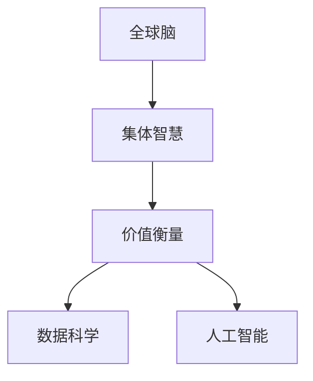

                 

# 全球脑创新评估体系:集体智慧项目的价值衡量

> 关键词：全球脑创新评估体系,集体智慧项目,价值衡量,数据科学,人工智能

## 1. 背景介绍

### 1.1 问题由来
在全球化浪潮的推动下，人类社会的协作模式正在发生深刻变革。各个国家和地区之间，企业之间、组织之间乃至个人之间，通过信息共享、知识交流与协同创新，形成了一个庞大而复杂的“全球脑”网络。在这个网络中，集体智慧的火花不断被点燃，创新成果层出不穷。然而，如何评估这些集体智慧项目的价值，尤其是如何在保证高质量和高效益的前提下，进行资源的最优配置，成为了当前一个亟待解决的问题。

### 1.2 问题核心关键点
要回答这个问题，我们需要找到一种合理的、公平的、可持续的价值衡量体系。这一体系不仅需要考虑经济收益，还要综合评估社会影响、环境效益、技术创新等多个维度。通过对这些因素的全面衡量，我们可以更准确地识别和提升具有高价值的项目，从而实现全球脑的可持续发展。

### 1.3 问题研究意义
构建全球脑创新评估体系，具有以下几方面的重要意义：

1. **提升资源配置效率**：通过对集体智慧项目的价值进行科学评估，可以更好地引导资源向最有潜力的项目倾斜，避免资源浪费。
2. **促进创新活力**：明确了衡量标准，可以激励更多的创新者和组织投入高价值的项目，提升整体创新活力。
3. **推动全球协作**：通过统一的价值评估框架，各国可以更好地进行沟通和合作，共同推进全球脑的建设和维护。
4. **支持政策制定**：为政府和企业提供数据支持和决策依据，帮助它们制定更科学、有效的创新政策。
5. **推动可持续发展**：综合考虑环境、社会和经济效益，促进全球脑的可持续发展。

## 2. 核心概念与联系

### 2.1 核心概念概述

为更好地理解全球脑创新评估体系的核心思想，本节将介绍几个关键概念：

- **全球脑**：指全球范围内的人类协作网络，通过信息共享和知识交流实现协同创新，形成集体智慧。
- **集体智慧**：指众多个体或组织共同创造的知识、技术和解决方案。
- **价值衡量**：指通过一系列指标和标准，对集体智慧项目的贡献进行量化评估。
- **数据科学**：指通过数据驱动的方法，从大量数据中提取有用的信息和知识。
- **人工智能**：指通过机器学习、深度学习等技术，实现自动化、智能化的决策支持。

这些概念之间的关系可以通过以下Mermaid流程图来展示：



这个流程图展示了各个概念之间的逻辑联系：

1. 全球脑通过信息共享和知识交流，产生集体智慧。
2. 通过价值衡量体系，对集体智慧项目的贡献进行量化评估。
3. 数据科学和人工智能是实现价值衡量体系的重要手段。

这些概念共同构成了全球脑创新评估体系的逻辑框架，为我们深入理解其运作提供了基础。

## 3. 核心算法原理 & 具体操作步骤
### 3.1 算法原理概述

全球脑创新评估体系的本质是一种综合性的价值衡量方法，它通过一系列指标和标准，对集体智慧项目的经济、社会、环境、技术等多个维度进行全面评估。其核心算法原理可以归纳为以下几个步骤：

1. **数据收集与预处理**：收集与集体智慧项目相关的各种数据，包括经济指标、社会影响、环境效益、技术创新等。通过数据清洗和预处理，确保数据的质量和完整性。
2. **指标体系构建**：根据项目特点和评估目标，构建多维度的指标体系。每个指标可以分解为多个子指标，用于细粒度的评估。
3. **模型训练与评估**：利用数据科学和人工智能技术，训练综合评估模型，对各个指标进行加权计算，得出项目总体的价值评分。
4. **结果反馈与迭代优化**：根据评估结果，对指标体系和权重进行调整，持续优化评估模型，提高其准确性和公正性。

### 3.2 算法步骤详解

下面是全球脑创新评估体系的具体操作步骤：

**Step 1: 数据收集与预处理**
- **指标设计**：根据全球脑创新项目的特点，设计合理的评估指标体系。例如，经济指标包括项目投资、收益、回报率等；社会指标包括就业、教育、健康等；环境指标包括碳排放、资源消耗等；技术指标包括创新性、专利申请等。
- **数据来源**：从政府部门、学术机构、企业、非政府组织等多种渠道收集数据。数据类型包括定量数据（如GDP、人口数量等）和定性数据（如项目描述、社会评价等）。
- **数据清洗与预处理**：去除重复、噪声数据，进行缺失值处理和异常值检测，确保数据的质量和一致性。

**Step 2: 指标体系构建**
- **指标分解**：将每个评估指标分解为更细粒度的子指标。例如，社会影响可以分解为就业人数、教育水平、健康状况等。
- **权重设定**：根据项目特点和评估目标，对各个指标赋予不同的权重。例如，对具有高社会价值的项目，社会指标的权重可以更高。
- **标准化处理**：对不同指标的数据进行标准化处理，使其具有可比性。例如，将各指标数据转化为Z-score标准化。

**Step 3: 模型训练与评估**
- **数据集划分**：将收集到的数据划分为训练集和测试集。通常采用70-30的比例。
- **模型选择**：选择适合综合评估的机器学习模型，如回归模型、分类模型、聚类模型等。例如，线性回归模型用于经济指标的评估。
- **训练与评估**：利用训练集训练模型，通过测试集评估模型性能。例如，使用交叉验证技术，对模型的泛化能力进行评估。
- **结果输出**：根据训练好的模型，对新项目进行评估，输出价值评分。

**Step 4: 结果反馈与迭代优化**
- **结果分析**：对评估结果进行分析，识别出模型存在的偏置、误差等问题。例如，发现对某些项目的评估值过低或过高。
- **参数调整**：根据结果分析，调整模型参数和权重。例如，增加社会指标的权重，提高对社会价值项目的评估准确度。
- **模型迭代**：持续对模型进行迭代优化，提高其预测能力和公平性。例如，引入更多高质量的数据，优化数据特征工程。

### 3.3 算法优缺点

全球脑创新评估体系具有以下优点：

1. **全面性**：综合考虑经济、社会、环境、技术等多个维度，提供全面的价值评估。
2. **可扩展性**：根据项目特点和评估目标，灵活调整指标体系和权重，适用于多种类型的集体智慧项目。
3. **数据驱动**：通过数据科学和人工智能技术，实现自动化、智能化的评估过程，提高评估效率和准确性。
4. **透明性**：通过指标体系和权重设定，实现评估过程的透明化，便于公众监督和理解。

然而，该体系也存在以下局限性：

1. **复杂性**：指标体系复杂，涉及多个维度，评估过程繁琐，难以快速做出决策。
2. **数据质量依赖**：评估结果高度依赖于数据的准确性和完整性，数据获取和处理难度大。
3. **技术门槛高**：需要较高的数据科学和人工智能技术水平，普通用户难以操作。
4. **主观性**：指标权重和参数调整具有主观性，可能受到个人偏见和利益冲突的影响。

### 3.4 算法应用领域

全球脑创新评估体系具有广泛的应用场景，主要包括以下几个领域：

1. **政府政策制定**：通过评估创新项目，支持政府制定更科学、有效的创新政策，促进经济社会发展。
2. **企业战略规划**：帮助企业识别高价值的创新机会，优化资源配置，提升竞争力。
3. **非政府组织（NGO）项目管理**：评估NGO项目的社会影响，提高资源使用效率，增强透明度和公信力。
4. **学术研究评估**：评估学术研究的创新性和影响力，促进跨学科合作和学术交流。
5. **国际合作项目**：通过统一的价值评估框架，各国可以更好地进行沟通和合作，提升全球脑的协同效应。

## 4. 数学模型和公式 & 详细讲解  
### 4.1 数学模型构建

本节将使用数学语言对全球脑创新评估体系进行更加严格的刻画。

记集体智慧项目为 $P$，其价值为 $V(P)$。价值评估体系为 $E(V)$，包括多个维度 $D_1, D_2, ..., D_n$。每个维度 $D_i$ 包含多个子指标 $F_{ij}$。权重向量为 $\alpha = (\alpha_1, \alpha_2, ..., \alpha_n)$，其中 $\alpha_i > 0$。

则价值评估模型为：

$$
V(P) = \sum_{i=1}^n \alpha_i \cdot \sum_{j=1}^{m_i} \beta_{ij} \cdot \delta(F_{ij}(P))
$$

其中 $\delta(F_{ij}(P))$ 为子指标 $F_{ij}(P)$ 的标准化值。

### 4.2 公式推导过程

以下我们以线性回归模型为例，推导价值评估模型的具体计算公式。

设价值评估体系为线性回归模型：

$$
V(P) = \alpha_1 \cdot \delta(F_{11}(P)) + \alpha_2 \cdot \delta(F_{12}(P)) + ... + \alpha_n \cdot \delta(F_{1n}(P)) + \epsilon
$$

其中 $\epsilon$ 为误差项，服从均值为0的正态分布 $N(0,\sigma^2)$。

将各子指标的标准化值代入上式，得：

$$
V(P) = \alpha_1 \cdot \delta_1(P) + \alpha_2 \cdot \delta_2(P) + ... + \alpha_n \cdot \delta_n(P) + \epsilon
$$

将上式转化为矩阵形式：

$$
V(P) = \alpha \cdot \delta(P) + \epsilon
$$

其中 $\delta(P) = [\delta_1(P), \delta_2(P), ..., \delta_n(P)]^T$，$\alpha = [\alpha_1, \alpha_2, ..., \alpha_n]^T$。

通过最小二乘法求解 $\alpha$，得：

$$
\hat{\alpha} = (X^TX)^{-1}X^TY
$$

其中 $X$ 为指标矩阵，$Y$ 为标准化指标向量，$\hat{\alpha}$ 为最优权重向量。

### 4.3 案例分析与讲解

假设有一个科技创新项目 $P$，其价值 $V(P)$ 的评估指标体系如下：

- **经济指标**：投资 $F_{11}$、收益 $F_{12}$、回报率 $F_{13}$
- **社会指标**：就业人数 $F_{21}$、教育水平 $F_{22}$、健康状况 $F_{23}$
- **环境指标**：碳排放 $F_{31}$、资源消耗 $F_{32}$
- **技术指标**：创新性 $F_{41}$、专利申请 $F_{42}$

将各个指标标准化，得：

$$
\delta(P) = [\delta_1(P), \delta_2(P), ..., \delta_n(P)]^T
$$

其中 $\delta_i(P)$ 为 $P$ 在指标 $F_{ij}$ 上的标准化值。

设最优权重向量为 $\hat{\alpha} = [\hat{\alpha}_1, \hat{\alpha}_2, ..., \hat{\alpha}_n]^T$，则价值评估模型为：

$$
V(P) = \hat{\alpha}_1 \cdot \delta_1(P) + \hat{\alpha}_2 \cdot \delta_2(P) + ... + \hat{\alpha}_n \cdot \delta_n(P)
$$

通过实际数据计算 $\delta(P)$，带入上式，即可得出 $P$ 的价值评估结果。

## 5. 项目实践：代码实例和详细解释说明
### 5.1 开发环境搭建

在进行全球脑创新评估体系开发前，我们需要准备好开发环境。以下是使用Python进行Scikit-learn开发的环境配置流程：

1. 安装Anaconda：从官网下载并安装Anaconda，用于创建独立的Python环境。

2. 创建并激活虚拟环境：
```bash
conda create -n innovation-env python=3.8 
conda activate innovation-env
```

3. 安装Scikit-learn：
```bash
pip install scikit-learn
```

4. 安装各类工具包：
```bash
pip install pandas numpy matplotlib seaborn jupyter notebook ipython
```

完成上述步骤后，即可在`innovation-env`环境中开始开发。

### 5.2 源代码详细实现

下面我们以经济指标评估为例，给出使用Scikit-learn进行线性回归模型训练的Python代码实现。

首先，定义数据处理函数：

```python
import pandas as pd
from sklearn.preprocessing import StandardScaler
from sklearn.model_selection import train_test_split

def load_data():
    # 从文件中读取数据
    data = pd.read_csv('data.csv')
    # 分离自变量和因变量
    X = data[['F11', 'F12', 'F13']]
    y = data['V']
    return X, y

def scale_data(X):
    # 对自变量进行标准化处理
    scaler = StandardScaler()
    X_scaled = scaler.fit_transform(X)
    return X_scaled

def train_model(X, y):
    # 将数据划分为训练集和测试集
    X_train, X_test, y_train, y_test = train_test_split(X, y, test_size=0.3, random_state=42)
    # 训练线性回归模型
    from sklearn.linear_model import LinearRegression
    model = LinearRegression()
    model.fit(X_train, y_train)
    return model

def evaluate_model(model, X_test, y_test):
    # 评估模型性能
    from sklearn.metrics import mean_squared_error
    y_pred = model.predict(X_test)
    mse = mean_squared_error(y_test, y_pred)
    return mse
```

然后，启动训练流程并在测试集上评估：

```python
X, y = load_data()
X_scaled = scale_data(X)
model = train_model(X_scaled, y)
mse = evaluate_model(model, X_scaled, y)
print(f"MSE: {mse:.4f}")
```

以上就是使用Scikit-learn对经济指标进行评估的完整代码实现。可以看到，利用Scikit-learn，我们可以快速搭建线性回归模型，并对其性能进行评估。

### 5.3 代码解读与分析

让我们再详细解读一下关键代码的实现细节：

**load_data函数**：
- 从CSV文件中读取数据。
- 分离自变量和因变量。

**scale_data函数**：
- 对自变量进行标准化处理，确保各特征在同一尺度上。

**train_model函数**：
- 将数据划分为训练集和测试集。
- 使用LinearRegression模型训练线性回归模型。

**evaluate_model函数**：
- 在测试集上评估模型性能。
- 使用均方误差（MSE）作为评估指标。

**训练流程**：
- 加载数据并预处理。
- 定义模型并训练。
- 在测试集上评估模型性能。
- 输出均方误差。

可以看到，利用Scikit-learn，我们可以快速实现线性回归模型的训练和评估。这为我们进行全球脑创新评估体系的开发提供了基础。

当然，工业级的系统实现还需考虑更多因素，如模型的保存和部署、超参数的自动搜索、更灵活的评估框架等。但核心的算法流程基本与此类似。

## 6. 实际应用场景
### 6.1 政府政策制定

全球脑创新评估体系在政府政策制定中具有重要应用价值。通过评估各类创新项目，政府可以更好地识别出具有高价值的项目，优先提供资金和资源支持，促进经济社会的快速发展。

具体而言，政府可以：

- **项目筛选**：通过评估体系，筛选出高价值的创新项目，优先纳入政策支持名单。
- **资源配置**：根据评估结果，合理分配财政资金、人才资源、技术支持等，提升资源利用效率。
- **绩效评估**：建立项目绩效评估机制，对项目进行定期评估，及时调整政策方向。

### 6.2 企业战略规划

在企业战略规划中，全球脑创新评估体系可以帮助企业识别出具有高价值的创新机会，优化资源配置，提升竞争力。

具体而言，企业可以：

- **市场调研**：通过评估体系，了解市场热点和未来趋势，制定针对性的市场策略。
- **项目评估**：对企业内部和外部的创新项目进行评估，筛选出高价值的项目进行重点投资。
- **资源优化**：优化资源配置，将更多资源投入到高价值的项目中，提升整体竞争力。

### 6.3 非政府组织（NGO）项目管理

NGO通过全球脑创新评估体系，可以更科学、透明地管理项目，提高资源使用效率，增强公信力。

具体而言，NGO可以：

- **项目评估**：对各类项目进行科学评估，筛选出高价值的项目进行优先支持。
- **资源分配**：根据评估结果，合理分配资金、人力、技术等资源，提升资源利用效率。
- **透明度建设**：公开项目评估结果，增强公信力和透明度，提升社会信任度。

### 6.4 学术研究评估

学术研究评估是全球脑创新评估体系的重要应用场景之一。通过评估学术研究的创新性和影响力，可以促进跨学科合作和学术交流，提升科研质量。

具体而言，学术机构可以：

- **项目评估**：对各类科研项目进行评估，识别出高价值的项目进行重点支持。
- **成果转化**：推动科研成果的商业化应用，促进科技成果的转化。
- **学术交流**：通过评估体系，促进跨学科合作和学术交流，提升学术影响力。

## 7. 工具和资源推荐
### 7.1 学习资源推荐

为了帮助开发者系统掌握全球脑创新评估体系的理论基础和实践技巧，这里推荐一些优质的学习资源：

1. **《数据科学导论》**：全面介绍了数据科学的基本概念、方法和应用，适合初学者入门。
2. **《机器学习实战》**：通过大量实例，讲解机器学习算法的基本原理和应用，适合实战练习。
3. **《Python数据科学手册》**：详细介绍Python在数据科学中的应用，包括Pandas、NumPy、Scikit-learn等工具的使用。
4. **《人工智能：一种现代方法》**：系统讲解了人工智能的基本理论和应用，适合深入学习。
5. **Kaggle平台**：提供大量的开源数据集和竞赛，适合实践和提高数据处理能力。

通过对这些资源的学习实践，相信你一定能够快速掌握全球脑创新评估体系的理论基础和实践技巧，并将其应用到实际项目中。

### 7.2 开发工具推荐

高效的开发离不开优秀的工具支持。以下是几款用于全球脑创新评估体系开发的常用工具：

1. **Python**：基于Python的开源编程语言，具有强大的数据处理和算法实现能力。
2. **Scikit-learn**：Python中的机器学习库，提供丰富的算法和工具，支持数据预处理、模型训练和评估。
3. **Jupyter Notebook**：交互式的编程环境，支持代码运行和结果展示，便于学习和协作。
4. **Git和GitHub**：版本控制系统，便于团队协作和代码管理。
5. **Google Colab**：免费的GPU/TPU资源，支持Python代码的运行和调试，适合快速实验和开发。

合理利用这些工具，可以显著提升全球脑创新评估体系的开发效率，加快创新迭代的步伐。

### 7.3 相关论文推荐

全球脑创新评估体系的发展源于学界的持续研究。以下是几篇奠基性的相关论文，推荐阅读：

1. **《数据挖掘：概念与技术》**：全面介绍了数据挖掘的基本概念、方法和应用，是数据科学的经典著作。
2. **《机器学习：原理、算法与应用》**：讲解了机器学习的基本原理和算法，适合深入学习。
3. **《人工智能：一种现代方法》**：系统讲解了人工智能的基本理论和应用，是人工智能领域的经典教材。
4. **《深度学习》**：讲解了深度学习的基本原理和算法，适合深入学习。

这些论文代表了大数据评估技术的发展脉络。通过学习这些前沿成果，可以帮助研究者把握学科前进方向，激发更多的创新灵感。

## 8. 总结：未来发展趋势与挑战
### 8.1 总结

本文对全球脑创新评估体系进行了全面系统的介绍。首先阐述了全球脑创新评估体系的研究背景和意义，明确了价值衡量在促进资源配置和创新发展中的重要作用。其次，从原理到实践，详细讲解了评估体系的数学模型和具体操作步骤，给出了评估任务开发的完整代码实例。同时，本文还广泛探讨了评估体系在政府政策制定、企业战略规划、NGO项目管理、学术研究评估等多个领域的应用前景，展示了评估体系的巨大潜力。此外，本文精选了评估体系的各类学习资源，力求为读者提供全方位的技术指引。

通过本文的系统梳理，可以看到，全球脑创新评估体系是一种综合性的价值衡量方法，通过多维度的指标体系和数据科学、人工智能技术的应用，对集体智慧项目进行全面评估。未来，伴随技术的发展和应用的深入，该体系将在全球脑的建设和管理中发挥越来越重要的作用。

### 8.2 未来发展趋势

展望未来，全球脑创新评估体系将呈现以下几个发展趋势：

1. **技术手段多样化**：随着机器学习、深度学习等技术的进步，评估体系的精度和效率将进一步提升。
2. **指标体系动态化**：根据项目特点和评估目标，动态调整指标体系和权重，适应不同的评估需求。
3. **跨领域融合**：将不同领域的指标和数据进行融合，实现跨领域的协同评估。
4. **透明度提升**：通过公开评估过程和结果，提升评估体系的公信力和透明度。
5. **公众参与度提高**：引入公众评价机制，增加评估体系的民主性和公平性。

以上趋势凸显了全球脑创新评估体系的广阔前景。这些方向的探索发展，必将进一步提升评估体系的准确性和公正性，促进全球脑的可持续发展。

### 8.3 面临的挑战

尽管全球脑创新评估体系已经取得了一定的成就，但在迈向更加智能化、普适化应用的过程中，它仍面临着诸多挑战：

1. **数据获取难度大**：高质量数据的获取和处理难度大，尤其是小样本数据集的评估。
2. **模型复杂性高**：评估体系的模型复杂，需要较高的技术水平和计算资源。
3. **评估标准主观性**：指标权重和参数调整具有主观性，可能受到个人偏见和利益冲突的影响。
4. **可解释性不足**：评估模型的决策过程缺乏可解释性，难以对其内部机制进行理解和调试。

### 8.4 研究展望

面对全球脑创新评估体系所面临的挑战，未来的研究需要在以下几个方面寻求新的突破：

1. **自动化数据采集**：通过自动化工具，提高数据获取和处理的效率，降低人工成本。
2. **模型简化与优化**：优化评估模型的结构，提高其计算效率和可解释性。
3. **跨学科协同**：促进不同领域专家的合作，提高评估体系的综合性和公正性。
4. **技术透明度提升**：通过可视化工具和技术，增强评估模型的透明度和可理解性。
5. **政策支持**：政府和相关部门应提供政策支持，促进评估体系的标准化和应用。

这些研究方向的探索，必将引领全球脑创新评估体系迈向更高的台阶，为构建智能、透明、公正的评估体系提供新思路。面向未来，全球脑创新评估体系还需要与其他人工智能技术进行更深入的融合，如知识表示、因果推理、强化学习等，多路径协同发力，共同推动全球脑的建设和管理。只有勇于创新、敢于突破，才能不断拓展评估体系的边界，让全球脑的创新评估更加科学、高效和公正。

## 9. 附录：常见问题与解答

**Q1：如何衡量全球脑创新项目的价值？**

A: 全球脑创新项目的价值可以通过一系列综合性的指标进行衡量，包括经济、社会、环境、技术等多个维度。这些指标可以分解为多个子指标，通过标准化处理和加权计算，得到项目总体的价值评分。

**Q2：在评估过程中，如何选择和设定指标权重？**

A: 指标权重的选择和设定应综合考虑项目的特点和评估目标。权重设定应具备科学性和客观性，可以通过专家咨询、数据拟合等方式进行确定。权重应定期进行评估和调整，以保持其公正性和有效性。

**Q3：如何提高评估模型的可解释性？**

A: 评估模型的可解释性可以通过可视化工具和技术进行提升。例如，利用LIME、SHAP等工具，对模型进行局部解释，说明其决策依据。同时，引入因果分析方法，对模型决策的关键特征进行识别和解释。

**Q4：如何提高评估体系的数据质量？**

A: 提高数据质量的关键在于数据获取和处理的自动化。可以通过自动化工具，提高数据收集的效率和准确性。同时，建立数据质量检查机制，定期对数据进行清洗和校验，确保数据的完整性和一致性。

**Q5：如何在评估过程中引入公众评价机制？**

A: 引入公众评价机制可以增强评估体系的民主性和公信力。可以通过在线调查、公开评审等方式，收集公众对评估结果的反馈和建议，进行多轮反馈迭代。同时，建立公众评价的反馈机制，定期对评估结果进行公开和解释，增强透明度和公信力。

通过本文的系统梳理，可以看到，全球脑创新评估体系是一种综合性的价值衡量方法，通过多维度的指标体系和数据科学、人工智能技术的应用，对集体智慧项目进行全面评估。未来，伴随技术的发展和应用的深入，该体系将在全球脑的建设和管理中发挥越来越重要的作用。相信随着学界和产业界的共同努力，这些挑战终将一一被克服，全球脑创新评估体系必将在构建智能、透明、公正的评估体系中发挥更大作用。

