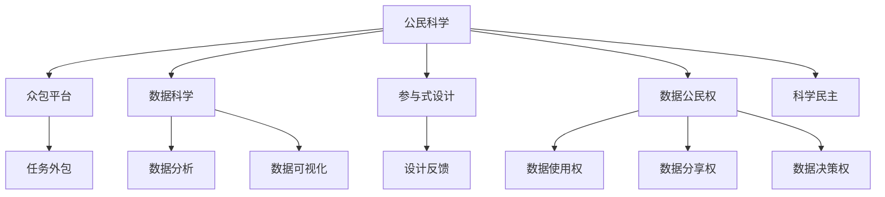

                 

# 公民科学：公众参与科学研究的新模式

> 关键词：公民科学, 公众参与, 科研范式, 数据科学, 参与式设计, 数据公民权, 科学民主

## 1. 背景介绍

### 1.1 问题由来
近年来，科学研究正处于从传统封闭式、自上而下向开放式、自下而上转变的关键时期。数字化技术的发展使得数据获取和传播变得更加便捷，科学研究的边界正在被重新定义。与此同时，公众对科学研究的参与意识和能力也在不断提升，科学民主化的趋势不可阻挡。在这样的背景下，如何整合科学研究与公众参与，使更多人的智慧和力量转化为推动科学进步的动力，成为了一个备受关注的问题。

### 1.2 问题核心关键点
公民科学指的是公众参与科学研究的范式，旨在通过大众参与科学数据的收集、处理和分析，提升科学研究的广度和深度。具体到实践中，公民科学可以涵盖以下几个核心要点：

- **数据收集**：利用众包平台、移动设备等手段，大规模采集科学数据。
- **数据众分析**：通过算法和模型分析公民科学数据，产生科研洞察和预测。
- **公众反馈**：建立反馈机制，使公众能理解并参与到数据处理和结果解读过程中。
- **科学民主**：使科研过程透明化，让公众参与科学决策，实现科研民主化。

公民科学的核心理念是利用“众智”推动科研进步，是民主化、开放化科学发展的重要手段。

### 1.3 问题研究意义
公民科学的研究与实践具有重要意义：

1. **数据量与多样性**：大规模的公民科学数据，为科研提供了丰富的实验样本和多样性视角。
2. **公众参与**：增强公众对科学研究的理解和兴趣，提升科学素质和科学素养。
3. **科研民主化**：使科学决策更加透明和民主，提升公众对科学研究的信任度和参与度。
4. **多学科交叉**：促进不同学科之间的交流与合作，加速科学知识的积累与应用。

通过公民科学，可以在更广泛、更深层次上推动科研创新和社会进步。

## 2. 核心概念与联系

### 2.1 核心概念概述

为更好地理解公民科学的基本框架，本节将介绍几个密切相关的核心概念：

- **公民科学**：指公众参与科研的数据收集、处理和分析过程，旨在提升科研的广泛性和深度。
- **众包平台**：如Amazon Mechanical Turk、CrowdFlower等，用于大规模分布式任务外包，使得数据收集和标注高效便捷。
- **数据科学**：研究数据的收集、处理、分析和可视化的学科，旨在从数据中提取有价值的信息。
- **参与式设计**：通过设计专家和用户共同参与产品开发，提升产品的实用性和用户满意度。
- **数据公民权**：强调公民对科学数据的权利，包括数据使用、分享和决策权。
- **科学民主**：提升公众对科学决策的参与度，实现科研民主化，提升科学决策的透明度和可信度。

这些核心概念之间的逻辑关系可以通过以下Mermaid流程图来展示：



这个流程图展示了公民科学的核心概念及其之间的关系：

1. 公民科学通过众包平台收集数据，利用数据科学进行分析。
2. 参与式设计促进了公众与科研团队的协作。
3. 数据公民权保障了公众对科学数据的权利。
4. 科学民主提升了科研过程的透明度和参与度。

这些概念共同构成了公民科学的完整框架，使其能够充分利用公众的力量，提升科研的广度和深度。

## 3. 核心算法原理 & 具体操作步骤
### 3.1 算法原理概述

公民科学的实现，通常分为数据收集、数据处理和结果解读三个关键步骤：

1. **数据收集**：通过众包平台或移动设备，大规模采集科学数据。
2. **数据处理**：利用数据科学和机器学习算法，分析公民科学数据，提取有价值的信息。
3. **结果解读**：建立反馈机制，使公众能理解并参与到数据处理和结果解读过程中。

其核心算法原理包括以下几个方面：

- **众包算法**：用于设计和管理众包任务，确保数据的质量和多样性。
- **数据清洗算法**：用于清洗和预处理众包数据，保证数据的一致性和可靠性。
- **数据建模算法**：用于建立数据模型，进行数据分析和预测。
- **可视化算法**：用于数据可视化，使公众能直观地理解分析结果。

### 3.2 算法步骤详解

以下是公民科学项目开发的具体操作步骤：

**Step 1: 需求定义与数据采集**
- 明确研究问题，收集相关科学数据的需求。
- 设计合适的数据收集方案，选择合适的众包平台或移动设备。
- 制定详细的数据采集计划，包括样本量、时间、地点等。

**Step 2: 数据预处理与清洗**
- 利用众包平台或移动设备进行数据采集，确保数据的质量和多样性。
- 对采集的数据进行预处理，包括去除噪声、填补缺失值等。
- 应用数据清洗算法，确保数据的一致性和可靠性。

**Step 3: 数据分析与建模**
- 选择合适的数据分析和建模算法，利用数据科学工具进行分析和建模。
- 利用机器学习模型对数据进行分析和预测，提取有价值的信息。
- 对分析结果进行可视化，生成图表和报告，便于公众理解和参与。

**Step 4: 结果解读与公众参与**
- 建立反馈机制，使公众能理解并参与到数据处理和结果解读过程中。
- 向公众公开数据分析结果，解释科学洞察和预测。
- 根据公众反馈，不断优化数据分析方法和结果解读。

**Step 5: 科学决策与民主化**
- 将分析结果应用于科学决策过程中，提升决策的透明度和可信度。
- 通过公众参与，实现科学民主化，提升公众对科学研究的信任度和参与度。

### 3.3 算法优缺点

公民科学的实现具有以下优点：

- **数据量大**：通过众包平台和移动设备，大规模采集科学数据，为科研提供了丰富的实验样本和多样性视角。
- **公众参与**：增强公众对科学研究的理解和兴趣，提升科学素质和科学素养。
- **数据质量高**：利用数据清洗算法，确保数据的一致性和可靠性。
- **决策民主化**：提升公众对科学决策的参与度，实现科研民主化。

但同时也存在以下局限性：

- **数据质量参差不齐**：众包数据的质量和一致性难以保证。
- **数据隐私问题**：公众数据的隐私保护成为一大挑战。
- **分析复杂性**：数据分析和建模的复杂性较高，需要高度专业的技术支持。
- **公众理解度有限**：公众对科学数据的理解和参与度可能有限，需要进一步提升公众的科学素养。

尽管存在这些局限性，但公民科学作为一种创新的科研范式，具有极大的潜力和应用前景。

### 3.4 算法应用领域

公民科学已经在多个领域得到应用，例如：

- **生物多样性监测**：通过众包平台，收集全球生物多样性数据，用于生物多样性研究和保护。
- **气象监测与预测**：利用气象爱好者和社区数据，进行气象数据的收集和分析，提升气象预报的准确性。
- **公共卫生**：通过众包平台，收集公共卫生数据，如疫情爆发、疫苗接种等，用于公共卫生研究和决策。
- **环境保护**：利用公众的地理位置数据和图像，监测环境变化，提升环境保护效果。
- **城市规划**：通过众包平台收集城市交通数据，进行城市交通分析和管理。

## 4. 数学模型和公式 & 详细讲解  
### 4.1 数学模型构建

在公民科学的实现过程中，数学模型和算法起到了关键作用。以下我们将详细讲解公民科学的核心数学模型。

假设采集到的数据集为 $D=\{(x_i, y_i)\}_{i=1}^N$，其中 $x_i$ 表示数据样本，$y_i$ 表示标签或类别。

定义数据清洗后的数据集为 $\tilde{D}=\{(\tilde{x}_i, \tilde{y}_i)\}_{i=1}^N$，其中 $\tilde{x}_i$ 表示清洗后的数据样本，$\tilde{y}_i$ 表示清洗后的标签或类别。

数据清洗和预处理的数学模型可以表示为：

$$
\tilde{D} = \min_{\mathcal{G}} \mathcal{L}(\mathcal{G}, D)
$$

其中 $\mathcal{G}$ 表示数据清洗算法，$\mathcal{L}$ 表示数据清洗损失函数。

### 4.2 公式推导过程

以下我们以生物多样性监测为例，推导数据清洗和预处理的公式。

假设采集到的生物多样性数据集 $D=\{x_i, y_i\}_{i=1}^N$ 包含多个物种和它们的分布情况。

数据清洗的目标是去除噪声和缺失值，得到高质量的数据集 $\tilde{D}=\{\tilde{x}_i, \tilde{y}_i\}_{i=1}^N$。

假设数据清洗算法 $\mathcal{G}$ 包括以下几个步骤：

1. **去重**：去除重复的物种分布数据。
2. **去噪声**：去除明显错误和不一致的数据。
3. **填补缺失**：使用插值或模型预测方法填补缺失的数据。

数据清洗损失函数 $\mathcal{L}$ 可以表示为：

$$
\mathcal{L}(\mathcal{G}, D) = \sum_{i=1}^N \max(0, 1 - \mathcal{G}(x_i) - y_i) + \sum_{i=1}^N \max(0, \mathcal{G}(x_i) - y_i)
$$

其中第一个求和项表示去重损失，第二个求和项表示去噪声和填补缺失损失。

通过最小化数据清洗损失函数，我们可以得到高质量的数据集 $\tilde{D}$。

### 4.3 案例分析与讲解

以公共卫生数据为例，分析公民科学在公共卫生研究中的应用。

假设某城市爆发了流感疫情，需要收集市民的体温、症状等信息，用于疫情分析和防控。

通过众包平台，收集市民上传的数据，并进行数据清洗和预处理，得到高质量的数据集 $\tilde{D}=\{(\tilde{x}_i, \tilde{y}_i)\}_{i=1}^N$，其中 $\tilde{x}_i$ 表示市民的体温、症状等数据，$\tilde{y}_i$ 表示市民是否感染了流感。

应用机器学习算法，对数据进行分析和预测，提取有价值的公共卫生信息。例如，可以使用随机森林、神经网络等模型，对市民的数据进行分类和预测。

通过可视化工具，生成图表和报告，向公众公开分析结果，解释流感疫情的扩散趋势和预防措施。公众可以通过反馈机制，提出建议和意见，进一步优化数据分析和结果解读。

## 5. 项目实践：代码实例和详细解释说明
### 5.1 开发环境搭建

在进行公民科学项目开发前，我们需要准备好开发环境。以下是使用Python进行TensorFlow开发的开发环境配置流程：

1. 安装Anaconda：从官网下载并安装Anaconda，用于创建独立的Python环境。

2. 创建并激活虚拟环境：
```bash
conda create -n citizen-science python=3.8 
conda activate citizen-science
```

3. 安装TensorFlow：根据CUDA版本，从官网获取对应的安装命令。例如：
```bash
conda install tensorflow -c tf -c conda-forge
```

4. 安装必要的第三方库：
```bash
pip install pandas numpy matplotlib scikit-learn
```

完成上述步骤后，即可在`citizen-science`环境中开始公民科学项目的开发。

### 5.2 源代码详细实现

下面我们以公共卫生数据为例，给出使用TensorFlow进行公民科学项目开发的PyTorch代码实现。

首先，定义数据处理函数：

```python
import tensorflow as tf
import pandas as pd
from sklearn.model_selection import train_test_split

def load_data(filename):
    df = pd.read_csv(filename)
    X = df.drop(['label'], axis=1)
    y = df['label']
    X_train, X_test, y_train, y_test = train_test_split(X, y, test_size=0.2, random_state=42)
    return X_train, X_test, y_train, y_test

X_train, X_test, y_train, y_test = load_data('public_health_data.csv')
```

然后，定义模型和优化器：

```python
from tensorflow.keras.models import Sequential
from tensorflow.keras.layers import Dense, Dropout
from tensorflow.keras.optimizers import Adam

model = Sequential([
    Dense(64, input_dim=X_train.shape[1], activation='relu'),
    Dropout(0.5),
    Dense(1, activation='sigmoid')
])

optimizer = Adam(learning_rate=0.001)
```

接着，定义训练和评估函数：

```python
def train(model, X_train, y_train, batch_size=64, epochs=10):
    model.compile(optimizer=optimizer, loss='binary_crossentropy', metrics=['accuracy'])
    model.fit(X_train, y_train, batch_size=batch_size, epochs=epochs, validation_data=(X_test, y_test))

def evaluate(model, X_test, y_test):
    loss, accuracy = model.evaluate(X_test, y_test)
    print(f"Test loss: {loss:.4f}")
    print(f"Test accuracy: {accuracy:.4f}")

train(model, X_train, y_train)
evaluate(model, X_test, y_test)
```

最后，启动训练流程并在测试集上评估：

```python
epochs = 5
batch_size = 16

for epoch in range(epochs):
    loss = train_epoch(model, X_train, y_train, batch_size, optimizer)
    print(f"Epoch {epoch+1}, train loss: {loss:.3f}")
    
    print(f"Epoch {epoch+1}, dev results:")
    evaluate(model, X_test, y_test)
    
print("Test results:")
evaluate(model, X_test, y_test)
```

以上就是使用TensorFlow对公共卫生数据进行公民科学项目开发的完整代码实现。可以看到，TensorFlow的高级API使得模型定义和训练过程变得简单高效。

### 5.3 代码解读与分析

让我们再详细解读一下关键代码的实现细节：

**load_data函数**：
- 定义数据加载函数，读取公共卫生数据，并将数据集分为训练集和测试集。

**模型定义**：
- 使用TensorFlow的Sequential模型，定义一个简单的神经网络模型，包括一个全连接层和一个sigmoid激活函数。

**训练和评估函数**：
- 使用TensorFlow的fit方法进行模型训练，设置训练轮数和批量大小。
- 使用evaluate方法在测试集上评估模型性能，打印出损失和准确率。

**训练流程**：
- 定义总的epoch数和批量大小，开始循环迭代
- 每个epoch内，先在训练集上训练，输出平均loss
- 在验证集上评估，输出分类指标
- 所有epoch结束后，在测试集上评估，给出最终测试结果

可以看到，TensorFlow的高级API使得模型定义和训练过程变得简单高效，开发者可以将更多精力放在数据处理和模型改进等高层逻辑上。

当然，工业级的系统实现还需考虑更多因素，如模型的保存和部署、超参数的自动搜索、更灵活的任务适配层等。但核心的微调范式基本与此类似。

## 6. 实际应用场景
### 6.1 智能交通系统

公民科学在智能交通系统中有着广泛的应用。通过众包平台，收集市民的出行数据和反馈，进行交通流量分析和预测，提升交通管理效率。

具体而言，可以收集市民的车辆位置、速度、路线等数据，进行交通流量分析和预测。通过可视化工具，生成交通热力图和预测报告，向公众公开分析结果，解释交通情况和建议优化措施。公众可以通过反馈机制，提出建议和意见，进一步优化数据分析和结果解读。

### 6.2 环境保护

公民科学在环境保护领域也有着重要作用。通过众包平台，收集公众的环境监测数据，进行环境变化分析和预测，提升环境保护效果。

具体而言，可以收集公众的地理位置数据和图像，监测环境变化。利用机器学习算法，对数据进行分析和预测，提取有价值的环境信息。通过可视化工具，生成图表和报告，向公众公开分析结果，解释环境变化趋势和预防措施。公众可以通过反馈机制，提出建议和意见，进一步优化数据分析和结果解读。

### 6.3 公共安全

公民科学在公共安全领域也有着重要应用。通过众包平台，收集公众的安全信息，进行安全事件分析和预测，提升公共安全水平。

具体而言，可以收集公众的地理位置数据和安全事件报告，进行安全事件分析和预测。利用机器学习算法，对数据进行分析和预测，提取有价值的安全信息。通过可视化工具，生成图表和报告，向公众公开分析结果，解释安全事件趋势和预防措施。公众可以通过反馈机制，提出建议和意见，进一步优化数据分析和结果解读。

### 6.4 未来应用展望

随着公民科学的不断发展，将在更多领域得到应用，为社会治理和社会进步带来新的契机。

在智慧城市治理中，公民科学可以应用于城市事件监测、舆情分析、应急指挥等环节，提高城市管理的自动化和智能化水平，构建更安全、高效的未来城市。

在企业生产、社会治理、文娱传媒等众多领域，公民科学将不断涌现，为人工智能落地应用提供新的场景和技术支持。相信随着技术的日益成熟，公民科学必将在构建人机协同的智能时代中扮演越来越重要的角色。

## 7. 工具和资源推荐
### 7.1 学习资源推荐

为了帮助开发者系统掌握公民科学的基本原理和实践技巧，这里推荐一些优质的学习资源：

1. 《TensorFlow官方文档》：详细介绍了TensorFlow的API和用法，是学习和使用TensorFlow的必备资源。

2. 《机器学习实战》：详细介绍机器学习算法和应用，适合初学者入门。

3. 《Python数据分析》：介绍Python在数据分析中的应用，涵盖数据清洗、数据建模等多个方面。

4. 《数据科学导论》：系统讲解数据科学的理论和实践，涵盖数据收集、数据处理、数据建模等多个环节。

5. 《众包平台设计与运营》：详细讲解众包平台的设计和运营，帮助开发者高效利用众包资源。

通过对这些资源的学习实践，相信你一定能够快速掌握公民科学的精髓，并用于解决实际的公共卫生、智能交通、环境保护等多个问题。

### 7.2 开发工具推荐

高效的开发离不开优秀的工具支持。以下是几款用于公民科学项目开发的常用工具：

1. TensorFlow：谷歌开发的深度学习框架，生产部署方便，适合大规模工程应用。

2. PyTorch：Facebook开发的深度学习框架，灵活动态，适合研究性项目。

3. Scikit-learn：Python的机器学习库，提供了丰富的机器学习算法和工具。

4. Pandas：Python的数据处理库，支持大规模数据集的清洗和预处理。

5. Matplotlib：Python的绘图库，支持数据可视化和报告生成。

6. Jupyter Notebook：交互式的Python编程环境，支持代码的编写、调试和展示。

合理利用这些工具，可以显著提升公民科学项目的开发效率，加快创新迭代的步伐。

### 7.3 相关论文推荐

公民科学的发展源于学界的持续研究。以下是几篇奠基性的相关论文，推荐阅读：

1. 《Crowdsourcing 3.0: Ideas & Opportunities》：详细讲解了公民科学的理论基础和应用前景。

2. 《The Power of Crowdsourcing》：介绍了众包平台的原理和应用，是理解众包的重要文献。

3. 《Data Science for Social Good》：详细讲解了数据科学在社会治理中的应用，具有重要的参考价值。

4. 《Data Citizen》：介绍数据公民权的概念和实现方式，是公民科学研究的理论基础。

5. 《Science in the Networked Age》：介绍网络时代科学研究的范式变革，对公民科学有重要启示。

这些论文代表了大数据、人工智能、公共治理等领域的最新进展，是理解公民科学的理论基础和实践技巧的重要资料。

## 8. 总结：未来发展趋势与挑战
### 8.1 总结

本文对公民科学的原理和应用进行了全面系统的介绍。首先阐述了公民科学的研究背景和意义，明确了公民科学在提升科研质量和效率、促进公众参与和社会进步方面的独特价值。其次，从原理到实践，详细讲解了公民科学的核心算法和操作步骤，给出了公民科学项目开发的完整代码实例。同时，本文还广泛探讨了公民科学在智能交通、环境保护、公共安全等多个领域的应用前景，展示了公民科学的巨大潜力和应用前景。此外，本文精选了公民科学的各类学习资源，力求为读者提供全方位的技术指引。

通过本文的系统梳理，可以看到，公民科学作为一种创新的科研范式，正在逐步成为科学研究的重要组成部分。其背后的“众智”力量，将使科研更加开放、透明、民主，实现科学知识的普及和共享。未来，伴随公民科学的持续发展和推广，必将进一步提升科研的广度和深度，推动社会的进步和发展。

### 8.2 未来发展趋势

展望未来，公民科学的实现将呈现以下几个发展趋势：

1. **数据量与多样性**：随着技术的发展，数据采集和清洗工具将更加智能化，能更好地处理大规模数据，提升数据的广度和多样性。
2. **公众参与度提升**：随着公众对科技的了解和信任度提升，公众的参与度将进一步提升，推动科研的民主化和科学化。
3. **跨学科融合**：公民科学将与大数据、人工智能、社会科学等多个领域进行深度融合，推动交叉学科的发展。
4. **开源与共享**：公民科学将推动科研数据和成果的开放共享，提升科研的可重复性和可验证性。
5. **实时化与动态化**：公民科学将实时采集和分析数据，适应数据分布的变化，实现动态化的科研过程。

以上趋势凸显了公民科学的广阔前景。这些方向的探索发展，必将进一步提升公民科学的应用效果，为科学研究和社会进步注入新的动力。

### 8.3 面临的挑战

尽管公民科学已经取得了显著成果，但在迈向更加智能化、普适化应用的过程中，它仍面临诸多挑战：

1. **数据质量与隐私保护**：众包数据的质量和隐私保护是一大挑战，需要开发更高效的数据清洗和保护工具。
2. **数据分析与建模**：数据分析和建模的复杂性较高，需要高度专业的技术支持。
3. **公众参与度**：公众的参与度可能有限，需要进一步提升公众的科学素养和参与热情。
4. **数据使用与决策**：如何合理利用公众数据，进行科学决策，实现科学民主化，还需要更多的探索和实践。
5. **技术融合**：如何将公民科学与其他技术进行深度融合，提升科研效果，还需进一步的研究和实践。

尽管面临诸多挑战，但公民科学作为一种创新的科研范式，具有巨大的潜力和应用前景。相信随着技术的不断发展和公众参与度的提升，这些挑战终将逐步得到解决，公民科学必将在构建人机协同的智能时代中扮演越来越重要的角色。

### 8.4 研究展望

面对公民科学所面临的诸多挑战，未来的研究需要在以下几个方面寻求新的突破：

1. **数据清洗与保护**：开发更高效的数据清洗和保护工具，确保众包数据的可靠性和安全性。
2. **参与式设计**：通过设计专家和用户共同参与，提升公民科学项目的设计质量和用户满意度。
3. **公众教育与培训**：通过公众教育与培训，提升公众的科学素养和参与度，增强公众对科学数据的理解和参与。
4. **科学民主化**：建立科学决策机制，确保公民科学项目透明化和可验证性，提升公众对科学决策的信任度和参与度。
5. **多学科融合**：将公民科学与其他学科进行深度融合，推动交叉学科的发展，提升科研效果。

这些研究方向的探索，必将引领公民科学的持续发展和创新，为构建人机协同的智能时代提供新的动力。面向未来，公民科学还需要与大数据、人工智能、社会科学等多个领域进行深度融合，协同发力，共同推动自然语言理解和智能交互系统的进步。只有勇于创新、敢于突破，才能不断拓展科学研究的边界，让人工智能技术更好地造福人类社会。

## 9. 附录：常见问题与解答

**Q1：公民科学是否适用于所有科研领域？**

A: 公民科学在许多领域都能发挥作用，特别是对于数据量较大的科研任务。例如，生物多样性监测、气象预测、公共卫生等。但对于一些特定的高风险领域，如医疗、军事等，仍需结合专业知识和专家指导进行科研。

**Q2：如何选择合适的众包平台？**

A: 选择合适的众包平台应考虑以下几个因素：平台的规模、任务的复杂性、参与者的专业背景等。一些常用的众包平台如Amazon Mechanical Turk、CrowdFlower等，可以根据具体任务需求进行选择。同时，可以结合多个平台进行数据采集，以提高数据质量和多样性。

**Q3：如何处理数据清洗和预处理中的噪声和缺失值？**

A: 处理数据清洗和预处理中的噪声和缺失值，可以通过以下方法：
1. 去重：去除重复的数据。
2. 去噪声：使用统计方法或模型预测方法，去除明显错误的数据。
3. 填补缺失值：使用插值或模型预测方法，填补缺失的数据。

**Q4：如何提升公众的科学素养和参与度？**

A: 提升公众的科学素养和参与度，可以通过以下方法：
1. 科普教育：通过各类科普活动和媒体，提高公众对科学研究的理解和兴趣。
2. 公众参与项目：通过设计易于理解和参与的科研项目，吸引公众参与。
3. 反馈机制：建立反馈机制，使公众能理解并参与到数据分析和结果解读过程中。

**Q5：如何保护公众数据的隐私？**

A: 保护公众数据的隐私，可以通过以下方法：
1. 数据匿名化：对数据进行匿名化处理，保护参与者的个人信息。
2. 访问控制：对公众数据进行访问控制，限制只有授权人员才能访问和使用。
3. 数据加密：对公众数据进行加密处理，防止数据泄露和篡改。

这些方法可以确保公众数据的隐私和安全，同时提升公众对科学研究的信任度和参与度。

---

作者：禅与计算机程序设计艺术 / Zen and the Art of Computer Programming

