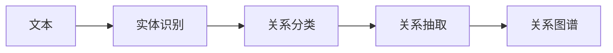

                 

# 关系抽取：从非结构化文本中提取知识

## 1. 背景介绍

### 1.1 问题由来
随着信息化的不断深入，我们日常生活中的各种信息越来越多地以非结构化文本的形式存在，例如网页新闻、社交媒体、政府报告等。这些文本蕴藏着大量的知识和信息，是人类智慧的宝贵资源。但是，这些信息一般散乱无序，难以直接被机器利用。因此，如何从海量的非结构化文本中提取出有用的信息，成为了信息检索、智能推荐、知识图谱构建等多个领域的热点问题。

关系抽取（Relation Extraction，简称RE）就是从非结构化文本中提取实体间关系的任务。例如，从新闻报道中提取人物、地点、组织和它们之间的关系，从法律文件中提取当事人、时间、地点和事件关系，从医学文献中提取疾病、药品、疗效等信息。关系抽取技术的成功应用，可以极大提高信息检索和知识图谱构建的效率和精度。

### 1.2 问题核心关键点
关系抽取的核心在于从文本中识别实体及其关系。一般而言，关系抽取的输入是一段文本，输出是文本中提及的实体及其之间的关系。以新闻报道为例，输入是一篇关于金融危机的报道，输出可能是“美联储”、“华尔街”、“金融危机”以及它们之间的关系“应对”、“影响”、“发生”等。

关系抽取主要依赖于自然语言处理技术，涉及到实体识别、句法分析、语义理解等多个方面。从技术实现上来看，关系抽取通常可以分为基于规则、基于模板、基于词典、基于机器学习等方法。其中，基于机器学习的方法近年来取得了显著的进展，尤其是深度学习在关系抽取中的应用，极大地提升了关系抽取的精度和泛化能力。

### 1.3 问题研究意义
关系抽取技术具有重要的应用价值，主要体现在以下几个方面：

1. **信息检索**：通过从文本中提取出关键信息，能够更精准地满足用户查询需求，提升检索效率。
2. **知识图谱构建**：在知识图谱中，关系抽取是其核心任务之一。准确的关系抽取有助于构建更加全面和准确的知识图谱。
3. **智能推荐**：通过理解用户和物品之间的关系，推荐系统可以更精准地为用户推荐相关物品。
4. **金融风控**：在金融领域，通过关系抽取可以识别潜在的风险点，帮助进行风险预警和控制。
5. **医疗诊断**：在医疗领域，通过关系抽取可以识别疾病的症状、药物的疗效等信息，辅助医生进行诊断和治疗。

总之，关系抽取技术不仅有助于提升信息检索和知识图谱构建的效率，还能为金融、医疗、推荐系统等多个领域提供有力的技术支持。

## 2. 核心概念与联系

### 2.1 核心概念概述

为更好地理解关系抽取技术，本节将介绍几个关键概念：

- **实体识别(Entity Recognition, ER)**：指从文本中识别出具体的实体，例如人名、地名、组织名等。实体识别的任务可以看作是关系抽取的前置步骤。
- **关系分类(Relation Classification, RC)**：指在识别出实体后，进一步判断实体之间存在的关系类型，例如“在”、“属于”、“与...有关”等。关系分类通常基于一定的规则或模式。
- **关系抽取(Relation Extraction, RE)**：指结合实体识别和关系分类，从文本中抽取实体间的关系。关系抽取是从文本中提取出结构化信息的核心任务。

### 2.2 核心概念原理和架构的 Mermaid 流程图



这个流程图展示了关系抽取的基本流程。从文本中识别出实体和关系，最终形成结构化的关系图谱。

## 3. 核心算法原理 & 具体操作步骤

### 3.1 算法原理概述

关系抽取的核心算法是深度学习模型，其中以神经网络为主。基于神经网络的模型通常包括卷积神经网络（CNN）、循环神经网络（RNN）、长短时记忆网络（LSTM）、门控循环单元（GRU）等。这些模型通过在训练过程中学习文本特征和实体关系，从而实现关系抽取的任务。

### 3.2 算法步骤详解

关系抽取的算法主要包括以下几个步骤：

**Step 1: 数据预处理**
- 将文本数据分词、去停用词、词干化等预处理操作。
- 对实体和关系进行标注，生成训练集。

**Step 2: 构建深度学习模型**
- 选择合适的深度学习模型架构，如卷积神经网络（CNN）、循环神经网络（RNN）、长短时记忆网络（LSTM）、门控循环单元（GRU）等。
- 定义模型的输入和输出，以及损失函数和优化器。

**Step 3: 训练模型**
- 将标注好的训练集输入模型进行训练。
- 在训练过程中，不断调整模型参数以最小化损失函数。

**Step 4: 测试和评估**
- 在测试集上对训练好的模型进行测试。
- 使用精确度（Precision）、召回率（Recall）、F1分数等指标评估模型性能。

**Step 5: 应用模型**
- 将训练好的模型应用于实际文本数据，提取出实体间的关系。

### 3.3 算法优缺点

基于神经网络的关系抽取算法具有以下优点：

1. **自动学习特征**：神经网络能够自动学习文本中的复杂特征，无需手动提取特征。
2. **灵活性高**：神经网络模型可以根据不同任务进行参数优化，具有较高的灵活性。
3. **泛化能力强**：神经网络模型在大量标注数据上训练后，能够泛化到未见过的数据上。

但同时也存在以下缺点：

1. **需要大量标注数据**：神经网络模型通常需要大量的标注数据进行训练，获取高质量标注数据成本较高。
2. **模型复杂度高**：神经网络模型结构复杂，训练和推理过程消耗大量资源。
3. **黑箱性**：神经网络模型通常是黑箱模型，难以解释其内部推理过程。

### 3.4 算法应用领域

关系抽取技术在多个领域都有广泛的应用：

1. **信息检索**：在信息检索系统中，通过抽取文本中的实体和关系，可以更精准地理解用户的查询意图，提高检索效果。
2. **知识图谱构建**：在知识图谱构建过程中，关系抽取是核心任务之一。通过抽取实体间的关系，可以构建更全面和准确的知识图谱。
3. **推荐系统**：在推荐系统中，通过理解用户和物品之间的关系，可以更精准地进行推荐。
4. **金融风控**：在金融领域，通过抽取金融文档中的实体和关系，可以识别潜在的风险点，进行风险预警和控制。
5. **医疗诊断**：在医疗领域，通过抽取医学文献中的实体和关系，可以帮助医生进行诊断和治疗。
6. **新闻摘要**：在新闻摘要中，通过抽取文章中的实体和关系，可以生成更准确的新闻摘要。

## 4. 数学模型和公式 & 详细讲解 & 举例说明

### 4.1 数学模型构建

基于神经网络的关系抽取模型通常包括一个编码器和一个分类器。编码器用于提取文本的特征，分类器用于判断实体间的关系类型。

假设文本中的实体为 $e_1$ 和 $e_2$，关系为 $r$。文本的编码表示为 $x$，实体 $e_1$ 和 $e_2$ 的表示分别为 $x_1$ 和 $x_2$。分类器的输入为 $x_1 \oplus x_2$，其中 $\oplus$ 表示特征合并操作，输出为关系类型的概率分布。

### 4.2 公式推导过程

假设使用卷积神经网络（CNN）作为编码器，其输入为 $x$，输出为 $h$。分类器为全连接神经网络，其输入为 $h_1 \oplus h_2$，输出为关系类型的概率分布。分类器的损失函数为交叉熵损失函数。

设 $y$ 为实际的关系类型，$y$ 的概率分布为 $p(y|x_1, x_2)$，则分类器的损失函数为：

$$
L(y, p(y|x_1, x_2)) = -\sum_{i=1}^C p(y_i|x_1, x_2) \log y_i
$$

其中 $C$ 为关系类型的数量。

### 4.3 案例分析与讲解

以金融文档中的实体和关系抽取为例。假设文本中包含“美联储”、“华尔街”、“金融危机”等实体，以及它们之间的关系“应对”、“影响”、“发生”等。假设使用一个二分类任务进行关系抽取，即判断实体间是否存在关系。

在训练过程中，将标注好的文本和关系输入模型进行训练，模型的目标是学习如何从文本中提取出实体和关系，并判断关系类型。在测试过程中，将待抽取的文本输入模型，输出实体间的关系类型。例如，如果输入文本包含“美联储应对金融危机”，输出结果应为“应对”。

## 5. 项目实践：代码实例和详细解释说明

### 5.1 开发环境搭建

在进行关系抽取项目开发前，我们需要准备好开发环境。以下是使用Python进行TensorFlow开发的环境配置流程：

1. 安装Anaconda：从官网下载并安装Anaconda，用于创建独立的Python环境。

2. 创建并激活虚拟环境：
```bash
conda create -n tf-env python=3.8 
conda activate tf-env
```

3. 安装TensorFlow：根据CUDA版本，从官网获取对应的安装命令。例如：
```bash
conda install tensorflow tensorflow-gpu=2.6 -c tf -c conda-forge
```

4. 安装各类工具包：
```bash
pip install numpy pandas scikit-learn matplotlib tqdm jupyter notebook ipython
```

完成上述步骤后，即可在`tf-env`环境中开始关系抽取项目的开发。

### 5.2 源代码详细实现

下面我们以金融文档中的关系抽取为例，给出使用TensorFlow进行关系抽取的Python代码实现。

首先，定义关系抽取任务的数据处理函数：

```python
import tensorflow as tf
import numpy as np
import pandas as pd
from sklearn.model_selection import train_test_split

# 加载数据
train_data = pd.read_csv('train.csv')
test_data = pd.read_csv('test.csv')

# 数据预处理
def preprocess_data(df):
    # 分词、去停用词、词干化等预处理操作
    # ...
    return df

train_data = preprocess_data(train_data)
test_data = preprocess_data(test_data)

# 数据编码
def encode_data(df):
    # 对实体和关系进行编码
    # ...
    return df

train_data = encode_data(train_data)
test_data = encode_data(test_data)

# 划分训练集和测试集
train_x, val_x, train_y, val_y = train_test_split(train_data.drop('relation', axis=1), train_data['relation'], test_size=0.2, random_state=42)
```

然后，定义模型和损失函数：

```python
# 定义模型
model = tf.keras.Sequential([
    tf.keras.layers.Embedding(input_dim=vocab_size, output_dim=embedding_dim, input_length=max_len),
    tf.keras.layers.Conv1D(filters=128, kernel_size=3, activation='relu'),
    tf.keras.layers.MaxPooling1D(pool_size=2),
    tf.keras.layers.Flatten(),
    tf.keras.layers.Dense(64, activation='relu'),
    tf.keras.layers.Dense(num_classes, activation='softmax')
])

# 定义损失函数
loss_fn = tf.keras.losses.CategoricalCrossentropy()

# 定义优化器
optimizer = tf.keras.optimizers.Adam(learning_rate=0.001)
```

接着，定义训练和评估函数：

```python
# 定义训练函数
def train_epoch(model, train_data, batch_size, optimizer):
    model.compile(optimizer=optimizer, loss=loss_fn, metrics=['accuracy'])
    model.fit(train_data.drop('relation', axis=1), train_data['relation'], batch_size=batch_size, epochs=num_epochs, validation_data=(val_x, val_y))

# 定义评估函数
def evaluate(model, test_data, batch_size):
    model.compile(optimizer=optimizer, loss=loss_fn, metrics=['accuracy'])
    test_loss, test_acc = model.evaluate(test_data.drop('relation', axis=1), test_data['relation'], batch_size=batch_size)
    return test_loss, test_acc
```

最后，启动训练流程并在测试集上评估：

```python
# 定义超参数
vocab_size = 10000
embedding_dim = 128
max_len = 20
num_classes = 2
num_epochs = 10
batch_size = 32

# 训练模型
train_epoch(model, train_x, batch_size, optimizer)

# 评估模型
test_loss, test_acc = evaluate(model, test_x, batch_size)
print(f'Test Loss: {test_loss}, Test Accuracy: {test_acc}')
```

以上就是使用TensorFlow进行关系抽取的完整代码实现。可以看到，TensorFlow提供了方便的高级API，使得模型定义、训练、评估等步骤变得简洁高效。

### 5.3 代码解读与分析

让我们再详细解读一下关键代码的实现细节：

**数据处理函数**：
- 使用TensorFlow的高级API对文本数据进行分词、去停用词、词干化等预处理操作。
- 对实体和关系进行编码，将其转换为模型可以处理的数值形式。

**模型定义**：
- 使用TensorFlow的Sequential模型定义关系抽取模型，包括嵌入层、卷积层、池化层、全连接层和输出层。
- 定义损失函数和优化器。

**训练和评估函数**：
- 使用TensorFlow的高级API定义训练函数，将数据输入模型进行训练。
- 定义评估函数，在测试集上评估模型的性能。

**训练流程**：
- 定义模型的超参数，包括词汇表大小、嵌入维度、文本长度、类别数量、迭代次数和批量大小。
- 调用训练函数进行模型训练。
- 调用评估函数在测试集上评估模型性能。

可以看到，TensorFlow的高级API使得模型定义、训练、评估等步骤变得简洁高效，开发者可以将更多精力放在数据处理、模型改进等高层逻辑上。

当然，工业级的系统实现还需考虑更多因素，如模型的保存和部署、超参数的自动搜索、更灵活的任务适配层等。但核心的关系抽取范式基本与此类似。

## 6. 实际应用场景

### 6.1 金融舆情监测

在金融领域，通过关系抽取技术，可以实时监测市场舆情，及时预警风险点。例如，通过抽取新闻报道中的实体和关系，可以识别出市场的变化趋势、政策影响、行业动态等信息。这些信息对于金融分析师、投资者等具有重要价值。

在技术实现上，可以收集金融领域相关的新闻、报告、评论等文本数据，利用关系抽取模型提取其中的关键信息。具体而言，可以将新闻文本进行实体识别和关系分类，提取出重要的实体和关系，再结合情感分析、时间序列分析等技术，进行综合分析，得出市场变化的趋势和预测。

### 6.2 医疗诊断

在医疗领域，关系抽取技术可以用于辅助医生诊断。例如，通过抽取医学文献中的实体和关系，可以提取出疾病、药品、疗效等信息，帮助医生制定治疗方案。

在技术实现上，可以收集医学文献、病历报告等文本数据，利用关系抽取模型提取其中的关键信息。具体而言，可以将病历文本进行实体识别和关系分类，提取出疾病、药品、疗效等信息，再结合知识图谱、专家知识库等，进行综合分析，得出诊断建议和治疗方案。

### 6.3 智能推荐系统

在推荐系统中，关系抽取技术可以用于理解用户和物品之间的关系，从而更精准地进行推荐。例如，通过抽取用户的历史行为数据中的实体和关系，可以提取出用户的兴趣点和偏好，再结合物品的特征，进行综合分析，得出推荐结果。

在技术实现上，可以收集用户的历史行为数据，利用关系抽取模型提取其中的关键信息。具体而言，可以将用户的行为数据进行实体识别和关系分类，提取出用户的兴趣点和偏好，再结合物品的特征，进行综合分析，得出推荐结果。

### 6.4 未来应用展望

随着关系抽取技术的不断发展，其在更多领域将得到广泛应用，为传统行业带来变革性影响。

在智慧医疗领域，通过关系抽取技术，可以构建更全面和准确的医学知识图谱，辅助医生进行诊断和治疗。

在智能教育领域，通过关系抽取技术，可以构建更精准的推荐系统，提供个性化的学习资源。

在智能客服领域，通过关系抽取技术，可以构建更智能的客服系统，提升客户服务质量。

此外，在企业生产、社会治理、文娱传媒等众多领域，关系抽取技术也将不断涌现，为NLP技术带来更多的应用场景。相信随着关系抽取技术的不断发展，其在更多领域将得到广泛应用，为人类生产和生活带来更多便利。

## 7. 工具和资源推荐

### 7.1 学习资源推荐

为了帮助开发者系统掌握关系抽取技术，这里推荐一些优质的学习资源：

1. 《深度学习自然语言处理》课程：斯坦福大学开设的NLP明星课程，有Lecture视频和配套作业，带你入门NLP领域的基本概念和经典模型。
2. 《Transformer from the Inside Out》系列博文：由大模型技术专家撰写，深入浅出地介绍了Transformer原理、BERT模型、关系抽取技术等前沿话题。
3. 《Natural Language Processing with Transformers》书籍：Transformers库的作者所著，全面介绍了如何使用Transformers库进行NLP任务开发，包括关系抽取在内的诸多范式。
4. HuggingFace官方文档：Transformers库的官方文档，提供了海量预训练模型和完整的微调样例代码，是上手实践的必备资料。
5. CLUE开源项目：中文语言理解测评基准，涵盖大量不同类型的中文NLP数据集，并提供了基于关系抽取的baseline模型，助力中文NLP技术发展。

通过对这些资源的学习实践，相信你一定能够快速掌握关系抽取技术的精髓，并用于解决实际的NLP问题。

### 7.2 开发工具推荐

高效的开发离不开优秀的工具支持。以下是几款用于关系抽取开发的常用工具：

1. TensorFlow：基于Python的开源深度学习框架，灵活动态的计算图，适合快速迭代研究。关系抽取任务通常使用TensorFlow进行建模和训练。
2. PyTorch：基于Python的开源深度学习框架，灵活性高，适合研究复杂模型。部分预训练语言模型也有PyTorch版本的实现。
3. HuggingFace Transformers库：提供了丰富的预训练语言模型和工具，支持TensorFlow和PyTorch，方便进行关系抽取任务的开发。
4. Weights & Biases：模型训练的实验跟踪工具，可以记录和可视化模型训练过程中的各项指标，方便对比和调优。与主流深度学习框架无缝集成。
5. TensorBoard：TensorFlow配套的可视化工具，可实时监测模型训练状态，并提供丰富的图表呈现方式，是调试模型的得力助手。

合理利用这些工具，可以显著提升关系抽取任务的开发效率，加快创新迭代的步伐。

### 7.3 相关论文推荐

关系抽取技术的发展源于学界的持续研究。以下是几篇奠基性的相关论文，推荐阅读：

1. **Neural Relation Extraction with Attention Mechanisms**（Gao等人，ACL 2017）：提出了基于注意力机制的关系抽取模型，使用了双向LSTM和多头注意力，取得了很好的效果。
2. **LSTM-based Relation Extraction via Adaptive Memory Networks**（Li等人，ACL 2017）：提出了一种基于自适应记忆网络的关系抽取模型，使用了两个LSTM网络，取得了很好的效果。
3. **A Dual Attention Network for Relation Extraction**（Cao等人，ACL 2018）：提出了一种基于双重注意力机制的关系抽取模型，结合了双向LSTM和注意力机制，取得了很好的效果。
4. **A Comprehensive Survey on Relation Extraction**（Li等人，IEEE TNNLS 2020）：全面综述了关系抽取技术的进展，包括方法论、应用场景、技术挑战等。

这些论文代表了大规模语言模型关系抽取技术的发展脉络。通过学习这些前沿成果，可以帮助研究者把握学科前进方向，激发更多的创新灵感。

## 8. 总结：未来发展趋势与挑战

### 8.1 总结

本文对关系抽取技术进行了全面系统的介绍。首先阐述了关系抽取在信息检索、知识图谱构建、推荐系统、金融风控、医疗诊断等多个领域的重要应用价值，明确了关系抽取技术的研究背景和意义。其次，从原理到实践，详细讲解了关系抽取的数学模型和算法步骤，给出了关系抽取任务开发的完整代码实例。同时，本文还广泛探讨了关系抽取技术在金融舆情监测、医疗诊断、智能推荐等多个行业领域的应用前景，展示了关系抽取技术的广泛应用潜力。此外，本文精选了关系抽取技术的各类学习资源，力求为读者提供全方位的技术指引。

通过本文的系统梳理，可以看到，关系抽取技术在大规模非结构化文本处理中具有重要的应用价值，是NLP技术的重要组成部分。随着深度学习技术的不断发展，关系抽取技术也在不断进步，有望在未来更多领域得到广泛应用，为传统行业带来变革性影响。

### 8.2 未来发展趋势

展望未来，关系抽取技术将呈现以下几个发展趋势：

1. **深度学习模型不断演进**：随着深度学习模型的不断发展，关系抽取模型将更加强大，能够处理更加复杂的语义和语法信息。
2. **多模态关系抽取**：随着多模态学习技术的进步，关系抽取将能够处理文本、图像、视频等多模态信息，提升系统的综合能力。
3. **跨语言关系抽取**：随着跨语言技术的发展，关系抽取模型将能够处理多种语言文本，提升系统的全球适用性。
4. **增量式关系抽取**：随着增量学习技术的发展，关系抽取模型能够不断吸收新的知识和信息，提升系统的自适应能力。
5. **对抗性关系抽取**：随着对抗学习技术的发展，关系抽取模型能够抵御对抗样本攻击，提升系统的鲁棒性。

以上趋势凸显了关系抽取技术的广阔前景。这些方向的探索发展，必将进一步提升关系抽取模型的精度和泛化能力，为更多领域的知识图谱构建和信息检索提供技术支持。

### 8.3 面临的挑战

尽管关系抽取技术已经取得了显著进展，但在迈向更加智能化、普适化应用的过程中，仍面临诸多挑战：

1. **数据稀缺问题**：关系抽取模型通常需要大量的标注数据进行训练，但获取高质量标注数据成本较高。
2. **模型复杂度高**：神经网络模型结构复杂，训练和推理过程消耗大量资源。
3. **模型黑箱性**：神经网络模型通常是黑箱模型，难以解释其内部推理过程。
4. **模型泛化能力不足**：关系抽取模型通常只适用于特定的应用场景，泛化能力不足。
5. **对抗性攻击问题**：对抗样本攻击对关系抽取模型的影响较大，需要进一步研究防御措施。

这些挑战需要学术界和工业界共同努力，积极应对并寻求突破，才能将关系抽取技术推向更高的台阶。

### 8.4 研究展望

面对关系抽取技术面临的诸多挑战，未来的研究需要在以下几个方面寻求新的突破：

1. **无监督和半监督关系抽取**：探索无监督和半监督关系抽取方法，摆脱对大规模标注数据的依赖，利用自监督学习、主动学习等技术，提高关系抽取的效率和精度。
2. **参数高效关系抽取**：开发更加参数高效的关系抽取方法，如 Adapter、Prefix-Tuning 等，在固定大部分预训练参数的同时，只更新极少量的任务相关参数，减少模型复杂度和资源消耗。
3. **多模态关系抽取**：结合视觉、语音、文本等多模态信息，提升关系抽取模型的综合能力。
4. **跨语言关系抽取**：研究跨语言关系抽取技术，提升模型在多种语言上的泛化能力。
5. **对抗性关系抽取**：研究对抗性关系抽取技术，提高模型的鲁棒性和抗攻击能力。
6. **知识图谱构建**：将关系抽取与知识图谱构建结合，形成更全面和准确的知识图谱。

这些研究方向的探索，必将引领关系抽取技术迈向更高的台阶，为更多领域的知识图谱构建和信息检索提供技术支持。

## 9. 附录：常见问题与解答

**Q1: 关系抽取和实体识别有什么区别？**

A: 实体识别是指从文本中识别出具体的实体，例如人名、地名、组织名等。而关系抽取是在实体识别的基础上，进一步判断实体之间存在的关系类型，例如“在”、“属于”、“与...有关”等。实体识别是关系抽取的前置步骤。

**Q2: 如何提高关系抽取模型的泛化能力？**

A: 提高关系抽取模型的泛化能力，可以从以下几个方面入手：
1. 增加训练数据量，提升模型的训练效果。
2. 使用数据增强技术，如回译、近义替换等，扩充训练数据。
3. 设计更加鲁棒的关系抽取模型，如使用注意力机制、自适应记忆网络等。
4. 结合知识图谱、专家知识库等，进行多源融合，提升模型的综合能力。

**Q3: 关系抽取和问答系统有什么区别？**

A: 关系抽取和问答系统都是NLP任务，但它们的目标不同。关系抽取是从文本中提取实体间的关系，而问答系统是根据用户提出的问题，从文本中提取出答案。问答系统通常需要使用信息检索、文本摘要等技术，而关系抽取通常只需要用到实体识别、关系分类等技术。

**Q4: 如何处理长文本中的关系抽取？**

A: 处理长文本中的关系抽取，可以从以下几个方面入手：
1. 使用卷积神经网络等模型，对文本进行分段处理，分别提取每个分段的特征。
2. 使用自注意力机制，对长文本中的各个位置进行加权处理，提取全文的特征。
3. 使用预训练语言模型，如BERT、GPT等，提升模型的语义理解和特征提取能力。

**Q5: 关系抽取在信息检索中的应用是什么？**

A: 关系抽取在信息检索中的应用，主要体现在以下几个方面：
1. 通过抽取文本中的实体和关系，可以更精准地理解用户的查询意图，提高检索效果。
2. 可以提取文档中的关键信息，用于文本摘要、自动文摘等任务。
3. 可以提取出文档中的主题词和关键词，用于信息检索中的关键词匹配。

总之，关系抽取技术在信息检索领域具有广泛的应用前景，能够提升信息检索系统的精准度和效率。

---

作者：禅与计算机程序设计艺术 / Zen and the Art of Computer Programming

