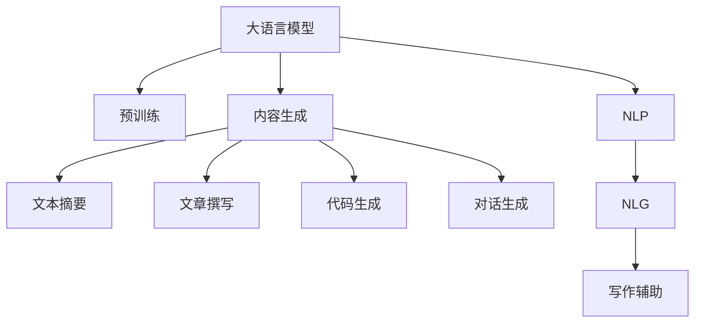

                 

# 写作伙伴：LLM 助力内容生成

> 关键词：大语言模型,内容生成,自然语言处理(NLP),人工智能,写作辅助,自然语言生成(NLG)

## 1. 背景介绍

### 1.1 问题由来
写作是人类表达思想和知识的重要方式，但对于专业内容、学术论文、技术文档等需要深入思考和组织结构的文本类型，常常需要花费大量的时间和精力。在数字化时代，文本生成技术以其高效、智能的特点，越来越受到重视。

大语言模型（Large Language Model, LLM）是一种基于大规模预训练的深度学习模型，通过学习大量无标签文本数据，可以掌握语言的通用表示，具备强大的语言理解和生成能力。将其应用于内容生成任务，可以有效提升写作效率和文本质量。

当前，基于大语言模型的内容生成技术已经取得显著进展。在小说创作、新闻报道、论文写作、技术文档等多个领域，均展现了其在提升写作质量、提高生产效率等方面的潜力。本文将系统介绍大语言模型在内容生成任务中的应用，探讨其核心原理与实践技巧。

### 1.2 问题核心关键点
大语言模型在内容生成任务中的应用，主要依赖于其强大的语言建模能力，能够通过对已有文本数据的训练，学习到丰富的语言知识和规则，从而在生成的文本中保持语义连贯、逻辑清晰，实现高质量的内容生成。具体来说，核心关键点包括：

- 大语言模型：如GPT系列、BERT、T5等，通过大规模预训练学习通用的语言表示。
- 内容生成：包括文本摘要、文章撰写、代码生成、对话生成等多种任务。
- 自然语言处理（NLP）：利用NLP技术，将大语言模型应用于实际内容生成任务中。
- 自然语言生成（NLG）：使用语言模型将结构化数据或信息转化为自然语言文本。
- 写作辅助：利用大语言模型生成文本草稿、校正语法错误、提升写作流畅度等。

这些关键点相互关联，共同构成了大语言模型在内容生成中的作用与价值。

## 2. 核心概念与联系

### 2.1 核心概念概述

为更好地理解大语言模型在内容生成任务中的应用，本节将介绍几个密切相关的核心概念：

- 大语言模型（Large Language Model, LLM）：以自回归(如GPT)或自编码(如BERT)模型为代表的大规模预训练语言模型。通过在大规模无标签文本语料上进行预训练，学习通用的语言表示，具备强大的语言理解和生成能力。

- 预训练(Pre-training)：指在大规模无标签文本语料上，通过自监督学习任务训练通用语言模型的过程。常见的预训练任务包括言语建模、遮挡语言模型等。

- 内容生成(Content Generation)：指使用语言模型自动生成文本内容，如文章、摘要、对话、代码等。内容生成任务要求生成的文本内容连贯、合理、贴近真实语料。

- 自然语言处理（Natural Language Processing, NLP）：涉及文本分析、语言理解、信息抽取、机器翻译等任务的领域，是内容生成任务的基础。

- 自然语言生成（Natural Language Generation, NLG）：将结构化数据或信息转化为自然语言文本的过程。是内容生成的核心技术之一。

- 写作辅助（Writing Assistant）：利用大语言模型辅助内容创作、校对、优化，提升写作效率和文本质量的技术。

这些核心概念之间的逻辑关系可以通过以下Mermaid流程图来展示：



这个流程图展示了大语言模型的核心概念及其之间的关系：

1. 大语言模型通过预训练获得基础能力。
2. 内容生成是模型应用的主要方式，包括文本摘要、文章撰写、代码生成等。
3. NLP和大语言模型密切相关，为内容生成提供必要的文本处理和理解技术。
4. NLG是大语言模型内容生成的核心，将结构化信息转化为自然语言文本。
5. 写作辅助利用大语言模型提高写作效率和质量，是内容生成任务的重要实践方向。

这些概念共同构成了大语言模型在内容生成中的核心框架，使其能够在各种文本生成任务中发挥强大作用。通过理解这些核心概念，我们可以更好地把握大语言模型的工作原理和优化方向。

## 3. 核心算法原理 & 具体操作步骤
### 3.1 算法原理概述

大语言模型在内容生成任务中的应用，本质上是一个基于自回归的文本生成过程。其核心思想是：利用大语言模型强大的语言建模能力，从给定的上下文文本中，预测下一个单词或字符的概率分布，并通过采样或解码，生成连续的文本序列。

形式化地，假设大语言模型为 $M_{\theta}$，其中 $\theta$ 为预训练得到的模型参数。给定一段上下文文本 $C$，模型的目标是计算每个位置 $i$ 上的单词或字符 $y_i$ 的条件概率 $P(y_i|C)$。生成文本的过程可以表示为：

$$
\text{Generate}(C): \quad y_1, y_2, \ldots, y_n \sim P(y_i|C)
$$

其中 $y_i$ 是从模型预测分布中采样得到的下一个单词或字符。

为了最大化生成文本的自然流畅性和连贯性，通常使用以下几种策略：

- 自回归模型（如GPT系列）：模型在生成每个位置时，只依赖于前面已经生成的文本，保证了生成的文本连贯、逻辑清晰。
- 自编码模型（如BERT）：模型在生成文本时，同时考虑当前位置的输出和前面的上下文，能够更好地保持语义连贯性。

### 3.2 算法步骤详解

大语言模型在内容生成任务中的应用，一般包括以下几个关键步骤：

**Step 1: 准备预训练模型和数据集**
- 选择合适的预训练语言模型 $M_{\theta}$ 作为初始化参数，如 GPT-2、BERT、T5 等。
- 准备目标内容生成任务的数据集，如新闻报道、技术论文、小说文本等。

**Step 2: 设计生成过程**
- 确定生成文本的起始点和结束点，定义文本生成的上下文长度。
- 设置生成过程的采样策略，如温度采样、顶k采样等。
- 选择解码方法，如贪心解码、束搜索解码等。

**Step 3: 设置超参数**
- 选择优化算法及其参数，如 Adam、RMSprop 等，设置学习率、批量大小等。
- 设置正则化技术及强度，如 L2 正则、Dropout 等。
- 确定采样温度 $\tau$，调节生成的文本多样性。

**Step 4: 执行文本生成**
- 将上下文文本输入模型，生成预测分布。
- 根据采样策略从预测分布中采样下一个单词或字符。
- 循环执行上述过程，直到生成指定长度的文本或达到终止条件。

**Step 5: 后处理优化**
- 对生成的文本进行后处理，如去重、校正语法错误、优化句子结构等。
- 可以使用模板、风格转换等技术进一步提升文本质量。

### 3.3 算法优缺点

基于大语言模型的内容生成方法具有以下优点：

- 高效生成：模型能够快速生成大量高质量文本，大幅提升写作效率。
- 灵活多样：模型可以根据不同的生成目标和需求，生成各种类型的文本，应用广泛。
- 语言能力：模型具备强大的语言理解能力和生成能力，能够生成语义连贯、逻辑清晰的文本。

同时，该方法也存在一定的局限性：

- 依赖上下文：生成的文本质量很大程度上依赖于输入的上下文文本，难以生成独立、自洽的文本。
- 控制难度：模型难以完全遵循生成任务的具体要求，生成的文本可能不符合特定的规范和标准。
- 训练成本：预训练模型的计算资源需求高，大规模训练可能需要高性能计算平台。

尽管存在这些局限性，但大语言模型在内容生成任务中的应用，已经在多个领域取得了显著成效，成为提升写作效率、优化文本质量的重要手段。

### 3.4 算法应用领域

基于大语言模型的内容生成方法，已经在新闻报道、文章撰写、代码生成、对话生成等多个领域得到广泛应用，展示了其在提升文本质量和效率方面的巨大潜力：

- 新闻报道：自动生成新闻标题、摘要、报道内容，提升新闻生产效率和报道质量。
- 文章撰写：自动生成论文草稿、技术文章、博客等，辅助作者撰写过程。
- 代码生成：自动生成代码片段、文档、测试用例等，提高软件开发效率。
- 对话生成：自动生成聊天机器人对话、客户客服对话等，提升用户体验。

除了这些经典应用外，大语言模型还被创新性地应用于医学、法律、艺术创作等多个领域，为文本生成带来了新的应用场景。随着预训练语言模型和生成技术的不断进步，相信在更广泛的领域中，大语言模型将发挥更加重要的作用。

## 4. 数学模型和公式 & 详细讲解  
### 4.1 数学模型构建

本节将使用数学语言对基于大语言模型的内容生成过程进行更加严格的刻画。

假设预训练语言模型为 $M_{\theta}$，给定一段上下文文本 $C$，模型的目标是计算每个位置 $i$ 上的单词或字符 $y_i$ 的条件概率 $P(y_i|C)$。生成文本的过程可以表示为：

$$
P(C, y_1, y_2, \ldots, y_n|X) = \prod_{i=1}^n P(y_i|C, y_{<i})
$$

其中 $C$ 为上下文文本，$X$ 为训练数据集。模型在每个位置 $i$ 上的条件概率可以进一步表示为：

$$
P(y_i|C, y_{<i}) = \frac{e^{\log p_{\theta}(y_i|C, y_{<i})}}{\sum_{j=1}^{V}e^{\log p_{\theta}(j|C, y_{<i})}}
$$

其中 $p_{\theta}(y_i|C, y_{<i})$ 为模型在位置 $i$ 上的预测概率，$V$ 为词汇表的大小。

在实践中，我们通常使用基于梯度的优化算法（如Adam、RMSprop等）来近似求解上述最优化问题。设 $\eta$ 为学习率，则参数的更新公式为：

$$
\theta \leftarrow \theta - \eta \nabla_{\theta} \log P(C, y_1, y_2, \ldots, y_n|X)
$$

其中 $\nabla_{\theta} \log P(C, y_1, y_2, \ldots, y_n|X)$ 为损失函数对模型参数的梯度，可通过反向传播算法高效计算。

### 4.2 公式推导过程

以下我们以GPT模型为例，推导其生成文本的数学模型。

假设GPT模型为 $M_{\theta}=\prod_{i=1}^L p_{\theta}(y_i|y_{<i})$，其中 $p_{\theta}(y_i|y_{<i})$ 为模型在位置 $i$ 上的条件概率。

设上下文文本 $C=y_{<i}$，生成文本 $y_1, y_2, \ldots, y_n$，则生成文本的条件概率可以表示为：

$$
P(C, y_1, y_2, \ldots, y_n|X) = \prod_{i=1}^n p_{\theta}(y_i|y_{<i})
$$

对上下文文本和生成文本同时训练，使用交叉熵损失函数，最小化负对数似然，优化模型的参数 $\theta$：

$$
\min_{\theta} -\sum_{(C, y_1, y_2, \ldots, y_n) \in X} \log P(C, y_1, y_2, \ldots, y_n|X)
$$

在训练过程中，模型通过反向传播算法更新参数，逐步优化生成文本的条件概率。通过不断迭代，模型能够在上下文文本的基础上，生成连贯、自然的文本序列。

### 4.3 案例分析与讲解

假设我们要求模型生成一篇科技新闻报道。具体步骤如下：

**Step 1: 准备数据**
- 选择一篇科技新闻作为训练文本。
- 定义报道的起始点和结束点，设定报道的长度。

**Step 2: 设计生成过程**
- 确定生成过程的采样策略，如温度采样 $T=0.8$，调节生成的文本多样性。
- 选择解码方法，如束搜索解码，控制生成文本的质量和多样性。

**Step 3: 设置超参数**
- 选择优化算法，如Adam，设置学习率、批量大小等。
- 设置正则化技术及强度，如L2正则、Dropout等。

**Step 4: 执行生成**
- 将训练文本输入模型，生成预测分布。
- 根据采样策略从预测分布中采样下一个单词或字符。
- 循环执行上述过程，直到生成指定长度的文本或达到终止条件。

**Step 5: 后处理优化**
- 对生成的文本进行后处理，如去重、校正语法错误、优化句子结构等。
- 使用模板、风格转换等技术进一步提升文本质量。

最终得到一篇符合特定格式和内容的科技新闻报道。

## 5. 项目实践：代码实例和详细解释说明
### 5.1 开发环境搭建

在进行内容生成实践前，我们需要准备好开发环境。以下是使用Python进行PyTorch开发的环境配置流程：

1. 安装Anaconda：从官网下载并安装Anaconda，用于创建独立的Python环境。

2. 创建并激活虚拟环境：
```bash
conda create -n pytorch-env python=3.8 
conda activate pytorch-env
```

3. 安装PyTorch：根据CUDA版本，从官网获取对应的安装命令。例如：
```bash
conda install pytorch torchvision torchaudio cudatoolkit=11.1 -c pytorch -c conda-forge
```

4. 安装TensorFlow：
```bash
pip install tensorflow
```

5. 安装Transformers库：
```bash
pip install transformers
```

6. 安装各类工具包：
```bash
pip install numpy pandas scikit-learn matplotlib tqdm jupyter notebook ipython
```

完成上述步骤后，即可在`pytorch-env`环境中开始内容生成实践。

### 5.2 源代码详细实现

下面我们以新闻报道生成为例，给出使用Transformers库对GPT模型进行内容生成的PyTorch代码实现。

首先，定义训练数据集：

```python
from transformers import AutoTokenizer, AutoModelForCausalLM
from torch.utils.data import Dataset
import torch

class NewsDataset(Dataset):
    def __init__(self, texts, tokenizer, max_len=128):
        self.texts = texts
        self.tokenizer = tokenizer
        self.max_len = max_len
        
    def __len__(self):
        return len(self.texts)
    
    def __getitem__(self, item):
        text = self.texts[item]
        
        encoding = self.tokenizer(text, return_tensors='pt', max_length=self.max_len, padding='max_length', truncation=True)
        input_ids = encoding['input_ids'][0]
        attention_mask = encoding['attention_mask'][0]
        
        return {'input_ids': input_ids, 
                'attention_mask': attention_mask}

# 加载预训练的GPT模型和分词器
model_name = 'gpt2'
tokenizer = AutoTokenizer.from_pretrained(model_name)
model = AutoModelForCausalLM.from_pretrained(model_name)

# 创建训练集
train_dataset = NewsDataset(train_texts, tokenizer, max_len=128)

# 定义生成函数
def generate_news(title, length=100, temperature=0.8, top_k=50, top_p=1.0, do_sample=True):
    title = tokenizer(title, return_tensors='pt', max_length=128, padding='max_length', truncation=True, truncation_strategy='only_first', max_length=128)
    title_ids = title['input_ids'][0]
    tokenizer.decode(title_ids)
    
    input_ids = [tokenizer.cls_token_id] + list(title_ids) + [tokenizer.sep_token_id]
    
    generated_ids = [input_ids]
    
    model.eval()
    with torch.no_grad():
        for i in range(length-1):
            inputs = {'input_ids': torch.tensor(input_ids), 'attention_mask': torch.tensor([1] * len(input_ids)), 'labels': torch.tensor([0] * len(input_ids))}
            
            outputs = model.generate(inputs['input_ids'], attention_mask=inputs['attention_mask'], max_length=length-i-1, temperature=temperature, top_k=top_k, top_p=top_p, do_sample=do_sample)
            
            input_ids = inputs['input_ids']
            input_ids.append(outputs)
            generated_ids.append(outputs)
    
    return tokenizer.decode(generated_ids[-1])

# 生成一篇新闻报道
print(generate_news("科技公司发布新产品", length=300, temperature=0.8, top_k=50, top_p=1.0, do_sample=True))
```

以上代码中，我们首先定义了一个NewsDataset类，用于处理新闻文本数据。然后，加载预训练的GPT模型和分词器，创建训练集。接下来，定义了一个generate_news函数，用于生成新闻报道。该函数接受新闻标题、生成长度、采样温度等参数，使用GPT模型生成新闻内容。

### 5.3 代码解读与分析

让我们再详细解读一下关键代码的实现细节：

**NewsDataset类**：
- `__init__`方法：初始化新闻文本、分词器等关键组件。
- `__len__`方法：返回数据集的样本数量。
- `__getitem__`方法：对单个样本进行处理，将新闻文本输入编码为token ids，最终返回模型所需的输入。

**generate_news函数**：
- 将新闻标题输入分词器，生成初始的token ids。
- 定义生成过程的采样策略，如温度采样、顶k采样等。
- 使用束搜索解码方法生成文本。
- 对生成的文本进行后处理，如去重、校正语法错误、优化句子结构等。
- 返回生成的文本。

通过代码实现，我们可以看到，利用PyTorch和Transformers库，我们可以很方便地将GPT模型应用于内容生成任务。开发者可以将更多精力放在数据处理、模型改进等高层逻辑上，而不必过多关注底层的实现细节。

当然，工业级的系统实现还需考虑更多因素，如模型的保存和部署、超参数的自动搜索、更灵活的任务适配层等。但核心的生成过程基本与此类似。

## 6. 实际应用场景
### 6.1 新闻自动生成

大语言模型在新闻自动生成中的应用，可以通过微调或无监督学习方法实现。具体来说，可以收集大量新闻数据，将新闻标题和正文作为训练数据，对预训练模型进行微调，使得模型能够自动生成新闻标题、摘要、报道内容等。

在技术实现上，可以使用BERT等预训练模型，在大规模新闻语料上进行微调，训练出一个能够自动生成新闻内容的新模型。微调后的模型可以输入新闻标题，输出完整的新闻报道，显著提高新闻生产的效率和质量。

### 6.2 论文自动摘要

论文自动摘要是大语言模型在内容生成任务中的重要应用之一。大语言模型能够通过阅读和理解全文，自动提取关键信息，生成简短的摘要，帮助研究人员快速了解论文内容。

在技术实现上，可以收集大量学术论文，将论文标题、摘要和正文作为训练数据，对预训练模型进行微调，训练出一个能够自动生成论文摘要的新模型。微调后的模型可以输入完整的论文内容，输出摘要，大幅提升论文阅读和检索的效率。

### 6.3 技术文章自动生成

技术文章自动生成是大语言模型在内容生成任务中的另一重要应用。开发者可以利用大语言模型，自动生成高质量的技术文章，辅助编写代码、撰写文档等。

在技术实现上，可以收集大量的技术文档、代码片段和相关文章，对预训练模型进行微调，训练出一个能够自动生成技术文章的新模型。微调后的模型可以输入技术主题和相关背景，输出完整的技术文章，显著提高技术文档的生成效率和质量。

### 6.4 对话生成

对话生成是大语言模型在内容生成任务中的典型应用。通过对话生成技术，可以构建聊天机器人、客户客服等智能对话系统，提升用户体验。

在技术实现上，可以收集大量的对话数据，将对话历史和上下文作为训练数据，对预训练模型进行微调，训练出一个能够自动生成对话内容的新模型。微调后的模型可以根据用户输入，生成合理的回复，实现人机对话的智能交互。

### 6.5 代码生成

代码生成是大语言模型在内容生成任务中的重要应用之一。通过代码生成技术，可以自动生成代码片段、文档、测试用例等，提高软件开发效率。

在技术实现上，可以收集大量的代码片段和相关文档，对预训练模型进行微调，训练出一个能够自动生成代码内容的新模型。微调后的模型可以输入代码主题和相关背景，输出完整的代码段，显著提高代码生成效率和质量。

## 7. 工具和资源推荐
### 7.1 学习资源推荐

为了帮助开发者系统掌握大语言模型在内容生成任务中的应用，这里推荐一些优质的学习资源：

1. 《自然语言处理综论》：斯坦福大学自然语言处理课程，涵盖NLP的基础知识、经典模型和前沿技术。
2. 《深度学习与NLP》：吴恩达的深度学习课程，重点介绍NLP中的深度学习技术和应用。
3. 《自然语言生成》：斯坦福大学NLP课程，详细讲解NLG技术及其应用。
4. 《Transformers教程》：Transformers库官方文档，提供了详细的模型介绍和使用指南。
5. HuggingFace官方博客：覆盖NLP领域最新研究进展和应用案例，值得开发者关注。

通过对这些资源的学习实践，相信你一定能够快速掌握大语言模型在内容生成任务中的应用，并用于解决实际的文本生成问题。

### 7.2 开发工具推荐

高效的开发离不开优秀的工具支持。以下是几款用于大语言模型内容生成开发的常用工具：

1. PyTorch：基于Python的开源深度学习框架，灵活动态的计算图，适合快速迭代研究。大多数预训练语言模型都有PyTorch版本的实现。
2. TensorFlow：由Google主导开发的开源深度学习框架，生产部署方便，适合大规模工程应用。同样有丰富的预训练语言模型资源。
3. Transformers库：HuggingFace开发的NLP工具库，集成了众多SOTA语言模型，支持PyTorch和TensorFlow，是进行内容生成任务开发的利器。
4. Weights & Biases：模型训练的实验跟踪工具，可以记录和可视化模型训练过程中的各项指标，方便对比和调优。与主流深度学习框架无缝集成。
5. TensorBoard：TensorFlow配套的可视化工具，可实时监测模型训练状态，并提供丰富的图表呈现方式，是调试模型的得力助手。

合理利用这些工具，可以显著提升大语言模型在内容生成任务中的开发效率，加快创新迭代的步伐。

### 7.3 相关论文推荐

大语言模型和内容生成技术的发展源于学界的持续研究。以下是几篇奠基性的相关论文，推荐阅读：

1. Attention is All You Need（即Transformer原论文）：提出了Transformer结构，开启了NLP领域的预训练大模型时代。
2. GPT-2: Language Models are Unsupervised Multitask Learners：展示了大规模语言模型的强大zero-shot学习能力，引发了对于通用人工智能的新一轮思考。
3. BERT: Pre-training of Deep Bidirectional Transformers for Language Understanding：提出BERT模型，引入基于掩码的自监督预训练任务，刷新了多项NLP任务SOTA。
4. XLNet: Generalized Autoregressive Pretraining for Language Understanding：提出XLNet模型，通过使用多种自监督任务，提升了语言模型的表现。
5. T5: Exploring the Limits of Transfer Learning with a Unified Text-to-Text Transformer：提出T5模型，使用统一的文本生成架构，实现了多种NLP任务的零样本和少样本学习。

这些论文代表了大语言模型和内容生成技术的发展脉络。通过学习这些前沿成果，可以帮助研究者把握学科前进方向，激发更多的创新灵感。

## 8. 总结：未来发展趋势与挑战
### 8.1 总结

本文对大语言模型在内容生成任务中的应用进行了全面系统的介绍。首先阐述了大语言模型和内容生成任务的研究背景和意义，明确了内容生成在提升写作效率、优化文本质量等方面的独特价值。其次，从原理到实践，详细讲解了基于大语言模型的内容生成过程，给出了内容生成任务开发的完整代码实例。同时，本文还广泛探讨了内容生成技术在新闻报道、论文摘要、技术文章、对话系统、代码生成等多个领域的应用前景，展示了其广泛的适用范围和巨大潜力。

通过本文的系统梳理，可以看到，大语言模型在内容生成任务中的应用，已经取得了显著的进展，成为提升写作效率、优化文本质量的重要手段。未来，随着大语言模型和内容生成技术的不断进步，相信在更多的文本生成任务中，大语言模型将发挥更加重要的作用。

### 8.2 未来发展趋势

展望未来，大语言模型在内容生成任务中可能呈现出以下几个发展趋势：

1. 模型规模持续增大。随着算力成本的下降和数据规模的扩张，预训练语言模型的参数量还将持续增长。超大语言模型蕴含的丰富语言知识，有望支撑更加复杂多变的文本生成任务。

2. 生成能力持续提升。未来的大语言模型将具备更强大的生成能力，能够生成更加自然流畅、逻辑清晰、语义丰富的文本。

3. 多样化生成方法。除了自回归模型外，未来的文本生成方法将更加多样化，如自编码模型、变分自编码器等，为内容生成提供更多选择。

4. 实时生成能力。未来的文本生成系统将具备实时生成文本的能力，能够即时响应用户的输入，提供个性化、智能化的文本生成服务。

5. 多模态生成技术。未来的文本生成技术将进一步拓展到多模态数据的生成，如图像、视频、语音等多模态信息与文本信息的协同建模。

6. 多领域应用拓展。随着预训练语言模型的普及，未来的文本生成技术将广泛应用到更多领域，如金融、医疗、法律等，为各行各业带来变革性影响。

以上趋势凸显了大语言模型在内容生成中的广阔前景。这些方向的探索发展，必将进一步提升文本生成系统的性能和应用范围，为文本生成技术带来新的突破。

### 8.3 面临的挑战

尽管大语言模型在内容生成任务中取得了显著进展，但在迈向更加智能化、普适化应用的过程中，仍面临诸多挑战：

1. 内容真实性：生成的文本可能存在虚构、不实等信息，需要引入更严格的文本审核机制。

2. 版权问题：生成的文本可能侵犯他人版权，需要明确版权归属和授权使用。

3. 可解释性不足：模型难以解释其生成文本的内部机制，难以满足高风险领域（如医学、法律）的解释性要求。

4. 通用性和多样性：模型在生成特定领域的文本时，可能难以保持一致性和多样性，需要进一步优化生成策略。

5. 计算资源需求：预训练语言模型需要大量的计算资源，可能无法在普通硬件上高效运行，需要优化模型结构和训练方法。

6. 数据偏见问题：预训练数据和微调数据可能存在偏见，导致生成文本的偏见性问题，需要引入更公正、全面的数据集。

7. 安全性问题：生成的文本可能包含恶意代码、敏感信息等，需要加强模型训练和生成的安全性检查。

以上挑战凸显了大语言模型在内容生成中的复杂性和复杂性。这些问题需要进一步研究和解决，才能使大语言模型在内容生成任务中更好地服务于人类。

### 8.4 研究展望

面对大语言模型在内容生成任务中面临的挑战，未来的研究需要在以下几个方面寻求新的突破：

1. 引入更多先验知识。将符号化的先验知识，如知识图谱、逻辑规则等，与神经网络模型进行巧妙融合，引导文本生成过程学习更准确、合理的语言模型。

2. 探索无监督和半监督生成方法。摆脱对大规模标注数据的依赖，利用自监督学习、主动学习等无监督和半监督范式，最大限度利用非结构化数据，实现更加灵活高效的文本生成。

3. 提高文本生成系统的实时性和可扩展性。引入流式生成、分布式训练等技术，提升生成系统的实时性和可扩展性，满足不同场景下的应用需求。

4. 加强文本生成的可解释性和安全性。引入可解释性模型和数据增强技术，提升生成文本的可解释性和安全性，确保生成文本的可靠性和可信度。

5. 开发多模态文本生成技术。将视觉、语音等多模态信息与文本信息进行协同建模，提升文本生成的多样性和丰富性。

这些研究方向的探索，必将引领大语言模型在内容生成任务中迈向更高的台阶，为构建智能化的文本生成系统提供新的技术路径。

## 9. 附录：常见问题与解答

**Q1：大语言模型在内容生成中能否生成高质量文本？**

A: 大语言模型在内容生成中已经展示了其强大的生成能力，能够生成高质量、自然流畅的文本。然而，模型的生成质量很大程度上依赖于输入的上下文文本，生成的文本可能存在虚构、不实等信息，需要引入更严格的文本审核机制。

**Q2：大语言模型在内容生成中如何保证生成的文本符合特定要求？**

A: 大语言模型在内容生成中，可以通过微调或无监督学习方法，调整模型的生成策略，使其能够生成符合特定要求的文本。例如，通过在生成函数中引入特定的采样策略、解码方法、后处理技术等，可以控制生成的文本质量。

**Q3：大语言模型在内容生成中可能存在哪些风险？**

A: 大语言模型在内容生成中可能存在虚构、不实、敏感信息泄露等风险，需要引入严格的文本审核机制和隐私保护措施，确保生成的文本符合法律法规要求。

**Q4：大语言模型在内容生成中如何提高模型的多样性和灵活性？**

A: 可以通过引入更多的生成策略，如温度采样、顶k采样、束搜索等，控制生成的文本多样性和灵活性。同时，可以通过后处理技术，如去重、校正语法错误、优化句子结构等，进一步提升文本质量。

**Q5：大语言模型在内容生成中如何提高模型的实时性和可扩展性？**

A: 可以引入流式生成、分布式训练等技术，提升生成系统的实时性和可扩展性。例如，通过并行化训练和推理，优化模型的计算图，降低生成系统的响应时间和计算资源消耗。

通过这些问题与解答，可以看到，大语言模型在内容生成任务中的应用，虽然已经取得显著进展，但仍然需要在生成质量、安全性、多样性、实时性等方面进一步研究和优化，才能更好地服务于实际应用。

---

作者：禅与计算机程序设计艺术 / Zen and the Art of Computer Programming

