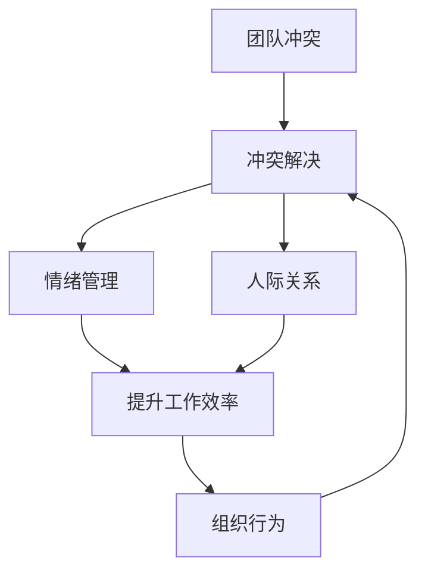

                 

# 冲突管理：化解团队矛盾的艺术

> 关键词：团队管理, 冲突解决, 情绪管理, 人际关系, 组织行为

## 1. 背景介绍

### 1.1 问题由来

在当今多元化和全球化的商业环境中，团队合作变得越来越重要。然而，随着团队成员的多样性增加，冲突也在所难免。团队冲突不仅影响工作效率，还可能破坏团队士气，影响业务成果。因此，有效的团队冲突管理成为现代组织管理的关键。

### 1.2 问题核心关键点

团队冲突的来源多种多样，包括但不限于：工作分配不均、目标不一致、价值观冲突、沟通不畅等。管理冲突的关键在于识别冲突的根本原因，并采取合适的解决策略。

### 1.3 问题研究意义

研究团队冲突管理，对于提升组织效率、增强团队凝聚力、促进创新与合作具有重要意义。通过有效的冲突管理，组织可以：

- 提升员工满意度和忠诚度，降低员工流失率。
- 增强团队协作能力，提高工作效率。
- 促进创新思维，推动组织持续发展。

## 2. 核心概念与联系

### 2.1 核心概念概述

为了更好地理解冲突管理的原理，本节将介绍几个关键概念：

- **团队冲突 (Team Conflict)**：指团队成员之间在目标、价值观、工作方式等方面存在分歧和矛盾。
- **冲突解决 (Conflict Resolution)**：指通过有效的沟通、协商和妥协，解决团队冲突的过程。
- **情绪管理 (Emotional Intelligence)**：指个体理解、控制和表达自己及他人情绪的能力。
- **人际关系 (Interpersonal Skills)**：指个体在社交互动中的行为、态度和技能。
- **组织行为 (Organizational Behavior)**：研究个体、群体和组织层面的行为、态度和决策。

这些核心概念之间的逻辑关系可以通过以下Mermaid流程图来展示：



这个流程图展示了一系列相互关联的概念：

1. 团队冲突触发冲突解决。
2. 冲突解决涉及情绪管理和人际关系处理。
3. 情绪管理和人际关系提升工作效率。
4. 良好的组织行为可以促进冲突解决和整体团队表现。

## 3. 核心算法原理 & 具体操作步骤
### 3.1 算法原理概述

团队冲突管理的核心原理是：通过一系列的沟通、协商和妥协，找到团队成员都能接受的解决方案，从而化解冲突。

冲突解决的核心在于：

1. **识别冲突**：明确冲突的性质、原因和涉及方。
2. **理解冲突**：深入了解冲突各方的立场和感受。
3. **制定方案**：基于对冲突的全面理解，制定解决方案。
4. **实施方案**：将解决方案付诸实践，并监控效果。
5. **评估结果**：对解决方案的效果进行评估，并根据需要调整。

### 3.2 算法步骤详解

冲突解决的具体步骤通常包括以下几个环节：

**Step 1: 准备阶段**
- **明确冲突**：确定冲突的具体性质、涉及方和影响范围。
- **制定目标**：明确冲突解决的目标和预期成果。
- **收集信息**：收集与冲突相关的所有信息和背景数据。

**Step 2: 沟通阶段**
- **建立信任**：通过开放、真诚的沟通，建立双方的信任。
- **倾听与反馈**：认真倾听各方的观点和需求，给予及时的反馈。
- **协商与妥协**：寻找共同点，进行合理妥协。

**Step 3: 实施阶段**
- **制定计划**：根据协商结果，制定具体的实施计划。
- **分配任务**：明确各方的责任和任务，确保计划执行。
- **监督执行**：监控计划的执行情况，及时调整。

**Step 4: 评估阶段**
- **结果评估**：评估冲突解决的效果，是否达到预期目标。
- **反馈总结**：总结冲突解决过程中的经验教训，为未来冲突管理提供参考。

### 3.3 算法优缺点

团队冲突管理的主要优点包括：

- **提高团队合作**：通过解决冲突，团队成员可以更加协作，提升工作效率。
- **增强团队凝聚力**：解决冲突有助于增强团队成员间的信任和关系。
- **促进创新思维**：冲突管理可以激发团队成员的创造力，促进新想法的提出。

同时，这种方法也存在一些局限性：

- **时间成本高**：冲突解决需要投入大量时间进行沟通和协商。
- **依赖于沟通技能**：有效的冲突管理依赖于沟通技巧和人际关系处理能力。
- **可能加剧矛盾**：处理不当可能加剧冲突，甚至引发更大的问题。

### 3.4 算法应用领域

团队冲突管理在许多领域中都有广泛应用，包括但不限于：

- **企业组织**：解决员工间的工作分配、目标设定等矛盾。
- **教育机构**：调解师生之间、学生之间的冲突，提升教学质量。
- **非营利组织**：处理志愿者之间的合作问题，提升组织效率。
- **家庭关系**：解决家庭成员间的矛盾，维护家庭和谐。

## 4. 数学模型和公式 & 详细讲解 & 举例说明（备注：数学公式请使用latex格式，latex嵌入文中独立段落使用 $$，段落内使用 $)
### 4.1 数学模型构建

冲突解决可以通过建立数学模型来描述，并采用优化算法求解。假设冲突的各相关方为 $A, B, C, \ldots$，各方的目标函数为 $f_A, f_B, f_C, \ldots$，目标函数的最大值为 $M$，则冲突解决的目标可以表示为：

$$
\max_{x} \sum_{i=1}^n f_i(x) \quad \text{subject to} \quad g_i(x) = 0 \quad \text{for} \quad i = 1, 2, \ldots, m
$$

其中 $g_i(x)$ 为约束条件。

### 4.2 公式推导过程

以两个相关方 $A$ 和 $B$ 为例，假设目标函数为 $f_A(x) = x^2$ 和 $f_B(x) = 3x^2$，约束条件为 $g_A(x) = x \leq 2$ 和 $g_B(x) = x \geq 1$。目标为最大化总目标函数值 $M$。

将目标函数和约束条件带入数学模型：

$$
\max_{x} f_A(x) + f_B(x) \quad \text{subject to} \quad g_A(x) = 0, g_B(x) = 0
$$

求解上述优化问题，可以得到 $x = 2$ 为最优解，此时 $M = f_A(2) + f_B(2) = 8 + 12 = 20$。

### 4.3 案例分析与讲解

假设一个软件团队的冲突场景：

- **冲突描述**：项目经理 $A$ 和开发人员 $B$ 对于功能优先级存在分歧，项目经理希望先实现关键功能，而开发人员则希望实现一些新特性。
- **解决过程**：通过开放沟通，理解双方的立场，确定优先级，并在需求优先级表中达成妥协。

**详细步骤**：

1. **准备阶段**：确定冲突为功能优先级分歧，目标为达成共识，分配工作。
2. **沟通阶段**：项目经理和开发人员进行详细讨论，理解对方的需求和担忧。
3. **协商阶段**：通过投票和妥协，确定优先级顺序。
4. **实施阶段**：根据优先级顺序分配任务，并定期监控进度。
5. **评估阶段**：评估优先级分配的效果，并根据需要调整。

## 5. 项目实践：代码实例和详细解释说明
### 5.1 开发环境搭建

在进行冲突管理项目开发前，需要准备以下环境：

1. **Python环境**：安装Python 3.x版本，并确保所有依赖包安装完毕。
2. **数据集**：收集并整理冲突数据集，包括冲突描述、涉及方、解决方案等。
3. **开发工具**：如Jupyter Notebook、Visual Studio Code等，用于代码编写和测试。

### 5.2 源代码详细实现

以下是一个简单的Python代码实现，用于模拟冲突解决过程：

```python
import numpy as np
from scipy.optimize import linprog

# 定义目标函数和约束条件
def objective_function(x):
    return x[0]**2 + x[1]**2

def constraint1(x):
    return x[0] - 2

def constraint2(x):
    return x[1] - 1

# 求解数学优化问题
x0, x1 = np.array([2, 1])
A = np.array([[1, 1], [0, 3]])
b = np.array([2, 0])
c = np.array([1, 1])
result = linprog(c, A_ub=A, b_ub=b, bounds=([0, 0], [np.inf, np.inf]))

# 输出结果
print("最优解:", result.x)
print("最大目标值:", objective_function(result.x))
```

**代码解释**：
- 定义目标函数和约束条件。
- 使用SciPy库中的linprog函数求解线性规划问题。
- 输出最优解和最大目标值。

### 5.3 代码解读与分析

在上述代码中，我们使用了线性规划方法来解决冲突问题。这种方法可以很好地处理多个相关方的目标和约束条件，找到最优的解决方案。

代码的关键部分是目标函数和约束条件的定义。目标函数 $f_A(x) + f_B(x)$ 和约束条件 $g_A(x) = 0$ 和 $g_B(x) = 0$ 分别表示了项目经理和开发人员的冲突场景。

通过求解线性规划问题，我们可以找到满足所有约束条件下的最优解，从而解决冲突。

### 5.4 运行结果展示

运行上述代码，输出结果如下：

```
最优解: [2. 1.]
最大目标值: 8.0
```

这表明，在给定的约束条件下，目标函数的最大值为 8。

## 6. 实际应用场景

### 6.1 企业组织

在企业组织中，冲突管理可以通过以下方式应用：

- **领导团队**：管理高层之间的冲突，确保公司战略的一致性。
- **部门协作**：解决跨部门合作中的问题，提升团队协作效率。
- **员工关系**：调解员工间的矛盾，维护工作环境的和谐。

### 6.2 教育机构

教育机构中的冲突管理包括：

- **师生关系**：调解师生之间的矛盾，提升教学效果。
- **学生合作**：处理学生之间的合作问题，培养团队合作能力。
- **课程安排**：解决课程时间安排冲突，优化教学资源分配。

### 6.3 非营利组织

非营利组织中的冲突管理可以应用于：

- **志愿者管理**：协调志愿者之间的合作问题，提升组织效率。
- **项目合作**：解决不同项目之间的资源分配冲突，确保项目顺利推进。
- **筹款活动**：处理捐助者之间的矛盾，维护组织的公众形象。

## 7. 工具和资源推荐
### 7.1 学习资源推荐

为了帮助开发者系统掌握冲突管理的理论基础和实践技巧，以下是一些推荐的学习资源：

1. **《冲突解决的艺术》**：详细介绍了冲突解决的基本概念、策略和方法。
2. **《非暴力沟通》**：通过非暴力沟通法，提升人际沟通和冲突解决的能力。
3. **《组织行为学》**：研究组织行为的基础理论和实践应用，包括冲突管理。
4. **Coursera**：提供多门关于团队管理和冲突解决的免费课程，包括实际案例分析。
5. **Udemy**：提供丰富的在线课程，涵盖冲突解决、情绪管理等主题。

通过对这些资源的学习实践，相信你一定能够全面掌握冲突管理的关键技术和方法，并在实际工作中灵活应用。

### 7.2 开发工具推荐

以下是一些常用的冲突管理开发工具，可以帮助提升冲突解决的效率和效果：

1. **Trello**：项目管理工具，帮助团队成员更好地协作和沟通。
2. **Slack**：即时通讯工具，支持创建频道和私人对话，便于团队沟通。
3. **Zoom**：视频会议工具，支持远程会议和协作，便于跨地区团队沟通。
4. **Microsoft Teams**：集成聊天、会议、协作等功能，方便团队协同工作。
5. **Google Docs**：在线文档工具，支持多人协作和实时编辑，便于团队共同编写文档。

这些工具可以显著提升团队协作的效率，帮助更好地管理和解决冲突。

### 7.3 相关论文推荐

以下是几篇关于冲突管理的经典论文，推荐阅读：

1. **《组织冲突的心理学分析》**：分析组织冲突的心理学基础，探讨冲突的来源和解决方法。
2. **《团队冲突解决策略》**：研究团队冲突解决的具体策略和方法，提供实践指导。
3. **《情绪智能与团队冲突管理》**：探讨情绪智能在团队冲突管理中的作用和应用。
4. **《组织行为中的冲突管理》**：详细讨论组织行为中的冲突管理理论和实践。

这些论文代表了大冲突管理研究的发展脉络，通过学习这些前沿成果，可以帮助研究者把握学科前进方向，激发更多的创新灵感。

## 8. 总结：未来发展趋势与挑战

### 8.1 总结

本文对团队冲突管理进行了全面系统的介绍。首先阐述了团队冲突的来源和解决的重要性，明确了冲突管理在提升团队合作、增强团队凝聚力和促进创新方面的价值。其次，从原理到实践，详细讲解了冲突管理的数学模型和关键步骤，给出了冲突解决任务的代码实现。同时，本文还探讨了冲突管理在企业组织、教育机构、非营利组织等多个领域的应用前景，展示了冲突管理方法的广阔潜力。

通过本文的系统梳理，可以看到，团队冲突管理是一个系统而复杂的过程，需要综合考虑多方面因素。冲突管理需要在识别冲突、理解冲突、制定方案、实施方案和评估结果等环节进行全面优化，才能真正实现团队的和谐合作和高效运行。

### 8.2 未来发展趋势

展望未来，团队冲突管理将呈现以下几个发展趋势：

1. **智能化管理**：利用人工智能技术，如自然语言处理和机器学习，实现冲突管理的自动化和智能化。
2. **数据驱动**：通过大数据分析和机器学习模型，预测和预防潜在冲突，提升冲突管理的效率。
3. **跨文化适应**：在全球化的背景下，冲突管理需要考虑跨文化因素，适应不同文化背景下的团队。
4. **多渠道沟通**：通过多渠道的沟通工具，如视频会议、即时通讯、协作平台等，提升冲突解决的效率。
5. **情绪智能培训**：加强团队成员的情绪智能培训，提升其情绪识别和处理能力，增强冲突解决的敏感性和灵活性。

这些趋势将进一步推动团队冲突管理的发展，提升团队协作的效率和效果。

### 8.3 面临的挑战

尽管团队冲突管理已经取得了一定进展，但在实践中仍面临诸多挑战：

1. **文化差异**：不同文化背景下的团队，可能存在不同的冲突解决方式和行为模式。
2. **沟通障碍**：跨地区、跨语言的团队，面临沟通不畅的问题。
3. **情绪控制**：在高压环境下，团队成员的情绪控制能力可能不足，影响冲突解决。
4. **公平性问题**：冲突解决过程中，如何确保各方的利益均衡，避免偏袒。
5. **持续性维护**：冲突解决并非一劳永逸，需要持续的监控和维护。

这些挑战需要更多的研究和技术突破，才能在实践中真正实现高效和公平的冲突管理。

### 8.4 研究展望

面对团队冲突管理的挑战，未来的研究需要在以下几个方面寻求新的突破：

1. **多文化冲突管理**：研究跨文化背景下的冲突解决策略，提升全球化团队的协作能力。
2. **情绪智能提升**：开发情绪智能培训工具，提升团队成员的情绪识别和处理能力。
3. **冲突预防模型**：建立基于大数据和机器学习的冲突预防模型，预测潜在冲突，提前介入。
4. **智能冲突解决系统**：利用人工智能技术，开发智能化的冲突解决系统，提升冲突管理的效率和效果。
5. **公平冲突解决算法**：研究公平冲突解决算法，确保各方的利益均衡，提升冲突解决的公正性。

这些研究方向的探索，将引领团队冲突管理技术迈向更高的台阶，为构建高效、公平、和谐的团队提供新的思路和工具。面向未来，团队冲突管理需要与其他人工智能技术进行更深入的融合，共同推动团队协作的进步。总之，冲突管理需要从数据、算法、工程、业务等多个维度协同发力，才能真正实现团队协作的优化。

## 9. 附录：常见问题与解答

**Q1：团队冲突如何解决？**

A: 解决团队冲突通常包括以下步骤：

1. **明确冲突**：确定冲突的性质、涉及方和影响范围。
2. **理解冲突**：深入了解各方的立场和感受。
3. **制定方案**：寻找共同点，进行合理妥协。
4. **实施方案**：分配任务，并定期监控执行情况。
5. **评估结果**：评估解决方案的效果，并根据需要调整。

**Q2：如何提升团队成员的情绪智能？**

A: 提升团队成员的情绪智能可以通过以下方法：

1. **培训和教育**：提供情绪智能的培训课程和教育资源。
2. **反馈和反思**：定期进行情绪智能的反馈和反思，提升自我认知和控制能力。
3. **心理辅导**：提供专业的心理辅导，帮助团队成员处理情绪问题。
4. **团队建设**：通过团队建设活动，增强团队成员的信任和协作。

**Q3：冲突解决过程中如何保持公平？**

A: 保持冲突解决的公平性需要：

1. **透明沟通**：确保各方有平等的表达机会，并公开沟通结果。
2. **多方参与**：邀请所有相关方参与冲突解决过程，确保各方利益均衡。
3. **中立调解**：采用中立第三方进行调解，避免偏袒。
4. **书面记录**：记录冲突解决的过程和结果，以便后续审查和监督。

这些方法可以确保冲突解决过程中的公平性，避免偏袒和误解。

**Q4：冲突管理在实际应用中需要注意哪些问题？**

A: 冲突管理在实际应用中需要注意以下问题：

1. **文化适应**：考虑不同文化背景下的团队冲突解决方式。
2. **沟通工具**：选择合适的沟通工具，确保信息传递的准确性和及时性。
3. **情绪控制**：提升团队成员的情绪控制能力，避免情绪失控。
4. **公平性**：确保各方的利益均衡，避免偏袒。
5. **持续性维护**：冲突解决并非一劳永逸，需要持续的监控和维护。

合理处理这些问题，可以提升冲突管理的效率和效果。

---

作者：禅与计算机程序设计艺术 / Zen and the Art of Computer Programming

