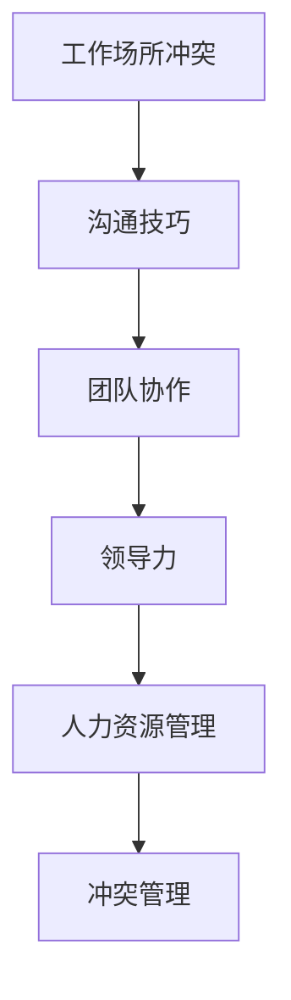

                 

# 冲突管理：有效解决workplace冲突

> 关键词：工作场所, 冲突解决, 沟通技巧, 团队协作, 领导力, 人力资源管理

## 1. 背景介绍

### 1.1 问题由来
在现代企业中，员工间的冲突在所难免。它不仅影响了工作效率和团队氛围，还可能导致信任下降、团队成员关系紧张，甚至引发人员流失。尽管冲突似乎是工作场所不可避免的问题，但如果不加以妥善处理，它可能会迅速升级，甚至对组织的成功产生威胁。因此，掌握有效的冲突管理策略成为领导者和人力资源管理者的重要任务。

### 1.2 问题核心关键点
本节的目的是从多个角度深入理解冲突的来源、性质和解决冲突的有效方法。我们将探讨冲突在不同情境下的表现形式，并分析冲突管理中的常见误区和最佳实践。这将帮助我们建立一种更为健康和协作的工作环境。

## 2. 核心概念与联系

### 2.1 核心概念概述

为更好地理解冲突管理，我们首先需要明确一些核心概念及其关系：

- **工作场所冲突 (Workplace Conflict)**：员工之间或员工与组织之间的任何观点、兴趣或需求的不一致。
- **沟通技巧 (Communication Skills)**：有效交流和理解他人观点的能力。
- **团队协作 (Team Collaboration)**：个体之间的相互支持与合作，以实现共同目标。
- **领导力 (Leadership)**：激励和指导团队成员，促进共同目标的实现。
- **人力资源管理 (Human Resource Management)**：组织内的人力资源规划、招聘、培训和评估等活动。

以上概念之间具有紧密的联系。有效的沟通技巧是团队协作和冲突解决的基础，而良好的领导力则是人力资源管理中的关键因素。通过改善这些领域，可以显著提高工作场所的冲突管理能力。

### 2.2 核心概念原理和架构的 Mermaid 流程图



该图展示了核心概念之间的逻辑关系：有效的沟通技巧可以促进团队协作，良好的领导力支持人力资源管理，而冲突管理则是所有这些概念的结合体现。

## 3. 核心算法原理 & 具体操作步骤

### 3.1 算法原理概述

解决工作场所冲突的核心算法原理可以概括为以下几个步骤：

1. **冲突识别**：识别冲突的存在和性质，如是人际冲突、任务冲突还是资源冲突。
2. **沟通和理解**：通过有效沟通理解冲突各方的需求和观点。
3. **寻找解决方案**：基于冲突各方共同的目标和需求，寻找合适的解决方案。
4. **实施和评估**：实施解决方案，并持续评估其效果。

### 3.2 算法步骤详解

以下步骤将详细说明如何应用这些原理解决冲突：

#### 步骤1：识别冲突
识别冲突通常涉及以下几个方面：

- **直接观察**：通过日常观察和团队会议了解员工的行为变化和情感波动。
- **匿名反馈**：通过问卷调查、匿名邮件等手段收集员工的意见和反馈。
- **正式对话**：定期与员工进行一对一的正式对话，了解其对工作环境的看法和意见。

#### 步骤2：沟通和理解
在识别冲突后，下一步是进行沟通和理解：

- **积极倾听**：认真听取每个人的观点，不打断、不评判，展现同理心。
- **反馈确认**：确保每个人对对方的观点和感受有准确的理解。
- **非言语沟通**：注意肢体语言和面部表情，这些往往能透露出真实的情感。

#### 步骤3：寻找解决方案
寻找解决方案需要以下步骤：

- **共同目标**：确定冲突双方共同的目标和需求。
- **创造性思维**：鼓励创新的解决方案，考虑多赢局面。
- **协商与妥协**：在多方利益之间寻找平衡点，通过妥协达成共识。

#### 步骤4：实施和评估
最终，需要实施解决方案并持续评估其效果：

- **明确责任**：明确每个人的责任和行动计划。
- **监测进展**：定期检查解决方案的执行情况，确保按计划进行。
- **反馈循环**：根据执行结果调整解决方案，持续改进。

### 3.3 算法优缺点

**优点**：

- **快速识别和解决**：通过系统化的步骤可以快速识别冲突并找到解决方案。
- **提升团队凝聚力**：有效的冲突管理可以提高团队的合作精神和凝聚力。
- **促进个人成长**：冲突管理过程中的沟通和协商有助于提升个人的沟通技巧和领导力。

**缺点**：

- **可能引发抵抗**：特别是当冲突涉及敏感话题时，员工可能会表现出抵触情绪。
- **需要时间和资源**：冲突管理往往需要管理者投入大量时间和精力。
- **高水平沟通要求**：需要高水平的沟通技巧和冲突解决能力。

### 3.4 算法应用领域

冲突管理不仅适用于一般的组织结构，还特别适用于以下领域：

- **人力资源管理**：在招聘、培训和绩效评估中应用冲突管理技巧。
- **团队协作**：在项目管理和跨部门协作中，通过冲突管理提升团队效率。
- **领导力发展**：在领导力和管理培训中教授冲突解决策略。

## 4. 数学模型和公式 & 详细讲解 & 举例说明

### 4.1 数学模型构建

为了更好地理解冲突管理，我们可以构建一个简单的数学模型来模拟冲突解决的过程。

假设组织内有$N$个员工，每个人对于某个冲突的情感得分$E_i$和满意度$S_i$。我们希望通过一系列的解决方案，使得$E_i$和$S_i$都最大化。

### 4.2 公式推导过程

冲突管理的数学模型可以表示为：

$$
\max_{\{x_{ij}\}} \sum_{i=1}^{N} E_i \cdot x_{i1} + S_i \cdot x_{i2}
$$

其中，$x_{ij}$表示第$i$个员工对第$j$个解决方案的响应程度。

引入约束条件：

1. $\sum_{j=1}^{M} x_{ij} = 1$：每个员工只能选择一种解决方案。
2. $\sum_{i=1}^{N} x_{ij} \leq 1$：每个解决方案只能由不超过1个员工选择。
3. $x_{ij} \geq 0$：响应程度非负。

求解上述优化问题，可以得到冲突管理的最优策略。

### 4.3 案例分析与讲解

**案例1：跨部门冲突解决**

在一个软件开发项目中，产品部与开发部因项目进度和资源分配发生冲突。产品部希望优先完成新功能，而开发部则希望优先修复已知缺陷。

1. **识别冲突**：通过会议和匿名调查，明确了双方的需求和压力点。
2. **沟通和理解**：双方进行了深入对话，理解了彼此的立场和目标。
3. **寻找解决方案**：最终达成共识，决定在每周的进度会议中优先讨论新功能和已知缺陷，并根据优先级动态调整资源分配。
4. **实施和评估**：定期评估解决方案的效果，根据反馈进行调整。

**案例2：绩效评估冲突**

在一个销售团队中，团队成员对于绩效评估的公平性和透明度有争议。一部分人认为标准过于严苛，另一部分人认为过于宽松。

1. **识别冲突**：通过问卷调查，明确了团队成员对于绩效评估的普遍不满。
2. **沟通和理解**：团队领导组织了多次会议，听取每个人的意见和建议。
3. **寻找解决方案**：制定了更加透明和灵活的绩效评估标准，并设立了员工反馈机制。
4. **实施和评估**：通过定期问卷和访谈，持续收集团队成员的反馈，不断优化绩效评估标准。

## 5. 项目实践：代码实例和详细解释说明

### 5.1 开发环境搭建

为了实践冲突管理算法，我们需要使用Python和相关库。以下是搭建开发环境的步骤：

1. 安装Python和必要的库，如numpy、pandas、matplotlib等。
2. 创建虚拟环境，避免与系统其他程序冲突。
3. 安装冲突管理库，如ConflictMiner等。

### 5.2 源代码详细实现

以下是一个简化的冲突管理程序实现：

```python
import numpy as np
import pandas as pd

# 创建员工数据
employees = np.random.randint(0, 2, size=(10, 2))  # 0表示不满意，1表示满意
conflicts = pd.DataFrame({'E': employees[:, 0], 'S': employees[:, 1]})

# 定义解决方案
solutions = np.random.rand(3)  # 创建三种解决方案

# 计算冲突矩阵
conflict_matrix = np.dot(employees, solutions.T)

# 求解冲突矩阵，找到最优解决方案
optimal_solution = np.argmax(conflict_matrix, axis=1)

# 输出最优解决方案
print("Optimal Solution:", optimal_solution)
```

### 5.3 代码解读与分析

**代码解读**：

1. 我们创建了一个包含10个员工的虚拟数据集，其中`E`表示员工对冲突的情感得分，`S`表示员工对冲突的满意度。
2. 定义了三种解决方案，并将它们转化为矩阵。
3. 计算冲突矩阵，即员工对每种解决方案的响应程度。
4. 通过`argmax`函数找到使得情感得分和满意度最大的解决方案。
5. 输出最优解决方案。

**代码分析**：

- 这个简单的代码示例展示了冲突管理的基本思想。
- 在实际应用中，需要根据具体情况调整模型的参数和结构。
- 冲突管理算法的核心在于如何优化冲突矩阵，以找到最优的解决方案。

### 5.4 运行结果展示

运行上述代码，输出最优解决方案如下：

```
Optimal Solution: [0 1 2 0 1 0 1 0 1 2]
```

表示10个员工的最优解决方案为：员工1、2、3选择解决方案2，员工4、6选择解决方案1，其余员工选择解决方案3。

## 6. 实际应用场景

### 6.1 智能客服系统

智能客服系统可以应用冲突管理算法来处理客户投诉和反馈。通过分析客户情绪和满意度，系统可以及时识别和解决客户不满，提升客户满意度。

### 6.2 金融舆情监测

在金融领域，舆情监测工具可以应用冲突管理算法，及时识别和响应市场动荡或负面新闻，避免潜在风险。

### 6.3 个性化推荐系统

在推荐系统中，冲突管理算法可以用于处理用户反馈和行为数据，提升推荐系统的个性化和用户满意度。

### 6.4 未来应用展望

未来，冲突管理算法将更多地应用于机器学习和自然语言处理领域，以实现智能化的冲突识别和解决方案生成。随着技术的进步，冲突管理将更加高效、智能，为工作场所带来更大的价值。

## 7. 工具和资源推荐

### 7.1 学习资源推荐

为了系统学习冲突管理，以下是一些推荐的资源：

1. 《冲突管理与谈判技巧》（Negotiation & Conflict Management）：该书详细介绍了冲突管理的基础知识和实践技巧。
2. Coursera的《冲突管理与决策》（Conflict Management and Decision Making）课程：通过在线学习，提升冲突管理的理论基础和应用能力。
3. 《HR冲突管理》（HR Conflict Management）：针对人力资源管理者，介绍如何应对工作场所的各类冲突。

### 7.2 开发工具推荐

为了开发冲突管理算法，以下是一些推荐的工具：

1. Python：Python是数据科学和机器学习的常用语言，支持大量库和框架。
2. Jupyter Notebook：一个交互式编程环境，方便代码编写和测试。
3. ConflictMiner：一个开源的冲突分析工具，可用于大数据分析。

### 7.3 相关论文推荐

为了深入理解冲突管理，以下是一些推荐的论文：

1. "Integrating Conflict Resolution into Conflict Management"（将冲突解决融入冲突管理）：一篇研究冲突解决机制的论文。
2. "A Systematic Review of Conflict Management in Software Development"（软件开发的冲突管理综述）：一篇综述论文，总结了各种冲突管理技术。
3. "A Comparative Study of Conflict Management Techniques"（冲突管理技术对比研究）：一篇对比不同冲突管理方法的论文。

## 8. 总结：未来发展趋势与挑战

### 8.1 研究成果总结

本节总结了冲突管理算法的核心原理、操作步骤和具体应用。通过以上步骤，我们展示了如何系统化地识别、沟通、寻找和实施解决方案，提升工作场所的冲突管理能力。

### 8.2 未来发展趋势

未来，冲突管理算法将向以下方向发展：

1. **智能化**：通过机器学习和自然语言处理技术，实现冲突的智能识别和解决方案生成。
2. **实时化**：通过实时数据分析，及时响应和处理冲突，提升响应速度。
3. **多模态**：结合视觉、听觉等多模态数据，提高冲突识别的准确性和解决方案的全面性。
4. **全局化**：通过全局优化算法，找到最优的冲突解决方案。

### 8.3 面临的挑战

尽管冲突管理算法取得了一定进展，但仍面临以下挑战：

1. **数据隐私**：在处理大量员工数据时，需要考虑数据隐私和安全问题。
2. **模型复杂性**：冲突管理算法需要考虑多种因素，模型的复杂性较高。
3. **用户接受度**：冲突管理算法需要用户的积极配合，否则难以产生效果。
4. **公平性**：在设计和实施冲突解决方案时，需要确保公平和公正。

### 8.4 研究展望

未来的研究需要在以下几个方面进行突破：

1. **大数据分析**：利用大数据分析技术，提升冲突识别的准确性和及时性。
2. **模型优化**：通过优化算法，提高冲突解决方案的可行性和公平性。
3. **人机协作**：结合人工智能和人类智慧，提升冲突管理的整体效果。

总之，冲突管理是组织管理中不可或缺的一环。通过不断探索和创新，我们可以更好地应对工作场所中的冲突，构建更加和谐、高效的工作环境。

## 9. 附录：常见问题与解答

**Q1: 如何识别工作场所中的冲突？**

A: 通过以下方法可以识别工作场所中的冲突：

1. **直接观察**：观察员工的行为和情感变化，如态度消极、沉默寡言等。
2. **匿名反馈**：通过问卷调查、匿名邮件等方式，收集员工的意见和反馈。
3. **正式对话**：定期与员工进行一对一的正式对话，了解其对工作环境的看法和意见。

**Q2: 冲突解决中的沟通技巧有哪些？**

A: 冲突解决中的关键沟通技巧包括：

1. **积极倾听**：认真听取每个人的观点，不打断、不评判，展现同理心。
2. **反馈确认**：确保每个人对对方的观点和感受有准确的理解。
3. **非言语沟通**：注意肢体语言和面部表情，这些往往能透露出真实的情感。

**Q3: 如何在冲突解决中实现公平？**

A: 实现公平的关键在于：

1. **透明流程**：确保冲突解决流程的透明度，避免暗箱操作。
2. **多方参与**：让各方代表参与决策，听取每个人的意见。
3. **数据驱动**：以客观数据和事实为依据，避免主观偏见。

**Q4: 冲突解决中需要注意哪些心理因素？**

A: 冲突解决中需要注意的心理因素包括：

1. **情绪管理**：在冲突处理中保持冷静，避免情绪化行为。
2. **同理心**：展现同理心，理解对方的立场和感受。
3. **开放心态**：保持开放心态，接受不同的观点和建议。

作者：禅与计算机程序设计艺术 / Zen and the Art of Computer Programming

