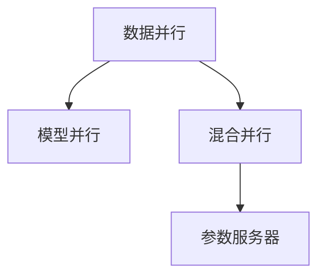

                 

# 分布式AI训练最佳实践

分布式AI训练是当前人工智能领域的前沿技术之一，它通过将大规模计算任务分配到多个计算节点并行执行，大幅提升了模型的训练效率。本文将从背景介绍、核心概念与联系、核心算法原理及具体操作步骤、数学模型与公式推导、项目实践案例、实际应用场景、工具和资源推荐、未来发展趋势与挑战、常见问题与解答等维度，全面系统地阐述分布式AI训练的最佳实践。

## 1. 背景介绍

### 1.1 问题由来

随着人工智能技术的快速发展，深度学习模型的复杂度和规模不断增大，单台计算设备已经难以满足训练需求。特别是对于大规模图像、语音、自然语言处理等任务，模型参数动辄以亿计，单机的训练时间可能长达数天甚至数周。这种高成本、低效率的训练方式极大地限制了AI技术的实际应用。

分布式AI训练技术的出现，打破了单机的性能瓶颈，实现了大规模计算资源的优化配置。通过将训练任务分布到多个计算节点上并行执行，可以大幅缩短模型训练时间，降低计算成本，为AI技术的实际落地提供了可能。

### 1.2 问题核心关键点

分布式AI训练的核心在于如何高效地将大规模计算任务分配到多个计算节点上并行执行。为达到这一目标，需要考虑以下几个关键点：

1. **数据分布**：如何将训练数据分布到不同的计算节点上，确保各节点接收到的数据具有代表性。
2. **计算资源调度**：如何动态调整计算资源的分配，以保证训练任务能够在合理时间内完成。
3. **模型参数分布**：如何将模型参数在多个节点间分布，确保各节点的参数更新能够同步进行。
4. **通信效率**：如何高效地进行节点间的通信，减少通信延迟，提高训练速度。

## 2. 核心概念与联系

### 2.1 核心概念概述

为了更好地理解分布式AI训练，本节将介绍几个密切相关的核心概念：

- **分布式训练**：指将大规模计算任务分配到多个计算节点并行执行的训练方法，通过数据并行、模型并行、混合并行等方式提高训练效率。
- **数据并行**：将训练数据分配到多个节点上，每个节点负责处理一部分数据。各节点的计算结果汇总后再进行下一步操作。
- **模型并行**：将模型参数分配到多个节点上，每个节点负责更新一部分参数。通过同步或异步更新方式保持参数一致性。
- **混合并行**：结合数据并行和模型并行，同时并行处理数据和模型参数，进一步提升训练效率。
- **参数服务器**：负责集中管理模型参数，接收各个计算节点的更新请求，并在更新完成后广播到各节点。

这些核心概念之间的逻辑关系可以通过以下Mermaid流程图来展示：



这个流程图展示分布式AI训练的核心概念及其之间的关系：

1. 数据并行和模型并行是两种基本的分布式训练方式。
2. 混合并行将数据并行和模型并行结合，进一步提升训练效率。
3. 参数服务器用于集中管理模型参数，实现参数的同步更新。

## 3. 核心算法原理 & 具体操作步骤

### 3.1 算法原理概述

分布式AI训练的本质是将大规模计算任务分配到多个计算节点上并行执行，通过数据并行、模型并行、混合并行等方式提高训练效率。其核心思想是通过并行计算减少训练时间，同时通过同步或异步更新方式保证模型参数的一致性。

### 3.2 算法步骤详解

分布式AI训练的一般步骤如下：

1. **数据划分**：将训练数据划分成多个子集，每个子集分配给一个计算节点。
2. **节点初始化**：初始化每个节点的模型参数，可以随机初始化或从预训练模型加载参数。
3. **并行计算**：在各个计算节点上并行计算损失函数和梯度。
4. **参数同步**：使用参数服务器或直接节点间通信方式，将各节点的模型参数进行同步更新。
5. **迭代更新**：重复执行3和4步骤，直至收敛。

### 3.3 算法优缺点

分布式AI训练具有以下优点：

- **高效性**：通过并行计算，显著提升训练效率，缩短模型训练时间。
- **可扩展性**：可以轻松扩展到数千甚至数万个计算节点，处理更复杂、规模更大的模型。
- **容错性**：即使部分节点故障，仍能通过其他节点继续训练，保障系统稳定性。

同时，分布式AI训练也存在一些局限性：

- **通信开销**：节点间通信可能成为瓶颈，影响训练速度。
- **同步开销**：同步更新模型参数可能会降低训练效率。
- **调试困难**：分布式系统的复杂性使得调试和故障排查难度较大。

### 3.4 算法应用领域

分布式AI训练已经在多个领域得到了广泛应用，如计算机视觉、自然语言处理、语音识别等，其高效性使其成为处理大规模数据和复杂模型的不二之选。

1. **计算机视觉**：在大规模图像分类、目标检测、图像生成等任务中，分布式训练显著提升训练速度和效果。
2. **自然语言处理**：在长文本生成、机器翻译、问答系统等任务中，分布式训练同样能提高模型性能和训练效率。
3. **语音识别**：在大规模语音识别任务中，分布式训练可显著提升训练速度和模型准确度。
4. **推荐系统**：在用户行为分析、物品推荐等任务中，分布式训练通过并行处理大规模数据，优化推荐效果。
5. **金融分析**：在金融风险评估、投资预测等任务中，分布式训练通过并行处理海量数据，提升分析速度和精度。

## 4. 数学模型和公式 & 详细讲解  
### 4.1 数学模型构建

分布式AI训练的数学模型可以表示为：

$$
\min_{\theta} \sum_{i=1}^N \mathcal{L}_i(M_{\theta})
$$

其中，$\mathcal{L}_i$ 表示第 $i$ 个子任务的目标损失函数，$M_{\theta}$ 表示模型参数，$N$ 表示子任务的数量。

### 4.2 公式推导过程

以数据并行为例，假设模型参数 $\theta$ 分布在 $K$ 个节点上，每个节点上的模型参数表示为 $\theta_k$。第 $i$ 个子任务的数据集为 $\{x_i\}_{i=1}^m$，各节点的损失函数分别为 $\mathcal{L}_k(M_{\theta_k})$。

各节点并行计算梯度：

$$
\frac{\partial \mathcal{L}_k(M_{\theta_k})}{\partial \theta_k} = \frac{1}{m} \sum_{i=1}^m \frac{\partial \mathcal{L}_i(M_{\theta})}{\partial \theta_k}
$$

各节点计算梯度后，使用参数服务器或节点间通信进行同步更新：

$$
\theta_k \leftarrow \theta_k - \eta \frac{\partial \mathcal{L}_k(M_{\theta_k})}{\partial \theta_k}
$$

其中，$\eta$ 为学习率，$\theta_k$ 为第 $k$ 个节点上的模型参数。

### 4.3 案例分析与讲解

以分布式深度神经网络训练为例，假设网络参数 $\theta$ 分布在 $K$ 个节点上，每个节点的参数表示为 $\theta_k$，训练数据 $D$ 划分为 $K$ 个子集。

假设使用SGD优化算法，每个节点的损失函数为：

$$
\mathcal{L}_k(M_{\theta_k}) = \frac{1}{m} \sum_{i=1}^m \mathcal{L}_i(M_{\theta_k})
$$

其中，$m$ 表示每个节点的样本数量。

节点 $k$ 的梯度计算公式为：

$$
\frac{\partial \mathcal{L}_k(M_{\theta_k})}{\partial \theta_k} = \frac{1}{m} \sum_{i=1}^m \frac{\partial \mathcal{L}_i(M_{\theta})}{\partial \theta_k}
$$

使用参数服务器进行参数同步，更新公式为：

$$
\theta_k \leftarrow \theta_k - \eta \frac{\partial \mathcal{L}_k(M_{\theta_k})}{\partial \theta_k}
$$

## 5. 项目实践：代码实例和详细解释说明

### 5.1 开发环境搭建

在进行分布式AI训练实践前，我们需要准备好开发环境。以下是使用PyTorch进行分布式训练的环境配置流程：

1. 安装Anaconda：从官网下载并安装Anaconda，用于创建独立的Python环境。

2. 创建并激活虚拟环境：
```bash
conda create -n pytorch-env python=3.8 
conda activate pytorch-env
```

3. 安装PyTorch：根据CUDA版本，从官网获取对应的安装命令。例如：
```bash
conda install pytorch torchvision torchaudio cudatoolkit=11.1 -c pytorch -c conda-forge
```

4. 安装DistributedDataParallel（DDP）：
```bash
pip install torch
```

5. 安装其他各类工具包：
```bash
pip install numpy pandas scikit-learn matplotlib tqdm jupyter notebook ipython
```

完成上述步骤后，即可在`pytorch-env`环境中开始分布式训练实践。

### 5.2 源代码详细实现

这里我们以分布式深度神经网络训练为例，给出使用PyTorch进行分布式训练的代码实现。

首先，定义模型和优化器：

```python
import torch
from torch import nn
from torch.distributed import distributed_c10d
import torch.distributed as dist

class Net(nn.Module):
    def __init__(self):
        super(Net, self).__init__()
        self.fc1 = nn.Linear(784, 128)
        self.fc2 = nn.Linear(128, 10)
    
    def forward(self, x):
        x = x.view(-1, 784)
        x = self.fc1(x)
        x = self.fc2(x)
        return x
    
model = Net()

# 使用SGD优化器
optimizer = torch.optim.SGD(model.parameters(), lr=0.01)

# 参数初始化
dist.init_process_group(backend='nccl', world_size=4, rank=0)

# 将模型和优化器分配到不同节点
dist.broadcast_params(model.state_dict(), src=0)
```

然后，定义训练和评估函数：

```python
def train(model, train_loader, optimizer):
    model.train()
    for data, target in train_loader:
        optimizer.zero_grad()
        output = model(data)
        loss = nn.CrossEntropyLoss()(output, target)
        loss.backward()
        optimizer.step()

def evaluate(model, test_loader):
    model.eval()
    total_loss = 0
    for data, target in test_loader:
        output = model(data)
        total_loss += nn.CrossEntropyLoss()(output, target)
    return total_loss.item() / len(test_loader)
```

最后，启动分布式训练流程：

```python
epochs = 10

# 创建数据集和数据加载器
train_dataset = torchvision.datasets.MNIST(root='./data', train=True, download=True, transform=torchvision.transforms.ToTensor())
test_dataset = torchvision.datasets.MNIST(root='./data', train=False, download=True, transform=torchvision.transforms.ToTensor())

train_loader = torch.utils.data.DataLoader(train_dataset, batch_size=32, shuffle=True, num_workers=2)
test_loader = torch.utils.data.DataLoader(test_dataset, batch_size=32, shuffle=False, num_workers=2)

# 训练
for epoch in range(epochs):
    train(model, train_loader, optimizer)
    test_loss = evaluate(model, test_loader)
    print(f'Epoch {epoch+1}, test loss: {test_loss:.4f}')
```

以上代码展示了使用PyTorch进行分布式深度神经网络训练的基本流程。可以看到，通过简单的代码，我们就能将训练任务分布在多个计算节点上，实现高效并行计算。

### 5.3 代码解读与分析

让我们再详细解读一下关键代码的实现细节：

**Net类**：
- `__init__`方法：初始化模型的各个层。
- `forward`方法：定义模型的前向传播过程。

**train和evaluate函数**：
- `train`函数：在训练集上对模型进行训练，使用SGD优化器进行参数更新。
- `evaluate`函数：在测试集上对模型进行评估，计算损失函数。

**分布式初始化**：
- `dist.init_process_group`方法：初始化分布式训练环境，使用NCCL后端，指定节点数和当前节点的编号。
- `dist.broadcast_params`方法：在所有节点上广播模型参数，确保所有节点的模型参数一致。

**分布式训练流程**：
- `for epoch in range(epochs)`循环：迭代训练多轮。
- 每轮训练中，使用`train`函数进行分布式训练，更新模型参数。
- 每轮训练后，使用`evaluate`函数在测试集上评估模型性能，输出损失值。

## 6. 实际应用场景

### 6.1 自动驾驶系统

自动驾驶系统需要实时处理大量的传感器数据，如摄像头图像、雷达数据、GPS定位等，并做出快速决策。这些数据量巨大且具有实时性要求，传统单机训练难以满足需求。通过分布式AI训练，可以将数据处理和模型训练任务分布在多个计算节点上，实现高效并行处理。

在自动驾驶系统中，可以使用分布式深度学习模型进行传感器数据的特征提取和处理，并通过分布式训练优化模型参数，提升自动驾驶系统的性能和鲁棒性。

### 6.2 实时推荐系统

实时推荐系统需要实时处理用户行为数据，生成个性化推荐结果。传统单机训练同样难以满足实时性要求。通过分布式AI训练，可以将数据处理和模型训练任务分布在多个计算节点上，实现高效并行处理。

在实时推荐系统中，可以使用分布式深度学习模型对用户行为数据进行建模，并通过分布式训练优化模型参数，提升推荐系统的精度和效率。

### 6.3 医疗影像分析

医疗影像分析需要处理大量医学影像数据，如CT、MRI、X光片等，并给出诊断结果。这些数据量巨大且具有复杂的结构，传统单机训练难以满足需求。通过分布式AI训练，可以将数据处理和模型训练任务分布在多个计算节点上，实现高效并行处理。

在医疗影像分析中，可以使用分布式深度学习模型对医学影像数据进行特征提取和分类，并通过分布式训练优化模型参数，提升诊断系统的准确性和效率。

### 6.4 未来应用展望

随着深度学习模型的规模不断增大，分布式AI训练的应用领域将进一步拓展，涵盖更多复杂的任务和场景。未来，分布式AI训练将会在以下几个方面发挥重要作用：

1. **大规模图像识别**：在自动驾驶、安防监控、工业检测等任务中，分布式AI训练将处理海量图像数据，提升图像识别模型的性能和效率。
2. **语音识别和自然语言处理**：在智能客服、语音助手、机器翻译等任务中，分布式AI训练将处理海量语音和文本数据，提升语音和自然语言处理系统的精度和响应速度。
3. **生物信息学**：在基因组学、蛋白质结构预测等任务中，分布式AI训练将处理海量生物数据，提升生物信息学模型的准确性和效率。
4. **金融分析**：在金融风险评估、投资预测等任务中，分布式AI训练将处理海量金融数据，提升金融分析系统的精度和效率。
5. **智能制造**：在智能制造、智慧工厂等任务中，分布式AI训练将处理海量传感器数据，提升智能制造系统的性能和鲁棒性。

## 7. 工具和资源推荐

### 7.1 学习资源推荐

为了帮助开发者系统掌握分布式AI训练的理论基础和实践技巧，这里推荐一些优质的学习资源：

1. 《分布式深度学习》书籍：详细介绍了分布式深度学习的原理、算法和应用，适合深入学习。
2. Coursera《分布式机器学习》课程：斯坦福大学开设的分布式机器学习课程，有Lecture视频和配套作业，带你入门分布式机器学习的基本概念和经典模型。
3. 《深度学习》书籍：讲解深度学习的基本原理和算法，包含分布式深度学习的相关内容，适合初学者入门。
4. PyTorch官方文档：PyTorch的分布式训练相关文档，提供了丰富的分布式训练样例和API文档，是实践分布式训练的重要参考。
5. Dask官方文档：Dask是一个分布式计算框架，可以用于分布式训练和数据处理，提供了丰富的分布式计算API和样例代码。

通过对这些资源的学习实践，相信你一定能够快速掌握分布式AI训练的精髓，并用于解决实际的AI问题。

### 7.2 开发工具推荐

高效的开发离不开优秀的工具支持。以下是几款用于分布式AI训练开发的常用工具：

1. PyTorch：基于Python的开源深度学习框架，灵活动态的计算图，适合快速迭代研究。支持分布式训练和模型并行，是分布式深度学习的主流框架。
2. TensorFlow：由Google主导开发的开源深度学习框架，生产部署方便，适合大规模工程应用。支持分布式训练和模型并行，是分布式深度学习的另一主流框架。
3. Horovod：由华为开发的分布式深度学习框架，支持多种深度学习框架和硬件设备，方便分布式训练的实现和调试。
4. Dask：一个灵活的分布式计算框架，可以用于分布式训练和数据处理，支持并行和分布式计算，适合处理大规模数据集。
5. Ray：一个开源的分布式计算框架，支持多语言和多种分布式计算任务，包括分布式深度学习、分布式训练等。

合理利用这些工具，可以显著提升分布式AI训练任务的开发效率，加快创新迭代的步伐。

### 7.3 相关论文推荐

分布式AI训练的研究源于学界的持续研究。以下是几篇奠基性的相关论文，推荐阅读：

1. DeepSpeed：Facebook开发的分布式深度学习框架，支持多种深度学习框架和硬件设备，提供了丰富的分布式训练优化和调优工具。
2. Parameter Server：Google开发的分布式深度学习框架，使用参数服务器机制，支持模型并行和数据并行，提供了丰富的分布式训练API和样例代码。
3. Dask：一个灵活的分布式计算框架，可以用于分布式训练和数据处理，支持并行和分布式计算，适合处理大规模数据集。
4. Ray：一个开源的分布式计算框架，支持多语言和多种分布式计算任务，包括分布式深度学习、分布式训练等。

这些论文代表了大规模分布式深度学习的研究进展，为分布式AI训练的实践提供了理论基础和实现思路。

## 8. 总结：未来发展趋势与挑战

### 8.1 总结

本文对分布式AI训练的最佳实践进行了全面系统的介绍。首先阐述了分布式AI训练的背景和意义，明确了分布式训练在提高模型训练效率和处理大规模数据方面的独特价值。其次，从原理到实践，详细讲解了分布式AI训练的数学原理和核心步骤，给出了分布式深度学习模型的代码实现。同时，本文还广泛探讨了分布式AI训练在自动驾驶、推荐系统、医疗影像分析等实际应用场景中的潜在应用，展示了分布式AI训练的广阔前景。此外，本文精选了分布式AI训练的学习资源，力求为读者提供全方位的技术指引。

通过本文的系统梳理，可以看到，分布式AI训练技术正在成为深度学习领域的重要范式，极大地拓展了模型的训练能力，催生了更多的落地场景。受益于大规模计算资源的优化配置，分布式AI训练必将在更多领域得到广泛应用，为AI技术的产业化进程注入新的动力。

### 8.2 未来发展趋势

展望未来，分布式AI训练技术将呈现以下几个发展趋势：

1. **分布式联邦学习**：在保护数据隐私的前提下，将模型训练任务分布到多个数据拥有者（如医院、企业等），实现分布式训练。联邦学习将提高数据利用率，同时保障数据安全。
2. **边缘计算**：将分布式AI训练任务转移到边缘计算设备上，如智能相机、智能音箱等，实现实时高效的分布式训练和推理。
3. **混合计算**：结合云计算和边缘计算的优势，实现分布式AI训练任务的动态调度，提升训练效率和系统灵活性。
4. **自动化调参**：使用自动机器学习技术，自动调整训练超参数，优化分布式训练过程。
5. **混合精度训练**：使用混合精度训练技术，减少计算资源消耗，提高分布式训练的效率和性能。
6. **分布式数据处理**：结合分布式计算和数据处理技术，实现海量数据的高效分布式处理，提升数据处理的效率和准确性。

以上趋势凸显了分布式AI训练技术的广阔前景。这些方向的探索发展，必将进一步提升分布式AI训练的效率和性能，为深度学习模型的实际落地提供更多可能性。

### 8.3 面临的挑战

尽管分布式AI训练技术已经取得了瞩目成就，但在迈向更加智能化、普适化应用的过程中，它仍面临着诸多挑战：

1. **通信开销**：节点间通信延迟可能会成为分布式训练的瓶颈，影响训练效率。
2. **同步开销**：同步更新模型参数可能会降低训练效率，特别是在大规模分布式系统中。
3. **调试困难**：分布式系统的复杂性使得调试和故障排查难度较大，增加了系统维护成本。
4. **可扩展性**：系统需要能够高效地处理不断增长的计算资源，同时保持高性能和高稳定性。
5. **安全性**：分布式训练系统需要保障数据和模型安全，防止数据泄露和模型被攻击。
6. **成本控制**：分布式训练系统需要合理控制计算资源的使用，避免过度消耗计算资源。

这些挑战需要我们在技术实现和管理实践中进行持续优化和改进，才能最大化分布式AI训练的优势。

### 8.4 研究展望

未来的研究需要在以下几个方面寻求新的突破：

1. **优化通信开销**：采用更高效的通信协议和数据传输方式，降低节点间通信延迟，提高训练效率。
2. **优化同步开销**：使用异步更新、分布式优化器等技术，减少同步开销，提高训练速度。
3. **提高系统可扩展性**：设计高效的系统架构和调度策略，实现分布式系统的动态扩展和资源优化。
4. **增强系统安全性**：采用加密传输、安全认证等技术，保障数据和模型安全。
5. **降低系统维护成本**：使用自动化调参、模型压缩等技术，降低系统维护难度和成本。
6. **优化资源使用**：合理控制计算资源的使用，避免过度消耗计算资源，提高系统性能。

这些研究方向的探索，必将引领分布式AI训练技术迈向更高的台阶，为深度学习模型的实际落地提供更多可能性。面向未来，分布式AI训练技术还需要与其他人工智能技术进行更深入的融合，如因果推理、强化学习等，多路径协同发力，共同推动深度学习模型的进步。只有勇于创新、敢于突破，才能不断拓展分布式AI训练的边界，让深度学习模型更好地造福人类社会。

## 9. 附录：常见问题与解答

**Q1：分布式AI训练与单机训练相比，有何优势？**

A: 分布式AI训练的优势主要体现在以下几个方面：

1. **高效性**：通过并行计算，分布式AI训练可以显著缩短模型训练时间，提高训练效率。
2. **可扩展性**：分布式AI训练可以轻松扩展到数千甚至数万个计算节点，处理更复杂、规模更大的模型。
3. **容错性**：即使部分节点故障，分布式AI训练仍能通过其他节点继续训练，保障系统稳定性。

**Q2：分布式AI训练中的通信开销如何优化？**

A: 分布式AI训练中的通信开销可以通过以下方式进行优化：

1. **使用高效的通信协议**：如NCCL、UCX等，这些协议能够在减少通信延迟的同时提高通信效率。
2. **数据压缩**：对传输数据进行压缩，减少通信开销。
3. **使用分布式数据传输框架**：如Ray、Dask等，这些框架能够高效地管理数据传输过程，降低通信开销。

**Q3：分布式AI训练中的同步开销如何优化？**

A: 分布式AI训练中的同步开销可以通过以下方式进行优化：

1. **使用异步更新**：允许部分节点在同步更新前继续训练，减少同步开销。
2. **使用分布式优化器**：如Horovod，这些优化器能够高效地管理模型参数的同步更新，减少同步开销。
3. **使用混合精度训练**：使用混合精度训练技术，减少计算资源消耗，提高分布式训练的效率和性能。

**Q4：分布式AI训练中的调试困难如何解决？**

A: 分布式AI训练中的调试困难可以通过以下方式进行解决：

1. **使用分布式调试工具**：如GDB、PyCharm等，这些工具能够帮助开发者在分布式系统中进行调试和故障排查。
2. **编写详细的日志和报告**：在分布式训练过程中，编写详细的日志和报告，帮助开发者追踪问题和排查故障。
3. **使用分布式可视化工具**：如TensorBoard、Horovod等，这些工具能够实时监测分布式训练的状态，帮助开发者进行调试和优化。

**Q5：分布式AI训练中的资源使用如何优化？**

A: 分布式AI训练中的资源使用可以通过以下方式进行优化：

1. **使用混合精度训练**：使用混合精度训练技术，减少计算资源消耗，提高分布式训练的效率和性能。
2. **使用模型压缩和剪枝技术**：减少模型参数量，降低计算资源的需求。
3. **使用动态资源调度**：根据任务需求动态调整计算资源的使用，避免资源浪费。

通过上述方法，可以最大化分布式AI训练的优势，提升系统性能和效率，保障数据和模型安全，降低系统维护成本。

**Q6：分布式AI训练中的数据分布如何优化？**

A: 分布式AI训练中的数据分布可以通过以下方式进行优化：

1. **使用数据切分技术**：将训练数据切分成多个子集，每个子集分配给一个计算节点。
2. **使用数据倾斜检测和处理技术**：检测数据分布是否均衡，对数据倾斜进行处理，确保每个节点接收到的数据具有代表性。
3. **使用数据重分布技术**：在训练过程中，动态调整数据分布，确保每个节点接收到的数据量均衡。

通过上述方法，可以优化数据分布，确保每个节点接收到的数据具有代表性，提高分布式AI训练的效率和效果。

---

作者：禅与计算机程序设计艺术 / Zen and the Art of Computer Programming

