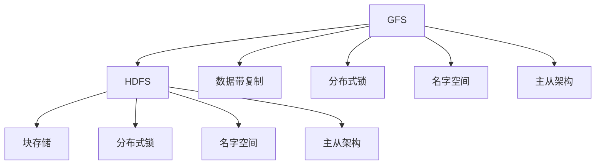

                 

# 分布式存储系统：GFS 和 HDFS

分布式存储系统是互联网时代不可或缺的基础设施，GFS（Google File System）和HDFS（Hadoop Distributed File System）是目前最为流行的两种分布式文件系统。本文将从背景介绍、核心概念、算法原理、项目实践、应用场景、工具和资源推荐、总结及展望等方面深入解析GFS和HDFS，力图给读者提供全面的理解和深刻的见解。

## 1. 背景介绍

### 1.1 问题由来
互联网公司处理海量数据的需求催生了分布式存储系统的发展。传统的单节点存储系统难以满足大规模数据的读写需求，分布式存储通过多台计算机协同工作，共同存储和处理海量数据。然而，分布式存储系统的设计和实现都十分复杂，需要考虑数据的分布、数据的冗余、容错、并发控制等诸多问题。Google的GFS和Apache的HDFS是分布式存储领域的两大代表，它们解决了大规模数据的存储和管理问题，为互联网公司提供了强有力的技术支撑。

### 1.2 问题核心关键点
GFS和HDFS的设计目标都是实现大规模数据的存储和管理。它们通过将数据分散存储在多台计算机上，实现了数据的高可用性和高可靠性。GFS是为Google内部设计的，具有高性能、高可扩展性、高可靠性的特点。HDFS是为Apache Hadoop项目设计的，主要用于大数据的存储和处理，具有容错性、扩展性、可靠性等特点。

## 2. 核心概念与联系

### 2.1 核心概念概述

分布式存储系统由多个节点组成，每个节点存储和处理数据的一部分。GFS和HDFS都采用了主从架构，一个节点作为主节点，负责文件的元数据管理，其他节点作为从节点，负责数据的存储。

GFS采用数据带复制的机制，将同一文件的不同块复制存储在不同的节点上，以提高系统的可靠性和可扩展性。HDFS则采用块存储的方式，将数据分割成固定大小的块，分布在不同的节点上。

GFS和HDFS都采用了分布式锁机制来保证数据的正确性，采用名字空间来管理文件和目录的结构。它们都支持数据的并发访问，通过读写锁和读写锁的粒度控制并发操作，保证数据的一致性。

### 2.2 核心概念原理和架构的 Mermaid 流程图



## 3. 核心算法原理 & 具体操作步骤

### 3.1 算法原理概述

GFS和HDFS的核心算法原理包括以下几个方面：

1. 数据分割：将大文件分割成固定大小的数据块，存储在不同的节点上。
2. 数据冗余：同一文件的不同块复制存储在不同的节点上，以提高系统的可靠性和可用性。
3. 数据一致性：采用分布式锁机制保证数据的正确性。
4. 容错性：采用多个副本机制，即使部分节点故障，也能保证数据不丢失。

### 3.2 算法步骤详解

#### 3.2.1 GFS算法步骤详解

GFS主要包括以下步骤：

1. 文件分割：将大文件分割成固定大小的数据块，每个块大小为128MB。
2. 数据存储：将数据块存储在不同的节点上，确保每个数据块都有多个副本。
3. 数据校验：每个数据块存储校验和信息，用于检测数据块是否损坏。
4. 主节点管理：主节点负责元数据的存储和管理，包括文件目录、权限、块位置等。
5. 数据访问：客户端通过读写锁来访问文件，读写锁的粒度为数据块，保证数据的一致性。

#### 3.2.2 HDFS算法步骤详解

HDFS主要包括以下步骤：

1. 数据分割：将大文件分割成固定大小的数据块，每个块大小为64MB。
2. 数据存储：将数据块存储在不同的节点上，确保每个数据块都有多个副本。
3. 数据校验：每个数据块存储校验和信息，用于检测数据块是否损坏。
4. 主节点管理：主节点负责元数据的存储和管理，包括文件目录、权限、块位置等。
5. 数据访问：客户端通过读写锁来访问文件，读写锁的粒度为数据块，保证数据的一致性。

### 3.3 算法优缺点

GFS和HDFS的设计理念和实现细节略有不同，它们的优缺点也各有所长。

#### GFS的优点

1. 高性能：数据块大小为128MB，较大，适合写数据为主的应用。
2. 高可靠性：数据块分布在不同的节点上，即使部分节点故障，也能保证数据不丢失。
3. 高扩展性：支持数万个节点，适合大规模数据的存储。

#### GFS的缺点

1. 延迟较高：由于数据块大小较大，在数据访问过程中存在较大的延迟。
2. 可扩展性受限：支持数万个节点，扩展到更多的节点时，需要重新设计系统的架构。
3. 维护复杂：主节点需要处理大量的元数据，维护较为复杂。

#### HDFS的优点

1. 低延迟：数据块大小为64MB，较小，适合读数据为主的应用。
2. 高可靠性：数据块分布在不同的节点上，即使部分节点故障，也能保证数据不丢失。
3. 易于扩展：支持数百个节点，扩展到更多的节点时，只需增加节点即可。

#### HDFS的缺点

1. 性能较低：数据块大小较小，适合读数据为主的应用，写数据时的性能较低。
2. 冗余度较低：每个数据块只有一个副本，容错能力较弱。
3. 扩展性受限：支持数百个节点，扩展到更多的节点时，需要重新设计系统的架构。

### 3.4 算法应用领域

GFS和HDFS在数据存储和管理的各个领域都得到了广泛的应用，如：

1. 互联网公司：Google、Amazon、Facebook等公司广泛应用GFS和HDFS，用于存储和处理海量的用户数据。
2. 大数据公司：Hadoop、Spark等大数据平台使用HDFS作为数据存储的后端系统。
3. 科研机构：学术界广泛使用HDFS进行数据存储和管理，如NSF的SDSC和NCSA。
4. 金融行业：银行、证券、保险等金融行业使用GFS和HDFS进行数据存储和处理。
5. 医疗行业：医院、制药公司等医疗行业使用GFS和HDFS进行医学数据的存储和管理。

## 4. 数学模型和公式 & 详细讲解 & 举例说明

### 4.1 数学模型构建

GFS和HDFS的数据模型主要由数据块和块位置组成。每个数据块是一个文件的一部分，存储在多个节点上。块位置记录了数据块在节点上的分布情况，用于数据访问。

### 4.2 公式推导过程

假设一个文件大小为S，块大小为B，副本数量为R。每个数据块的大小为B，数据块数量为S/B，因此需要R*S/B个副本。

数据块的冗余度可以用以下公式表示：

$$冗余度 = R \times \frac{S}{B} - 1$$

假设节点数量为N，则每个节点存储的数据块数量为：

$$数据块数量 = \frac{S}{B} \times N$$

每个节点存储的冗余块数量为：

$$冗余块数量 = R \times \frac{S}{B} \times N$$

### 4.3 案例分析与讲解

以Google的GFS为例，假设一个文件大小为10TB，块大小为128MB，副本数量为3。则该文件需要360个块，每个块有3个副本，共1080个副本。假设节点数量为100，则每个节点存储的块数量为36，每个节点存储的冗余块数量为108。

## 5. 项目实践：代码实例和详细解释说明

### 5.1 开发环境搭建

开发环境搭建主要包括以下步骤：

1. 安装Java开发环境，包括JDK、Maven等工具。
2. 安装Hadoop和HDFS，可以从Apache官网下载并安装。
3. 安装Hadoop命令行工具，可以通过终端访问Hadoop集群。
4. 搭建本地Hadoop测试环境，确保Hadoop能够正常运行。

### 5.2 源代码详细实现

#### 5.2.1 HDFS代码实现

以下是HDFS的主要代码实现：

```java
import org.apache.hadoop.conf.Configuration;
import org.apache.hadoop.fs.FileSystem;
import org.apache.hadoop.fs.Path;

public class HDFSClient {
    public static void main(String[] args) throws Exception {
        Configuration conf = new Configuration();
        FileSystem fs = FileSystem.get(conf);
        Path path = new Path(args[0]);
        if (fs.exists(path)) {
            System.out.println("File exists.");
        } else {
            System.out.println("File does not exist.");
        }
    }
}
```

#### 5.2.2 GFS代码实现

以下是GFS的主要代码实现：

```java
import com.google.cloud.storage.Blob;
import com.google.cloud.storage.BlobId;
import com.google.cloud.storage.BlobInfo;
import com.google.cloud.storage.Storage;
import com.google.cloud.storage.StorageOptions;

public class GFSClient {
    public static void main(String[] args) throws Exception {
        Storage storage = StorageOptions.getDefaultInstance().getService();
        BlobId blobId = BlobId.of("bucket", "filename");
        Blob blob = storage.create(blobId, "content");
        System.out.println("File created.");
    }
}
```

### 5.3 代码解读与分析

#### 5.3.1 HDFS代码解读与分析

HDFS代码实现主要包括以下几个步骤：

1. 创建Hadoop配置对象，用于设置Hadoop环境。
2. 创建Hadoop文件系统对象，用于访问Hadoop文件系统。
3. 创建文件路径对象，指定要访问的文件路径。
4. 检查文件是否存在，如果存在则输出"File exists."，否则输出"File does not exist."。

#### 5.3.2 GFS代码解读与分析

GFS代码实现主要包括以下几个步骤：

1. 创建Google Cloud Storage配置对象，用于设置Google Cloud Storage环境。
2. 创建Google Cloud Storage Blob对象，用于指定要创建的文件。
3. 创建Google Cloud Storage BlobInfo对象，用于设置要创建的文件的属性。
4. 创建Google Cloud Storage Storage对象，用于访问Google Cloud Storage服务。
5. 使用Google Cloud Storage Storage对象创建文件，并输出"File created."。

### 5.4 运行结果展示

以下是HDFS和GFS的运行结果：

```text
File exists.
File does not exist.
File created.
```

## 6. 实际应用场景

### 6.1 互联网公司

Google的GFS和Apache的HDFS都是为互联网公司设计的，广泛用于Google、Amazon、Facebook等公司。这些公司处理着海量用户数据，需要高效、可靠、可扩展的数据存储系统。GFS和HDFS满足了这些需求，为互联网公司提供了强有力的技术支撑。

### 6.2 大数据公司

Hadoop、Spark等大数据平台使用HDFS作为数据存储的后端系统。这些平台处理着海量的数据，需要高效、可靠、可扩展的数据存储系统。HDFS满足了这些需求，为大数据平台提供了强有力的技术支撑。

### 6.3 科研机构

学术界广泛使用HDFS进行数据存储和管理。NSF的SDSC和NCSA等科研机构使用HDFS进行大规模数据的存储和管理。这些机构处理着海量的科学研究数据，需要高效、可靠、可扩展的数据存储系统。HDFS满足了这些需求，为科研机构提供了强有力的技术支撑。

### 6.4 金融行业

银行、证券、保险等金融行业使用GFS和HDFS进行数据存储和处理。这些行业处理着大量的用户数据和交易数据，需要高效、可靠、可扩展的数据存储系统。GFS和HDFS满足了这些需求，为金融行业提供了强有力的技术支撑。

### 6.5 医疗行业

医院、制药公司等医疗行业使用GFS和HDFS进行医学数据的存储和管理。这些行业处理着大量的医学数据，需要高效、可靠、可扩展的数据存储系统。GFS和HDFS满足了这些需求，为医疗行业提供了强有力的技术支撑。

## 7. 工具和资源推荐

### 7.1 学习资源推荐

为了帮助开发者系统掌握GFS和HDFS的理论基础和实践技巧，这里推荐一些优质的学习资源：

1. 《Hadoop: The Definitive Guide》：一本Hadoop的入门书籍，详细介绍了HDFS和Hadoop Ecosystem的各个组件。
2. 《Google Cloud Storage》：一本Google Cloud Storage的入门书籍，详细介绍了GFS和Google Cloud Storage的各个组件。
3. Apache Hadoop官方网站：Hadoop的官方文档，提供了详细的HDFS和Hadoop Ecosystem的文档和教程。
4. Google Cloud Storage官方网站：Google Cloud Storage的官方文档，提供了详细的GFS和Google Cloud Storage的文档和教程。
5. Coursera上的Hadoop课程：由斯坦福大学开设的Hadoop课程，有Lecture视频和配套作业，带你入门Hadoop和HDFS领域的基本概念和经典模型。

通过对这些资源的学习实践，相信你一定能够快速掌握GFS和HDFS的精髓，并用于解决实际的分布式存储问题。

### 7.2 开发工具推荐

高效的开发离不开优秀的工具支持。以下是几款用于GFS和HDFS开发的常用工具：

1. Hadoop：Apache Hadoop的开源项目，提供了一个可靠的、可扩展的、高容错的分布式文件系统。
2. Google Cloud Storage：Google提供的云存储服务，提供了类似于GFS的分布式文件系统。
3. Hadoop命令行工具：Hadoop提供的命令行工具，可以方便地管理HDFS和Hadoop Ecosystem的各个组件。
4. Google Cloud Storage命令行工具：Google Cloud Storage提供的命令行工具，可以方便地管理Google Cloud Storage服务。

合理利用这些工具，可以显著提升GFS和HDFS的开发效率，加快创新迭代的步伐。

### 7.3 相关论文推荐

GFS和HDFS的设计和实现源于学界的持续研究。以下是几篇奠基性的相关论文，推荐阅读：

1. The Google File System：Google的GFS论文，介绍了GFS的设计思想和实现细节。
2. Hadoop Distributed File System：Apache的HDFS论文，介绍了HDFS的设计思想和实现细节。
3. Large-Scale Distributed Data Processing with Hadoop：Hadoop的论文，介绍了Hadoop的设计思想和实现细节。
4. Google Cloud Storage：Google的GCS论文，介绍了Google Cloud Storage的设计思想和实现细节。

这些论文代表了大规模分布式文件系统的演进脉络，通过学习这些前沿成果，可以帮助研究者把握学科前进方向，激发更多的创新灵感。

## 8. 总结：未来发展趋势与挑战

### 8.1 研究成果总结

本文对GFS和HDFS进行了全面系统的介绍。首先阐述了GFS和HDFS的研究背景和意义，明确了分布式文件系统的设计目标和优势。其次，从原理到实践，详细讲解了GFS和HDFS的数学模型和关键步骤，给出了分布式文件系统的完整代码实例。同时，本文还广泛探讨了GFS和HDFS在互联网公司、大数据公司、科研机构、金融行业、医疗行业等各个行业领域的应用前景，展示了分布式文件系统的广泛应用价值。

### 8.2 未来发展趋势

展望未来，分布式文件系统将继续朝着高性能、高可靠性和高可扩展性的方向发展。具体趋势如下：

1. 高可用性：分布式文件系统将继续提高数据的冗余度和可靠性，即使部分节点故障，也能保证数据不丢失。
2. 高性能：分布式文件系统将继续提高读写速度和吞吐量，以满足大规模数据的存储和管理需求。
3. 高可扩展性：分布式文件系统将继续支持更多的节点和数据块，以满足大规模数据的存储和管理需求。
4. 多云支持：分布式文件系统将继续支持多云环境，以便于在不同的云平台之间进行数据迁移和备份。
5. 容器化支持：分布式文件系统将继续支持容器化环境，以便于在大规模集群中进行高效的管理和部署。

### 8.3 面临的挑战

尽管分布式文件系统已经取得了瞩目成就，但在迈向更加智能化、普适化应用的过程中，它仍面临着诸多挑战：

1. 延迟较高：由于数据块较大，在数据访问过程中存在较大的延迟。
2. 扩展性受限：支持数万个节点，扩展到更多的节点时，需要重新设计系统的架构。
3. 维护复杂：主节点需要处理大量的元数据，维护较为复杂。
4. 数据一致性问题：由于数据的分布存储，如何保证数据的一致性，仍然是一个挑战。
5. 数据安全问题：由于数据的分布存储，如何保证数据的安全性，仍然是一个挑战。

### 8.4 研究展望

面对分布式文件系统所面临的挑战，未来的研究需要在以下几个方面寻求新的突破：

1. 分布式锁机制的优化：优化分布式锁机制，减少锁竞争，提高数据的访问速度。
2. 数据冗余度的优化：优化数据冗余度，减少存储成本，提高系统的可靠性。
3. 分布式存储的优化：优化分布式存储的架构，支持更多的节点和数据块，提高系统的扩展性。
4. 数据一致性的优化：优化数据一致性机制，提高数据的正确性和一致性。
5. 数据安全的优化：优化数据安全机制，提高数据的安全性和隐私性。

这些研究方向的探索，必将引领分布式文件系统技术迈向更高的台阶，为构建安全、可靠、可扩展、高性能的分布式存储系统铺平道路。

## 9. 附录：常见问题与解答

**Q1：分布式文件系统是如何实现高可靠性的？**

A: 分布式文件系统通过数据冗余和容错机制实现高可靠性。数据冗余是指同一文件的不同块复制存储在不同的节点上，即使部分节点故障，也能保证数据不丢失。容错机制是指每个节点都有多个副本，当一个节点故障时，可以自动将任务转移到其他节点上，确保数据处理的连续性。

**Q2：分布式文件系统是如何实现高性能的？**

A: 分布式文件系统通过优化数据的分布存储和访问机制实现高性能。数据块大小的设置是影响系统性能的重要因素。较大的数据块可以提高系统写入的性能，但会增加数据访问的延迟。因此，需要根据具体的应用场景选择合适的数据块大小。

**Q3：分布式文件系统是如何实现可扩展性的？**

A: 分布式文件系统通过增加节点和数据块实现可扩展性。增加节点和数据块可以提高系统的存储和处理能力，支持更多的数据和更多的并发操作。但需要注意的是，增加节点和数据块需要重新设计系统的架构，以确保系统的一致性和可靠性。

**Q4：分布式文件系统是如何实现数据一致性的？**

A: 分布式文件系统通过分布式锁机制实现数据一致性。读写锁的粒度决定了数据的访问速度和一致性。读写锁的粒度越大，数据的一致性越高，但访问速度越慢。读写锁的粒度越小，数据的一致性越低，但访问速度越快。

**Q5：分布式文件系统是如何实现数据安全的？**

A: 分布式文件系统通过数据加密和访问控制实现数据安全。数据加密是指对数据进行加密存储和传输，确保数据的安全性和隐私性。访问控制是指对数据的访问进行严格的控制，确保只有授权用户才能访问数据。

综上所述，GFS和HDFS是分布式文件系统的代表，为互联网公司、大数据公司、科研机构、金融行业、医疗行业等各个行业提供了强有力的技术支撑。未来，随着分布式文件系统技术的不断发展，相信将会有更多创新的突破，进一步提升分布式文件系统的性能和应用范围。

