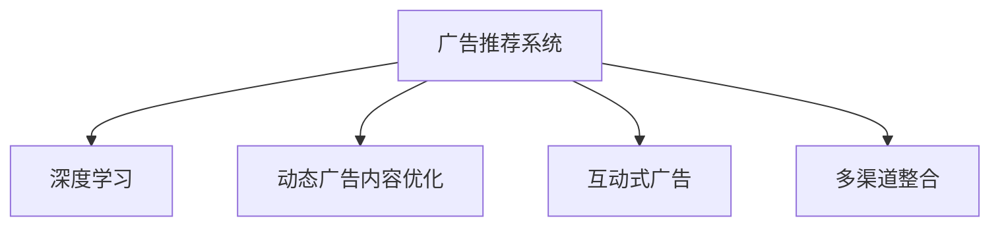

                 

# 创新型广告模式在注意力经济中的兴起

## 1. 背景介绍

### 1.1 问题由来

随着互联网和数字媒体的迅猛发展，广告行业正经历着前所未有的变革。传统广告模式以大规模内容覆盖和线性曝光为基础，难以实现精准投放和高效互动。如何在注意力经济时代下，重新定义广告模式，提升广告的转化率和用户互动性，成为业内亟待解决的重大课题。

### 1.2 问题核心关键点

创新型广告模式的核心在于利用新技术手段，如人工智能、大数据分析、用户行为跟踪等，实现广告投放的个性化、精细化和互动化。其关键点包括：

- **个性化推荐**：通过深度学习算法，精准匹配广告内容与用户兴趣，提升广告的点击率和转化率。
- **动态内容优化**：根据用户互动行为，实时调整广告内容，提升用户参与度和广告效果。
- **互动式广告**：利用AR/VR、交互式网页等技术，提供沉浸式、互动式广告体验，增加用户粘性。
- **多渠道整合**：跨平台、跨设备整合广告资源，最大化广告触达和互动效果。

### 1.3 问题研究意义

创新型广告模式的兴起，不仅能够显著提升广告效果，降低投放成本，还能增强品牌与用户之间的互动，促进用户忠诚度和品牌认知。在注意力稀缺的今天，个性化和互动性成为广告成功的关键因素，创新型广告模式正是顺应这一趋势的产物。

## 2. 核心概念与联系

### 2.1 核心概念概述

为更好地理解创新型广告模式的工作原理和优化方向，本节将介绍几个密切相关的核心概念：

- **广告推荐系统(Ad Recommendation System)**：通过分析用户行为数据，推荐用户可能感兴趣的商品、内容或服务，从而提高广告的点击率和转化率。

- **深度学习(Deep Learning)**：一种基于神经网络的机器学习技术，通过多层非线性变换，从原始数据中学习出高层次的抽象特征。

- **动态广告内容优化(Dynamic Ad Content Optimization)**：根据用户行为数据，动态调整广告内容，如文字、图片、视频等，以适应不同用户群体的需求和偏好。

- **互动式广告(Interactive Ad)**：通过增强现实(AR)、虚拟现实(VR)、互动网页等技术，提供沉浸式、互动式的广告体验，增强用户参与感和品牌互动性。

- **多渠道整合(Multichannel Integration)**：跨平台、跨设备整合广告资源，实现广告投放和用户互动的全场景覆盖。

这些核心概念之间的逻辑关系可以通过以下Mermaid流程图来展示：



这个流程图展示了大语言模型的核心概念及其之间的关系：

1. 广告推荐系统通过深度学习算法，对用户行为数据进行分析，推荐广告内容。
2. 动态广告内容优化根据用户行为数据，实时调整广告内容，提高用户参与度和广告效果。
3. 互动式广告利用AR/VR、交互式网页等技术，提供沉浸式、互动式的广告体验，增强用户粘性。
4. 多渠道整合跨平台、跨设备整合广告资源，实现广告投放和用户互动的全场景覆盖。

这些核心概念共同构成了创新型广告模式的理论和应用框架，使其能够在各种场景下发挥重要作用。

## 3. 核心算法原理 & 具体操作步骤
### 3.1 算法原理概述

创新型广告模式的核心算法包括个性化推荐、动态内容优化、互动式广告和多渠道整合等。以下是其核心算法原理的概述：

- **个性化推荐算法**：通过协同过滤、基于内容的推荐、矩阵分解等技术，分析用户行为数据，精准匹配广告内容与用户兴趣。
- **动态广告内容优化算法**：利用强化学习、时序预测等技术，根据用户行为数据，实时调整广告内容，提升用户参与度和广告效果。
- **互动式广告算法**：结合AR/VR、交互式网页等技术，生成动态化的互动广告内容，增强用户参与感和品牌互动性。
- **多渠道整合算法**：使用跨平台数据共享、用户画像整合等技术，实现广告投放和用户互动的全场景覆盖。

### 3.2 算法步骤详解

以个性化推荐算法为例，其详细步骤包括：

1. **数据收集**：收集用户的历史行为数据，如浏览记录、点击行为、购买记录等。
2. **特征提取**：对用户行为数据进行特征提取，得到用户兴趣特征和广告特征。
3. **模型训练**：使用协同过滤、基于内容的推荐等算法，训练个性化推荐模型。
4. **广告推荐**：将用户特征和广告特征输入推荐模型，得到用户对广告的评分和推荐排名。
5. **广告投放**：根据推荐排名，选择合适广告进行投放，并实时监控投放效果。

### 3.3 算法优缺点

创新型广告模式的优点包括：

- **提升广告效果**：通过个性化推荐和动态内容优化，显著提高广告的点击率和转化率。
- **增强用户互动**：互动式广告提供沉浸式、互动式的广告体验，增加用户粘性和品牌互动。
- **实现全场景覆盖**：多渠道整合广告资源，实现广告投放和用户互动的全场景覆盖。

同时，该方法也存在一定的局限性：

- **数据隐私问题**：个性化推荐和动态内容优化需要大量用户行为数据，可能涉及用户隐私问题。
- **算法复杂度**：深度学习等算法需要大量计算资源和时间，可能带来高昂的运营成本。
- **用户多样性**：广告推荐算法可能无法覆盖所有用户群体，导致部分用户被忽视。
- **互动体验差异**：不同用户对互动广告的接受度和参与度可能存在差异。

尽管存在这些局限性，但就目前而言，创新型广告模式仍是广告领域的热门研究方向，具有广阔的应用前景。

### 3.4 算法应用领域

创新型广告模式在多个领域中已经得到了广泛的应用，包括但不限于：

- **电商广告**：通过个性化推荐和动态内容优化，提升电商平台的广告点击率和转化率，增加用户购买意愿。
- **视频广告**：结合AR/VR技术和互动式广告，提供沉浸式视频广告体验，增加用户参与感和品牌认知。
- **社交媒体广告**：利用个性化推荐和多渠道整合，提升社交媒体平台的广告效果，增强用户互动和品牌忠诚度。
- **房地产广告**：通过多渠道整合和互动式广告，实现房地产广告的精准投放和高效互动，提升广告效果和用户转化。

除了这些经典应用外，创新型广告模式还被创新性地应用到更多场景中，如教育、医疗、旅游等，为各行业带来了新的广告模式和用户体验。

## 4. 数学模型和公式 & 详细讲解  
### 4.1 数学模型构建

本节将使用数学语言对个性化推荐算法进行更加严格的刻画。

假设广告库为 $A$，用户集为 $U$，广告-用户交互矩阵为 $\mathbf{Y} \in \mathbb{R}^{n\times m}$，其中 $n$ 为广告数量，$m$ 为用户数量。设广告 $i$ 与用户 $j$ 的交互次数为 $y_{ij}$，将 $\mathbf{Y}$ 中的非零元素记为广告-用户交互记录。

定义用户-广告评分矩阵 $\mathbf{I} \in \mathbb{R}^{m\times n}$，其中 $\mathbf{I}_{ij}$ 为广告 $i$ 在用户 $j$ 的评分。

个性化推荐的目标是找到用户 $j$ 最可能感兴趣的广告 $i$，即求解最大化用户评分 $\mathbf{I}_j$。根据最大化期望收益的框架，个性化推荐算法可以表示为：

$$
\mathop{\arg\max}_{i} \mathbb{E}_{j\sim P_{\mathbf{Y}}}[\mathbf{I}_{ij}]
$$

其中 $P_{\mathbf{Y}}$ 为 $\mathbf{Y}$ 的概率分布。

### 4.2 公式推导过程

以协同过滤算法为例，推导用户-广告评分矩阵 $\mathbf{I}$ 的计算公式。

设 $\mathbf{A} \in \mathbb{R}^{n\times n}$ 为广告相似度矩阵，其中 $\mathbf{A}_{ij} = \frac{y_{ij}}{\sqrt{\sum_{k=1}^m y_{ik}^2}} \cdot \frac{1}{\sqrt{\sum_{k=1}^n y_{kj}^2}}$。

用户-广告评分矩阵 $\mathbf{I}$ 的计算公式为：

$$
\mathbf{I} = \mathbf{A}\mathbf{Y}
$$

### 4.3 案例分析与讲解

以电商广告推荐为例，展示个性化推荐算法在实际场景中的应用。

假设某电商平台收集了用户的历史浏览记录、购买记录等行为数据，将其转化为广告-用户交互矩阵 $\mathbf{Y}$。使用协同过滤算法，训练得到广告相似度矩阵 $\mathbf{A}$ 和用户-广告评分矩阵 $\mathbf{I}$。在用户浏览页面时，根据 $\mathbf{I}$ 预测用户可能感兴趣的商品，向其展示推荐广告。

## 5. 项目实践：代码实例和详细解释说明
### 5.1 开发环境搭建

在进行广告推荐系统开发前，我们需要准备好开发环境。以下是使用Python进行TensorFlow开发的开发环境配置流程：

1. 安装Anaconda：从官网下载并安装Anaconda，用于创建独立的Python环境。

2. 创建并激活虚拟环境：
```bash
conda create -n tf-env python=3.8 
conda activate tf-env
```

3. 安装TensorFlow：根据CUDA版本，从官网获取对应的安装命令。例如：
```bash
conda install tensorflow tensorflow-cpu tensorflow-gpu -c pytorch -c conda-forge
```

4. 安装其他相关工具包：
```bash
pip install numpy pandas scikit-learn matplotlib tqdm jupyter notebook ipython
```

完成上述步骤后，即可在`tf-env`环境中开始广告推荐系统开发。

### 5.2 源代码详细实现

下面以协同过滤算法为例，展示使用TensorFlow实现个性化推荐广告的系统开发过程。

首先，定义广告库和用户集，收集广告-用户交互数据：

```python
import tensorflow as tf
import numpy as np

# 广告库和用户集
ads = np.array(['ad1', 'ad2', 'ad3', 'ad4', 'ad5'])
users = np.array(['user1', 'user2', 'user3', 'user4', 'user5'])

# 广告-用户交互数据
interactions = np.array([[1, 0, 0, 1, 1],
                       [1, 0, 1, 0, 0],
                       [0, 0, 0, 0, 1],
                       [0, 1, 1, 0, 0],
                       [0, 0, 0, 1, 0]])
```

接着，定义广告相似度矩阵和用户-广告评分矩阵：

```python
# 计算广告相似度矩阵
Y = np.array(interactions)
A = Y @ Y.T / (np.sum(Y**2, axis=1) ** 0.5)[:, None] @ np.sum(Y**2, axis=0) ** 0.5
A = A / (np.sum(A, axis=0) ** 0.5)[None, :]

# 计算用户-广告评分矩阵
I = A @ Y
```

最后，展示推荐广告的代码实现：

```python
# 定义广告推荐函数
def recommend_ads(user, ads):
    user_idx = np.searchsorted(users, user)
    user_A = A[user_idx]
    user_I = I[user_idx]
    top_ads = user_A @ user_I
    top_ads_idx = np.argsort(top_ads)[::-1]
    recommended_ads = [ads[i] for i in top_ads_idx]
    return recommended_ads

# 推荐用户最可能感兴趣的广告
recommended_ads = recommend_ads('user1', ads)
print(recommended_ads)
```

以上就是使用TensorFlow实现广告推荐系统的完整代码实现。可以看到，利用TensorFlow的向量运算和矩阵计算功能，广告推荐算法的实现非常简单高效。

### 5.3 代码解读与分析

让我们再详细解读一下关键代码的实现细节：

**广告库和用户集**：
- `ads`和`users`数组分别定义了广告库和用户集。

**广告-用户交互数据**：
- `interactions`数组表示广告与用户之间的交互记录，其中1表示广告被用户点击或购买过，0表示未交互。

**广告相似度矩阵**：
- 计算广告-广告的相似度矩阵`A`，使用广告-用户交互矩阵`Y`的平方和的逆方根计算每个广告的权重。

**用户-广告评分矩阵**：
- 计算用户-广告评分矩阵`I`，使用广告相似度矩阵`A`和广告-用户交互矩阵`Y`计算用户对每个广告的评分。

**广告推荐函数**：
- `recommend_ads`函数接受用户和广告库作为输入，返回用户最可能感兴趣的前N个广告。

可以看到，广告推荐算法的实现非常简单，只需利用矩阵运算和搜索操作即可完成。这为实际系统开发提供了极大的便利性。

当然，在工业级的系统实现中，还需要考虑更多因素，如模型的训练优化、广告预算分配、推荐结果的展示等。但核心的广告推荐算法基本与此类似。

## 6. 实际应用场景
### 6.1 电商平台广告

基于个性化推荐和动态内容优化算法，电商平台可以显著提升广告效果，增加用户购买意愿。具体而言，可以通过以下步骤：

1. 收集用户的历史浏览记录、购买记录等行为数据。
2. 使用协同过滤、基于内容的推荐等算法，训练个性化推荐模型。
3. 根据用户行为数据，实时调整广告内容，如文字、图片、视频等。
4. 通过多渠道整合广告资源，实现广告投放和用户互动的全场景覆盖。

如此构建的电商平台广告推荐系统，能够精准匹配用户需求，提升广告点击率和转化率，增加用户购买意愿。

### 6.2 视频广告

结合AR/VR技术和互动式广告，视频广告可以提供沉浸式、互动式的广告体验，增加用户参与感和品牌互动。具体而言，可以通过以下步骤：

1. 收集用户的观看记录、点击行为等行为数据。
2. 使用深度学习算法，训练互动式广告推荐模型。
3. 根据用户行为数据，实时调整广告内容，如动态视频、互动任务等。
4. 通过跨平台、跨设备整合广告资源，实现广告投放和用户互动的全场景覆盖。

如此构建的视频广告推荐系统，能够提供更具吸引力和互动性的广告内容，增加用户参与度和品牌互动。

### 6.3 社交媒体广告

利用个性化推荐和多渠道整合算法，社交媒体平台可以提升广告效果，增强用户互动和品牌忠诚度。具体而言，可以通过以下步骤：

1. 收集用户的点赞、评论、分享等行为数据。
2. 使用协同过滤、基于内容的推荐等算法，训练个性化推荐模型。
3. 根据用户行为数据，实时调整广告内容，如社交互动、话题引导等。
4. 通过多渠道整合广告资源，实现广告投放和用户互动的全场景覆盖。

如此构建的社交媒体广告推荐系统，能够精准匹配用户兴趣，提升广告效果和用户互动，增加品牌忠诚度。

### 6.4 未来应用展望

随着广告推荐算法的不断发展，未来创新型广告模式将呈现以下几个趋势：

1. **数据驱动个性化**：通过深度学习和大数据技术，实现更加精准的用户兴趣匹配。
2. **实时动态优化**：利用实时数据和强化学习技术，动态调整广告内容，提升用户参与度和广告效果。
3. **跨平台整合**：实现跨平台、跨设备的全场景广告投放和互动。
4. **多模态融合**：结合文字、图片、视频、语音等多模态信息，提供更丰富、更真实的广告体验。
5. **个性化互动**：利用AR/VR、交互式网页等技术，提供沉浸式、互动式的广告体验。
6. **效果评估优化**：引入更多效果评估指标，如用户留存率、品牌认知度等，优化广告推荐策略。

这些趋势表明，广告推荐算法将更加智能化、个性化和互动化，提升广告效果的同时，也增加了用户参与度和品牌互动。

## 7. 工具和资源推荐
### 7.1 学习资源推荐

为了帮助开发者系统掌握广告推荐算法的基础知识和技术细节，这里推荐一些优质的学习资源：

1. 《推荐系统原理与算法》系列博文：由深度学习领域专家撰写，全面介绍了推荐系统的理论基础和算法实现。

2. 《TensorFlow实战》书籍：TensorFlow官方出版的实战手册，涵盖TensorFlow的搭建、训练和部署过程，是深度学习算法的入门必备。

3. 《广告推荐系统》课程：Coursera平台提供的广告推荐系统课程，由Google广告团队主讲，涵盖广告推荐系统的各个方面。

4. Kaggle广告推荐竞赛：Kaggle提供的广告推荐数据集和竞赛平台，可以通过实践积累推荐算法经验。

5. Google A/B Testing：Google提供的广告效果评估工具，通过对比实验验证广告推荐策略的效果。

通过对这些资源的学习实践，相信你一定能够快速掌握广告推荐算法的精髓，并用于解决实际的广告问题。

### 7.2 开发工具推荐

高效的开发离不开优秀的工具支持。以下是几款用于广告推荐系统开发的常用工具：

1. TensorFlow：由Google主导开发的深度学习框架，生产部署方便，适合大规模工程应用。

2. PyTorch：由Facebook开发的深度学习框架，灵活性高，适合研究性开发。

3. Scikit-learn：基于Python的机器学习库，提供丰富的推荐算法实现，易于上手。

4. Apache Spark：用于分布式计算的框架，支持大规模数据处理和推荐系统实现。

5. Jupyter Notebook：开源的交互式编程环境，支持代码编写、数据处理和结果展示，适合科学研究和技术实验。

合理利用这些工具，可以显著提升广告推荐系统的开发效率，加快创新迭代的步伐。

### 7.3 相关论文推荐

广告推荐算法的不断发展源于学界的持续研究。以下是几篇奠基性的相关论文，推荐阅读：

1. Implicit Feature Scaling and Decomposition Algorithms for Recommendations（即ALS算法）：提出ALS算法，通过矩阵分解解决推荐系统问题。

2. Matrix Factorization Techniques for Recommender Systems（即SVD算法）：提出SVD算法，利用矩阵分解技术提升推荐效果。

3. Attention Is All You Need（即Transformer算法）：提出Transformer结构，引入自注意力机制，提升推荐模型的复杂度和效果。

4. Matrix Factorization with L2 Regularization and Zero Embeddings: Scalable Pattern-Based Recommendations（即ItemKNN算法）：提出ItemKNN算法，通过计算项项相似度实现推荐。

5. Context-aware Recommender Systems: An Overview and Selective Survey（即基于上下文的推荐系统）：综述基于上下文的推荐算法，强调多维度数据融合的重要性。

这些论文代表了大语言模型推荐算法的演进脉络。通过学习这些前沿成果，可以帮助研究者把握学科前进方向，激发更多的创新灵感。

## 8. 总结：未来发展趋势与挑战

### 8.1 总结

本文对基于深度学习的创新型广告模式进行了全面系统的介绍。首先阐述了广告推荐系统的研究背景和意义，明确了广告推荐算法在提升广告效果和用户互动方面的独特价值。其次，从原理到实践，详细讲解了广告推荐算法的数学模型和关键步骤，给出了广告推荐系统的完整代码实现。同时，本文还广泛探讨了广告推荐算法在电商平台、视频广告、社交媒体等多个领域的应用前景，展示了广告推荐算法的巨大潜力。此外，本文精选了广告推荐算法的各类学习资源，力求为读者提供全方位的技术指引。

通过本文的系统梳理，可以看到，基于深度学习的广告推荐算法在广告领域的应用正蓬勃发展，极大地提升了广告投放的精准性和互动性。未来，伴随深度学习和大数据技术的不断进步，广告推荐算法还将更加智能化、个性化和互动化，为广告产业带来革命性的变革。

### 8.2 未来发展趋势

展望未来，广告推荐算法将呈现以下几个发展趋势：

1. **数据驱动个性化**：通过深度学习和大数据技术，实现更加精准的用户兴趣匹配。
2. **实时动态优化**：利用实时数据和强化学习技术，动态调整广告内容，提升用户参与度和广告效果。
3. **跨平台整合**：实现跨平台、跨设备的全场景广告投放和互动。
4. **多模态融合**：结合文字、图片、视频、语音等多模态信息，提供更丰富、更真实的广告体验。
5. **个性化互动**：利用AR/VR、交互式网页等技术，提供沉浸式、互动式的广告体验。
6. **效果评估优化**：引入更多效果评估指标，如用户留存率、品牌认知度等，优化广告推荐策略。

这些趋势表明，广告推荐算法将更加智能化、个性化和互动化，提升广告效果的同时，也增加了用户参与度和品牌互动。

### 8.3 面临的挑战

尽管广告推荐算法已经取得了瞩目成就，但在迈向更加智能化、普适化应用的过程中，它仍面临着诸多挑战：

1. **数据隐私问题**：个性化推荐和动态内容优化需要大量用户行为数据，可能涉及用户隐私问题。
2. **算法复杂度**：深度学习等算法需要大量计算资源和时间，可能带来高昂的运营成本。
3. **用户多样性**：广告推荐算法可能无法覆盖所有用户群体，导致部分用户被忽视。
4. **互动体验差异**：不同用户对互动广告的接受度和参与度可能存在差异。
5. **广告效果评估**：广告推荐算法的效果评估复杂，难以准确衡量广告效果。

尽管存在这些挑战，但就目前而言，广告推荐算法仍是广告领域的热门研究方向，具有广阔的应用前景。

### 8.4 研究展望

面对广告推荐算法所面临的种种挑战，未来的研究需要在以下几个方面寻求新的突破：

1. **数据隐私保护**：研究如何保护用户隐私，同时实现广告推荐算法的效果。
2. **算法优化**：开发更加高效、低成本的广告推荐算法，降低计算资源和时间消耗。
3. **用户覆盖优化**：研究如何覆盖更多用户群体，实现广告投放的全面覆盖。
4. **互动体验优化**：提升互动广告的接受度和参与度，提供更真实、更吸引人的广告体验。
5. **效果评估优化**：引入更多广告效果评估指标，优化广告推荐策略。

这些研究方向的探索，必将引领广告推荐算法迈向更高的台阶，为广告产业带来革命性的变革。

## 9. 附录：常见问题与解答

**Q1：广告推荐算法是否适用于所有广告场景？**

A: 广告推荐算法在大多数广告场景上都能取得不错的效果，特别是对于数据量较大的广告平台。但对于一些特殊场景，如新闻推荐、商品推荐等，可能需要针对性地调整算法和参数。

**Q2：广告推荐算法如何处理冷启动问题？**

A: 冷启动问题是指新用户或新商品缺乏足够的历史数据，导致推荐效果不佳。广告推荐算法可以通过引入上下文信息、多模态融合等方法，增加推荐系统的鲁棒性和泛化能力。例如，使用上下文推荐算法，利用上下文信息提升推荐效果。

**Q3：广告推荐算法如何应对用户多样性？**

A: 用户多样性是广告推荐算法面临的主要挑战之一。广告推荐算法可以通过引入更多的用户行为特征、利用迁移学习等方法，减少用户多样性的影响。例如，使用多任务学习算法，在多个任务上共享参数，提升广告推荐效果。

**Q4：广告推荐算法如何提高用户留存率？**

A: 提高用户留存率是广告推荐算法的另一个重要目标。广告推荐算法可以通过引入更多的用户行为特征、利用强化学习等方法，提升用户留存率。例如，使用深度强化学习算法，根据用户行为实时调整广告内容，提升用户留存率。

**Q5：广告推荐算法如何保证推荐结果的多样性？**

A: 推荐结果的多样性是广告推荐算法的关键指标之一。广告推荐算法可以通过引入更多的用户行为特征、利用多样性采样等方法，增加推荐结果的多样性。例如，使用多样性采样算法，根据用户行为数据采样推荐结果，增加推荐结果的多样性。

这些研究方向的探索，必将引领广告推荐算法迈向更高的台阶，为广告产业带来革命性的变革。

---

作者：禅与计算机程序设计艺术 / Zen and the Art of Computer Programming

