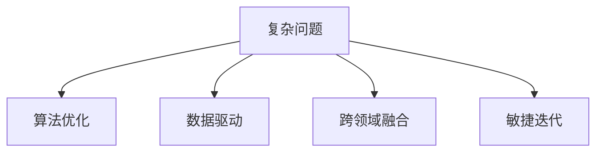

                 

# 创新思维：解决复杂问题

> 关键词：创新思维,复杂问题,算法优化,数据驱动,跨领域融合,敏捷迭代

## 1. 背景介绍

### 1.1 问题由来

在信息技术高速发展的今天，各行各业面临的复杂问题愈加多样化和多元化。无论是企业级的数据处理，还是医疗行业的精准诊断，亦或是智能家居的个性化推荐，无不涉及复杂问题的求解。传统的解决问题的思路和方法已经难以应对这一挑战，而创新思维的引入显得尤为重要。

### 1.2 问题核心关键点

创新思维的本质在于打破常规，从全新的视角出发，寻找问题的最优解。在技术领域，创新思维体现在算法优化、数据驱动、跨领域融合等多个方面。通过创新思维，可以大幅提升问题解决的效率和精度。

### 1.3 问题研究意义

创新思维的引入，不仅能够提升问题的解决能力，还能推动技术的创新和进步。这在新兴的AI、大数据等前沿领域尤为关键。通过系统掌握创新思维的理论基础和实践方法，开发者能够更加灵活地应对复杂问题，催生新的技术应用和业务场景。

## 2. 核心概念与联系

### 2.1 核心概念概述

为更好地理解创新思维，本节将介绍几个关键概念及其相互关系：

- **复杂问题**：通常指无法通过简单算法或单一方法解决的、涉及多个变量和条件的问题。如AI模型的超参数调优、金融市场的风险管理、机器学习的模型选择等。

- **算法优化**：指通过改进算法结构和参数，以提升问题解决的效率和精度。常见方法包括遗传算法、蚁群算法、粒子群算法等。

- **数据驱动**：指利用数据进行模型训练和问题求解，强调数据质量和数据量对模型性能的影响。数据驱动方法在推荐系统、自然语言处理等领域应用广泛。

- **跨领域融合**：指将不同领域的技术和方法进行结合，以产生新的解决方案。例如，将计算机视觉与自然语言处理结合，实现智能问答系统。

- **敏捷迭代**：指通过频繁的小范围迭代和反馈，逐步优化问题解决方案。敏捷迭代方法在软件开发、数据分析等领域广泛应用。

这些核心概念之间的逻辑关系可以通过以下Mermaid流程图来展示：



这个流程图展示了解决复杂问题的关键路径：

1. 确定复杂问题的范围和需求。
2. 通过算法优化、数据驱动、跨领域融合等多种方法，寻找问题解决方案。
3. 采用敏捷迭代的方法，不断优化方案，最终得到满意结果。

## 3. 核心算法原理 & 具体操作步骤
### 3.1 算法原理概述

创新思维的算法优化方法，通常基于以下原则：

1. **启发式算法**：通过模拟自然界或其他问题的求解方式，找到近似最优解。如遗传算法、蚁群算法等。
2. **强化学习**：通过试错的方式，逐步学习最优策略。适用于环境动态变化、目标不明确的问题。
3. **模型压缩**：通过剪枝、量化等技术，减小模型复杂度，提升计算效率。
4. **特征工程**：通过数据预处理、特征选择等技术，提升模型的泛化能力。
5. **多目标优化**：通过同时优化多个目标函数，找到综合性能最优的解。

这些算法优化方法通常需要在具体问题场景中灵活应用，以达到最优的求解效果。

### 3.2 算法步骤详解

以**算法优化**中的**遗传算法**为例，详细讲解其具体操作步骤：

1. **编码**：将问题解表示为遗传算法的染色体。例如，对于机器学习模型的超参数优化，可以将每个超参数编码为二进制位。

2. **初始化**：随机生成一组初始解，即种群。每个染色体对应一个问题解。

3. **选择**：通过适应度函数计算每个染色体的适应度值，选择适应度值高的染色体进行交叉和变异。

4. **交叉**：将两个染色体进行交叉操作，生成新的染色体。

5. **变异**：随机对染色体进行变异操作，引入新的基因。

6. **评估**：评估新染色体的适应度值，将其加入种群中。

7. **迭代**：重复选择、交叉、变异、评估等步骤，直至满足停止条件（如达到迭代次数）。

### 3.3 算法优缺点

遗传算法的优点包括：
1. **全局优化**：能够搜索到问题解的全局最优解。
2. **鲁棒性**：对初始值和参数不敏感。
3. **并行性**：可同时处理多个染色体，提高求解效率。

遗传算法的缺点包括：
1. **计算复杂**：需要大量的计算资源。
2. **早熟**：容易陷入局部最优解，难以找到全局最优。
3. **解质量**：结果的精确度可能不如其他优化方法。

### 3.4 算法应用领域

遗传算法广泛应用于以下领域：

- **优化问题**：如非线性规划、组合优化等。
- **机器学习**：如超参数优化、模型选择等。
- **生物信息学**：如蛋白质结构预测、基因序列分析等。
- **工业工程**：如供应链优化、生产调度等。

## 4. 数学模型和公式 & 详细讲解 & 举例说明

### 4.1 数学模型构建

以**数据驱动**中的**线性回归模型**为例，详细讲解其数学模型构建过程：

设问题数据集为 $D=\{(x_i, y_i)\}_{i=1}^N$，其中 $x_i \in \mathbb{R}^d$ 为输入变量，$y_i \in \mathbb{R}$ 为输出变量。线性回归模型的目标是最小化预测值与真实值之间的平方误差：

$$
\min_{\theta} \sum_{i=1}^N (y_i - \theta^T x_i)^2
$$

其中 $\theta \in \mathbb{R}^d$ 为模型参数。

### 4.2 公式推导过程

根据最小二乘法，将上述目标函数对 $\theta$ 求导，得：

$$
\nabla_{\theta} \mathcal{L}(\theta) = -2\sum_{i=1}^N (y_i - \theta^T x_i) x_i
$$

令其等于0，求解 $\theta$：

$$
\theta = (X^T X)^{-1} X^T Y
$$

其中 $X \in \mathbb{R}^{N \times d}$ 为输入变量的矩阵，$Y \in \mathbb{R}^N$ 为输出变量的向量。

### 4.3 案例分析与讲解

以金融市场的**风险管理**为例，详细讲解数据驱动在问题求解中的应用：

假设某金融机构的投资组合由多支股票构成，其价值受市场因素影响。通过历史数据，可以建立多元线性回归模型，预测未来某一时间点的股票价格。模型构建如下：

$$
P_i = \alpha + \beta_i \cdot X_i + \epsilon_i
$$

其中 $P_i$ 为第 $i$ 支股票的价格，$X_i$ 为影响价格的市场因素（如利率、通货膨胀率等），$\alpha$ 为截距项，$\beta_i$ 为系数向量，$\epsilon_i$ 为误差项。

根据历史数据，通过最小二乘法求解参数 $\alpha$ 和 $\beta_i$，得到模型。将当前的市场因素代入模型，即可预测未来股票价格，辅助金融机构进行风险管理。

## 5. 项目实践：代码实例和详细解释说明

### 5.1 开发环境搭建

在进行项目实践前，需要准备Python开发环境。以下是详细的搭建步骤：

1. 安装Python 3.8或更高版本，确保环境稳定。
2. 安装Anaconda，用于创建和管理虚拟环境。
3. 使用conda创建虚拟环境，命令如下：

   ```bash
   conda create -n myenv python=3.8
   conda activate myenv
   ```

4. 安装必要的Python包，如NumPy、Pandas、Scikit-learn等。

### 5.2 源代码详细实现

以**遗传算法**为例，给出Python代码实现。

```python
import numpy as np
import random

def fitness_func(individual):
    # 适应度函数，返回适应度值
    return np.mean(individual)

def crossover(parent1, parent2):
    # 交叉函数，返回新个体
    child1 = [parent1[i] for i in range(len(parent1)) if random.random() < 0.5]
    child2 = [parent2[i] for i in range(len(parent2)) if random.random() < 0.5]
    return child1 + child2

def mutation(individual):
    # 变异函数，返回新个体
    mutation_rate = 0.1
    for i in range(len(individual)):
        if random.random() < mutation_rate:
            individual[i] = random.randint(0, 1)
    return individual

def genetic_algorithm(n_population, n_generation, n_features):
    # 遗传算法
    population = [np.random.randint(0, 2, n_features) for _ in range(n_population)]
    for generation in range(n_generation):
        # 选择
        fitness_values = [fitness_func(individual) for individual in population]
        selected_population = [individual for i, individual in enumerate(population) if fitness_values[i] > 0.5]
        # 交叉
        new_population = []
        while len(new_population) < n_population:
            parent1 = random.choice(selected_population)
            parent2 = random.choice(selected_population)
            new_population.extend(crossover(parent1, parent2))
        # 变异
        for individual in new_population:
            individual = mutation(individual)
            if len(new_population) < n_population:
                new_population.append(individual)
    return new_population
```

### 5.3 代码解读与分析

以上代码实现了一个简单的遗传算法，用于解决机器学习模型的超参数优化问题。

**fitness_func**函数计算每个染色体的适应度值，返回一个适应度值列表。

**crossover**函数通过随机选择基因，实现交叉操作，生成新的染色体。

**mutation**函数通过随机变异，引入新的基因，生成新个体。

**genetic_algorithm**函数是遗传算法的核心，通过选择、交叉、变异等步骤，迭代生成新种群，直到满足停止条件。

## 6. 实际应用场景

### 6.1 智能客服系统

智能客服系统通过数据驱动的方法，可以实时分析用户咨询的语义，自动匹配最合适的回复。例如，将历史对话数据输入模型进行训练，建立语义分析模型。用户在咨询时，输入问题，模型通过相似度匹配，从历史对话中找到最接近的解答，提供自动化回复。

### 6.2 金融风险管理

金融机构通过数据驱动的方法，可以实时监控市场动态，预测风险水平。例如，使用机器学习模型建立风险预警系统，通过输入历史数据和实时数据，预测未来市场的风险水平，提前采取风险控制措施。

### 6.3 个性化推荐系统

个性化推荐系统通过数据驱动的方法，可以实时分析用户行为数据，推荐个性化的产品和服务。例如，通过用户的历史浏览记录和点击行为，建立用户画像，使用协同过滤算法，为用户推荐相似的产品和服务。

### 6.4 未来应用展望

随着技术的发展，数据驱动的方法将越来越广泛地应用于各个领域。未来的趋势可能包括：

1. **深度学习模型的引入**：深度学习模型具有更强的特征提取能力和泛化能力，可以处理更复杂的问题。
2. **多源数据的融合**：通过结合多种数据源，提升模型的性能和准确度。
3. **实时数据处理**：实时数据处理技术的发展，使得数据驱动方法可以更灵活地应对动态变化的环境。

## 7. 工具和资源推荐

### 7.1 学习资源推荐

为了帮助开发者系统掌握数据驱动的方法，这里推荐一些优质的学习资源：

1. 《数据驱动深度学习》系列书籍：详细介绍了数据驱动在深度学习中的应用，包括数据预处理、特征工程、模型训练等。
2. Coursera《数据科学专业证书》课程：由Johns Hopkins大学提供，系统讲解数据科学的基本概念和实践方法。
3. Kaggle竞赛平台：通过参加数据驱动相关竞赛，实战练习数据驱动算法，提升技能。

### 7.2 开发工具推荐

常用的数据驱动开发工具包括：

1. NumPy：高效的数值计算库，支持数组和矩阵运算。
2. Pandas：强大的数据处理和分析库，支持数据清洗和特征工程。
3. Scikit-learn：开源机器学习库，提供多种经典算法和模型。
4. TensorFlow：开源深度学习框架，支持分布式计算和高效模型训练。
5. PyTorch：开源深度学习框架，提供动态图机制，易于调试和开发。

### 7.3 相关论文推荐

数据驱动的相关论文推荐如下：

1. "Data-Driven Deep Learning for Recommender Systems"：介绍了基于深度学习的推荐系统方法。
2. "Data-Driven Methods in Finance"：讨论了数据驱动在金融领域的应用，包括风险管理和投资组合优化。
3. "Data Mining and Statistical Learning"：系统讲解了数据驱动的方法，包括数据预处理、特征工程、模型评估等。

## 8. 总结：未来发展趋势与挑战

### 8.1 总结

本文对数据驱动的方法进行了全面系统的介绍。首先阐述了数据驱动方法在解决复杂问题中的重要性和优势。其次，从算法原理到操作步骤，详细讲解了数据驱动的具体实现流程。同时，本文还广泛探讨了数据驱动方法在实际应用中的各种场景，展示了数据驱动方法的强大潜力。此外，本文精选了数据驱动技术的各类学习资源，力求为读者提供全方位的技术指引。

通过本文的系统梳理，可以看到，数据驱动的方法在各个领域的应用越来越广泛，已经成为解决复杂问题的有效手段。未来，伴随数据驱动方法的持续演进，相信其必将在更多领域发挥更大作用，推动技术创新和业务发展。

### 8.2 未来发展趋势

展望未来，数据驱动的方法将呈现以下几个发展趋势：

1. **深度学习方法的引入**：深度学习模型将更广泛地应用于数据驱动问题求解中，提升模型的性能和泛化能力。
2. **多源数据的融合**：结合多种数据源，提升模型的准确度和鲁棒性。
3. **实时数据处理**：实时数据处理技术的发展，使得数据驱动方法可以更灵活地应对动态变化的环境。
4. **跨领域融合**：将不同领域的技术和方法进行结合，产生新的解决方案，如智能问答系统、推荐系统等。
5. **模型优化**：通过模型压缩、特征工程等技术，提升模型的计算效率和泛化能力。

以上趋势凸显了数据驱动方法的广阔前景。这些方向的探索发展，必将进一步提升数据驱动方法的性能和应用范围，为各个领域的技术进步和业务创新带来新的突破。

### 8.3 面临的挑战

尽管数据驱动的方法已经取得了瞩目成就，但在迈向更加智能化、普适化应用的过程中，仍面临诸多挑战：

1. **数据质量问题**：数据的不完整、不准确、不一致等问题，可能会影响模型的性能和稳定性。
2. **模型泛化能力**：模型在训练集和测试集上的表现差异，可能会影响其泛化能力。
3. **计算资源需求**：大规模数据驱动问题的求解，需要大量的计算资源和存储空间。
4. **数据隐私保护**：在处理敏感数据时，如何保护数据隐私和安全，是一个重要的问题。
5. **模型解释性**：模型的决策过程缺乏可解释性，难以对其推理逻辑进行分析和调试。

这些挑战需要在技术、算法、工程等多个维度进行综合考虑和应对，才能真正实现数据驱动方法的落地应用。

### 8.4 研究展望

未来的研究需要在以下几个方面寻求新的突破：

1. **数据治理**：通过数据清洗、标注等技术，提高数据质量，保证模型性能。
2. **模型压缩**：开发更高效的模型压缩算法，减小模型规模，提高计算效率。
3. **模型优化**：引入更先进的模型优化技术，提升模型的泛化能力和鲁棒性。
4. **数据隐私保护**：研究数据隐私保护技术，如差分隐私、联邦学习等，保障数据安全。
5. **模型解释性**：引入更强的可解释性技术，提高模型的透明性和可信度。

这些研究方向的探索，必将引领数据驱动方法走向更高的台阶，为各领域的创新发展带来新的机遇。总之，数据驱动方法需要在技术创新和工程实践中不断优化和完善，才能真正发挥其潜力，推动技术的全面进步。

## 9. 附录：常见问题与解答

**Q1: 数据驱动方法是否适用于所有问题？**

A: 数据驱动方法在处理数据量大、问题结构清晰的问题时效果显著，但对于某些难以量化的、多层次的、复杂的问题，数据驱动方法可能存在局限性。需要结合其他方法进行综合处理。

**Q2: 如何选择合适的数据驱动算法？**

A: 选择合适的数据驱动算法需要考虑多个因素，如问题类型、数据规模、计算资源等。可以通过实验比较不同算法的性能，选择最优解。

**Q3: 数据驱动方法在实际应用中需要注意哪些问题？**

A: 数据驱动方法在实际应用中需要注意数据质量、模型泛化、计算资源、数据隐私等问题。需要在技术、算法、工程等多个维度进行综合考虑。

**Q4: 如何评估数据驱动方法的性能？**

A: 数据驱动方法的性能评估通常使用交叉验证、混淆矩阵、ROC曲线等指标。通过实验比较不同方法的效果，选择最优解。

**Q5: 如何提高数据驱动方法的鲁棒性？**

A: 提高数据驱动方法的鲁棒性可以通过增加数据多样性、引入正则化、进行参数优化等手段。

以上为《创新思维：解决复杂问题》的完整文章，希望能帮助读者更好地理解和应用数据驱动的方法，解决实际问题。

---

作者：禅与计算机程序设计艺术 / Zen and the Art of Computer Programming

