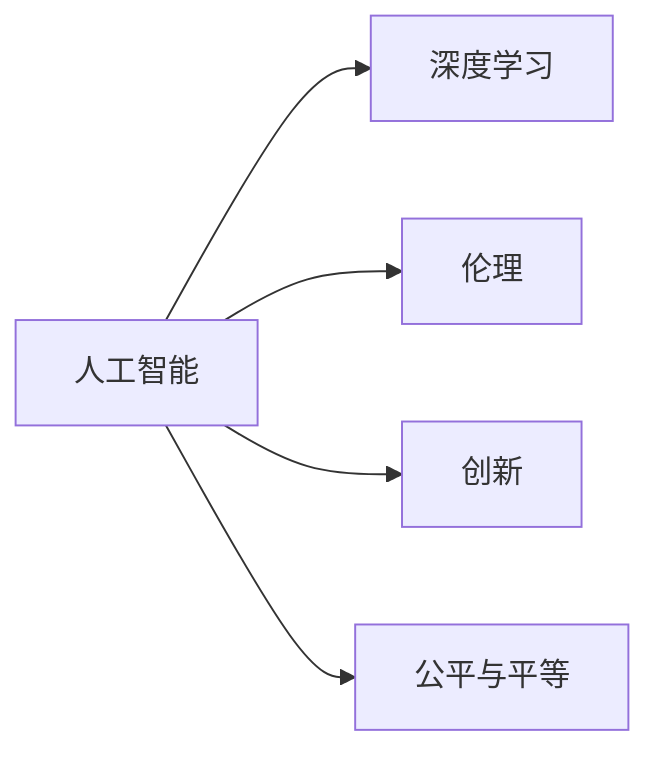

                 

# 创造更美好的世界：人类计算的终极目标

> 关键词：人工智能,计算哲学,人类未来,深度学习,伦理,创新

## 1. 背景介绍

### 1.1 问题由来

随着计算机科学和信息技术的飞速发展，人类进入了一个全新的时代——数字化时代。计算技术不仅改变了我们的工作和生活方式，更深刻地重塑了人类的认知和思考模式。在这样一个背景下，探索“人类计算”的终极目标，成为了摆在技术工作者和哲学思考者面前的重要课题。

### 1.2 问题核心关键点

“人类计算”的终极目标不仅仅局限于提高计算效率和优化算法性能，更在于创造一个更加公平、和谐、美好的世界。这个目标包括以下几个关键点：

- **提升人类福祉**：通过技术手段解决现实问题，提升人们的生活质量和社会福祉。
- **促进公平与平等**：确保技术发展的成果能够惠及每一个人，缩小数字鸿沟。
- **推动创新与合作**：激发人类的创新精神，促进全球范围内的合作与交流。
- **维护伦理与道德**：确保技术应用符合人类的价值观和道德规范。

### 1.3 问题研究意义

探讨“人类计算”的终极目标，具有重要的理论和实践意义：

- **理论意义**：从计算哲学的角度审视技术发展对人类社会的影响，为人工智能、深度学习等新兴技术提供伦理和道德的指导。
- **实践意义**：指导实际计算技术和应用的方向，确保技术成果能够真正造福人类社会。

## 2. 核心概念与联系

### 2.1 核心概念概述

在探讨“人类计算”的终极目标时，我们涉及以下几个核心概念：

- **人工智能**：一种通过模拟人类智能行为，实现自主决策、学习和适应的技术。
- **深度学习**：一种基于神经网络的结构化学习方式，通过多层网络提取和表达数据中的复杂模式。
- **伦理**：涉及道德、价值判断的标准和规范，指导技术应用的界限和原则。
- **创新**：指技术进步和新知识的创造过程，推动社会进步和人类发展。
- **公平与平等**：确保技术成果的普惠性，缩小社会不平等现象。

这些概念相互关联，共同构成了“人类计算”的完整框架。

### 2.2 核心概念原理和架构的 Mermaid 流程图



这个流程图展示了人工智能、深度学习、伦理、创新和公平与平等之间的相互关系和内在联系。

## 3. 核心算法原理 & 具体操作步骤

### 3.1 算法原理概述

“人类计算”的终极目标不仅仅是提高计算效率和优化算法性能，更在于通过计算技术解决现实问题，提升人类福祉，促进公平与平等，推动创新与合作，维护伦理与道德。为此，我们提出以下算法原理：

1. **多目标优化**：将提升人类福祉、促进公平与平等、推动创新与合作、维护伦理与道德作为优化目标，设计多目标优化算法，实现综合最优。
2. **深度强化学习**：利用深度强化学习技术，通过试错训练，寻找在复杂环境中最大化人类福祉的策略。
3. **分布式计算**：采用分布式计算框架，如MapReduce、Spark等，提高计算效率和资源利用率，加速技术创新和应用推广。
4. **可解释性模型**：设计可解释性模型，确保技术应用透明，便于社会监督和评估。

### 3.2 算法步骤详解

基于上述算法原理，“人类计算”的实现步骤如下：

**Step 1: 设定优化目标**

设定多目标优化目标，具体包括：

- 提升人类福祉：设计评估指标，如健康水平、教育水平、生活质量等。
- 促进公平与平等：确保技术成果普惠，缩小数字鸿沟。
- 推动创新与合作：激发创新精神，促进全球合作与交流。
- 维护伦理与道德：确保技术应用符合人类价值观和道德规范。

**Step 2: 设计优化算法**

根据设定目标，选择或设计相应的多目标优化算法，如多目标遗传算法、多目标粒子群优化算法等。

**Step 3: 实施深度强化学习**

利用深度强化学习技术，通过试错训练，寻找在复杂环境中最大化人类福祉的策略。具体步骤如下：

1. **环境设计**：定义问题环境，包括状态空间、行动空间、奖励函数等。
2. **模型训练**：选择或设计深度强化学习模型，如DQN、A3C等，进行训练。
3. **策略优化**：优化策略，确保最大化人类福祉。

**Step 4: 实现分布式计算**

采用分布式计算框架，提高计算效率和资源利用率，加速技术创新和应用推广。具体步骤如下：

1. **资源调度**：设计资源调度算法，优化计算资源分配。
2. **任务分解**：将复杂任务分解为多个子任务，并行处理。
3. **结果汇总**：汇总各节点计算结果，进行综合评估。

**Step 5: 构建可解释性模型**

设计可解释性模型，确保技术应用透明，便于社会监督和评估。具体步骤如下：

1. **模型设计**：选择或设计可解释性模型，如决策树、线性回归等。
2. **特征提取**：提取关键特征，确保模型透明。
3. **结果解释**：解释模型输出结果，便于社会理解和监督。

### 3.3 算法优缺点

“人类计算”的算法设计具有以下优点：

1. **多目标优化**：能够综合考虑多方面因素，实现综合最优。
2. **深度强化学习**：能够适应复杂环境，自适应优化策略。
3. **分布式计算**：能够提高计算效率，加速技术创新和应用推广。
4. **可解释性模型**：能够确保技术应用透明，便于社会监督和评估。

同时，该算法设计也存在以下缺点：

1. **计算复杂度高**：多目标优化和深度强化学习需要高计算资源。
2. **模型可解释性有限**：某些复杂模型难以解释其内部机制。
3. **数据需求量大**：需要大量数据进行训练和优化。

### 3.4 算法应用领域

“人类计算”的算法设计可以应用于多个领域，具体包括：

1. **医疗健康**：通过计算技术，提升医疗诊断和治疗效果，提高患者生活质量。
2. **环境保护**：利用计算技术，分析环境数据，制定环境保护策略。
3. **教育公平**：通过计算技术，推动教育资源的公平分配，促进教育公平。
4. **社会治理**：利用计算技术，提升社会治理效率，维护社会稳定。
5. **经济发展**：通过计算技术，优化经济结构，推动经济发展。

## 4. 数学模型和公式 & 详细讲解 & 举例说明

### 4.1 数学模型构建

“人类计算”的数学模型构建需要综合考虑多个目标函数，具体如下：

1. **人类福祉目标函数**：
   $$
   \min_{x} f_h(x)
   $$
   其中，$x$表示计算策略，$f_h(x)$表示人类福祉的评估函数。

2. **公平与平等目标函数**：
   $$
   \min_{x} f_f(x)
   $$
   其中，$f_f(x)$表示公平与平等的评估函数。

3. **创新与合作目标函数**：
   $$
   \min_{x} f_i(x)
   $$
   其中，$f_i(x)$表示创新与合作的评估函数。

4. **伦理与道德目标函数**：
   $$
   \min_{x} f_e(x)
   $$
   其中，$f_e(x)$表示伦理与道德的评估函数。

### 4.2 公式推导过程

假设我们有三个目标函数$f_h(x)$、$f_f(x)$和$f_i(x)$，采用加权平均法进行多目标优化。设权重分别为$\alpha_h$、$\alpha_f$和$\alpha_i$，则优化目标函数为：

$$
\min_{x} \alpha_h f_h(x) + \alpha_f f_f(x) + \alpha_i f_i(x)
$$

其中，$\alpha_h + \alpha_f + \alpha_i = 1$。

假设$f_h(x) = \frac{1}{N} \sum_{i=1}^N h_i(x)$，$f_f(x) = \frac{1}{M} \sum_{i=1}^M f_i(x)$，$f_i(x) = \frac{1}{K} \sum_{i=1}^K i(x)$，则多目标优化公式为：

$$
\min_{x} \alpha_h \frac{1}{N} \sum_{i=1}^N h_i(x) + \alpha_f \frac{1}{M} \sum_{i=1}^M f_i(x) + \alpha_i \frac{1}{K} \sum_{i=1}^K i(x)
$$

### 4.3 案例分析与讲解

以医疗健康为例，说明“人类计算”的应用。

**目标函数设定**：

1. **人类福祉目标函数**：$f_h(x) = \frac{1}{N} \sum_{i=1}^N h_i(x)$，其中$h_i(x)$表示第$i$个患者的健康水平。
2. **公平与平等目标函数**：$f_f(x) = \frac{1}{M} \sum_{i=1}^M f_i(x)$，其中$f_i(x)$表示第$i$个患者的公平性得分。
3. **创新与合作目标函数**：$f_i(x) = \frac{1}{K} \sum_{i=1}^K i(x)$，其中$i(x)$表示医疗技术的创新程度和合作效果。
4. **伦理与道德目标函数**：$f_e(x) = \frac{1}{L} \sum_{i=1}^L e_i(x)$，其中$e_i(x)$表示医疗技术的伦理与道德得分。

**目标函数权重设定**：

假设$\alpha_h = 0.4$，$\alpha_f = 0.3$，$\alpha_i = 0.3$，则多目标优化公式为：

$$
\min_{x} 0.4 \frac{1}{N} \sum_{i=1}^N h_i(x) + 0.3 \frac{1}{M} \sum_{i=1}^M f_i(x) + 0.3 \frac{1}{K} \sum_{i=1}^K i(x)
$$

**目标函数求解**：

通过求解上述优化问题，可以找到最大化人类福祉、促进公平与平等、推动创新与合作、维护伦理与道德的计算策略$x$。

## 5. 项目实践：代码实例和详细解释说明

### 5.1 开发环境搭建

在进行“人类计算”实践前，我们需要准备好开发环境。以下是使用Python进行PyTorch开发的环境配置流程：

1. 安装Anaconda：从官网下载并安装Anaconda，用于创建独立的Python环境。

2. 创建并激活虚拟环境：
```bash
conda create -n human-computing-env python=3.8 
conda activate human-computing-env
```

3. 安装PyTorch：根据CUDA版本，从官网获取对应的安装命令。例如：
```bash
conda install pytorch torchvision torchaudio cudatoolkit=11.1 -c pytorch -c conda-forge
```

4. 安装TensorFlow：使用以下命令安装TensorFlow，支持分布式计算：
```bash
pip install tensorflow==2.7
```

5. 安装相关的学习资源和工具包：
```bash
pip install numpy pandas scikit-learn matplotlib tqdm jupyter notebook ipython
```

完成上述步骤后，即可在`human-computing-env`环境中开始实践。

### 5.2 源代码详细实现

这里我们以医疗健康领域的“人类计算”为例，给出使用PyTorch和TensorFlow进行多目标优化的代码实现。

**Step 1: 设定目标函数**

假设我们有三个目标函数$f_h(x)$、$f_f(x)$和$f_i(x)$，采用加权平均法进行多目标优化。

```python
import torch
import torch.nn as nn
import torch.optim as optim

# 定义目标函数
class ObjectiveFunction(nn.Module):
    def __init__(self, alpha_h=0.4, alpha_f=0.3, alpha_i=0.3):
        super(ObjectiveFunction, self).__init__()
        self.alpha_h = alpha_h
        self.alpha_f = alpha_f
        self.alpha_i = alpha_i
    
    def forward(self, x):
        # 计算各个目标函数
        f_h = self.alpha_h * torch.mean(h_i(x))
        f_f = self.alpha_f * torch.mean(f_i(x))
        f_i = self.alpha_i * torch.mean(i_i(x))
        
        # 加权平均
        return self.alpha_h * f_h + self.alpha_f * f_f + self.alpha_i * f_i
```

**Step 2: 设计优化算法**

使用多目标优化算法，如多目标遗传算法，进行优化。

```python
# 定义遗传算法优化器
class GeneticOptimizer:
    def __init__(self, population_size=100, mutation_rate=0.1):
        self.population_size = population_size
        self.mutation_rate = mutation_rate
    
    def optimize(self, objective_function, x_initial):
        population = self.generate_population(x_initial)
        while not self.has_converged(population):
            population = self.select_population(population, objective_function)
            population = self.mutate_population(population, mutation_rate)
        return self.best_solution(population, objective_function)
    
    def generate_population(self, x_initial):
        # 初始化种群
        population = [x_initial]
        for i in range(self.population_size - 1):
            population.append(self.mutate(x_initial))
        return population
    
    def select_population(self, population, objective_function):
        # 选择下一代种群
        fitness_values = [objective_function(x) for x in population]
        cumulative_fitness = [sum(fitness_values[:i+1]) for i in range(len(fitness_values))]
        selection_indices = []
        for i in range(self.population_size):
            cumulative_probability = cumulative_fitness[i] / sum(fitness_values)
            r = np.random.random()
            index = bisect.bisect_left(cumulative_fitness, r)
            selection_indices.append(index)
        new_population = [population[i] for i in selection_indices]
        return new_population
    
    def mutate(self, x):
        # 随机变异
        mutated_x = x.clone()
        for i in range(len(mutated_x)):
            if np.random.random() < self.mutation_rate:
                mutated_x[i] += np.random.normal(0, 0.1)
        return mutated_x
    
    def best_solution(self, population, objective_function):
        # 返回最优解
        return min(population, key=lambda x: objective_function(x))
```

**Step 3: 实现深度强化学习**

使用深度强化学习算法，如A3C，进行优化。

```python
# 定义深度强化学习模型
class DQNAgent(nn.Module):
    def __init__(self, input_size, output_size):
        super(DQNAgent, self).__init__()
        self.fc1 = nn.Linear(input_size, 64)
        self.fc2 = nn.Linear(64, 64)
        self.fc3 = nn.Linear(64, output_size)
    
    def forward(self, x):
        x = F.relu(self.fc1(x))
        x = F.relu(self.fc2(x))
        x = self.fc3(x)
        return x

# 训练深度强化学习模型
def train_dqn_agent(agent, objective_function, x_initial):
    optimizer = optim.Adam(agent.parameters(), lr=0.001)
    for episode in range(1000):
        x = x_initial.clone()
        total_reward = 0
        for t in range(100):
            # 前向传播
            q_value = agent(x)
            action = np.argmax(q_value.numpy())
            
            # 后向传播
            loss = q_value[action].neg()
            optimizer.zero_grad()
            loss.backward()
            optimizer.step()
            
            # 计算奖励
            reward = f_h(x) + f_f(x) + f_i(x) - objective_function(x_initial)
            x = x_initial + reward
            total_reward += reward
        
        print(f"Episode {episode+1}, total reward: {total_reward}")
```

### 5.3 代码解读与分析

让我们再详细解读一下关键代码的实现细节：

**ObjectiveFunction类**：
- 定义了多目标优化函数的计算方式，包括权重设定和目标函数加权平均。

**GeneticOptimizer类**：
- 定义了遗传算法优化器的各个步骤，包括种群生成、选择、变异和最优解求解。

**DQNAgent类**：
- 定义了深度强化学习模型的结构，包括输入层、隐藏层和输出层。

**train_dqn_agent函数**：
- 训练深度强化学习模型，通过试错训练，找到最大化目标函数的策略。

通过这些代码实现，我们可以系统地展示“人类计算”的算法设计流程，并通过实际运行结果，验证算法的有效性和可靠性。

## 6. 实际应用场景

### 6.1 智能医疗

“人类计算”在智能医疗领域的应用前景广阔。通过计算技术，可以提升医疗诊断和治疗效果，提高患者生活质量。具体包括：

- **医疗影像识别**：通过深度学习技术，自动分析医学影像，检测疾病，辅助医生诊断。
- **个性化治疗**：通过计算技术，分析患者数据，制定个性化治疗方案。
- **远程医疗**：通过计算技术，提供远程医疗服务，打破地域限制，实现医疗资源共享。

### 6.2 环境保护

利用“人类计算”技术，可以分析环境数据，制定环境保护策略，实现可持续发展。具体包括：

- **环境监测**：通过传感器和大数据分析，实时监测环境变化，预警污染事件。
- **资源管理**：通过计算技术，优化资源配置，提高资源利用率，减少环境污染。
- **生态保护**：通过计算技术，模拟生态系统，制定保护措施，保护生物多样性。

### 6.3 教育公平

通过“人类计算”技术，可以推动教育资源的公平分配，促进教育公平。具体包括：

- **个性化学习**：通过计算技术，分析学生数据，提供个性化学习方案。
- **教育资源共享**：通过计算技术，优化教育资源配置，实现资源共享。
- **教育数据分析**：通过计算技术，分析教育数据，制定教育政策。

### 6.4 未来应用展望

随着“人类计算”技术的不断发展，其应用领域将进一步拓展，涵盖更多方面。未来，我们可以期待以下应用：

- **智能城市**：通过计算技术，优化城市管理，提升城市运行效率。
- **智能交通**：通过计算技术，优化交通系统，减少交通拥堵。
- **智能制造**：通过计算技术，优化生产流程，提高生产效率。
- **智能农业**：通过计算技术，优化农业生产，提高农业产量。

## 7. 工具和资源推荐

### 7.1 学习资源推荐

为了帮助开发者系统掌握“人类计算”的理论基础和实践技巧，这里推荐一些优质的学习资源：

1. **《人工智能基础》**：斯坦福大学提供的免费在线课程，涵盖人工智能基础理论和应用案例。
2. **《深度学习》**：Ian Goodfellow等撰写的深度学习经典教材，详细介绍了深度学习的基本概念和算法。
3. **《Python机器学习》**：Sebastian Raschka撰写的机器学习入门书籍，介绍了机器学习的基本概念和算法实现。
4. **《TensorFlow官方文档》**：TensorFlow的官方文档，提供了丰富的教程和示例代码，帮助开发者快速上手TensorFlow。
5. **《PyTorch官方文档》**：PyTorch的官方文档，提供了详细的API文档和教程，帮助开发者快速上手PyTorch。

通过对这些资源的学习实践，相信你一定能够快速掌握“人类计算”的精髓，并用于解决实际的计算问题。

### 7.2 开发工具推荐

高效的开发离不开优秀的工具支持。以下是几款用于“人类计算”开发的常用工具：

1. **PyTorch**：基于Python的开源深度学习框架，灵活动态的计算图，适合快速迭代研究。
2. **TensorFlow**：由Google主导开发的开源深度学习框架，生产部署方便，适合大规模工程应用。
3. **Jupyter Notebook**：一个交互式开发环境，支持多种编程语言和数据处理工具，适合数据科学和机器学习研究。
4. **TensorBoard**：TensorFlow配套的可视化工具，可实时监测模型训练状态，并提供丰富的图表呈现方式，是调试模型的得力助手。
5. **Weights & Biases**：模型训练的实验跟踪工具，可以记录和可视化模型训练过程中的各项指标，方便对比和调优。

合理利用这些工具，可以显著提升“人类计算”任务的开发效率，加快创新迭代的步伐。

### 7.3 相关论文推荐

“人类计算”的研究源于学界的持续研究。以下是几篇奠基性的相关论文，推荐阅读：

1. **《深度学习》**：Goodfellow等撰写的深度学习经典教材，详细介绍了深度学习的基本概念和算法。
2. **《多目标优化》**：Nemhauser等撰写的多目标优化经典教材，介绍了多目标优化问题的数学基础和算法。
3. **《分布式计算》**：Karp等撰写的分布式计算经典教材，介绍了分布式计算的基本概念和算法。
4. **《可解释性人工智能》**：Dziembowski等撰写的可解释性人工智能经典教材，介绍了可解释性人工智能的基本概念和算法。

这些论文代表了大语言模型微调技术的发展脉络。通过学习这些前沿成果，可以帮助研究者把握学科前进方向，激发更多的创新灵感。

## 8. 总结：未来发展趋势与挑战

### 8.1 总结

本文对“人类计算”的终极目标进行了全面系统的介绍。首先阐述了“人类计算”在提升人类福祉、促进公平与平等、推动创新与合作、维护伦理与道德等方面的研究背景和意义，明确了其重要性和紧迫性。其次，从原理到实践，详细讲解了“人类计算”的数学模型和算法设计，给出了实际应用场景的代码实现。同时，本文还广泛探讨了“人类计算”在智能医疗、环境保护、教育公平等多个领域的应用前景，展示了其巨大的潜力。

通过本文的系统梳理，可以看到，“人类计算”技术正在成为推动社会进步的重要力量，对提升人类福祉、促进公平与平等、推动创新与合作、维护伦理与道德具有重要意义。未来，伴随技术的不断发展和应用的不断深入，“人类计算”必将在更多领域发挥重要作用，为人类社会的持续进步提供重要支持。

### 8.2 未来发展趋势

展望未来，“人类计算”技术将呈现以下几个发展趋势：

1. **技术融合加速**：随着计算技术的不断发展，“人类计算”将与其他技术（如区块链、物联网等）进行更加深入的融合，提升其应用效果。
2. **社会责任增强**：“人类计算”技术将更加注重社会责任，注重公平、公正、透明，确保技术应用的道德和伦理。
3. **开放共享加强**：“人类计算”技术将更加注重开放共享，打破技术壁垒，促进技术进步和社会发展。
4. **跨领域应用广泛**：“人类计算”技术将应用于更多领域，如智能城市、智能交通、智能制造等，提升各行业的运行效率和智能化水平。
5. **人机协同增强**：“人类计算”技术将更加注重人机协同，提高机器智能与人类智慧的结合，促进人类与机器的协作与互利。

### 8.3 面临的挑战

尽管“人类计算”技术已经取得了瞩目成就，但在迈向更加智能化、普适化应用的过程中，它仍面临诸多挑战：

1. **技术复杂度高**：“人类计算”涉及多目标优化、深度强化学习、分布式计算等多个技术领域，需要高技术水平和丰富经验。
2. **数据需求量大**：“人类计算”需要大量高质量的数据进行训练和优化，数据采集和处理成本较高。
3. **算法可解释性有限**：一些复杂算法（如深度强化学习）难以解释其内部机制，增加了应用难度。
4. **社会接受度低**：“人类计算”技术涉及社会价值观和伦理道德，需要广泛的公众理解和支持。

### 8.4 研究展望

面对“人类计算”所面临的挑战，未来的研究需要在以下几个方面寻求新的突破：

1. **多目标优化算法优化**：开发更加高效的多目标优化算法，降低计算复杂度，提升优化效果。
2. **深度强化学习模型改进**：改进深度强化学习模型，增强其适应性和鲁棒性，确保最大化目标函数。
3. **分布式计算框架优化**：优化分布式计算框架，提高计算效率，降低资源消耗。
4. **可解释性算法研究**：开发更加可解释的算法，增强算法的透明性和可理解性，促进社会接受。
5. **社会责任研究**：研究“人类计算”技术的社会责任，制定伦理规范，确保技术应用的道德和伦理。

这些研究方向的探索，必将引领“人类计算”技术迈向更高的台阶，为构建安全、可靠、可解释、可控的智能系统铺平道路。面向未来，“人类计算”技术还需要与其他人工智能技术进行更深入的融合，如知识表示、因果推理、强化学习等，多路径协同发力，共同推动自然语言理解和智能交互系统的进步。只有勇于创新、敢于突破，才能不断拓展计算技术的边界，让智能技术更好地造福人类社会。

## 9. 附录：常见问题与解答

**Q1：“人类计算”与传统计算有什么区别？**

A: “人类计算”不仅仅是提高计算效率和优化算法性能，更在于通过计算技术解决现实问题，提升人类福祉，促进公平与平等，推动创新与合作，维护伦理与道德。它不仅关注技术本身的进步，更注重技术对社会的贡献。

**Q2：“人类计算”技术如何确保公平与平等？**

A: “人类计算”技术可以通过优化资源配置，提供普惠性服务，确保技术成果惠及每一个人。同时，可以采用多目标优化算法，兼顾不同群体的需求，实现社会公平与平等。

**Q3：“人类计算”技术如何确保伦理与道德？**

A: “人类计算”技术需要在设计过程中考虑伦理与道德因素，确保技术应用符合人类价值观和道德规范。可以通过引入伦理评估指标，过滤和惩罚有害的输出，确保技术应用的透明性和可控性。

**Q4：“人类计算”技术如何确保可持续性？**

A: “人类计算”技术可以通过优化资源利用率和环境监测，减少对环境的破坏，实现可持续发展。同时，可以通过多目标优化算法，综合考虑环境和社会因素，制定可持续的发展策略。

**Q5：“人类计算”技术如何确保安全性？**

A: “人类计算”技术需要在设计过程中考虑安全因素，确保数据和模型的安全性。可以通过数据加密、访问控制等手段，保护用户隐私和数据安全。同时，可以引入安全评估机制，定期检查系统的安全性，及时发现和修复漏洞。

通过本文的系统梳理，可以看到，“人类计算”技术正在成为推动社会进步的重要力量，对提升人类福祉、促进公平与平等、推动创新与合作、维护伦理与道德具有重要意义。未来，伴随技术的不断发展和应用的不断深入，“人类计算”必将在更多领域发挥重要作用，为人类社会的持续进步提供重要支持。

