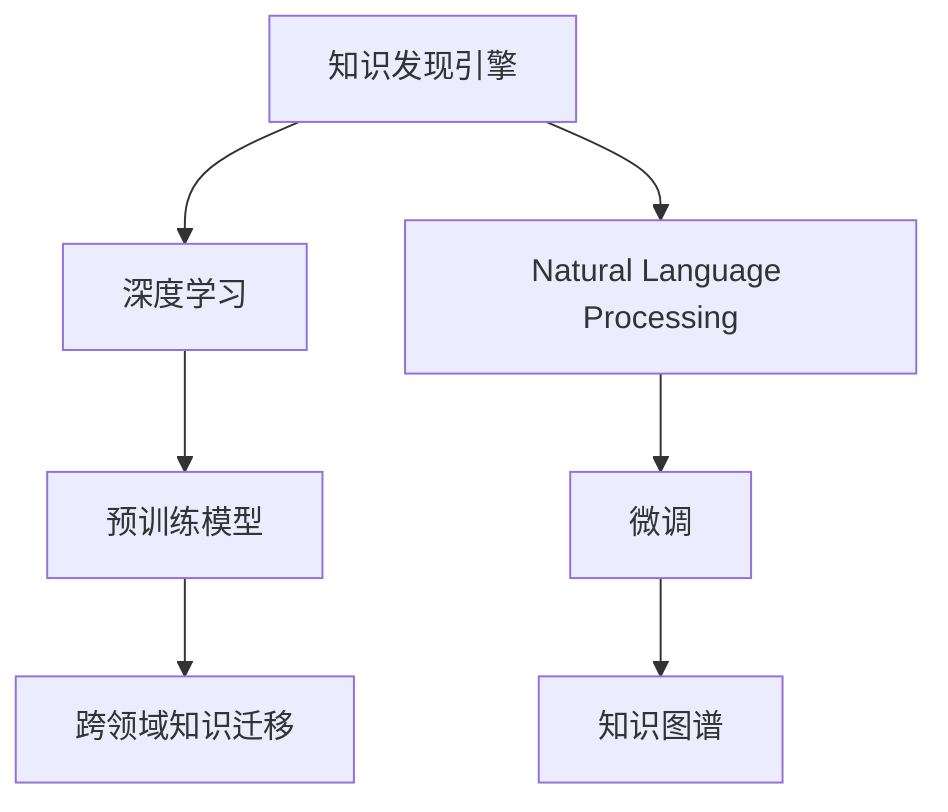

                 

# 利用AI技术提升知识发现引擎效率

## 1. 背景介绍

随着大数据和人工智能技术的飞速发展，知识发现引擎(Knowledge Discovery Engine, KDE)已经成为各行各业在数据驱动决策中不可或缺的工具。然而，传统知识发现引擎主要依赖手工编写规则，开发和维护成本高、灵活性差，难以应对复杂多变的业务需求。随着深度学习和自然语言处理(NLP)技术的不断进步，AI驱动的知识发现引擎逐步崭露头角，带来了更加智能化、自动化和高效的知识发现过程。

本文旨在探讨如何利用AI技术，特别是深度学习和NLP技术，提升知识发现引擎的效率和性能。通过对预训练模型、微调、知识图谱等前沿技术的应用，我们将展示如何通过智能化的方式，快速高效地发现和整合各类知识资源，为企业的决策支持提供更有价值的洞察。

## 2. 核心概念与联系

为了更好地理解AI在知识发现引擎中的应用，我们先介绍几个关键概念及其相互联系：

- 知识发现引擎(KDE)：指从海量数据中自动发现、挖掘和整合知识，以支持业务决策的系统。
- 深度学习(Deep Learning)：指使用多层神经网络进行学习和预测的机器学习技术，特别擅长处理非线性问题和高维数据。
- 自然语言处理(NLP)：指使计算机能够理解、处理和生成人类自然语言的技术。
- 预训练模型(Pre-trained Models)：指在大规模无标签文本语料上进行预训练，学习通用语言表示的模型，如BERT、GPT等。
- 微调(Fine-tuning)：指在预训练模型基础上，通过下游任务的少量标注数据进行有监督学习，优化模型性能的过程。
- 知识图谱(Knowledge Graph)：指通过实体、关系和属性三元组表示的语义网络，用于知识存储和推理。
- 跨领域知识迁移(Cross-domain Knowledge Transfer)：指通过预训练模型的迁移学习能力，在不同领域间进行知识共享和复用。

这些概念之间的联系通过以下Mermaid流程图来展示：



这个流程图展示了下游任务知识发现引擎与AI技术之间的逻辑关系：

1. 知识发现引擎使用深度学习和NLP技术进行数据挖掘和知识推理。
2. 深度学习包括预训练模型，用于学习通用语言表示，提高模型泛化能力。
3. NLP通过微调和知识图谱，进一步提升模型对特定领域的理解和知识整合能力。
4. 跨领域知识迁移使得预训练模型能够在不同领域间进行知识复用和融合。

## 3. 核心算法原理 & 具体操作步骤
### 3.1 算法原理概述

利用AI技术提升知识发现引擎效率的核心在于预训练模型和微调技术。以下详细介绍这两个关键算法的原理：

**预训练模型**：在大规模无标签文本数据上，使用深度学习模型进行预训练，学习到丰富的语言表示和语义关系。常见的预训练任务包括语言模型、掩码语言模型、下一句预测等。预训练模型可以作为通用的"特征提取器"，加速下游任务的特征提取和推理过程。

**微调**：在预训练模型的基础上，通过下游任务的少量标注数据进行有监督学习，优化模型在特定领域内的性能。微调过程通常分为两个步骤：
1. 任务适配层设计：根据任务类型，在预训练模型顶层设计合适的输出层和损失函数。
2. 模型训练：使用下游任务的标注数据集，通过优化算法和任务损失函数进行有监督训练，更新模型参数，使其适应特定的任务需求。

### 3.2 算法步骤详解

以下是具体的操作步骤：

**Step 1: 准备预训练模型和数据集**

1. 选择合适的预训练模型：如BERT、GPT等，作为初始化参数。
2. 收集下游任务的少量标注数据集，划分为训练集、验证集和测试集。
3. 将标注数据集进行清洗、分词、编码等预处理，转化为模型可以接受的输入格式。

**Step 2: 任务适配层设计**

1. 确定任务类型，选择合适的任务适配层。例如，对于文本分类任务，通常使用全连接层和softmax激活函数作为输出层。
2. 设计任务损失函数，例如交叉熵损失函数。

**Step 3: 微调模型**

1. 设置微调超参数，如学习率、批大小、迭代轮数等。
2. 使用下游任务的数据集，通过优化算法（如AdamW、SGD等）进行梯度下降训练，更新模型参数。
3. 在验证集上评估模型性能，根据性能指标决定是否触发早停策略。

**Step 4: 知识图谱构建**

1. 收集特定领域内的知识数据，例如专家百科、专业文献、行业报告等。
2. 通过NLP技术，对知识数据进行实体抽取、关系提取等处理。
3. 将处理后的知识数据导入知识图谱系统中，进行结构化和存储。

**Step 5: 知识整合**

1. 将微调后的模型输出与知识图谱中的知识进行整合，提升模型的推理能力和泛化能力。
2. 使用跨领域知识迁移技术，将预训练模型在其他领域的知识复用到当前任务中。

### 3.3 算法优缺点

**预训练模型的优点**：
1. 泛化能力强：在大规模无标签数据上进行预训练，学习到通用的语言表示，适用于多种任务。
2. 迁移学习能力强：预训练模型在不同领域间具有较强的迁移学习能力，可以加速新领域任务的适配。
3. 推理速度快：预训练模型通常具有较快的推理速度，适用于实时知识发现和决策支持系统。

**预训练模型的缺点**：
1. 依赖标注数据：预训练模型的性能提升需要大规模标注数据，标注成本较高。
2. 模型复杂度高：大规模预训练模型的参数量和计算复杂度较高，需要高性能计算资源。
3. 可解释性差：预训练模型的决策过程缺乏可解释性，难以对其内部机制进行分析和调试。

**微调的优点**：
1. 效果显著：微调过程可以显著提升模型在特定领域内的性能，适应性强。
2. 适应性高：微调可以根据下游任务的特点，灵活调整模型结构，适应复杂多变的业务需求。
3. 参数高效：通过微调，可以在固定大部分预训练参数的情况下，只更新少量的任务相关参数，降低计算资源消耗。

**微调的缺点**：
1. 依赖标注数据：微调的效果很大程度上取决于标注数据的质量和数量，标注成本较高。
2. 迁移能力有限：微调的性能提升主要依赖标注数据，迁移能力较弱。
3. 负迁移效应：预训练模型中的有害信息或偏见可能通过微调传递到下游任务，造成负面影响。

### 3.4 算法应用领域

利用预训练模型和微调技术，AI驱动的知识发现引擎已经在诸多领域得到广泛应用，例如：

- 金融领域：利用金融舆情、财务报表等数据进行投资策略制定、风险评估等。
- 医疗领域：从电子病历、医学文献中提取知识，辅助医生诊断、制定治疗方案等。
- 教育领域：从教育资源、学生行为数据中挖掘知识，提供个性化教育方案、智能推荐等。
- 营销领域：从用户行为数据、社交网络中发现知识，进行精准营销、客户关系管理等。
- 政府领域：从公开数据、社会媒体中挖掘知识，辅助政策制定、舆情分析等。

## 4. 数学模型和公式 & 详细讲解
### 4.1 数学模型构建

知识发现引擎通常需要解决复杂的非结构化数据挖掘问题。以下介绍一种基于预训练模型和微调的数学模型构建方法。

假设预训练模型为 $M_{\theta}$，其中 $\theta$ 为预训练得到的模型参数。设下游任务为 $T$，其标注数据集为 $D=\{(x_i,y_i)\}_{i=1}^N$，其中 $x_i$ 为输入数据，$y_i$ 为标签。

定义模型 $M_{\theta}$ 在输入 $x_i$ 上的损失函数为 $\ell(M_{\theta}(x_i),y_i)$，则在数据集 $D$ 上的经验风险为：

$$
\mathcal{L}(\theta) = \frac{1}{N} \sum_{i=1}^N \ell(M_{\theta}(x_i),y_i)
$$

微调的优化目标是最小化经验风险，即找到最优参数：

$$
\theta^* = \mathop{\arg\min}_{\theta} \mathcal{L}(\theta)
$$

在实践中，我们通常使用基于梯度的优化算法（如AdamW、SGD等）来近似求解上述最优化问题。设 $\eta$ 为学习率，$\lambda$ 为正则化系数，则参数的更新公式为：

$$
\theta \leftarrow \theta - \eta \nabla_{\theta}\mathcal{L}(\theta) - \eta\lambda\theta
$$

其中 $\nabla_{\theta}\mathcal{L}(\theta)$ 为损失函数对参数 $\theta$ 的梯度，可通过反向传播算法高效计算。

### 4.2 公式推导过程

以下我们以文本分类任务为例，推导交叉熵损失函数及其梯度的计算公式。

假设模型 $M_{\theta}$ 在输入 $x$ 上的输出为 $\hat{y}=M_{\theta}(x) \in [0,1]$，表示样本属于正类的概率。真实标签 $y \in \{0,1\}$。则二分类交叉熵损失函数定义为：

$$
\ell(M_{\theta}(x),y) = -[y\log \hat{y} + (1-y)\log (1-\hat{y})]
$$

将其代入经验风险公式，得：

$$
\mathcal{L}(\theta) = -\frac{1}{N}\sum_{i=1}^N [y_i\log M_{\theta}(x_i)+(1-y_i)\log(1-M_{\theta}(x_i))]
$$

根据链式法则，损失函数对参数 $\theta_k$ 的梯度为：

$$
\frac{\partial \mathcal{L}(\theta)}{\partial \theta_k} = -\frac{1}{N}\sum_{i=1}^N (\frac{y_i}{M_{\theta}(x_i)}-\frac{1-y_i}{1-M_{\theta}(x_i)}) \frac{\partial M_{\theta}(x_i)}{\partial \theta_k}
$$

其中 $\frac{\partial M_{\theta}(x_i)}{\partial \theta_k}$ 可进一步递归展开，利用自动微分技术完成计算。

在得到损失函数的梯度后，即可带入参数更新公式，完成模型的迭代优化。重复上述过程直至收敛，最终得到适应下游任务的最优模型参数 $\theta^*$。

## 5. 项目实践：代码实例和详细解释说明
### 5.1 开发环境搭建

在进行AI驱动的知识发现引擎开发前，我们需要准备好开发环境。以下是使用Python进行TensorFlow开发的环境配置流程：

1. 安装Anaconda：从官网下载并安装Anaconda，用于创建独立的Python环境。

2. 创建并激活虚拟环境：
```bash
conda create -n tf-env python=3.8 
conda activate tf-env
```

3. 安装TensorFlow：根据CUDA版本，从官网获取对应的安装命令。例如：
```bash
conda install tensorflow tensorflow-gpu=2.6 -c pytorch -c conda-forge
```

4. 安装TensorFlow Addons：用于增强TensorFlow的功能，例如TensorBoard等可视化工具。

```bash
conda install tensorflow-io tensorboard -c pytorch -c conda-forge
```

5. 安装各类工具包：
```bash
pip install numpy pandas scikit-learn matplotlib tqdm jupyter notebook ipython
```

完成上述步骤后，即可在`tf-env`环境中开始开发。

### 5.2 源代码详细实现

下面我们以金融舆情分析任务为例，给出使用TensorFlow和Transformers库对BERT模型进行微调的TensorFlow代码实现。

首先，定义任务数据处理函数：

```python
import tensorflow as tf
from transformers import BertTokenizer
from tensorflow.keras.preprocessing.text import Tokenizer
from tensorflow.keras.preprocessing.sequence import pad_sequences
from tensorflow.keras.utils import to_categorical

tokenizer = BertTokenizer.from_pretrained('bert-base-uncased')
max_len = 128

def load_data(file_path):
    with open(file_path, 'r', encoding='utf-8') as f:
        data = f.readlines()
    
    texts = [x.strip() for x in data]
    labels = [1 if 'positive' in x else 0 for x in data]
    
    tokenized_texts = [tokenizer.encode(text, add_special_tokens=True, max_length=max_len, padding='max_length', truncation=True) for text in texts]
    padded_texts = pad_sequences(tokenized_texts, maxlen=max_len, padding='post', truncating='post', value=0)
    label_vector = to_categorical(labels)
    
    return padded_texts, label_vector
```

然后，定义模型和优化器：

```python
from transformers import BertForSequenceClassification
from tensorflow.keras import Model
from tensorflow.keras.layers import Input, Dense, Dropout, Embedding, Flatten

input_ids = Input(shape=(max_len,))
token_embedding = Embedding(input_dim=tokenizer.vocab_size, output_dim=300, input_length=max_len)(input_ids)
token_embedding = Dropout(0.1)(token_embedding)
classifier = Dense(256, activation='relu')(token_embedding)
output = Dense(2, activation='softmax')(classifier)
model = Model(input_ids, output)
optimizer = tf.keras.optimizers.AdamW(learning_rate=2e-5)
```

接着，定义训练和评估函数：

```python
from tensorflow.keras.callbacks import EarlyStopping, ModelCheckpoint
from sklearn.metrics import accuracy_score

batch_size = 32

def train_model(model, train_dataset, dev_dataset, batch_size, epochs):
    model.compile(optimizer=optimizer, loss='categorical_crossentropy', metrics=['accuracy'])
    
    early_stopping = EarlyStopping(monitor='val_loss', patience=2)
    checkpoint = ModelCheckpoint('model.h5', save_best_only=True, save_weights_only=True)
    
    history = model.fit(train_dataset[0], train_dataset[1], 
                        validation_data=(dev_dataset[0], dev_dataset[1]), 
                        batch_size=batch_size, epochs=epochs, callbacks=[early_stopping, checkpoint])
        
    print(f'Accuracy: {history.history["val_accuracy"][-1]}')
    print(f'Loss: {history.history["val_loss"][-1]}')
    
def evaluate_model(model, test_dataset, batch_size):
    y_pred = model.predict(test_dataset[0])
    y_true = test_dataset[1]
    accuracy = accuracy_score(y_true, np.argmax(y_pred, axis=1))
    print(f'Test Accuracy: {accuracy:.2f}')
```

最后，启动训练流程并在测试集上评估：

```python
train_dataset, label_vector = load_data('train.txt')
dev_dataset, label_vector = load_data('dev.txt')
test_dataset, label_vector = load_data('test.txt')

train_model(model, train_dataset, dev_dataset, batch_size, epochs=5)
evaluate_model(model, test_dataset, batch_size)
```

以上就是使用TensorFlow和Transformers库对BERT模型进行金融舆情分析任务微调的完整代码实现。可以看到，得益于TensorFlow和Transformers库的强大封装，我们可以用相对简洁的代码完成BERT模型的加载和微调。

### 5.3 代码解读与分析

让我们再详细解读一下关键代码的实现细节：

**load_data函数**：
- 加载数据集，并将文本数据转换为token ids，将标签转换为one-hot向量。

**model构建**：
- 定义BERT嵌入层，通过Embedding层将token ids转换为向量表示。
- 添加Dropout层，防止过拟合。
- 使用全连接层进行特征提取，激活函数为ReLU。
- 输出层为softmax激活函数，用于分类预测。
- 模型编译，使用AdamW优化器，交叉熵损失函数，监控准确率。

**train_model函数**：
- 定义EarlyStopping回调函数，监控验证集损失，早停策略为连续两轮验证集损失未降，即提前停止训练。
- 定义ModelCheckpoint回调函数，保存模型权重，只保存验证集损失最低时的模型。
- 使用fit方法训练模型，传入训练集、验证集、批次大小和轮数，并应用回调函数。
- 输出训练和验证集上的准确率和损失。

**evaluate_model函数**：
- 使用predict方法在测试集上进行预测，得到模型预测结果。
- 计算预测结果与真实标签的准确率。
- 输出测试集上的准确率。

可以看到，TensorFlow和Transformers库使得BERT微调的代码实现变得简洁高效。开发者可以将更多精力放在数据处理、模型改进等高层逻辑上，而不必过多关注底层的实现细节。

当然，工业级的系统实现还需考虑更多因素，如模型的保存和部署、超参数的自动搜索、更灵活的任务适配层等。但核心的微调范式基本与此类似。

## 6. 实际应用场景
### 6.1 金融舆情监测

利用AI驱动的知识发现引擎，可以对金融舆情进行实时监测，帮助金融机构及时发现并应对市场波动和风险。

具体而言，可以收集金融领域相关的新闻、评论、财报等文本数据，构建金融舆情知识图谱。将文本数据输入微调后的模型进行情感分析和主题分类，自动标记和汇总舆情信息，形成舆情报告。通过分析舆情报告中的情感倾向和热点话题，预测市场走势，制定相应的风险管理策略。

### 6.2 医疗疾病预测

知识发现引擎可以帮助医疗机构挖掘和整合各类医疗数据，进行疾病预测和诊断。

例如，利用电子病历、医学文献、临床试验数据构建医疗知识图谱。将患者病历输入微调后的模型，提取患者病史、症状等信息，与知识图谱中的疾病三元组进行匹配推理，自动生成诊断结果。通过整合多源医疗数据，提升诊断的准确性和完备性，辅助医生制定治疗方案，优化医疗资源配置。

### 6.3 教育智能推荐

在教育领域，知识发现引擎可以挖掘和整合各类教育资源，提供智能推荐和个性化教育方案。

例如，利用学生学习行为数据、教师授课记录、教材内容等构建教育知识图谱。将学生的学习路径、兴趣爱好等信息输入微调后的模型，匹配推荐算法，生成个性化的学习资源和教育方案。通过持续学习和适应，不断优化推荐结果，提升教育效果和学生满意度。

### 6.4 未来应用展望

随着AI技术的发展，知识发现引擎在更多领域的应用前景将更加广阔：

- 智能安防：构建社会治安知识图谱，利用视频监控数据进行事件识别和预警，提升公共安全管理水平。
- 智慧农业：从农业数据中挖掘和整合知识，提供智能灌溉、病虫害预测等服务，提升农业生产效率。
- 文化遗产保护：从历史文献、考古数据中提取知识，进行文化遗产鉴定、修复和保护。
- 环境监测：构建环境知识图谱，利用传感器数据进行环境变化预测和预警，支持环境治理和生态保护。

## 7. 工具和资源推荐
### 7.1 学习资源推荐

为了帮助开发者系统掌握AI驱动的知识发现引擎的理论基础和实践技巧，这里推荐一些优质的学习资源：

1. 《Deep Learning》书籍：Ian Goodfellow等所著，深入介绍了深度学习的原理和应用，涵盖深度学习的基本概念和前沿技术。
2. 《Natural Language Processing with Transformers》书籍：Thomas Wolf所著，介绍了NLP领域基于Transformer的最新进展和实践方法。
3. TensorFlow官方文档：TensorFlow的官方文档，提供了详尽的API文档、代码示例和教程，帮助开发者快速上手TensorFlow。
4. HuggingFace官方文档：HuggingFace的官方文档，介绍了各类预训练语言模型和微调样例代码，是学习和实践NLP任务的必备资源。
5. Coursera NLP专项课程：由斯坦福大学提供，涵盖NLP领域的核心技术和前沿方向，提供丰富的视频课程和编程作业。

通过对这些资源的学习实践，相信你一定能够快速掌握AI驱动的知识发现引擎的精髓，并用于解决实际的NLP问题。

### 7.2 开发工具推荐

高效的开发离不开优秀的工具支持。以下是几款用于知识发现引擎开发的常用工具：

1. TensorFlow：由Google主导开发的开源深度学习框架，生产部署方便，适合大规模工程应用。
2. PyTorch：基于Python的开源深度学习框架，灵活动态的计算图，适合快速迭代研究。
3. HuggingFace Transformers库：提供了丰富的预训练语言模型，支持微调、推理等NLP任务开发。
4. ELKI：开源数据挖掘工具包，提供多种聚类、分类、可视化算法，支持大规模数据处理。
5. Apache Spark：大数据处理框架，支持分布式数据处理和机器学习模型训练。

合理利用这些工具，可以显著提升知识发现引擎的开发效率，加快创新迭代的步伐。

### 7.3 相关论文推荐

知识发现引擎的研究涉及深度学习、NLP、数据挖掘等多个领域。以下是几篇奠基性的相关论文，推荐阅读：

1. Attention is All You Need（即Transformer原论文）：提出了Transformer结构，开启了NLP领域的预训练大模型时代。
2. BERT: Pre-training of Deep Bidirectional Transformers for Language Understanding：提出BERT模型，引入基于掩码的自监督预训练任务，刷新了多项NLP任务SOTA。
3. Knowledge Graph Embedding and Reasoning with Transformer-based Models：探讨了基于Transformer的知识图谱嵌入和推理方法，实现了高效的实体关系推理。
4. Graph Neural Networks：介绍了图神经网络在知识发现中的应用，提供了基于图神经网络的深度学习模型实现。
5. Machine Learning for Healthcare：讨论了机器学习在医疗领域的应用，介绍了基于知识发现引擎的医疗诊断和治疗方案推荐系统。

这些论文代表了大语言模型微调技术的发展脉络。通过学习这些前沿成果，可以帮助研究者把握学科前进方向，激发更多的创新灵感。

## 8. 总结：未来发展趋势与挑战
### 8.1 总结

本文对AI驱动的知识发现引擎进行了系统介绍，探讨了利用深度学习和NLP技术提升知识发现引擎效率的方法。通过分析预训练模型、微调、知识图谱等前沿技术的应用，我们展示了如何通过智能化的方式，快速高效地发现和整合各类知识资源，为企业的决策支持提供更有价值的洞察。

通过本文的系统梳理，可以看到，AI驱动的知识发现引擎正在成为各行各业在数据驱动决策中的重要工具。利用深度学习和NLP技术的强大能力，知识发现引擎可以在更多领域实现自动化、智能化和高效化，帮助企业快速响应复杂多变的业务需求。

### 8.2 未来发展趋势

展望未来，知识发现引擎将呈现以下几个发展趋势：

1. 自动化程度提高：通过自动化数据处理、模型训练和结果解释，知识发现引擎将变得更加智能和高效。
2. 跨领域知识迁移增强：预训练模型在跨领域知识迁移方面的能力将进一步提升，支持更多垂直领域的应用。
3. 实时化处理能力增强：通过分布式计算和流式处理技术，知识发现引擎将能够实时处理海量数据，快速响应业务需求。
4. 多模态数据融合能力提升：知识发现引擎将支持多源数据的融合，整合文本、图像、视频等多种数据类型，提升综合分析能力。
5. 基于因果推理的决策支持：通过引入因果推断和因果推理，知识发现引擎将能够更准确地理解因果关系，提升决策的科学性和可靠性。

这些趋势凸显了知识发现引擎的广阔前景。通过技术与应用的深度融合，知识发现引擎必将在更多行业实现突破，成为智能决策和知识管理的重要手段。

### 8.3 面临的挑战

尽管AI驱动的知识发现引擎已经取得了显著进展，但在走向普及和落地应用的过程中，仍面临诸多挑战：

1. 数据质量和多样性：高质量、多样化的数据是知识发现引擎的前提，但许多行业的数据质量和多样性仍不足，需要进一步提升。
2. 模型复杂度和资源消耗：大规模知识发现引擎的模型复杂度较高，需要高性能计算资源，如何在资源受限的情况下高效运行是一个重要挑战。
3. 模型泛化能力和鲁棒性：知识发现引擎需要具备较强的泛化能力和鲁棒性，能够适应各种数据分布和噪声干扰，避免过拟合和偏差。
4. 模型可解释性和透明度：知识发现引擎的决策过程需要具备较高的可解释性和透明度，以便于用户理解和信任。
5. 隐私和安全问题：知识发现引擎在处理敏感数据时，需要充分考虑隐私和安全问题，避免数据泄露和滥用。

面对这些挑战，未来的研究需要在数据质量提升、模型优化、技术融合等方面进行更深入的探索和突破。

### 8.4 研究展望

面向未来，知识发现引擎的研究需要在以下几个方面寻求新的突破：

1. 多模态数据融合方法：研究多源数据的有效融合方法，提升知识发现引擎的综合分析能力。
2. 知识图谱增强技术：研究知识图谱的构建、嵌入和推理方法，提升知识图谱的知识表示和推理能力。
3. 因果推理方法：研究基于因果推理的决策支持方法，提升知识发现引擎的科学性和可靠性。
4. 数据生成技术：研究数据生成和合成方法，提升知识发现引擎的数据量和多样性。
5. 模型解释性技术：研究可解释性技术，提升知识发现引擎的透明性和可解释性。

这些研究方向将进一步推动知识发现引擎的发展，为各行各业带来更智能、更高效、更可靠的知识发现和决策支持能力。

## 9. 附录：常见问题与解答

**Q1：什么是知识发现引擎？**

A: 知识发现引擎（Knowledge Discovery Engine, KDE）是指从海量数据中自动发现、挖掘和整合知识，以支持业务决策的系统。它能够自动化地处理非结构化数据，如文本、图像、视频等，从中提取有价值的知识，辅助决策制定。

**Q2：什么是预训练模型？**

A: 预训练模型是指在大规模无标签数据上，通过深度学习模型进行预训练，学习通用的语言表示和语义关系。常用的预训练模型包括BERT、GPT等，它们在预训练过程中已经学习到了丰富的语言知识和语义关系，能够在各种下游任务上获得不错的性能。

**Q3：什么是微调（Fine-tuning）？**

A: 微调是指在预训练模型的基础上，通过下游任务的少量标注数据进行有监督学习，优化模型在特定领域内的性能。微调过程通常包括任务适配层设计、模型训练和验证等步骤，是知识发现引擎中常用的技术手段。

**Q4：什么是知识图谱？**

A: 知识图谱是一种通过实体、关系和属性三元组表示的语义网络，用于知识存储和推理。它可以帮助知识发现引擎更好地理解和整合各种知识资源，支持复杂的知识推理和关系挖掘。

**Q5：知识发现引擎在金融领域有哪些应用？**

A: 在金融领域，知识发现引擎可以用于舆情监测、风险评估、投资策略制定等。例如，通过金融舆情知识图谱，实时监测市场舆情，预测市场走势；通过知识图谱进行风险评估，辅助投资决策；通过知识发现引擎进行数据挖掘和知识融合，优化投资组合。

以上代码实例展示了如何使用TensorFlow和Transformers库对BERT模型进行微调，并在金融舆情监测任务上进行应用。通过实际案例的演示，读者可以更好地理解和掌握AI驱动的知识发现引擎的实现方法。

---

作者：禅与计算机程序设计艺术 / Zen and the Art of Computer Programming

