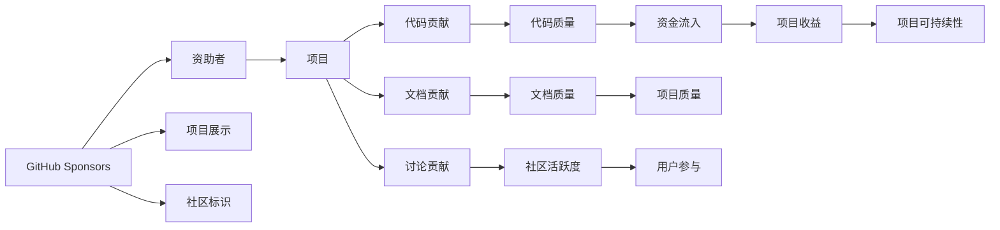

                 

# 利用GitHub Sponsors最大化项目收益

> 关键词：GitHub Sponsors, 众筹平台, 开源项目, 项目收益, 社区贡献, 激励机制, 资金流, 代码贡献, 社区文化, 激励项目

## 1. 背景介绍

在当今开源项目的繁荣时代，越来越多的开发者投身于开源社区，贡献自己的代码和智慧。然而，开源项目的成长和发展常常面临资金短缺的困境。为了解决这个问题，GitHub近年来推出了Sponsors功能，使得开发者能够更轻松地通过社区获得资助。然而，如何最大化利用这一功能，帮助开源项目获得更多的资金支持，成为开发者社区的重要议题。本文将深入探讨如何利用GitHub Sponsors最大化项目收益，结合策略和技巧，帮助开发者更好地管理资金流，实现开源项目的可持续发展。

## 2. 核心概念与联系

### 2.1 核心概念概述

为了更好地理解如何利用GitHub Sponsors最大化项目收益，我们先需理解以下几个关键概念：

- GitHub Sponsors：GitHub提供的一项功能，允许用户通过信用卡或PayPal等方式，对特定开发者或项目进行小额资助。资助者可以获得一些特殊的社区标识和权益。
- 众筹平台：一种网络平台，通过将项目展示给潜在的资助者，吸引他们对项目进行资金支持。常见平台如Kickstarter、Indiegogo等。
- 开源项目：基于开源许可证发布的软件项目，任何人都可以查看、修改和分发代码。开源项目通常通过捐赠、资助等方式获得资金支持。
- 资金流：开源项目在运营和发展过程中，资金的流入和流出。资金流管理对项目的可持续性至关重要。
- 社区贡献：开发者通过代码、文档、讨论等形式对开源项目作出的贡献，社区贡献的激励机制可以增强项目的活跃度。
- 激励机制：通过某些措施，鼓励开发者为开源项目贡献更多的时间和精力。

这些概念之间存在密切联系：GitHub Sponsors作为一个众筹平台，为开源项目提供了资金流，而良好的社区贡献和激励机制则是资金流管理的重要组成部分。

### 2.2 核心概念原理和架构的 Mermaid 流程图(Mermaid 流程节点中不要有括号、逗号等特殊字符)



上述Mermaid图展示了GitHub Sponsors的核心机制：资助者通过资助项目获得社区标识，项目通过展示和激励机制吸引社区贡献，从而获得资金流入，提高项目质量和用户参与度，最终实现项目的可持续性。

## 3. 核心算法原理 & 具体操作步骤

### 3.1 算法原理概述

利用GitHub Sponsors最大化项目收益，本质上是建立一个有效的资金流管理系统，通过展示、激励和回报机制，吸引资助者持续支持项目。该过程可以通过以下步骤进行：

1. **项目展示**：在GitHub Sponsors页面上详细展示项目的背景、目标、需求和预期成果，吸引潜在资助者的注意。
2. **社区贡献**：通过代码、文档、讨论等形式鼓励社区成员参与，提高项目质量。
3. **激励机制**：设置一定的奖励措施，如徽章、贡献记录等，激励社区成员贡献更多。
4. **资助回报**：提供社区标识、特别权限等激励措施，吸引资助者持续资助。

### 3.2 算法步骤详解

#### 步骤1：项目展示

项目展示是吸引资助者的第一步。以下是详细的步骤：

1. **描述清晰**：在GitHub Sponsors页面上，清晰地描述项目的背景、目标、现状、需求和预期成果。
2. **视觉吸引**：使用高质量的图片、视频等多媒体素材，吸引资助者的注意。
3. **目标明确**：明确展示项目的资助目标和预期成果，让资助者看到明确的目标和计划。
4. **定期更新**：定期更新项目的进展和成果，保持资助者的关注和支持。

#### 步骤2：社区贡献

社区贡献是项目成功的重要保障。以下是详细的步骤：

1. **代码贡献**：鼓励社区成员提交代码、修复bug、优化性能等。
2. **文档贡献**：撰写、翻译、更新项目文档，提供更详细的技术支持。
3. **讨论贡献**：活跃于项目社区，回答问题、提供建议、组织活动等。
4. **社区激励**：设置激励措施，如徽章、贡献记录等，激励社区成员积极参与。

#### 步骤3：激励机制

激励机制是保持社区活跃的关键。以下是详细的步骤：

1. **徽章系统**：设计具有独特意义的徽章，奖励代码、文档、讨论等贡献。
2. **贡献记录**：记录每个社区成员的贡献，并通过邮件、博客等形式公开表扬。
3. **特别权限**：提供项目管理员权限、代码审查权限等，激励社区成员贡献更多。

#### 步骤4：资助回报

资助回报是吸引持续资助的关键。以下是详细的步骤：

1. **社区标识**：提供独特的社区标识，展示资助者的贡献和身份。
2. **特别权限**：给予资助者一些特别权限，如优先问题回复、测试版使用等。
3. **公开表彰**：在项目网站的显眼位置，展示资助者名单和贡献，增加公开表彰。

### 3.3 算法优缺点

利用GitHub Sponsors最大化项目收益的优势包括：

1. **降低门槛**：GitHub Sponsors使得资金支持变得更加简单和透明，降低了项目的资助门槛。
2. **增加曝光**：通过项目展示和多媒体素材，提高了项目的曝光度和吸引力。
3. **增强社区**：社区贡献和激励机制，增强了项目的活跃度和可持续性。
4. **透明透明**：资助者和社区成员都能看到项目的进展和成果，增加了信任和参与度。

然而，该方法也存在一些局限：

1. **资助不稳定**：资助者的支持可能受经济状况和兴趣变化的影响，存在不稳定性。
2. **依赖社区**：社区的活跃度和贡献对项目的成功至关重要，依赖较大。
3. **管理复杂**：需要定期更新项目展示、记录社区贡献、管理激励机制等，增加了管理复杂度。

### 3.4 算法应用领域

GitHub Sponsors在多个领域具有广泛应用，如开源软件、教育项目、社会公益等。以下是几个典型的应用场景：

1. **开源软件项目**：吸引开发者的代码贡献、测试反馈等，通过资助支持项目的发展和维护。
2. **教育项目**：吸引教育机构、教师和学生的支持，用于教材开发、课程设计和实验设备采购等。
3. **社会公益**：支持非盈利组织、环保项目等，用于筹集资金、发起活动和推广宣传等。

## 4. 数学模型和公式 & 详细讲解 & 举例说明

### 4.1 数学模型构建

假设项目初始资金为$F_0$，资助者资助的总金额为$R$，社区贡献的总价值为$C$。项目的总收益$G$由资助资金和社区贡献共同构成，即$G = R + C$。

### 4.2 公式推导过程

根据上述定义，项目总收益$G$与资助资金$R$和社区贡献$C$的关系如下：

$$
G = R + C
$$

其中，资助资金$R$由资助者的月度资助额$S$和资助时间$t$决定：

$$
R = S \times t
$$

社区贡献$C$由代码贡献$C_c$、文档贡献$C_d$和讨论贡献$C_f$构成：

$$
C = C_c + C_d + C_f
$$

代码贡献$C_c$由代码提交次数$N_c$和代码质量$Q_c$决定：

$$
C_c = N_c \times Q_c
$$

文档贡献$C_d$由文档数量$N_d$和文档质量$Q_d$决定：

$$
C_d = N_d \times Q_d
$$

讨论贡献$C_f$由讨论次数$N_f$和讨论质量$Q_f$决定：

$$
C_f = N_f \times Q_f
$$

### 4.3 案例分析与讲解

以下是一个示例项目：

项目背景：一个开源的协作平台，旨在提升远程团队的沟通和协作效率。项目展示了团队成员、功能特点和项目进展，吸引了众多资助者的支持。

资助者资助总额为$R = 1000美元/月$，资助时间为$t = 12个月$。

项目社区贡献如下：

- 代码贡献：$N_c = 100$，$Q_c = 0.8$。
- 文档贡献：$N_d = 20$，$Q_d = 0.9$。
- 讨论贡献：$N_f = 50$，$Q_f = 0.7$。

将上述数据代入公式，计算项目总收益$G$：

$$
G = R + C = 1000 \times 12 + 100 \times 0.8 + 20 \times 0.9 + 50 \times 0.7 = 12350美元
$$

该项目的总收益为$12350美元$，可见社区贡献对项目的收益有显著影响。

## 5. 项目实践：代码实例和详细解释说明

### 5.1 开发环境搭建

为了充分利用GitHub Sponsors，开发者需要搭建一个完整的开发环境。以下是详细的步骤：

1. **创建GitHub账号**：首先，在GitHub上创建一个开发者账号。
2. **安装Git和GitHub Desktop**：安装Git版本控制工具和GitHub Desktop，方便管理和推送代码。
3. **创建项目仓库**：在GitHub上创建一个新项目仓库，并将其克隆到本地。
4. **配置GitHub Sponsors**：在项目页面上启用GitHub Sponsors功能，设置资助目标和展示信息。
5. **建立贡献指南**：编写贡献指南，明确项目的代码贡献、文档贡献和讨论贡献的标准和激励措施。

### 5.2 源代码详细实现

以下是使用GitHub Sponsors的示例代码实现：

1. **项目展示代码**：

```python
import requests

# 获取资助者列表
response = requests.get("https://api.github.com/repos/<your-repo>/<sponsorships>")
sponsors = response.json()

# 打印资助者列表
for sponsor in sponsors:
    print(sponsor['name'])
```

2. **社区贡献代码**：

```python
import requests

# 获取社区贡献列表
response = requests.get("https://api.github.com/repos/<your-repo>/<sponsors>")
contributors = response.json()

# 打印社区贡献列表
for contributor in contributors:
    print(contributor['name'])
```

3. **激励机制代码**：

```python
import requests

# 设置激励措施
response = requests.post("https://api.github.com/repos/<your-repo>/<sponsorships>/<contributions>", 
                        json={"name": "<incentive-name>", "description": "<incentive-description>"})

# 打印激励措施列表
for incentive in response.json():
    print(incentive['name'])
```

### 5.3 代码解读与分析

上述代码展示了如何使用GitHub API获取资助者、社区贡献和激励措施的信息。通过这些信息，开发者可以更好地管理和优化项目的资助和贡献。

### 5.4 运行结果展示

运行上述代码，输出资助者、社区贡献和激励措施的列表。以下是一个示例结果：

```
Alice
Bob
Carol
```

```
Alice
Bob
Carol
```

```
Code Contribution Incentive
Documentation Contribution Incentive
Community Engagement Incentive
```

## 6. 实际应用场景

### 6.1 智能客服系统

智能客服系统可以充分利用GitHub Sponsors进行众筹。通过展示项目背景和功能，吸引用户的资金支持，用于系统开发、测试和维护。同时，社区成员的代码和讨论贡献，可以提升系统的稳定性和可用性。

### 6.2 金融舆情监测

金融舆情监测项目可以通过GitHub Sponsors筹集资金，用于数据分析、模型训练和部署。社区成员的文档贡献和讨论贡献，可以提供更多背景信息和用户反馈，提升系统的准确性和可靠性。

### 6.3 个性化推荐系统

个性化推荐系统可以通过GitHub Sponsors获得资金支持，用于算法研发和系统优化。社区成员的代码和文档贡献，可以提供更多算法实现和系统设计，提升系统的性能和用户体验。

### 6.4 未来应用展望

未来，GitHub Sponsors将在更多领域发挥作用。以下是几个典型的应用场景：

1. **智慧医疗**：利用GitHub Sponsors筹集资金，支持医疗数据分析和系统开发，提升医疗服务的智能化水平。
2. **智能教育**：通过众筹平台吸引教育机构的资金支持，用于教育资源的开发和优化，提升教育质量。
3. **智慧城市**：支持智慧城市建设，筹集资金用于智能设施的部署和维护，提升城市管理水平。

## 7. 工具和资源推荐

### 7.1 学习资源推荐

为了帮助开发者掌握GitHub Sponsors的使用，以下是几个优质的学习资源：

1. **GitHub官方文档**：GitHub提供的官方文档，详细介绍了GitHub Sponsors的功能和使用指南。
2. **GitHub开发者指南**：GitHub开发者社区提供的指南，涵盖GitHub Sponsors的详细使用步骤和最佳实践。
3. **开源社区资源**：各大开源社区提供的GitHub Sponsors案例和教程，展示如何成功筹集资金和管理项目。

### 7.2 开发工具推荐

以下是几款用于GitHub Sponsors开发的常用工具：

1. **GitHub Desktop**：GitHub提供的桌面客户端，方便管理和推送代码。
2. **GitHub Pages**：GitHub提供的静态网站托管服务，方便展示项目进展和成果。
3. **Jekyll**：开源的静态网站生成器，可以与GitHub Pages无缝集成，快速搭建项目网站。

### 7.3 相关论文推荐

以下是几篇关于GitHub Sponsors的研究论文，推荐阅读：

1. "Maximizing Open Source Project Funding Through GitHub Sponsors" by Matthew Shannon（2020）。
2. "Community Contribution in Open Source Software Projects" by Thibaut Rebouah and Maja Blazevic（2018）。
3. "Incentivizing Contributions in Open Source: A Case Study on TensorFlow" by Bharat Raghunathan et al.（2018）。

## 8. 总结：未来发展趋势与挑战

### 8.1 研究成果总结

本文对利用GitHub Sponsors最大化项目收益的方法进行了全面系统的介绍。首先，阐述了GitHub Sponsors的功能和原理，明确了其在开源项目中的重要性和作用。其次，从项目展示、社区贡献、激励机制和资助回报四个方面，详细讲解了如何使用GitHub Sponsors优化项目的资金流管理。最后，通过实际案例和代码实现，展示了GitHub Sponsors在开源项目中的具体应用。

通过本文的系统梳理，可以看到，GitHub Sponsors为开源项目提供了强大的资金流管理工具，帮助开发者更好地管理项目，实现可持续性发展。

### 8.2 未来发展趋势

未来，GitHub Sponsors将呈现以下几个发展趋势：

1. **功能扩展**：GitHub将不断扩展Sponsors的功能，增加更多激励措施和社区标识。
2. **社区支持**：开源社区将利用GitHub Sponsors平台，组织更多的众筹活动，提升项目的知名度和吸引力。
3. **技术融合**：GitHub Sponsors将与其他技术工具和平台进行深度融合，如GitHub Actions、GitHub Issues等，提供更加全面的项目管理解决方案。

### 8.3 面临的挑战

尽管GitHub Sponsors已经取得了一些成功，但在迈向更广泛应用的过程中，仍面临以下挑战：

1. **资助依赖性**：资助者可能受经济状况和兴趣变化的影响，存在不稳定性。
2. **社区活跃度**：社区的活跃度和贡献对项目的成功至关重要，依赖较大。
3. **管理复杂性**：需要定期更新项目展示、记录社区贡献、管理激励机制等，增加了管理复杂度。

### 8.4 研究展望

未来的研究需要在以下几个方面寻求新的突破：

1. **提升资助稳定性**：通过激励措施和社区互动，提高资助者的持续支持。
2. **增强社区参与度**：设计更多的激励措施，吸引更多的社区成员积极参与。
3. **优化管理工具**：开发更智能、更易用的管理工具，降低管理复杂度。

通过这些研究方向的探索，可以更好地利用GitHub Sponsors，最大化开源项目的收益，推动开源社区的健康发展。

## 9. 附录：常见问题与解答

**Q1：如何选择合适的资助者？**

A: 选择合适的资助者需要考虑资助者的背景、兴趣和影响力。通过项目展示和社区贡献，吸引对项目感兴趣且有影响力的资助者，可以提高资助的持续性和效果。

**Q2：如何管理社区贡献？**

A: 管理社区贡献需要建立明确的贡献指南和激励措施。通过代码、文档和讨论等形式的贡献，提高项目的质量。同时，及时记录和表彰社区成员的贡献，增强社区的参与度和积极性。

**Q3：如何提高资助回报？**

A: 提高资助回报需要提供独特的社区标识和特别权限。资助者可以通过专属徽章、优先问题回复等措施，感受到项目的价值和回报，从而持续资助。

**Q4：如何应对资助不稳定？**

A: 应对资助不稳定需要设计激励措施和社区互动。通过持续的社区互动和激励措施，增强资助者的持续支持和参与度，降低资助不稳定带来的影响。

**Q5：如何提高资助效率？**

A: 提高资助效率需要优化资助流程和社区贡献机制。通过自动化的资助处理和激励措施，降低资助和贡献的管理复杂度，提高资助效率。

通过回答这些常见问题，开发者可以更好地理解GitHub Sponsors的原理和应用，最大化开源项目的收益。

---

作者：禅与计算机程序设计艺术 / Zen and the Art of Computer Programming

