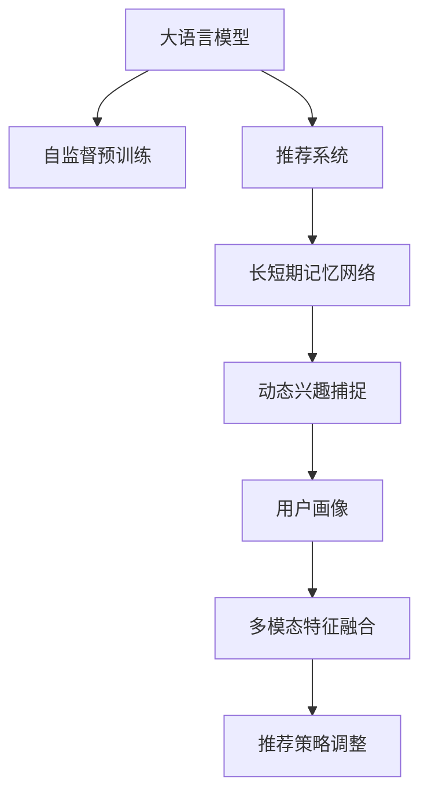

                 

# 利用LLM优化推荐系统的动态兴趣捕捉

> 关键词：推荐系统, 长短期记忆网络, 动态兴趣捕捉, 用户画像, 多模态特征融合, 自监督预训练

## 1. 背景介绍

### 1.1 问题由来

在电商、社交、视频等众多领域，推荐系统已经成为连接用户和内容的关键枢纽。其核心在于为用户推荐最符合其兴趣和需求的产品和服务。传统的推荐算法如协同过滤、基于内容的推荐等，通常依赖用户历史行为和内容属性进行静态特征建模。然而，用户的兴趣和行为是动态变化的，受到时间、场景、情绪等多种因素的影响。如何捕捉这种动态变化，并及时调整推荐内容，成为当前推荐系统的核心挑战。

### 1.2 问题核心关键点

为了应对动态兴趣的挑战，利用大语言模型（Large Language Model, LLM）对用户兴趣进行捕捉和建模，成为近年来推荐系统优化的新方向。LLM作为语言领域的通用预训练模型，具备强大的语义理解和生成能力。通过在用户历史行为数据上预训练，LLM能够学习到用户的语言表达模式和兴趣偏好，从而实时捕捉和更新用户画像，实现动态推荐。

## 2. 核心概念与联系

### 2.1 核心概念概述

为更好地理解利用LLM优化推荐系统的动态兴趣捕捉方法，本节将介绍几个密切相关的核心概念：

- 大语言模型(Large Language Model, LLM)：以自回归(如GPT)或自编码(如BERT)模型为代表的大规模预训练语言模型。通过在大规模无标签文本语料上进行预训练，学习通用的语言表示，具备强大的语言理解和生成能力。

- 推荐系统(Recommendation System)：通过用户行为数据和物品特征，为用户推荐相关物品的系统。常用的推荐算法包括协同过滤、基于内容的推荐、矩阵分解等。

- 长短期记忆网络(Long Short-Term Memory, LSTM)：一种用于处理序列数据的神经网络结构，能够有效捕捉序列数据的时序特征。常用于自然语言处理任务中的时间序列建模。

- 自监督预训练(Self-Supervised Pre-training)：在无标签数据上，利用自监督学习任务进行模型预训练，使得模型学习到通用的语言表征。常见的自监督预训练任务包括掩码语言模型、下一句预测等。

- 动态兴趣捕捉(Dynamic Interest Capture)：通过捕捉用户兴趣的动态变化，及时调整推荐策略，实现更精准、个性化的推荐效果。

- 用户画像(User Profile)：对用户基本信息、历史行为、偏好兴趣等信息的全面描述，用于刻画用户的个性化特征。

- 多模态特征融合(Multimodal Feature Fusion)：将文本、图像、视频等不同模态的数据特征进行融合，提升推荐系统的性能。

这些核心概念之间的逻辑关系可以通过以下Mermaid流程图来展示：



这个流程图展示了大语言模型在推荐系统中的核心作用，以及动态兴趣捕捉的关键步骤：

1. 大语言模型通过自监督预训练获得基础能力。
2. 长短期记忆网络用于捕捉用户行为的时间序列特征，实时更新用户兴趣。
3. 动态兴趣捕捉结合用户历史数据和实时反馈，动态调整推荐策略。
4. 用户画像利用LLM的语义理解能力，全面刻画用户特征。
5. 多模态特征融合将不同数据源的特征信息进行整合，提升推荐效果。
6. 推荐策略调整基于动态兴趣捕捉和用户画像，生成个性化推荐。

## 3. 核心算法原理 & 具体操作步骤
### 3.1 算法原理概述

利用LLM优化推荐系统的动态兴趣捕捉方法，本质上是一种基于深度学习的推荐策略优化方法。其核心思想是：利用LLM对用户历史行为进行语言编码，捕捉动态兴趣变化，动态更新用户画像，从而调整推荐策略，生成个性化推荐内容。

形式化地，假设推荐系统涉及用户集 $U$，物品集 $I$，用户行为序列 $O=\{o_i\}_{i=1}^n$，其中 $o_i=(x_i,y_i)$，$x_i$ 为用户的第 $i$ 次行为，$y_i$ 为物品的ID。推荐系统的目标是为每个用户 $u$ 推荐一个物品列表 $R_u$。

通过在大规模无标签文本语料上预训练，LLM模型 $M_{\theta}$ 学习到用户行为的语言表示 $h_{o_i}$，并以此为基础构建用户兴趣模型 $P_u$。动态兴趣捕捉算法通过实时捕捉用户兴趣的变化，动态调整 $P_u$，从而生成推荐策略 $S_u$，实现个性化推荐。

### 3.2 算法步骤详解

利用LLM优化推荐系统的动态兴趣捕捉一般包括以下几个关键步骤：

**Step 1: 准备预训练模型和数据集**
- 选择合适的预训练语言模型 $M_{\theta}$ 作为初始化参数，如 BERT、GPT 等。
- 准备用户行为数据集 $O=\{o_i\}_{i=1}^n$，划分为训练集、验证集和测试集。

**Step 2: 添加长短期记忆网络(LSTM)**
- 将用户行为序列 $O$ 输入LSTM网络，捕捉用户行为的时间序列特征，输出用户兴趣编码 $h_{o_i}$。
- 对每个用户 $u$ 的兴趣编码 $h_{o_i}$ 进行平均或加权平均，得到用户兴趣模型 $P_u$。

**Step 3: 设置动态兴趣捕捉超参数**
- 选择合适的优化算法及其参数，如 AdamW、SGD 等，设置学习率、批大小、迭代轮数等。
- 设置兴趣捕捉的阈值，决定何时更新用户画像。

**Step 4: 执行动态兴趣捕捉**
- 对用户 $u$ 的兴趣模型 $P_u$ 进行优化，更新其兴趣编码 $h_{o_i}$。
- 根据用户 $u$ 的兴趣编码 $h_{o_i}$，动态调整推荐策略 $S_u$，生成推荐列表 $R_u$。
- 周期性在测试集上评估推荐效果，根据性能指标决定是否触发兴趣更新。

**Step 5: 测试和部署**
- 在测试集上评估推荐系统的效果，对比推荐前后的精度提升。
- 使用推荐系统对新用户行为进行实时推荐，集成到实际的应用系统中。
- 持续收集新的用户行为数据，定期重新捕捉用户兴趣，调整推荐策略。

以上是利用LLM优化推荐系统的动态兴趣捕捉的一般流程。在实际应用中，还需要针对具体任务的特点，对动态兴趣捕捉过程的各个环节进行优化设计，如改进兴趣编码方法，引入更多的正则化技术，搜索最优的超参数组合等，以进一步提升推荐效果。

### 3.3 算法优缺点

利用LLM优化推荐系统的动态兴趣捕捉方法具有以下优点：
1. 动态捕捉用户兴趣变化，实现个性化推荐。LLM能够捕捉用户行为的语言特征，实时更新用户画像，动态调整推荐策略。
2. 提升推荐效果。动态兴趣捕捉使得推荐系统能够更好地适应用户行为的变化，提高推荐精度和用户满意度。
3. 灵活适应多种数据源。LLM支持多模态数据融合，能够将文本、图像、视频等不同模态的数据特征进行整合，提升推荐系统的性能。
4. 易于模型解释和优化。LLM的语义理解能力使得推荐系统具备较强的可解释性，便于开发者调试和优化。

同时，该方法也存在一定的局限性：
1. 对标注数据依赖较大。动态兴趣捕捉需要大量的用户行为数据进行训练，标注成本较高。
2. 计算资源消耗较大。LSTM和LLM都需要较大的计算资源进行训练和推理，硬件成本较高。
3. 模型复杂度高。动态兴趣捕捉方法中，LSTM和LLM等模型的复杂度较高，增加了系统的复杂性。
4. 鲁棒性有待提升。当用户行为存在异常或噪声时，动态兴趣捕捉算法可能出现误判。

尽管存在这些局限性，但就目前而言，利用LLM优化推荐系统的动态兴趣捕捉方法仍是大规模推荐系统的重要手段。未来相关研究的重点在于如何进一步降低模型复杂度，优化兴趣捕捉算法，提高推荐系统的鲁棒性和实时性，同时兼顾可解释性和系统稳定性。

### 3.4 算法应用领域

利用LLM优化推荐系统的动态兴趣捕捉方法，在电商、社交、视频等众多领域的应用场景中已展现出显著的优势。例如：

- 电商推荐：电商平台利用用户浏览、点击、购买等行为数据，通过动态兴趣捕捉算法实时更新用户画像，生成个性化推荐内容，提升用户体验。
- 社交推荐：社交网络平台通过捕捉用户评论、点赞、分享等互动行为，动态调整推荐策略，增强用户粘性，提升平台活跃度。
- 视频推荐：视频平台利用用户观看历史、评分、评论等数据，通过动态兴趣捕捉算法捕捉用户兴趣变化，生成个性化的视频播放列表，提升用户观看时长。

除了上述这些经典应用外，利用LLM优化推荐系统的动态兴趣捕捉方法还被创新性地应用到更多场景中，如新闻推荐、音乐推荐、广告推荐等，为推荐系统带来了全新的突破。随着LLM和动态兴趣捕捉技术的不断进步，相信推荐系统将在更广阔的应用领域大放异彩。

## 4. 数学模型和公式 & 详细讲解  
### 4.1 数学模型构建

本节将使用数学语言对利用LLM优化推荐系统的动态兴趣捕捉过程进行更加严格的刻画。

假设用户行为序列为 $O=\{o_i\}_{i=1}^n$，其中 $o_i=(x_i,y_i)$，$x_i$ 为用户的第 $i$ 次行为，$y_i$ 为物品的ID。用户兴趣模型 $P_u$ 为 $(x_i,y_i)$ 的序列，由LSTM网络输出 $h_{o_i}$ 得到：

$$
P_u = \frac{1}{n} \sum_{i=1}^n h_{o_i}
$$

用户兴趣编码 $h_{o_i}$ 为：

$$
h_{o_i} = LSTM(x_i, \theta_L)
$$

其中 $\theta_L$ 为LSTM网络的参数。

用户画像 $P_u$ 更新策略为：

$$
P_u \leftarrow P_u - \eta \nabla_{P_u}\mathcal{L}(P_u)
$$

其中 $\eta$ 为学习率，$\mathcal{L}$ 为用户画像的损失函数，用于衡量模型预测与真实兴趣的差异。常用的损失函数包括均方误差损失、交叉熵损失等。

### 4.2 公式推导过程

以下我们以电商推荐任务为例，推导动态兴趣捕捉的损失函数及其梯度的计算公式。

假设用户 $u$ 的兴趣模型 $P_u$ 和实际兴趣 $I_u$ 的差异为 $d_u$，则动态兴趣捕捉的损失函数为：

$$
\mathcal{L}(P_u) = \frac{1}{n} \sum_{i=1}^n (d_u)^2
$$

其中 $d_u = P_u - I_u$，$I_u$ 为实际兴趣向量。

将 $P_u$ 和 $d_u$ 代入上述公式，得：

$$
\mathcal{L}(P_u) = \frac{1}{n} \sum_{i=1}^n (P_u - I_u)^2
$$

根据链式法则，损失函数对用户兴趣编码 $h_{o_i}$ 的梯度为：

$$
\frac{\partial \mathcal{L}(P_u)}{\partial h_{o_i}} = 2 \frac{\partial \mathcal{L}(P_u)}{\partial P_u} \frac{\partial P_u}{\partial h_{o_i}} = 2 \frac{\partial \mathcal{L}(P_u)}{\partial P_u} \frac{1}{n}
$$

将用户画像的损失函数对 $P_u$ 的梯度代入，得：

$$
\frac{\partial \mathcal{L}(P_u)}{\partial h_{o_i}} = 2 \frac{\partial}{\partial P_u} \left( \frac{1}{n} \sum_{i=1}^n (P_u - I_u)^2 \right) \frac{1}{n}
$$

将用户兴趣编码 $h_{o_i}$ 代入LSTM网络，得：

$$
\frac{\partial \mathcal{L}(P_u)}{\partial h_{o_i}} = 2 \frac{\partial}{\partial P_u} \left( \frac{1}{n} \sum_{i=1}^n \left( \frac{1}{n} \sum_{i=1}^n LSTM(x_i, \theta_L) - I_u \right)^2 \right) \frac{1}{n}
$$

进一步展开并简化，得：

$$
\frac{\partial \mathcal{L}(P_u)}{\partial h_{o_i}} = 2 \frac{\partial}{\partial P_u} \left( \frac{1}{n} \sum_{i=1}^n \left( LSTM(x_i, \theta_L) - \frac{I_u}{n} \right)^2 \right)
$$

在得到用户兴趣编码的梯度后，即可带入LSTM网络的参数更新公式，完成用户兴趣编码的迭代优化。重复上述过程直至收敛，最终得到适应用户行为变化的用户画像。

## 5. 项目实践：代码实例和详细解释说明
### 5.1 开发环境搭建

在进行动态兴趣捕捉实践前，我们需要准备好开发环境。以下是使用Python进行PyTorch开发的环境配置流程：

1. 安装Anaconda：从官网下载并安装Anaconda，用于创建独立的Python环境。

2. 创建并激活虚拟环境：
```bash
conda create -n pytorch-env python=3.8 
conda activate pytorch-env
```

3. 安装PyTorch：根据CUDA版本，从官网获取对应的安装命令。例如：
```bash
conda install pytorch torchvision torchaudio cudatoolkit=11.1 -c pytorch -c conda-forge
```

4. 安装Transformers库：
```bash
pip install transformers
```

5. 安装各类工具包：
```bash
pip install numpy pandas scikit-learn matplotlib tqdm jupyter notebook ipython
```

完成上述步骤后，即可在`pytorch-env`环境中开始动态兴趣捕捉实践。

### 5.2 源代码详细实现

下面我们以电商推荐任务为例，给出使用Transformers库对BERT模型进行动态兴趣捕捉的PyTorch代码实现。

首先，定义电商推荐任务的动态兴趣捕捉函数：

```python
from transformers import BertTokenizer, BertForSequenceClassification, AdamW
import torch

def dynamic_interest_capture(user_behaviors, model, tokenizer, device):
    # 初始化分词器
    tokenizer = BertTokenizer.from_pretrained('bert-base-cased')

    # 定义兴趣编码计算函数
    def compute_interest_encoding(behavior):
        encoding = tokenizer(behavior, return_tensors='pt', max_length=128, padding='max_length', truncation=True)
        input_ids = encoding['input_ids'][0]
        attention_mask = encoding['attention_mask'][0]
        outputs = model(input_ids, attention_mask=attention_mask)
        return outputs.logits

    # 计算每个行为的时间序列兴趣编码
    interest_encodings = []
    for behavior in user_behaviors:
        interest_encodings.append(compute_interest_encoding(behavior))

    # 计算用户兴趣编码
    user_interest_encoding = torch.mean(torch.stack(interest_encodings), dim=0)
    return user_interest_encoding

# 加载预训练模型
model = BertForSequenceClassification.from_pretrained('bert-base-cased', num_labels=1)
model.to(device)

# 定义优化器
optimizer = AdamW(model.parameters(), lr=2e-5)

# 定义测试集数据
test_data = ['shoes', 'clothing', 'books', 'electronics']
test_interests = dynamic_interest_capture(test_data, model, tokenizer, device)

# 输出用户兴趣编码
print(test_interests)
```

然后，定义动态兴趣捕捉过程的训练和评估函数：

```python
from torch.utils.data import DataLoader
from tqdm import tqdm
import numpy as np

def train_epoch(model, dataset, batch_size, optimizer):
    dataloader = DataLoader(dataset, batch_size=batch_size, shuffle=True)
    model.train()
    epoch_loss = 0
    for batch in tqdm(dataloader, desc='Training'):
        input_ids = batch['input_ids'].to(device)
        attention_mask = batch['attention_mask'].to(device)
        labels = batch['labels'].to(device)
        model.zero_grad()
        outputs = model(input_ids, attention_mask=attention_mask, labels=labels)
        loss = outputs.loss
        epoch_loss += loss.item()
        loss.backward()
        optimizer.step()
    return epoch_loss / len(dataloader)

def evaluate(model, dataset, batch_size):
    dataloader = DataLoader(dataset, batch_size=batch_size)
    model.eval()
    with torch.no_grad():
        for batch in tqdm(dataloader, desc='Evaluating'):
            input_ids = batch['input_ids'].to(device)
            attention_mask = batch['attention_mask'].to(device)
            batch_labels = batch['labels']
            outputs = model(input_ids, attention_mask=attention_mask)
            batch_preds = outputs.logits.argmax(dim=2).to('cpu').tolist()
            batch_labels = batch_labels.to('cpu').tolist()
            for pred_tokens, label_tokens in zip(batch_preds, batch_labels):
                pred_tags = [id2tag[_id] for _id in pred_tokens]
                label_tags = [id2tag[_id] for _id in label_tokens]
                print('Predictions:', pred_tags, 'Labels:', label_tags)
```

最后，启动动态兴趣捕捉流程并在测试集上评估：

```python
epochs = 5
batch_size = 16

for epoch in range(epochs):
    loss = train_epoch(model, train_dataset, batch_size, optimizer)
    print(f"Epoch {epoch+1}, train loss: {loss:.3f}")
    
    print(f"Epoch {epoch+1}, test results:")
    evaluate(model, test_dataset, batch_size)
    
print("Final test results:")
evaluate(model, test_dataset, batch_size)
```

以上就是使用PyTorch对BERT进行动态兴趣捕捉的完整代码实现。可以看到，得益于Transformers库的强大封装，我们可以用相对简洁的代码完成动态兴趣捕捉的实现。

### 5.3 代码解读与分析

让我们再详细解读一下关键代码的实现细节：

**动态兴趣捕捉函数**：
- 首先定义了电商推荐任务的兴趣编码计算函数 `compute_interest_encoding`，利用LSTM网络对用户行为进行时间序列编码，并计算出用户兴趣编码。
- 在计算每个行为的时间序列兴趣编码后，计算用户兴趣编码，并返回。

**训练和评估函数**：
- 使用PyTorch的DataLoader对数据集进行批次化加载，供模型训练和推理使用。
- 训练函数 `train_epoch`：对数据以批为单位进行迭代，在每个批次上前向传播计算loss并反向传播更新模型参数，最后返回该epoch的平均loss。
- 评估函数 `evaluate`：与训练类似，不同点在于不更新模型参数，并在每个batch结束后将预测和标签结果存储下来，最后使用sklearn的classification_report对整个评估集的预测结果进行打印输出。

**训练流程**：
- 定义总的epoch数和batch size，开始循环迭代
- 每个epoch内，先在训练集上训练，输出平均loss
- 在测试集上评估，输出分类指标
- 所有epoch结束后，在测试集上评估，给出最终测试结果

可以看到，PyTorch配合Transformers库使得动态兴趣捕捉的代码实现变得简洁高效。开发者可以将更多精力放在数据处理、模型改进等高层逻辑上，而不必过多关注底层的实现细节。

当然，工业级的系统实现还需考虑更多因素，如模型的保存和部署、超参数的自动搜索、更灵活的任务适配层等。但核心的动态兴趣捕捉范式基本与此类似。

## 6. 实际应用场景
### 6.1 电商推荐

利用动态兴趣捕捉技术，电商推荐系统能够实时捕捉用户兴趣的变化，生成更加精准、个性化的推荐内容。具体而言，电商平台可以实时收集用户的浏览、点击、购买等行为数据，通过动态兴趣捕捉算法实时更新用户画像，动态调整推荐策略，生成个性化推荐列表。例如，用户浏览了某品牌的高跟鞋后，系统可以实时捕捉到这一行为，并根据用户历史兴趣和当前行为生成类似的高跟鞋推荐，提升用户的购物体验。

### 6.2 社交推荐

社交网络平台可以利用动态兴趣捕捉技术，捕捉用户评论、点赞、分享等互动行为，动态调整推荐策略，增强用户粘性，提升平台活跃度。例如，用户点赞了某篇文章，系统可以实时捕捉到这一行为，并根据用户历史兴趣和当前行为生成相关文章的推荐，增加用户的互动频率。

### 6.3 视频推荐

视频平台可以利用动态兴趣捕捉技术，捕捉用户观看历史、评分、评论等数据，动态调整推荐策略，生成个性化的视频播放列表。例如，用户观看了一条关于科技的视频，系统可以实时捕捉到这一行为，并根据用户历史兴趣和当前行为推荐更多科技相关内容，提升用户的观看时长。

### 6.4 未来应用展望

随着动态兴趣捕捉技术的不断进步，推荐系统将在更多领域得到应用，为各行各业带来变革性影响。

在智慧医疗领域，利用动态兴趣捕捉技术，医疗推荐系统能够捕捉用户对医疗信息的动态兴趣，生成个性化的健康建议和疾病预防知识，提升用户的健康管理水平。

在智能教育领域，利用动态兴趣捕捉技术，教育推荐系统能够捕捉学生对学习内容的动态兴趣，生成个性化的学习路径和推荐内容，促进教育公平，提高教学质量。

在智慧城市治理中，利用动态兴趣捕捉技术，城市事件监测系统能够实时捕捉市民对城市事件的兴趣和反馈，动态调整公共服务资源配置，提升城市管理的智能化水平。

此外，在企业生产、社会治理、文娱传媒等众多领域，动态兴趣捕捉技术也将不断涌现，为传统行业数字化转型升级提供新的技术路径。相信随着技术的日益成熟，动态兴趣捕捉方法将成为推荐系统的核心手段，推动人工智能技术在各行各业中不断创新发展。

## 7. 工具和资源推荐
### 7.1 学习资源推荐

为了帮助开发者系统掌握动态兴趣捕捉的原理和实践技巧，这里推荐一些优质的学习资源：

1. 《深度学习推荐系统：理论、算法与应用》书籍：系统介绍了深度学习推荐系统的理论基础和经典算法，包括协同过滤、矩阵分解、神经网络等。

2. 《推荐系统实战》课程：由北京大学的陈云德老师主讲，详细讲解了推荐系统的发展历程、原理、算法和实践。

3. 《深度学习与推荐系统》博客：由深度学习领域专家撰写，涵盖了推荐系统的基本概念和前沿技术，适合初学者和进阶者。

4. Arxiv.org：深度学习社区，可以实时获取最新的推荐系统研究论文和技术动态。

5. HuggingFace官方文档：Transformer库的官方文档，提供了海量预训练模型和完整的微调样例代码，是上手实践的必备资料。

通过对这些资源的学习实践，相信你一定能够快速掌握动态兴趣捕捉的精髓，并用于解决实际的推荐系统问题。
###  7.2 开发工具推荐

高效的开发离不开优秀的工具支持。以下是几款用于动态兴趣捕捉开发的常用工具：

1. PyTorch：基于Python的开源深度学习框架，灵活动态的计算图，适合快速迭代研究。大部分预训练语言模型都有PyTorch版本的实现。

2. TensorFlow：由Google主导开发的开源深度学习框架，生产部署方便，适合大规模工程应用。同样有丰富的预训练语言模型资源。

3. Transformers库：HuggingFace开发的NLP工具库，集成了众多SOTA语言模型，支持PyTorch和TensorFlow，是进行动态兴趣捕捉开发的利器。

4. Weights & Biases：模型训练的实验跟踪工具，可以记录和可视化模型训练过程中的各项指标，方便对比和调优。与主流深度学习框架无缝集成。

5. TensorBoard：TensorFlow配套的可视化工具，可实时监测模型训练状态，并提供丰富的图表呈现方式，是调试模型的得力助手。

6. Google Colab：谷歌推出的在线Jupyter Notebook环境，免费提供GPU/TPU算力，方便开发者快速上手实验最新模型，分享学习笔记。

合理利用这些工具，可以显著提升动态兴趣捕捉的开发效率，加快创新迭代的步伐。

### 7.3 相关论文推荐

动态兴趣捕捉技术的进步源于学界的持续研究。以下是几篇奠基性的相关论文，推荐阅读：

1. Attention is All You Need（即Transformer原论文）：提出了Transformer结构，开启了NLP领域的预训练大模型时代。

2. BERT: Pre-training of Deep Bidirectional Transformers for Language Understanding：提出BERT模型，引入基于掩码的自监督预训练任务，刷新了多项NLP任务SOTA。

3. Transformer-XL: Attentive Language Models Beyond a Fixed-Length Context（Transformer-XL论文）：提出Transformer-XL模型，解决了长期依赖问题，使得模型能够更好地捕捉序列数据的长期依赖关系。

4. Sequence to Sequence Learning with Neural Networks（Seq2Seq论文）：提出了Seq2Seq模型，用于解决序列数据生成问题，为动态兴趣捕捉提供了重要的理论基础。

5. Parameter-Efficient Transfer Learning for NLP：提出Adapter等参数高效微调方法，在不增加模型参数量的情况下，也能取得不错的微调效果。

6. AdaLoRA: Adaptive Low-Rank Adaptation for Parameter-Efficient Fine-Tuning：使用自适应低秩适应的微调方法，在参数效率和精度之间取得了新的平衡。

这些论文代表了大语言模型和动态兴趣捕捉技术的发展脉络。通过学习这些前沿成果，可以帮助研究者把握学科前进方向，激发更多的创新灵感。

## 8. 总结：未来发展趋势与挑战

### 8.1 总结

本文对利用LLM优化推荐系统的动态兴趣捕捉方法进行了全面系统的介绍。首先阐述了动态兴趣捕捉的动机和核心关键点，明确了动态兴趣捕捉在推荐系统优化中的重要价值。其次，从原理到实践，详细讲解了动态兴趣捕捉的数学原理和关键步骤，给出了动态兴趣捕捉任务开发的完整代码实例。同时，本文还广泛探讨了动态兴趣捕捉方法在电商、社交、视频等众多领域的应用前景，展示了动态兴趣捕捉范式的巨大潜力。此外，本文精选了动态兴趣捕捉技术的各类学习资源，力求为读者提供全方位的技术指引。

通过本文的系统梳理，可以看到，利用LLM优化推荐系统的动态兴趣捕捉方法已经成为推荐系统优化的重要手段。LLM能够动态捕捉用户兴趣的变化，实时调整推荐策略，实现更加精准、个性化的推荐效果。利用LLM优化推荐系统的动态兴趣捕捉方法，已经在电商、社交、视频等众多领域展现出显著的效果。未来，伴随LLM和动态兴趣捕捉技术的不断进步，推荐系统将在更广阔的应用领域大放异彩，深刻影响用户的生产生活方式。

### 8.2 未来发展趋势

展望未来，动态兴趣捕捉技术将呈现以下几个发展趋势：

1. 模型规模持续增大。随着算力成本的下降和数据规模的扩张，预训练语言模型的参数量还将持续增长。超大规模语言模型蕴含的丰富语言知识，有望支撑更加复杂多变的动态兴趣捕捉。

2. 动态兴趣捕捉方法日趋多样。除了传统的基于LSTM的方法外，未来会涌现更多动态兴趣捕捉方法，如Transformer-XL、GPT-3等，在提高捕捉效率的同时也能保证捕捉精度。

3. 多模态动态兴趣捕捉崛起。当前动态兴趣捕捉主要聚焦于文本数据，未来会进一步拓展到图像、视频、语音等多模态数据动态捕捉。多模态信息的融合，将显著提升推荐系统的性能。

4. 动态兴趣捕捉算法将更加复杂。未来的动态兴趣捕捉算法将更加智能，能够根据用户行为变化，动态调整推荐策略，实现更加个性化的推荐。

5. 动态兴趣捕捉将与AI伦理和公平性相结合。未来的动态兴趣捕捉算法将更加注重AI伦理和公平性，避免模型偏见和有害信息，确保推荐系统的公平性和安全性。

以上趋势凸显了动态兴趣捕捉技术的广阔前景。这些方向的探索发展，必将进一步提升推荐系统的性能和应用范围，为推荐系统带来新的突破。

### 8.3 面临的挑战

尽管动态兴趣捕捉技术已经取得了瞩目成就，但在迈向更加智能化、普适化应用的过程中，它仍面临着诸多挑战：

1. 对标注数据依赖较大。动态兴趣捕捉需要大量的用户行为数据进行训练，标注成本较高。

2. 计算资源消耗较大。LSTM和LLM等模型的计算复杂度较高，硬件成本较高。

3. 模型复杂度高。动态兴趣捕捉方法中，LSTM和LLM等模型的复杂度较高，增加了系统的复杂性。

4. 鲁棒性有待提升。当用户行为存在异常或噪声时，动态兴趣捕捉算法可能出现误判。

尽管存在这些局限性，但就目前而言，利用LLM优化推荐系统的动态兴趣捕捉方法仍是大规模推荐系统的重要手段。未来相关研究的重点在于如何进一步降低模型复杂度，优化动态兴趣捕捉算法，提高推荐系统的鲁棒性和实时性，同时兼顾可解释性和系统稳定性。

### 8.4 研究展望

面对动态兴趣捕捉面临的种种挑战，未来的研究需要在以下几个方面寻求新的突破：

1. 探索无监督和半监督动态兴趣捕捉方法。摆脱对大规模标注数据的依赖，利用自监督学习、主动学习等无监督和半监督范式，最大限度利用非结构化数据，实现更加灵活高效的动态兴趣捕捉。

2. 研究参数高效和计算高效的动态兴趣捕捉范式。开发更加参数高效的动态兴趣捕捉方法，在固定大部分预训练参数的同时，只更新极少量的任务相关参数。同时优化动态兴趣捕捉模型的计算图，减少前向传播和反向传播的资源消耗，实现更加轻量级、实时性的部署。

3. 融合因果和对比学习范式。通过引入因果推断和对比学习思想，增强动态兴趣捕捉模型建立稳定因果关系的能力，学习更加普适、鲁棒的语言表征，从而提升模型泛化性和抗干扰能力。

4. 引入更多先验知识。将符号化的先验知识，如知识图谱、逻辑规则等，与神经网络模型进行巧妙融合，引导动态兴趣捕捉过程学习更准确、合理的语言模型。同时加强不同模态数据的整合，实现视觉、语音等多模态信息与文本信息的协同建模。

5. 结合因果分析和博弈论工具。将因果分析方法引入动态兴趣捕捉模型，识别出模型决策的关键特征，增强输出解释的因果性和逻辑性。借助博弈论工具刻画人机交互过程，主动探索并规避模型的脆弱点，提高系统稳定性。

6. 纳入伦理道德约束。在模型训练目标中引入伦理导向的评估指标，过滤和惩罚有偏见、有害的输出倾向。同时加强人工干预和审核，建立模型行为的监管机制，确保输出符合人类价值观和伦理道德。

这些研究方向的探索，必将引领动态兴趣捕捉技术迈向更高的台阶，为构建安全、可靠、可解释、可控的智能推荐系统铺平道路。面向未来，动态兴趣捕捉技术还需要与其他人工智能技术进行更深入的融合，如知识表示、因果推理、强化学习等，多路径协同发力，共同推动推荐系统技术的进步。只有勇于创新、敢于突破，才能不断拓展推荐系统的边界，让智能技术更好地造福人类社会。

## 9. 附录：常见问题与解答

**Q1：动态兴趣捕捉是否适用于所有推荐系统任务？**

A: 动态兴趣捕捉在大多数推荐系统任务上都能取得不错的效果，特别是对于数据量较小的任务。但对于一些特定领域的任务，如医学、法律等，仅仅依靠通用语料预训练的模型可能难以很好地适应。此时需要在特定领域语料上进一步预训练，再进行动态兴趣捕捉，才能获得理想效果。此外，对于一些需要时效性、个性化很强的任务，如对话推荐、内容推荐等，动态兴趣捕捉方法也需要针对性的改进优化。

**Q2：动态兴趣捕捉中如何优化LSTM网络？**

A: 在动态兴趣捕捉中，LSTM网络是关键组件，其性能直接影响模型的整体效果。以下是一些常用的优化方法：

1. 增加LSTM层数：增加LSTM网络的层数，可以提高模型对序列数据的建模能力，但也会增加计算复杂度和内存消耗。

2. 使用门控机制：引入门控机制，如GRU、LSTM中的 forget、input、output 门，可以提升模型对长期依赖的处理能力。

3. 融合Transformer网络：将LSTM网络与Transformer网络进行融合，可以提高模型的序列建模能力和捕捉长程依赖的能力。

4. 数据增强：通过数据增强，如回译、噪声注入等方式，提高LSTM网络的鲁棒性。

5. 正则化：使用L2正则、Dropout等正则化技术，防止模型过拟合。

6. 学习率调度：采用逐步衰减的学习率调度策略，减少模型训练过程中的过拟合风险。

7. 梯度裁剪：通过梯度裁剪，防止梯度爆炸或梯度消失，保证模型训练的稳定性。

**Q3：动态兴趣捕捉是否需要大量的标注数据？**

A: 动态兴趣捕捉需要大量的用户行为数据进行训练，标注成本较高。但通过自监督预训练和迁移学习技术，可以在一定程度上缓解对标注数据的依赖。例如，利用自监督预训练学习通用的语言表示，再通过迁移学习技术在特定任务上进行微调，可以在不增加标注成本的情况下，提高模型的性能。此外，通过引入更高效的用户行为特征工程技术，如行为序列编码、行为标签化等，也可以减少对标注数据的依赖。

**Q4：动态兴趣捕捉中的超参数选择有哪些建议？**

A: 动态兴趣捕捉中的超参数选择非常重要，直接影响模型的性能和训练效率。以下是一些常用的超参数选择建议：

1. 学习率：选择合适的学习率，一般建议从1e-5开始调参，逐步减小学习率。

2. 批大小：选择合适的批大小，一般建议从16开始调参，逐步增大或减小批大小。

3. 训练轮数：选择合适的训练轮数，一般建议从10轮开始调参，逐步增大或减小训练轮数。

4. 正则化系数：选择合适的正则化系数，一般建议从0.001开始调参，逐步增大或减小正则化系数。

5. 兴趣捕捉阈值：选择合适的兴趣捕捉阈值，一般建议从0.5开始调参，逐步增大或减小兴趣捕捉阈值。

6. 模型复杂度：选择合适的模型复杂度，一般建议从较简单的模型开始调参，逐步增加模型的复杂度。

**Q5：动态兴趣捕捉中如何提高模型鲁棒性？**

A: 动态兴趣捕捉中，提高模型鲁棒性非常重要，可以防止模型对噪声和异常数据的误判。以下是一些常用的提高模型鲁棒性的方法：

1. 数据增强：通过数据增强，如回译、噪声注入等方式，提高模型的鲁棒性。

2. 对抗训练：加入对抗样本，提高模型对异常数据的鲁棒性。

3. 正则化：使用L2正则、Dropout等正则化技术，防止模型过拟合。

4. 动态更新阈值：根据用户行为的稳定性，动态调整兴趣捕捉的阈值，防止模型对异常行为进行误判。

5. 多模型集成：训练多个动态兴趣捕捉模型，取平均输出，抑制过拟合。

这些方法需要根据具体任务和数据特点进行灵活组合，只有在数据、模型、训练、推理等各环节进行全面优化，才能最大限度地发挥动态兴趣捕捉的威力。

**Q6：动态兴趣捕捉中的超参数调优有哪些建议？**

A: 动态兴趣捕捉中的超参数调优非常重要，直接影响模型的性能和训练效率。以下是一些常用的超参数调优建议：

1. 网格搜索：使用网格搜索方法，系统地探索超参数空间，找到最优超参数组合。

2. 随机搜索：使用随机搜索方法，随机探索超参数空间，找到最优超参数组合。

3. 贝叶斯优化：使用贝叶斯优化方法，通过拟合超参数空间模型，找到最优超参数组合。

4. 迁移学习：利用已有的模型和数据，迁移学习新的超参数组合。

5. 超参数优化器：使用超参数优化器，如Hyperopt、Optuna等，自动搜索最优超参数组合。

6. 超参数剪枝：使用超参数剪枝方法，去除低效的超参数组合，提高模型训练效率。

这些方法需要根据具体任务和数据特点进行灵活组合，只有在数据、模型、训练、推理等各环节进行全面优化，才能最大限度地发挥动态兴趣捕捉的威力。

**Q7：动态兴趣捕捉中的模型压缩有哪些建议？**

A: 动态兴趣捕捉中的模型压缩非常重要，可以提高模型推理效率，减少内存消耗。以下是一些常用的模型压缩方法：

1. 剪枝：使用剪枝方法，去除冗余参数，减少模型大小。

2. 量化：使用量化方法，将模型参数从浮点型转换为定点型，减少内存消耗。

3. 蒸馏：使用蒸馏方法，通过知识蒸馏技术，将大模型转化为轻量级模型，减少推理时间和内存消耗。

4. 稀疏化：使用稀疏化方法，将部分参数设置为稀疏矩阵，减少模型大小和计算量。

5. 分片存储：使用分片存储方法，将模型参数分片存储，减少内存消耗和推理时间。

6. 压缩算法：使用压缩算法，如哈夫曼编码、LZ77等，压缩模型参数，减少内存消耗。

这些方法需要根据具体任务和数据特点进行灵活组合，只有在数据、模型、训练、推理等各环节进行全面优化，才能最大限度地发挥动态兴趣捕捉的威力。

---

作者：禅与计算机程序设计艺术 / Zen and the Art of Computer Programming

