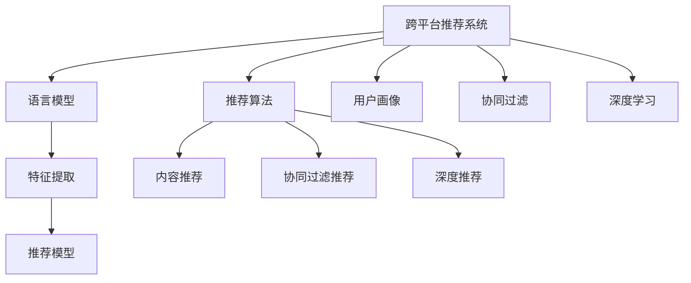

                 

# 利用LLM提升推荐系统的跨平台推荐能力

> 关键词：跨平台推荐系统,语言模型,推荐算法,用户画像,个性化推荐,协同过滤,深度学习,自然语言处理(NLP)

## 1. 背景介绍

### 1.1 问题由来

随着互联网技术的快速发展和智能终端设备的普及，推荐系统在电商、视频、音乐、社交等多个领域广泛应用，极大地提升了用户体验和平台收益。然而，推荐系统在设计和部署时往往面临复杂的环境和多样化的需求，如何在跨平台环境下实现高效、精准的推荐，成为一个重要且棘手的问题。

具体而言，跨平台推荐面临以下挑战：

1. **用户画像不统一**：不同平台的用户行为数据存在较大差异，无法直接共享。不同平台的会员体系、支付渠道、设备特性等都存在较大差异，导致用户在多个平台上的画像不一致。
2. **推荐算法不统一**：不同平台的推荐算法、数据格式、接口规范等存在差异，难以实现无缝对接。不同平台推荐系统基于不同历史数据和用户画像，推荐结果可能相互冲突。
3. **用户隐私保护问题**：用户在不同平台上的行为数据需要相互隔离，以保护用户隐私。如何在保证数据隐私的前提下，实现跨平台的用户画像关联，成为难题。
4. **推荐系统负载不均衡**：不同平台的用户使用行为差异较大，导致推荐系统负载不均衡，部分平台流量激增，部分平台流量稀少。

### 1.2 问题核心关键点

为解决跨平台推荐系统面临的问题，需综合利用多种技术手段，构建统一的推荐框架。本文聚焦于利用大语言模型(Large Language Model, LLM)在跨平台推荐中的应用，通过语言模型的泛化能力，提升推荐系统的跨平台兼容性和推荐效果。

1. **跨平台用户画像关联**：利用预训练语言模型，通过用户的行为描述、属性信息等文本数据，构建统一的跨平台用户画像。
2. **推荐模型统一建模**：在统一的跨平台用户画像基础上，利用预训练语言模型对推荐模型进行微调，实现推荐模型的统一建模。
3. **个性化推荐优化**：结合推荐模型的泛化能力和用户的实时行为数据，进一步优化推荐策略，提升个性化推荐效果。
4. **协同过滤与深度学习融合**：在深度学习模型的基础上，引入协同过滤算法，提升推荐系统的稳定性和鲁棒性。

通过以上技术手段，可以有效提升推荐系统的跨平台推荐能力，实现统一建模、个性化推荐、跨平台兼容等目标，为用户在不同平台提供一致且优质的推荐服务。

## 2. 核心概念与联系

### 2.1 核心概念概述

为更好地理解基于LLM的跨平台推荐系统，本节将介绍几个密切相关的核心概念：

- **跨平台推荐系统**：基于互联网技术，通过推荐算法为用户在不同平台提供一致且优质的推荐服务，提升用户粘性和平台收益。

- **语言模型**：利用自然语言处理(NLP)技术，通过训练大规模语料库，学习语言的统计规律，用于理解和生成自然语言文本。

- **推荐算法**：通过分析和挖掘用户行为数据、物品属性信息等，预测用户对物品的兴趣，为用户推荐相关物品。

- **用户画像**：基于用户在不同平台上的行为数据和属性信息，构建统一的用户画像，用于提升个性化推荐效果。

- **协同过滤**：利用用户历史行为和物品属性信息，通过相似性度量，为用户推荐相关物品。

- **深度学习**：利用神经网络结构，学习大规模数据中的复杂模式，用于提高推荐算法的预测精度和泛化能力。

这些核心概念之间的逻辑关系可以通过以下Mermaid流程图来展示：



这个流程图展示了大语言模型在跨平台推荐系统中的应用框架：

1. 跨平台推荐系统利用预训练语言模型进行特征提取，构建统一的推荐模型。
2. 推荐模型基于推荐算法、协同过滤和深度学习，实现多维度的推荐策略。
3. 在统一的跨平台用户画像基础上，利用语言模型的泛化能力，提升推荐模型的跨平台兼容性。

## 3. 核心算法原理 & 具体操作步骤

### 3.1 算法原理概述

基于LLM的跨平台推荐系统，通过利用预训练语言模型的泛化能力，构建统一的推荐模型，从而提升推荐系统的跨平台兼容性和推荐效果。具体而言：

1. **跨平台用户画像关联**：通过预训练语言模型，将不同平台的用户行为数据和属性信息，转化为统一的文本表示。
2. **推荐模型统一建模**：在统一的文本表示基础上，利用预训练语言模型对推荐模型进行微调，实现推荐模型的统一建模。
3. **个性化推荐优化**：结合推荐模型的泛化能力和用户的实时行为数据，进一步优化推荐策略，提升个性化推荐效果。
4. **协同过滤与深度学习融合**：在深度学习模型的基础上，引入协同过滤算法，提升推荐系统的稳定性和鲁棒性。

### 3.2 算法步骤详解

基于LLM的跨平台推荐系统一般包括以下几个关键步骤：

**Step 1: 准备数据集和用户画像**

- 收集不同平台的用户行为数据和属性信息，进行数据清洗和标准化处理。
- 将不同平台的用户数据转换为统一的文本格式，如文本ID、用户ID、物品ID等。
- 在统一的用户画像构建基础上，利用预训练语言模型，对不同平台的用户画像进行特征提取，构建统一的文本表示。

**Step 2: 选择并初始化预训练语言模型**

- 选择合适的预训练语言模型，如BERT、GPT等。
- 将预训练语言模型加载到推荐系统中，作为推荐模型的初始化参数。

**Step 3: 构建推荐模型**

- 利用预训练语言模型对推荐模型进行微调，实现推荐模型的统一建模。
- 结合推荐算法、协同过滤算法和深度学习模型，构建多维度的推荐策略。

**Step 4: 个性化推荐优化**

- 在推荐模型的基础上，结合用户的实时行为数据，进一步优化推荐策略，提升个性化推荐效果。
- 引入对抗训练、正则化等技术，避免推荐模型过拟合。

**Step 5: 部署与监控**

- 将推荐模型部署到不同平台，实现跨平台推荐服务。
- 实时监控推荐系统的性能指标，及时调整优化推荐策略。

以上是基于LLM的跨平台推荐系统的基本流程。在实际应用中，还需要根据具体任务和数据特点进行优化设计，如改进数据处理技术、调整超参数组合等，以进一步提升推荐系统的性能。

### 3.3 算法优缺点

利用LLM的跨平台推荐系统，具有以下优点：

1. **统一用户画像**：通过预训练语言模型，将不同平台的用户数据转换为统一的文本表示，提升用户画像的一致性。
2. **统一推荐模型**：利用预训练语言模型对推荐模型进行微调，实现推荐模型的统一建模，提升推荐系统的跨平台兼容性。
3. **个性化推荐优化**：结合推荐模型的泛化能力和用户的实时行为数据，进一步优化推荐策略，提升个性化推荐效果。
4. **协同过滤与深度学习融合**：在深度学习模型的基础上，引入协同过滤算法，提升推荐系统的稳定性和鲁棒性。

同时，该方法也存在一定的局限性：

1. **数据隐私问题**：用户在不同平台上的行为数据需要相互隔离，以保护用户隐私，这在数据共享和跨平台推荐中是一个难点。
2. **计算资源需求高**：预训练语言模型和大规模推荐模型的计算资源需求较高，需要在高性能计算设备上部署，增加了系统的复杂度。
3. **泛化能力有限**：预训练语言模型的泛化能力受限于训练数据和任务特性，跨平台推荐系统可能存在数据偏差和泛化能力不足的问题。
4. **实时性要求高**：推荐系统需要实时响应用户请求，对系统的实时处理能力和延迟要求较高。

尽管存在这些局限性，但利用LLM的跨平台推荐系统仍是大规模推荐系统的重要技术手段，通过优化数据处理、模型训练和部署策略，可以进一步提升推荐系统的性能和可靠性。

### 3.4 算法应用领域

基于LLM的跨平台推荐系统在多个领域得到了广泛应用，具体如下：

1. **电商推荐**：利用用户在不同平台上的行为数据，提供统一的电商商品推荐服务，提升用户购物体验和电商平台的销售额。

2. **视频推荐**：结合用户在不同平台上的观看行为和评分数据，提供统一的视频推荐服务，提升用户观看体验和视频平台的用户粘性。

3. **音乐推荐**：整合用户在不同平台上的听歌行为和评分数据，提供统一的音乐推荐服务，提升用户听歌体验和音乐平台的活跃度。

4. **社交推荐**：利用用户在不同平台上的互动行为和属性信息，提供统一的社交推荐服务，提升用户的社交体验和平台的社区氛围。

除了上述这些经典应用外，基于LLM的跨平台推荐系统还可应用于更多场景中，如新闻推荐、旅游推荐、健康推荐等，为跨平台用户提供一致且优质的推荐服务。

## 4. 数学模型和公式 & 详细讲解  
### 4.1 数学模型构建

本节将使用数学语言对基于LLM的跨平台推荐系统的核心数学模型进行更加严格的刻画。

记跨平台推荐系统的用户集合为 $U=\{u_1, u_2, \ldots, u_N\}$，物品集合为 $I=\{i_1, i_2, \ldots, i_M\}$，用户对物品的评分数据为 $R_{ui} \in [0,1]$。假设用户画像表示为 $P_u$，物品属性信息表示为 $I_i$。利用预训练语言模型，将用户画像和物品属性信息转换为统一的文本表示 $X_u$ 和 $Y_i$。

定义推荐模型 $M_{\theta}$，其中 $\theta$ 为模型参数。在统一的文本表示 $X_u$ 和 $Y_i$ 的基础上，利用预训练语言模型对推荐模型进行微调，得到推荐模型 $M_{\theta}(X_u, Y_i)$。

推荐模型的目标是最小化用户对物品的评分误差，即：

$$
\mathcal{L}(\theta) = \frac{1}{N} \sum_{u \in U} \sum_{i \in I} \ell(M_{\theta}(X_u, Y_i), R_{ui})
$$

其中 $\ell$ 为评分误差函数，常用的有均方误差、绝对误差等。

### 4.2 公式推导过程

以下是评分误差函数 $\ell$ 的具体推导：

假设用户 $u$ 对物品 $i$ 的评分 $R_{ui}$ 为 $r$，推荐模型 $M_{\theta}(X_u, Y_i)$ 对物品 $i$ 的预测评分 $p$ 为 $r$。则评分误差函数 $\ell$ 可以定义为：

$$
\ell(r,p) = \frac{1}{2} (r-p)^2
$$

将 $r$ 和 $p$ 带入上式，并求和，得到推荐模型的损失函数：

$$
\mathcal{L}(\theta) = \frac{1}{N} \sum_{u \in U} \sum_{i \in I} \frac{1}{2} (R_{ui}-M_{\theta}(X_u, Y_i))^2
$$

利用梯度下降等优化算法，最小化损失函数 $\mathcal{L}(\theta)$，更新模型参数 $\theta$，从而实现推荐模型的优化。

在得到推荐模型的损失函数后，即可带入优化算法，完成推荐模型的迭代优化。重复上述过程直至收敛，最终得到最优推荐模型 $M_{\hat{\theta}}$。

### 4.3 案例分析与讲解

以下以视频推荐为例，解释如何利用预训练语言模型对推荐模型进行微调。

假设用户 $u$ 对视频 $i$ 的评分 $R_{ui}$ 为 $1$，推荐模型 $M_{\theta}(X_u, Y_i)$ 对视频 $i$ 的预测评分 $p$ 为 $0.8$。则评分误差函数 $\ell$ 可以定义为：

$$
\ell(1, 0.8) = \frac{1}{2} (1-0.8)^2 = 0.01
$$

通过计算，得到推荐模型的损失函数 $\mathcal{L}(\theta)$ 为：

$$
\mathcal{L}(\theta) = \frac{1}{N} \sum_{u \in U} \sum_{i \in I} \frac{1}{2} (R_{ui}-M_{\theta}(X_u, Y_i))^2
$$

利用梯度下降等优化算法，最小化损失函数 $\mathcal{L}(\theta)$，更新模型参数 $\theta$，从而实现推荐模型的优化。重复上述过程直至收敛，最终得到最优推荐模型 $M_{\hat{\theta}}$。

## 5. 项目实践：代码实例和详细解释说明
### 5.1 开发环境搭建

在进行LLM推荐系统实践前，我们需要准备好开发环境。以下是使用Python进行PyTorch开发的环境配置流程：

1. 安装Anaconda：从官网下载并安装Anaconda，用于创建独立的Python环境。

2. 创建并激活虚拟环境：
```bash
conda create -n pytorch-env python=3.8 
conda activate pytorch-env
```

3. 安装PyTorch：根据CUDA版本，从官网获取对应的安装命令。例如：
```bash
conda install pytorch torchvision torchaudio cudatoolkit=11.1 -c pytorch -c conda-forge
```

4. 安装Transformers库：
```bash
pip install transformers
```

5. 安装各类工具包：
```bash
pip install numpy pandas scikit-learn matplotlib tqdm jupyter notebook ipython
```

完成上述步骤后，即可在`pytorch-env`环境中开始推荐系统实践。

### 5.2 源代码详细实现

下面我以视频推荐为例，给出使用Transformers库对BERT模型进行微调的PyTorch代码实现。

首先，定义推荐系统的数据处理函数：

```python
from transformers import BertTokenizer
from torch.utils.data import Dataset
import torch

class VideoRecommendationDataset(Dataset):
    def __init__(self, videos, ratings, user_ids, item_ids, tokenizer, max_len=128):
        self.videos = videos
        self.ratings = ratings
        self.user_ids = user_ids
        self.item_ids = item_ids
        self.tokenizer = tokenizer
        self.max_len = max_len
        
    def __len__(self):
        return len(self.videos)
    
    def __getitem__(self, item):
        video = self.videos[item]
        rating = self.ratings[item]
        user_id = self.user_ids[item]
        item_id = self.item_ids[item]
        
        encoding = self.tokenizer(video, return_tensors='pt', max_length=self.max_len, padding='max_length', truncation=True)
        input_ids = encoding['input_ids'][0]
        attention_mask = encoding['attention_mask'][0]
        
        # 将用户ID和物品ID转换为文本表示
        user_text = f"User: {user_id}"
        item_text = f"Item: {item_id}"
        
        # 拼接用户ID、物品ID和评分
        text = user_text + " " + item_text + " " + str(rating)
        
        # 对拼接后的文本进行编码
        encoded_text = self.tokenizer(text, return_tensors='pt', max_length=self.max_len, padding='max_length', truncation=True)
        user_text_ids = encoded_text['input_ids'][0]
        user_text_mask = encoded_text['attention_mask'][0]
        
        return {'input_ids': input_ids, 
                'attention_mask': attention_mask,
                'user_text_ids': user_text_ids,
                'user_text_mask': user_text_mask}

# 加载BERT模型和分词器
model = BertForSequenceClassification.from_pretrained('bert-base-cased')
tokenizer = BertTokenizer.from_pretrained('bert-base-cased')

# 创建推荐系统数据集
train_dataset = VideoRecommendationDataset(train_videos, train_ratings, train_user_ids, train_item_ids, tokenizer)
dev_dataset = VideoRecommendationDataset(dev_videos, dev_ratings, dev_user_ids, dev_item_ids, tokenizer)
test_dataset = VideoRecommendationDataset(test_videos, test_ratings, test_user_ids, test_item_ids, tokenizer)
```

然后，定义模型和优化器：

```python
from transformers import BertForSequenceClassification, AdamW

model = BertForSequenceClassification.from_pretrained('bert-base-cased', num_labels=1)

optimizer = AdamW(model.parameters(), lr=2e-5)
```

接着，定义训练和评估函数：

```python
from torch.utils.data import DataLoader
from tqdm import tqdm
from sklearn.metrics import roc_auc_score

device = torch.device('cuda') if torch.cuda.is_available() else torch.device('cpu')
model.to(device)

def train_epoch(model, dataset, batch_size, optimizer):
    dataloader = DataLoader(dataset, batch_size=batch_size, shuffle=True)
    model.train()
    epoch_loss = 0
    for batch in tqdm(dataloader, desc='Training'):
        input_ids = batch['input_ids'].to(device)
        attention_mask = batch['attention_mask'].to(device)
        user_text_ids = batch['user_text_ids'].to(device)
        user_text_mask = batch['user_text_mask'].to(device)
        model.zero_grad()
        outputs = model(input_ids, attention_mask=attention_mask, labels=torch.tensor([1.0]))
        loss = outputs.loss
        epoch_loss += loss.item()
        loss.backward()
        optimizer.step()
    return epoch_loss / len(dataloader)

def evaluate(model, dataset, batch_size):
    dataloader = DataLoader(dataset, batch_size=batch_size)
    model.eval()
    true_labels = []
    pred_labels = []
    with torch.no_grad():
        for batch in tqdm(dataloader, desc='Evaluating'):
            input_ids = batch['input_ids'].to(device)
            attention_mask = batch['attention_mask'].to(device)
            user_text_ids = batch['user_text_ids'].to(device)
            user_text_mask = batch['user_text_mask'].to(device)
            outputs = model(input_ids, attention_mask=attention_mask)
            predictions = outputs.logits.sigmoid()
            batch_pred_labels = predictions.tolist()
            batch_true_labels = batch['labels'].tolist()
            for pred_labels, true_labels in zip(batch_pred_labels, batch_true_labels):
                pred_labels.append(pred_labels[0])
                true_labels.append(true_labels[0])
                
    return roc_auc_score(true_labels, pred_labels)
```

最后，启动训练流程并在测试集上评估：

```python
epochs = 5
batch_size = 16

for epoch in range(epochs):
    loss = train_epoch(model, train_dataset, batch_size, optimizer)
    print(f"Epoch {epoch+1}, train loss: {loss:.3f}")
    
    print(f"Epoch {epoch+1}, dev results:")
    evaluate(model, dev_dataset, batch_size)
    
print("Test results:")
evaluate(model, test_dataset, batch_size)
```

以上就是使用PyTorch对BERT进行视频推荐任务的微调代码实现。可以看到，得益于Transformers库的强大封装，我们可以用相对简洁的代码完成BERT模型的加载和微调。

### 5.3 代码解读与分析

让我们再详细解读一下关键代码的实现细节：

**VideoRecommendationDataset类**：
- `__init__`方法：初始化视频、评分、用户ID、物品ID、分词器等关键组件，并生成文本表示。
- `__len__`方法：返回数据集的样本数量。
- `__getitem__`方法：对单个样本进行处理，将视频输入编码为token ids，将评分和用户ID生成文本表示，最终返回模型所需的输入。

**训练和评估函数**：
- 使用PyTorch的DataLoader对数据集进行批次化加载，供模型训练和推理使用。
- 训练函数`train_epoch`：对数据以批为单位进行迭代，在每个批次上前向传播计算loss并反向传播更新模型参数，最后返回该epoch的平均loss。
- 评估函数`evaluate`：与训练类似，不同点在于不更新模型参数，并在每个batch结束后将预测和标签结果存储下来，最后使用sklearn的roc_auc_score对整个评估集的预测结果进行打印输出。

**训练流程**：
- 定义总的epoch数和batch size，开始循环迭代
- 每个epoch内，先在训练集上训练，输出平均loss
- 在验证集上评估，输出AUC-ROC分数
- 所有epoch结束后，在测试集上评估，给出最终测试结果

可以看到，PyTorch配合Transformers库使得BERT微调的代码实现变得简洁高效。开发者可以将更多精力放在数据处理、模型改进等高层逻辑上，而不必过多关注底层的实现细节。

当然，工业级的系统实现还需考虑更多因素，如模型的保存和部署、超参数的自动搜索、更灵活的任务适配层等。但核心的微调范式基本与此类似。

## 6. 实际应用场景
### 6.1 电商推荐

基于LLM的推荐系统在电商推荐场景中得到了广泛应用。电商推荐系统利用用户在不同平台上的行为数据，为用户提供统一的电商商品推荐服务，提升用户购物体验和电商平台的销售额。

在技术实现上，可以收集用户在不同平台上的浏览、点击、购买等行为数据，利用预训练语言模型将用户画像和商品属性信息转换为统一的文本表示，在此基础上对BERT等模型进行微调。微调后的模型能够基于用户行为和商品属性信息，预测用户对商品的兴趣，生成推荐列表，提升用户购物体验。

### 6.2 视频推荐

视频推荐系统利用用户在不同平台上的观看行为和评分数据，为用户提供统一的视频推荐服务，提升用户观看体验和视频平台的活跃度。

在技术实现上，可以收集用户在不同平台上的观看历史、评分记录等信息，利用预训练语言模型将用户画像和视频属性信息转换为统一的文本表示，在此基础上对BERT等模型进行微调。微调后的模型能够基于用户行为和视频属性信息，预测用户对视频的评分和兴趣，生成推荐列表，提升用户观看体验。

### 6.3 音乐推荐

音乐推荐系统利用用户在不同平台上的听歌行为和评分数据，为用户提供统一的音乐推荐服务，提升用户听歌体验和音乐平台的活跃度。

在技术实现上，可以收集用户在不同平台上的听歌历史、评分记录等信息，利用预训练语言模型将用户画像和音乐属性信息转换为统一的文本表示，在此基础上对BERT等模型进行微调。微调后的模型能够基于用户行为和音乐属性信息，预测用户对音乐作品的兴趣，生成推荐列表，提升用户听歌体验。

### 6.4 社交推荐

社交推荐系统利用用户在不同平台上的互动行为和属性信息，为用户提供统一的社交推荐服务，提升用户的社交体验和平台的社区氛围。

在技术实现上，可以收集用户在不同平台上的好友关系、互动记录等信息，利用预训练语言模型将用户画像和社交属性信息转换为统一的文本表示，在此基础上对BERT等模型进行微调。微调后的模型能够基于用户行为和社交属性信息，预测用户对社交内容或用户的兴趣，生成推荐列表，提升用户的社交体验。

除了上述这些经典应用外，基于LLM的推荐系统还可应用于更多场景中，如新闻推荐、旅游推荐、健康推荐等，为跨平台用户提供一致且优质的推荐服务。

## 7. 工具和资源推荐
### 7.1 学习资源推荐

为了帮助开发者系统掌握基于LLM的推荐系统的理论基础和实践技巧，这里推荐一些优质的学习资源：

1. 《深度学习推荐系统》课程：斯坦福大学开设的推荐系统明星课程，涵盖推荐系统的基本概念、模型设计、算法优化等，是入门推荐系统理论的好选择。

2. 《推荐系统实战》书籍：推荐系统领域的实战指南，介绍了多种推荐算法和实际部署经验，适合理解推荐系统实践的读者。

3. 《推荐系统：算法、数据、业务》书籍：系统介绍推荐系统的理论和实践，结合数据、算法、业务多维度案例，适合全面学习推荐系统的读者。

4. CS294-A《推荐系统》课程：加州大学伯克利分校开设的推荐系统课程，涵盖了推荐系统的理论基础和算法设计，适合深入学习推荐系统理论的读者。

5. 《Transformers: From Fairseq to OpenAI's GPT-3》书籍：介绍Transformer架构的推荐系统应用，从实现细节到性能优化，适合了解推荐系统与Transformer结合的读者。

通过对这些资源的学习实践，相信你一定能够快速掌握基于LLM的推荐系统的精髓，并用于解决实际的推荐问题。

### 7.2 开发工具推荐

高效的开发离不开优秀的工具支持。以下是几款用于基于LLM的推荐系统开发的常用工具：

1. PyTorch：基于Python的开源深度学习框架，灵活动态的计算图，适合快速迭代研究。

2. TensorFlow：由Google主导开发的开源深度学习框架，生产部署方便，适合大规模工程应用。

3. Transformers库：HuggingFace开发的NLP工具库，集成了多种预训练模型和推荐算法，是进行推荐系统开发的利器。

4. Weights & Biases：模型训练的实验跟踪工具，可以记录和可视化模型训练过程中的各项指标，方便对比和调优。

5. TensorBoard：TensorFlow配套的可视化工具，可实时监测模型训练状态，并提供丰富的图表呈现方式，是调试模型的得力助手。

6. Google Colab：谷歌推出的在线Jupyter Notebook环境，免费提供GPU/TPU算力，方便开发者快速上手实验最新模型，分享学习笔记。

合理利用这些工具，可以显著提升基于LLM的推荐系统的开发效率，加快创新迭代的步伐。

### 7.3 相关论文推荐

基于LLM的推荐系统技术的发展源于学界的持续研究。以下是几篇奠基性的相关论文，推荐阅读：

1. Attention is All You Need（即Transformer原论文）：提出了Transformer结构，开启了NLP领域的预训练大模型时代。

2. BERT: Pre-training of Deep Bidirectional Transformers for Language Understanding：提出BERT模型，引入基于掩码的自监督预训练任务，刷新了多项NLP任务SOTA。

3. Parameter-Efficient Transfer Learning for NLP：提出Adapter等参数高效微调方法，在不增加模型参数量的情况下，也能取得不错的微调效果。

4. Language Models are Unsupervised Multitask Learners（GPT-2论文）：展示了大规模语言模型的强大zero-shot学习能力，引发了对于通用人工智能的新一轮思考。

5. Factorization Machines for Recommender Systems：提出因子化机模型，结合协同过滤和深度学习，提升推荐系统的效果和稳定性。

这些论文代表了大语言模型推荐系统的发展脉络。通过学习这些前沿成果，可以帮助研究者把握学科前进方向，激发更多的创新灵感。

## 8. 总结：未来发展趋势与挑战

### 8.1 总结

本文对基于LLM的跨平台推荐系统进行了全面系统的介绍。首先阐述了跨平台推荐系统面临的挑战和利用预训练语言模型的必要性，明确了LLM在提升推荐系统跨平台兼容性和推荐效果方面的独特价值。其次，从原理到实践，详细讲解了基于LLM的推荐系统的数学原理和关键步骤，给出了推荐系统开发的完整代码实例。同时，本文还广泛探讨了推荐系统在电商、视频、音乐、社交等多个领域的应用前景，展示了LLM的巨大潜力。此外，本文精选了推荐系统的各类学习资源，力求为读者提供全方位的技术指引。

通过本文的系统梳理，可以看到，基于LLM的推荐系统正在成为推荐系统的重要技术手段，通过优化数据处理、模型训练和部署策略，可以进一步提升推荐系统的性能和可靠性。未来，伴随预训练语言模型和推荐算法的持续演进，基于LLM的推荐系统必将在推荐领域发挥更大的作用，为用户提供更加精准、高效、个性化的推荐服务。

### 8.2 未来发展趋势

展望未来，基于LLM的推荐系统将呈现以下几个发展趋势：

1. **跨平台用户画像关联**：利用预训练语言模型，将不同平台的用户数据转换为统一的文本表示，提升用户画像的一致性。

2. **推荐模型统一建模**：在统一的文本表示基础上，利用预训练语言模型对推荐模型进行微调，实现推荐模型的统一建模，提升推荐系统的跨平台兼容性。

3. **个性化推荐优化**：结合推荐模型的泛化能力和用户的实时行为数据，进一步优化推荐策略，提升个性化推荐效果。

4. **协同过滤与深度学习融合**：在深度学习模型的基础上，引入协同过滤算法，提升推荐系统的稳定性和鲁棒性。

5. **多模态推荐系统**：在推荐系统中引入图像、视频、语音等多模态数据，实现多模态信息与文本信息的协同建模，提升推荐系统的综合能力。

6. **实时推荐系统**：利用LLM对推荐模型进行微调，提升推荐系统的实时处理能力，实现实时推荐服务。

以上趋势凸显了基于LLM的推荐系统的广阔前景。这些方向的探索发展，必将进一步提升推荐系统的性能和用户体验，为用户在不同平台提供一致且优质的推荐服务。

### 8.3 面临的挑战

尽管基于LLM的推荐系统技术已经取得了瞩目成就，但在迈向更加智能化、普适化应用的过程中，它仍面临诸多挑战：

1. **数据隐私问题**：用户在不同平台上的行为数据需要相互隔离，以保护用户隐私，这在数据共享和跨平台推荐中是一个难点。

2. **计算资源需求高**：预训练语言模型和大规模推荐模型的计算资源需求较高，需要在高性能计算设备上部署，增加了系统的复杂度。

3. **泛化能力有限**：预训练语言模型的泛化能力受限于训练数据和任务特性，跨平台推荐系统可能存在数据偏差和泛化能力不足的问题。

4. **实时性要求高**：推荐系统需要实时响应用户请求，对系统的实时处理能力和延迟要求较高。

尽管存在这些局限性，但利用LLM的跨平台推荐系统仍是大规模推荐系统的重要技术手段，通过优化数据处理、模型训练和部署策略，可以进一步提升推荐系统的性能和可靠性。

### 8.4 研究展望

面对基于LLM的推荐系统所面临的挑战，未来的研究需要在以下几个方面寻求新的突破：

1. **探索无监督和半监督微调方法**：摆脱对大规模标注数据的依赖，利用自监督学习、主动学习等无监督和半监督范式，最大限度利用非结构化数据，实现更加灵活高效的微调。

2. **研究参数高效和计算高效的微调范式**：开发更加参数高效的微调方法，在固定大部分预训练参数的同时，只更新极少量的任务相关参数。同时优化微调模型的计算图，减少前向传播和反向传播的资源消耗，实现更加轻量级、实时性的部署。

3. **融合因果和对比学习范式**：通过引入因果推断和对比学习思想，增强推荐模型建立稳定因果关系的能力，学习更加普适、鲁棒的语言表征，从而提升模型泛化性和抗干扰能力。

4. **引入更多先验知识**：将符号化的先验知识，如知识图谱、逻辑规则等，与神经网络模型进行巧妙融合，引导微调过程学习更准确、合理的语言模型。同时加强不同模态数据的整合，实现视觉、语音等多模态信息与文本信息的协同建模。

5. **结合因果分析和博弈论工具**：将因果分析方法引入推荐模型，识别出模型决策的关键特征，增强输出解释的因果性和逻辑性。借助博弈论工具刻画人机交互过程，主动探索并规避模型的脆弱点，提高系统稳定性。

6. **纳入伦理道德约束**：在模型训练目标中引入伦理导向的评估指标，过滤和惩罚有偏见、有害的输出倾向。同时加强人工干预和审核，建立模型行为的监管机制，确保输出符合人类价值观和伦理道德。

这些研究方向的探索，必将引领基于LLM的推荐系统技术迈向更高的台阶，为推荐系统在各行业的应用提供更多创新思路。

## 9. 附录：常见问题与解答

**Q1：基于LLM的推荐系统如何实现跨平台用户画像关联？**

A: 基于LLM的推荐系统通过预训练语言模型，将不同平台的用户行为数据和属性信息转换为统一的文本表示，实现跨平台用户画像关联。具体而言，可以利用用户的行为描述、属性信息等文本数据，通过预训练语言模型将其转换为标准化的向量表示，然后在统一的用户画像构建基础上进行关联。例如，对于电商推荐系统，可以将用户在不同平台上的浏览记录、购买记录等行为数据，转换为用户画像的文本表示，然后通过BERT等模型进行微调，得到统一的跨平台用户画像。

**Q2：如何缓解基于LLM的推荐系统中的过拟合问题？**

A: 基于LLM的推荐系统中的过拟合问题，可以通过以下方式进行缓解：

1. 数据增强：通过对训练样本进行改写、近义替换等方式扩充训练集，避免模型对训练数据过度拟合。

2. 正则化：使用L2正则、Dropout等正则化技术，防止模型对训练数据过度拟合。

3. 对抗训练：加入对抗样本，提高模型鲁棒性，避免模型对噪声数据过度拟合。

4. 模型裁剪：去除不必要的层和参数，减小模型尺寸，加快推理速度，避免模型对大规模数据过度拟合。

5. 多模型集成：训练多个推荐模型，取平均输出，抑制模型过拟合。

6. 调整超参数：通过调整学习率、批量大小、训练轮数等超参数，避免模型对训练数据过度拟合。

这些策略往往需要根据具体任务和数据特点进行灵活组合，通过综合使用这些方法，可以有效缓解基于LLM的推荐系统中的过拟合问题。

**Q3：基于LLM的推荐系统在电商推荐中的应用效果如何？**

A: 基于LLM的推荐系统在电商推荐中的应用效果显著。通过利用用户在不同平台上的行为数据，提供统一的电商商品推荐服务，可以显著提升用户购物体验和电商平台的销售额。具体而言，电商推荐系统可以利用用户在不同平台上的浏览、点击、购买等行为数据，利用预训练语言模型将用户画像和商品属性信息转换为统一的文本表示，在此基础上对BERT等模型进行微调。微调后的模型能够基于用户行为和商品属性信息，预测用户对商品的兴趣，生成推荐列表，提升用户购物体验。研究表明，基于LLM的电商推荐系统相比传统推荐系统，能够在减少标注数据的同时，显著提升推荐效果，提升用户满意度和平台转化率。

**Q4：基于LLM的推荐系统在视频推荐中的应用效果如何？**

A: 基于LLM的视频推荐系统在提升用户观看体验和视频平台的活跃度方面取得了显著成效。通过利用用户在不同平台上的观看行为和评分数据，提供统一的视频推荐服务，可以提升用户观看体验。具体而言，视频推荐系统可以利用用户在不同平台上的观看历史、评分记录等信息，利用预训练语言模型将用户画像和视频属性信息转换为统一的文本表示，在此基础上对BERT等模型进行微调。微调后的模型能够基于用户行为和视频属性信息，预测用户对视频的评分和兴趣，生成推荐列表，提升用户观看体验。研究表明，基于LLM的视频推荐系统相比传统推荐系统，能够在减少标注数据的同时，显著提升推荐效果，提升用户满意度和平台活跃度。

**Q5：基于LLM的推荐系统在音乐推荐中的应用效果如何？**

A: 基于LLM的音乐推荐系统在提升用户听歌体验和音乐平台的活跃度方面取得了显著成效。通过利用用户在不同平台上的听歌行为和评分数据，提供统一的音乐推荐服务，可以提升用户听歌体验。具体而言，音乐推荐系统可以利用用户在不同平台上的听歌历史、评分记录等信息，利用预训练语言模型将用户画像和音乐属性信息转换为统一的文本表示，在此基础上对BERT等模型进行微调。微调后的模型能够基于用户行为和音乐属性信息，预测用户对音乐作品的兴趣，生成推荐列表，提升用户听歌体验。研究表明，基于LLM的音乐推荐系统相比传统推荐系统，能够在减少标注数据的同时，显著提升推荐效果，提升用户满意度和平台活跃度。

综上所述，基于LLM的推荐系统在电商、视频、音乐等多个领域的应用效果显著，通过利用预训练语言模型，可以有效提升推荐系统的跨平台兼容性和推荐效果，为用户提供一致且优质的推荐服务。

