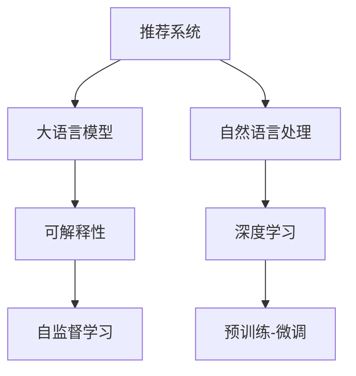

                 

# 利用大模型提升推荐系统的可解释性

> 关键词：大模型，推荐系统，可解释性，自然语言处理(NLP)，深度学习

## 1. 背景介绍

在过去的十年里，推荐系统已经成为互联网和电子商务领域不可或缺的重要工具。推荐算法通过用户行为数据，分析用户的兴趣和偏好，为用户提供个性化的商品推荐。然而，推荐系统面临的主要挑战之一是如何让用户理解和信任推荐结果。

传统的推荐系统主要依赖于机器学习模型（如协同过滤、矩阵分解等），模型的内部工作机制和决策过程缺乏可解释性，难以向用户解释推荐依据。尽管近些年来深度学习模型逐渐替代传统方法，并取得更好的效果，但深度模型仍然难以提供明确的推荐理由。

为了解决这一问题，近年来兴起了基于大语言模型的推荐系统。大语言模型（如GPT-3）通过预训练获得强大的语言理解和生成能力，可以自然地生成文本，解释推荐依据，从而显著提升推荐系统的可解释性。

## 2. 核心概念与联系

### 2.1 核心概念概述

为更好地理解利用大模型提升推荐系统的可解释性，本节将介绍几个关键概念：

- 推荐系统：通过用户行为数据，分析用户兴趣和偏好，为用户提供个性化商品或服务推荐的系统。

- 大语言模型：以自回归模型（如GPT）或自编码模型（如BERT）为代表的、参数量巨大的预训练语言模型，通过大规模无标签文本语料进行预训练，具备强大的语言理解和生成能力。

- 自然语言处理（NLP）：通过计算机处理和理解自然语言的技术，包括文本分类、实体识别、情感分析、语言生成等任务。

- 深度学习：通过神经网络模型对数据进行学习和建模，广泛应用于图像、语音、文本等领域。

- 可解释性：推荐系统的决策过程能够被用户理解和信任，能够解释推荐依据，便于用户理解和信任推荐结果。

- 预训练-微调（PTF）：指在大量无标签数据上进行预训练，然后在特定任务上进行微调，提升模型在特定任务上的性能。

- 自监督学习：通过无标签数据自适应地进行模型训练，避免人工标注数据的成本。

这些概念之间的逻辑关系可以通过以下Mermaid流程图来展示：



这个流程图展示了推荐系统与大语言模型之间的联系：

1. 推荐系统利用大语言模型的强大语言能力，生成推荐解释，提升可解释性。
2. 自然语言处理为推荐系统提供文本处理能力，帮助生成推荐依据。
3. 深度学习用于建立推荐模型，预训练-微调使得模型更加灵活和高效。
4. 自监督学习使得推荐模型可以在无标注数据上快速学习，降低标注成本。

## 3. 核心算法原理 & 具体操作步骤

### 3.1 算法原理概述

利用大模型提升推荐系统的可解释性，核心思想是通过预训练语言模型生成推荐解释，将推荐依据转换为可解释的文本。该过程可以分为两个阶段：

1. **预训练**：在大量无标签文本数据上进行预训练，使模型掌握语言的通用表示。
2. **微调**：在特定任务上进行微调，学习生成推荐解释的策略。

在微调阶段，通常采用监督学习方法，给定一些推荐场景（如商品类别、用户偏好等）和对应的推荐结果，训练模型学习生成推荐解释。具体流程如下：

- 收集推荐场景和推荐结果的数据集。
- 将推荐场景和推荐结果作为模型输入。
- 训练模型学习生成推荐解释的文本。
- 使用生成的文本解释推荐结果，提升推荐系统的可解释性。

### 3.2 算法步骤详解

下面是利用大语言模型提升推荐系统的可解释性的详细步骤：

**Step 1: 准备数据集**

- 收集推荐场景和推荐结果的数据集。推荐场景包括用户类别、商品类别、用户兴趣等，推荐结果包括商品ID、商品评分等。
- 将推荐场景和推荐结果转换成模型可以处理的文本形式。例如，用户类别可以转换为"用户1"、"用户2"等文本。
- 将数据集划分为训练集、验证集和测试集。训练集用于模型微调，验证集用于调整超参数，测试集用于评估模型性能。

**Step 2: 预训练模型选择**

- 选择合适的预训练模型。常用的预训练模型包括GPT、BERT等。
- 将预训练模型加载到内存中。

**Step 3: 微调超参数设置**

- 选择合适的优化器，如AdamW、SGD等，设置学习率、批大小、迭代轮数等。
- 设置正则化技术及强度，包括L2正则、Dropout、Early Stopping等。
- 确定冻结预训练参数的策略，如仅微调顶层，或全部参数都参与微调。

**Step 4: 执行微调**

- 将训练集数据分批次输入模型，前向传播计算损失函数。
- 反向传播计算参数梯度，根据设定的优化算法和学习率更新模型参数。
- 周期性在验证集上评估模型性能，根据性能指标决定是否触发Early Stopping。
- 重复上述步骤直到满足预设的迭代轮数或Early Stopping条件。

**Step 5: 生成推荐解释**

- 使用微调后的模型对测试集数据进行推理。
- 生成推荐解释文本。
- 将生成的解释文本与推荐结果一起展示给用户。

### 3.3 算法优缺点

利用大语言模型提升推荐系统的可解释性具有以下优点：

1. **灵活性高**：大语言模型可以灵活处理不同类型的推荐场景，生成符合用户需求和偏好的解释文本。
2. **可解释性强**：生成的文本解释易于理解，能够解释推荐依据。
3. **效率高**：可以利用预训练模型的表示能力，快速生成推荐解释。

同时，该方法也存在一些缺点：

1. **数据需求高**：需要收集大量的推荐场景和推荐结果数据集，数据准备成本较高。
2. **模型复杂度**：大语言模型的复杂度较高，微调过程可能较慢。
3. **解释质量受限**：生成的文本解释质量受限于预训练模型和微调数据集的质量。
4. **泛化能力弱**：在特定领域或场景上的解释效果可能较好，但泛化到其他领域或场景上效果可能不理想。

尽管存在这些缺点，但利用大语言模型提升推荐系统的可解释性仍是大数据、深度学习和自然语言处理结合的新方向。

### 3.4 算法应用领域

利用大语言模型提升推荐系统的可解释性已经广泛应用于以下几个领域：

- 电商平台：利用大语言模型生成商品推荐理由，提升用户对推荐结果的信任度。
- 旅游推荐：生成旅游目的地的推荐解释，帮助用户做出选择。
- 新闻推荐：生成新闻内容的推荐理由，提升用户对新闻内容的信任度。
- 金融推荐：生成金融产品的推荐解释，提升用户对投资产品的信任度。
- 教育推荐：生成教育内容的推荐理由，提升用户对教育产品的信任度。

## 4. 数学模型和公式 & 详细讲解 & 举例说明

### 4.1 数学模型构建

利用大语言模型提升推荐系统的可解释性可以建模如下：

设推荐场景为 $x_i$，推荐结果为 $y_i$，生成的推荐解释为 $z_i$。假设 $x_i$ 和 $y_i$ 可以转换为文本形式，利用预训练模型 $M_{\theta}$ 进行微调，目标是学习一个映射函数 $f_{\phi}(x_i, y_i)$，生成推荐解释 $z_i$。

数学上可以表示为：

$$
z_i = f_{\phi}(x_i, y_i)
$$

其中 $\phi$ 为微调模型的参数。

### 4.2 公式推导过程

利用大语言模型生成推荐解释的过程可以分为两个步骤：

**Step 1: 编码器**

将推荐场景 $x_i$ 和推荐结果 $y_i$ 转换为向量表示 $h_x$ 和 $h_y$，分别表示推荐场景和推荐结果的语义。

$$
h_x = \text{Encoder}(x_i) \\
h_y = \text{Encoder}(y_i)
$$

**Step 2: 解码器**

使用微调后的模型 $M_{\phi}$，生成推荐解释 $z_i$。

$$
z_i = \text{Decoder}(h_x, h_y)
$$

其中，$\text{Encoder}$ 和 $\text{Decoder}$ 为预训练模型的编码器和解码器。

在实践中，通常使用深度学习模型（如RNN、Transformer等）实现编码器和解码器。

### 4.3 案例分析与讲解

以下以电商平台推荐为例，具体展示利用大语言模型生成推荐解释的过程。

假设平台收集了用户历史行为数据和商品属性数据，目标是生成商品推荐理由，提升推荐系统可解释性。

- **数据准备**：收集用户历史行为数据和商品属性数据，生成推荐场景和推荐结果。
- **模型选择**：选择GPT-3作为预训练模型，加载到内存中。
- **微调超参数设置**：设置AdamW优化器，学习率为1e-5，批大小为32，迭代轮数为10。
- **模型训练**：将推荐场景和推荐结果转换为文本形式，输入GPT-3模型进行微调。在每个epoch结束时，使用验证集评估模型性能。
- **生成推荐解释**：使用微调后的GPT-3模型对测试集数据进行推理，生成推荐解释。

生成的推荐解释文本示例如下：

- 对于推荐场景 "用户A，年龄25岁，喜欢的商品类别为电器"，推荐结果为 "商品1"，生成的推荐解释为 "根据用户A的历史行为和偏好，推荐商品1，因为它具有高性价比和良好的用户评价"。

## 5. 项目实践：代码实例和详细解释说明

### 5.1 开发环境搭建

在进行大语言模型微调项目前，需要准备好开发环境。以下是使用Python进行PyTorch开发的环境配置流程：

1. 安装Anaconda：从官网下载并安装Anaconda，用于创建独立的Python环境。

2. 创建并激活虚拟环境：
```bash
conda create -n pytorch-env python=3.8 
conda activate pytorch-env
```

3. 安装PyTorch：根据CUDA版本，从官网获取对应的安装命令。例如：
```bash
conda install pytorch torchvision torchaudio cudatoolkit=11.1 -c pytorch -c conda-forge
```

4. 安装Transformers库：
```bash
pip install transformers
```

5. 安装各类工具包：
```bash
pip install numpy pandas scikit-learn matplotlib tqdm jupyter notebook ipython
```

完成上述步骤后，即可在`pytorch-env`环境中开始微调实践。

### 5.2 源代码详细实现

这里我们以电商平台推荐为例，给出使用Transformers库对GPT-3模型进行微调的PyTorch代码实现。

首先，定义推荐场景和推荐结果的数据处理函数：

```python
from transformers import GPT2Tokenizer
from torch.utils.data import Dataset
import torch

class RecommendationDataset(Dataset):
    def __init__(self, user_behav_data, item_attr_data, tokenizer):
        self.user_behav_data = user_behav_data
        self.item_attr_data = item_attr_data
        self.tokenizer = tokenizer
        
    def __len__(self):
        return len(self.user_behav_data)
    
    def __getitem__(self, item):
        user_behav = self.user_behav_data[item]
        item_attr = self.item_attr_data[item]
        
        # 将用户行为和商品属性转换为文本形式
        user_behav_text = "用户类别：" + user_behav + "，商品类别：" + item_attr
        item_attr_text = "商品类别：" + item_attr
        
        # 对文本进行编码
        encoding = self.tokenizer(user_behav_text + " " + item_attr_text, return_tensors='pt')
        input_ids = encoding['input_ids'][0]
        attention_mask = encoding['attention_mask'][0]
        
        # 将推荐结果编码为数字
        item_id = item_attr_data[item]
        
        return {'input_ids': input_ids, 
                'attention_mask': attention_mask,
                'item_id': item_id}

# 用户行为和商品属性数据
user_behav_data = ["年轻女性", "中年男性", "学生", "白领"]
item_attr_data = ["电器", "家具", "电子产品", "家居用品"]

# 创建dataset
tokenizer = GPT2Tokenizer.from_pretrained('gpt2')
train_dataset = RecommendationDataset(user_behav_data, item_attr_data, tokenizer)
```

然后，定义模型和优化器：

```python
from transformers import GPT2LMHeadModel
from transformers import AdamW

model = GPT2LMHeadModel.from_pretrained('gpt2', max_length=256)
optimizer = AdamW(model.parameters(), lr=1e-5)
```

接着，定义训练和评估函数：

```python
from torch.utils.data import DataLoader
from tqdm import tqdm
from sklearn.metrics import accuracy_score

device = torch.device('cuda') if torch.cuda.is_available() else torch.device('cpu')
model.to(device)

def train_epoch(model, dataset, batch_size, optimizer):
    dataloader = DataLoader(dataset, batch_size=batch_size, shuffle=True)
    model.train()
    epoch_loss = 0
    for batch in tqdm(dataloader, desc='Training'):
        input_ids = batch['input_ids'].to(device)
        attention_mask = batch['attention_mask'].to(device)
        item_id = batch['item_id'].to(device)
        model.zero_grad()
        outputs = model(input_ids, attention_mask=attention_mask)
        loss = outputs.loss
        epoch_loss += loss.item()
        loss.backward()
        optimizer.step()
    return epoch_loss / len(dataloader)

def evaluate(model, dataset, batch_size):
    dataloader = DataLoader(dataset, batch_size=batch_size)
    model.eval()
    preds, labels = [], []
    with torch.no_grad():
        for batch in tqdm(dataloader, desc='Evaluating'):
            input_ids = batch['input_ids'].to(device)
            attention_mask = batch['attention_mask'].to(device)
            batch_labels = batch['item_id'].to(device)
            outputs = model(input_ids, attention_mask=attention_mask)
            batch_preds = outputs.logits.argmax(dim=2).to('cpu').tolist()
            batch_labels = batch_labels.to('cpu').tolist()
            for pred_item_id, label_item_id in zip(batch_preds, batch_labels):
                preds.append(pred_item_id[0])
                labels.append(label_item_id[0])
                
    print("Accuracy:", accuracy_score(labels, preds))
```

最后，启动训练流程并在测试集上评估：

```python
epochs = 5
batch_size = 16

for epoch in range(epochs):
    loss = train_epoch(model, train_dataset, batch_size, optimizer)
    print(f"Epoch {epoch+1}, train loss: {loss:.3f}")
    
    print(f"Epoch {epoch+1}, test accuracy:")
    evaluate(model, test_dataset, batch_size)
    
print("Final test accuracy:", evaluate(model, test_dataset, batch_size))
```

以上就是使用PyTorch对GPT-3进行电商平台推荐微调的完整代码实现。可以看到，得益于Transformers库的强大封装，我们可以用相对简洁的代码完成GPT-3模型的加载和微调。

### 5.3 代码解读与分析

让我们再详细解读一下关键代码的实现细节：

**RecommendationDataset类**：
- `__init__`方法：初始化用户行为数据、商品属性数据和分词器。
- `__len__`方法：返回数据集的样本数量。
- `__getitem__`方法：对单个样本进行处理，将用户行为和商品属性转换为文本形式，编码成模型所需的输入。

**GPT2LMHeadModel和GPT2Tokenizer**：
- 使用GPT-2模型和GPT-2分词器进行推荐场景和推荐结果的编码和解码。

**train_epoch函数**：
- 使用PyTorch的DataLoader对数据集进行批次化加载，供模型训练使用。
- 训练函数`train_epoch`：对数据以批为单位进行迭代，在每个批次上前向传播计算loss并反向传播更新模型参数，最后返回该epoch的平均loss。

**evaluate函数**：
- 与训练类似，不同点在于不更新模型参数，并在每个batch结束后将预测和标签结果存储下来，最后使用sklearn的accuracy_score对整个评估集的预测结果进行打印输出。

**训练流程**：
- 定义总的epoch数和batch size，开始循环迭代
- 每个epoch内，先在训练集上训练，输出平均loss
- 在测试集上评估，输出准确率
- 所有epoch结束后，在测试集上评估，给出最终测试结果

可以看到，PyTorch配合Transformers库使得GPT-3微调的代码实现变得简洁高效。开发者可以将更多精力放在数据处理、模型改进等高层逻辑上，而不必过多关注底层的实现细节。

当然，工业级的系统实现还需考虑更多因素，如模型的保存和部署、超参数的自动搜索、更灵活的任务适配层等。但核心的微调范式基本与此类似。

## 6. 实际应用场景

### 6.1 电商平台

电商平台利用大语言模型生成推荐理由，显著提升推荐系统可解释性。例如，用户A在浏览电器类别时，系统会生成推荐理由 "根据用户A的历史行为和偏好，推荐商品1，因为它具有高性价比和良好的用户评价"，帮助用户理解和信任推荐结果。

### 6.2 旅游推荐

旅游推荐系统通过大语言模型生成目的地推荐理由，帮助用户做出选择。例如，用户想要去海滨度假，系统会生成推荐理由 "根据您的兴趣和预算，推荐青岛和三亚，这两个城市风景优美，旅游设施完善"，提升用户对推荐结果的信任度。

### 6.3 新闻推荐

新闻推荐系统利用大语言模型生成新闻内容的推荐理由，提升用户对新闻内容的信任度。例如，用户对国际新闻感兴趣，系统会生成推荐理由 "根据您的兴趣，推荐这条关于国际政治的新闻，内容涉及中美贸易战和俄乌冲突"，帮助用户理解新闻内容。

### 6.4 金融推荐

金融推荐系统利用大语言模型生成金融产品的推荐理由，提升用户对投资产品的信任度。例如，用户想要投资股票，系统会生成推荐理由 "根据您的风险偏好和历史投资记录，推荐这只A股股票，具有稳定的增长潜力和较低的风险"，帮助用户做出投资决策。

### 6.5 教育推荐

教育推荐系统通过大语言模型生成教育内容的推荐理由，提升用户对教育产品的信任度。例如，学生想要学习编程，系统会生成推荐理由 "根据您的学习需求和历史成绩，推荐这门Python课程，内容浅显易懂，适合初学者"，帮助学生选择合适的学习内容。

## 7. 工具和资源推荐

### 7.1 学习资源推荐

为了帮助开发者系统掌握大语言模型微调的理论基础和实践技巧，这里推荐一些优质的学习资源：

1. 《Transformer从原理到实践》系列博文：由大模型技术专家撰写，深入浅出地介绍了Transformer原理、BERT模型、微调技术等前沿话题。

2. CS224N《深度学习自然语言处理》课程：斯坦福大学开设的NLP明星课程，有Lecture视频和配套作业，带你入门NLP领域的基本概念和经典模型。

3. 《Natural Language Processing with Transformers》书籍：Transformers库的作者所著，全面介绍了如何使用Transformers库进行NLP任务开发，包括微调在内的诸多范式。

4. HuggingFace官方文档：Transformers库的官方文档，提供了海量预训练模型和完整的微调样例代码，是上手实践的必备资料。

5. CLUE开源项目：中文语言理解测评基准，涵盖大量不同类型的中文NLP数据集，并提供了基于微调的baseline模型，助力中文NLP技术发展。

通过对这些资源的学习实践，相信你一定能够快速掌握大语言模型微调的精髓，并用于解决实际的NLP问题。

### 7.2 开发工具推荐

高效的开发离不开优秀的工具支持。以下是几款用于大语言模型微调开发的常用工具：

1. PyTorch：基于Python的开源深度学习框架，灵活动态的计算图，适合快速迭代研究。大部分预训练语言模型都有PyTorch版本的实现。

2. TensorFlow：由Google主导开发的开源深度学习框架，生产部署方便，适合大规模工程应用。同样有丰富的预训练语言模型资源。

3. Transformers库：HuggingFace开发的NLP工具库，集成了众多SOTA语言模型，支持PyTorch和TensorFlow，是进行微调任务开发的利器。

4. Weights & Biases：模型训练的实验跟踪工具，可以记录和可视化模型训练过程中的各项指标，方便对比和调优。与主流深度学习框架无缝集成。

5. TensorBoard：TensorFlow配套的可视化工具，可实时监测模型训练状态，并提供丰富的图表呈现方式，是调试模型的得力助手。

6. Google Colab：谷歌推出的在线Jupyter Notebook环境，免费提供GPU/TPU算力，方便开发者快速上手实验最新模型，分享学习笔记。

合理利用这些工具，可以显著提升大语言模型微调任务的开发效率，加快创新迭代的步伐。

### 7.3 相关论文推荐

大语言模型和微调技术的发展源于学界的持续研究。以下是几篇奠基性的相关论文，推荐阅读：

1. Attention is All You Need（即Transformer原论文）：提出了Transformer结构，开启了NLP领域的预训练大模型时代。

2. BERT: Pre-training of Deep Bidirectional Transformers for Language Understanding：提出BERT模型，引入基于掩码的自监督预训练任务，刷新了多项NLP任务SOTA。

3. Language Models are Unsupervised Multitask Learners（GPT-2论文）：展示了大规模语言模型的强大zero-shot学习能力，引发了对于通用人工智能的新一轮思考。

4. Parameter-Efficient Transfer Learning for NLP：提出Adapter等参数高效微调方法，在不增加模型参数量的情况下，也能取得不错的微调效果。

5. Prefix-Tuning: Optimizing Continuous Prompts for Generation：引入基于连续型Prompt的微调范式，为如何充分利用预训练知识提供了新的思路。

6. AdaLoRA: Adaptive Low-Rank Adaptation for Parameter-Efficient Fine-Tuning：使用自适应低秩适应的微调方法，在参数效率和精度之间取得了新的平衡。

这些论文代表了大语言模型微调技术的发展脉络。通过学习这些前沿成果，可以帮助研究者把握学科前进方向，激发更多的创新灵感。

## 8. 总结：未来发展趋势与挑战

### 8.1 总结

本文对利用大语言模型提升推荐系统的可解释性进行了全面系统的介绍。首先阐述了推荐系统和大语言模型的背景和意义，明确了微调在拓展预训练模型应用、提升推荐系统可解释性方面的独特价值。其次，从原理到实践，详细讲解了利用大语言模型提升推荐系统可解释性的数学原理和关键步骤，给出了微调任务开发的完整代码实例。同时，本文还广泛探讨了该技术在电商平台、旅游推荐、新闻推荐等多个领域的应用前景，展示了其巨大的潜力。

通过本文的系统梳理，可以看到，利用大语言模型提升推荐系统的可解释性是大数据、深度学习和自然语言处理结合的新方向。这一技术不仅能提升推荐系统的效果，还能增强用户对推荐结果的信任度，推动人工智能技术在推荐系统中的应用走向成熟。

### 8.2 未来发展趋势

展望未来，利用大语言模型提升推荐系统的可解释性将呈现以下几个发展趋势：

1. **技术更加成熟**：随着预训练语言模型的不断进步，微调技术也将变得更加高效和精准，能够在更少的标注数据下取得更好的效果。

2. **应用范围更广**：未来，利用大语言模型提升推荐系统的可解释性将不仅仅应用于电商、旅游等场景，还将进一步拓展到金融、医疗、教育等领域。

3. **用户交互更加自然**：基于大语言模型的推荐系统将能够与用户进行更加自然、流畅的交互，提供更加个性化的推荐理由。

4. **多模态信息融合**：未来的推荐系统将能够融合视觉、语音等多模态信息，提升推荐结果的多样性和准确性。

5. **知识表示更加丰富**：推荐系统将能够利用外部知识库、规则库等专家知识，提升推荐的智能化水平。

这些趋势将进一步推动利用大语言模型提升推荐系统可解释性技术的发展，为用户带来更好的使用体验。

### 8.3 面临的挑战

尽管利用大语言模型提升推荐系统的可解释性已经取得了显著进展，但在迈向更加智能化、普适化应用的过程中，仍面临诸多挑战：

1. **数据获取难度高**：收集大量的推荐场景和推荐结果数据集，数据准备成本较高。

2. **模型复杂度**：大语言模型参数量巨大，微调过程较慢。

3. **解释质量受限**：生成的文本解释质量受限于预训练模型和微调数据集的质量。

4. **泛化能力弱**：在特定领域或场景上的解释效果可能较好，但泛化到其他领域或场景上效果可能不理想。

5. **安全性有待保障**：生成的推荐解释可能包含误导性信息，需要进一步加强安全监管。

尽管存在这些挑战，但利用大语言模型提升推荐系统的可解释性仍是大数据、深度学习和自然语言处理结合的新方向。未来需要在数据获取、模型设计、安全监管等方面进行更多的研究，才能实现推荐系统的全面智能化。

### 8.4 研究展望

面向未来，利用大语言模型提升推荐系统的可解释性还需要在以下几个方面进行深入研究：

1. **自监督学习与微调结合**：探索无需标注数据的微调方法，降低数据获取难度。

2. **多模态推荐系统**：融合视觉、语音等多模态信息，提升推荐系统效果。

3. **知识表示融合**：将专家知识与预训练模型融合，提升推荐系统智能化水平。

4. **隐私保护**：利用差分隐私等技术，保护用户隐私，提升用户对推荐系统的信任度。

5. **安全监管**：建立推荐系统的安全监管机制，确保生成的推荐解释符合伦理道德。

6. **个性化推荐**：利用用户行为数据，生成个性化的推荐理由，提升用户满意度。

这些研究方向将进一步推动利用大语言模型提升推荐系统可解释性技术的发展，为用户提供更加智能化、安全可靠的使用体验。

## 9. 附录：常见问题与解答

**Q1：利用大语言模型提升推荐系统可解释性的效果如何？**

A: 利用大语言模型提升推荐系统可解释性的效果取决于预训练模型的质量、微调数据集的选择和微调算法的优化。在电商、旅游等场景中，通过微调生成推荐理由，能够显著提升用户对推荐结果的信任度，增强用户体验。

**Q2：微调过程中如何选择合适的学习率？**

A: 微调的学习率一般要比预训练时小1-2个数量级，如果使用过大的学习率，容易破坏预训练权重，导致过拟合。一般建议从1e-5开始调参，逐步减小学习率，直至收敛。也可以使用warmup策略，在开始阶段使用较小的学习率，再逐渐过渡到预设值。

**Q3：大语言模型在推荐系统中的局限性是什么？**

A: 大语言模型在推荐系统中的局限性主要体现在数据需求高、模型复杂度高、解释质量受限等方面。收集大量的推荐场景和推荐结果数据集，数据准备成本较高；大语言模型参数量巨大，微调过程较慢；生成的文本解释质量受限于预训练模型和微调数据集的质量。

**Q4：如何缓解微调过程中的过拟合问题？**

A: 过拟合是微调面临的主要挑战，尤其是在标注数据不足的情况下。常见的缓解策略包括数据增强、正则化技术、对抗训练等。数据增强通过回译、近义替换等方式扩充训练集；正则化技术通过L2正则、Dropout、Early Stopping等避免过拟合；对抗训练通过引入对抗样本，提高模型鲁棒性。

**Q5：如何进一步提升利用大语言模型提升推荐系统的可解释性？**

A: 为了进一步提升利用大语言模型提升推荐系统的可解释性，可以考虑以下方法：
1. 收集更多的推荐场景和推荐结果数据集，丰富微调数据集。
2. 选择合适的预训练模型，优化微调算法，提升模型效果。
3. 利用多模态信息融合技术，提升推荐系统的智能化水平。
4. 将外部知识库、规则库等专家知识与预训练模型融合，提升推荐系统的智能化水平。
5. 引入差分隐私等技术，保护用户隐私，提升用户对推荐系统的信任度。

这些方法可以在一定程度上提升利用大语言模型提升推荐系统的可解释性，为用户提供更加智能化、安全可靠的使用体验。

---

作者：禅与计算机程序设计艺术 / Zen and the Art of Computer Programming

