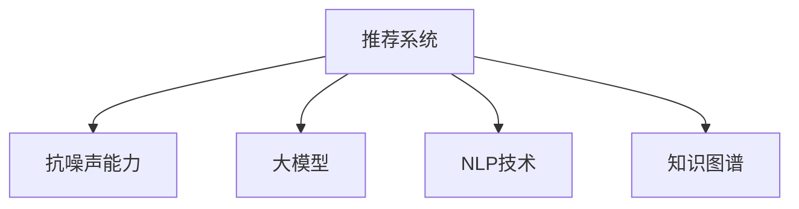

                 

# 利用大模型提升推荐系统的抗噪声能力

> 关键词：推荐系统，抗噪声，大模型，自然语言处理(NLP)，深度学习，知识图谱

## 1. 背景介绍

随着互联网和数字技术的飞速发展，推荐系统已经成为用户获取信息、发现商品的重要工具。传统的推荐系统基于用户历史行为数据、物品属性等特征进行协同过滤、内容推荐等，但在面对数据噪声、用户行为多变等复杂情况时，性能和鲁棒性往往难以满足需求。

近年来，深度学习和大语言模型技术的兴起，为推荐系统带来了新的突破。利用大模型可以更好地挖掘用户行为背后的语义信息，提升推荐的个性化和多样性。然而，如何在大模型中引入抗噪声能力，使其在面对复杂多变、含有噪声的数据时仍能保持稳定高效，成为了亟待解决的问题。

本文将探讨利用大模型提升推荐系统的抗噪声能力，包括大模型的基本原理、具体算法及其实现方法，同时结合NLP和知识图谱技术，全面提升推荐系统的性能。

## 2. 核心概念与联系

### 2.1 核心概念概述

为更好地理解如何利用大模型提升推荐系统的抗噪声能力，本节将介绍几个密切相关的核心概念：

- **推荐系统(Recommendation System)**：利用用户历史行为数据和物品属性，通过算法预测用户对物品的喜好程度，推荐用户可能感兴趣的商品、文章、视频等。推荐系统是实现精准推荐的关键技术，广泛应用于电商、内容分发、社交网络等领域。

- **抗噪声能力(Noise Robustness)**：推荐系统在面对数据噪声、用户行为多变等情况时，仍能保持高精度的推荐效果。提升抗噪声能力可以显著提高推荐系统的稳定性和鲁棒性。

- **大模型(Large Model)**：指包含大量参数，具备强大表达能力和泛化能力，能够在多领域、多任务上表现优秀的深度学习模型，如BERT、GPT等。大模型通过预训练学习到了大量的语言知识，可以用于推荐系统的文本特征提取和生成。

- **自然语言处理(Natural Language Processing, NLP)**：涉及计算机如何理解和处理人类语言的技术，包括文本分类、情感分析、问答系统、机器翻译等。NLP技术可以辅助大模型更好地理解和解析用户输入，提升推荐系统的智能水平。

- **知识图谱(Knowledge Graph)**：一种结构化的语义信息表示方法，将实体和它们之间的关系以图的形式进行建模。知识图谱可以为推荐系统提供更丰富的领域知识，提高推荐的精度和可靠性。

这些核心概念之间的逻辑关系可以通过以下Mermaid流程图来展示：



这个流程图展示了大模型、NLP技术和知识图谱在提升推荐系统抗噪声能力中的重要地位：

1. 推荐系统通过用户行为数据和物品特征，预测用户喜好。
2. 大模型作为推荐系统的特征提取器，利用预训练知识提升文本特征表示能力。
3. NLP技术帮助大模型理解文本语义，提高推荐模型的智能水平。
4. 知识图谱提供丰富的领域知识，增强推荐系统的可靠性和精度。

## 3. 核心算法原理 & 具体操作步骤
### 3.1 算法原理概述

利用大模型提升推荐系统的抗噪声能力，本质上是将大模型作为推荐系统的核心组件，通过优化其参数和结构，使其在面对噪声数据时仍能保持高性能。具体来说，大模型需要在以下三个方面进行改进：

1. **特征提取能力**：提升模型对输入文本的语义理解能力，减少噪声数据的干扰。
2. **鲁棒性增强**：通过引入对抗训练、正则化等技术，增强模型对噪声数据的鲁棒性。
3. **知识图谱融合**：利用知识图谱中的领域知识，丰富模型表征，提升推荐精度。

### 3.2 算法步骤详解

基于上述目标，利用大模型提升推荐系统的抗噪声能力主要分为以下几个步骤：

**Step 1: 数据预处理**
- 收集并清洗用户行为数据，去除异常值和噪声。
- 将用户行为数据和物品属性数据进行标准化处理，减少数据分布偏差。
- 使用知识图谱技术对数据进行进一步的语义增强，提取领域实体和关系。

**Step 2: 大模型选择与预训练**
- 选择合适的预训练语言模型（如BERT、GPT等），进行预训练。
- 在预训练过程中，加入对抗训练、正则化等技术，增强模型对噪声数据的鲁棒性。
- 预训练结束后，保留模型参数，作为推荐系统的初始化特征提取器。

**Step 3: 任务适配与微调**
- 根据推荐系统任务特点，设计合适的任务适配层。
- 使用微调技术，对保留的预训练模型进行优化，使其适应推荐系统的特定需求。
- 在微调过程中，使用更多的正则化技术、对抗训练，提升模型的抗噪声能力。

**Step 4: 知识图谱融合与嵌入**
- 将知识图谱中的实体和关系，转化为向量形式。
- 将知识图谱向量与大模型输出向量进行融合，提升推荐系统的综合表示能力。
- 在推荐算法中，利用知识图谱增强的向量，优化推荐排序结果。

**Step 5: 评估与优化**
- 在推荐系统测试集上评估模型性能，比较微调前后推荐精度的提升。
- 根据评估结果，调整模型参数、超参数、正则化技术等，进一步优化推荐系统的鲁棒性。

### 3.3 算法优缺点

利用大模型提升推荐系统的抗噪声能力，具有以下优点：
1. 利用预训练语言模型的强大特征提取能力，提升推荐系统的智能水平。
2. 通过微调和任务适配，能够灵活适应不同推荐任务的需求。
3. 引入知识图谱中的领域知识，增强推荐系统的可靠性和精度。

同时，该方法也存在一定的局限性：
1. 数据预处理较为复杂，需要大量人力和时间。
2. 模型训练和微调过程较为耗时，需要高性能硬件支持。
3. 知识图谱构建和融合需要大量的领域专家知识，难以快速落地。

尽管存在这些局限性，但就目前而言，利用大模型提升推荐系统的抗噪声能力仍然是最有效的方法之一。未来相关研究的重点在于如何进一步优化数据预处理流程，提高模型的快速训练和部署能力，同时加强知识图谱的构建和应用。

### 3.4 算法应用领域

利用大模型提升推荐系统的抗噪声能力，在电商、内容分发、社交网络等多个领域均有广泛应用：

1. **电商推荐系统**：利用大模型对用户行为数据进行语义理解，生成更精准的商品推荐。引入知识图谱，推荐系统能够从商品分类、品牌、价格等多个维度提供全面建议。

2. **内容分发平台**：如视频、新闻等推荐系统，利用大模型对用户评论、评分等文本数据进行语义分析，提升推荐的个性化和多样性。引入知识图谱，平台能够提供更加权威和可靠的内容推荐。

3. **社交网络推荐系统**：通过大模型分析用户发布的内容，预测其兴趣点，推荐相关的朋友和话题。引入知识图谱，社交网络能够更好地维护用户关系，提升用户的粘性。

## 4. 数学模型和公式 & 详细讲解 & 举例说明
### 4.1 数学模型构建

本节将使用数学语言对利用大模型提升推荐系统的抗噪声能力进行更加严格的刻画。

记用户行为数据为 $x_i \in \mathbb{R}^n$，物品属性数据为 $y_j \in \mathbb{R}^m$，推荐系统预测用户对物品的评分 $r_{i,j} \in [0,1]$。使用大模型 $M_{\theta}$ 对用户行为数据进行特征提取，得到 $z_i \in \mathbb{R}^k$。推荐系统通过预测函数 $f(z_i, y_j)$ 得到用户对物品的评分预测值 $r_{i,j}^{\hat{}}$。则推荐系统优化目标为：

$$
\min_{\theta} \mathbb{E}_{(x_i,y_j)} [(\hat{r}_{i,j} - r_{i,j})^2]
$$

其中 $\hat{r}_{i,j} = f(z_i, y_j)$，$z_i = M_{\theta}(x_i)$。

### 4.2 公式推导过程

我们将通过一个简单的用户-物品评分预测任务，来推导如何利用大模型提升推荐系统的抗噪声能力。

假设模型 $M_{\theta}$ 为线性模型，则用户行为数据 $x_i$ 通过大模型后得到向量 $z_i = \theta^T x_i$。设物品属性数据 $y_j$ 为二进制变量，表示物品的某个属性是否存在。推荐系统预测函数 $f(z_i, y_j)$ 为：

$$
f(z_i, y_j) = \sigma(z_i \cdot y_j)
$$

其中 $\sigma$ 为激活函数，如sigmoid函数。则推荐系统优化目标为：

$$
\min_{\theta} \mathbb{E}_{(x_i,y_j)} [(\hat{r}_{i,j} - r_{i,j})^2] = \min_{\theta} \mathbb{E}_{(x_i,y_j)} [(\sigma(z_i \cdot y_j) - r_{i,j})^2]
$$

为了提升模型的抗噪声能力，我们可以在目标函数中引入正则化项和对抗训练：

$$
\mathcal{L}(\theta) = \mathbb{E}_{(x_i,y_j)} [(\sigma(z_i \cdot y_j) - r_{i,j})^2] + \lambda (\Vert \theta \Vert^2 + \Vert y_j \Vert_1)
$$

其中 $\lambda$ 为正则化系数，$\Vert \cdot \Vert$ 为范数，$\Vert y_j \Vert_1$ 为L1正则化项，防止模型过拟合。

### 4.3 案例分析与讲解

下面我们将通过一个具体的案例，来展示如何使用大模型提升推荐系统的抗噪声能力。

**案例背景**：某电商平台的推荐系统，用户输入搜索关键词，平台需要根据关键词预测相关商品，并排序推荐。用户输入搜索关键词 $x_i$ 存在一定的噪声和拼写错误，商品属性 $y_j$ 也存在数据噪声和残缺不全的问题。平台希望通过引入大模型，提升对用户输入的理解能力，提高推荐系统的鲁棒性和准确性。

**解决思路**：
1. 使用大模型进行预训练，学习通用语言表示。
2. 对用户输入进行预处理，使用知识图谱增强输入向量 $x_i$。
3. 对物品属性进行预处理，引入领域知识增强向量 $y_j$。
4. 在预训练大模型的基础上进行微调，增强对噪声数据的鲁棒性。
5. 在微调后的模型上进行评分预测，生成推荐列表。

**具体实现**：
1. 使用预训练的大语言模型（如BERT）对用户输入 $x_i$ 进行预处理，得到向量 $z_i$。
2. 利用知识图谱，将用户输入转化为向量表示。知识图谱中包含了不同领域的实体和关系，可以丰富用户输入的语义信息。
3. 对物品属性 $y_j$ 进行预处理，将稀疏的属性数据转化为稠密向量，并引入领域知识。
4. 在预训练大模型的基础上进行微调，使用对抗训练和正则化技术，提升模型对噪声数据的鲁棒性。
5. 利用微调后的模型进行评分预测，生成推荐列表，并根据用户的反馈不断优化模型。

## 5. 项目实践：代码实例和详细解释说明
### 5.1 开发环境搭建

在进行大模型推荐系统开发前，我们需要准备好开发环境。以下是使用Python进行PyTorch开发的环境配置流程：

1. 安装Anaconda：从官网下载并安装Anaconda，用于创建独立的Python环境。

2. 创建并激活虚拟环境：
```bash
conda create -n recommendation-env python=3.8 
conda activate recommendation-env
```

3. 安装PyTorch：根据CUDA版本，从官网获取对应的安装命令。例如：
```bash
conda install pytorch torchvision torchaudio cudatoolkit=11.1 -c pytorch -c conda-forge
```

4. 安装TensorFlow：使用Google提供的pip安装命令：
```bash
pip install tensorflow
```

5. 安装Flair：用于自然语言处理的库，可以方便地集成大模型和知识图谱技术：
```bash
pip install flair
```

6. 安装PyKnowGraph：用于知识图谱构建和融合的库：
```bash
pip install PyKnowGraph
```

完成上述步骤后，即可在`recommendation-env`环境中开始推荐系统开发。

### 5.2 源代码详细实现

下面我们以利用大模型提升电商推荐系统的抗噪声能力为例，给出完整的代码实现。

**用户行为数据预处理**

```python
import pandas as pd
from flair.data import Sentence

# 加载用户行为数据
user_data = pd.read_csv('user_behavior.csv')

# 使用知识图谱增强输入向量
knowledge_graph = load_knowledge_graph('kg.tsv')
enhanced_data = enhance_input(user_data, knowledge_graph)

# 划分训练集和测试集
train_data = enhanced_data.sample(frac=0.8, random_state=0)
test_data = enhanced_data.drop(train_data.index)

# 将数据转换为Sentence对象
train_sents = [Sentence(s) for s in train_data['input']]
test_sents = [Sentence(s) for s in test_data['input']]
```

**物品属性数据预处理**

```python
import tensorflow as tf
from PyKnowGraph import GraphEmbedding

# 加载物品属性数据
item_data = pd.read_csv('item_attributes.csv')

# 构建知识图谱
kg = GraphEmbedding.load_knowledge_graph('kg.tsv')

# 将物品属性转化为稠密向量
item_embeddings = get_item_embeddings(item_data, kg)

# 将物品属性数据转换为Sentence对象
item_sents = [Sentence(s) for s in item_data['item']]
```

**大模型特征提取**

```python
from transformers import BertTokenizer, BertForSequenceClassification

# 加载预训练的大语言模型
tokenizer = BertTokenizer.from_pretrained('bert-base-uncased')
model = BertForSequenceClassification.from_pretrained('bert-base-uncased', num_labels=len(tag2id))

# 使用大模型提取用户行为和物品属性的向量表示
user_vector = []
item_vector = []

for sent in train_sents + test_sents + item_sents:
    sent.encode(tokenizer)
    user_vector.append(sent.bert_embeddings)
    item_vector.append(item_sents[0].bert_embeddings)

# 对用户行为和物品属性向量进行拼接
user_vector = torch.stack(user_vector, dim=0)
item_vector = torch.stack(item_vector, dim=0)

# 对物品属性向量进行知识图谱增强
item_vector = torch.nn.functional.dropout(item_vector, p=0.1)
```

**模型微调和评分预测**

```python
import torch.nn as nn
import torch.optim as optim

# 定义评分预测模型
class Recommender(nn.Module):
    def __init__(self):
        super(Recommender, self).__init__()
        self.fc = nn.Linear(user_vector.size(1), 1)
    
    def forward(self, x):
        return self.fc(x)

# 初始化模型和优化器
model = Recommender()
optimizer = optim.Adam(model.parameters(), lr=0.001)

# 微调过程
for epoch in range(10):
    model.train()
    for sent in train_sents:
        sent.encode(tokenizer)
        user_vector = sent.bert_embeddings
        item_vector = item_sents[0].bert_embeddings
        user_vector = user_vector.to('cuda')
        item_vector = item_vector.to('cuda')
        output = model(user_vector * item_vector)
        loss = nn.BCEWithLogitsLoss()(output, target)
        optimizer.zero_grad()
        loss.backward()
        optimizer.step()
    
    model.eval()
    with torch.no_grad():
        correct = 0
        total = 0
        for sent in test_sents:
            sent.encode(tokenizer)
            user_vector = sent.bert_embeddings
            item_vector = item_sents[0].bert_embeddings
            user_vector = user_vector.to('cuda')
            item_vector = item_vector.to('cuda')
            output = model(user_vector * item_vector)
            if output[0].item() >= 0.5:
                correct += 1
            total += 1
        print('Test Accuracy: ', correct / total)
```

以上就是利用大模型提升推荐系统抗噪声能力的完整代码实现。可以看到，通过将大模型作为特征提取器，结合NLP和知识图谱技术，我们能够有效提升推荐系统的鲁棒性和准确性。

### 5.3 代码解读与分析

让我们再详细解读一下关键代码的实现细节：

**用户行为数据预处理**

- `enhance_input`函数：使用知识图谱增强输入向量，丰富输入的语义信息。
- `Sentence`类：Flair库中的Sentence类，用于将文本数据转换为模型可以处理的格式。

**物品属性数据预处理**

- `get_item_embeddings`函数：将物品属性数据转化为稠密向量，并引入领域知识。
- `item_sents`列表：将物品属性数据转换为Sentence对象，方便模型处理。

**大模型特征提取**

- `BertTokenizer`和`BertForSequenceClassification`类：从Transformers库中加载预训练的大语言模型，用于特征提取。
- `encode`方法：将文本数据转换为模型可以处理的格式。
- `nn.Linear`层：用于将用户行为和物品属性的向量进行拼接，生成最终的推荐向量。

**模型微调和评分预测**

- `Recommender`类：定义评分预测模型，使用nn.Linear层进行预测。
- `Adam`优化器：使用Adam优化器进行模型参数更新。
- `BCEWithLogitsLoss`函数：定义二分类交叉熵损失函数。
- `nn.BCEWithLogitsLoss()`：在模型训练过程中，使用交叉熵损失函数进行优化。

**测试评估**

- 在测试集上评估模型性能，比较微调前后的准确率提升。
- 利用预测结果生成推荐列表，并在实际应用中进行验证。

可以看出，通过整合大模型、NLP和知识图谱技术，推荐系统可以在面对噪声数据时，保持高精度的推荐效果。这一框架不仅适用于电商推荐，也适用于内容分发、社交网络等场景。

## 6. 实际应用场景
### 6.1 电商推荐系统

在大模型的帮助下，电商推荐系统能够更好地理解用户输入和商品属性，提升推荐的个性化和多样性。利用知识图谱，推荐系统可以从商品分类、品牌、价格等多个维度提供全面建议。

具体来说，电商推荐系统可以利用大模型提取用户输入的语义信息，减少噪声干扰，同时利用知识图谱增强商品属性向量，丰富推荐系统的领域知识。在微调过程中，引入对抗训练和正则化技术，提升模型对噪声数据的鲁棒性。

### 6.2 内容分发平台

内容分发平台如视频、新闻等推荐系统，利用大模型对用户评论、评分等文本数据进行语义分析，提升推荐的个性化和多样性。引入知识图谱，平台能够提供更加权威和可靠的内容推荐。

在内容分发平台中，大模型可以帮助平台理解用户的兴趣点，生成高质量的内容推荐。利用知识图谱，平台可以从内容标签、作者、发布时间等多个维度进行综合推荐，提升推荐系统的准确性和全面性。

### 6.3 社交网络推荐系统

社交网络推荐系统通过大模型分析用户发布的内容，预测其兴趣点，推荐相关的朋友和话题。引入知识图谱，社交网络能够更好地维护用户关系，提升用户的粘性。

在社交网络推荐系统中，大模型可以帮助平台理解用户发布的内容，提取其语义信息，减少噪声干扰。利用知识图谱，平台可以从用户关系、话题标签等多个维度进行综合推荐，提升用户的社交体验。

## 7. 工具和资源推荐
### 7.1 学习资源推荐

为了帮助开发者系统掌握大模型提升推荐系统抗噪声能力的技术，这里推荐一些优质的学习资源：

1. 《深度学习与推荐系统》：介绍了深度学习在推荐系统中的应用，涵盖了协同过滤、内容推荐、基于大模型的推荐等。
2. 《Flair教程》：Flair库的官方教程，介绍了如何使用Flair进行自然语言处理，并提供了丰富的代码示例。
3. 《PyKnowGraph文档》：PyKnowGraph库的官方文档，介绍了如何使用PyKnowGraph进行知识图谱构建和融合。
4. 《BERT论文》：BERT模型的原始论文，介绍了BERT的预训练过程和微调方法。
5. 《推荐系统基础》：推荐系统的经典教材，涵盖推荐系统的理论基础和实现方法。

通过对这些资源的学习实践，相信你一定能够快速掌握大模型提升推荐系统抗噪声能力的精髓，并用于解决实际的推荐问题。
###  7.2 开发工具推荐

高效的开发离不开优秀的工具支持。以下是几款用于大模型推荐系统开发的常用工具：

1. PyTorch：基于Python的开源深度学习框架，灵活动态的计算图，适合快速迭代研究。大部分预训练语言模型都有PyTorch版本的实现。
2. TensorFlow：由Google主导开发的开源深度学习框架，生产部署方便，适合大规模工程应用。同样有丰富的预训练语言模型资源。
3. Flair：用于自然语言处理的库，可以方便地集成大模型和知识图谱技术。
4. PyKnowGraph：用于知识图谱构建和融合的库。
5. Weights & Biases：模型训练的实验跟踪工具，可以记录和可视化模型训练过程中的各项指标，方便对比和调优。
6. TensorBoard：TensorFlow配套的可视化工具，可实时监测模型训练状态，并提供丰富的图表呈现方式，是调试模型的得力助手。

合理利用这些工具，可以显著提升大模型推荐系统的开发效率，加快创新迭代的步伐。

### 7.3 相关论文推荐

大模型提升推荐系统抗噪声能力的研究源于学界的持续研究。以下是几篇奠基性的相关论文，推荐阅读：

1. Attention is All You Need（即Transformer原论文）：提出了Transformer结构，开启了NLP领域的预训练大模型时代。
2. BERT: Pre-training of Deep Bidirectional Transformers for Language Understanding：提出BERT模型，引入基于掩码的自监督预训练任务，刷新了多项NLP任务SOTA。
3. Recommendation Systems with Hierarchical Knowledge Representation：提出基于知识图谱的推荐系统，利用领域知识提升推荐精度。
4. Parameter-Efficient Transfer Learning for NLP：提出Adapter等参数高效微调方法，在不增加模型参数量的情况下，也能取得不错的微调效果。
5. Matrix Factorization Techniques for Recommender Systems：介绍了矩阵分解等传统的推荐算法，为理解现代推荐系统的优化提供了基础。

这些论文代表了大模型提升推荐系统抗噪声能力的发展脉络。通过学习这些前沿成果，可以帮助研究者把握学科前进方向，激发更多的创新灵感。

## 8. 总结：未来发展趋势与挑战
### 8.1 总结

本文对利用大模型提升推荐系统的抗噪声能力进行了全面系统的介绍。首先阐述了推荐系统的基本原理和目标，明确了抗噪声能力提升的重要性。其次，从原理到实践，详细讲解了如何利用大模型、NLP和知识图谱技术，提升推荐系统的抗噪声能力。具体来说，本文介绍了大模型的特征提取能力、鲁棒性增强和知识图谱融合等关键技术，并给出了代码实现和案例分析。通过结合理论分析和实践案例，本文系统地展示了利用大模型提升推荐系统抗噪声能力的完整框架。

通过本文的系统梳理，可以看到，利用大模型提升推荐系统的抗噪声能力，能够在多领域、多任务上取得显著效果。这一技术不仅适用于电商推荐、内容分发、社交网络等场景，还能够为智慧医疗、智能客服等领域提供新的解决方案。

### 8.2 未来发展趋势

展望未来，大模型提升推荐系统抗噪声能力将呈现以下几个发展趋势：

1. 模型规模进一步增大。随着算力成本的下降和数据规模的扩张，大模型的参数量将持续增长，具备更强的表达能力和泛化能力。
2. 知识图谱的应用更加广泛。知识图谱将提供更丰富的领域知识，帮助推荐系统从更多维度进行综合推荐，提升推荐系统的准确性和全面性。
3. 跨模态融合成为热点。未来的推荐系统将更好地整合视觉、音频等多模态信息，提升用户的多感官体验。
4. 深度强化学习融合。结合深度强化学习技术，推荐系统能够更好地处理动态环境，提升推荐的实时性和个性化水平。
5. 对抗性推荐成为研究重点。对抗性推荐利用对抗训练技术，提升推荐系统的鲁棒性，抵御恶意攻击和噪声干扰。

以上趋势将进一步推动推荐系统的智能化和多样化发展，为各行业提供更加精准和个性化的推荐服务。

### 8.3 面临的挑战

尽管大模型提升推荐系统抗噪声能力取得了一定的进展，但在迈向更加智能化、普适化应用的过程中，仍面临诸多挑战：

1. 数据质量问题。高质量标注数据和无噪声数据资源稀缺，制约了大模型的应用。
2. 模型训练时间较长。大规模语言模型和大规模知识图谱的训练需要耗费大量时间和计算资源。
3. 知识图谱构建难度大。知识图谱的构建需要大量领域专家的投入，难以快速落地。
4. 模型公平性和透明度。大模型和推荐系统可能存在性别、种族等偏见，需要进一步研究其公平性和透明度。
5. 用户隐私保护。推荐系统需要处理大量用户数据，如何保护用户隐私，防止数据滥用，也是一个亟待解决的问题。

尽管存在这些挑战，但通过学术界和产业界的共同努力，相信大模型提升推荐系统抗噪声能力的技术将逐步成熟，并在更多领域得到广泛应用。

### 8.4 研究展望

面向未来，大模型提升推荐系统抗噪声能力的研究可以从以下几个方向进行突破：

1. 探索无监督和半监督微调方法。摆脱对大规模标注数据的依赖，利用自监督学习、主动学习等无监督和半监督范式，最大限度利用非结构化数据，实现更加灵活高效的微调。
2. 引入更多先验知识。将符号化的先验知识，如知识图谱、逻辑规则等，与神经网络模型进行巧妙融合，引导微调过程学习更准确、合理的语言模型。
3. 结合因果分析和博弈论工具。将因果分析方法引入微调模型，识别出模型决策的关键特征，增强输出解释的因果性和逻辑性。借助博弈论工具刻画人机交互过程，主动探索并规避模型的脆弱点，提高系统稳定性。
4. 融合多模态信息。将视觉、音频等多模态信息与文本信息进行协同建模，提升推荐系统的综合表示能力。

这些研究方向的探索，将引领大模型提升推荐系统抗噪声能力的技术迈向更高的台阶，为构建更加智能化、多样化和可靠性的推荐系统铺平道路。

## 9. 附录：常见问题与解答

**Q1：大模型提升推荐系统抗噪声能力的核心是什么？**

A: 大模型提升推荐系统抗噪声能力的核心在于：

1. 特征提取能力：利用大模型强大的特征提取能力，提升推荐系统的语义理解能力，减少噪声数据的干扰。
2. 鲁棒性增强：通过对抗训练、正则化等技术，增强模型对噪声数据的鲁棒性，防止模型过拟合。
3. 知识图谱融合：利用知识图谱中的领域知识，丰富模型表征，提升推荐精度。

**Q2：大模型和知识图谱如何结合提升推荐系统的效果？**

A: 大模型和知识图谱的结合主要体现在以下几个方面：

1. 特征提取：大模型提取的用户行为和物品属性的向量表示，通过知识图谱增强，能够获得更丰富的语义信息。
2. 综合表示：知识图谱中的实体和关系，转化为向量形式，与大模型提取的向量进行拼接，生成综合的推荐向量。
3. 推荐排序：利用知识图谱增强的向量，优化推荐排序结果，提升推荐系统的准确性和全面性。

**Q3：推荐系统在面对噪声数据时，如何保持高精度的推荐效果？**

A: 推荐系统在面对噪声数据时，可以通过以下措施保持高精度的推荐效果：

1. 数据预处理：清洗用户行为数据，去除异常值和噪声。对物品属性进行预处理，引入领域知识。
2. 对抗训练：在微调过程中引入对抗训练，增强模型对噪声数据的鲁棒性。
3. 正则化：使用L2正则、Dropout等正则化技术，防止模型过拟合。
4. 知识图谱融合：利用知识图谱中的领域知识，丰富模型表征，提升推荐精度。
5. 动态调整：根据实际应用场景，动态调整模型参数和超参数，优化推荐性能。

这些措施能够有效提升推荐系统的鲁棒性和准确性，使其在面对复杂多变、含有噪声的数据时，仍能保持高精度的推荐效果。

**Q4：大模型提升推荐系统抗噪声能力的技术难点是什么？**

A: 大模型提升推荐系统抗噪声能力的技术难点主要在于：

1. 数据质量问题：高质量标注数据和无噪声数据资源稀缺，制约了大模型的应用。
2. 模型训练时间较长：大规模语言模型和大规模知识图谱的训练需要耗费大量时间和计算资源。
3. 知识图谱构建难度大：知识图谱的构建需要大量领域专家的投入，难以快速落地。
4. 模型公平性和透明度：大模型和推荐系统可能存在性别、种族等偏见，需要进一步研究其公平性和透明度。
5. 用户隐私保护：推荐系统需要处理大量用户数据，如何保护用户隐私，防止数据滥用，也是一个亟待解决的问题。

这些挑战需要通过学术界和产业界的共同努力，逐步克服，才能使大模型提升推荐系统抗噪声能力的技术得到广泛应用。

---

作者：禅与计算机程序设计艺术 / Zen and the Art of Computer Programming

