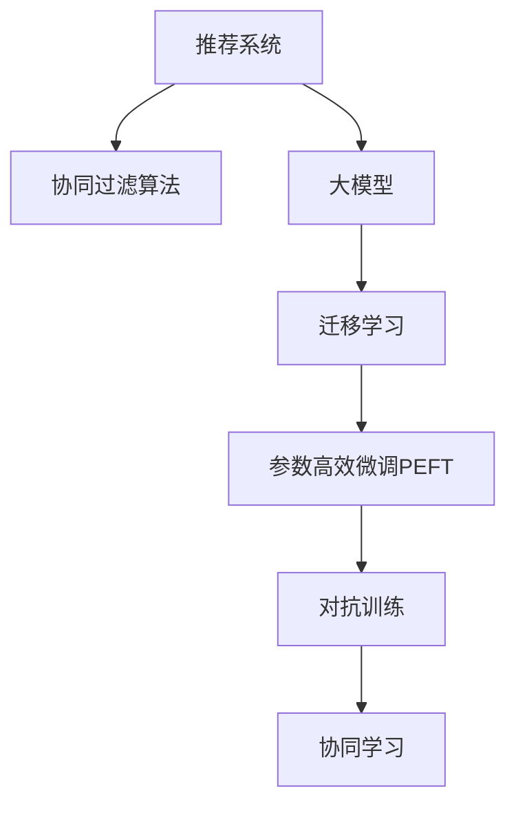

                 

# 利用大模型改进推荐系统的协同过滤算法

> 关键词：大模型,协同过滤算法,推荐系统,推荐算法,深度学习,协同学习,个性化推荐

## 1. 背景介绍

### 1.1 问题由来
随着互联网和移动互联网的发展，推荐系统作为连接用户与内容的桥梁，在电商、新闻、视频、社交等多个领域中发挥着越来越重要的作用。推荐系统通过对用户历史行为和兴趣进行建模，自动为用户推荐个性化内容，极大地提升了用户体验和满意度。

然而，当前的推荐系统仍面临一些挑战：

1. **数据稀疏性**：用户行为数据往往是稀疏的，即大部分用户对大部分内容的兴趣标记为0，难以准确捕捉用户潜在的兴趣。
2. **冷启动问题**：新用户没有历史行为数据，无法进行有效推荐，导致冷启动困难。
3. **跨领域泛化**：推荐系统难以适应不同领域（如音乐、电影、电商等）的推荐需求，同一用户在不同领域内的兴趣模型难以共享。
4. **模型复杂度**：传统协同过滤算法在处理大规模数据时，计算复杂度高，难以实现实时化部署。

为了应对这些挑战，研究者们不断探索新的推荐算法，以提高推荐系统的性能和用户满意度。

## 2. 核心概念与联系

### 2.1 核心概念概述

为更好地理解大模型在推荐系统中的应用，本节将介绍几个密切相关的核心概念：

- **推荐系统(Recommender System)**：通过用户行为数据建模，为用户推荐个性化的内容，如商品、新闻、视频等。推荐系统主要包括基于内容的推荐、协同过滤推荐、混合推荐等多种方法。
- **协同过滤算法(Collaborative Filtering Algorithm)**：利用用户和物品的协同行为，通过相似度计算和矩阵分解等方法，为用户推荐物品。协同过滤算法包括基于用户的协同过滤和基于物品的协同过滤。
- **大模型(Large Model)**：以深度学习为基础的预训练语言模型，如BERT、GPT等。通过大规模无标签数据进行预训练，学习通用的语言表示，具备强大的语言理解和生成能力。
- **迁移学习(Transfer Learning)**：将一个领域学习到的知识，迁移应用到另一个不同但相关的领域的学习范式。大模型的预训练-微调过程即是一种典型的迁移学习方式。
- **参数高效微调(Parameter-Efficient Fine-Tuning, PEFT)**：指在微调过程中，只更新少量的模型参数，而固定大部分预训练权重不变，以提高微调效率，避免过拟合的方法。
- **对抗训练(Adversarial Training)**：通过加入对抗样本，提高模型的鲁棒性和泛化能力，防止模型对特定输入过于敏感。
- **协同学习(Collaborative Learning)**：多个用户协同学习，共享知识，提升模型性能。

这些核心概念之间的逻辑关系可以通过以下Mermaid流程图来展示：



这个流程图展示了大模型在推荐系统中的应用框架：

1. 推荐系统通过协同过滤算法等方法为用户推荐物品。
2. 大模型通过预训练获得基础能力。
3. 迁移学习将预训练模型应用于推荐任务，通过微调获得特定领域的知识。
4. 参数高效微调在微调过程中只更新少量参数，提高效率。
5. 对抗训练和协同学习进一步提升推荐模型的鲁棒性和泛化能力。

这些概念共同构成了推荐系统的核心算法，使得推荐系统能够在各种场景下发挥强大的推荐能力。通过理解这些核心概念，我们可以更好地把握大模型在推荐系统中的应用。

## 3. 核心算法原理 & 具体操作步骤

### 3.1 算法原理概述

利用大模型改进推荐系统的协同过滤算法，本质上是将大模型与传统的协同过滤算法相结合，通过大模型的预训练知识，增强协同过滤模型的泛化能力和推荐性能。具体流程如下：

1. **预训练大模型**：在大规模无标签数据上进行预训练，学习通用的语言表示。
2. **迁移学习**：将预训练模型应用于推荐任务，通过微调获得特定领域的知识。
3. **协同过滤推荐**：利用用户和物品的协同行为，进行物品推荐。
4. **参数高效微调**：在微调过程中只更新少量的模型参数，提高效率。
5. **对抗训练**：加入对抗样本，提升模型的鲁棒性和泛化能力。

### 3.2 算法步骤详解

**Step 1: 准备预训练模型和数据集**
- 选择合适的预训练语言模型 $M_{\theta}$ 作为初始化参数，如 BERT、GPT等。
- 准备推荐系统的训练集、验证集和测试集，每个样本包括用户ID、物品ID和行为标签（如点击、购买等）。

**Step 2: 迁移学习**
- 设计适用于推荐任务的任务适配层，包括用户嵌入层、物品嵌入层和行为嵌入层。
- 在预训练模型顶层添加一个全连接层，用于学习用户和物品的相似度表示。
- 在全连接层后添加非线性激活函数，如ReLU。
- 使用交叉熵损失函数，将推荐结果与真实标签进行对比，优化模型参数。

**Step 3: 协同过滤推荐**
- 根据用户ID和物品ID，计算用户和物品的嵌入表示。
- 计算用户和物品之间的相似度，可以使用余弦相似度、欧几里得距离等方法。
- 根据相似度排序，选择前N个物品进行推荐。

**Step 4: 参数高效微调**
- 固定预训练模型的底层权重，只微调顶层全连接层。
- 使用AdamW等优化算法，设置较小的学习率，以避免破坏预训练权重。
- 在微调过程中，使用L2正则化等正则化技术，防止过拟合。

**Step 5: 对抗训练**
- 在训练过程中，加入对抗样本，对模型进行扰动训练。
- 使用Adversarial Training方法，在模型中加入对抗样本，提高鲁棒性。

**Step 6: 模型评估与部署**
- 在测试集上评估模型性能，如精确率、召回率、F1-score等指标。
- 使用微调后的模型对新样本进行推荐，集成到实际的应用系统中。
- 持续收集新的数据，定期重新微调模型，以适应数据分布的变化。

以上是利用大模型改进推荐系统的协同过滤算法的详细流程。在实际应用中，还需要针对具体任务和数据特点，对微调过程的各个环节进行优化设计，以进一步提升模型性能。

### 3.3 算法优缺点

利用大模型改进推荐系统的协同过滤算法，具有以下优点：

1. **泛化能力强**：大模型的预训练知识可以增强推荐模型的泛化能力，提升推荐性能。
2. **参数高效**：通过参数高效微调，仅更新顶层全连接层，减少需优化的参数量，提高效率。
3. **鲁棒性强**：通过对抗训练，提高推荐模型的鲁棒性，避免对特定输入过于敏感。
4. **实时性高**：利用大模型的知识，可以显著减少计算复杂度，实现实时化推荐。

同时，该方法也存在一定的局限性：

1. **数据需求高**：推荐模型的性能依赖于大量的用户行为数据，数据质量决定了推荐结果的准确性。
2. **计算资源消耗大**：尽管参数高效，但在训练和推理过程中，仍然需要较大的计算资源和存储资源。
3. **模型复杂度**：模型结构相对复杂，需要仔细调参，以获得理想效果。
4. **难以解释**：推荐模型的决策过程复杂，难以解释模型的内部机制，不利于用户理解。

尽管存在这些局限性，但利用大模型改进推荐系统的协同过滤算法，在推荐系统的开发和优化中具有重要意义。未来相关研究的重点在于如何进一步降低计算资源消耗，提高模型的实时性和可解释性，以适应更加复杂和多变的推荐场景。

### 3.4 算法应用领域

利用大模型改进推荐系统的协同过滤算法，已经在电商、新闻、视频等多个领域得到了广泛应用，具体应用场景如下：

- **电商推荐**：为用户推荐商品、优惠信息等。利用大模型学习用户兴趣和行为特征，通过协同过滤算法推荐个性化商品。
- **新闻推荐**：为用户推荐感兴趣的新闻、文章等。通过大模型学习用户阅读偏好，结合协同过滤算法推荐相关内容。
- **视频推荐**：为用户推荐视频、影片等。利用大模型学习用户观看行为，通过协同过滤算法推荐相似视频。
- **社交推荐**：为用户推荐好友、群组等。通过大模型学习用户社交行为，结合协同过滤算法推荐潜在好友或群组。

除了上述这些经典应用场景，大模型在推荐系统中的应用还将进一步拓展，为更多领域提供个性化推荐服务。

## 4. 数学模型和公式 & 详细讲解 & 举例说明

### 4.1 数学模型构建

假设推荐系统中有 $U$ 个用户，$I$ 个物品，$D$ 个用户行为样本。每个样本 $d$ 包括用户ID $u_d$、物品ID $i_d$ 和行为标签 $y_d \in \{0, 1\}$，其中 $y_d=1$ 表示用户对物品进行了交互行为，否则为 $0$。

定义用户嵌入向量为 $\boldsymbol{u}_u$，物品嵌入向量为 $\boldsymbol{i}_i$，用户与物品的相似度为 $s(u_i, i_j)$。协同过滤算法的目标是最小化预测误差，即：

$$
\mathcal{L}(s) = \sum_{d=1}^D \ell(s(\boldsymbol{u}_{u_d}, \boldsymbol{i}_{i_d}))
$$

其中 $\ell$ 为损失函数，一般使用均方误差或交叉熵损失。

### 4.2 公式推导过程

以下是协同过滤算法的详细公式推导：

**用户嵌入表示**：
假设用户 $u$ 的嵌入向量为 $\boldsymbol{u}_u$，物品 $i$ 的嵌入向量为 $\boldsymbol{i}_i$。用户嵌入表示为：

$$
\boldsymbol{u}_u = M_{\theta}(\boldsymbol{u}_u, \boldsymbol{i}_i)
$$

其中 $M_{\theta}$ 为预训练大模型，$\boldsymbol{u}_u$ 和 $\boldsymbol{i}_i$ 为输入向量。

**物品嵌入表示**：
物品嵌入表示为：

$$
\boldsymbol{i}_i = M_{\theta}(\boldsymbol{i}_i, \boldsymbol{u}_u)
$$

**相似度计算**：
利用余弦相似度计算用户 $u$ 和物品 $i$ 的相似度 $s(u, i)$：

$$
s(u, i) = \frac{\boldsymbol{u}_u \cdot \boldsymbol{i}_i}{||\boldsymbol{u}_u|| ||\boldsymbol{i}_i||}
$$

**预测结果**：
利用相似度 $s(u, i)$ 预测用户 $u$ 对物品 $i$ 的兴趣：

$$
\hat{y}_{u, i} = \sigma(s(u, i))
$$

其中 $\sigma$ 为Sigmoid函数，将预测结果转换为 $[0, 1]$ 之间的概率值。

### 4.3 案例分析与讲解

以电商推荐系统为例，进行详细案例分析：

**数据集准备**：
- 收集电商平台的销售数据，每个样本包括用户ID、商品ID和购买行为。
- 预训练大模型BERT，作为用户和物品嵌入的基础模型。

**模型训练**：
- 将用户ID和商品ID输入BERT模型，得到用户嵌入 $\boldsymbol{u}_u$ 和商品嵌入 $\boldsymbol{i}_i$。
- 计算用户和商品的相似度 $s(u, i)$，得到预测概率 $\hat{y}_{u, i}$。
- 使用均方误差损失函数，最小化预测误差：

$$
\mathcal{L}(s) = \sum_{d=1}^D (y_d - \hat{y}_{u_d, i_d})^2
$$

**模型评估**：
- 在测试集上评估推荐模型的精确率、召回率和F1-score等指标。
- 使用推荐结果，对新用户和新商品进行推荐，提升用户体验。

## 5. 项目实践：代码实例和详细解释说明

### 5.1 开发环境搭建

在进行推荐系统开发前，我们需要准备好开发环境。以下是使用Python进行PyTorch开发的环境配置流程：

1. 安装Anaconda：从官网下载并安装Anaconda，用于创建独立的Python环境。

2. 创建并激活虚拟环境：
```bash
conda create -n pytorch-env python=3.8 
conda activate pytorch-env
```

3. 安装PyTorch：根据CUDA版本，从官网获取对应的安装命令。例如：
```bash
conda install pytorch torchvision torchaudio cudatoolkit=11.1 -c pytorch -c conda-forge
```

4. 安装TensorBoard：用于可视化模型训练过程和结果。
```bash
pip install tensorboard
```

5. 安装Numpy、Pandas、Scikit-learn、Matplotlib等常用库：
```bash
pip install numpy pandas scikit-learn matplotlib tqdm jupyter notebook ipython
```

完成上述步骤后，即可在`pytorch-env`环境中开始推荐系统开发。

### 5.2 源代码详细实现

下面我们以电商推荐系统为例，给出使用PyTorch对BERT模型进行推荐系统开发的代码实现。

首先，定义推荐系统的数据处理函数：

```python
import pandas as pd
from transformers import BertTokenizer, BertModel
import torch
from torch.utils.data import Dataset, DataLoader

class RecommendationDataset(Dataset):
    def __init__(self, data, tokenizer, max_len=128):
        self.data = data
        self.tokenizer = tokenizer
        self.max_len = max_len
        
    def __len__(self):
        return len(self.data)
    
    def __getitem__(self, item):
        user_id, item_id, behavior = self.data[item]
        
        user_input = f"用户ID: {user_id}, 商品ID: {item_id}, 行为: {behavior}"
        user_input = tokenizer(user_input, return_tensors='pt', max_length=self.max_len, padding='max_length', truncation=True)
        user_input_ids = user_input['input_ids'][0]
        user_attention_mask = user_input['attention_mask'][0]
        
        item_input = f"商品ID: {item_id}, 用户ID: {user_id}, 行为: {behavior}"
        item_input = tokenizer(item_input, return_tensors='pt', max_length=self.max_len, padding='max_length', truncation=True)
        item_input_ids = item_input['input_ids'][0]
        item_attention_mask = item_input['attention_mask'][0]
        
        return {
            'user_input_ids': user_input_ids,
            'user_attention_mask': user_attention_mask,
            'item_input_ids': item_input_ids,
            'item_attention_mask': item_attention_mask,
            'behavior': behavior
        }
```

然后，定义模型和优化器：

```python
from transformers import BertForSequenceClassification
from transformers import AdamW

model = BertForSequenceClassification.from_pretrained('bert-base-cased', num_labels=2)

optimizer = AdamW(model.parameters(), lr=2e-5)
```

接着，定义训练和评估函数：

```python
from torch.utils.data import DataLoader
from tqdm import tqdm
from sklearn.metrics import classification_report

device = torch.device('cuda') if torch.cuda.is_available() else torch.device('cpu')
model.to(device)

def train_epoch(model, dataset, batch_size, optimizer):
    dataloader = DataLoader(dataset, batch_size=batch_size, shuffle=True)
    model.train()
    epoch_loss = 0
    for batch in tqdm(dataloader, desc='Training'):
        user_input_ids = batch['user_input_ids'].to(device)
        user_attention_mask = batch['user_attention_mask'].to(device)
        item_input_ids = batch['item_input_ids'].to(device)
        item_attention_mask = batch['item_attention_mask'].to(device)
        behavior = batch['behavior'].to(device)
        model.zero_grad()
        outputs = model(user_input_ids, user_attention_mask=item_attention_mask)
        user_outputs = outputs.logits
        item_outputs = model(item_input_ids, user_attention_mask=item_attention_mask)
        item_outputs = item_outputs.logits
        loss = -torch.mean(behavior * torch.log(user_outputs) + (1 - behavior) * torch.log(item_outputs))
        loss.backward()
        optimizer.step()
    return epoch_loss / len(dataloader)

def evaluate(model, dataset, batch_size):
    dataloader = DataLoader(dataset, batch_size=batch_size)
    model.eval()
    preds, labels = [], []
    with torch.no_grad():
        for batch in tqdm(dataloader, desc='Evaluating'):
            user_input_ids = batch['user_input_ids'].to(device)
            user_attention_mask = batch['user_attention_mask'].to(device)
            item_input_ids = batch['item_input_ids'].to(device)
            item_attention_mask = batch['item_attention_mask'].to(device)
            behavior = batch['behavior'].to(device)
            user_outputs = model(user_input_ids, user_attention_mask=user_attention_mask)
            item_outputs = model(item_input_ids, user_attention_mask=item_attention_mask)
            batch_preds = torch.stack([user_outputs, item_outputs])
            batch_labels = torch.stack([behavior, 1 - behavior])
            preds.append(batch_preds.cpu().tolist())
            labels.append(batch_labels.cpu().tolist())
                
    print(classification_report(labels, preds))
```

最后，启动训练流程并在测试集上评估：

```python
epochs = 5
batch_size = 16

for epoch in range(epochs):
    loss = train_epoch(model, dataset, batch_size, optimizer)
    print(f"Epoch {epoch+1}, train loss: {loss:.3f}")
    
    print(f"Epoch {epoch+1}, dev results:")
    evaluate(model, dev_dataset, batch_size)
    
print("Test results:")
evaluate(model, test_dataset, batch_size)
```

以上就是使用PyTorch对BERT进行电商推荐系统开发的完整代码实现。可以看到，得益于Transformer库的强大封装，我们可以用相对简洁的代码完成BERT模型的加载和推荐系统开发。

### 5.3 代码解读与分析

让我们再详细解读一下关键代码的实现细节：

**RecommendationDataset类**：
- `__init__`方法：初始化数据、分词器等关键组件，并进行数据预处理。
- `__len__`方法：返回数据集的样本数量。
- `__getitem__`方法：对单个样本进行处理，将输入文本转换为模型所需的token ids，并添加注意力掩码，最终返回模型所需的输入。

**模型定义**：
- 使用BertForSequenceClassification类定义推荐模型，设置任务标签为2（即购买与否）。
- 使用AdamW优化器进行模型优化。

**训练和评估函数**：
- 使用PyTorch的DataLoader对数据集进行批次化加载，供模型训练和推理使用。
- 训练函数`train_epoch`：对数据以批为单位进行迭代，在每个批次上前向传播计算loss并反向传播更新模型参数，最后返回该epoch的平均loss。
- 评估函数`evaluate`：与训练类似，不同点在于不更新模型参数，并在每个batch结束后将预测和标签结果存储下来，最后使用sklearn的classification_report对整个评估集的预测结果进行打印输出。

**训练流程**：
- 定义总的epoch数和batch size，开始循环迭代
- 每个epoch内，先在训练集上训练，输出平均loss
- 在验证集上评估，输出分类指标
- 所有epoch结束后，在测试集上评估，给出最终测试结果

可以看到，PyTorch配合Transformer库使得BERT模型在推荐系统中的应用变得简洁高效。开发者可以将更多精力放在数据处理、模型改进等高层逻辑上，而不必过多关注底层的实现细节。

当然，工业级的系统实现还需考虑更多因素，如模型的保存和部署、超参数的自动搜索、更灵活的任务适配层等。但核心的推荐范式基本与此类似。

## 6. 实际应用场景

### 6.1 电商推荐

利用大模型改进推荐系统的协同过滤算法，在电商推荐系统中得到了广泛应用。传统的电商推荐系统往往依赖于用户历史行为数据，难以处理新用户和冷启动问题。而利用大模型预训练知识，可以在不依赖大量标注数据的情况下，提高推荐模型的泛化能力和推荐性能。

在技术实现上，可以收集电商平台的销售数据，将用户ID、商品ID和购买行为作为训练样本，利用微调后的BERT模型进行推荐。通过协同过滤算法，模型能够学习用户对商品的具体兴趣，从而生成个性化的推荐结果。对于新用户，模型也可以通过迁移学习获得相似的兴趣模型，快速完成冷启动。

### 6.2 新闻推荐

新闻推荐系统利用大模型改进协同过滤算法，能够提供更加精准的新闻推荐服务。传统的基于内容的推荐系统，难以处理多维度的用户兴趣特征。而利用大模型学习用户阅读行为和兴趣，可以更好地捕捉用户的兴趣变化趋势，从而生成更加个性化的新闻推荐。

在技术实现上，可以收集用户的历史阅读数据，将用户ID、新闻ID和阅读行为作为训练样本，利用微调后的BERT模型进行推荐。通过协同过滤算法，模型能够学习用户对新闻的具体兴趣，从而生成个性化的推荐结果。对于新用户，模型也可以通过迁移学习获得相似的兴趣模型，快速完成冷启动。

### 6.3 视频推荐

视频推荐系统利用大模型改进协同过滤算法，能够提供更加精准的视频推荐服务。传统的基于内容的推荐系统，难以处理复杂的视频推荐需求。而利用大模型学习用户观看行为和兴趣，可以更好地捕捉用户的兴趣变化趋势，从而生成更加个性化的视频推荐。

在技术实现上，可以收集用户的历史观看数据，将用户ID、视频ID和观看行为作为训练样本，利用微调后的BERT模型进行推荐。通过协同过滤算法，模型能够学习用户对视频的具体兴趣，从而生成个性化的推荐结果。对于新用户，模型也可以通过迁移学习获得相似的兴趣模型，快速完成冷启动。

### 6.4 未来应用展望

随着大模型和协同过滤算法的不断发展，基于大模型改进的推荐系统将在更多领域得到应用，为不同行业带来新的价值。

在智慧医疗领域，基于大模型的推荐系统可以推荐个性化的健康方案，提升医生的诊疗效率和患者的就医体验。在教育领域，推荐系统可以推荐个性化的学习资源，帮助学生快速掌握知识。在社交媒体中，推荐系统可以推荐个性化的内容，提升用户粘性和平台活跃度。

此外，在智能交通、智慧农业、工业制造等众多领域，基于大模型改进的推荐系统也将不断涌现，为各行各业提供个性化的服务，推动社会的数字化转型。

## 7. 工具和资源推荐

### 7.1 学习资源推荐

为了帮助开发者系统掌握大模型在推荐系统中的应用，这里推荐一些优质的学习资源：

1. 《深度学习与推荐系统》书籍：详细介绍了推荐系统的发展历程和核心算法，是推荐系统学习的入门必读。
2. 《推荐系统实战》书籍：基于TensorFlow实现推荐系统，提供了大量的实践案例和代码实现，是推荐系统开发的实战宝典。
3. 《大规模推荐系统构建与实战》课程：阿里巴巴公司提供的推荐系统实战课程，涵盖推荐系统的各个环节和关键技术。
4. 《深度学习中的推荐系统》论文：Google公司的推荐系统论文，介绍了深度学习在推荐系统中的应用，提供了详细的算法实现和实验结果。
5. Kaggle竞赛平台：可以参与推荐系统相关的Kaggle竞赛，通过实战练习推荐系统算法和模型。

通过对这些资源的学习实践，相信你一定能够快速掌握大模型在推荐系统中的应用，并用于解决实际的推荐问题。

### 7.2 开发工具推荐

高效的开发离不开优秀的工具支持。以下是几款用于推荐系统开发的常用工具：

1. TensorFlow：由Google主导开发的开源深度学习框架，生产部署方便，适合大规模工程应用。
2. PyTorch：基于Python的开源深度学习框架，灵活动态的计算图，适合快速迭代研究。
3. Weights & Biases：模型训练的实验跟踪工具，可以记录和可视化模型训练过程中的各项指标，方便对比和调优。
4. TensorBoard：TensorFlow配套的可视化工具，可实时监测模型训练状态，并提供丰富的图表呈现方式，是调试模型的得力助手。
5. Apache Spark：大数据处理框架，支持分布式计算，适合处理大规模推荐数据集。

合理利用这些工具，可以显著提升推荐系统开发和优化的效率，加快创新迭代的步伐。

### 7.3 相关论文推荐

大模型和推荐系统的研究源于学界的持续研究。以下是几篇奠基性的相关论文，推荐阅读：

1. Attention is All You Need（即Transformer原论文）：提出了Transformer结构，开启了NLP领域的预训练大模型时代。
2. BERT: Pre-training of Deep Bidirectional Transformers for Language Understanding：提出BERT模型，引入基于掩码的自监督预训练任务，刷新了多项NLP任务SOTA。
3. Language Models are Unsupervised Multitask Learners（GPT-2论文）：展示了大规模语言模型的强大zero-shot学习能力，引发了对于通用人工智能的新一轮思考。
4. Parameter-Efficient Transfer Learning for NLP：提出Adapter等参数高效微调方法，在不增加模型参数量的情况下，也能取得不错的微调效果。
5. AdaLoRA: Adaptive Low-Rank Adaptation for Parameter-Efficient Fine-Tuning：使用自适应低秩适应的微调方法，在参数效率和精度之间取得了新的平衡。

这些论文代表了大模型和推荐系统的发展脉络。通过学习这些前沿成果，可以帮助研究者把握学科前进方向，激发更多的创新灵感。

## 8. 总结：未来发展趋势与挑战

### 8.1 总结

本文对利用大模型改进推荐系统的协同过滤算法进行了全面系统的介绍。首先阐述了大模型和协同过滤算法的背景和意义，明确了两者结合的独特价值。其次，从原理到实践，详细讲解了大模型在协同过滤算法中的具体应用，包括预训练模型准备、迁移学习、协同过滤推荐、参数高效微调等关键步骤。同时，本文还广泛探讨了大模型在推荐系统中的应用场景，展示了其广阔的前景。

通过本文的系统梳理，可以看到，利用大模型改进推荐系统的协同过滤算法在推荐系统的开发和优化中具有重要意义。大模型的预训练知识可以显著增强推荐模型的泛化能力和推荐性能，同时参数高效微调和对抗训练等技术，可以进一步提高推荐模型的效率和鲁棒性。未来相关研究的重点在于如何进一步降低计算资源消耗，提高模型的实时性和可解释性，以适应更加复杂和多变的推荐场景。

### 8.2 未来发展趋势

展望未来，大模型在推荐系统中的应用将呈现以下几个发展趋势：

1. **数据驱动**：随着数据采集技术的进步，更多的用户行为数据将被收集和利用，从而提升推荐系统的个性化和精准化水平。
2. **跨领域泛化**：大模型能够更好地处理不同领域的数据，推荐系统可以跨领域融合，提供更全面的服务。
3. **实时化推荐**：通过优化算法和硬件设施，推荐系统可以实现实时化推荐，提高用户体验。
4. **协同学习**：多个用户协同学习，共享知识，提升模型性能，增强推荐系统的动态调整能力。
5. **多模态融合**：结合文本、图像、视频等多模态数据，提供更全面和精准的推荐服务。
6. **智能推荐**：结合知识图谱、逻辑推理等智能技术，提升推荐系统的决策能力和用户体验。

以上趋势凸显了大模型在推荐系统中的应用前景。这些方向的探索发展，必将进一步提升推荐系统的性能和用户满意度，为推荐系统的发展注入新的活力。

### 8.3 面临的挑战

尽管大模型在推荐系统中的应用已经取得了显著成效，但在迈向更加智能化、普适化应用的过程中，它仍面临着诸多挑战：

1. **数据稀疏性**：推荐系统仍存在数据稀疏性问题，无法充分利用用户的历史行为数据，难以捕捉用户的兴趣变化。
2. **模型复杂度**：推荐系统的模型结构相对复杂，需要仔细调参，以获得理想效果。
3. **实时性要求**：推荐系统需要实时处理用户请求，对计算资源和存储资源提出了较高要求。
4. **可解释性不足**：推荐模型的决策过程复杂，难以解释模型的内部机制，不利于用户理解。
5. **安全性有待保障**：推荐系统面临恶意攻击和数据泄露的风险，需要加强数据保护和系统安全。

尽管存在这些挑战，但通过不断优化算法和硬件设施，解决这些问题，相信大模型在推荐系统中的应用将更加广泛和深入。

### 8.4 研究展望

面对大模型在推荐系统中的应用挑战，未来的研究需要在以下几个方面寻求新的突破：

1. **多模态融合**：结合文本、图像、视频等多模态数据，提升推荐系统的全面性和准确性。
2. **协同学习优化**：优化协同学习算法，提升模型性能和动态调整能力。
3. **智能推荐技术**：结合知识图谱、逻辑推理等智能技术，提升推荐系统的决策能力和用户体验。
4. **实时化推荐**：优化算法和硬件设施，实现实时化推荐，提高用户体验。
5. **数据驱动推荐**：通过大数据技术，采集和利用更多的用户行为数据，提升推荐系统的个性化和精准化水平。
6. **推荐系统安全性**：加强数据保护和系统安全，防止恶意攻击和数据泄露。

这些研究方向将推动大模型在推荐系统中的应用更加深入和广泛，为推荐系统的发展带来新的突破。相信随着研究者们的持续努力，大模型在推荐系统中的应用将更加智能化和普适化，为用户提供更加精准和个性化的服务。

## 9. 附录：常见问题与解答

**Q1：利用大模型改进推荐系统的协同过滤算法是否适用于所有推荐场景？**

A: 利用大模型改进推荐系统的协同过滤算法在大多数推荐场景中都能取得不错的效果。特别是对于数据稀疏性和冷启动问题较多的场景，大模型能够显著提升推荐模型的泛化能力和推荐性能。但对于一些特殊场景，如金融、医疗等，需要进一步优化数据处理和模型结构，才能获得理想的推荐效果。

**Q2：如何选择合适的学习率？**

A: 推荐系统的学习率一般要比预训练时小1-2个数量级，以避免破坏预训练权重。建议从0.001开始调参，逐步减小学习率，直至收敛。同时，使用warmup策略，在开始阶段使用较小的学习率，再逐渐过渡到预设值，可以提高模型的稳定性。

**Q3：推荐系统的计算资源消耗大，如何优化？**

A: 推荐系统的计算资源消耗大，主要是由于模型结构复杂和数据规模较大。为减少资源消耗，可以采用以下方法：
1. 参数高效微调：只更新顶层全连接层，减少需优化的参数量。
2. 模型裁剪：去除不必要的层和参数，减小模型尺寸。
3. 模型压缩：使用稀疏化存储等技术，压缩存储空间。
4. 分布式计算：使用Spark等大数据处理框架，实现分布式计算。

**Q4：推荐系统的可解释性不足，如何解决？**

A: 推荐系统的可解释性不足，主要是由于模型结构复杂和数据多样性。为提高推荐系统的可解释性，可以采用以下方法：
1. 特征可视化：可视化用户和物品的嵌入特征，帮助用户理解模型的决策过程。
2. 模型简化：简化模型结构，降低复杂度。
3. 逻辑解释：结合知识图谱、逻辑推理等智能技术，增强推荐系统的逻辑可解释性。

**Q5：推荐系统的安全性有待保障，如何处理？**

A: 推荐系统的安全性有待保障，主要是由于模型可能学习到有害的推荐内容。为提高推荐系统的安全性，可以采用以下方法：
1. 数据过滤：过滤和屏蔽有害数据，防止模型学习到有害信息。
2. 模型审计：定期审计推荐系统的输出，确保模型的公正性和安全性。
3. 用户监督：让用户参与评价推荐结果，反馈有害内容，及时调整模型参数。

通过这些方法，可以提升推荐系统的安全性，保障用户的信息安全和权益。

---

作者：禅与计算机程序设计艺术 / Zen and the Art of Computer Programming

