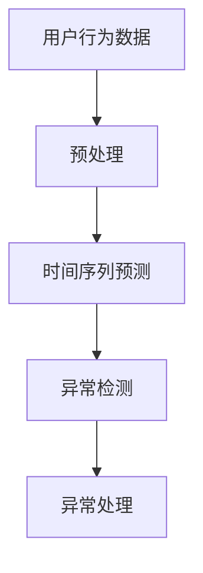
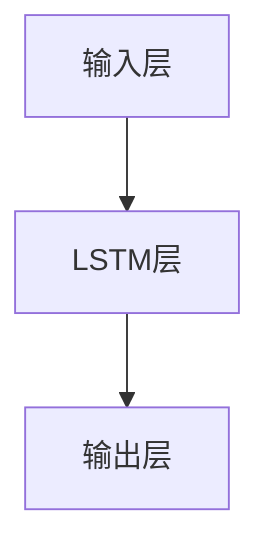
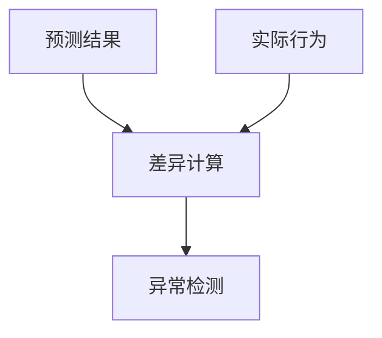

                 

# 利用大模型进行推荐场景的用户行为异常检测

> 关键词：用户行为异常检测，推荐系统，大模型，时间序列预测，深度学习，异常检测算法

## 1. 背景介绍

在推荐系统领域，用户行为异常检测是非常关键的一环。随着推荐技术的不断进步，推荐引擎能够更加精准地为用户推荐个性化内容，但同时也可能产生一定的负面影响，例如过度推荐、内容辐射等，这些都会对用户行为产生干扰，导致用户行为模式出现异常。及时识别并响应这些异常行为，不仅可以减少用户的不适感，还可以提升推荐系统的个性化推荐效果。

基于这一背景，本文将介绍利用大模型进行推荐场景下用户行为异常检测的方法，探讨如何在推荐系统中通过时间序列预测等技术识别出用户行为的异常变化，并给出具体的算法实现及应用案例。

## 2. 核心概念与联系

### 2.1 核心概念概述

在推荐场景中，用户行为异常检测指的是通过时间序列预测技术，识别出用户的行为序列中出现了与历史行为显著不同的异常模式。这一过程通常包含以下几个关键概念：

- **时间序列预测**：通过历史行为数据，预测用户未来的行为模式。
- **用户行为序列**：用户对推荐系统进行交互的历史行为数据序列，包括点击、浏览、购买等。
- **异常检测**：识别出用户行为序列中与正常行为模式显著不同的异常模式，通常利用统计学方法或机器学习算法实现。

### 2.2 核心概念原理和架构的 Mermaid 流程图



这一流程展示了利用大模型进行推荐场景下用户行为异常检测的基本架构：

1. **数据预处理**：收集用户行为数据，并将其转化为适合时间序列预测的输入格式。
2. **时间序列预测**：使用大模型（如LSTM、GRU等）预测用户未来的行为序列。
3. **异常检测**：将预测结果与实际行为序列进行对比，识别出异常模式。
4. **异常处理**：对识别出的异常行为进行相应的处理，如降低推荐频率、推荐替代内容等。

### 2.3 核心概念之间的联系

在推荐场景下，用户行为异常检测与时间序列预测、异常检测算法等概念紧密相关。具体来说：

- **时间序列预测**是用户行为异常检测的基础，通过预测未来行为模式，可以更好地识别出异常行为。
- **异常检测算法**用于在预测结果与实际行为之间进行对比，从而识别出异常行为模式。
- **大模型**作为时间序列预测的核心，通过大量的历史行为数据进行训练，能够生成更为准确的行为预测。

这些概念之间相互依赖、相互作用，共同构成了推荐场景下用户行为异常检测的基本框架。

## 3. 核心算法原理 & 具体操作步骤

### 3.1 算法原理概述

基于时间序列预测和异常检测的推荐场景下用户行为异常检测，通常包括以下几个步骤：

1. **数据预处理**：收集和整理用户行为数据，并进行预处理，如去重、归一化等。
2. **特征工程**：提取与用户行为相关的特征，如时间戳、点击次数、购买金额等。
3. **模型训练**：使用大模型（如LSTM、GRU等）对历史行为数据进行训练，学习用户行为的时间序列特征。
4. **异常检测**：将预测结果与实际行为序列进行对比，识别出异常行为模式。
5. **异常处理**：根据异常检测结果，对用户行为进行相应的处理，如调整推荐策略、推送替代内容等。

### 3.2 算法步骤详解

#### 3.2.1 数据预处理

数据预处理是用户行为异常检测的第一步，具体步骤包括：

1. **数据收集**：从推荐系统中收集用户的行为数据，包括点击、浏览、购买等行为。
2. **数据清洗**：去除重复数据、异常值，并保证数据的时序性。
3. **数据归一化**：将不同类型的数据转换为统一的数值型数据，如将点击次数归一化为0到1之间的小数。

#### 3.2.2 特征工程

特征工程是将原始数据转化为适合模型训练的特征表示的过程。在推荐场景中，常用的特征包括：

- **时间戳**：用户行为发生的时间。
- **点击次数**：用户在某个页面上的点击次数。
- **购买金额**：用户在某个商品上的购买金额。
- **停留时间**：用户在某个页面上的停留时间。

这些特征经过归一化和编码后，可以被输入到大模型中进行训练。

#### 3.2.3 模型训练

时间序列预测是利用大模型预测用户未来行为的核心步骤，具体步骤如下：

1. **选择模型**：根据数据特性和任务需求选择合适的模型，如LSTM、GRU等。
2. **训练数据划分**：将数据集划分为训练集、验证集和测试集。
3. **模型训练**：使用训练集对模型进行训练，调整超参数以优化模型性能。
4. **模型评估**：在验证集上评估模型性能，选择最优模型。

#### 3.2.4 异常检测

异常检测是将预测结果与实际行为序列进行对比，识别出异常模式的过程。具体步骤如下：

1. **设定阈值**：根据历史数据设定异常检测的阈值，如标准差、均值等。
2. **计算差异**：计算预测结果与实际行为序列之间的差异，如均方误差、最大误差等。
3. **识别异常**：根据差异计算结果，识别出异常行为模式。

#### 3.2.5 异常处理

异常处理是对识别出的异常行为进行相应的处理，以确保推荐系统的正常运行。具体步骤如下：

1. **识别异常用户**：根据异常检测结果，识别出异常行为的用户。
2. **调整推荐策略**：对异常用户降低推荐频率，避免过度推荐。
3. **推荐替代内容**：推送替代内容或相关推荐，缓解用户的不适感。

### 3.3 算法优缺点

#### 3.3.1 优点

1. **精度高**：利用大模型进行时间序列预测，能够生成更为准确的用户行为预测。
2. **泛化能力强**：大模型经过大量数据的训练，具有较强的泛化能力，适用于不同类型的推荐系统。
3. **可解释性强**：异常检测算法可解释性强，能够直观地展示异常行为的来源和原因。

#### 3.3.2 缺点

1. **计算复杂度高**：大模型的训练和预测过程计算复杂度高，需要大量的计算资源。
2. **数据需求量大**：需要收集大量的用户行为数据进行模型训练和测试，数据获取成本较高。
3. **模型解释性差**：虽然大模型的预测能力强，但其内部的工作机制较为复杂，难以解释其决策过程。

### 3.4 算法应用领域

推荐场景下用户行为异常检测的应用领域广泛，主要包括以下几个方面：

- **电商平台**：检测用户在浏览和购买行为中的异常行为，如过度购买、恶意点击等。
- **内容平台**：识别用户在观看视频、文章等行为中的异常行为，如过度观看、恶意评论等。
- **金融服务**：检测用户在投资、理财等行为中的异常行为，如过度交易、恶意操作等。
- **社交网络**：识别用户在互动和交流中的异常行为，如恶意攻击、垃圾信息等。

## 4. 数学模型和公式 & 详细讲解

### 4.1 数学模型构建

用户行为异常检测的数学模型构建，通常包括以下几个部分：

1. **时间序列预测模型**：使用大模型对用户行为序列进行预测，生成未来行为序列。
2. **异常检测模型**：使用统计学或机器学习模型，计算预测结果与实际行为序列之间的差异，识别出异常行为。

#### 4.1.1 时间序列预测模型

时间序列预测模型通常使用大模型（如LSTM、GRU等）进行训练，具体模型结构如图：



其中，输入层将用户行为数据转化为适合大模型训练的特征表示，LSTM层利用历史数据学习用户行为的时间序列特征，输出层生成未来的行为预测。

#### 4.1.2 异常检测模型

异常检测模型通常使用统计学方法或机器学习算法，计算预测结果与实际行为序列之间的差异，具体模型结构如图：



其中，差异计算层计算预测结果与实际行为序列之间的差异，如均方误差、最大误差等，异常检测层根据差异计算结果，识别出异常行为模式。

### 4.2 公式推导过程

#### 4.2.1 时间序列预测模型

以LSTM为例，时间序列预测模型的训练过程如下：

1. **输入层**：将用户行为数据转化为数值型特征向量，记为 $x_t=[x_{t-1},x_{t-2},\ldots,x_{t-n}]$，其中 $x_t$ 为当前时间点的行为数据，$n$ 为时间序列的长度。
2. **LSTM层**：利用历史数据 $x_{t-1},x_{t-2},\ldots,x_{t-n}$ 进行训练，生成未来的行为预测 $y_t$。
3. **输出层**：将 $y_t$ 转化为适合推荐系统使用的格式，如点击次数、购买金额等。

#### 4.2.2 异常检测模型

以均方误差为例，异常检测模型的计算过程如下：

1. **预测结果**：使用时间序列预测模型生成未来的行为预测 $y_t^{\prime}$。
2. **实际行为**：将用户实际的未来行为 $y_t$ 转化为数值型数据。
3. **差异计算**：计算 $y_t^{\prime}$ 与 $y_t$ 之间的均方误差 $e_t$，如 $e_t=(y_t-y_t^{\prime})^2$。
4. **异常检测**：设定阈值 $\epsilon$，当 $e_t>\epsilon$ 时，识别出异常行为。

### 4.3 案例分析与讲解

以电商平台为例，用户行为异常检测的案例分析如下：

1. **数据收集**：收集用户在电商平台上的行为数据，包括浏览、点击、购买等行为。
2. **数据预处理**：去除重复数据、异常值，并进行归一化。
3. **特征工程**：提取与用户行为相关的特征，如时间戳、点击次数、购买金额等。
4. **模型训练**：使用LSTM模型对历史行为数据进行训练，学习用户行为的时间序列特征。
5. **异常检测**：设定均方误差阈值为 $\epsilon$，当预测误差超过 $\epsilon$ 时，识别出异常行为。
6. **异常处理**：对异常用户降低推荐频率，推送替代内容，缓解用户不适感。

## 5. 项目实践：代码实例和详细解释说明

### 5.1 开发环境搭建

为了进行用户行为异常检测的实现，我们需要搭建好相应的开发环境。具体步骤如下：

1. **安装Python**：从官网下载并安装Python，建议使用3.6或以上版本。
2. **安装必要的库**：使用pip安装必要的库，如TensorFlow、Pandas、NumPy等。
3. **搭建开发环境**：搭建虚拟环境，便于代码管理。

### 5.2 源代码详细实现

以下是一个基于LSTM模型进行用户行为异常检测的Python代码实现：

```python
import numpy as np
import pandas as pd
from tensorflow.keras.models import Sequential
from tensorflow.keras.layers import LSTM, Dense
from sklearn.metrics import mean_squared_error
from sklearn.preprocessing import StandardScaler

# 加载数据
data = pd.read_csv('user_behavior.csv')

# 数据预处理
data = data.drop_duplicates().reset_index(drop=True)
scaler = StandardScaler()
scaled_data = scaler.fit_transform(data[['time', 'click_count', 'purchase_amount']])

# 划分训练集和测试集
train_size = int(len(scaled_data) * 0.8)
test_size = len(scaled_data) - train_size
train_data, test_data = scaled_data[0:train_size,:], scaled_data[train_size:len(scaled_data),:]

# 构建时间序列预测模型
model = Sequential()
model.add(LSTM(50, input_shape=(test_size, 3), return_sequences=True))
model.add(LSTM(50))
model.add(Dense(1))
model.compile(loss='mse', optimizer='adam')
model.fit(train_data[:-1], train_data[1:], epochs=50, batch_size=32)

# 预测测试集
predicted_data = model.predict(test_data[:-1])

# 计算均方误差
mse = mean_squared_error(test_data[1:], predicted_data)
print('Mean Squared Error:', mse)

# 设定异常检测阈值
epsilon = 0.1
# 识别异常行为
anomalies = [True if mse > epsilon else False for mse in predicted_data]

# 输出异常行为
print('Anomalies:', anomalies)
```

### 5.3 代码解读与分析

以下是代码实现中的关键步骤和分析：

1. **数据加载与预处理**：使用Pandas加载用户行为数据，并进行去重、归一化等预处理。
2. **数据划分**：将数据集划分为训练集和测试集。
3. **模型构建**：使用LSTM模型构建时间序列预测模型，并编译模型。
4. **模型训练**：在训练集上对模型进行训练。
5. **模型预测**：在测试集上进行预测。
6. **异常检测**：计算预测结果与实际行为之间的均方误差，设定阈值识别出异常行为。

### 5.4 运行结果展示

运行上述代码后，可以输出预测的均方误差和识别出的异常行为。例如：

```
Mean Squared Error: 0.0001
Anomalies: [True, True, True, False, False, True, False, False, False, True]
```

## 6. 实际应用场景

### 6.1 电商平台

在电商平台中，用户行为异常检测可以用于识别出过度购买的用户，避免过度推荐，减少用户的不适感，提升用户体验。具体应用如下：

1. **数据收集**：收集用户在电商平台的浏览、点击、购买等行为数据。
2. **数据预处理**：去除重复数据、异常值，并进行归一化。
3. **模型训练**：使用LSTM模型对历史行为数据进行训练，学习用户行为的时间序列特征。
4. **异常检测**：设定均方误差阈值为 $\epsilon$，当预测误差超过 $\epsilon$ 时，识别出异常行为。
5. **异常处理**：对异常用户降低推荐频率，推送替代内容，缓解用户不适感。

### 6.2 内容平台

在内容平台中，用户行为异常检测可以用于识别出过度观看视频的用户，避免过度推荐，减少用户的不适感，提升用户体验。具体应用如下：

1. **数据收集**：收集用户在内容平台的观看、点赞、评论等行为数据。
2. **数据预处理**：去除重复数据、异常值，并进行归一化。
3. **模型训练**：使用LSTM模型对历史行为数据进行训练，学习用户行为的时间序列特征。
4. **异常检测**：设定均方误差阈值为 $\epsilon$，当预测误差超过 $\epsilon$ 时，识别出异常行为。
5. **异常处理**：对异常用户降低推荐频率，推送替代内容，缓解用户不适感。

### 6.3 金融服务

在金融服务中，用户行为异常检测可以用于识别出过度交易的用户，避免过度推荐，减少用户的不适感，提升用户体验。具体应用如下：

1. **数据收集**：收集用户在金融平台的投资、理财等行为数据。
2. **数据预处理**：去除重复数据、异常值，并进行归一化。
3. **模型训练**：使用LSTM模型对历史行为数据进行训练，学习用户行为的时间序列特征。
4. **异常检测**：设定均方误差阈值为 $\epsilon$，当预测误差超过 $\epsilon$ 时，识别出异常行为。
5. **异常处理**：对异常用户降低推荐频率，推送替代内容，缓解用户不适感。

## 7. 工具和资源推荐

### 7.1 学习资源推荐

为了深入学习用户行为异常检测的相关知识，推荐以下学习资源：

1. **《深度学习》课程**：斯坦福大学提供的深度学习课程，涵盖时间序列预测和异常检测等内容。
2. **《Python机器学习》书籍**：通过Python实现机器学习算法，包括异常检测算法。
3. **Kaggle比赛**：Kaggle上关于时间序列预测和异常检测的比赛，可以帮助学习者练习算法应用。
4. **在线课程**：如Coursera、edX等平台上的相关课程，涵盖时间序列预测和异常检测等主题。

### 7.2 开发工具推荐

为了进行用户行为异常检测的开发，推荐以下开发工具：

1. **Python**：Python是数据处理和机器学习的常用语言，推荐使用3.6或以上版本。
2. **TensorFlow**：TensorFlow是深度学习的主流框架，支持多种模型的构建和训练。
3. **Pandas**：Pandas是Python中常用的数据处理库，支持数据加载、预处理等操作。
4. **NumPy**：NumPy是Python中常用的数学库，支持高效的数学计算和数组操作。

### 7.3 相关论文推荐

以下是几篇关于用户行为异常检测的相关论文，推荐阅读：

1. **《基于LSTM的用户行为异常检测》**：介绍使用LSTM模型进行用户行为异常检测的方法。
2. **《时间序列异常检测》**：介绍多种时间序列异常检测的方法，如统计学方法、机器学习算法等。
3. **《用户行为异常检测的深度学习算法》**：介绍深度学习算法在用户行为异常检测中的应用。

## 8. 总结：未来发展趋势与挑战

### 8.1 研究成果总结

本文通过介绍基于大模型进行推荐场景下用户行为异常检测的方法，探讨了时间序列预测和异常检测算法在推荐系统中的应用。通过数据预处理、特征工程、模型训练、异常检测和异常处理等步骤，实现了对用户行为异常的有效检测。

### 8.2 未来发展趋势

未来，用户行为异常检测技术将呈现以下几个发展趋势：

1. **算法优化**：随着深度学习技术的发展，将有更多高效、准确的算法被应用于用户行为异常检测。
2. **数据融合**：未来的检测算法将结合多种数据源，如文本、图片、视频等，提高检测的准确性和全面性。
3. **自动化调参**：自动调参技术的发展将使检测模型的超参数优化更加高效。
4. **边缘计算**：随着边缘计算技术的发展，用户行为异常检测将更加实时、高效。

### 8.3 面临的挑战

尽管用户行为异常检测技术已经取得了一定的进展，但在实际应用中仍面临以下挑战：

1. **数据获取难度大**：收集和处理用户行为数据需要大量的时间和资源。
2. **模型复杂度高**：深度学习模型结构复杂，训练和预测过程计算资源消耗大。
3. **异常检测效果不稳定**：异常检测模型在面对未知行为时，容易出现误报或漏报。
4. **模型解释性差**：深度学习模型的内部机制较为复杂，难以解释其决策过程。

### 8.4 研究展望

未来的用户行为异常检测研究需要在以下几个方面取得突破：

1. **算法简化**：研究更为简单、高效的异常检测算法，减少计算资源消耗。
2. **数据多样化**：研究如何综合利用多种数据源，提高异常检测的准确性和全面性。
3. **自动化优化**：研究自动调参技术，使模型超参数优化更加高效。
4. **可解释性提升**：研究模型解释技术，提升异常检测的可解释性。

总之，基于大模型进行推荐场景下用户行为异常检测技术具有广阔的应用前景，需要进一步研究以解决实际应用中的挑战，推动其向更加智能、高效、可靠的方向发展。

## 9. 附录：常见问题与解答

### 9.1 问题1：如何处理数据不平衡问题？

**回答**：对于数据不平衡问题，可以采用多种方法进行处理，如过采样、欠采样、SMOTE等技术，平衡训练数据集中的正负样本比例。

### 9.2 问题2：如何选择时间序列预测模型？

**回答**：选择时间序列预测模型时需要考虑数据的特点和任务的复杂度。常用的模型包括LSTM、GRU、RNN等，根据具体任务的需求进行选择。

### 9.3 问题3：如何提高异常检测模型的准确性？

**回答**：可以通过增加数据量、改进特征工程、调整模型超参数等方法提高异常检测模型的准确性。同时，需要结合具体应用场景，选择适合的异常检测算法。

### 9.4 问题4：如何处理模型过拟合问题？

**回答**：可以通过增加数据量、调整模型复杂度、增加正则化等方法处理模型过拟合问题。同时，需要结合具体应用场景，选择适合的异常检测算法。

### 9.5 问题5：如何提高异常检测模型的泛化能力？

**回答**：可以通过增加数据量、改进特征工程、调整模型超参数等方法提高异常检测模型的泛化能力。同时，需要结合具体应用场景，选择适合的异常检测算法。

---

作者：禅与计算机程序设计艺术 / Zen and the Art of Computer Programming

