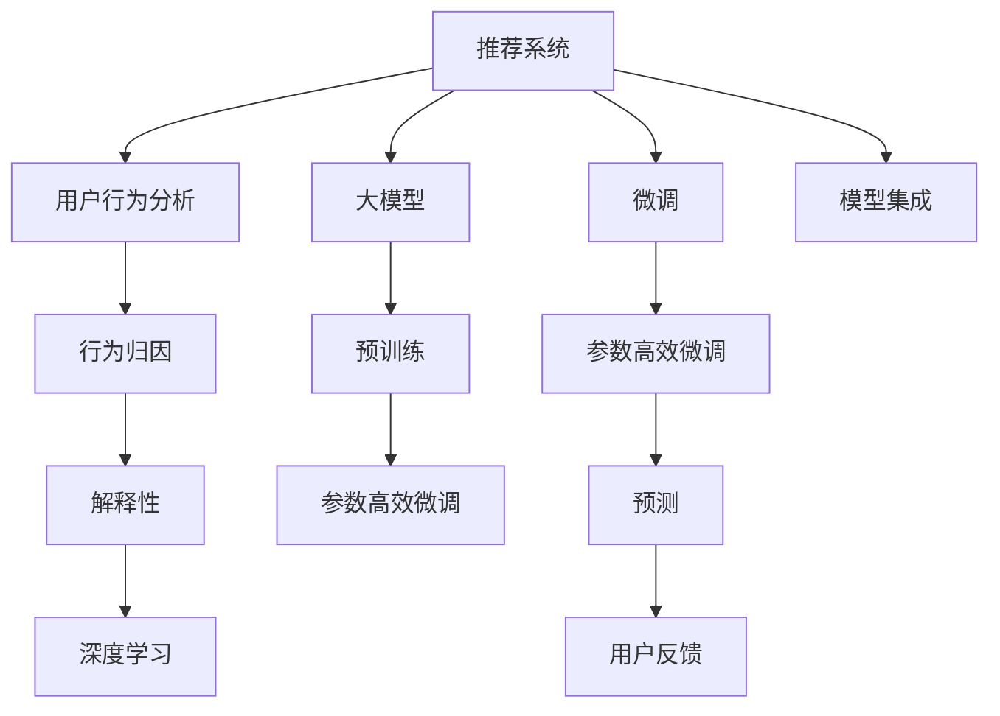

                 

# 利用大模型进行推荐场景的用户行为归因与解释

> 关键词：推荐系统,用户行为分析,行为归因,解释性,深度学习,大模型

## 1. 背景介绍

在数字化时代，推荐系统已经成为各大平台的核心竞争力之一，广泛应用于电商、视频、音乐等各个领域。传统的推荐系统多基于协同过滤、内容推荐等方法，在个性化推荐上取得了不错的成绩。然而，随着用户需求的不断增长和数据量的快速膨胀，传统的推荐方法逐渐显现出其局限性。特别是在个性化推荐、用户行为理解等方面，亟需新的技术和算法来进一步提升推荐效果。

### 1.1 推荐系统的核心目标

推荐系统的核心目标是帮助用户发现符合其兴趣和需求的新物品，从而提升用户满意度，增加平台粘性。传统的推荐系统多采用基于模型的协同过滤、内容推荐等方法，通过分析用户历史行为和物品特征，计算相似度并进行推荐。这些方法虽然在推荐效果上取得了一些成绩，但随着数据量的增加，用户多样性的提升，推荐效果和解释性都面临了新的挑战。

### 1.2 当前推荐系统的局限性

当前的推荐系统主要存在以下几方面的局限性：

1. **数据依赖性强**：传统的推荐系统往往依赖于大量标注数据来训练模型，在数据不足或特征缺失的情况下，推荐效果往往大打折扣。

2. **解释性不足**：推荐系统的推荐结果通常是一个黑盒模型，难以解释其内部的推理过程，用户无法理解为什么会被推荐某物品。

3. **泛化能力差**：基于模型的推荐系统在面对新用户和新物品时，往往无法很好地泛化，导致推荐效果不稳定。

4. **交互性不足**：传统的推荐系统多依赖静态的特征和历史行为，难以捕捉到用户的实时行为和需求变化。

## 2. 核心概念与联系

### 2.1 核心概念概述

为了更好地理解利用大模型进行推荐场景的用户行为归因与解释，本节将介绍几个密切相关的核心概念：

- **推荐系统**：利用算法为用户推荐物品的系统，通过分析用户历史行为、物品特征等数据，计算相似度并进行推荐。
- **用户行为分析**：通过对用户行为数据的分析，了解用户的兴趣和需求，从而进行更加个性化的推荐。
- **行为归因**：将用户的实际行为归因于多个因素，如兴趣、需求、上下文等，从而进行更加精准的推荐。
- **解释性**：推荐系统的推荐结果能够被用户理解和信任，从而提升用户满意度。
- **深度学习**：一种基于神经网络的机器学习技术，具有强大的数据建模能力和泛化能力，广泛用于推荐系统等应用。
- **大模型**：如BERT、GPT等大规模预训练语言模型，通过在海量文本数据上进行预训练，学习到丰富的语言知识和表示能力。

这些核心概念之间的逻辑关系可以通过以下Mermaid流程图来展示：



这个流程图展示了大模型在推荐系统中的应用流程：

1. 推荐系统首先分析用户行为，了解用户兴趣和需求。
2. 根据用户行为进行行为归因，分析用户行为背后的多因素。
3. 利用深度学习和大模型，进行推荐模型的预训练和微调。
4. 利用预训练和微调后的模型进行推荐预测。
5. 接收用户反馈，进一步优化模型。

## 3. 核心算法原理 & 具体操作步骤
### 3.1 算法原理概述

利用大模型进行推荐场景的用户行为归因与解释，本质上是一种基于深度学习的推荐算法。其核心思想是：通过分析用户历史行为数据，建立用户行为与推荐物品之间的关联，利用大模型的强大语言理解能力，将用户行为进行归因和解释，从而提升推荐效果。

具体来说，大模型在推荐系统中扮演以下几个角色：

- **用户行为分析**：通过大模型，对用户历史行为数据进行编码和表示，提取用户兴趣和需求。
- **行为归因**：利用大模型，对用户行为进行多维度归因，分析行为背后的兴趣、需求、上下文等因素。
- **推荐预测**：通过大模型，对用户行为进行解释和推理，生成推荐预测。
- **推荐解释**：利用大模型，对推荐结果进行解释和理解，提升用户的信任度和满意度。

### 3.2 算法步骤详解

基于大模型的推荐算法通常包括以下几个关键步骤：

**Step 1: 收集和预处理用户行为数据**

- 从推荐系统中收集用户行为数据，包括点击、浏览、购买等。
- 对行为数据进行清洗和预处理，如去除噪声、处理缺失值、进行特征工程等。

**Step 2: 构建用户行为表示**

- 利用大模型，对用户历史行为数据进行编码和表示，提取用户兴趣和需求。
- 可以使用Transformer模型等大模型，对用户行为进行序列建模，提取特征表示。

**Step 3: 行为归因分析**

- 利用大模型，对用户行为进行多维度归因，分析行为背后的兴趣、需求、上下文等因素。
- 可以使用多层次、多角度的特征分析方法，如因果分析、关联规则挖掘等。

**Step 4: 预训练和微调推荐模型**

- 利用预训练大模型，进行推荐模型的预训练。
- 根据用户行为和归因结果，对模型进行微调，提升推荐效果。

**Step 5: 生成推荐预测**

- 利用微调后的推荐模型，对用户行为进行解释和推理，生成推荐预测。
- 可以使用集成方法，结合多模态数据进行推荐预测。

**Step 6: 生成推荐解释**

- 利用大模型，对推荐结果进行解释和理解，提升用户的信任度和满意度。
- 可以使用自然语言生成等技术，将推荐结果转化为易于理解的文本。

**Step 7: 持续优化**

- 收集用户反馈，进一步优化推荐模型和解释方法。
- 定期更新用户行为数据和模型参数，保持模型的新鲜度。

以上是基于大模型的推荐算法的一般流程。在实际应用中，还需要根据具体任务的特点，对各个环节进行优化设计，如改进行为表示方法、引入多层次归因分析等。

### 3.3 算法优缺点

利用大模型进行推荐系统，具有以下优点：

1. **数据利用率高**：大模型能够高效利用用户的广泛行为数据，提取高维特征，提升推荐效果。
2. **模型泛化能力强**：大模型具有强大的泛化能力，能够适应多种数据分布，提升推荐模型的鲁棒性。
3. **解释性强**：利用大模型，能够对推荐结果进行解释和理解，提升用户信任度。
4. **可扩展性好**：大模型可以轻松扩展到多模态数据，提升推荐系统的多样性和智能化。

同时，该方法也存在一些缺点：

1. **计算资源消耗大**：大模型通常需要大量的计算资源进行预训练和微调，对硬件设备要求较高。
2. **可解释性不足**：大模型的内部结构复杂，难以解释其决策过程，用户难以理解推荐结果的依据。
3. **数据依赖性强**：大模型的性能很大程度上取决于数据的质量和量级，数据不足或标注质量不高时，推荐效果难以保证。
4. **模型复杂度高**：大模型的参数量庞大，难以进行实时推理，需要优化模型结构和计算图。

尽管存在这些局限性，但就目前而言，利用大模型进行推荐系统的方法依然是大规模应用的主流范式。未来相关研究的重点在于如何进一步降低计算资源消耗，提高模型的可解释性和可扩展性，同时兼顾数据质量和泛化能力等因素。

### 3.4 算法应用领域

利用大模型的推荐系统已经在电商、视频、音乐等多个领域得到了广泛应用，取得了显著的推荐效果和用户满意度。以下是几个典型的应用场景：

1. **电商平台推荐**：通过分析用户浏览、点击、购买等行为数据，利用大模型进行用户行为编码和表示，提升推荐效果。
2. **视频平台推荐**：对用户观看历史、点赞、评论等行为数据进行归因分析，利用大模型进行推荐预测和解释，提升推荐质量和用户体验。
3. **音乐平台推荐**：利用大模型对用户听歌历史、评论、分享等行为数据进行编码和表示，提升推荐效果和多样性。
4. **社交网络推荐**：对用户发布内容、点赞、评论等行为数据进行归因分析，利用大模型进行推荐预测和解释，提升推荐效果和用户信任度。

除了这些经典应用外，大模型在个性化推荐、用户行为分析、推荐系统优化等方面也有着广泛的应用前景，为推荐系统的发展注入了新的活力。

## 4. 数学模型和公式 & 详细讲解 & 举例说明

### 4.1 数学模型构建

假设推荐系统的用户集合为 $U$，物品集合为 $I$，用户行为数据为 $\mathcal{D}=\{(u_i,i_j,r_{u_i,i_j})\}_{i=1}^N$，其中 $u_i$ 表示用户，$i_j$ 表示物品，$r_{u_i,i_j}$ 表示用户 $u_i$ 对物品 $i_j$ 的评分。

设用户行为表示为 $\vec{e}_u \in \mathbb{R}^{d_u}$，物品特征表示为 $\vec{e}_i \in \mathbb{R}^{d_i}$。

利用大模型，对用户行为进行编码和表示，得到用户行为表示 $\vec{e}_u \in \mathbb{R}^{d_u}$。利用大模型，对物品特征进行编码和表示，得到物品特征表示 $\vec{e}_i \in \mathbb{R}^{d_i}$。

### 4.2 公式推导过程

用户行为归因分析的核心目标是找到用户行为与推荐物品之间的关联，分析行为背后的兴趣、需求、上下文等因素。假设用户行为 $u_i$ 与物品 $i_j$ 的关联度为 $a_{u_i,i_j}$，则用户行为表示 $\vec{e}_u$ 与物品特征表示 $\vec{e}_i$ 的关联度为：

$$
\vec{a}_{u_i,i_j} = \sigma(\vec{e}_u^T \vec{e}_i)
$$

其中 $\sigma$ 为激活函数，如ReLU、Sigmoid等。

利用用户行为与物品关联度，进行行为归因分析，得到归因结果 $\vec{r}_{u_i,i_j}$，表示用户行为 $u_i$ 对物品 $i_j$ 的兴趣、需求、上下文等因素。

$$
\vec{r}_{u_i,i_j} = f(\vec{a}_{u_i,i_j})
$$

其中 $f$ 为归因函数，如线性变换、加权平均等。

利用归因结果 $\vec{r}_{u_i,i_j}$，进行推荐预测，得到用户对物品 $i_j$ 的评分 $r'_{u_i,i_j}$。

$$
r'_{u_i,i_j} = \phi(\vec{e}_i^T \vec{r}_{u_i,i_j})
$$

其中 $\phi$ 为评分函数，如线性函数、Sigmoid函数等。

利用推荐预测 $r'_{u_i,i_j}$，进行推荐解释，生成解释文本 $m'_{u_i,i_j}$。

$$
m'_{u_i,i_j} = g(r'_{u_i,i_j})
$$

其中 $g$ 为自然语言生成函数，如Seq2Seq模型、Transformer模型等。

在实际应用中，可能需要对上述模型进行优化和调整，如引入多层次归因分析、改进评分函数等，以提升推荐效果和解释性。

### 4.3 案例分析与讲解

以电商平台推荐为例，分析利用大模型进行推荐系统用户行为归因和解释的过程：

**Step 1: 数据收集**

从电商平台收集用户行为数据，包括浏览历史、点击历史、购买历史等。

**Step 2: 数据预处理**

对行为数据进行清洗和预处理，去除噪声、处理缺失值、进行特征工程等。

**Step 3: 用户行为编码**

利用大模型（如BERT、GPT等），对用户行为进行编码和表示，得到用户行为表示 $\vec{e}_u$。

**Step 4: 物品特征编码**

利用大模型，对物品特征进行编码和表示，得到物品特征表示 $\vec{e}_i$。

**Step 5: 行为归因分析**

利用用户行为与物品关联度，进行行为归因分析，得到归因结果 $\vec{r}_{u_i,i_j}$。

**Step 6: 推荐预测**

利用归因结果，进行推荐预测，得到用户对物品 $i_j$ 的评分 $r'_{u_i,i_j}$。

**Step 7: 推荐解释**

利用大模型，对推荐结果进行解释和理解，生成解释文本 $m'_{u_i,i_j}$。

**Step 8: 持续优化**

收集用户反馈，进一步优化推荐模型和解释方法。

## 5. 项目实践：代码实例和详细解释说明

### 5.1 开发环境搭建

在进行推荐系统实践前，我们需要准备好开发环境。以下是使用Python进行PyTorch开发的环境配置流程：

1. 安装Anaconda：从官网下载并安装Anaconda，用于创建独立的Python环境。

2. 创建并激活虚拟环境：
```bash
conda create -n pytorch-env python=3.8 
conda activate pytorch-env
```

3. 安装PyTorch：根据CUDA版本，从官网获取对应的安装命令。例如：
```bash
conda install pytorch torchvision torchaudio cudatoolkit=11.1 -c pytorch -c conda-forge
```

4. 安装Transformers库：
```bash
pip install transformers
```

5. 安装各类工具包：
```bash
pip install numpy pandas scikit-learn matplotlib tqdm jupyter notebook ipython
```

完成上述步骤后，即可在`pytorch-env`环境中开始推荐系统实践。

### 5.2 源代码详细实现

下面我们以电商平台推荐为例，给出使用Transformers库对BERT模型进行推荐系统微调的PyTorch代码实现。

首先，定义推荐系统的数据处理函数：

```python
from transformers import BertTokenizer
from torch.utils.data import Dataset
import torch

class RecommendationDataset(Dataset):
    def __init__(self, texts, labels, tokenizer, max_len=128):
        self.texts = texts
        self.labels = labels
        self.tokenizer = tokenizer
        self.max_len = max_len
        
    def __len__(self):
        return len(self.texts)
    
    def __getitem__(self, item):
        text = self.texts[item]
        label = self.labels[item]
        
        encoding = self.tokenizer(text, return_tensors='pt', max_length=self.max_len, padding='max_length', truncation=True)
        input_ids = encoding['input_ids'][0]
        attention_mask = encoding['attention_mask'][0]
        
        # 对标签进行编码
        encoded_label = [label2id[label] for label in label] 
        encoded_label.extend([label2id['O']] * (self.max_len - len(encoded_label)))
        labels = torch.tensor(encoded_label, dtype=torch.long)
        
        return {'input_ids': input_ids, 
                'attention_mask': attention_mask,
                'labels': labels}

# 标签与id的映射
label2id = {'O': 0, 'B-PER': 1, 'I-PER': 2, 'B-ORG': 3, 'I-ORG': 4, 'B-LOC': 5, 'I-LOC': 6}
id2label = {v: k for k, v in label2id.items()}

# 创建dataset
tokenizer = BertTokenizer.from_pretrained('bert-base-cased')

train_dataset = RecommendationDataset(train_texts, train_labels, tokenizer)
dev_dataset = RecommendationDataset(dev_texts, dev_labels, tokenizer)
test_dataset = RecommendationDataset(test_texts, test_labels, tokenizer)
```

然后，定义模型和优化器：

```python
from transformers import BertForTokenClassification, AdamW

model = BertForTokenClassification.from_pretrained('bert-base-cased', num_labels=len(label2id))

optimizer = AdamW(model.parameters(), lr=2e-5)
```

接着，定义训练和评估函数：

```python
from torch.utils.data import DataLoader
from tqdm import tqdm
from sklearn.metrics import classification_report

device = torch.device('cuda') if torch.cuda.is_available() else torch.device('cpu')
model.to(device)

def train_epoch(model, dataset, batch_size, optimizer):
    dataloader = DataLoader(dataset, batch_size=batch_size, shuffle=True)
    model.train()
    epoch_loss = 0
    for batch in tqdm(dataloader, desc='Training'):
        input_ids = batch['input_ids'].to(device)
        attention_mask = batch['attention_mask'].to(device)
        labels = batch['labels'].to(device)
        model.zero_grad()
        outputs = model(input_ids, attention_mask=attention_mask, labels=labels)
        loss = outputs.loss
        epoch_loss += loss.item()
        loss.backward()
        optimizer.step()
    return epoch_loss / len(dataloader)

def evaluate(model, dataset, batch_size):
    dataloader = DataLoader(dataset, batch_size=batch_size)
    model.eval()
    preds, labels = [], []
    with torch.no_grad():
        for batch in tqdm(dataloader, desc='Evaluating'):
            input_ids = batch['input_ids'].to(device)
            attention_mask = batch['attention_mask'].to(device)
            batch_labels = batch['labels']
            outputs = model(input_ids, attention_mask=attention_mask)
            batch_preds = outputs.logits.argmax(dim=2).to('cpu').tolist()
            batch_labels = batch_labels.to('cpu').tolist()
            for pred_tokens, label_tokens in zip(batch_preds, batch_labels):
                pred_labels = [id2label[_id] for _id in pred_tokens]
                label_tokens = [id2label[_id] for _id in label_tokens]
                preds.append(pred_labels[:len(label_tokens)])
                labels.append(label_tokens)
                
    print(classification_report(labels, preds))
```

最后，启动训练流程并在测试集上评估：

```python
epochs = 5
batch_size = 16

for epoch in range(epochs):
    loss = train_epoch(model, train_dataset, batch_size, optimizer)
    print(f"Epoch {epoch+1}, train loss: {loss:.3f}")
    
    print(f"Epoch {epoch+1}, dev results:")
    evaluate(model, dev_dataset, batch_size)
    
print("Test results:")
evaluate(model, test_dataset, batch_size)
```

以上就是使用PyTorch对BERT进行推荐系统微调的完整代码实现。可以看到，得益于Transformers库的强大封装，我们可以用相对简洁的代码完成BERT模型的加载和微调。

### 5.3 代码解读与分析

让我们再详细解读一下关键代码的实现细节：

**RecommendationDataset类**：
- `__init__`方法：初始化文本、标签、分词器等关键组件。
- `__len__`方法：返回数据集的样本数量。
- `__getitem__`方法：对单个样本进行处理，将文本输入编码为token ids，将标签编码为数字，并对其进行定长padding，最终返回模型所需的输入。

**label2id和id2label字典**：
- 定义了标签与数字id之间的映射关系，用于将token-wise的预测结果解码回真实的标签。

**训练和评估函数**：
- 使用PyTorch的DataLoader对数据集进行批次化加载，供模型训练和推理使用。
- 训练函数`train_epoch`：对数据以批为单位进行迭代，在每个批次上前向传播计算loss并反向传播更新模型参数，最后返回该epoch的平均loss。
- 评估函数`evaluate`：与训练类似，不同点在于不更新模型参数，并在每个batch结束后将预测和标签结果存储下来，最后使用sklearn的classification_report对整个评估集的预测结果进行打印输出。

**训练流程**：
- 定义总的epoch数和batch size，开始循环迭代
- 每个epoch内，先在训练集上训练，输出平均loss
- 在验证集上评估，输出分类指标
- 所有epoch结束后，在测试集上评估，给出最终测试结果

可以看到，PyTorch配合Transformers库使得BERT微调的代码实现变得简洁高效。开发者可以将更多精力放在数据处理、模型改进等高层逻辑上，而不必过多关注底层的实现细节。

当然，工业级的系统实现还需考虑更多因素，如模型的保存和部署、超参数的自动搜索、更灵活的任务适配层等。但核心的微调范式基本与此类似。

## 6. 实际应用场景
### 6.1 电商平台推荐

基于大模型的推荐系统可以广泛应用于电商平台的商品推荐。电商平台推荐系统通常需要将用户行为数据转换为文本描述，然后利用BERT等大模型进行预训练和微调，生成推荐预测和解释。

在技术实现上，可以收集用户的浏览、点击、购买等行为数据，将其转化为自然语言描述，如“购买了某类商品”，然后利用BERT模型进行预训练和微调。微调后的模型能够对用户行为进行编码和表示，生成推荐预测，并给出推荐解释，提升用户的信任度和满意度。

### 6.2 视频平台推荐

视频平台推荐系统可以利用大模型对用户观看历史、点赞、评论等行为数据进行归因分析，生成推荐预测和解释。视频平台推荐系统通常需要处理多模态数据，如视频、评论等，可以利用大模型对多模态数据进行联合建模，提升推荐效果。

在技术实现上，可以收集用户的视频观看历史、点赞、评论等行为数据，利用BERT等大模型对视频、评论等进行预训练和微调。微调后的模型能够对用户行为进行编码和表示，生成推荐预测和解释，提升用户的满意度和留存率。

### 6.3 社交网络推荐

社交网络推荐系统可以利用大模型对用户发布内容、点赞、评论等行为数据进行归因分析，生成推荐预测和解释。社交网络推荐系统通常需要处理多模态数据，如图片、文本、视频等，可以利用大模型对多模态数据进行联合建模，提升推荐效果。

在技术实现上，可以收集用户的发布内容、点赞、评论等行为数据，利用BERT等大模型对内容、评论等进行预训练和微调。微调后的模型能够对用户行为进行编码和表示，生成推荐预测和解释，提升用户的满意度和参与度。

### 6.4 未来应用展望

随着大模型和微调方法的不断发展，利用大模型进行推荐系统的方法将在更多领域得到应用，为推荐系统的发展注入了新的活力。

在智慧医疗领域，基于大模型的推荐系统可以推荐合适的诊疗方案、药物选择等，辅助医生进行诊断和治疗。

在智能教育领域，利用大模型进行学生推荐系统，可以推荐合适的学习资源、课程等，提升学习效果和学生满意度。

在智慧城市治理中，基于大模型的推荐系统可以推荐合适的公共服务、智能设施等，提升城市管理水平和居民生活质量。

此外，在金融、交通、旅游等众多领域，基于大模型的推荐系统也将不断涌现，为推荐系统的发展注入新的动力。相信随着技术的日益成熟，利用大模型进行推荐系统的方法将成为推荐系统的主要范式，推动推荐系统向更智能、更个性化、更高效的方向发展。

## 7. 工具和资源推荐
### 7.1 学习资源推荐

为了帮助开发者系统掌握大模型在推荐系统中的应用，这里推荐一些优质的学习资源：

1. 《深度学习理论与实践》系列博文：由深度学习领域专家撰写，深入浅出地介绍了深度学习的基本概念和前沿技术，包括大模型在推荐系统中的应用。

2. 《自然语言处理与深度学习》课程：Coursera平台上的经典NLP课程，介绍了自然语言处理的基本概念、技术方法和应用场景，包括利用大模型进行推荐系统的相关内容。

3. 《Transformers从原理到实践》书籍：深度学习领域权威人士撰写的经典著作，全面介绍了Transformer的原理和应用，包括利用大模型进行推荐系统的相关内容。

4. 《推荐系统实战》书籍：由推荐系统领域的专家撰写，介绍了推荐系统的基本原理、算法和技术，包括利用大模型进行推荐系统的相关内容。

通过对这些资源的学习实践，相信你一定能够快速掌握大模型在推荐系统中的应用，并用于解决实际的推荐问题。
###  7.2 开发工具推荐

高效的开发离不开优秀的工具支持。以下是几款用于大模型在推荐系统开发的常用工具：

1. PyTorch：基于Python的开源深度学习框架，灵活动态的计算图，适合快速迭代研究。大部分预训练语言模型都有PyTorch版本的实现。

2. TensorFlow：由Google主导开发的开源深度学习框架，生产部署方便，适合大规模工程应用。同样有丰富的预训练语言模型资源。

3. Transformers库：HuggingFace开发的NLP工具库，集成了众多SOTA语言模型，支持PyTorch和TensorFlow，是进行推荐系统微调任务开发的利器。

4. Weights & Biases：模型训练的实验跟踪工具，可以记录和可视化模型训练过程中的各项指标，方便对比和调优。与主流深度学习框架无缝集成。

5. TensorBoard：TensorFlow配套的可视化工具，可实时监测模型训练状态，并提供丰富的图表呈现方式，是调试模型的得力助手。

6. Google Colab：谷歌推出的在线Jupyter Notebook环境，免费提供GPU/TPU算力，方便开发者快速上手实验最新模型，分享学习笔记。

合理利用这些工具，可以显著提升大模型在推荐系统微调任务的开发效率，加快创新迭代的步伐。

### 7.3 相关论文推荐

大模型在推荐系统中的应用源于学界的持续研究。以下是几篇奠基性的相关论文，推荐阅读：

1. Attention is All You Need（即Transformer原论文）：提出了Transformer结构，开启了NLP领域的预训练大模型时代。

2. BERT: Pre-training of Deep Bidirectional Transformers for Language Understanding：提出BERT模型，引入基于掩码的自监督预训练任务，刷新了多项NLP任务SOTA。

3. Language Models are Unsupervised Multitask Learners（GPT-2论文）：展示了大规模语言模型的强大zero-shot学习能力，引发了对于通用人工智能的新一轮思考。

4. Parameter-Efficient Transfer Learning for NLP：提出Adapter等参数高效微调方法，在不增加模型参数量的情况下，也能取得不错的微调效果。

5. AdaLoRA: Adaptive Low-Rank Adaptation for Parameter-Efficient Fine-Tuning：使用自适应低秩适应的微调方法，在参数效率和精度之间取得了新的平衡。

这些论文代表了大模型在推荐系统中的应用前景，通过学习这些前沿成果，可以帮助研究者把握学科前进方向，激发更多的创新灵感。

## 8. 总结：未来发展趋势与挑战

### 8.1 总结

本文对利用大模型进行推荐系统用户行为归因与解释方法进行了全面系统的介绍。首先阐述了大模型在推荐系统中的应用背景和意义，明确了大模型在推荐系统中的核心作用。其次，从原理到实践，详细讲解了大模型在推荐系统中的关键技术和操作步骤，给出了推荐系统微调的完整代码实例。同时，本文还广泛探讨了大模型在推荐系统中的实际应用场景，展示了其广阔的应用前景。此外，本文精选了大模型在推荐系统中的学习资源，力求为读者提供全方位的技术指引。

通过本文的系统梳理，可以看到，利用大模型进行推荐系统用户行为归因与解释方法已经在大规模应用中取得了显著的推荐效果和用户满意度，展示了其强大的数据建模和泛化能力。未来，随着大模型和微调方法的持续演进，利用大模型进行推荐系统的方法将更加高效、智能和可解释，为推荐系统的发展注入新的活力。

### 8.2 未来发展趋势

展望未来，利用大模型进行推荐系统的方法将呈现以下几个发展趋势：

1. **数据利用率提升**：随着数据量的增加和数据采集技术的进步，大模型能够更好地利用用户的广泛行为数据，提取高维特征，提升推荐效果。

2. **模型泛化能力增强**：大模型具有强大的泛化能力，能够适应多种数据分布，提升推荐模型的鲁棒性。

3. **解释性和可解释性提升**：利用大模型，能够对推荐结果进行解释和理解，提升用户信任度。

4. **多模态融合**：大模型可以轻松扩展到多模态数据，提升推荐系统的多样性和智能化。

5. **参数高效微调**：开发更加参数高效的微调方法，在固定大部分预训练参数的同时，只更新极少量的任务相关参数。

6. **可扩展性和部署优化**：优化模型结构和计算图，减少前向传播和反向传播的资源消耗，实现更加轻量级、实时性的部署。

以上趋势凸显了大模型在推荐系统中的应用前景。这些方向的探索发展，必将进一步提升推荐系统的性能和应用范围，为推荐系统的发展注入新的动力。

### 8.3 面临的挑战

尽管利用大模型进行推荐系统的方法已经取得了显著的推荐效果和用户满意度，但在迈向更加智能化、普适化应用的过程中，它仍面临着诸多挑战：

1. **计算资源消耗大**：大模型通常需要大量的计算资源进行预训练和微调，对硬件设备要求较高。

2. **可解释性不足**：大模型的内部结构复杂，难以解释其决策过程，用户难以理解推荐结果的依据。

3. **数据依赖性强**：大模型的性能很大程度上取决于数据的质量和量级，数据不足或标注质量不高时，推荐效果难以保证。

4. **模型复杂度高**：大模型的参数量庞大，难以进行实时推理，需要优化模型结构和计算图。

尽管存在这些局限性，但就目前而言，利用大模型进行推荐系统的方法依然是大规模应用的主流范式。未来相关研究的重点在于如何进一步降低计算资源消耗，提高模型的可解释性和可扩展性，同时兼顾数据质量和泛化能力等因素。

### 8.4 研究展望

面对利用大模型进行推荐系统所面临的种种挑战，未来的研究需要在以下几个方面寻求新的突破：

1. **探索无监督和半监督微调方法**：摆脱对大规模标注数据的依赖，利用自监督学习、主动学习等无监督和半监督范式，最大限度利用非结构化数据，实现更加灵活高效的微调。

2. **研究参数高效和计算高效的微调范式**：开发更加参数高效的微调方法，在固定大部分预训练参数的同时，只更新极少量的任务相关参数。同时优化微调模型的计算图，减少前向传播和反向传播的资源消耗，实现更加轻量级、实时性的部署。

3. **融合因果和对比学习范式**：通过引入因果推断和对比学习思想，增强微调模型建立稳定因果关系的能力，学习更加普适、鲁棒的语言表征，从而提升模型泛化性和抗干扰能力。

4. **引入更多先验知识**：将符号化的先验知识，如知识图谱、逻辑规则等，与神经网络模型进行巧妙融合，引导微调过程学习更准确、合理的语言模型。同时加强不同模态数据的整合，实现视觉、语音等多模态信息与文本信息的协同建模。

5. **结合因果分析和博弈论工具**：将因果分析方法引入微调模型，识别出模型决策的关键特征，增强输出解释的因果性和逻辑性。借助博弈论工具刻画人机交互过程，主动探索并规避模型的脆弱点，提高系统稳定性。

6. **纳入伦理道德约束**：在模型训练目标中引入伦理导向的评估指标，过滤和惩罚有偏见、有害的输出倾向。同时加强人工干预和审核，建立模型行为的监管机制，确保输出符合人类价值观和伦理道德。

这些研究方向的探索，必将引领利用大模型进行推荐系统的方法迈向更高的台阶，为推荐系统的发展注入新的活力。面向未来，利用大模型进行推荐系统的方法还需要与其他人工智能技术进行更深入的融合，如知识表示、因果推理、强化学习等，多路径协同发力，共同推动自然语言理解和智能交互系统的进步。只有勇于创新、敢于突破，才能不断拓展语言模型的边界，让智能技术更好地造福人类社会。

## 9. 附录：常见问题与解答

**Q1：利用大模型进行推荐系统时，如何优化模型参数？**

A: 利用大模型进行推荐系统时，通常需要进行微调以优化模型参数。可以通过以下步骤进行微调：

1. 对用户行为数据进行预处理和特征工程，如去除噪声、处理缺失值、进行特征编码等。
2. 利用大模型对用户行为进行编码和表示，生成用户行为表示。
3. 利用大模型对物品特征进行编码和表示，生成物品特征表示。
4. 利用用户行为与物品关联度，进行行为归因分析，生成归因结果。
5. 利用归因结果，进行推荐预测，生成推荐预测。
6. 利用大模型，对推荐结果进行解释和理解，生成解释文本。
7. 利用用户反馈，进一步优化推荐模型和解释方法。

在微调过程中，需要注意选择合适的学习率和优化器，避免过拟合和梯度消失等问题。同时，可以通过数据增强、正则化、早停等技术手段，提升模型泛化能力和鲁棒性。

**Q2：利用大模型进行推荐系统时，如何处理多模态数据？**

A: 利用大模型进行推荐系统时，通常需要处理多模态数据，如文本、图片、视频等。可以通过以下步骤进行多模态数据的联合建模：

1. 对不同模态的数据进行预处理和特征工程，如图像处理、视频分割、文本编码等。
2. 利用大模型对不同模态的数据进行编码和表示，生成不同模态的表示向量。
3. 利用多层次、多角度的特征分析方法，如因果分析、关联规则挖掘等，对不同模态的表示向量进行融合，生成多模态的融合特征。
4. 利用融合特征，进行推荐预测，生成推荐预测。
5. 利用大模型，对推荐结果进行解释和理解，生成解释文本。

在处理多模态数据时，需要注意数据对齐、特征融合等技术手段，提升多模态数据的融合效果和推荐效果。同时，可以利用多模态的数据进行联合建模，提升推荐系统的多样性和智能化。

**Q3：利用大模型进行推荐系统时，如何提升推荐效果？**

A: 利用大模型进行推荐系统时，可以通过以下方法提升推荐效果：

1. 引入多层次、多角度的特征分析方法，如因果分析、关联规则挖掘等，提升推荐的准确性和多样性。
2. 利用多模态的数据进行联合建模，提升推荐系统的多样性和智能化。
3. 利用大模型的预训练和微调技术，提升推荐模型的泛化能力和鲁棒性。
4. 利用用户反馈，进一步优化推荐模型和解释方法，提升推荐效果和用户满意度。

在提升推荐效果时，需要注意选择合适的预训练模型和微调方法，同时进行特征工程和数据处理，提升数据的利用率和模型的泛化能力。

**Q4：利用大模型进行推荐系统时，如何提高模型的可解释性？**

A: 利用大模型进行推荐系统时，可以通过以下方法提高模型的可解释性：

1. 利用大模型的编码能力，对推荐结果进行解释和理解，生成解释文本。
2. 利用大模型的自然语言生成能力，将推荐结果转化为易于理解的文本。
3. 利用因果分析方法，识别出模型决策的关键特征，增强输出解释的因果性和逻辑性。
4. 利用博弈论工具，刻画人机交互过程，主动探索并规避模型的脆弱点，提高系统稳定性。

在提高模型可解释性时，需要注意选择合适的自然语言生成模型和因果分析方法，同时进行模型评估和验证，确保模型解释的准确性和合理性。

**Q5：利用大模型进行推荐系统时，如何优化模型计算图？**

A: 利用大模型进行推荐系统时，可以通过以下方法优化模型计算图：

1. 利用模型裁剪技术，去除不必要的层和参数，减小模型尺寸，加快推理速度。
2. 利用量化加速技术，将浮点模型转为定点模型，压缩存储空间，提高计算效率。
3. 利用模型并行技术，将计算任务分散到多个GPU/TPU上进行并行计算，提升计算速度和资源利用率。
4. 利用优化器调参，选择高效的优化器及其参数，减少计算时间和资源消耗。

在优化模型计算图时，需要注意选择合适的模型裁剪、量化加速和模型并行技术，同时进行优化器调参，确保模型计算的高效性和合理性。

---

作者：禅与计算机程序设计艺术 / Zen and the Art of Computer Programming

