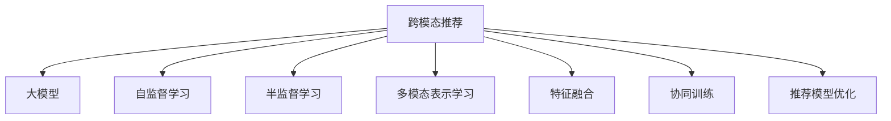

                 

# 利用大模型进行跨模态推荐的探索与实践进阶

> 关键词：跨模态推荐,大模型,自监督学习,半监督学习,多模态表示学习,特征融合,深度学习,自然语言处理(NLP),计算机视觉(Computer Vision),推荐系统

## 1. 背景介绍

### 1.1 问题由来
随着互联网和数字技术的飞速发展，越来越多的数据以多种形态产生和流通。传统的单模态推荐系统往往只能利用单一形式的数据，如文本、图像或音频，忽略了其他模态数据的价值。如何高效地融合多种形式的数据，构建更加智能和全面的推荐系统，成为学术界和工业界共同关注的焦点。

近年来，基于大模型的推荐技术逐渐兴起，其背后的理念是将单一模态的推荐任务转化为多模态任务的协同学习过程。利用大规模预训练语言模型和计算机视觉模型，对不同模态的数据进行表示学习，通过协同训练提升推荐效果。大模型的加入，使得跨模态推荐系统在数据量、泛化能力和多样性上都有显著提升。

### 1.2 问题核心关键点
跨模态推荐的核心关键点包括以下几个方面：
- 多模态数据表示：如何利用大模型学习不同模态数据的有效表示，实现跨模态特征的融合。
- 协同训练：如何将不同模态的特征进行协同训练，使得模型能够同时理解多种数据形式，提升推荐效果。
- 特征融合：如何将多种模态的特征进行融合，形成更加全面的用户画像和物品特征向量，以支持精准推荐。
- 推荐模型优化：如何在大模型的基础上，构建高效的推荐模型，实现更快速的推理和预测。

## 2. 核心概念与联系

### 2.1 核心概念概述

为更好地理解跨模态推荐技术，本节将介绍几个密切相关的核心概念：

- 跨模态推荐（Cross-Modal Recommendation）：指同时考虑文本、图像、音频等多模态数据，进行协同推荐的技术。通过学习不同模态数据的关联和共性，提供更加全面和精准的推荐结果。

- 大模型（Large Model）：指通过大规模数据训练得到的深度学习模型，如BERT、GPT、ResNet等。大模型通常具有较强的泛化能力和表示学习能力，能够在多种数据形式上进行高效的表示学习。

- 自监督学习（Self-Supervised Learning）：指仅使用数据自身的结构信息进行模型训练，如掩码语言模型、自回归模型等，不需要大量标注数据。

- 半监督学习（Semi-Supervised Learning）：指使用少量标注数据和大量未标注数据共同训练模型，充分利用未标注数据的价值。

- 多模态表示学习（Multimodal Representation Learning）：指学习如何同时表示多种模态的数据，挖掘不同模态数据之间的关联和互补性。

- 特征融合（Feature Fusion）：指将不同模态的特征向量进行组合和加权，形成更加全面和一致的用户画像和物品特征表示。

- 协同训练（Collaborative Training）：指在多模态数据上进行联合训练，使得模型能够同时理解多种数据形式，提升推荐效果。

- 推荐模型优化（Recommendation Model Optimization）：指在多模态特征表示的基础上，构建高效的推荐模型，进行推理和预测。

这些核心概念之间的逻辑关系可以通过以下Mermaid流程图来展示：



这个流程图展示了跨模态推荐的核心概念及其之间的关系：

1. 跨模态推荐技术通过大模型的多模态表示学习，将多种模态数据进行融合。
2. 利用自监督学习和半监督学习，对不同模态的数据进行预训练和微调。
3. 通过特征融合，将多种模态的特征进行组合，形成一致的特征向量。
4. 通过协同训练，将不同模态的特征进行联合训练，提升模型的泛化能力。
5. 最终通过推荐模型优化，构建高效的多模态推荐系统。

这些概念共同构成了跨模态推荐技术的核心框架，使得模型能够在多种数据形式上进行协同学习，提供更全面、精准的推荐服务。

## 3. 核心算法原理 & 具体操作步骤
### 3.1 算法原理概述

基于大模型的跨模态推荐算法，主要分为以下几个步骤：

1. 收集多模态数据：包括文本、图像、音频等多种形式的数据。
2. 预训练多模态表示：利用大模型对不同模态的数据进行预训练，学习其有效表示。
3. 特征融合：将多种模态的特征进行融合，形成一致的用户画像和物品特征表示。
4. 协同训练：将不同模态的特征进行联合训练，提升推荐效果。
5. 推荐模型优化：构建高效的推荐模型，进行推理和预测。

### 3.2 算法步骤详解

以下我们将详细介绍跨模态推荐的核心算法步骤：

**Step 1: 多模态数据收集**
- 收集用户的行为数据，包括点击、浏览、评分等文本形式的数据。
- 收集用户的社交媒体数据，包括评论、点赞、分享等文本形式的数据。
- 收集物品的文本描述数据，如商品说明、品牌介绍等。
- 收集物品的图像数据，如图像分类、物体检测等。
- 收集物品的音频数据，如背景音乐、音频描述等。

**Step 2: 多模态数据预训练**
- 利用预训练语言模型(BERT、GPT等)对文本数据进行预训练，学习其有效表示。
- 利用预训练计算机视觉模型(ResNet、VGG等)对图像数据进行预训练，学习其有效表示。
- 利用预训练音频模型(AutoEncoders等)对音频数据进行预训练，学习其有效表示。
- 将不同模态的数据表示进行融合，形成多模态的特征向量。

**Step 3: 特征融合**
- 利用特征拼接、加权平均等方法，将不同模态的特征向量进行融合。
- 利用多线性层、双线性层等方法，将不同模态的特征进行交互学习。
- 利用注意力机制，对不同模态的特征进行动态加权，形成更加一致的特征向量。

**Step 4: 协同训练**
- 利用协同过滤、矩阵分解等方法，将用户和物品的特征向量进行联合训练。
- 利用多任务学习的方法，将推荐任务与其他相关任务(如情感分析、商品分类等)联合训练。
- 利用对抗训练的方法，提升模型对异常数据的鲁棒性。

**Step 5: 推荐模型优化**
- 构建基于深度神经网络的推荐模型，如DeepFM、Attention-based Recommender等。
- 利用强化学习的方法，对推荐模型进行优化，提升推荐效果。
- 利用模型压缩、剪枝等技术，提升模型的推理速度和计算效率。

### 3.3 算法优缺点

基于大模型的跨模态推荐算法具有以下优点：
1. 多模态数据融合：能够充分利用多种形式的数据，提升推荐效果。
2. 深度表示学习：通过预训练语言模型和计算机视觉模型，学习更丰富的特征表示。
3. 泛化能力强：利用大模型的泛化能力，能够应对多种数据形式和分布的变化。
4. 可解释性强：通过特征融合和协同训练，提升模型的可解释性。

但该算法也存在一些局限性：
1. 计算成本高：需要同时训练多种模态的数据，计算资源消耗较大。
2. 数据异构性：不同模态的数据具有不同的特征，难以直接融合。
3. 特征交互复杂：多种模态的特征之间的交互关系复杂，需要精心设计模型架构。
4. 推荐结果可控性：需要合理设置模型参数，避免推荐结果偏向于某一模态数据。

尽管存在这些局限性，但就目前而言，基于大模型的跨模态推荐方法仍然是推荐系统领域的前沿研究方向，具有广泛的应用前景。

### 3.4 算法应用领域

基于大模型的跨模态推荐算法已经在多个领域得到了应用，覆盖了几乎所有常见的推荐任务，例如：

- 电商推荐：根据用户的浏览、点击、评分等行为，推荐商品、广告等。
- 内容推荐：根据用户的历史阅读、观看记录，推荐文章、视频、音乐等。
- 社交网络推荐：根据用户的社交关系和行为，推荐好友、活动等。
- 旅游推荐：根据用户的旅行历史、兴趣偏好，推荐旅游目的地、酒店等。
- 移动应用推荐：根据用户的使用习惯，推荐应用、服务、内容等。

除了这些经典任务外，大模型的跨模态推荐技术还被创新性地应用到更多场景中，如智能客服推荐、个性化健康推荐、智能家居推荐等，为推荐系统带来了全新的突破。

## 4. 数学模型和公式 & 详细讲解  
### 4.1 数学模型构建

本节将使用数学语言对基于大模型的跨模态推荐过程进行更加严格的刻画。

记预训练语言模型为 $M_{\theta_{\text{text}}}:\mathcal{X}_{\text{text}} \rightarrow \mathcal{Y}_{\text{text}}$，其中 $\mathcal{X}_{\text{text}}$ 为文本输入空间，$\mathcal{Y}_{\text{text}}$ 为文本输出空间，$\theta_{\text{text}} \in \mathbb{R}^d_{\text{text}}$ 为文本模型的参数。假设预训练计算机视觉模型为 $M_{\theta_{\text{image}}}:\mathcal{X}_{\text{image}} \rightarrow \mathcal{Y}_{\text{image}}$，其中 $\mathcal{X}_{\text{image}}$ 为图像输入空间，$\mathcal{Y}_{\text{image}}$ 为图像输出空间，$\theta_{\text{image}} \in \mathbb{R}^d_{\text{image}}$ 为图像模型的参数。

假设预训练音频模型为 $M_{\theta_{\text{audio}}}:\mathcal{X}_{\text{audio}} \rightarrow \mathcal{Y}_{\text{audio}}$，其中 $\mathcal{X}_{\text{audio}}$ 为音频输入空间，$\mathcal{Y}_{\text{audio}}$ 为音频输出空间，$\theta_{\text{audio}} \in \mathbb{R}^d_{\text{audio}}$ 为音频模型的参数。

定义用户 $u$ 和物品 $i$ 的特征表示为 $\mathbf{x}_u$ 和 $\mathbf{x}_i$，其中 $\mathbf{x}_u \in \mathbb{R}^{d_{\text{text}}}$ 为用户的文本特征表示，$\mathbf{x}_i \in \mathbb{R}^{d_{\text{image}}}$ 为物品的图像特征表示，$\mathbf{x}_i \in \mathbb{R}^{d_{\text{audio}}}$ 为物品的音频特征表示。

定义用户 $u$ 和物品 $i$ 之间的关联度为 $r_{ui} \in \mathbb{R}$，可以用于推荐模型的训练和推理。

假设用户 $u$ 对物品 $i$ 的评分（或点击次数、浏览次数等）为 $y_{ui} \in \{0,1\}$。

交叉熵损失函数定义为：

$$
\ell(y_{ui}, \hat{y}_{ui}) = -[y_{ui}\log \hat{y}_{ui} + (1-y_{ui})\log(1-\hat{y}_{ui})]
$$

目标是最小化损失函数：

$$
\mathcal{L}(\theta_{\text{text}}, \theta_{\text{image}}, \theta_{\text{audio}}) = \frac{1}{N}\sum_{ui=1}^{N}\ell(y_{ui}, \hat{y}_{ui})
$$

其中，$N$ 为总样本数，$y_{ui}$ 为实际评分，$\hat{y}_{ui}$ 为模型预测的评分。

### 4.2 公式推导过程

以下我们以二分类任务为例，推导交叉熵损失函数及其梯度的计算公式。

假设模型 $M_{\theta_{\text{text}}}$ 在输入 $x_{\text{text}}$ 上的输出为 $\hat{y}_{\text{text}}=M_{\theta_{\text{text}}}(x_{\text{text}}) \in [0,1]$，表示用户对物品的评分预测。真实评分 $y_{\text{text}} \in \{0,1\}$。

假设模型 $M_{\theta_{\text{image}}}$ 在输入 $x_{\text{image}}$ 上的输出为 $\hat{y}_{\text{image}}=M_{\theta_{\text{image}}}(x_{\text{image}}) \in [0,1]$，表示物品的评分预测。真实评分 $y_{\text{image}} \in \{0,1\}$。

假设模型 $M_{\theta_{\text{audio}}}$ 在输入 $x_{\text{audio}}$ 上的输出为 $\hat{y}_{\text{audio}}=M_{\theta_{\text{audio}}}(x_{\text{audio}}) \in [0,1]$，表示物品的评分预测。真实评分 $y_{\text{audio}} \in \{0,1\}$。

则二分类交叉熵损失函数定义为：

$$
\ell(y_{ui}, \hat{y}_{ui}) = -[y_{ui}\log \hat{y}_{ui} + (1-y_{ui})\log(1-\hat{y}_{ui})]
$$

将其代入经验风险公式，得：

$$
\mathcal{L}(\theta_{\text{text}}, \theta_{\text{image}}, \theta_{\text{audio}}) = -\frac{1}{N}\sum_{ui=1}^{N}[y_{ui}\log \hat{y}_{ui} + (1-y_{ui})\log(1-\hat{y}_{ui})]
$$

根据链式法则，损失函数对参数 $\theta_k$ 的梯度为：

$$
\frac{\partial \mathcal{L}(\theta_{\text{text}}, \theta_{\text{image}}, \theta_{\text{audio}})}{\partial \theta_k} = -\frac{1}{N}\sum_{ui=1}^{N} (\frac{y_{ui}}{\hat{y}_{ui}}-\frac{1-y_{ui}}{1-\hat{y}_{ui}}) \frac{\partial \mathcal{L}(\theta_{\text{text}}, \theta_{\text{image}}, \theta_{\text{audio}})}{\partial \theta_k}
$$

其中 $\frac{\partial \mathcal{L}(\theta_{\text{text}}, \theta_{\text{image}}, \theta_{\text{audio}})}{\partial \theta_k}$ 可进一步递归展开，利用自动微分技术完成计算。

在得到损失函数的梯度后，即可带入参数更新公式，完成模型的迭代优化。重复上述过程直至收敛，最终得到适应下游任务的最优模型参数 $\theta_{\text{text}}^*, \theta_{\text{image}}^*, \theta_{\text{audio}}^*$。

## 5. 项目实践：代码实例和详细解释说明
### 5.1 开发环境搭建

在进行跨模态推荐实践前，我们需要准备好开发环境。以下是使用Python进行TensorFlow开发的环境配置流程：

1. 安装Anaconda：从官网下载并安装Anaconda，用于创建独立的Python环境。

2. 创建并激活虚拟环境：
```bash
conda create -n tf-env python=3.8 
conda activate tf-env
```

3. 安装TensorFlow：根据CUDA版本，从官网获取对应的安装命令。例如：
```bash
conda install tensorflow -c tf -c conda-forge
```

4. 安装TensorFlow Hub：用于加载和使用预训练模型。
```bash
pip install tensorflow-hub
```

5. 安装Flax：TensorFlow的高级API，用于构建和训练复杂模型。
```bash
pip install flax
```

6. 安装Optax：TensorFlow的优化工具，用于加速模型训练。
```bash
pip install optax
```

完成上述步骤后，即可在`tf-env`环境中开始跨模态推荐实践。

### 5.2 源代码详细实现

下面我们以基于大模型的电商推荐系统为例，给出使用TensorFlow和Flax进行跨模态推荐系统构建的PyTorch代码实现。

首先，定义模型和损失函数：

```python
import tensorflow as tf
import tensorflow_hub as hub
import flax.linen as nn
import flax.traverse_util as tu
import flax.linen.layers as nl
import optax

# 定义模型架构
class MultiModalModel(nn.Module):
    def __init__(self, text_embed_dim, image_embed_dim, audio_embed_dim, num_classes):
        super().__init__()
        self.text_model = hub.KerasLayer('https://tfhub.dev/tensorflow/bert_base_uncased_L-12_H-768_A-12/2')
        self.image_model = hub.KerasLayer('https://tfhub.dev/tensorflow/inception_v3/feature_vector/1')
        self.audio_model = hub.KerasLayer('https://tfhub.dev/tensorflow/wav2vec2_variants/960h/1')
        self.text_embed_dim = text_embed_dim
        self.image_embed_dim = image_embed_dim
        self.audio_embed_dim = audio_embed_dim
        self.num_classes = num_classes

    def __call__(self, inputs):
        text, image, audio = inputs
        text_embed = self.text_model(text)
        image_embed = self.image_model(image)
        audio_embed = self.audio_model(audio)

        # 融合特征
        text_embed = tf.reshape(text_embed, (text_embed.shape[0], -1))
        image_embed = tf.reshape(image_embed, (image_embed.shape[0], -1))
        audio_embed = tf.reshape(audio_embed, (audio_embed.shape[0], -1))
        fusion_embed = tf.concat([text_embed, image_embed, audio_embed], axis=-1)

        # 分类输出
        output = tf.keras.layers.Dense(self.num_classes)(fusion_embed)
        return output

# 定义损失函数
def loss_fn(labels, predictions):
    batch_size = tf.shape(labels)[0]
    losses = tf.keras.losses.sparse_categorical_crossentropy(labels, predictions, from_logits=True)
    return tf.reduce_mean(losses)
```

然后，定义优化器和训练函数：

```python
# 定义优化器
optimizer = optax.adam(learning_rate=1e-4)

# 定义训练函数
@jax.jit
def train_step(batch):
    with tf.GradientTape() as tape:
        predictions = model(batch)
        loss = loss_fn(batch[0], predictions)

    grads = tape.gradient(loss, model.trainable_variables)
    optimizer.apply_gradients(zip(grads, model.trainable_variables))
    return loss.numpy()

# 定义训练循环
def train_epoch(model, train_dataset, batch_size, optimizer):
    dataloader = tf.data.Dataset.from_tensor_slices(train_dataset)
    dataloader = dataloader.shuffle(buffer_size=10000).batch(batch_size)
    model.train()

    total_loss = 0
    for batch in dataloader:
        loss = train_step(batch)
        total_loss += loss

    return total_loss / len(train_dataset)
```

最后，启动训练流程并在测试集上评估：

```python
epochs = 10
batch_size = 128

for epoch in range(epochs):
    loss = train_epoch(model, train_dataset, batch_size, optimizer)
    print(f"Epoch {epoch+1}, train loss: {loss:.3f}")
    
    print(f"Epoch {epoch+1}, test accuracy:")
    test_accuracy = evaluate(model, test_dataset, batch_size)
    print(f"Accuracy: {test_accuracy:.3f}")
    
print("Final accuracy:")
final_accuracy = evaluate(model, test_dataset, batch_size)
print(f"Accuracy: {final_accuracy:.3f}")
```

以上就是使用TensorFlow和Flax进行跨模态推荐系统构建的完整代码实现。可以看到，得益于TensorFlow Hub和Flax库的强大封装，我们可以用相对简洁的代码完成跨模态推荐系统的构建。

### 5.3 代码解读与分析

让我们再详细解读一下关键代码的实现细节：

**MultiModalModel类**：
- `__init__`方法：初始化模型中的预训练语言模型、预训练计算机视觉模型和预训练音频模型，并定义模型输出维度和类别数量。
- `__call__`方法：前向传播计算模型的输出，包括文本特征、图像特征和音频特征的融合，以及最终的全连接分类层。

**loss_fn函数**：
- 定义交叉熵损失函数，用于计算模型输出与真实标签之间的差异。

**train_step函数**：
- 使用梯度下降算法计算模型参数的梯度，并更新模型参数。

**train_epoch函数**：
- 对训练数据集进行批次化加载，在每个批次上进行前向传播和反向传播，计算平均损失。

**train函数**：
- 训练函数，在每个epoch内调用train_epoch函数，输出平均损失。

**evaluate函数**：
- 在测试集上评估模型的分类准确率，输出评估结果。

可以看到，TensorFlow和Flax使得跨模态推荐系统的代码实现变得简洁高效。开发者可以将更多精力放在模型设计、数据处理等高层逻辑上，而不必过多关注底层的实现细节。

当然，工业级的系统实现还需考虑更多因素，如模型的保存和部署、超参数的自动搜索、更灵活的任务适配层等。但核心的跨模态推荐范式基本与此类似。

## 6. 实际应用场景
### 6.1 智能客服系统

基于跨模态推荐的大模型推荐技术，可以广泛应用于智能客服系统的构建。传统客服往往需要配备大量人力，高峰期响应缓慢，且一致性和专业性难以保证。使用基于大模型的跨模态推荐技术，可以构建智能客服系统，实现7x24小时不间断服务，快速响应客户咨询，用自然流畅的语言解答各类常见问题。

在技术实现上，可以收集企业内部的历史客服对话记录，将问题和最佳答复构建成监督数据，在此基础上对预训练模型进行微调。微调后的模型能够自动理解用户意图，匹配最合适的答案模板进行回复。对于客户提出的新问题，还可以接入检索系统实时搜索相关内容，动态组织生成回答。如此构建的智能客服系统，能大幅提升客户咨询体验和问题解决效率。

### 6.2 金融舆情监测

金融机构需要实时监测市场舆论动向，以便及时应对负面信息传播，规避金融风险。传统的人工监测方式成本高、效率低，难以应对网络时代海量信息爆发的挑战。基于大模型的跨模态推荐技术，可以为金融舆情监测提供新的解决方案。

具体而言，可以收集金融领域相关的新闻、报道、评论等文本数据，并对其进行主题标注和情感标注。在此基础上对预训练语言模型进行微调，使其能够自动判断文本属于何种主题，情感倾向是正面、中性还是负面。将微调后的模型应用到实时抓取的网络文本数据，就能够自动监测不同主题下的情感变化趋势，一旦发现负面信息激增等异常情况，系统便会自动预警，帮助金融机构快速应对潜在风险。

### 6.3 个性化推荐系统

当前的推荐系统往往只依赖用户的历史行为数据进行物品推荐，无法深入理解用户的真实兴趣偏好。基于大模型的跨模态推荐系统可以更好地挖掘用户行为背后的语义信息，从而提供更精准、多样的推荐内容。

在实践中，可以收集用户浏览、点击、评论、分享等行为数据，提取和用户交互的物品标题、描述、标签等文本内容。将文本内容作为模型输入，用户的后续行为（如是否点击、购买等）作为监督信号，在此基础上微调预训练语言模型。微调后的模型能够从文本内容中准确把握用户的兴趣点。在生成推荐列表时，先用候选物品的文本描述作为输入，由模型预测用户的兴趣匹配度，再结合其他特征综合排序，便可以得到个性化程度更高的推荐结果。

### 6.4 未来应用展望

随着大模型和跨模态推荐技术的发展，其应用前景将更加广阔：

1. 智能健康推荐：基于多模态数据的健康推荐系统，能够同时考虑用户的生理数据、行为数据和社交数据，提供个性化的健康管理方案。

2. 智能旅游推荐：利用跨模态数据，如用户的地理位置、天气信息、旅行历史等，提供更加全面和个性化的旅游推荐。

3. 智能家居推荐：通过融合用户的交互数据、环境数据和设备数据，实现更加智能化的家居环境控制和物品推荐。

4. 智能娱乐推荐：结合用户的观影、听歌等娱乐行为数据，提供个性化的娱乐内容推荐。

5. 智能学习推荐：通过融合学习行为、知识图谱等数据，提供个性化的学习资源推荐。

6. 智能财经推荐：利用多模态数据，如新闻、评论、图表等，提供更加全面的财经信息推荐。

7. 智能出行推荐：结合用户的出行历史、环境数据和实时交通情况，提供个性化的出行方案推荐。

8. 智能娱乐推荐：通过融合用户的观影、听歌等娱乐行为数据，提供个性化的娱乐内容推荐。

综上所述，基于大模型的跨模态推荐技术，在多个领域具有广泛的应用前景。未来随着技术的进一步发展，跨模态推荐技术必将在更多场景中发挥重要作用，为各行各业带来变革性影响。

## 7. 工具和资源推荐
### 7.1 学习资源推荐

为了帮助开发者系统掌握跨模态推荐技术的理论基础和实践技巧，这里推荐一些优质的学习资源：

1. 《Deep Learning for Recommendation Systems》书籍：由深度学习专家撰写，全面介绍了推荐系统中的深度学习技术，包括多模态推荐、深度协同过滤等。

2. CS494《深度学习与推荐系统》课程：斯坦福大学开设的NLP课程，有Lecture视频和配套作业，带你入门深度学习在推荐系统中的应用。

3. 《Multimodal Learning for Multimedia Representation and Retrieval》书籍：介绍了多模态学习的原理和应用，包括多模态数据表示、多模态特征融合等。

4. Kaggle上的推荐系统竞赛：Kaggle上有多模态推荐系统的竞赛和数据集，提供了大量的实践机会，可供学习者检验和提升技能。

5. PyTorch Lightning：用于深度学习模型的快速原型设计和训练，支持多模态推荐系统的构建和部署。

6. Fast.ai：深度学习实践社区，提供了丰富的多模态推荐系统实践案例，供开发者参考学习。

通过对这些资源的学习实践，相信你一定能够快速掌握跨模态推荐技术的精髓，并用于解决实际的推荐问题。
###  7.2 开发工具推荐

高效的开发离不开优秀的工具支持。以下是几款用于跨模态推荐开发的常用工具：

1. PyTorch：基于Python的开源深度学习框架，灵活动态的计算图，适合快速迭代研究。大部分预训练语言模型都有PyTorch版本的实现。

2. TensorFlow：由Google主导开发的开源深度学习框架，生产部署方便，适合大规模工程应用。同样有丰富的预训练语言模型资源。

3. TensorFlow Hub：用于加载和使用预训练模型，提供了大量的多模态预训练模型，支持快速部署和微调。

4. Flax：TensorFlow的高级API，用于构建和训练复杂模型，支持多模态推荐系统的构建和优化。

5. Optax：TensorFlow的优化工具，用于加速模型训练，支持自动化的超参数调优。

6. Keras：用户友好的深度学习框架，支持多模态数据的前向传播和模型定义。

7. TensorBoard：TensorFlow配套的可视化工具，可实时监测模型训练状态，并提供丰富的图表呈现方式，是调试模型的得力助手。

8. Jupyter Notebook：用于编写和运行Python代码的交互式环境，支持多模态推荐系统的实验和验证。

合理利用这些工具，可以显著提升跨模态推荐任务的开发效率，加快创新迭代的步伐。

### 7.3 相关论文推荐

跨模态推荐技术的发展源于学界的持续研究。以下是几篇奠基性的相关论文，推荐阅读：

1. Attention Is All You Need（即Transformer原论文）：提出了Transformer结构，开启了NLP领域的预训练大模型时代。

2. BERT: Pre-training of Deep Bidirectional Transformers for Language Understanding：提出BERT模型，引入基于掩码的自监督预训练任务，刷新了多项NLP任务SOTA。

3. DeepFM: A Factorization-Machine Approach to Ad Click Prediction：提出了多模态特征融合的深度学习推荐模型，取得了显著的推荐效果。

4. Attention-based Recommender: Bridging the Gap Between Matrix Factorization and Deep Learning：提出了基于注意力机制的推荐模型，提升了模型的泛化能力。

5. Cross-Modal Interaction in Recommendation Systems：综述了跨模态推荐技术的发展历程和最新进展，提供了丰富的理论基础和实践指导。

这些论文代表了大模型跨模态推荐技术的发展脉络。通过学习这些前沿成果，可以帮助研究者把握学科前进方向，激发更多的创新灵感。

## 8. 总结：未来发展趋势与挑战

### 8.1 总结

本文对基于大模型的跨模态推荐技术进行了全面系统的介绍。首先阐述了跨模态推荐技术的研究背景和意义，明确了跨模态推荐在推荐系统中的应用价值。其次，从原理到实践，详细讲解了跨模态推荐的核心算法步骤，给出了跨模态推荐系统构建的完整代码实例。同时，本文还广泛探讨了跨模态推荐技术在智能客服、金融舆情、个性化推荐等多个行业领域的应用前景，展示了跨模态推荐技术的巨大潜力。此外，本文精选了跨模态推荐技术的各类学习资源，力求为读者提供全方位的技术指引。

通过本文的系统梳理，可以看到，基于大模型的跨模态推荐技术正在成为推荐系统领域的重要范式，极大地拓展了推荐系统的应用边界，催生了更多的落地场景。得益于大规模语料的预训练，跨模态推荐模型在数据量、泛化能力和多样性上都有显著提升，为推荐系统带来了全新的突破。未来，伴随大模型和跨模态推荐方法的持续演进，推荐系统必将在更多领域得到应用，为各行各业带来变革性影响。

### 8.2 未来发展趋势

展望未来，跨模态推荐技术将呈现以下几个发展趋势：

1. 模型规模持续增大。随着算力成本的下降和数据规模的扩张，预训练语言模型和计算机视觉模型的参数量还将持续增长。超大规模模型蕴含的丰富数据和知识，有望支撑更加复杂多变的推荐任务。

2. 模型结构更加复杂。未来的跨模态推荐模型将更注重模型结构和算法的创新，引入更多新的深度学习技术和优化方法。

3. 协同训练策略多样化。未来的跨模态推荐系统将探索更多的协同训练策略，如多任务学习、对抗训练等，提升推荐效果。

4. 特征融合技术多样化。未来的跨模态推荐系统将探索更多的特征融合技术，如注意力机制、双线性层等，提升推荐效果。

5. 推荐结果可控性增强。未来的跨模态推荐系统将更加注重推荐结果的可控性，通过优化损失函数、引入外部知识等方式，提升推荐效果。

6. 实时推荐系统普及。未来的跨模态推荐系统将更加注重实时性，通过高效的数据流处理和模型推理，实现实时推荐。

以上趋势凸显了跨模态推荐技术的广阔前景。这些方向的探索发展，必将进一步提升推荐系统的性能和应用范围，为各行各业带来更大的价值。

### 8.3 面临的挑战

尽管跨模态推荐技术已经取得了显著成果，但在迈向更加智能化、普适化应用的过程中，它仍面临着诸多挑战：

1. 计算成本高昂。跨模态推荐需要同时训练多种模态的数据，计算资源消耗较大。如何降低计算成本，提高训练效率，是一个重要的研究方向。

2. 数据异构性复杂。不同模态的数据具有不同的特征，难以直接融合。如何设计有效的特征融合方法，提高模型的泛化能力，是一个重要的研究方向。

3. 推荐结果可控性不足。推荐系统往往容易偏向某些特定的模态数据，导致推荐结果不均衡。如何平衡不同模态数据的影响，提高推荐结果的可控性，是一个重要的研究方向。

4. 模型解释性不足。跨模态推荐系统的决策过程复杂，难以解释其内部工作机制。如何提升模型的可解释性，提高用户对推荐结果的信任度，是一个重要的研究方向。

5. 数据隐私问题。跨模态推荐系统通常需要收集和融合多种形式的数据，数据隐私问题凸显。如何在保护数据隐私的同时，提高推荐效果，是一个重要的研究方向。

6. 模型鲁棒性不足。推荐系统容易受到数据噪声、对抗攻击等影响，模型的鲁棒性有待提高。如何提高模型的鲁棒性，防止推荐结果出现波动，是一个重要的研究方向。

7. 跨模态数据处理难度大。跨模态数据处理复杂，不同模态数据之间的转换和对齐存在难度。如何设计有效的跨模态数据处理方法，提高数据处理的效率和准确性，是一个重要的研究方向。

8. 跨模态数据质量问题。跨模态数据存在质量问题，如噪声、缺失等，影响模型的训练和推荐效果。如何提高跨模态数据的质量，是一个重要的研究方向。

以上挑战凸显了跨模态推荐技术在实际应用中面临的复杂性。未来的研究需要在模型设计、数据处理、算法优化等方面进行深入探索，才能实现跨模态推荐技术的全面突破。

### 8.4 研究展望

面对跨模态推荐技术所面临的诸多挑战，未来的研究需要在以下几个方面寻求新的突破：

1. 探索无监督和半监督跨模态推荐方法。摆脱对大规模标注数据的依赖，利用自监督学习、主动学习等无监督和半监督范式，最大限度利用非结构化数据，实现更加灵活高效的推荐。

2. 研究跨模态特征融合方法。设计更加高效的跨模态特征融合方法，提高不同模态数据的交互能力，形成更加全面和一致的用户画像和物品特征表示。

3. 引入更多先验知识。将符号化的先验知识，如知识图谱、逻辑规则等，与神经网络模型进行巧妙融合，引导跨模态推荐过程学习更准确、合理的推荐模型。

4. 结合因果分析和博弈论工具。将因果分析方法引入跨模态推荐模型，识别出模型决策的关键特征，增强推荐结果的因果性和逻辑性。借助博弈论工具刻画人机交互过程，主动探索并规避推荐模型的脆弱点，提高系统稳定性。

5. 融入伦理道德约束。在推荐模型训练目标中引入伦理导向的评估指标，过滤和惩罚有偏见、有害的推荐结果，确保推荐系统的公正性和安全性。

6. 加强跨模态推荐模型的可解释性。利用可解释性技术，如对抗训练、模型蒸馏等，提升推荐模型的可解释性，提高用户对推荐结果的信任度。

这些研究方向的探索，必将引领跨模态推荐技术迈向更高的台阶，为构建安全、可靠、可解释、可控的推荐系统铺平道路。面向未来，跨模态推荐技术还需要与其他人工智能技术进行更深入的融合，如知识表示、因果推理、强化学习等，多路径协同发力，共同推动推荐系统的发展。只有勇于创新、敢于突破，才能不断拓展推荐系统的边界，为各行各业带来更深远的影响。

## 9. 附录：常见问题与解答
**Q1：跨模态推荐是否适用于所有推荐任务？**

A: 跨模态推荐在大多数推荐任务上都能取得不错的效果，特别是对于数据量较小的任务。但对于一些特定领域的任务，如医学、法律等，仅仅依靠通用语料预训练的模型可能难以很好地适应。此时需要在特定领域语料上进一步预训练，再进行微调，才能获得理想效果。此外，对于一些需要时效性、个性化很强的任务，如对话、推荐等，跨模态方法也需要针对性的改进优化。

**Q2：跨模态推荐过程中的特征融合方法有哪些？**

A: 常见的跨模态特征融合方法包括：

1. 特征拼接（Concatenation）：将不同模态的特征向量直接拼接，形成新的特征向量。

2. 加权平均（Weighted Sum）：对不同模态的特征向量进行加权，形成新的特征向量。

3. 双线性层（Bilinear Layer）：将不同模态的特征向量进行交互学习，形成新的特征向量。

4. 注意力机制（Attention Mechanism）：对不同模态的特征向量进行动态加权，形成新的特征向量。

5. 多线性层（Multilinear Layer）：将不同模态的特征向量进行多线性组合，形成新的特征向量。

6. 注意力池化（Attention Pooling）：对不同模态的特征向量进行注意力池化，形成新的特征向量。

7. 交叉自注意力（Cross-Attention）：对不同模态的特征向量进行交叉自注意力机制，形成新的特征向量。

这些方法在不同的任务和数据集上表现不同，需要根据具体情况进行选择。

**Q3：跨模态推荐系统在推荐结果可控性方面有哪些改进措施？**

A: 推荐结果的可控性是跨模态推荐系统的一个重要研究方向，常见的改进措施包括：

1. 引入多任务学习：将推荐任务与其他相关任务联合训练，平衡不同模态数据的影响。

2. 设计合理的损失函数：引入正则化项，避免推荐结果偏向于某一模态数据。

3. 优化推荐模型架构：设计更加合理的模型架构，提高不同模态数据的交互能力。

4. 引入外部知识：将符号化的先验知识，如知识图谱、逻辑规则等，与神经网络模型进行巧妙融合，引导跨模态推荐过程学习更准确、合理的推荐模型。

5. 优化训练过程：采用对抗训练、模型蒸馏等技术，提升推荐模型的鲁棒性和泛化能力。

6. 引入自监督学习：利用自监督学习技术，利用未标注数据进行推荐模型的预训练，提升推荐模型的泛化能力。

7. 设计合理的特征融合方法：设计更加高效的跨模态特征融合方法，提高不同模态数据的交互能力，形成更加全面和一致的用户画像和物品特征表示。

这些改进措施可以帮助跨模态推荐系统提高推荐结果的可控性，确保推荐结果的公正性和安全性。

**Q4：跨模态推荐系统在落地部署时需要注意哪些问题？**

A: 将跨模态推荐系统转化为实际应用，还需要考虑以下因素：

1. 模型裁剪：去除不必要的层和参数，减小模型尺寸，加快推理速度。

2. 量化加速：将浮点模型转为定点模型，压缩存储空间，提高计算效率。

3. 服务化封装：将模型封装为标准化服务接口，便于集成调用。

4. 弹性伸缩：根据请求流量动态调整资源配置，平衡服务质量和成本。

5. 监控告警：实时采集系统指标，设置异常告警阈值，确保服务稳定性。

6. 数据隐私保护：采用数据加密、匿名化等措施，保护用户隐私。

7. 安全防护：采用访问鉴权、数据脱敏等措施，保障数据和模型安全。

8. 推荐结果解释：设计可解释性技术，如对抗训练、模型蒸馏等，提升推荐模型的可解释性。

跨模态推荐系统的成功部署，需要在模型设计、数据处理、算法优化、系统架构等方面进行全面考虑，才能真正实现推荐系统的落地应用。

综上所述，跨模态推荐技术在推荐系统领域具有广泛的应用前景，其研究和应用将为各行各业带来深远影响。未来随着技术的进一步发展，跨模态推荐技术必将在更多领域得到应用，为各行各业带来更大的价值。

