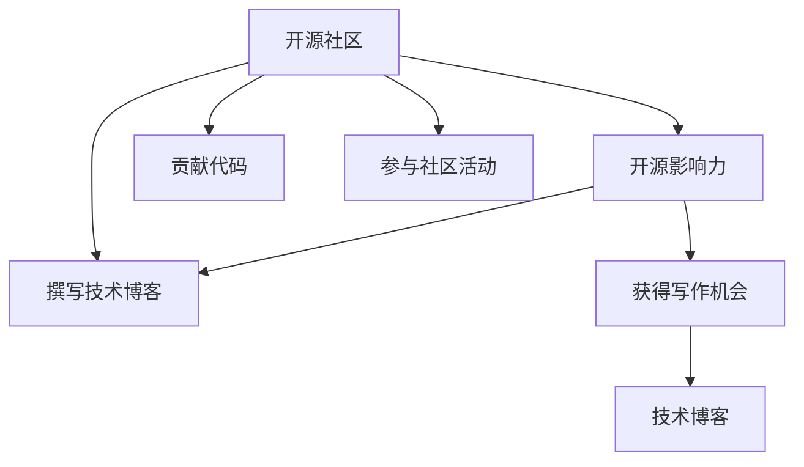

                 

# 利用开源影响力获得技术博客写作机会

在当今这个信息爆炸的时代，技术博客成为了连接开发者和技术的桥梁，其影响力已经远远超越了传统的技术文档和教程。优秀的技术博客不仅能显著提升个人品牌，还能吸引更多的关注和合作机会。本文将详细介绍如何利用开源影响力获得技术博客写作机会，为有志于此道的开发者提供实用的建议。

## 1. 背景介绍

### 1.1 问题由来

随着开源软件的普及和开源社区的蓬勃发展，越来越多的开发者开始关注开源项目的影响力。良好的开源影响力不仅能够吸引社区成员的参与，还能带来更多的技术博客写作机会。因此，如何利用开源影响力获得技术博客写作机会，成为了一个值得深入探讨的话题。

### 1.2 问题核心关键点

在开源社区中，影响力的提升与个人的项目贡献、代码质量、社区参与度等因素密切相关。要获得技术博客写作机会，开发者需要综合提升这些方面的表现。同时，掌握博客写作技巧和渠道布局也是关键。

### 1.3 问题研究意义

通过系统性地分析和总结如何利用开源影响力获得技术博客写作机会，可以为开发者提供明确的指导，帮助他们在开源领域取得更大的成功，并为社区带来更多的高质量内容。这不仅有助于提升个人品牌，还能促进技术知识的传播和应用。

## 2. 核心概念与联系

### 2.1 核心概念概述

为更好地理解如何利用开源影响力获得技术博客写作机会，我们需要了解几个关键概念：

- **开源社区**：一个由开发者共同维护的软件项目，其代码和文档都公开可访问。
- **开源影响力**：指在开源社区中的贡献度、知名度和认可度。
- **技术博客**：开发者撰写并发布的有关技术文章，通常涉及项目开发、技术实践、代码分享等内容。
- **写作机会**：获得在技术博客上发表文章的机会，通常需要一定的平台和资源支持。
- **影响力提升**：通过贡献代码、参与社区活动、撰写技术文章等方式，提升在开源社区中的影响力。

这些概念之间的逻辑关系可以通过以下Mermaid流程图来展示：



这个流程图展示了开发者如何通过提升开源影响力，从而获得技术博客写作机会的路径。

## 3. 核心算法原理 & 具体操作步骤

### 3.1 算法原理概述

利用开源影响力获得技术博客写作机会的算法原理，主要是通过提升个人在开源社区中的贡献度和知名度，进而吸引平台和资源的关注。具体步骤如下：

1. **贡献代码**：在开源项目中积极参与代码贡献，通过高质量的代码实现获得社区认可。
2. **参与社区活动**：积极参与社区讨论、会议、技术分享等活动，提升个人在社区中的知名度。
3. **撰写技术博客**：利用社区的影响力，在技术博客上分享自己的技术见解和实践经验。
4. **获取写作机会**：通过上述步骤提升影响力，吸引技术博客平台和编辑的关注，获得写作机会。

### 3.2 算法步骤详解

下面是利用开源影响力获得技术博客写作机会的详细步骤：

#### 3.2.1 选择合适的开源项目

选择一个与自己技术领域相匹配的开源项目，并积极参与其中。建议选择受欢迎、活跃度高、社区活跃的项目，以获得更多的关注和机会。

#### 3.2.2 贡献高质量代码

在开源项目中贡献高质量的代码，关注代码的规范性和可维护性。通过代码贡献获得社区成员的认可和赞赏。

#### 3.2.3 积极参与社区活动

参与社区讨论、会议、技术分享等活动，通过交流展示自己的技术实力和项目经验。积极回答问题、提供帮助，与社区成员建立良好的关系。

#### 3.2.4 撰写技术博客

利用社区的影响力，在技术博客上分享自己的技术见解和实践经验。建议选择与自己技术领域相关的主题，如项目经验、技术实战、代码分享等。

#### 3.2.5 获取写作机会

通过上述步骤提升影响力，吸引技术博客平台和编辑的关注，获得写作机会。建议多关注一些知名技术博客平台，如Medium、掘金、博客园等。

### 3.3 算法优缺点

#### 3.3.1 优点

1. **提升个人品牌**：通过高质量的代码贡献和积极的社区参与，显著提升个人在开源社区中的知名度和影响力。
2. **获得写作机会**：利用社区的影响力，获得更多的技术博客写作机会，提升技术文章的曝光度。
3. **促进技术传播**：通过技术博客分享自己的技术见解和实践经验，促进技术知识的传播和应用。

#### 3.3.2 缺点

1. **时间和精力投入较大**：高质量的代码贡献和社区参与需要大量时间和精力，可能影响其他工作的进度。
2. **竞争激烈**：开源社区竞争激烈，如何脱颖而出是一个需要考虑的问题。
3. **个人技术水平要求高**：需要具备较高的技术水平和良好的代码实现能力，否则难以获得社区认可。

### 3.4 算法应用领域

该算法不仅适用于技术博客写作，还可以扩展到其他领域的文章写作和内容创作，如专业论文、技术报告等。

## 4. 数学模型和公式 & 详细讲解 & 举例说明

### 4.1 数学模型构建

假设有一个开源项目 $P$，开发者 $D$ 通过贡献代码 $C$ 和参与社区活动 $A$ 提升在社区中的影响力 $I$。开发者在技术博客上分享文章 $B$ 的概率 $P_B$ 与影响力 $I$ 成正比关系，即 $P_B \propto I$。同时，博客平台 $P$ 选择开发者 $D$ 写作博客的概率 $P_P$ 也与影响力 $I$ 成正比关系，即 $P_P \propto I$。

### 4.2 公式推导过程

根据上述假设，可以得到以下公式：

$$
P_B = k_1 \cdot I
$$

$$
P_P = k_2 \cdot I
$$

其中 $k_1$ 和 $k_2$ 为常数，表示影响力的放大倍数。

通过影响力 $I$ 的提升，开发者 $D$ 最终获得技术博客写作机会的概率 $P_{total}$ 为：

$$
P_{total} = P_B \cdot P_P = (k_1 \cdot I) \cdot (k_2 \cdot I) = k_1 \cdot k_2 \cdot I^2
$$

### 4.3 案例分析与讲解

以GitHub为例，一个开源项目 $P$ 在GitHub上的贡献度 $C$、活跃度 $A$ 和开发者 $D$ 的代码贡献量 $N_C$、社区互动量 $N_A$ 如下：

| 项目 | $C$ | $A$ | $N_C$ | $N_A$ |
|------|-----|-----|-------|-------|
| A    | 高  | 高  | 多    | 多    |
| B    | 中  | 中  | 少    | 少    |
| C    | 低  | 低  | 少    | 少    |

开发者 $D$ 在项目 $A$ 上积极贡献代码和参与社区活动，影响力 $I_A$ 为：

$$
I_A = \frac{N_C}{C} \cdot \frac{N_A}{A}
$$

假设开发者在技术博客上分享文章的概率 $P_B$ 和博客平台选择开发者写作博客的概率 $P_P$ 都与影响力成正比，即 $P_B \propto I$ 和 $P_P \propto I$。

通过计算，可以得出开发者 $D$ 在项目 $A$ 上获得技术博客写作机会的概率 $P_{total}$：

$$
P_{total} = P_B \cdot P_P = (k_1 \cdot I_A) \cdot (k_2 \cdot I_A) = k_1 \cdot k_2 \cdot (I_A)^2
$$

通过上述案例分析，可以看到，通过积极参与开源项目、贡献高质量代码和积极参与社区活动，可以有效提升个人在开源社区中的影响力，从而获得技术博客写作机会。

## 5. 项目实践：代码实例和详细解释说明

### 5.1 开发环境搭建

开发者可以利用GitHub、GitLab等开源社区平台，选择感兴趣的项目并积极参与其中。以下是使用GitHub的实践步骤：

1. 注册GitHub账号。
2. 通过网页或命令行克隆项目代码到本地。
3. 创建一个新的分支，在该分支上进行代码贡献和修改。
4. 通过GitHub Pull Request (PR)功能提交代码，等待社区成员审核。

### 5.2 源代码详细实现

以贡献代码为例，开发者可以使用Git进行代码管理。以下是Git的基本命令：

```bash
git clone https://github.com/username/repository.git
cd repository
git checkout -b new-branch
# 进行代码贡献
git add .
git commit -m "Contribution description"
git push origin new-branch
# 创建Pull Request
git pull-request -m "Contribution description"
```

### 5.3 代码解读与分析

通过上述代码实例，可以看到Git的基本操作流程。开发者需要理解Git的基本命令和操作流程，才能有效地进行代码贡献和管理。

### 5.4 运行结果展示

通过贡献高质量代码和积极参与社区活动，开发者在开源社区中的影响力将显著提升。可以观察到GitHub等平台上自己的贡献量和社区互动量的增加，以及更多人关注和评论自己的代码和PR。

## 6. 实际应用场景

### 6.1 技术博客写作

开发者可以通过开源影响力获得技术博客写作机会，如在Medium、掘金等平台上撰写技术博客。以下是撰写技术博客的步骤：

1. 选择一个与自己技术领域相关的主题。
2. 阅读相关资料，理解技术原理和实现细节。
3. 在博客平台上撰写博客文章，分享自己的技术见解和实践经验。
4. 编辑和优化博客内容，提高文章质量和阅读体验。

### 6.2 开源社区推广

开发者可以通过博客平台推广自己的开源项目，吸引更多人关注和参与。以下是推广开源项目的步骤：

1. 在博客平台上撰写博客文章，介绍自己的开源项目和贡献。
2. 分享项目的使用方法和实战案例，展示项目的价值和应用场景。
3. 发布项目更新和改进，保持项目的活跃度。
4. 在社交媒体上分享博客文章，吸引更多人关注和参与。

## 7. 工具和资源推荐

### 7.1 学习资源推荐

为帮助开发者提升开源影响力，这里推荐一些优质的学习资源：

1. **开源社区指南**：GitHub、GitLab等开源平台提供的社区指南和最佳实践文档。
2. **代码贡献指南**：开源项目的代码贡献指南，如GitHub的Pull Request指南。
3. **博客写作指南**：技术博客平台提供的博客写作指南和最佳实践，如Medium的写作指南。

### 7.2 开发工具推荐

开发者可以利用Git等版本控制系统进行代码管理，使用GitHub、GitLab等平台进行代码贡献和社区参与。以下是推荐的工具：

1. Git：开源版本控制系统，适合代码版本管理和提交。
2. GitHub、GitLab：开源代码托管平台，提供代码贡献、社区讨论等功能。
3. Medium、掘金：技术博客平台，提供博客写作和发布功能。

### 7.3 相关论文推荐

以下是几篇重要的相关论文，推荐阅读：

1. **《开源社区中的贡献行为研究》**：研究开源社区中的贡献行为和影响因素。
2. **《开源社区的演化与影响》**：分析开源社区的演化过程和影响力。
3. **《技术博客的传播与影响》**：研究技术博客的传播机制和影响力。

## 8. 总结：未来发展趋势与挑战

### 8.1 总结

本文对利用开源影响力获得技术博客写作机会进行了系统介绍。通过提升开源影响力，开发者可以获得更多的技术博客写作机会，从而显著提升个人品牌和技术知识的传播。

### 8.2 未来发展趋势

未来，利用开源影响力获得技术博客写作机会的发展趋势如下：

1. **技术博客平台多样化**：技术博客平台将更加多样化，开发者可以选择更多适合自己的平台进行写作和分享。
2. **内容形式多样化**：技术博客的内容形式将更加多样化，如视频博客、直播分享等。
3. **社区互动增强**：社区互动将更加活跃，开发者可以通过社区讨论、问答等方式获得更多反馈和支持。

### 8.3 面临的挑战

尽管利用开源影响力获得技术博客写作机会有很多优势，但仍然面临一些挑战：

1. **时间和精力投入较大**：高质量的代码贡献和社区参与需要大量时间和精力。
2. **竞争激烈**：开源社区竞争激烈，如何脱颖而出是一个需要考虑的问题。
3. **个人技术水平要求高**：需要具备较高的技术水平和良好的代码实现能力，否则难以获得社区认可。

### 8.4 研究展望

未来的研究可以从以下几个方面进行：

1. **技术博客推广策略**：研究如何通过技术博客推广开源项目和开发者品牌。
2. **社区参与度提升**：研究如何通过社区参与度提升开发者的影响力。
3. **技术博客内容优化**：研究如何优化技术博客内容，提高阅读体验和传播效果。

通过系统性地分析和总结如何利用开源影响力获得技术博客写作机会，可以为开发者提供明确的指导，帮助他们在开源领域取得更大的成功，并为社区带来更多的高质量内容。这不仅有助于提升个人品牌，还能促进技术知识的传播和应用。

---

作者：禅与计算机程序设计艺术 / Zen and the Art of Computer Programming

