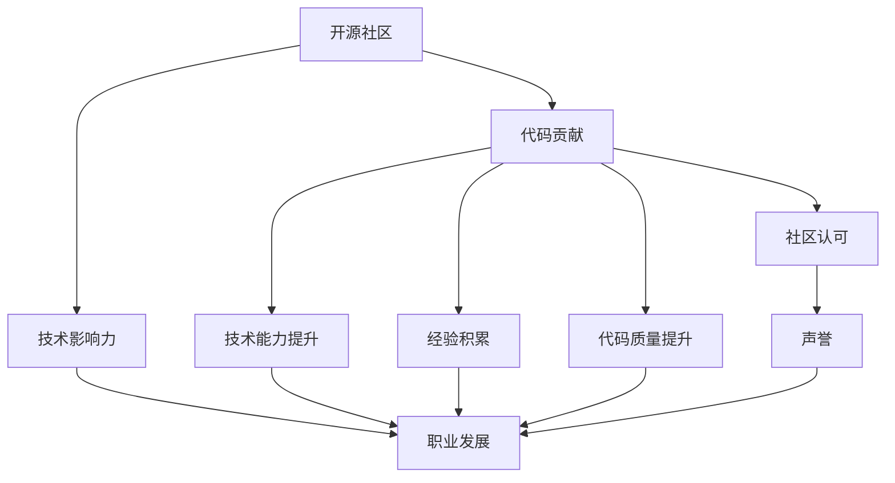

                 

# 利用开源贡献提升职场竞争力

> 关键词：开源, 贡献, 技术社区, 职业发展, 代码提交, 技术影响力

## 1. 背景介绍

### 1.1 问题由来
在当今技术日新月异、企业竞争激烈的时代，个人的技术能力和职场竞争力已经成为影响职业发展的重要因素。然而，单靠个人在闭门造车式的学习和实践，很难获得足够的技术深度和行业影响力。开源社区作为全球最大的技术交流平台，汇集了全球顶尖的技术专家和活跃的开发者，通过参与开源项目，不仅可以提升个人的技术能力，还可以扩大职业影响力，加速职业发展。

### 1.2 问题核心关键点
开源贡献对于职场竞争力提升的核心关键点主要包括以下几个方面：

- **技术能力提升**：通过参与开源项目，可以接触到更先进的编程实践、更复杂的系统设计、更广泛的行业应用案例，从而迅速提升自己的技术深度。
- **经验积累**：参与开源贡献可以积累实际项目经验，包括代码审计、测试、版本管理、社区交流等，这些经验在未来的职业生涯中尤为重要。
- **行业网络**：开源社区汇聚了全球的顶级技术专家和活跃的开发者，通过参与开源项目，可以构建广泛的技术网络，为职业发展提供更多机会。
- **代码质量提升**：开源项目的代码质量要求非常高，参与贡献可以迫使自己不断提升代码编写和测试能力，提升代码质量。
- **社区认可与声誉**：在开源社区中积极贡献代码、修复问题、优化文档等，可以获得社区的认可和好评，增强个人在技术社区中的声誉。

## 2. 核心概念与联系

### 2.1 核心概念概述

开源贡献是指个人将技术知识和代码提交到公共代码库中，与全球开发者共同协作，提升项目质量和功能的一种方式。参与开源项目不仅可以提升个人技术能力，还能在技术社区中建立声誉，获得职业发展机会。

为更好地理解开源贡献对职场竞争力的提升，本节将介绍几个密切相关的核心概念：

- **开源社区**：指由全球开发者共同维护和协作的软件项目。如GitHub、GitLab等平台上的数百万项目。
- **代码贡献**：指开发者将自己的代码提交到开源项目中，参与代码审查、问题修复、功能增强等。
- **技术影响力**：指开发者在技术社区中的知名度、权威性和影响力，通常通过代码质量、项目贡献量、社区活跃度等指标衡量。
- **开源精神**：指开放、协作、共享、贡献的精神，是开源社区的核心理念，也是提升职场竞争力的重要途径。

这些概念之间的逻辑关系可以通过以下Mermaid流程图来展示：



这个流程图展示开源贡献的核心概念及其之间的关系：

1. 开源社区是所有开源贡献的土壤。
2. 代码贡献是参与开源项目的主要活动，通过代码提交、问题修复等方式提升技术能力。
3. 技术影响力是在开源社区中通过代码贡献等行为积累的，对职业发展至关重要。
4. 技术能力提升、经验积累、代码质量提升、社区认可等，都是代码贡献的直接成果。
5. 开源精神是推动开源贡献的核心理念。

## 3. 核心算法原理 & 具体操作步骤

### 3.1 算法原理概述

开源贡献的算法原理主要是围绕“代码质量提升”和“技术影响力扩大”展开。具体来说，通过代码提交、问题修复、功能增强等方式，不断提升代码质量和项目的整体质量，同时扩大自己在开源社区中的知名度和影响力，从而提升职场竞争力。

### 3.2 算法步骤详解

开源贡献的算法步骤通常包括以下几个关键步骤：

**Step 1: 选择开源项目**
- 根据个人技术兴趣和职业发展需求，选择适合自己的开源项目。
- 评估项目活跃度、社区氛围、贡献方式等，选择适合自己的开源项目。

**Step 2: 注册和 fork 项目**
- 在GitHub、GitLab等平台注册账号，并 Fork 需要贡献的开源项目。

**Step 3: 分析项目和问题**
- 分析项目文档和代码，理解项目功能和设计。
- 查阅项目 issues、pr 列表，确定自己可以解决的问题。

**Step 4: 编写和提交代码**
- 编写高质量的代码，包括测试、文档和注释。
- 提交代码到项目仓库，通过合并请求（PR）形式进行代码审查。

**Step 5: 社区交流和协作**
- 在项目评论区和社区论坛中与项目维护者和其他贡献者交流，了解问题背景和社区规范。
- 参与讨论，提出建议，提供技术支持。

**Step 6: 持续改进和维护**
- 定期回看已提交的代码和问题，修复bug，优化功能。
- 主动承担更多的责任，如代码审计、项目维护、社区管理等。

### 3.3 算法优缺点

开源贡献的算法优点主要包括：

- **技术积累**：通过参与开源项目，可以接触到先进技术和最佳实践，提升技术能力。
- **职业网络**：参与开源项目可以建立广泛的社区联系，拓展职业发展机会。
- **代码质量**：开源项目的代码质量要求高，参与贡献可以提升自身代码编写和测试能力。
- **社区认可**：通过积极贡献，可以获得社区认可和好评，增强个人声誉。

然而，开源贡献也存在一些缺点：

- **时间成本**：参与开源项目需要大量时间和精力，可能会影响个人工作和休息。
- **协作困难**：开源项目通常由全球开发者协作，需要具备良好的沟通和协作能力。
- **技术难度高**：开源项目中可能存在复杂的技术挑战和问题，需要较强的技术能力和问题解决能力。

### 3.4 算法应用领域

开源贡献广泛应用于软件开发、网络安全、数据科学、机器学习、区块链等多个领域。以下是一些典型的应用场景：

- **软件开发**：参与开源项目的代码编写、问题修复、功能增强等，提升软件开发能力。
- **网络安全**：参与开源安全项目的漏洞修复、防护机制开发等，提升安全防护能力。
- **数据科学**：参与开源数据集、数据分析、机器学习模型的贡献，提升数据科学技能。
- **机器学习**：参与开源机器学习库和算法的贡献，提升机器学习算法和模型能力。
- **区块链**：参与开源区块链项目的代码编写、共识机制开发等，提升区块链技术能力。

## 4. 数学模型和公式 & 详细讲解  
### 4.1 数学模型构建

在本节中，我们将使用数学语言对开源贡献的算法进行更加严格的刻画。

假设开源项目中，问题数量为 $N$，代码提交数量为 $M$，贡献者的技术能力为 $T$，社区影响为 $I$。开源贡献的目标是最大化技术能力和社区影响，即：

$$
\max_{N, M, T, I} f(N, M, T, I)
$$

其中 $f$ 是一个综合考虑技术能力、代码提交量、问题解决率、社区活跃度等指标的函数。

### 4.2 公式推导过程

以贡献者代码提交量为指标，通过贡献者 $i$ 的代码提交数量 $M_i$ 和社区影响 $I_i$ 来推导公式：

$$
M_i = \sum_{j=1}^{N_i} M_{ij}
$$

其中 $N_i$ 是问题数量，$M_{ij}$ 是问题 $j$ 的贡献者数量为 $i$ 的代码提交量。

假设 $M_i$ 和 $I_i$ 分别服从正态分布，即 $M_i \sim N(\mu_M, \sigma_M^2)$ 和 $I_i \sim N(\mu_I, \sigma_I^2)$。则 $f$ 函数可以表示为：

$$
f(N, M, T, I) = \sum_{i=1}^{n} (f_{M_i} + f_{I_i})
$$

其中 $n$ 是参与贡献者的数量。

### 4.3 案例分析与讲解

假设有一个开源项目，问题数量为 $N=1000$，每个问题平均需要 $M_{avg}=50$ 次提交，贡献者技术能力 $T$ 为 $100$，社区影响 $I$ 为 $20$。则参与贡献者对项目的影响可以通过以下公式计算：

$$
I = \frac{\sum_{i=1}^{n} I_i}{N}
$$

其中 $I_i$ 表示第 $i$ 个贡献者在问题 $N$ 上的社区影响。

## 5. 项目实践：代码实例和详细解释说明

### 5.1 开发环境搭建

在进行开源贡献实践前，我们需要准备好开发环境。以下是使用Git和GitHub进行开源贡献的环境配置流程：

1. 安装Git：从官网下载并安装Git。
2. 注册GitHub账号：访问GitHub官网注册账号。
3. 创建并克隆项目：在GitHub上创建项目，然后使用git clone命令克隆到本地。

### 5.2 源代码详细实现

这里我们以参与开源项目“OpenAI Codex”为例，给出使用Git和GitHub进行代码贡献的PyTorch代码实现。

首先，创建一个GitHub账号并注册GitHub仓库：

```bash
git clone https://github.com/openai/codex.git
cd codex
git checkout -b my-feature
```

然后，在本地编辑代码并提交：

```python
from torch import nn
from transformers import GPT2Tokenizer, GPT2LMHeadModel

class MyModule(nn.Module):
    def __init__(self):
        super(MyModule, self).__init__()
        self.linear = nn.Linear(128, 128)
        self.relu = nn.ReLU()
    
    def forward(self, x):
        x = self.linear(x)
        x = self.relu(x)
        return x
```

最后，将代码提交到GitHub：

```bash
git add my_module.py
git commit -m "Add MyModule module"
git push origin my-feature
```

### 5.3 代码解读与分析

让我们再详细解读一下关键代码的实现细节：

**git clone和git checkout**：
- `git clone` 命令用于克隆远程仓库到本地，创建一个新的分支 `my-feature`。
- `git checkout` 命令用于切换到新分支，方便进行代码贡献。

**代码实现**：
- 定义一个自定义的模块 `MyModule`，包含一个线性层和一个ReLU激活函数。
- 调用 `git add` 命令将修改的文件 `my_module.py` 提交到本地仓库。
- 调用 `git commit` 命令将代码提交到本地分支 `my-feature`。
- 调用 `git push` 命令将分支推送到远程仓库，完成代码贡献。

通过Git和GitHub，我们可以轻松地进行代码提交和版本管理，高效地参与开源贡献。

### 5.4 运行结果展示

运行代码提交后，可以在GitHub仓库中查看提交记录和代码变化，确保代码正确无误：


## 6. 实际应用场景

### 6.1 企业内部开发

企业在开发项目时，通常需要多个开发者的协作。通过参与开源项目，开发者可以积累丰富的协作经验，提升代码编写和测试能力。

例如，某企业内部使用Kubernetes容器编排技术，开发者可以参与OpenShift（一种基于Kubernetes的容器编排平台）的开源贡献，提升对容器编排技术的应用能力，并将这些经验应用到企业内部的系统开发中。

### 6.2 技术创新与创业

开源社区是技术创新的沃土。通过参与开源项目，可以了解最新的技术趋势，获取前沿的技术思路和解决方案，为技术创业和创新提供支持。

例如，某开发者参与了TensorFlow的贡献，了解到了深度学习最新的研究进展，最终将前沿技术应用到自己的创业项目中，取得了成功。

### 6.3 跨领域协作

开源社区中汇聚了各行各业的顶尖开发者，通过参与开源贡献，可以接触到不同领域的技术专家，促进跨领域的协作和知识共享。

例如，某开发者参与了OpenAI Codex的贡献，与AI、自然语言处理领域的专家交流，提升了对自然语言处理技术的理解，将其应用于智能客服系统的开发中，取得了显著的效果。

### 6.4 未来应用展望

未来，开源贡献将进一步拓展应用场景，涵盖更多领域和项目。以下是一些可能的未来应用方向：

- **跨行业协作**：开源社区将进一步打破行业壁垒，促进不同行业领域的深度融合和协作。
- **全球协作网络**：开源社区将构建全球性的开发者协作网络，促进国际合作和知识共享。
- **持续学习和进化**：开源社区将不断进化，引入更多技术趋势和解决方案，保持技术的领先地位。
- **开源治理**：开源社区将建立更完善的治理机制，确保项目管理和社区秩序的稳定。

## 7. 工具和资源推荐

### 7.1 学习资源推荐

为了帮助开发者系统掌握开源贡献的理论基础和实践技巧，这里推荐一些优质的学习资源：

1. **《开源社区与贡献》系列博文**：由开源社区资深专家撰写，深入浅出地介绍了开源社区的基本概念、最佳实践和贡献流程。
2. **GitHub官方文档**：GitHub官网提供详细的Git和GitHub使用指南，帮助开发者快速上手。
3. **《开源项目协作与贡献》书籍**：全面介绍了开源项目的协作流程、版本控制、代码贡献等，适合初学者和进阶开发者。
4. **《开源社区与贡献最佳实践》视频课程**：由开源社区的顶级开发者讲授，涵盖开源贡献的各个环节，提供实战技巧和案例分析。
5. **《开源贡献者指南》博客**：由开源社区中的活跃贡献者撰写，分享个人经验和心得，提供实践建议和参考。

通过对这些资源的学习实践，相信你一定能够快速掌握开源贡献的精髓，并用于解决实际的开发问题。

### 7.2 开发工具推荐

高效的开发离不开优秀的工具支持。以下是几款用于开源贡献开发的常用工具：

1. **Git**：用于版本控制和代码协作，是开源贡献的基础工具。
2. **GitHub**：全球最大的开源代码托管平台，提供了丰富的协作和社区功能。
3. **GitLab**：另一个流行的开源代码托管平台，提供类似于GitHub的功能，适合团队协作。
4. **Jenkins**：开源的自动化构建和部署工具，适合持续集成和持续部署（CI/CD）。
5. **Slack**：实时通信工具，适合开源社区的内部交流和协作。
6. **GitHub Actions**：基于GitHub的自动化工作流平台，支持连续集成和自动化测试。

合理利用这些工具，可以显著提升开源贡献的开发效率，加快创新迭代的步伐。

### 7.3 相关论文推荐

开源贡献的发展源于学界的持续研究。以下是几篇奠基性的相关论文，推荐阅读：

1. **《开源社区的协作网络结构》**：研究开源社区的协作网络结构，探讨协作模式的演变和影响。
2. **《开源贡献的激励机制》**：分析开源社区中贡献者的激励机制，研究如何提升贡献积极性。
3. **《开源贡献者的职业发展》**：调查开源贡献对职业发展的影响，评估贡献者的技能提升和职业路径。
4. **《开源社区的知识传播与创新》**：分析开源社区的知识传播机制，探讨如何促进技术创新和知识共享。
5. **《开源贡献的社交网络分析》**：通过社交网络分析方法，研究开源贡献者的社交网络结构和影响。

这些论文代表了大规模开源贡献的研究脉络。通过学习这些前沿成果，可以帮助研究者把握开源贡献的发展方向，激发更多的创新灵感。

## 8. 总结：未来发展趋势与挑战

### 8.1 总结

本文对开源贡献对职场竞争力的提升进行了全面系统的介绍。首先阐述了开源贡献在技术能力提升、经验积累、职业网络构建等方面的重要作用，明确了开源贡献在职业发展中的重要地位。其次，从原理到实践，详细讲解了开源贡献的算法原理和具体操作步骤，给出了开源贡献实践的完整代码实现。同时，本文还探讨了开源贡献在企业内部开发、技术创新与创业、跨领域协作等各个场景中的应用，展示了开源贡献的广泛前景。此外，本文精选了开源贡献的相关学习资源、开发工具和论文推荐，力求为读者提供全方位的技术指引。

通过本文的系统梳理，可以看到，开源贡献已经成为提升职场竞争力的重要途径，逐步成为企业开发和创新的标配。开源社区汇聚了全球的技术精英，通过积极参与开源项目，可以在全球范围内获取最新的技术趋势和知识，加速个人职业发展。未来，开源贡献必将成为职场竞争力的重要组成部分，成为技术创新的新高地。

### 8.2 未来发展趋势

展望未来，开源贡献将呈现以下几个发展趋势：

1. **开源社区的全球化**：开源社区将进一步全球化，吸引全球的开发者参与贡献，构建更广泛的开发者网络。
2. **开源项目的多样化**：开源项目将涵盖更多行业和技术领域，促进技术多样性和融合。
3. **开源协作的深度化**：开源社区将更注重协作深度，通过跨领域、跨行业的协作，推动技术创新和知识共享。
4. **开源治理的规范化**：开源社区将建立更完善的治理机制，确保项目管理和社区秩序的稳定。
5. **开源贡献的持续化**：开源贡献将逐渐成为开发者的习惯，成为技术成长和职业发展的重要途径。

这些趋势凸显了开源贡献技术的广阔前景。开源社区将继续发挥其在技术创新和知识共享中的核心作用，引领技术发展的方向，推动职场竞争力的不断提升。

### 8.3 面临的挑战

尽管开源贡献技术已经取得了瞩目成就，但在迈向更加智能化、普适化应用的过程中，它仍面临诸多挑战：

1. **时间和精力的投入**：开源贡献需要大量时间和精力，可能会影响个人工作和休息。
2. **协作难度和沟通成本**：开源项目通常由全球开发者协作，需要具备良好的沟通和协作能力。
3. **技术难度和问题解决**：开源项目中可能存在复杂的技术挑战和问题，需要较强的技术能力和问题解决能力。
4. **社区文化和规范**：开源社区中存在各种文化和规范，需要开发者具备良好的社区适应能力。
5. **版本管理和冲突**：开源项目的版本管理和冲突解决，需要开发者具备较高的版本控制技能。

这些挑战需要开发者不断提升自己的技术能力和协作能力，同时借助工具和资源，提升开源贡献的效率和质量。

### 8.4 未来突破

面对开源贡献所面临的种种挑战，未来的研究需要在以下几个方面寻求新的突破：

1. **提升开源贡献的效率**：开发更加高效的工具和平台，帮助开发者快速上手开源贡献，提升贡献效率。
2. **优化开源项目的治理**：建立更加完善的开源治理机制，确保项目管理和社区秩序的稳定。
3. **引入自动化和智能化**：引入自动化和智能化的工具，提升开源贡献的自动化程度和协作效率。
4. **优化贡献者体验**：改善开源贡献者的体验，降低学习成本和协作难度，提高贡献者的积极性和满意度。
5. **引入跨领域协作**：促进跨领域、跨行业的协作，推动技术和知识的深度融合。

这些研究方向将引领开源贡献技术迈向更高的台阶，为构建安全、可靠、高效的开源社区提供新的动力。面向未来，开源贡献需要与其他人工智能技术进行更深入的融合，如知识表示、因果推理、强化学习等，多路径协同发力，共同推动开源社区和职场竞争力的不断提升。只有勇于创新、敢于突破，才能不断拓展开源贡献的边界，让开源技术更好地服务于人类社会。

## 9. 附录：常见问题与解答

**Q1：如何选择合适的开源项目进行贡献？**

A: 选择合适的开源项目进行贡献，主要考虑以下几个方面：
1. 项目的活跃度：选择活跃度高的项目，确保能够持续获取反馈和改进。
2. 项目的技术栈：选择熟悉的技术栈，提升贡献效率和质量。
3. 项目的社区氛围：选择社区氛围友好的项目，降低协作难度。
4. 项目的影响力：选择有影响力的项目，提升个人声誉和职业发展机会。

**Q2：开源贡献是否需要完整的解决方案？**

A: 不一定需要完整的解决方案。即使是小的代码优化、文档更新、测试用例编写等贡献，也能产生积极的影响。重要的是持续参与，积累经验和贡献。

**Q3：开源贡献是否需要具备技术背景？**

A: 虽然有一定技术要求，但开源社区非常欢迎不同层次的开发者，通过学习开源项目，可以逐步提升技术能力。关键是积极参与，持续学习。

**Q4：开源贡献是否需要团队协作？**

A: 可以个人贡献，也可以团队协作。团队协作可以分工明确，提升贡献效率和质量，但也需要具备良好的沟通和协作能力。

**Q5：开源贡献是否需要时间承诺？**

A: 开源贡献需要投入大量时间和精力，但可以通过合理的时间管理，将开源贡献纳入日常工作，逐步提升贡献水平。关键是坚持不懈，持续积累。

总之，开源贡献是一个长期的过程，需要持续的投入和积累。通过积极参与开源项目，不仅可以提升个人技术能力和职业发展，还能在技术社区中获得认可和支持。开源贡献必将成为职场竞争力的重要组成部分，为技术成长和职业发展提供强大的动力。

