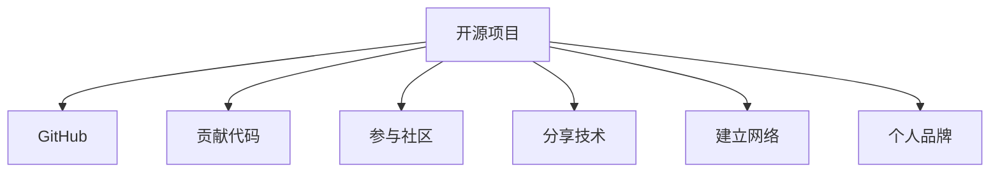

                 

# 利用开源项目构建个人影响力

在当今信息爆炸的时代，个人影响力的构建已经成为了许多人关注的焦点。无论是技术专家、软件开发人员，还是其他领域的从业者，都需要在激烈的竞争中脱颖而出，获得更多的关注和认可。而开源项目提供了一个极佳的舞台，通过贡献代码、参与社区建设、分享技术见解等方式，不仅能够展示个人的技术能力，还能够建立长期的个人品牌和影响力。本文将系统地介绍如何利用开源项目构建个人影响力，希望能为有志于提升个人影响力的开发者提供一些有价值的指导。

## 1. 背景介绍

### 1.1 问题由来

在过去几十年中，开源运动蓬勃发展，为全球软件开发和技术创新提供了强大的动力。通过开源项目，开发人员可以共享代码、交流技术、协作开发，加速技术的传播和应用。这种高度协作的生态系统为个人提供了展示才能、建立影响力的平台。

随着技术的不断进步，开源项目的形式和内容也在不断扩展。从软件源代码到数据集、算法、框架等，开源资源已经涵盖了各个技术领域。越来越多的开发者意识到，通过开源项目展示个人能力，不仅可以获得社区的认可，还能吸引企业和投资者的关注，为职业发展带来更多的机会。

### 1.2 问题核心关键点

在利用开源项目构建个人影响力时，以下几个关键点尤为重要：

1. **选择合适的项目**：选择适合自己的技术领域和兴趣点，找到能够持续贡献的项目。
2. **贡献代码**：通过编写高质量的代码，解决项目中存在的问题，提升项目价值。
3. **参与社区**：积极参与项目的讨论、问题解决、文档编写等社区活动，建立个人品牌。
4. **分享技术**：通过博客、视频、演讲等方式分享自己的技术见解和经验，扩大影响力。
5. **建立网络**：利用开源项目平台建立专业网络，与其他开发者、项目维护者、企业代表等建立联系。

这些关键点相辅相成，共同推动个人在开源社区中的影响力提升。

## 2. 核心概念与联系

### 2.1 核心概念概述

在讨论如何利用开源项目构建个人影响力之前，我们先简要介绍几个核心概念：

- **开源项目**：指公开源代码、鼓励协作开发的软件项目。开源项目提供了技术交流和协作的平台。
- **GitHub**：全球最大的开源代码托管平台，提供版本控制、协作开发、问题跟踪等功能，是开源项目的主要载体。
- **个人品牌**：在开源社区中，通过持续贡献高质量代码、积极参与社区活动、分享技术见解等方式，建立起来的个人声誉和专业形象。

### 2.2 核心概念原理和架构的 Mermaid 流程图

这个流程图展示了开源项目、GitHub、贡献代码、参与社区、分享技术、建立网络、个人品牌之间的关系。开源项目是核心，GitHub是主要平台，通过贡献代码、参与社区、分享技术、建立网络等活动，最终形成个人品牌。

## 3. 核心算法原理 & 具体操作步骤

### 3.1 算法原理概述

利用开源项目构建个人影响力，本质上是一种通过技术贡献和社区参与来建立个人声誉的过程。其核心算法原理包括：

1. **质量优先**：在贡献代码时，注重代码质量和技术深度，解决项目中存在的实际问题。
2. **频繁贡献**：通过频繁的代码提交和问题解决，展示个人持续的技术投入。
3. **积极参与**：积极参与社区活动，如代码审查、问题讨论、文档编写等，建立良好的社区关系。
4. **分享见解**：通过博客、视频、演讲等方式分享技术见解，展示个人对技术的深刻理解。
5. **建立网络**：利用开源项目平台，建立与项目维护者、企业代表、其他开发者等的专业网络，拓展个人影响范围。

### 3.2 算法步骤详解

1. **选择项目**：根据自己的技术兴趣和能力，选择适合自己的开源项目。可以在GitHub上通过搜索功能找到相关的项目。

2. **贡献代码**：
   - 首先创建一个GitHub账户，将本地代码库与GitHub仓库关联。
   - 阅读项目的贡献指南，了解代码提交流程、代码审查机制等。
   - 在本地代码库中开发新功能或修复已知问题。
   - 使用Git提交代码，并在GitHub上创建Pull Request，请求项目维护者合并代码。

3. **参与社区**：
   - 关注项目的Issue和Pull Request，积极参与讨论。
   - 在社区中回答问题，分享自己的见解和解决方案。
   - 编写和维护项目的文档，提升项目的可读性和易用性。

4. **分享技术**：
   - 通过博客、视频、演讲等方式分享自己的技术见解，展示个人在项目中的贡献和专业能力。
   - 参与技术会议和社区活动，与同行交流经验，扩大影响范围。

5. **建立网络**：
   - 在开源项目中与其他开发者、项目维护者、企业代表等建立联系。
   - 加入相关的技术社区和社交网络，扩大专业网络。

### 3.3 算法优缺点

**优点**：
- **社区认可**：开源项目以社区为中心，贡献高质量代码和积极参与社区活动，能够获得社区的认可和支持。
- **展示平台**：通过GitHub等平台，展示个人技术能力，吸引企业和投资者的关注。
- **持续提升**：开源项目提供了持续学习和提升的机会，通过不断贡献代码和技术分享，个人能力不断提升。

**缺点**：
- **时间投入**：开源项目的贡献需要大量的时间和精力，尤其是在工作和家庭生活繁忙的情况下。
- **技术门槛**：一些开源项目的技术难度较高，对技术能力有较高要求。
- **社区竞争**：开源项目中竞争激烈，需要不断提升自己的技术能力和贡献质量，才能脱颖而出。

### 3.4 算法应用领域

开源项目的应用领域非常广泛，涵盖了几乎所有技术领域。以下是几个典型的应用场景：

1. **软件开发**：在GitHub上找到相关的开源软件项目，贡献代码、修复问题、优化性能。
2. **数据科学**：参与数据集整理、模型训练、算法优化等数据科学项目，提升数据处理和建模能力。
3. **机器学习**：在Kaggle等平台上参与机器学习竞赛，分享模型和解决方案，提升技术影响力。
4. **网络安全**：参与开源安全工具的开发和漏洞修复，提升在网络安全领域的知名度。
5. **云计算**：在AWS、Google Cloud等云平台上贡献代码、优化架构，提升在云计算领域的权威性。

## 4. 数学模型和公式 & 详细讲解 & 举例说明

### 4.1 数学模型构建

假设有一个开源项目，开发者在该项目中提交了$n$个Pull Request（PR），每个PR的质量为$q_i$，社区的评价为$v_i$，开发者的总影响力$I$可以表示为：

$$ I = \sum_{i=1}^n v_i \cdot q_i $$

其中，$v_i$是社区对第$i$个PR的评价，$q_i$是第$i$个PR的质量。

### 4.2 公式推导过程

为了提升总影响力$I$，需要优化两个方面：$v_i$和$q_i$。社区评价$v_i$主要取决于PR的贡献大小、解决问题的复杂度、代码质量等因素。而质量$q_i$则可以通过代码审查、代码复杂度、问题解决效率等指标来评估。

### 4.3 案例分析与讲解

以一个开源项目为例，假设开发者A和开发者B都提交了两个PR，其质量、社区评价如下表所示：

| 开发者 | PR1 | PR2 |
| --- | --- | --- |
| A | 高 | 高 |
| B | 低 | 高 |

假设社区评价为正数，即贡献越大，评价越高。则开发者A的总影响力为：

$$ I_A = v_1 \cdot q_1 + v_2 \cdot q_2 $$

开发者B的总影响力为：

$$ I_B = v_3 \cdot q_3 + v_4 \cdot q_4 $$

通过比较$I_A$和$I_B$的大小，可以看出开发者A的总影响力更高，因为其贡献的PR质量更高，社区评价也更高。

## 5. 项目实践：代码实例和详细解释说明

### 5.1 开发环境搭建

1. **安装Git和GitHub Desktop**：从官网下载并安装Git和GitHub Desktop。
2. **创建GitHub账户**：在GitHub网站上注册并创建账户。
3. **克隆开源项目**：在GitHub上找到感兴趣的项目，克隆到本地代码库。

### 5.2 源代码详细实现

假设开发者要为Linux内核（Kernel）项目贡献代码。具体步骤如下：

1. **设置开发环境**：在本地搭建Linux开发环境，包括编译工具、调试工具等。
2. **阅读贡献指南**：阅读Kernel项目的贡献指南，了解代码提交流程、问题跟踪机制等。
3. **开发新功能**：在本地开发新功能，并进行单元测试。
4. **提交代码**：使用Git提交代码，并创建Pull Request。
5. **代码审查**：等待项目维护者的代码审查，根据反馈进行修改。
6. **合并代码**：代码审查通过后，项目维护者将代码合并到项目中。

### 5.3 代码解读与分析

开发者在提交代码时，需要关注以下几个方面：

- **代码质量**：代码应该遵循项目编码规范，进行适当的格式化和注释。
- **文档编写**：编写详细的代码注释和文档，提升代码的可读性和可维护性。
- **单元测试**：编写单元测试，确保代码的正确性和稳定性。
- **社区反馈**：积极回应用户和社区的反馈，及时修改问题。

### 5.4 运行结果展示

在GitHub上，开发者的代码提交和Pull Request会被公开展示，其他开发者可以方便地查看和评价。通过持续的高质量贡献，开发者在社区中的声誉会逐渐提升。

## 6. 实际应用场景

### 6.1 软件开发

在软件开发领域，开源项目提供了丰富的项目和资源。通过参与开源项目，开发者不仅可以提升技术能力，还可以结识更多同行，拓展职业机会。

**案例**：开发者A参与了Apache Hadoop项目的贡献，通过解决性能问题、优化代码质量，获得了社区的认可和支持，最终被Apache基金会任命为项目核心贡献者。

### 6.2 数据科学

数据科学领域也充满了开源机会。通过参与数据集整理、模型训练等项目，开发者可以在数据分析和机器学习方面积累丰富的经验。

**案例**：开发者B参与Kaggle机器学习竞赛，通过提交高质量的解决方案和模型，赢得了比赛冠军，获得了行业认可和学术荣誉。

### 6.3 机器学习

机器学习领域竞争激烈，但也是开源项目的活跃领域之一。通过参与开源项目和社区讨论，开发者可以保持技术领先，并吸引企业和投资者的关注。

**案例**：开发者C参与TensorFlow和PyTorch等项目的贡献，通过解决复杂问题、提升代码质量，成为机器学习领域的知名专家，被邀请到Google和Facebook等公司担任技术顾问。

### 6.4 未来应用展望

未来，开源项目和社区将继续扩展，覆盖更多技术领域和应用场景。开发者可以预见，随着技术的不断进步，开源项目在职业发展和影响力构建方面的作用将更加显著。

## 7. 工具和资源推荐

### 7.1 学习资源推荐

1. **《开源心态》（The Open Source Book）**：一本详细介绍开源项目的书籍，涵盖开源项目的基本概念、社区建设、贡献流程等内容。
2. **GitHub官方文档**：GitHub的官方文档提供了全面的平台使用指南，帮助开发者快速上手开源项目。
3. **Stack Overflow**：全球最大的技术问答社区，开发者可以在社区中提问、回答、分享技术见解。
4. **Udacity和Coursera**：提供大量开源项目相关的在线课程，帮助开发者提升技术能力和项目管理能力。

### 7.2 开发工具推荐

1. **Git**：最流行的版本控制系统，提供强大的代码管理功能。
2. **GitHub Desktop**：GitHub的桌面客户端，方便开发者在本地进行代码管理和提交。
3. **Visual Studio Code**：开源的代码编辑器，支持多种编程语言和扩展。
4. **Jekyll**：基于GitHub Pages的开源静态博客平台，方便开发者搭建技术博客。
5. **GitHub Actions**：GitHub提供的工作流服务，支持自动化测试和持续集成，提升开发效率。

### 7.3 相关论文推荐

1. **《开源社区中的贡献者合作网络》（Networks of Collaboration in Open Source）**：研究开源社区中贡献者的合作模式和影响力分布。
2. **《开源软件项目管理与实践》（Software Project Management and Practice in Open Source）**：详细介绍开源项目的管理流程和最佳实践。
3. **《开源社区中的知识传播》（Knowledge Diffusion in Open Source Software Development）**：研究开源项目中的知识传播机制和效果。

## 8. 总结：未来发展趋势与挑战

### 8.1 研究成果总结

通过利用开源项目构建个人影响力，开发者不仅可以在技术领域获得认可和支持，还能为职业生涯带来更多机会。开源项目的发展也为开发者提供了展示和提升自我能力的平台。

### 8.2 未来发展趋势

1. **开源项目多样化**：随着技术的发展，开源项目的种类和应用场景将不断扩展，涵盖更多领域和需求。
2. **社区建设强化**：开源项目将更加注重社区建设和用户体验，提供更完善的协作工具和文档支持。
3. **开发者合作深化**：开源社区中的开发者合作将更加紧密，通过联合开发和共同创新，提升整体技术水平。

### 8.3 面临的挑战

1. **时间管理**：开发者需要在繁忙的工作和家庭生活中平衡开源项目的时间和精力。
2. **技术门槛**：一些开源项目的技术难度较高，需要开发者具备较强的技术能力和学习能力。
3. **社区竞争**：开源项目中的竞争激烈，需要开发者不断提升自己的技术能力和贡献质量。

### 8.4 研究展望

未来，开源项目和社区将继续发展，开发者需要不断学习新知识和新技术，保持自身的竞争力。同时，需要更加注重社区建设和合作，提升影响力，实现个人与社区的共同成长。

## 9. 附录：常见问题与解答

**Q1：如何选择合适的开源项目？**

A: 选择开源项目时，可以根据自己的技术兴趣和职业目标，选择与自己能力匹配的项目。可以参考项目的历史贡献、活跃度和社区评价等指标。

**Q2：如何高效管理开源项目的贡献？**

A: 开发者可以使用GitHub等平台提供的工具和插件，如Pull Request管理、问题跟踪、代码审查等，提升贡献效率和质量。

**Q3：如何提升代码质量？**

A: 遵循项目的编码规范和最佳实践，编写清晰的代码注释和文档，进行单元测试和代码审查，确保代码的可读性和可维护性。

**Q4：如何应对开源项目中的社区竞争？**

A: 积极参与社区讨论，贡献高质量的代码和解决方案，建立良好的社区关系。同时，保持学习和进步，提升自身技术能力。

---

作者：禅与计算机程序设计艺术 / Zen and the Art of Computer Programming

