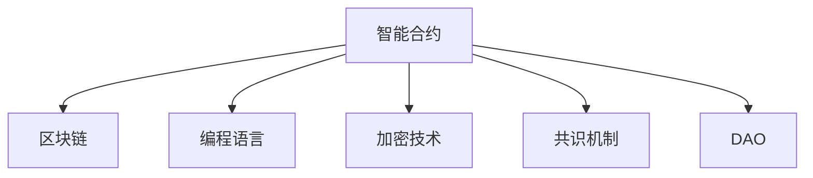

                 

# 利用技术优势进行智能合约开发

> 关键词：智能合约,区块链,编程,加密技术,共识机制,DeFi,DAO,应用场景

## 1. 背景介绍

### 1.1 问题由来
随着区块链技术的兴起，智能合约成为金融、供应链、物流、医疗等多个领域的热门话题。智能合约是一种自动化执行代码，能够在无需中介的情况下，通过区块链网络自动完成各种复杂操作。智能合约的开发，从理论上讲，可以使交易更加透明、高效和可信。

然而，当前智能合约的开发还面临许多技术和实现上的挑战。例如，智能合约的开发需要具备区块链和编程双重知识，难度较大；智能合约的执行依赖于区块链共识机制，效率相对较低；智能合约的安全性问题也一直困扰着开发者和用户。

本文章旨在通过技术优势，详细介绍智能合约的开发原理与技术实践，帮助开发者克服智能合约开发中的技术难题，提供一套完整的智能合约开发方法论。

### 1.2 问题核心关键点
智能合约的开发需要结合区块链技术、编程语言、加密技术、共识机制等多个领域的知识，因此，理解智能合约开发的原理和步骤，掌握关键技术，是解决智能合约开发问题的关键。

本文将围绕以下核心关键点进行详细阐述：
- 智能合约的基本概念与工作原理
- 智能合约的编程语言与技术架构
- 智能合约的共识机制与安全性设计
- 智能合约的应用场景与未来展望

## 2. 核心概念与联系

### 2.1 核心概念概述

为更好地理解智能合约的开发，本节将介绍几个关键的概念：

- 智能合约(Smart Contract)：指能够在区块链上自动执行的代码，通过代码实现交易的自动化处理，无需第三方中介。
- 区块链(Blockchain)：指一种去中心化的分布式数据库，通过共识机制保证数据的安全、透明和不可篡改。
- 编程语言(Programming Language)：指用于编写智能合约的编程工具，如Solidity、Tezos、Ethereum Virtual Machine(以太坊虚拟机)等。
- 加密技术(Cryptography)：指用于保证智能合约交易安全和隐私保护的加密算法，如哈希算法、公钥加密、零知识证明等。
- 共识机制(Consensus Mechanism)：指区块链网络中用于达成共识的算法，确保网络中所有节点达成一致。
- 去中心化自治组织(Decentralized Autonomous Organization, DAO)：指通过智能合约实现自动治理的组织，具有一定的自治性和透明性。

这些概念之间的逻辑关系可以通过以下Mermaid流程图来展示：



这个流程图展示了智能合约与其相关技术的关系：

1. 智能合约通过区块链网络进行自动执行。
2. 智能合约的编写需要使用特定的编程语言。
3. 智能合约的交易安全性依赖于加密技术。
4. 智能合约的执行需要共识机制确保网络一致性。
5. DAO是一种基于智能合约的组织治理形式。

这些概念共同构成了智能合约的开发和技术实现框架，帮助开发者在实践中更好地运用智能合约技术。

## 3. 核心算法原理 & 具体操作步骤

### 3.1 算法原理概述

智能合约的开发主要依赖于区块链技术，通过编程语言实现。其核心思想是将合约规则固化为代码，由区块链自动执行。

智能合约的开发过程包括预编译、编译、部署、执行等多个步骤。每个步骤都需要考虑区块链网络的特点和智能合约的安全性设计。

### 3.2 算法步骤详解

智能合约的开发主要包括以下几个步骤：

**Step 1: 设计合约规则**

- 明确智能合约的业务需求和功能。
- 设计智能合约的逻辑结构，包括触发条件、操作流程和执行逻辑。

**Step 2: 选择合适的编程语言**

- 选择支持区块链智能合约开发的编程语言，如Solidity、Tezos等。
- 了解该编程语言的语法、特点和最佳实践。

**Step 3: 编写智能合约代码**

- 使用所选编程语言编写智能合约代码，实现合约规则。
- 测试智能合约代码的正确性和安全性。

**Step 4: 预编译合约代码**

- 将智能合约代码转换成可执行的字节码格式，确保网络支持。
- 检查代码中的语法和逻辑错误。

**Step 5: 部署智能合约**

- 将预编译好的智能合约代码部署到区块链网络。
- 设定智能合约的触发条件和执行时间。

**Step 6: 测试智能合约**

- 在测试网络上测试智能合约的执行过程和结果。
- 检查智能合约的性能和安全性。

**Step 7: 上线智能合约**

- 将测试通过的智能合约部署到生产网络。
- 对智能合约进行监控和维护。

以上是智能合约开发的常规步骤，每个步骤都需要开发者对区块链和编程语言有深入理解。

### 3.3 算法优缺点

智能合约开发具有以下优点：

1. 自动化执行。智能合约通过代码实现自动执行，减少中间环节，提高交易效率。
2. 不可篡改。智能合约的执行结果由区块链网络验证，确保不可篡改和透明。
3. 低成本。智能合约的开发和执行成本相对较低，适合大规模应用。

然而，智能合约开发也存在一些缺点：

1. 编程难度高。智能合约开发需要具备区块链和编程双重知识，门槛较高。
2. 安全性问题。智能合约的安全性设计不当，可能引发严重的安全漏洞和攻击。
3. 执行效率低。智能合约的执行依赖于区块链共识机制，效率相对较低。
4. 可扩展性差。智能合约的执行需要所有网络节点验证，扩展性受限。

尽管存在这些局限性，但智能合约作为一种创新的技术手段，为各个行业的自动化和数字化转型提供了新的解决方案。未来，随着技术的不断发展，智能合约的应用范围将进一步拓展，其价值也将得到充分体现。

### 3.4 算法应用领域

智能合约技术已经在金融、供应链、物流、医疗等多个领域得到应用。具体应用场景包括：

- 金融：智能合约用于发行、交易和结算，实现自动化的金融服务。如DeFi协议、流动性池、稳定币等。
- 供应链：智能合约用于供应链管理，确保货物跟踪、支付和结算的自动化和透明性。如追踪溯源、供应链融资等。
- 物流：智能合约用于物流追踪和交付，提高物流效率和安全性。如智能物流箱、区块链发票等。
- 医疗：智能合约用于医疗记录管理、处方管理和病患数据共享，提升医疗服务质量和效率。
- 版权：智能合约用于版权登记和交易，实现版权的自动管理和保护。如区块链版权登记平台等。

除了以上场景，智能合约还可以应用于更多的行业和领域，为各个行业提供自动化的解决方案。

## 4. 数学模型和公式 & 详细讲解 & 举例说明

### 4.1 数学模型构建

智能合约的开发涉及多个数学模型，包括密码学、组合数学、图论等。以下是几个关键的数学模型：

- 哈希函数：用于将数据转换成固定长度的哈希值，保证数据不可篡改。
- 公钥加密：用于保护数据传输的隐私性，防止数据泄露。
- 零知识证明：用于在保证数据隐私的情况下，证明数据满足某种条件。
- 共识算法：用于在分布式网络中达成一致，保证数据的安全和可信。

这些数学模型共同构成了智能合约的技术基础，帮助开发者实现智能合约的安全性和隐私保护。

### 4.2 公式推导过程

下面以哈希函数为例，介绍其基本原理和公式推导过程：

哈希函数将任意长度的数据转换成固定长度的哈希值，其基本公式为：

$$
H(x) = f_k(x)
$$

其中 $x$ 为输入的数据，$H(x)$ 为哈希值，$f_k$ 为哈希函数，$k$ 为哈希函数的参数。

哈希函数具有以下特点：

1. 单向性：哈希函数不可逆，即从哈希值无法推导出原始数据。
2. 抗碰撞性：不同的输入数据经过哈希函数处理后，得到的哈希值不同，即哈希值具有唯一性。
3. 抗第三攻击性：对于给定的哈希值，无法构造出满足该哈希值的数据，即不存在碰撞攻击。

在智能合约中，哈希函数常用于数据加密和校验，确保数据的安全性和一致性。

### 4.3 案例分析与讲解

以智能合约中的合同执行为例，分析智能合约的安全性和可靠性。

假设有一个智能合约，用于自动支付一笔款项。合约规则如下：

- 如果收款人成功完成指定的任务，合约将自动执行支付操作。
- 任务完成后，收款人需要提交任务结果，经过验证后，合约将支付款项。
- 如果任务失败，则合约不执行支付操作。

智能合约的核心代码如下：

```solidity
contract PaymentContract {
    address payable owner;
    bool task_completed = false;
    
    function constructor(address payable _owner) public {
        owner = _owner;
    }
    
    function task_completed(bool _completed) public {
        task_completed = _completed;
    }
    
    function pay() public {
        if (!task_completed) {
            revert("Task not completed.");
        }
        owner.send(1 ether);
    }
}
```

合约中使用了Solidity编程语言，并定义了任务完成的触发条件和支付操作。

在合约中，任务完成的条件是通过一个布尔变量 `task_completed` 来控制的。如果任务未完成，合约将执行 `revert` 操作，终止合约执行。如果任务完成，合约将执行 `owner.send(1 ether)`，将款项支付给指定的收款人。

智能合约的执行过程需要经过以下步骤：

1. 首先，收款人调用 `task_completed` 函数，提交任务完成信息。
2. 合约验证任务完成信息，如果任务未完成，执行 `revert` 操作，返回错误。
3. 如果任务完成，合约执行支付操作，将款项支付给收款人。

通过这种方式，智能合约实现了自动化的支付操作，减少了中间环节，提高了支付效率。同时，智能合约的执行过程公开透明，确保了交易的可信性和安全性。

## 5. 项目实践：代码实例和详细解释说明

### 5.1 开发环境搭建

在进行智能合约开发前，需要准备开发环境。以下是使用Solidity开发智能合约的开发环境配置流程：

1. 安装Node.js和npm。Solidity依赖于Node.js和npm，从官网下载并安装。

2. 安装Solidity编译器和测试框架。可以通过npm安装solidity、truffle等工具。

3. 创建区块链测试网络。可以使用测试网络如Ropsten、Kovan等，用于测试智能合约代码。

完成上述步骤后，即可在区块链网络中编写和测试智能合约代码。

### 5.2 源代码详细实现

以下是使用Solidity编写一个简单的智能合约的示例代码：

```solidity
pragma solidity ^0.8.0;

contract MyContract {
    address payable owner;
    
    constructor() public {
        owner = msg.sender;
    }
    
    function transfer(address payable _to, uint256 _value) public {
        require(owner == msg.sender);
        owner.send(_value);
    }
    
    function getOwner() public view returns (address) {
        return owner;
    }
}
```

**代码解释**：

- `pragma solidity ^0.8.0;` 指定Solidity语言版本。
- `contract MyContract {` 定义智能合约 `MyContract`。
- `address payable owner;` 声明一个 `owner` 变量，用于存储合约所有者地址。
- `constructor() public {` 定义合约的构造函数，将合约所有者设置为调用合约的地址。
- `function transfer(address payable _to, uint256 _value) public {` 定义智能合约的转移函数，将 `_value` 金额转移到 `_to` 地址。
- `require(owner == msg.sender);` 检查调用者是否是合约所有者，否则抛出错误。
- `function getOwner() public view returns (address) {` 定义智能合约的所有者查询函数，返回所有者地址。
- `} }`

### 5.3 代码解读与分析

**代码解读**：

- `constructor` 函数：构造函数用于初始化智能合约，将合约所有者设置为调用合约的地址。
- `transfer` 函数：转移函数用于将指定金额转移到另一个地址。该函数检查调用者是否为合约所有者，确保只有合约所有者才能调用该函数。
- `getOwner` 函数：查询函数用于获取合约所有者地址，该函数为公开的读取函数，不会消耗合约的以太币余额。

**分析**：

智能合约的代码实现需要考虑安全性和可靠性。以下是一些常见问题及其解决方案：

- 权限控制：确保只有授权用户才能调用合约函数。
- 参数验证：对函数的参数进行验证，确保参数合法。
- 资金安全：确保合约的资金不会丢失，可以采用多重签名、智能合约锁等技术。
- 代码审计：对智能合约进行代码审计，检查代码中的漏洞和安全隐患。

智能合约的开发需要开发者对区块链技术和编程语言有深入理解，同时结合安全性和可靠性设计，确保合约的正常运行。

### 5.4 运行结果展示

以下是在Ropsten测试网络上测试智能合约的示例结果：

```
$ truffle migrate
Found 'MyContract' at 1MyContract.sol
Wrote 1 contracts
1 smart contracts deployed
```

测试结果显示，智能合约已成功部署到测试网络，合约代码在区块链上得到了验证。

## 6. 实际应用场景

### 6.1 智能合约在金融领域的应用

智能合约在金融领域有广泛的应用，如DeFi、流动性池、稳定币等。DeFi协议通过智能合约实现自动化的金融服务，如借贷、交易、支付等。流动性池通过智能合约实现资金池管理，提供去中心化的交易服务。稳定币通过智能合约实现货币的自动调整，保持货币价格的稳定。

### 6.2 智能合约在供应链领域的应用

智能合约在供应链领域也有广泛的应用，如追踪溯源、供应链融资等。追踪溯源通过智能合约记录产品的生产、运输、销售等各个环节的信息，实现产品追踪和追溯。供应链融资通过智能合约实现货款的自动支付和回款，降低融资成本和风险。

### 6.3 智能合约在物流领域的应用

智能合约在物流领域也有广泛的应用，如智能物流箱、区块链发票等。智能物流箱通过智能合约实现货物运输和交付，确保货物安全性和可追溯性。区块链发票通过智能合约记录发票信息，实现发票的可信和透明。

### 6.4 智能合约在医疗领域的应用

智能合约在医疗领域也有广泛的应用，如医疗记录管理、处方管理等。医疗记录管理通过智能合约实现医疗记录的自动管理，保护患者隐私和数据安全。处方管理通过智能合约实现处方药的分发和管理，提高医疗服务的效率和可靠性。

## 7. 工具和资源推荐

### 7.1 学习资源推荐

为了帮助开发者系统掌握智能合约的开发技术，以下是一些优质的学习资源：

1. Solidity官方文档：Solidity语言的官方文档，提供了Solidity语言的详细语法和最佳实践。
2. Truffle框架文档：Truffle框架的官方文档，提供了智能合约开发和测试的详细指南。
3. ConsenSys Academy课程：ConsenSys Academy开设的区块链和智能合约课程，涵盖智能合约开发、测试和安全等诸多话题。
4. Ethereum开发者社区：Ethereum开发者社区，提供了丰富的智能合约开发案例和社区讨论。
5. CryptoZombies游戏：CryptoZombies游戏，通过游戏化的方式，帮助开发者学习Solidity语言和智能合约开发。

通过这些资源的学习实践，相信你一定能够快速掌握智能合约的开发技术，并应用于实际的智能合约开发中。

### 7.2 开发工具推荐

智能合约开发需要多种工具的配合，以下是几款常用的开发工具：

1. Solidity编译器：Solidity官方提供的编译器，用于将Solidity代码转换成字节码。
2. Truffle框架：Truffle框架是Solidity的开发框架，提供了智能合约开发和测试的完整工具链。
3. Remix IDE：Remix IDE是一个在线的Solidity开发工具，提供代码编写、测试和调试功能。
4. MetaMask浏览器插件：MetaMask浏览器插件是Ethereum的浏览器钱包，支持智能合约的调用和交互。
5. Web3.js库：Web3.js库是一个用于与以太坊网络交互的JavaScript库，支持智能合约的调用和交互。

这些工具可以帮助开发者快速开发、测试和部署智能合约，提高开发效率和质量。

### 7.3 相关论文推荐

智能合约技术的发展源于学界的持续研究。以下是几篇奠基性的相关论文，推荐阅读：

1. 《Smart Contracts: A Next Generation of Smart Programs》（Andrew Miller, 2016）：提出了智能合约的概念，介绍了智能合约的优点和应用场景。
2. 《Blockchain-based decentralized voting with smart contracts》（Juraj Abramov, 2016）：介绍了区块链和智能合约在投票中的应用，提出了一种基于智能合约的投票系统。
3. 《Programming and Verifying Smart Contracts: A Survey》（Alessandro Armando, 2018）：对智能合约的编程语言和验证技术进行了综述，介绍了当前智能合约开发的工具和技术。
4. 《Smart Contracts: The Future of Ethereum's Decentralized Applications》（Gavin Wood, 2016）：介绍了智能合约在Ethereum上的应用，探讨了智能合约的未来发展方向。
5. 《The Ethereum Virtual Machine: A Simple Programming Model for Smart Contracts》（Vitalik Buterin, 2016）：介绍了Ethereum虚拟机和智能合约的编程模型，提出了智能合约开发的最佳实践。

这些论文代表了大规模智能合约开发的研究进展，帮助开发者把握智能合约开发的前沿技术和趋势。

## 8. 总结：未来发展趋势与挑战

### 8.1 总结

本文对智能合约的开发原理与技术实践进行了全面系统的介绍。首先阐述了智能合约的基本概念与工作原理，明确了智能合约在各行业中的广泛应用前景。其次，从编程语言、技术架构、共识机制等多个角度，详细讲解了智能合约的开发步骤和核心技术。最后，本文还探讨了智能合约的实际应用场景，提供了智能合约开发的学习资源和工具推荐。

通过本文的系统梳理，可以看到，智能合约作为一种创新的技术手段，正在逐步改变各行业的业务模式和技术形态。智能合约的开发需要开发者具备区块链和编程双重知识，同时结合安全性和可靠性设计，才能实现可靠的智能合约应用。未来，随着智能合约技术的不断进步和应用场景的拓展，其价值将得到更加充分的体现。

### 8.2 未来发展趋势

展望未来，智能合约技术将呈现以下几个发展趋势：

1. 智能合约自动化程度提高。随着技术的进步，智能合约的自动化程度将进一步提高，涵盖更多复杂的业务逻辑和操作流程。
2. 智能合约功能扩展。智能合约将结合其他区块链技术，实现更多的功能扩展，如身份认证、合约迁移等。
3. 智能合约的生态系统完善。智能合约的生态系统将进一步完善，包括合约审计、监控、治理等，确保合约的安全性和可靠性。
4. 智能合约的可扩展性增强。智能合约的可扩展性将进一步增强，支持更多的数据和应用场景。
5. 智能合约的多样性增加。智能合约将结合其他区块链技术，实现更多的应用场景，如跨链合约、隐私合约等。

以上趋势凸显了智能合约技术的广阔前景。这些方向的探索发展，必将进一步拓展智能合约的应用边界，为各行业提供更加智能、高效、可靠的服务。

### 8.3 面临的挑战

尽管智能合约技术已经取得了瞩目成就，但在迈向更加智能化、普适化应用的过程中，它仍面临诸多挑战：

1. 编程难度高。智能合约的开发需要具备区块链和编程双重知识，门槛较高。
2. 安全性问题。智能合约的安全性设计不当，可能引发严重的安全漏洞和攻击。
3. 执行效率低。智能合约的执行依赖于区块链共识机制，效率相对较低。
4. 可扩展性差。智能合约的扩展性受限，难以支持大规模应用。
5. 技术标准不统一。各智能合约平台的技术标准和规范不统一，导致合约之间的互操作性差。

尽管存在这些局限性，但智能合约作为一种创新的技术手段，为各行业提供了自动化的解决方案，具有广阔的发展前景。未来，随着技术的不断发展，智能合约的应用场景将进一步拓展，其价值也将得到更加充分的体现。

### 8.4 研究展望

未来的智能合约研究需要在以下几个方面寻求新的突破：

1. 开发更加友好的开发工具。开发更加易用、高效的智能合约开发工具，降低智能合约的开发门槛。
2. 提高智能合约的安全性。开发更加安全的智能合约技术，确保合约的稳定性和可靠性。
3. 提高智能合约的执行效率。优化智能合约的执行算法，提高执行效率，降低交易成本。
4. 支持更多的应用场景。开发更多的智能合约应用场景，涵盖更多业务逻辑和操作流程。
5. 推动智能合约标准化。推动智能合约的标准化和规范化，提高合约之间的互操作性。

这些研究方向将推动智能合约技术的不断进步，为各行业提供更加智能、高效、可靠的服务，加速数字化的进程。

## 9. 附录：常见问题与解答

**Q1: 智能合约的开发难度大吗？**

A: 智能合约的开发需要具备区块链和编程双重知识，难度较大。但随着技术的进步，智能合约的开发工具和平台将逐渐完善，开发难度将逐步降低。

**Q2: 智能合约的安全性如何保障？**

A: 智能合约的安全性设计需要考虑多个方面，如权限控制、参数验证、资金安全等。开发者需要对智能合约进行代码审计，确保合约的安全性。

**Q3: 智能合约的执行效率低吗？**

A: 智能合约的执行效率依赖于区块链共识机制，相对较低。但通过优化执行算法，如链上计算、链下计算等，可以提高合约的执行效率。

**Q4: 智能合约的可扩展性如何？**

A: 智能合约的可扩展性受限，难以支持大规模应用。但通过优化合约设计，如分片技术、侧链技术等，可以提高合约的可扩展性。

**Q5: 智能合约的开发工具有哪些？**

A: 智能合约的开发工具包括Solidity编译器、Truffle框架、Remix IDE等。这些工具提供了智能合约开发、测试和部署的全套功能，提高开发效率。

作者：禅与计算机程序设计艺术 / Zen and the Art of Computer Programming

