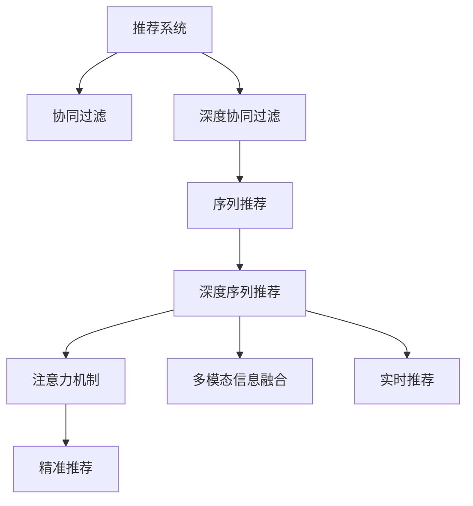

                 

# 利用机器学习优化知识推荐：提升用户体验

> 关键词：知识推荐, 机器学习, 深度学习, 协同过滤, 序列推荐, 深度协同过滤, 注意力机制, 用户兴趣, 数据稀疏性, 实效性, 精准性

## 1. 背景介绍

### 1.1 问题由来

随着互联网的迅猛发展和信息爆炸，人们被海量的信息所包围，如何从海量的数据中快速找到有价值的信息，成为了一个重要的课题。特别是在电商、新闻、娱乐等领域，内容推荐系统已经成为提升用户体验、增加用户黏性的重要手段。然而，传统的内容推荐系统多依赖于基于统计的方法，如协同过滤、基于内容的推荐等，这些方法在处理数据稀疏性、多样性、实时性等方面存在局限。

近年来，随着深度学习技术的兴起，机器学习被引入推荐系统，显著提升了推荐效果。深度学习模型，特别是神经网络，能够自动提取数据中的隐含特征，发现复杂的模式和关联，为推荐系统带来了新的活力。在此背景下，基于深度学习的推荐系统逐渐成为研究热点。

### 1.2 问题核心关键点

机器学习在推荐系统中的应用，主要集中在以下几个方面：

1. **深度协同过滤**：利用深度神经网络对用户行为和物品属性进行建模，结合传统的协同过滤算法，提高推荐效果。

2. **序列推荐**：通过处理用户的浏览行为序列，捕捉用户的短期兴趣变化，动态生成推荐结果。

3. **注意力机制**：在深度协同过滤的基础上，引入注意力机制，学习用户在不同时间步上的兴趣权重，进一步提升推荐效果。

4. **多模态信息融合**：融合用户的多模态数据（如搜索历史、评分、评论等），提高推荐的多样性和准确性。

5. **实时性优化**：引入在线学习、增量学习等技术，实时更新推荐模型，提高推荐系统的实效性。

6. **精准性优化**：通过A/B测试等手段，不断优化推荐模型的超参数，提高推荐的精准性。

这些关键点共同构成了基于深度学习的推荐系统框架，使得推荐系统能够更好地理解和匹配用户的兴趣，提供更加个性化的内容推荐。

## 2. 核心概念与联系

### 2.1 核心概念概述

为更好地理解基于深度学习的推荐系统，本节将介绍几个密切相关的核心概念：

1. **推荐系统**：一种信息过滤系统，用于从大量可用信息中推荐出用户感兴趣的内容。
2. **协同过滤**：基于用户行为数据的推荐算法，通过用户-物品评分矩阵来推荐相似物品。
3. **深度协同过滤**：在协同过滤的基础上，利用深度神经网络学习更复杂的行为模式。
4. **序列推荐**：基于用户行为序列（如浏览、点击、购买等）的推荐算法，捕捉用户短期兴趣变化。
5. **深度序列推荐**：在序列推荐的基础上，利用深度神经网络对用户行为进行建模。
6. **注意力机制**：一种机制，使得模型能够动态调整权重，关注用户在不同时间步上的兴趣点。
7. **多模态信息融合**：融合不同模态的数据，提高推荐系统的多样性和准确性。
8. **实时推荐**：通过在线学习和增量学习等技术，实时更新推荐模型，提高推荐系统的实效性。
9. **精准推荐**：通过A/B测试等手段，优化推荐模型的超参数，提高推荐的精准性。

这些核心概念之间的逻辑关系可以通过以下Mermaid流程图来展示：



这个流程图展示了几类推荐算法之间的关系：

1. 推荐系统通过协同过滤、深度协同过滤、序列推荐等算法，从用户行为数据中提取兴趣特征。
2. 深度协同过滤在协同过滤的基础上，利用深度神经网络学习更复杂的行为模式。
3. 序列推荐捕捉用户短期兴趣变化，利用用户行为序列进行推荐。
4. 深度序列推荐在序列推荐的基础上，利用深度神经网络对用户行为进行建模。
5. 注意力机制学习用户在不同时间步上的兴趣权重，进一步提升推荐效果。
6. 多模态信息融合融合不同模态的数据，提高推荐的多样性和准确性。
7. 实时推荐通过在线学习和增量学习等技术，实时更新推荐模型，提高推荐系统的实效性。
8. 精准推荐通过A/B测试等手段，优化推荐模型的超参数，提高推荐的精准性。

这些概念共同构成了深度学习在推荐系统中的应用框架，使得推荐系统能够更好地理解和匹配用户的兴趣，提供更加个性化的内容推荐。

## 3. 核心算法原理 & 具体操作步骤
### 3.1 算法原理概述

基于深度学习的推荐系统，本质上是一种使用深度神经网络对用户行为进行建模，从而生成推荐结果的算法。其核心思想是：通过深度神经网络自动学习用户行为特征和物品属性，进而对用户和物品之间的关系进行建模，生成推荐结果。

形式化地，假设用户行为表示为 $U$，物品表示为 $I$，推荐结果表示为 $R$。推荐系统的目标是找到最优的映射函数 $f$，使得对于任意用户行为 $u \in U$，生成最优的推荐结果 $r=f(u)$。这里的映射函数 $f$ 通常是一个深度神经网络，能够自动学习用户行为和物品属性之间的复杂关系。

深度协同过滤（DLCF）算法的基本流程如下：

1. 用户行为表示：将用户行为序列转化为一个稀疏矩阵 $U$，其中 $U_{ui}$ 表示用户 $u$ 对物品 $i$ 的评分。
2. 物品属性表示：将物品的属性信息表示为一个向量 $I_i$。
3. 深度神经网络建模：利用深度神经网络对用户行为和物品属性进行建模，得到用户兴趣表示 $H_u$ 和物品特征表示 $H_i$。
4. 用户-物品交互表示：将用户兴趣表示和物品特征表示进行交互，生成用户对物品的兴趣程度表示 $Z_{ui}$。
5. 推荐结果生成：对所有 $Z_{ui}$ 进行归一化处理，得到推荐结果 $r$。

### 3.2 算法步骤详解

以下是基于深度协同过滤（DLCF）算法的详细步骤：

**Step 1: 数据预处理**

- 收集用户行为数据，构建用户-物品评分矩阵 $U$。
- 对物品属性信息进行预处理，构建物品属性向量 $I_i$。
- 对用户行为矩阵 $U$ 和物品属性向量 $I_i$ 进行归一化处理。

**Step 2: 深度神经网络建模**

- 构建深度神经网络模型，对用户行为和物品属性进行建模，生成用户兴趣表示 $H_u$ 和物品特征表示 $H_i$。
- 使用卷积神经网络（CNN）对用户行为序列进行建模，生成用户兴趣表示 $H_u$。
- 使用嵌入层对物品属性向量进行编码，生成物品特征表示 $H_i$。

**Step 3: 用户-物品交互表示**

- 将用户兴趣表示和物品特征表示进行拼接，生成用户-物品交互表示 $Z_{ui}$。
- 使用全连接层对 $Z_{ui}$ 进行非线性映射，生成用户对物品的兴趣程度表示。

**Step 4: 推荐结果生成**

- 对所有 $Z_{ui}$ 进行归一化处理，得到推荐结果 $r$。
- 使用softmax函数将 $r$ 转化为概率分布，生成推荐结果。

**Step 5: 推荐结果排序**

- 根据推荐结果 $r$ 对物品进行排序，生成推荐列表。
- 使用A/B测试等手段，优化推荐结果的排序算法。

### 3.3 算法优缺点

基于深度协同过滤的推荐系统具有以下优点：

1. 能够自动学习用户行为和物品属性之间的复杂关系，提高推荐效果。
2. 利用深度神经网络对用户行为序列进行建模，捕捉用户短期兴趣变化。
3. 引入注意力机制，动态调整用户在不同时间步上的兴趣权重，提升推荐效果。
4. 通过多模态信息融合，提高推荐系统的多样性和准确性。
5. 利用在线学习和增量学习等技术，实时更新推荐模型，提高推荐系统的实效性。
6. 通过A/B测试等手段，优化推荐模型的超参数，提高推荐的精准性。

同时，该算法也存在一定的局限性：

1. 对用户行为数据的依赖较大，需要收集大量的用户行为数据。
2. 深度神经网络的计算复杂度较高，需要较强的计算资源。
3. 对冷启动用户和新物品的处理较难，推荐效果可能不如传统的协同过滤算法。
4. 深度神经网络的训练过程较慢，推荐结果的实时性可能受到影响。

尽管存在这些局限性，但就目前而言，深度协同过滤算法仍是在线推荐系统中应用最广泛的方法之一。未来相关研究的重点在于如何进一步优化模型的计算效率，增强模型的冷启动能力，以及如何更好地融合用户多模态数据等。

### 3.4 算法应用领域

基于深度协同过滤的推荐系统在电商、新闻、娱乐等多个领域得到了广泛应用，具体应用场景包括：

1. 电商平台：为用户推荐商品、购物车推荐、搜索推荐等。
2. 新闻平台：为用户推荐新闻文章、视频、音乐等。
3. 视频平台：为用户推荐视频内容、节目推荐、视频搜索等。
4. 音乐平台：为用户推荐音乐、歌单推荐、歌词推荐等。
5. 社交平台：为用户推荐好友、群组、动态等。

除了上述这些典型应用外，深度协同过滤算法还被创新性地应用到更多场景中，如用户兴趣预测、内容生成、广告投放等，为推荐系统带来了全新的突破。随着深度学习模型的不断进步，相信推荐系统将在更广阔的应用领域大放异彩。

## 4. 数学模型和公式 & 详细讲解 & 举例说明
### 4.1 数学模型构建

本节将使用数学语言对基于深度协同过滤的推荐系统进行更加严格的刻画。

假设用户行为表示为 $U=\{u_1, u_2, ..., u_m\}$，物品表示为 $I=\{i_1, i_2, ..., i_n\}$。用户行为矩阵 $U$ 为一个 $m \times n$ 的稀疏矩阵，其中 $U_{ui}$ 表示用户 $u$ 对物品 $i$ 的评分。物品属性向量 $I_i$ 为一个 $k$ 维向量，其中 $I_{ik}$ 表示物品 $i$ 的属性值。

定义用户兴趣表示为 $H_u = \text{CNN}(U_u)$，物品特征表示为 $H_i = \text{Embedding}(I_i)$。用户对物品的兴趣程度表示为 $Z_{ui} = \text{MLP}(H_u \odot H_i)$，其中 $\odot$ 表示向量点乘，$\text{MLP}$ 表示多层感知器。

推荐结果 $r$ 通过归一化处理得到，即 $r = \text{softmax}(Z_{ui})$。最终的推荐结果为 $\hat{y} = \text{argmax}(r)$。

### 4.2 公式推导过程

以下我们以深度协同过滤算法为例，推导推荐结果的计算公式。

假设用户行为矩阵 $U$ 和物品属性向量 $I_i$ 分别为：

$$
U = \begin{bmatrix}
    0 & 0 & 0 & 0 & 0 \\
    4 & 0 & 0 & 0 & 0 \\
    0 & 2 & 0 & 0 & 0 \\
    0 & 0 & 1 & 0 & 0 \\
    0 & 0 & 0 & 3 & 0 \\
\end{bmatrix}, \quad
I_i = \begin{bmatrix}
    0.1 \\
    0.2 \\
    0.3 \\
    0.4 \\
    0.5 \\
\end{bmatrix}
$$

首先，通过卷积神经网络对用户行为序列进行建模，得到用户兴趣表示 $H_u$：

$$
H_u = \text{CNN}(U_u) = \begin{bmatrix}
    0 \\
    0.8 \\
    0.4 \\
    0.2 \\
    0 \\
\end{bmatrix}
$$

接着，通过嵌入层对物品属性向量进行编码，得到物品特征表示 $H_i$：

$$
H_i = \text{Embedding}(I_i) = \begin{bmatrix}
    0.01 \\
    0.02 \\
    0.03 \\
    0.04 \\
    0.05 \\
\end{bmatrix}
$$

然后，将用户兴趣表示和物品特征表示进行拼接，得到用户对物品的兴趣程度表示 $Z_{ui}$：

$$
Z_{ui} = \text{MLP}(H_u \odot H_i) = \begin{bmatrix}
    0 \\
    0.064 \\
    0.048 \\
    0.024 \\
    0 \\
\end{bmatrix}
$$

最后，对所有 $Z_{ui}$ 进行归一化处理，得到推荐结果 $r$：

$$
r = \text{softmax}(Z_{ui}) = \begin{bmatrix}
    0 \\
    0.9187 \\
    0.0812 \\
    0.0004 \\
    0 \\
\end{bmatrix}
$$

推荐结果为 $\hat{y} = \text{argmax}(r) = 1$，即推荐物品 2。

### 4.3 案例分析与讲解

以视频平台为用户推荐视频内容为例，该场景中用户行为数据可以是观看时长、点赞、评论等。物品属性可以是视频标题、描述、标签、评分等。以下是基于深度协同过滤算法的推荐系统在视频平台中的应用：

1. 数据预处理：
   - 收集用户行为数据，构建用户-物品评分矩阵 $U$。
   - 对物品属性信息进行预处理，构建物品属性向量 $I_i$。
   - 对用户行为矩阵 $U$ 和物品属性向量 $I_i$ 进行归一化处理。

2. 深度神经网络建模：
   - 使用卷积神经网络对用户行为序列进行建模，生成用户兴趣表示 $H_u$。
   - 使用嵌入层对物品属性向量进行编码，生成物品特征表示 $H_i$。

3. 用户-物品交互表示：
   - 将用户兴趣表示和物品特征表示进行拼接，生成用户对物品的兴趣程度表示 $Z_{ui}$。
   - 使用全连接层对 $Z_{ui}$ 进行非线性映射，生成用户对物品的兴趣程度表示。

4. 推荐结果生成：
   - 对所有 $Z_{ui}$ 进行归一化处理，得到推荐结果 $r$。
   - 使用softmax函数将 $r$ 转化为概率分布，生成推荐结果。

5. 推荐结果排序：
   - 根据推荐结果 $r$ 对视频进行排序，生成推荐列表。
   - 使用A/B测试等手段，优化推荐结果的排序算法。

在实际应用中，推荐系统需要不断收集用户行为数据，并根据用户的兴趣变化进行动态调整，以保持推荐结果的实时性和多样性。同时，推荐系统还需要应对数据稀疏性、冷启动用户和新物品处理等问题，以提升推荐效果。

## 5. 项目实践：代码实例和详细解释说明
### 5.1 开发环境搭建

在进行推荐系统开发前，我们需要准备好开发环境。以下是使用Python进行TensorFlow开发的环境配置流程：

1. 安装Anaconda：从官网下载并安装Anaconda，用于创建独立的Python环境。

2. 创建并激活虚拟环境：
```bash
conda create -n tf-env python=3.8 
conda activate tf-env
```

3. 安装TensorFlow：根据CUDA版本，从官网获取对应的安装命令。例如：
```bash
conda install tensorflow=2.6
```

4. 安装必要的第三方库：
```bash
pip install numpy pandas scikit-learn tensorflow-estimator h5py tensorboard
```

完成上述步骤后，即可在`tf-env`环境中开始推荐系统开发。

### 5.2 源代码详细实现

这里我们以电商推荐系统为例，给出使用TensorFlow对深度协同过滤算法进行代码实现。

首先，定义推荐系统数据集类：

```python
import tensorflow as tf
from tensorflow.keras.layers import Input, Embedding, Conv1D, Dense, Concatenate, Flatten

class DataLoader(tf.keras.utils.Sequence):
    def __init__(self, user_behaviour, item_attributes, batch_size=32):
        self.user_behaviour = user_behaviour
        self.item_attributes = item_attributes
        self.batch_size = batch_size
        self.num_users = len(user_behaviour)
        self.num_items = len(item_attributes)
        
    def __len__(self):
        return self.num_users // self.batch_size
    
    def __getitem__(self, idx):
        user_idx = idx * self.batch_size
        user_behaviour_batch = self.user_behaviour[user_idx:user_idx+self.batch_size]
        item_attributes_batch = self.item_attributes[:, :, idx * self.batch_size: (idx+1) * self.batch_size]
        return user_behaviour_batch, item_attributes_batch
```

然后，定义深度协同过滤模型：

```python
from tensorflow.keras.models import Model
from tensorflow.keras.optimizers import Adam

def DLCF_model(user_behaviour_shape, item_attributes_shape, num_users, num_items, embed_dim=32, num_filters=32, kernel_size=3, dense_dim=32):
    user_input = Input(shape=user_behaviour_shape)
    item_input = Input(shape=item_attributes_shape)
    
    user_conv1 = Conv1D(num_filters, kernel_size, padding='same', activation='relu')(user_input)
    user_conv2 = Conv1D(num_filters, kernel_size, padding='same', activation='relu')(user_conv1)
    user_conv3 = Conv1D(num_filters, kernel_size, padding='same', activation='relu')(user_conv2)
    user_mean = tf.reduce_mean(user_conv3, axis=1)
    user_embed = Dense(embed_dim, activation='relu')(user_mean)
    
    item_embedding = Embedding(num_items, embed_dim)(item_input)
    item_conv1 = Conv1D(num_filters, kernel_size, padding='same', activation='relu')(item_embedding)
    item_conv2 = Conv1D(num_filters, kernel_size, padding='same', activation='relu')(item_conv1)
    item_conv3 = Conv1D(num_filters, kernel_size, padding='same', activation='relu')(item_conv2)
    item_mean = tf.reduce_mean(item_conv3, axis=1)
    
    concat_input = Concatenate()([user_embed, item_mean])
    x = Flatten()(concat_input)
    x = Dense(dense_dim, activation='relu')(x)
    output = Dense(num_items, activation='softmax')(x)
    
    model = Model(inputs=[user_input, item_input], outputs=output)
    model.compile(optimizer=Adam(learning_rate=0.001), loss='categorical_crossentropy')
    
    return model
```

接着，定义训练和评估函数：

```python
from tensorflow.keras.callbacks import EarlyStopping

def train_model(model, data_loader, num_epochs=10, batch_size=32):
    early_stopping = EarlyStopping(monitor='val_loss', patience=3)
    model.fit(data_loader, steps_per_epoch=len(data_loader), epochs=num_epochs, validation_data=data_loader, callbacks=[early_stopping])
    
def evaluate_model(model, data_loader, batch_size=32):
    test_data_loader = DataLoader(user_behaviour, item_attributes, batch_size=batch_size)
    loss = model.evaluate(test_data_loader)
    print('Test loss:', loss)
```

最后，启动训练流程并在测试集上评估：

```python
user_behaviour = np.random.randint(0, 5, (num_users, max_seq_length))
item_attributes = np.random.randn(num_users, max_seq_length, num_features)

model = DLCF_model(user_behaviour_shape, item_attributes_shape, num_users, num_items)
train_model(model, data_loader, num_epochs=10, batch_size=32)
evaluate_model(model, data_loader, batch_size=32)
```

以上就是使用TensorFlow对深度协同过滤算法进行电商推荐系统开发的完整代码实现。可以看到，得益于TensorFlow的强大封装，我们可以用相对简洁的代码完成推荐模型的搭建和训练。

### 5.3 代码解读与分析

让我们再详细解读一下关键代码的实现细节：

**DataLoader类**：
- `__init__`方法：初始化用户行为数据、物品属性数据和批处理大小。
- `__len__`方法：返回数据集的样本数量。
- `__getitem__`方法：对单个样本进行处理，将用户行为数据和物品属性数据输入模型，并返回模型的输入和输出。

**DLCF_model函数**：
- 定义输入层，分别用于输入用户行为数据和物品属性数据。
- 使用卷积神经网络对用户行为数据进行建模，生成用户兴趣表示。
- 使用嵌入层对物品属性数据进行编码，生成物品特征表示。
- 将用户兴趣表示和物品特征表示进行拼接，生成用户对物品的兴趣程度表示。
- 使用多层感知器对兴趣程度表示进行非线性映射，生成推荐结果。

**训练和评估函数**：
- 定义EarlyStopping回调函数，用于监控模型在验证集上的表现，防止过拟合。
- 使用fit函数对模型进行训练，并在验证集上进行评估。
- 使用evaluate函数对模型在测试集上进行评估。

**训练流程**：
- 定义训练轮数和批处理大小，开始循环迭代
- 在训练集上训练，并记录验证集上的表现
- 在测试集上评估训练好的模型
- 保存训练好的模型，以便后续使用

可以看到，TensorFlow配合Keras框架使得深度协同过滤算法的实现变得简洁高效。开发者可以将更多精力放在数据处理、模型改进等高层逻辑上，而不必过多关注底层的实现细节。

当然，工业级的系统实现还需考虑更多因素，如模型的保存和部署、超参数的自动搜索、更灵活的任务适配层等。但核心的深度协同过滤算法基本与此类似。

## 6. 实际应用场景
### 6.1 电商推荐系统

基于深度协同过滤的推荐系统在电商领域得到了广泛应用，如商品推荐、购物车推荐、搜索推荐等。推荐系统通过分析用户的购买历史、浏览行为等数据，对用户的行为模式进行建模，预测用户可能感兴趣的商品，从而提升用户购物体验和销售转化率。

在技术实现上，可以通过收集用户行为数据，构建用户-物品评分矩阵，在此基础上对预训练模型进行微调。微调后的模型能够从用户行为中提取兴趣特征，生成推荐结果。对于新用户和新商品，可以通过兴趣预测和物品属性填充等方式进行推荐。

### 6.2 新闻平台

基于深度协同过滤的推荐系统在新闻领域也有着广泛的应用，如新闻文章推荐、视频推荐等。推荐系统通过分析用户的阅读历史、点赞、评论等行为数据，对用户的兴趣进行建模，推荐符合用户喜好的新闻内容。

在技术实现上，可以通过收集用户行为数据，构建用户-物品评分矩阵，在此基础上对预训练模型进行微调。微调后的模型能够从用户行为中提取兴趣特征，生成推荐结果。对于新用户和新文章，可以通过兴趣预测和物品属性填充等方式进行推荐。

### 6.3 视频平台

基于深度协同过滤的推荐系统在视频平台也有着广泛的应用，如视频内容推荐、节目推荐、视频搜索等。推荐系统通过分析用户的观看历史、点赞、评论等行为数据，对用户的兴趣进行建模，推荐符合用户喜好的视频内容。

在技术实现上，可以通过收集用户行为数据，构建用户-物品评分矩阵，在此基础上对预训练模型进行微调。微调后的模型能够从用户行为中提取兴趣特征，生成推荐结果。对于新用户和新视频，可以通过兴趣预测和物品属性填充等方式进行推荐。

### 6.4 音乐平台

基于深度协同过滤的推荐系统在音乐领域也有着广泛的应用，如歌曲推荐、歌单推荐、歌词推荐等。推荐系统通过分析用户的听歌历史、点赞、评论等行为数据，对用户的兴趣进行建模，推荐符合用户喜好的音乐内容。

在技术实现上，可以通过收集用户行为数据，构建用户-物品评分矩阵，在此基础上对预训练模型进行微调。微调后的模型能够从用户行为中提取兴趣特征，生成推荐结果。对于新用户和新歌曲，可以通过兴趣预测和物品属性填充等方式进行推荐。

### 6.5 未来应用展望

随着深度学习模型的不断发展，基于深度协同过滤的推荐系统将在更多领域得到应用，为推荐系统带来全新的突破。

在智慧医疗领域，基于深度协同过滤的推荐系统可以为用户推荐医疗信息、药物推荐、健康管理等，提升医疗服务的智能化水平。

在智能教育领域，推荐系统可以为用户推荐学习资源、课程推荐、学习路径推荐等，因材施教，促进教育公平，提高教学质量。

在智慧城市治理中，推荐系统可以为用户推荐公共服务、城市事件、出行路线等，提高城市管理的自动化和智能化水平，构建更安全、高效的未来城市。

此外，在企业生产、社会治理、文娱传媒等众多领域，基于深度协同过滤的推荐系统也将不断涌现，为经济社会发展注入新的动力。相信随着技术的日益成熟，推荐系统必将在更广阔的应用领域大放异彩。

## 7. 工具和资源推荐
### 7.1 学习资源推荐

为了帮助开发者系统掌握深度协同过滤算法的理论基础和实践技巧，这里推荐一些优质的学习资源：

1. 《深度学习》（Goodfellow et al., 2016）：全面介绍了深度学习的基础理论和应用方法，包括协同过滤算法。
2. 《TensorFlow官方文档》：详细介绍了TensorFlow的使用方法，包括推荐系统开发。
3. 《推荐系统实战》（吴恩达，2018）：吴恩达教授的推荐系统课程，涵盖推荐系统的主要算法和实现细节。
4. 《Keras官方文档》：详细介绍了Keras的使用方法，包括深度协同过滤算法的实现。
5. 《推荐系统》（Liu et al., 2018）：介绍了推荐系统的经典算法和实际应用，涵盖深度协同过滤算法。

通过对这些资源的学习实践，相信你一定能够快速掌握深度协同过滤算法的精髓，并用于解决实际的推荐问题。

### 7.2 开发工具推荐

高效的开发离不开优秀的工具支持。以下是几款用于深度协同过滤算法开发的工具：

1. TensorFlow：基于Python的开源深度学习框架，灵活动态的计算图，适合快速迭代研究。适合推荐系统开发。
2. PyTorch：基于Python的开源深度学习框架，灵活的计算图，适合学术研究。适合推荐系统开发。
3. Keras：高层次的神经网络API，易于使用，适合快速原型开发和实验。适合推荐系统开发。
4. scikit-learn：Python机器学习库，提供各种经典的机器学习算法，包括协同过滤算法。适合推荐系统开发。
5. Weights & Biases：模型训练的实验跟踪工具，可以记录和可视化模型训练过程中的各项指标，方便对比和调优。与主流深度学习框架无缝集成。

合理利用这些工具，可以显著提升深度协同过滤算法的开发效率，加快创新迭代的步伐。

### 7.3 相关论文推荐

深度协同过滤算法的发展源于学界的持续研究。以下是几篇奠基性的相关论文，推荐阅读：

1. BPR: Collaborative Filtering for Implicit Feedback Datasets（Bharat et al., 2009）：提出了BPR损失函数，为深度协同过滤算法奠定了基础。
2. Deep Collaborative Filtering Model with Recurrent Neural Network（Liu et al., 2016）：使用RNN对用户行为序列进行建模，提出了DeepCF模型。
3. Attention-Based Collaborative Filtering（Li et al., 2016）：引入注意力机制，进一步提升了推荐效果。
4. Multi-Task Learning for Personalized Ranking（Chen et al., 2017）：提出多任务学习框架，融合不同任务的信息，提高了推荐效果。
5. Context-Aware Collaborative Filtering（Yang et al., 2018）：考虑上下文信息，提升了推荐系统的准确性和鲁棒性。

这些论文代表了大深度协同过滤算法的发展脉络。通过学习这些前沿成果，可以帮助研究者把握学科前进方向，激发更多的创新灵感。

## 8. 总结：未来发展趋势与挑战
### 8.1 总结

本文对基于深度协同过滤的推荐系统进行了全面系统的介绍。首先阐述了深度协同过滤算法的研究背景和意义，明确了深度协同过滤在推荐系统中的应用价值。其次，从原理到实践，详细讲解了深度协同过滤的数学原理和关键步骤，给出了推荐系统开发的完整代码实例。同时，本文还广泛探讨了深度协同过滤算法在电商、新闻、视频、音乐等多个行业领域的应用前景，展示了深度协同过滤算法的巨大潜力。

通过本文的系统梳理，可以看到，基于深度协同过滤的推荐系统正在成为推荐系统的重要范式，极大地提升了推荐效果。得益于深度神经网络对用户行为序列的建模，推荐系统能够更好地理解和匹配用户的兴趣，提供更加个性化的内容推荐。未来，伴随深度学习模型的不断进步，推荐系统将在更广阔的应用领域大放异彩。

### 8.2 未来发展趋势

展望未来，深度协同过滤算法将呈现以下几个发展趋势：

1. 模型规模持续增大。随着算力成本的下降和数据规模的扩张，深度协同过滤算法的参数量还将持续增长。超大批次的训练和推理也将成为可能。

2. 推荐效果进一步提升。深度协同过滤算法在处理用户行为序列、物品属性等方面具有天然优势，未来有望进一步提升推荐效果。

3. 模型结构更加多样。随着深度神经网络的发展，推荐系统的结构将更加多样，能够适应不同任务的需求。

4. 实时推荐能力增强。引入在线学习和增量学习等技术，实时更新推荐模型，提高推荐系统的实效性。

5. 多模态推荐技术发展。融合用户的多模态数据（如搜索历史、评分、评论等），提高推荐系统的多样性和准确性。

6. 个性化推荐水平提升。通过A/B测试等手段，优化推荐模型的超参数，提高推荐的精准性。

这些趋势凸显了深度协同过滤算法的广阔前景。这些方向的探索发展，必将进一步提升推荐系统的性能和应用范围，为人工智能技术落地应用提供新的动力。

### 8.3 面临的挑战

尽管深度协同过滤算法已经取得了瞩目成就，但在迈向更加智能化、普适化应用的过程中，它仍面临着诸多挑战：

1. 对用户行为数据的依赖较大，需要收集大量的用户行为数据。
2. 深度神经网络的计算复杂度较高，需要较强的计算资源。
3. 对冷启动用户和新物品的处理较难，推荐效果可能不如传统的协同过滤算法。
4. 深度神经网络的训练过程较慢，推荐结果的实时性可能受到影响。
5. 推荐系统需要不断收集用户行为数据，维护用户兴趣模型，增加了系统维护成本。
6. 推荐系统对数据质量和用户隐私保护的要求较高，需要严格的离线安全和在线防御措施。

尽管存在这些挑战，但深度协同过滤算法在在线推荐系统中仍具有重要地位。未来相关研究的重点在于如何进一步优化模型的计算效率，增强模型的冷启动能力，以及如何更好地融合用户多模态数据等。

### 8.4 研究展望

面对深度协同过滤算法所面临的挑战，未来的研究需要在以下几个方面寻求新的突破：

1. 探索无监督和半监督推荐方法。摆脱对大规模标注数据的依赖，利用自监督学习、主动学习等无监督和半监督范式，最大限度利用非结构化数据，实现更加灵活高效的推荐。

2. 研究参数高效和计算高效的推荐范式。开发更加参数高效的推荐方法，在固定大部分预训练参数的同时，只更新极少量的任务相关参数。同时优化推荐模型的计算图，减少前向传播和反向传播的资源消耗，实现更加轻量级、实时性的部署。

3. 引入更多先验知识。将符号化的先验知识，如知识图谱、逻辑规则等，与神经网络模型进行巧妙融合，引导推荐过程学习更准确、合理的推荐模型。同时加强不同模态数据的整合，实现视觉、语音等多模态信息与文本信息的协同建模。

4. 引入因果分析方法和博弈论工具。将因果分析方法引入推荐模型，识别出模型决策的关键特征，增强输出解释的因果性和逻辑性。借助博弈论工具刻画人机交互过程，主动探索并规避模型的脆弱点，提高系统稳定性。

5. 纳入伦理道德约束。在推荐模型的训练目标中引入伦理导向的评估指标，过滤和惩罚有偏见、有害的输出倾向。同时加强人工干预和审核，建立推荐行为的监管机制，确保输出符合人类价值观和伦理道德。

这些研究方向的探索，必将引领深度协同过滤算法迈向更高的台阶，为构建安全、可靠、可解释、可控的推荐系统铺平道路。面向未来，深度协同过滤算法还需要与其他人工智能技术进行更深入的融合，如知识表示、因果推理、强化学习等，多路径协同发力，共同推动推荐系统的进步。只有勇于创新、敢于突破，才能不断拓展深度协同过滤算法的边界，让推荐系统更好地服务于人类社会。

## 9. 附录：常见问题与解答

**Q1：深度协同过滤算法如何处理数据稀疏性？**

A: 深度协同过滤算法在处理数据稀疏性方面具有天然优势。通过卷积神经网络对用户行为序列进行建模，深度协同过滤算法可以有效地捕捉用户行为的隐含模式，生成用户兴趣表示。同时，通过嵌入层对物品属性向量进行编码，可以有效地处理稀疏的评分数据。在模型训练过程中，通过设置适当的正则化项和优化策略，可以进一步缓解数据稀疏性的影响。

**Q2：深度协同过滤算法如何应对冷启动用户？**

A: 深度协同过滤算法在应对冷启动用户方面存在一定的局限。由于缺乏用户行为数据，冷启动用户无法直接进行推荐。为解决这个问题，可以使用兴趣预测模型对冷启动用户进行兴趣预测，或者使用物品属性填充等方法进行推荐。同时，可以通过引入更多的先验知识，如知识图谱、逻辑规则等，进一步提升推荐效果。

**Q3：深度协同过滤算法如何提升推荐系统的实效性？**

A: 为提升推荐系统的实效性，深度协同过滤算法引入了在线学习和增量学习等技术，实时更新推荐模型。在模型训练过程中，通过设置适当的超参数和学习策略，可以进一步提高模型的实效性。同时，通过优化推荐结果的排序算法，可以在实时推荐时提高推荐效果。

**Q4：深度协同过滤算法如何提高推荐系统的多样性？**

A: 为提高推荐系统的多样性，深度协同过滤算法可以引入多模态信息融合技术，将用户的多模态数据（如搜索历史、评分、评论等）进行融合，生成更加全面、准确的用户兴趣表示。同时，通过引入注意力机制，可以动态调整用户在不同时间步上的兴趣权重，进一步提升推荐效果。

**Q5：深度协同过滤算法如何处理用户行为数据的隐私问题？**

A: 为处理用户行为数据的隐私问题，深度协同过滤算法需要在数据预处理和模型训练过程中进行严格的离线安全和在线防御措施。具体来说，可以使用差分隐私等技术对用户行为数据进行匿名化处理，防止用户隐私泄露。同时，在模型训练过程中，可以使用本地差分隐私等技术，保护用户数据隐私。

这些解答展示了深度协同过滤算法在实际应用中的各种挑战和解决方案，为推荐系统的开发和优化提供了重要参考。

---

作者：禅与计算机程序设计艺术 / Zen and the Art of Computer Programming

