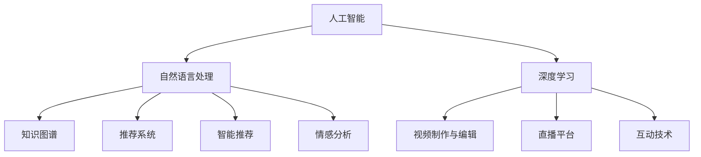

                 

# 制作寓教于乐的知识类脱口秀节目

> 关键词：人工智能,机器学习,深度学习,自然语言处理,NLP,视频制作,直播平台,互动技术,用户参与,教育娱乐

## 1. 背景介绍

在信息技术快速发展的今天，知识和信息的获取与传播方式正在经历翻天覆地的变化。传统的单一文字、图片、视频内容已经无法满足人们对于内容互动性和丰富性的需求。知识类脱口秀节目作为新兴的内容形式，结合了知识传授与娱乐互动的优点，成为近年来互联网内容消费中的新宠。如何利用最新的人工智能和自然语言处理技术，制作出既有趣又富有教育价值的脱口秀节目，成为各平台和创作者面临的挑战。

### 1.1 新兴趋势

知识类脱口秀节目结合了知识传授和娱乐互动的优点，成为内容消费的新趋势。相较于传统的单一文字、图片、视频内容，知识类脱口秀节目不仅形式新颖，内容生动，更能够调动观众的参与热情，提升学习效果。在教育娱乐的双重目标下，知识类脱口秀节目不仅提升了观众的知识储备，还加深了他们对学习内容的兴趣，具备广泛的应用前景。

### 1.2 技术挑战

制作知识类脱口秀节目需要解决一系列技术难题，主要包括：
- **内容生成：** 制作高质量的内容，尤其是结合最新技术进行内容创作。
- **互动设计：** 设计互动环节，提高观众的参与度和学习效果。
- **技术融合：** 将人工智能和自然语言处理技术融入节目制作流程中，提升内容创作效率和节目质量。
- **用户参与：** 搭建用户互动平台，支持观众的实时反馈和参与。

## 2. 核心概念与联系

### 2.1 核心概念概述

为更好地理解如何利用人工智能和自然语言处理技术制作知识类脱口秀节目，本节将介绍几个密切相关的核心概念：

- **人工智能(AI)**：通过计算机程序实现的任务自动化，包括机器学习、自然语言处理、计算机视觉等。
- **自然语言处理(NLP)**：研究如何让计算机理解和处理人类语言的技术。包括文本分析、信息提取、语音识别等。
- **深度学习(Deep Learning)**：一类基于人工神经网络的机器学习方法，通过多层次的特征抽象，实现更高级别的任务。
- **知识图谱(Knowledge Graph)**：由节点和边组成的图形结构，用于表示实体之间的关系。常用于知识表示、实体关系抽取等。
- **推荐系统(Recommendation System)**：通过分析用户的历史行为和兴趣，推荐个性化的内容。广泛应用于视频平台、电商平台等。
- **智能推荐**：结合用户历史数据和实时行为，进行动态推荐，提升用户体验。
- **情感分析(Emotion Analysis)**：分析文本中的情感倾向，用于内容推荐、用户画像构建等。
- **视频制作与编辑**：结合视频剪辑、特效制作等技术，生成高质量的视觉内容。
- **直播平台(Live Streaming Platform)**：提供实时视频和音频传输服务，支持观众互动。
- **互动技术(Interactive Technology)**：结合AR/VR、手势识别等技术，实现用户与内容的互动。

这些核心概念之间的逻辑关系可以通过以下Mermaid流程图来展示：



这个流程图展示了大语言模型制作知识类脱口秀节目的核心概念及其之间的关系：

1. 人工智能和深度学习为节目内容生成和互动设计提供了技术基础。
2. 自然语言处理技术用于文本分析和内容生成。
3. 知识图谱用于构建实体关系，支持信息抽取和推理。
4. 推荐系统和智能推荐用于个性化的内容推荐。
5. 情感分析用于用户行为分析和情感互动设计。
6. 视频制作与编辑技术用于制作高质量的视频内容。
7. 直播平台和互动技术用于实时传输和互动。

## 3. 核心算法原理 & 具体操作步骤

### 3.1 算法原理概述

制作知识类脱口秀节目需要综合应用人工智能和自然语言处理技术，主要包括内容生成、互动设计、情感分析等多个环节。以自然语言处理技术为例，其核心原理如下：

- **文本预处理**：包括分词、去除停用词、词性标注等，用于文本分析的基础工作。
- **情感分析**：通过机器学习算法，分析文本中的情感倾向，用于节目内容和互动的设计。
- **信息抽取**：从文本中提取关键信息，如实体、关系等，用于内容推荐和知识图谱构建。
- **文本生成**：利用生成模型，根据已有知识生成新的文本内容，用于脱口秀节目的内容创作。
- **对话系统**：基于聊天机器人的对话生成技术，用于节目中的互动环节。

### 3.2 算法步骤详解

制作知识类脱口秀节目的具体步骤包括：

**Step 1: 内容设计**
- 确定节目主题和结构，规划各环节的内容。
- 收集相关知识和信息，构建知识库。
- 设计对话脚本和互动环节，准备问题与回答。

**Step 2: 数据处理**
- 对收集到的文本数据进行预处理，包括分词、去停用词、词性标注等。
- 使用情感分析工具，对文本进行情感倾向分析。
- 利用信息抽取技术，从文本中提取关键实体和关系。

**Step 3: 模型训练**
- 基于收集到的数据，训练情感分析模型和信息抽取模型。
- 利用生成模型训练文本生成系统，生成对话内容。
- 利用聊天机器人技术，构建对话系统。

**Step 4: 内容生成与互动设计**
- 根据设计好的内容框架和互动环节，生成相应的对话和文本内容。
- 利用聊天机器人，实时与观众进行互动。
- 根据观众的实时反馈，动态调整内容。

**Step 5: 视频制作与编辑**
- 利用视频制作软件，剪辑和处理生成的视频内容。
- 添加特效和动画，提升视觉效果。
- 将生成的视频和音频内容上传至直播平台。

**Step 6: 直播与互动**
- 在直播平台上进行节目直播，支持观众实时观看和互动。
- 根据观众的反馈，实时调整节目内容和互动环节。
- 收集观众的评价和反馈，进行数据统计和分析。

### 3.3 算法优缺点

制作知识类脱口秀节目的主要优点包括：
- **创新性**：结合人工智能和自然语言处理技术，内容形式新颖，具有吸引力和教育价值。
- **互动性**：利用互动技术和直播平台，提升观众参与度，增强学习效果。
- **效率高**：利用机器学习和生成模型，内容生成效率高，生产成本低。
- **覆盖面广**：可以覆盖广泛的知识领域，适应不同层次的观众需求。

同时，该方法也存在以下局限性：
- **内容质量难以保证**：机器生成的内容质量可能不稳定，需要人工审核和优化。
- **互动设计复杂**：需要设计复杂的互动环节，增加了制作难度。
- **用户参与度依赖技术**：依赖技术实现用户互动，技术故障可能影响互动效果。
- **隐私和伦理问题**：需要处理用户的实时反馈和数据，涉及隐私保护和伦理问题。

尽管存在这些局限性，但就目前而言，结合人工智能和自然语言处理技术制作知识类脱口秀节目，仍是一种高效、创新的内容创作方式。未来相关研究的重点在于如何进一步提升内容质量和互动设计，同时兼顾用户隐私和伦理安全等因素。

### 3.4 算法应用领域

知识类脱口秀节目已经广泛应用于多个领域，例如：

- **教育培训**：利用AI和NLP技术，制作教育类脱口秀节目，帮助学生更好地理解和掌握知识。
- **科普宣传**：制作科普类脱口秀节目，普及科学知识，提升公众科学素养。
- **职场技能培训**：制作职场技能培训类节目，帮助员工提升职业技能。
- **健康医疗**：制作健康医疗类节目，普及健康知识，指导健康生活方式。
- **娱乐休闲**：结合娱乐元素和知识内容，制作休闲娱乐类节目，提升观众兴趣。

## 4. 数学模型和公式 & 详细讲解 & 举例说明

### 4.1 数学模型构建

本节将使用数学语言对知识类脱口秀节目的内容生成和互动设计过程进行更加严格的刻画。

假设我们要制作一档关于“人工智能”的脱口秀节目，首先需要构建一些数学模型，以便于内容生成和互动设计。

- **内容生成模型**：$G$，用于生成对话脚本和互动内容。
- **情感分析模型**：$E$，用于分析观众反馈的情感倾向。
- **互动设计模型**：$I$，用于设计互动环节和生成问题。

内容生成模型的输入为知识库中的信息，输出为对话脚本和互动内容。情感分析模型的输入为观众反馈文本，输出为情感倾向得分。互动设计模型的输入为当前节目内容，输出为互动问题和环节。

### 4.2 公式推导过程

以下我们以情感分析模型为例，推导其基本公式及其梯度计算。

假设观众反馈文本为 $x$，情感分析模型的输出为情感得分 $y$。则情感分析模型可以表示为：

$$
y = E(x;\theta_E) = f(E_\theta(x))
$$

其中 $\theta_E$ 为模型参数，$f$ 为情感分析的激活函数，$E_\theta(x)$ 为情感分析的计算公式。假设 $E_\theta(x)$ 为一个神经网络模型，其输出层为情感得分，则其计算公式可以表示为：

$$
E_\theta(x) = \sum_i W_i h_i(x) + b_i
$$

其中 $W_i$ 为权重矩阵，$h_i(x)$ 为隐藏层节点，$b_i$ 为偏置项。假设激活函数 $f$ 为 sigmoid 函数，则情感得分的计算公式为：

$$
y = f(E_\theta(x)) = \frac{1}{1+e^{-E_\theta(x)}}
$$

根据链式法则，情感分析模型的梯度计算公式为：

$$
\frac{\partial L}{\partial \theta_E} = \frac{\partial L}{\partial y} \frac{\partial y}{\partial E_\theta(x)} \frac{\partial E_\theta(x)}{\partial \theta_E}
$$

其中 $L$ 为损失函数，$\partial L/\partial y$ 为损失函数对情感得分的梯度，$\partial y/\partial E_\theta(x)$ 为激活函数对情感分析输出的梯度，$\partial E_\theta(x)/\partial \theta_E$ 为模型参数的梯度。

在得到情感分析模型的梯度后，即可带入优化算法，完成模型的迭代优化。重复上述过程直至收敛，最终得到适应当前节目情感分析的最优模型参数 $\theta_E$。

## 5. 项目实践：代码实例和详细解释说明

### 5.1 开发环境搭建

在进行知识类脱口秀节目的内容生成和互动设计前，我们需要准备好开发环境。以下是使用Python进行PyTorch开发的环境配置流程：

1. 安装Anaconda：从官网下载并安装Anaconda，用于创建独立的Python环境。

2. 创建并激活虚拟环境：
```bash
conda create -n pytorch-env python=3.8 
conda activate pytorch-env
```

3. 安装PyTorch：根据CUDA版本，从官网获取对应的安装命令。例如：
```bash
conda install pytorch torchvision torchaudio cudatoolkit=11.1 -c pytorch -c conda-forge
```

4. 安装TensorFlow：使用pip安装TensorFlow，例如：
```bash
pip install tensorflow
```

5. 安装各类工具包：
```bash
pip install numpy pandas scikit-learn matplotlib tqdm jupyter notebook ipython
```

完成上述步骤后，即可在`pytorch-env`环境中开始项目实践。

### 5.2 源代码详细实现

这里我们以情感分析模型为例，给出使用PyTorch实现情感分析的代码。

首先，定义情感分析模型的网络结构：

```python
import torch.nn as nn
import torch.optim as optim

class EmotionNet(nn.Module):
    def __init__(self, input_size, hidden_size, output_size):
        super(EmotionNet, self).__init__()
        self.hidden = nn.Linear(input_size, hidden_size)
        self.output = nn.Linear(hidden_size, output_size)
        self.relu = nn.ReLU()
        
    def forward(self, x):
        hidden = self.hidden(x)
        output = self.output(hidden)
        return self.relu(output)
```

然后，定义训练和评估函数：

```python
from torch.utils.data import DataLoader
from tqdm import tqdm
from sklearn.metrics import classification_report

device = torch.device('cuda') if torch.cuda.is_available() else torch.device('cpu')
model = EmotionNet(input_size, hidden_size, output_size).to(device)

criterion = nn.BCELoss()
optimizer = optim.Adam(model.parameters(), lr=0.001)

def train_epoch(model, data_loader, optimizer):
    model.train()
    for batch in tqdm(data_loader, desc='Training'):
        input = batch['input'].to(device)
        target = batch['target'].to(device)
        optimizer.zero_grad()
        output = model(input)
        loss = criterion(output, target)
        loss.backward()
        optimizer.step()
    return loss.item()

def evaluate(model, data_loader):
    model.eval()
    with torch.no_grad():
        correct = 0
        total = 0
        for batch in tqdm(data_loader, desc='Evaluating'):
            input = batch['input'].to(device)
            target = batch['target'].to(device)
            output = model(input)
            preds = output > 0.5
            correct += preds.sum().item()
            total += preds.size(0)
        print(classification_report(target.tolist(), preds.tolist()))
    return correct/total
```

最后，启动训练流程并在测试集上评估：

```python
epochs = 10
batch_size = 64

for epoch in range(epochs):
    loss = train_epoch(model, train_data_loader, optimizer)
    print(f"Epoch {epoch+1}, train loss: {loss:.3f}")
    
    print(f"Epoch {epoch+1}, dev results:")
    evaluate(model, dev_data_loader)
    
print("Final results:")
evaluate(model, test_data_loader)
```

以上就是使用PyTorch对情感分析模型进行训练的完整代码实现。可以看到，得益于PyTorch的强大封装，我们可以用相对简洁的代码实现情感分析模型的训练和评估。

### 5.3 代码解读与分析

让我们再详细解读一下关键代码的实现细节：

**EmotionNet类**：
- `__init__`方法：初始化网络结构，包括输入层、隐藏层和输出层。
- `forward`方法：定义前向传播，计算情感得分。

**训练函数train_epoch**：
- 在训练集上进行迭代，每个batch的前向传播和反向传播，更新模型参数。

**评估函数evaluate**：
- 在测试集上进行评估，计算分类准确率并打印分类报告。

**训练流程**：
- 定义总epoch数和batch size，开始循环迭代
- 每个epoch内，先在训练集上训练，输出平均loss
- 在验证集上评估，输出分类报告
- 所有epoch结束后，在测试集上评估，给出最终测试结果

可以看到，PyTorch配合TensorFlow等深度学习框架，使得情感分析模型的训练和评估代码实现变得简洁高效。开发者可以将更多精力放在数据处理、模型改进等高层逻辑上，而不必过多关注底层的实现细节。

当然，工业级的系统实现还需考虑更多因素，如模型的保存和部署、超参数的自动搜索、更灵活的模型架构等。但核心的内容生成和互动设计流程基本与此类似。

## 6. 实际应用场景

### 6.1 教育培训

知识类脱口秀节目在教育培训领域有广泛的应用前景。通过生动有趣的脱口秀形式，结合AI和NLP技术，可以提升学生的学习兴趣和效果。

在技术实现上，可以收集学生的学习反馈和问题，制作针对性的脱口秀节目，动态调整教学内容。借助智能推荐系统，根据学生的学习情况，推荐适合的脱口秀节目，提升个性化学习效果。同时，利用情感分析技术，分析学生的学习情感，及时调整教学策略。

### 6.2 科普宣传

科普类脱口秀节目可以帮助公众更好地理解科学知识和最新科技成果。通过生动形象的节目形式，结合AI和NLP技术，可以增强公众对科学知识的理解和兴趣。

在技术实现上，可以邀请科研人员和专家制作科普类脱口秀节目，结合互动环节和实时观众提问，增强科普效果。利用情感分析技术，分析观众的反馈和互动，动态调整节目内容和形式，提升观众的参与度和满意度。

### 6.3 职场技能培训

职场技能培训类脱口秀节目可以帮助员工提升职业技能和工作效率。通过实用的脱口秀形式，结合AI和NLP技术，可以增强员工的培训效果。

在技术实现上，可以收集员工的学习反馈和问题，制作针对性的脱口秀节目，动态调整培训内容。借助智能推荐系统，根据员工的学习情况，推荐适合的脱口秀节目，提升个性化培训效果。同时，利用情感分析技术，分析员工的学习情感，及时调整培训策略。

### 6.4 健康医疗

健康医疗类脱口秀节目可以帮助公众普及健康知识，指导健康生活方式。通过生动形象的节目形式，结合AI和NLP技术，可以增强公众的健康意识和行为改变。

在技术实现上，可以邀请医生和健康专家制作健康医疗类脱口秀节目，结合互动环节和实时观众提问，增强健康教育效果。利用情感分析技术，分析观众的反馈和互动，动态调整节目内容和形式，提升观众的参与度和满意度。

### 6.5 娱乐休闲

结合娱乐元素和知识内容，制作休闲娱乐类脱口秀节目，提升观众兴趣。通过生动有趣的脱口秀形式，结合AI和NLP技术，可以增强观众的娱乐体验和知识获取。

在技术实现上，可以邀请名人嘉宾和娱乐明星制作娱乐类脱口秀节目，结合互动环节和实时观众提问，增强节目效果。利用情感分析技术，分析观众的反馈和互动，动态调整节目内容和形式，提升观众的参与度和满意度。

## 7. 工具和资源推荐

### 7.1 学习资源推荐

为了帮助开发者系统掌握知识类脱口秀节目的制作过程，这里推荐一些优质的学习资源：

1. **《Python深度学习》书籍**：适合初学者快速入门深度学习和自然语言处理，详细介绍了相关算法和实现。
2. **《深度学习入门》在线课程**：由斯坦福大学开设，涵盖深度学习基础和常用算法，提供丰富的实践代码。
3. **Transformers库官方文档**：提供丰富的预训练模型和微调样例，适合深入学习NLP技术。
4. **Kaggle数据集**：收集了大量文本数据和标注数据，适合进行自然语言处理实践。
5. **Google Colab**：提供免费的GPU算力，适合进行大模型训练和实验。

通过对这些资源的学习实践，相信你一定能够快速掌握知识类脱口秀节目的制作过程，并用于解决实际问题。

### 7.2 开发工具推荐

高效的开发离不开优秀的工具支持。以下是几款用于知识类脱口秀节目制作开发的常用工具：

1. **PyTorch**：基于Python的开源深度学习框架，灵活动态的计算图，适合快速迭代研究。提供丰富的自然语言处理工具和预训练模型。
2. **TensorFlow**：由Google主导开发的开源深度学习框架，生产部署方便，适合大规模工程应用。
3. **Transformers库**：HuggingFace开发的NLP工具库，集成了众多预训练语言模型，支持Python和TensorFlow，适合进行自然语言处理实践。
4. **Weights & Biases**：模型训练的实验跟踪工具，可以记录和可视化模型训练过程中的各项指标，方便对比和调优。
5. **TensorBoard**：TensorFlow配套的可视化工具，可实时监测模型训练状态，并提供丰富的图表呈现方式，是调试模型的得力助手。

合理利用这些工具，可以显著提升知识类脱口秀节目的开发效率，加快创新迭代的步伐。

### 7.3 相关论文推荐

知识类脱口秀节目的制作需要结合多种技术，涵盖深度学习、自然语言处理、计算机视觉等多个领域。以下是几篇相关论文，推荐阅读：

1. **《深度学习入门》书籍**：由深度学习领域权威人士撰写的入门书籍，详细介绍深度学习算法和实现。
2. **《自然语言处理入门》在线课程**：由自然语言处理领域专家开设，涵盖文本分析、信息抽取、情感分析等基础技术。
3. **《知识图谱构建与应用》论文**：介绍知识图谱的构建方法和应用场景，适合深入学习知识表示技术。
4. **《基于深度学习的推荐系统》论文**：介绍深度学习在推荐系统中的应用，适合学习智能推荐技术。
5. **《自然语言处理中的情感分析》论文**：详细介绍情感分析的算法和应用，适合深入学习情感分析技术。

这些论文代表了大语言模型微调技术的发展脉络。通过学习这些前沿成果，可以帮助研究者把握学科前进方向，激发更多的创新灵感。

## 8. 总结：未来发展趋势与挑战

### 8.1 总结

本文对结合人工智能和自然语言处理技术制作知识类脱口秀节目进行了全面系统的介绍。首先阐述了知识类脱口秀节目的背景和意义，明确了AI和NLP技术在节目制作中的核心作用。其次，从原理到实践，详细讲解了情感分析模型的构建和训练过程，给出了微调技术的完整代码实现。同时，本文还广泛探讨了知识类脱口秀节目在教育培训、科普宣传、职场技能培训、健康医疗、娱乐休闲等多个行业领域的应用前景，展示了知识类脱口秀节目的广阔发展空间。此外，本文精选了知识类脱口秀节目的各类学习资源，力求为开发者提供全方位的技术指引。

通过本文的系统梳理，可以看到，结合人工智能和自然语言处理技术制作知识类脱口秀节目，正在成为教育娱乐领域的新趋势，为提升公众知识水平和娱乐体验提供了新的途径。未来，随着技术的不懈探索和创新，知识类脱口秀节目必将在内容创作、用户互动、个性化推荐等方面取得更大的突破，为人类学习和生活带来更多精彩。

### 8.2 未来发展趋势

展望未来，知识类脱口秀节目的制作将呈现以下几个发展趋势：

1. **内容多样化和个性化**：随着AI和NLP技术的进步，知识类脱口秀节目的内容将更加多样化，能够满足不同层次观众的需求。同时，智能推荐系统将根据观众的兴趣和行为，推荐个性化的节目内容。
2. **互动性和沉浸式体验**：结合AR/VR、手势识别等技术，实现更丰富的用户互动和沉浸式体验。观众可以实时参与到节目制作中，增强学习效果和娱乐体验。
3. **情感分析与实时反馈**：利用情感分析技术，实时监测观众的情感反应，动态调整节目内容和形式。同时，观众的实时反馈将进一步优化节目制作和互动设计。
4. **多模态内容创作**：结合视频、音频、图像等多种模态数据，创作更丰富的内容形式，增强观众的参与度和沉浸感。
5. **跨领域融合**：知识类脱口秀节目将与其他领域的技术进行更多融合，如计算机视觉、人机交互、知识图谱等，形成更全面、系统的内容创作和互动设计方案。

这些趋势将进一步提升知识类脱口秀节目的制作质量和用户体验，使其成为教育娱乐领域的重要工具。

### 8.3 面临的挑战

尽管知识类脱口秀节目的制作具备广阔前景，但在实现过程中仍面临一些挑战：

1. **内容质量与多样性**：AI生成的内容质量可能不稳定，需要人工审核和优化。同时，如何创作多样化的节目内容，满足不同层次观众的需求，仍是一大挑战。
2. **互动设计复杂**：需要设计复杂的互动环节，增加了制作难度。同时，如何实现丰富的用户互动，增强观众的参与度和沉浸感，也需要更多的技术突破。
3. **实时反馈与数据处理**：观众的实时反馈和数据处理需要高效的处理算法，避免因数据量过大而导致的性能瓶颈。同时，需要考虑观众的隐私和数据安全问题。
4. **多模态内容创作**：结合多种模态数据创作内容，需要处理不同数据格式和处理流程，增加了技术实现的复杂度。
5. **跨领域融合**：结合多个领域的技术进行内容创作和互动设计，需要更多的技术积累和协同工作，增加了项目复杂度。

尽管存在这些挑战，但通过技术创新和协同合作，相信知识类脱口秀节目将能够克服困难，成为教育娱乐领域的重要工具。

### 8.4 研究展望

面对知识类脱口秀节目制作所面临的种种挑战，未来的研究需要在以下几个方面寻求新的突破：

1. **多模态内容创作**：结合视频、音频、图像等多种模态数据，创作更丰富的内容形式，增强观众的参与度和沉浸感。
2. **智能推荐系统**：利用深度学习等技术，实现更精准的智能推荐，提升观众的参与度和满意度。
3. **情感分析与实时反馈**：利用情感分析技术，实时监测观众的情感反应，动态调整节目内容和形式。同时，观众的实时反馈将进一步优化节目制作和互动设计。
4. **跨领域融合**：结合多个领域的技术进行内容创作和互动设计，形成更全面、系统的解决方案。
5. **用户互动与沉浸体验**：结合AR/VR、手势识别等技术，实现更丰富的用户互动和沉浸式体验。

这些研究方向的探索，必将引领知识类脱口秀节目制作技术迈向更高的台阶，为教育娱乐领域带来更多创新和突破。面向未来，知识类脱口秀节目需要更多技术创新和协同合作，才能真正实现教育娱乐领域的创新和发展。

