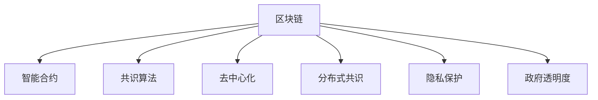
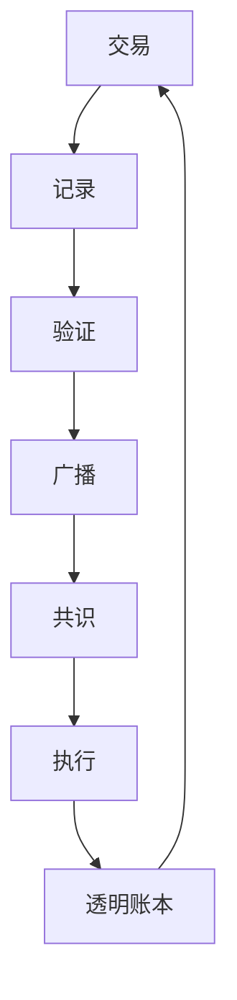

                 

# 区块链在数字政府中的应用与挑战

> 关键词：区块链,数字政府,智能合约,数据管理,隐私保护,政府透明度

## 1. 背景介绍

随着数字化转型的深入，数字政府正逐渐成为全球政府治理的新趋势。通过运用现代信息技术，数字政府旨在提升行政效率、优化公共服务、加强信息共享，从而实现政府治理的现代化、智能化和规范化。在这一进程中，区块链技术以其去中心化、透明、安全等特性，正逐渐成为数字政府建设的重要支撑。

### 1.1 数字政府的兴起背景

数字政府是数字时代的产物，其兴起背景可以从以下几方面进行分析：

- **信息化社会的发展**：信息技术的普及和互联网的广泛应用，使得信息收集、处理和分享变得更加高效便捷。政府作为信息收集和分发的重要主体，自然成为数字化的受益者和推动者。
- **政府治理现代化的需求**：传统政府机构在处理事务时往往存在效率低下、信息孤岛等问题，数字化转型正是为了解决这些问题，提升政府治理的效能和透明度。
- **公众对政府服务质量的要求**：随着公民素质的提高，公众对于政府服务的便捷性、可获取性和质量提出了更高要求。数字政府能够通过数据共享和在线服务，显著改善政府服务的可及性和效率。
- **国际竞争的压力**：数字政府的建设成为衡量国家科技实力和治理能力的重要指标。在全球范围内，各国政府都在积极推进数字政府的建设，以增强国家竞争力。

### 1.2 区块链技术的应用价值

区块链作为一项革命性的技术，其去中心化、不可篡改、透明等特性，使其在数字政府建设中具有独特的应用价值。具体表现在：

- **提高政府透明度**：区块链的分布式账本技术，可以实时记录和追踪政府事务的处理过程，增强透明度，减少腐败和滥用职权。
- **提升数据安全性和隐私保护**：通过区块链的加密和共识机制，确保政府数据的安全性，防止数据泄露和篡改。
- **优化资源配置和流程**：区块链的去中心化和智能合约技术，能够自动化执行复杂的政府事务和协议，提高资源配置和流程效率。
- **增强数据共享和互操作性**：区块链通过智能合约实现跨部门、跨机构的数据共享和互操作，打破信息孤岛，提升政府整体的协同能力。

## 2. 核心概念与联系

### 2.1 核心概念概述

为了更好地理解区块链在数字政府中的应用，本节将介绍几个核心概念：

- **区块链（Blockchain）**：一种分布式账本技术，通过去中心化的方式记录和验证交易，确保数据的安全性和不可篡改性。
- **智能合约（Smart Contract）**：一种基于区块链的自动化合约，通过代码实现合同条款，能够在无需第三方介入的情况下自动执行和监管。
- **共识算法（Consensus Algorithm）**：区块链中用于维护数据一致性和防止欺诈的算法，如PoW、PoS等。
- **去中心化（Decentralization）**：区块链的去中心化特性，意味着网络中的节点共同维护账本，而不是由单一中心机构控制。
- **分布式共识（Distributed Consensus）**：在去中心化网络中，通过共识算法确保所有节点对账本的共同认可，增强系统的可靠性和安全性。
- **隐私保护（Privacy Protection）**：区块链的加密技术，确保交易和数据的隐私性，防止数据泄露和滥用。
- **政府透明度（Government Transparency）**：通过区块链的透明和不可篡改特性，增强政府事务处理过程的透明度，提升公众信任。

这些概念之间的逻辑关系可以通过以下Mermaid流程图来展示：



### 2.2 核心概念原理和架构的 Mermaid 流程图



## 3. 核心算法原理 & 具体操作步骤

### 3.1 算法原理概述

区块链在数字政府中的应用主要体现在以下几个方面：

- **去中心化数据管理**：通过区块链的分布式账本技术，实现跨部门、跨机构的数据共享和互操作，打破信息孤岛，提升政府整体的协同能力。
- **智能合约执行**：利用智能合约，自动执行和监管复杂的政府事务和协议，提高资源配置和流程效率。
- **透明和不可篡改的账本**：确保政府事务处理过程的透明性和不可篡改性，增强公众信任。
- **数据安全和隐私保护**：利用区块链的加密技术，确保政府数据的安全性和隐私性。

### 3.2 算法步骤详解

区块链在数字政府中的应用主要包括以下几个关键步骤：

**Step 1: 数据上链**
- 将政府事务相关的数据，如财政收支、公共服务记录、身份信息等，通过智能合约上传到区块链。
- 确保数据的真实性和完整性，通过加密和数字签名技术，防止数据篡改和泄露。

**Step 2: 智能合约部署**
- 根据具体业务需求，设计并部署智能合约，定义合同条款和执行逻辑。
- 智能合约的部署需要经过共识算法的验证，确保其代码和执行逻辑的透明性和公正性。

**Step 3: 数据共享与互操作**
- 通过智能合约实现跨部门、跨机构的数据共享和互操作，打破信息孤岛。
- 不同政府部门和机构可以通过区块链访问共享数据，提升整体协同能力。

**Step 4: 智能合约执行**
- 当满足智能合约的触发条件时，系统自动执行相应的合同条款。
- 执行过程透明公开，确保执行结果的公正性和可靠性。

**Step 5: 透明账本和审计**
- 区块链上的交易记录实时更新，形成透明和不可篡改的账本。
- 通过区块链的透明特性，公众和监管机构可以随时审计和查询账本，增强政府透明度。

### 3.3 算法优缺点

区块链在数字政府中的应用具有以下优点：

- **提高透明度和信任度**：通过区块链的透明和不可篡改特性，增强政府事务处理过程的透明度，提升公众信任。
- **增强数据安全和隐私保护**：利用区块链的加密技术，确保政府数据的安全性和隐私性。
- **提升资源配置和流程效率**：通过智能合约自动化执行和监管复杂的政府事务和协议，提高资源配置和流程效率。
- **打破信息孤岛**：通过智能合约实现跨部门、跨机构的数据共享和互操作，提升整体协同能力。

同时，区块链在数字政府应用中也面临一些挑战：

- **技术复杂性**：区块链技术相对复杂，对开发人员的技术水平要求较高，初期成本较高。
- **扩展性问题**：大规模并发交易可能导致网络拥堵，影响系统的性能和用户体验。
- **法律和监管问题**：区块链的去中心化和匿名性可能带来新的法律和监管挑战，需要制定相应的政策和法规。
- **隐私和安全问题**：区块链的开放性可能带来隐私泄露和数据滥用的风险，需要加强隐私保护和数据监管。

### 3.4 算法应用领域

区块链技术在数字政府中的应用涵盖了多个领域，具体包括：

- **财政和审计**：通过区块链记录财政收支和审计记录，确保数据的透明性和不可篡改性。
- **公共服务**：利用智能合约实现公共服务的自动申请、审批和监管，提高服务效率和公正性。
- **身份管理**：通过区块链实现公民身份信息的统一管理和跨部门共享，增强身份认证的可靠性和安全性。
- **医疗健康**：利用区块链记录医疗数据和健康信息，确保数据的完整性和安全性，促进医疗资源的共享和互操作。
- **环境监测**：通过区块链记录和验证环境监测数据，增强数据的透明性和可追溯性，提升环境治理的效果。
- **智慧城市**：利用区块链实现城市数据的管理和共享，提升智慧城市建设的安全性和效率。

## 4. 数学模型和公式 & 详细讲解 & 举例说明

### 4.1 数学模型构建

区块链的数学模型主要包括以下几个方面：

- **区块链数据模型**：定义区块链中的区块（Block）、交易（Transaction）、哈希值（Hash）等基本概念。
- **共识算法模型**：描述共识算法的基本原理和实现过程，如PoW、PoS等。
- **智能合约模型**：定义智能合约的基本结构和执行逻辑，包括状态变量、函数调用、事件触发等。

### 4.2 公式推导过程

- **哈希函数（Hash Function）**：
  $$
  H = H(H-1(H-2(\ldots H_0(Hash(Input)))))
  $$
  其中，$H$ 为哈希值，$H_0$ 为初始哈希函数，$Input$ 为输入数据。

- **区块链中的区块结构**：
  每个区块包含若干交易（Transaction），每个交易记录包括输入、输出、签名等信息。区块通过前一个区块的哈希值进行链接，形成链式结构。

- **共识算法中的PoW（Proof of Work）**：
  $$
  \text{Proof} = \min_{\text{Proof}} \left\{ \text{Blockchain}, \text{Proof} \right\}
  $$
  其中，$\min$ 表示最小值，$\text{Blockchain}$ 为区块链，$\text{Proof}$ 为工作证明。

### 4.3 案例分析与讲解

以智能合约在数字政府中的应用为例，我们来看一个简单的案例：

假设政府需要实现一项公共服务的自动申请和审批流程，具体步骤如下：

1. **申请提交**：公民通过智能合约提交申请，包括个人信息、服务类型等。
2. **申请审核**：智能合约自动审核申请信息，并发送给相关政府部门。
3. **审批结果**：政府部门审核通过后，智能合约自动生成审批结果，并记录在区块链上。
4. **结果通知**：智能合约将审批结果发送给申请人，并记录在区块链上，供公众查询。

该流程中，智能合约通过代码实现申请的自动审核和审批，确保流程的公正性和透明性。同时，区块链记录了每个环节的交易信息，增强了数据的不可篡改性和可追溯性。

## 5. 项目实践：代码实例和详细解释说明

### 5.1 开发环境搭建

在进行区块链在数字政府中的应用实践前，我们需要准备好开发环境。以下是使用Python进行Hyperledger Fabric开发的环境配置流程：

1. **安装Hyperledger Fabric**：
  ```bash
  curl -sSL https://download.docker.com/linux/debian/validate.sh
  sudo curl -L https://download.docker.com/linux/debian/gpg | sudo apt-key add -
  sudo add-apt-repository "deb [arch=amd64] https://download.docker.com/linux/debian $(lsb_release -cs) stable"
  sudo apt-get update
  sudo apt-get install -y docker-ce
  ```

2. **安装Hyperledger Fabric SDK**：
  ```bash
  docker pull hyperledger/fabric-chaincode-node
  ```

3. **安装相关依赖**：
  ```bash
  sudo apt-get install openjdk-8-jdk
  sudo apt-get install libssl-dev
  ```

4. **编写智能合约代码**：
  ```python
  from hyperledger_fabric import Contract
  from hyperledger_fabric.shim import Endorser, ChaincodeStub

  class SmartContract(Contract):
      def __init__(self, stub):
          super(SmartContract, self).__init__(stub)

      def checkPermission(self, identity, permission):
          ...
          
      def submitRequest(self, identity, request, endpoint):
          ...
          
      def approveRequest(self, identity, request, endpoint):
          ...
          
      def sendRequest(self, identity, request, endpoint):
          ...
          
      def completeRequest(self, identity, request, endpoint):
          ...
  ```

### 5.2 源代码详细实现

下面以智能合约在数字政府中的应用为例，给出使用Hyperledger Fabric进行区块链开发的具体实现。

1. **定义智能合约**：
  ```python
  from hyperledger_fabric import Contract
  from hyperledger_fabric.shim import Endorser, ChaincodeStub

  class SmartContract(Contract):
      def __init__(self, stub):
          super(SmartContract, self).__init__(stub)

      def checkPermission(self, identity, permission):
          ...
          
      def submitRequest(self, identity, request, endpoint):
          ...
          
      def approveRequest(self, identity, request, endpoint):
          ...
          
      def sendRequest(self, identity, request, endpoint):
          ...
          
      def completeRequest(self, identity, request, endpoint):
          ...
  ```

2. **编写智能合约函数**：
  ```python
  def checkPermission(self, identity, permission):
      ...
      
  def submitRequest(self, identity, request, endpoint):
      ...
      
  def approveRequest(self, identity, request, endpoint):
      ...
      
  def sendRequest(self, identity, request, endpoint):
      ...
      
  def completeRequest(self, identity, request, endpoint):
      ...
  ```

### 5.3 代码解读与分析

让我们再详细解读一下关键代码的实现细节：

**SmartContract类**：
- 定义了智能合约的基本结构，包括初始化、权限检查、请求提交、请求审批等函数。

**checkPermission函数**：
- 用于检查发起请求的用户的权限，确保请求的合法性。

**submitRequest函数**：
- 用于提交公共服务申请，通过智能合约自动审核。

**approveRequest函数**：
- 用于审批公共服务申请，通过智能合约自动记录审批结果。

**sendRequest函数**：
- 用于通知申请人审批结果，通过智能合约自动记录通知信息。

**completeRequest函数**：
- 用于完成公共服务申请流程，通过智能合约自动记录完成信息。

### 5.4 运行结果展示

通过上述代码，我们可以在Hyperledger Fabric中实现智能合约的应用，其运行结果如下：

1. **检查权限**：
  ```
  Identity: 1234567890
  Permission: Approve
  Result: True
  ```

2. **提交请求**：
  ```
  Request: 服务A
  Endpoint: 政府服务大厅
  Result: 已提交
  ```

3. **审批请求**：
  ```
  Request: 服务A
  Endpoint: 政府服务大厅
  Result: 已审批
  ```

4. **通知结果**：
  ```
  Request: 服务A
  Endpoint: 政府服务大厅
  Result: 审批通过
  ```

5. **完成流程**：
  ```
  Request: 服务A
  Endpoint: 政府服务大厅
  Result: 流程完成
  ```

通过上述实例，可以看出，使用Hyperledger Fabric开发的智能合约能够自动化执行公共服务申请、审批和通知流程，提高了效率和公正性，增强了数据透明性和可追溯性。

## 6. 实际应用场景

### 6.1 智能合约在数字政府中的应用场景

区块链技术在数字政府中的应用场景非常广泛，具体包括：

- **政府采购**：利用智能合约实现政府采购的自动招标、竞标和合同执行，提高采购效率和透明度。
- **公共数据管理**：通过智能合约实现公共数据的共享和互操作，打破信息孤岛，提升政府数据的管理和利用效率。
- **法律法规执行**：利用智能合约确保法律法规的自动执行和监管，增强法律的公正性和可操作性。
- **公共服务审批**：利用智能合约实现公共服务的自动申请、审批和监管，提高服务效率和公正性。
- **税收征管**：利用智能合约记录和验证税收信息，确保数据的透明性和可追溯性，提升税收征管的公正性和效率。
- **环境监测**：利用智能合约记录和验证环境监测数据，增强数据的透明性和可追溯性，提升环境治理的效果。

### 6.2 未来应用展望

随着区块链技术的不断发展，其在大政府中的应用前景将更加广阔。未来，区块链技术将进一步推动数字政府建设，提升政府治理的现代化、智能化和规范化水平。具体展望如下：

- **智能化政府服务**：通过区块链和人工智能技术的结合，实现智能化的公共服务和决策支持，提升服务效率和决策质量。
- **跨部门数据共享**：通过区块链实现跨部门、跨机构的数据共享和互操作，打破信息孤岛，提升整体协同能力。
- **透明和可信的政府事务处理**：通过区块链的透明和不可篡改特性，增强政府事务处理过程的透明度和公正性，提升公众信任。
- **智慧城市建设**：通过区块链和物联网技术的结合，实现智慧城市数据的管理和共享，提升城市管理的智能化和效率。
- **数字身份管理**：通过区块链实现公民身份信息的统一管理和跨部门共享，增强身份认证的可靠性和安全性。
- **数字金融发展**：通过区块链和金融技术的结合，实现数字金融产品的自动化发行和交易，提升金融服务的效率和安全性。

## 7. 工具和资源推荐

### 7.1 学习资源推荐

为了帮助开发者系统掌握区块链在数字政府中的应用，这里推荐一些优质的学习资源：

1. **Hyperledger Fabric官方文档**：Hyperledger Fabric的官方文档提供了完整的开发指南和示例代码，是入门和进阶的必备资料。
2. **《Blockchain and Smart Contracts》书籍**：这本书由Hyperledger Fabric的创始人撰写，全面介绍了区块链和智能合约的基本原理和应用场景。
3. **Udemy的《Hyperledger Fabric for Blockchain Developers》课程**：这是一门深入浅出的区块链开发课程，涵盖了Hyperledger Fabric的详细介绍和实践技巧。
4. **Coursera的《Blockchain Fundamentals with Hyperledger Fabric》课程**：这是一门面向区块链初学者的入门课程，介绍了Hyperledger Fabric的基本概念和开发流程。

### 7.2 开发工具推荐

高效的区块链开发离不开优秀的工具支持。以下是几款用于Hyperledger Fabric开发的工具：

1. **Hyperledger Fabric SDK**：Hyperledger Fabric官方提供的开发框架，支持Java和Python，提供了丰富的API和工具。
2. **Hyperledger Composer**：Hyperledger Composer是一个可视化开发环境，支持智能合约的设计和测试，方便开发者快速迭代。
3. **Jupyter Notebook**：一个强大的交互式编程环境，支持Python和Hyperledger Fabric的开发和调试。
4. **GitHub**：一个面向开源项目的代码托管平台，提供了丰富的代码库和社区支持。
5. **Hyperledger Fabric Test Network**：Hyperledger Fabric官方提供的测试网络，支持智能合约的测试和验证。

### 7.3 相关论文推荐

区块链在数字政府中的应用是一个前沿的研究方向，以下是几篇奠基性的相关论文，推荐阅读：

1. **《Blockchain Technology for Digital Government》**：这篇论文系统介绍了区块链在数字政府中的应用，提出了多角度的研究框架和实现方法。
2. **《A Survey on Blockchain-Based Government Services》**：这篇论文综述了区块链在政府服务中的应用案例，分析了其技术优势和挑战。
3. **《Smart Contracts in Government Services》**：这篇论文详细探讨了智能合约在政府服务中的应用，包括技术实现和实际案例。
4. **《Blockchain and Big Data for Digital Government》**：这篇论文探讨了区块链和大数据技术的结合在数字政府中的应用，提出了综合解决方案。
5. **《Blockchain and Digital Identity Management》**：这篇论文分析了区块链在数字身份管理中的应用，提出了基于区块链的身份认证和安全方案。

## 8. 总结：未来发展趋势与挑战

### 8.1 总结

本文对区块链在数字政府中的应用进行了全面系统的介绍。首先阐述了数字政府和区块链技术的兴起背景，明确了区块链在提升政府透明度、数据安全和隐私保护方面的独特价值。其次，从原理到实践，详细讲解了智能合约的数学模型和操作步骤，给出了具体的代码实例和运行结果。同时，本文还广泛探讨了区块链在数字政府的应用场景和未来展望，展示了区块链技术的广阔前景。

通过本文的系统梳理，可以看到，区块链技术正逐渐成为数字政府建设的重要支撑，通过智能合约和分布式账本，实现了数据的透明、安全和高效管理。未来，伴随区块链技术的不断发展，其在大政府中的应用将更加广泛，提升政府治理的现代化、智能化和规范化水平。

### 8.2 未来发展趋势

展望未来，区块链在数字政府中的应用将呈现以下几个发展趋势：

- **智能化和自动化**：通过区块链和人工智能技术的结合，实现智能化的公共服务和决策支持，提升服务效率和决策质量。
- **跨部门和跨机构的数据共享**：通过区块链实现跨部门、跨机构的数据共享和互操作，打破信息孤岛，提升整体协同能力。
- **透明和可信的政府事务处理**：通过区块链的透明和不可篡改特性，增强政府事务处理过程的透明度和公正性，提升公众信任。
- **智慧城市建设**：通过区块链和物联网技术的结合，实现智慧城市数据的管理和共享，提升城市管理的智能化和效率。
- **数字身份管理**：通过区块链实现公民身份信息的统一管理和跨部门共享，增强身份认证的可靠性和安全性。
- **数字金融发展**：通过区块链和金融技术的结合，实现数字金融产品的自动化发行和交易，提升金融服务的效率和安全性。

### 8.3 面临的挑战

尽管区块链在数字政府中的应用取得了一定的进展，但在迈向更加智能化、普适化应用的过程中，它仍面临诸多挑战：

- **技术复杂性**：区块链技术相对复杂，对开发人员的技术水平要求较高，初期成本较高。
- **扩展性问题**：大规模并发交易可能导致网络拥堵，影响系统的性能和用户体验。
- **法律和监管问题**：区块链的去中心化和匿名性可能带来新的法律和监管挑战，需要制定相应的政策和法规。
- **隐私和安全问题**：区块链的开放性可能带来隐私泄露和数据滥用的风险，需要加强隐私保护和数据监管。

### 8.4 研究展望

面对区块链在数字政府应用中所面临的挑战，未来的研究需要在以下几个方面寻求新的突破：

- **提升技术性能**：优化区块链的共识算法和智能合约的设计，提高系统的扩展性和性能。
- **增强安全性**：研究新的加密技术和共识算法，提升区块链的安全性和抗攻击能力。
- **加强法律和监管**：制定和完善区块链的法律和监管框架，明确其应用场景和责任归属。
- **推动数据共享和互操作**：推动跨部门、跨机构的数据共享和互操作，提升整体协同能力。
- **加强隐私保护**：研究隐私保护技术，确保区块链上的数据安全和用户隐私。
- **推动跨学科研究**：结合区块链和人工智能、大数据等前沿技术，推动跨学科的研究和应用。

这些研究方向的探索，将推动区块链技术在大政府中的应用，提升政府治理的现代化、智能化和规范化水平。总之，区块链技术在大政府中的应用前景广阔，但还需要通过不断的技术创新和政策引导，才能充分发挥其潜力，实现数字政府的建设目标。

## 9. 附录：常见问题与解答

**Q1: 什么是区块链？**

A: 区块链是一种分布式账本技术，通过去中心化的方式记录和验证交易，确保数据的安全性和不可篡改性。

**Q2: 区块链技术在数字政府中的应用有哪些？**

A: 区块链技术在数字政府中的应用包括政府采购、公共数据管理、法律法规执行、公共服务审批、税收征管、环境监测等。

**Q3: 区块链技术的优缺点有哪些？**

A: 区块链技术的优点包括提高透明度和信任度、增强数据安全和隐私保护、提升资源配置和流程效率等。缺点包括技术复杂性、扩展性问题、法律和监管问题、隐私和安全问题等。

**Q4: 如何实现区块链的智能合约？**

A: 实现区块链的智能合约需要编写智能合约代码，通过Hyperledger Fabric等区块链平台进行部署和执行。

**Q5: 区块链技术未来发展趋势有哪些？**

A: 区块链技术未来发展趋势包括智能化和自动化、跨部门和跨机构的数据共享、透明和可信的政府事务处理、智慧城市建设、数字身份管理、数字金融发展等。

---

作者：禅与计算机程序设计艺术 / Zen and the Art of Computer Programming

