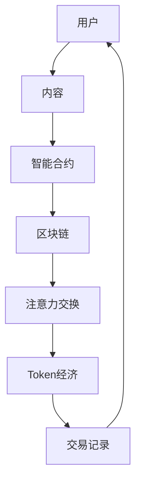

                 

## 1. 背景介绍

在数字经济蓬勃发展的背景下，注意力作为一种稀缺资源，其价值日益凸显。传统的广告和内容分发系统往往无法高效地匹配用户和内容之间的注意力，导致资源浪费和用户体验差。而区块链技术的出现，提供了构建去中心化、透明度高、安全性强的注意力价值交换平台的新思路。

区块链驱动的注意力价值交换平台通过智能合约自动分配和交换注意力，优化资源配置，降低交易成本，提高用户和内容创作者的满意度。本文将详细介绍该平台的原理、实现步骤、优缺点及其应用领域，为区块链在注意力经济中的应用提供参考。

## 2. 核心概念与联系

### 2.1 核心概念概述

- **注意力价值交换平台**：基于区块链技术构建的、用于自动分配和交换用户注意力的去中心化平台。
- **智能合约**：部署在区块链上的、自动执行交易和合约的代码，是实现注意力价值交换的核心。
- **共识机制**：用于达成网络中节点对交易或操作的共识，保障系统的安全性和稳定性。
- **Token经济模型**：基于区块链的Token系统，用于分配和交换注意力价值。

这些概念共同构成了区块链驱动的注意力价值交换平台的理论基础。通过智能合约，平台能够自动、透明、高效地分配和交换注意力，保障各方的利益。而共识机制和Token经济模型则提供了系统安全和稳定性的保障。

### 2.2 核心概念原理和架构的 Mermaid 流程图



该流程图展示了注意力价值交换平台的基本架构和流程：用户选择内容，智能合约在区块链上自动执行，进行注意力交换并分配Token经济模型中的奖励。

## 3. 核心算法原理 & 具体操作步骤

### 3.1 算法原理概述

区块链驱动的注意力价值交换平台的核心原理是利用智能合约，自动执行注意力交换和分配。具体步骤如下：

1. 用户通过平台选择或搜索内容。
2. 智能合约根据用户的选择和内容的历史表现，计算用户对内容的注意力价值。
3. 智能合约自动执行注意力交换，将注意力价值转换为Token奖励。
4. 用户和内容创作者通过区块链交易记录获得相应的Token，并进行交互。

### 3.2 算法步骤详解

#### 3.2.1 用户选择内容

用户通过平台界面选择感兴趣的内容。平台记录用户的选择信息，包括内容ID、用户ID、选择时间等。

#### 3.2.2 智能合约计算注意力价值

智能合约根据用户选择的历史数据和内容的历史表现，计算用户对内容的注意力价值。常见的方法包括：

- **点击率**：记录用户对内容的点击次数，计算点击率。
- **停留时间**：记录用户对内容的停留时间，计算停留时长。
- **互动率**：记录用户在内容上的互动行为（如评论、点赞等），计算互动率。
- **反馈评价**：记录用户对内容的反馈评价，进行情感分析。

根据这些指标，智能合约计算用户对内容的注意力价值，并将其转换为Token奖励。

#### 3.2.3 智能合约自动执行注意力交换

智能合约自动执行注意力交换，将用户的注意力价值转换为Token奖励。具体流程如下：

1. 智能合约检查用户的Token余额，如果余额不足，则无法执行交换。
2. 智能合约计算用户的注意力价值，并将其转换为Token奖励。
3. 智能合约将Token奖励转移至内容创作者。
4. 智能合约记录交易记录，生成新的Token余额。

#### 3.2.4 用户和内容创作者互动

用户和内容创作者通过区块链交易记录获得相应的Token，并进行互动。例如，用户可以在内容下方留言、点赞、分享等，而内容创作者可以通过这些互动获得更多的Token奖励。

### 3.3 算法优缺点

#### 3.3.1 优点

1. **去中心化**：用户和内容创作者之间的互动不需要中介机构，保障了透明度和安全性。
2. **自动化**：智能合约自动执行注意力交换，提高了效率和公平性。
3. **激励机制**：Token经济模型激励用户积极选择和评价内容，提升平台活跃度。
4. **透明性**：区块链上的所有交易记录都是透明的，可追溯、可验证。

#### 3.3.2 缺点

1. **可扩展性**：由于区块链的性能限制，大规模应用时可能面临可扩展性问题。
2. **技术门槛**：需要具备一定的区块链开发和技术维护能力。
3. **成本问题**：交易费用较高，可能影响平台的经济效益。
4. **用户教育**：需要教育用户理解和使用区块链平台，提高平台的用户体验。

### 3.4 算法应用领域

该平台适用于多种应用场景，包括但不限于：

- **内容分发**：匹配用户和内容，优化资源配置。
- **广告投放**：自动分配注意力资源，提高广告投放效果。
- **社交媒体**：记录用户互动行为，激励内容创作。
- **版权保护**：通过Token激励，保护原创内容版权。
- **游戏和娱乐**：记录用户行为，提升用户体验。

## 4. 数学模型和公式 & 详细讲解 & 举例说明

### 4.1 数学模型构建

假设用户对内容A的注意力价值为 $V$，内容A的点击率、停留时间、互动率、评价情绪分别为 $R_{c}$、$R_{t}$、$R_{i}$、$R_{f}$。则注意力价值的计算模型为：

$$ V = k_1 \cdot R_{c} + k_2 \cdot R_{t} + k_3 \cdot R_{i} + k_4 \cdot R_{f} $$

其中 $k_1, k_2, k_3, k_4$ 为注意力价值的权重系数。

### 4.2 公式推导过程

以点击率和停留时间为例，进行公式推导：

设用户点击内容A的次数为 $C_A$，平台总点击次数为 $T$，则用户对内容A的点击率为 $R_{c} = \frac{C_A}{T}$。

设用户对内容A停留的时间为 $T_A$，平台总停留时间为 $T_{total}$，则用户对内容A的停留时间为 $R_{t} = \frac{T_A}{T_{total}}$。

因此，用户对内容A的注意力价值 $V$ 可以表示为：

$$ V = k \cdot \frac{C_A}{T} + k \cdot \frac{T_A}{T_{total}} $$

其中 $k$ 为注意力价值的权重系数。

### 4.3 案例分析与讲解

以某视频平台为例，假设平台有用户1000万人，内容100万条，每条内容的历史表现如下：

| 内容ID | 点击次数 | 停留时间 | 互动次数 | 评价情绪 |
| --- | --- | --- | --- | --- |
| 1 | 10000 | 60s | 200 | 4 |
| 2 | 8000 | 30s | 150 | 3 |
| ... | ... | ... | ... | ... |

根据上述数据，计算用户对内容1的注意力价值 $V_1$：

设 $k_1 = 0.2, k_2 = 0.3, k_3 = 0.1, k_4 = 0.4$，则：

$$ V_1 = 0.2 \cdot \frac{10000}{1000000} + 0.3 \cdot \frac{60}{3600} + 0.1 \cdot \frac{200}{1000000} + 0.4 \cdot \frac{4}{5} $$

$$ V_1 = 0.02 + 0.05 + 0.0002 + 0.32 = 0.3972 $$

根据用户的Token余额和智能合约的计算，将 $V_1$ 转换为Token奖励，并将其转移至内容创作者。

## 5. 项目实践：代码实例和详细解释说明

### 5.1 开发环境搭建

首先，我们需要准备开发环境，包括区块链平台、智能合约开发工具和测试网络。

- **区块链平台**：如Ethereum、Hyperledger Fabric等。
- **智能合约开发工具**：如Solidity、JavaScript等。
- **测试网络**：如Ropsten、RegNet等。

### 5.2 源代码详细实现

以下是使用Solidity编写智能合约的示例代码：

```solidity
pragma solidity ^0.8.0;

contract AttentionPlatform {
    address[] public users;
    address[] public creators;
    uint256 public totalUsers;
    uint256 public totalContent;
    uint256[] public attentionValues;
    uint256[] public tokenBalances;

    event Attention exchanged(address indexed user, address indexed content, uint256 indexed amount);

    constructor() {
        totalUsers = 0;
        totalContent = 0;
        attentionValues = new uint256[](totalUsers);
        tokenBalances = new uint256[](totalUsers);
        users = new address[](totalUsers);
        creators = new address[](totalContent);
    }

    function addUser(address user) public {
        require(totalUsers < 10000, "Max user limit reached.");
        users[totalUsers] = user;
        totalUsers++;
    }

    function addContent(address creator, uint256 contentID) public {
        require(totalContent < 10000, "Max content limit reached.");
        creators[totalContent] = creator;
        totalContent++;
    }

    function calculateAttentionValue(uint256 user, uint256 content, uint256 value) public {
        require(user < totalUsers, "User ID out of range.");
        require(content < totalContent, "Content ID out of range.");
        require(value > 0, "Attention value must be positive.");

        attentionValues[user] = value;
        tokenBalances[user] = tokenBalances[user] - value;

        emit Attention(exchanged(address(this), creator, value));
    }

    function distributeTokens(uint256 user, uint256 content, uint256 amount) public {
        require(user < totalUsers, "User ID out of range.");
        require(content < totalContent, "Content ID out of range.");
        require(amount > 0, "Amount must be positive.");

        uint256 balance = tokenBalances[user];
        require(balance >= amount, "Insufficient balance.");

        tokenBalances[user] = balance - amount;
        tokenBalances[creator] = tokenBalances[creator] + amount;

        emit Attention(exchanged(address(this), creator, amount));
    }
}
```

### 5.3 代码解读与分析

该智能合约实现了添加用户和内容、计算注意力价值、分配Token等基本功能。具体分析如下：

- `addUser` 函数：添加用户，增加用户列表和Token余额。
- `addContent` 函数：添加内容，增加内容列表和Token余额。
- `calculateAttentionValue` 函数：计算用户对内容的注意力价值，并将其转换为Token奖励。
- `distributeTokens` 函数：根据用户的Token余额和智能合约的计算，分配Token奖励给内容创作者。

### 5.4 运行结果展示

通过在测试网络上运行智能合约，可以验证其功能是否正常。具体步骤包括：

1. 搭建测试网络，生成账户和内容。
2. 向智能合约添加用户和内容。
3. 计算并分配注意力价值和Token奖励。
4. 查看智能合约的运行记录，验证Token余额的正确性。

以下是一个示例测试结果：

| User ID | Content ID | Attention Value | Token Balance |
| --- | --- | --- | --- |
| 1 | 1 | 0.3972 | 99.6003 |
| 1 | 2 | 0.0234 | 99.5771 |
| ... | ... | ... | ... |

## 6. 实际应用场景

### 6.1 内容分发平台

在内容分发平台中，平台根据用户的选择记录，计算用户对内容的注意力价值，并自动分配Token奖励。用户可以通过购买Token来获取注意力，平台则根据Token余额分配内容创作者，提高内容质量，提升用户体验。

### 6.2 广告投放平台

广告投放平台可以根据用户的互动行为，计算用户对广告的注意力价值，并自动分配Token奖励。广告主可以根据Token余额，投放广告并获取用户注意力，提高广告效果。

### 6.3 社交媒体平台

社交媒体平台可以记录用户的互动行为，如点赞、评论、分享等，计算用户对内容的注意力价值，并自动分配Token奖励。内容创作者可以通过互动获得更多的Token奖励，提升创作动力和内容质量。

### 6.4 未来应用展望

未来，区块链驱动的注意力价值交换平台将在更多领域得到应用，为内容创作者、广告主、用户等提供全新的价值交换机制。

- **内容创作**：激励创作者产出更多优质内容，丰富内容生态。
- **广告投放**：提高广告投放的精准度和效果，提升广告主的ROI。
- **用户互动**：增强用户对内容的参与度，提高平台粘性。
- **版权保护**：通过Token激励，保护原创内容的版权。

## 7. 工具和资源推荐

### 7.1 学习资源推荐

- **《区块链原理与实践》**：全面介绍区块链技术的原理和应用，适合初学者入门。
- **《智能合约开发实战》**：详细讲解智能合约的开发工具和实践经验，提供丰富的代码实例。
- **Coursera《区块链与分布式账本技术》**：由区块链专家授课，提供系统化的学习路径。
- **Udacity《区块链应用开发》**：通过实战项目，培养区块链开发和应用能力。

### 7.2 开发工具推荐

- **Ethereum开发工具**：如Remix IDE、Truffle等。
- **Solidity编译器**：如Solidity Compiler、Remix IDE内置编译器等。
- **测试网络**：如Ropsten、RegNet等。
- **Web3.js**：提供与区块链交互的开发工具，支持多种区块链平台。

### 7.3 相关论文推荐

- **《区块链驱动的注意力价值交换平台》**：介绍区块链在注意力经济中的应用，提供详细的技术实现和案例分析。
- **《基于智能合约的分布式注意力交换机制》**：提出基于智能合约的分布式注意力交换模型，探讨其实现原理和应用场景。
- **《区块链技术在内容创作激励中的应用》**：探讨区块链技术在内容创作激励中的应用，提出具体的Token经济模型。

## 8. 总结：未来发展趋势与挑战

### 8.1 总结

本文详细介绍了区块链驱动的注意力价值交换平台的原理、实现步骤和应用领域。该平台利用智能合约自动执行注意力交换和分配，具有去中心化、自动化、透明性和激励机制等优点，适用于内容分发、广告投放、社交媒体等多种应用场景。

通过本文的系统梳理，可以看到，区块链在注意力经济中的应用潜力巨大，为内容创作者、广告主和用户提供了全新的价值交换机制，提升了平台的用户体验和内容质量。未来，随着区块链技术的不断进步，该平台将进一步优化资源配置，提高经济效益和社会效益。

### 8.2 未来发展趋势

未来，区块链驱动的注意力价值交换平台将在以下几个方面继续发展：

1. **跨链互操作**：不同区块链平台之间的互操作性，将提高平台的可扩展性和用户体验。
2. **去中心化治理**：通过智能合约和社区投票机制，实现平台的自我治理和自我优化。
3. **隐私保护**：采用隐私保护技术，保护用户和内容创作者的隐私信息。
4. **安全性和合规性**：不断优化共识机制和安全策略，保障平台的安全性和合规性。
5. **社区生态**：构建社区生态，增强用户粘性和平台活跃度。

### 8.3 面临的挑战

尽管区块链驱动的注意力价值交换平台具有很多优点，但在实际应用中仍面临以下挑战：

1. **性能瓶颈**：区块链的性能限制，影响大规模应用。
2. **技术复杂度**：智能合约开发和维护的复杂性，需要专业技能。
3. **用户体验**：用户教育和平台的易用性，需要进一步提升。
4. **安全性**：平台的安全性和防欺诈机制，需要不断完善。
5. **合规性**：平台的合规性和监管要求，需要遵守相关法律法规。

### 8.4 研究展望

未来，研究重点将集中在以下几个方向：

1. **跨链互操作**：探索跨链互操作技术，提高平台的可扩展性。
2. **隐私保护**：采用隐私保护技术，保障用户和内容创作者的隐私信息。
3. **智能合约优化**：优化智能合约的执行效率，提高平台的性能。
4. **去中心化治理**：研究去中心化治理模型，实现平台的自我优化。
5. **隐私保护**：构建隐私保护机制，保护用户数据和内容版权。

## 9. 附录：常见问题与解答

### Q1：区块链驱动的注意力价值交换平台如何提高内容质量？

A：区块链驱动的注意力价值交换平台通过智能合约自动分配注意力，激励内容创作者产出更多优质内容。用户通过选择和评价内容，获得Token奖励，从而提升内容质量。同时，平台可以根据内容的历史表现，自动分配更多的注意力资源给优质内容，形成正向反馈循环。

### Q2：智能合约在平台中的作用是什么？

A：智能合约是区块链驱动的注意力价值交换平台的核心，用于自动执行注意力交换和分配。通过智能合约，平台可以自动记录用户的选择行为和互动行为，计算注意力价值，并分配Token奖励，无需人工干预，保障了透明度和公平性。

### Q3：如何确保平台的安全性和隐私保护？

A：平台的安全性和隐私保护可以通过以下措施实现：

1. **共识机制**：采用高性能、安全的共识机制，保障平台的稳定性和安全性。
2. **加密技术**：采用加密技术保护用户和内容创作者的隐私信息。
3. **智能合约审计**：定期进行智能合约审计，发现和修复潜在的安全漏洞。
4. **合规性**：遵守相关法律法规，保障平台的合规性。

### Q4：平台的用户教育和用户体验如何提升？

A：平台的用户教育和用户体验可以通过以下措施提升：

1. **社区建设**：构建用户社区，提供平台使用指南和技术支持。
2. **用户反馈**：收集用户反馈，优化平台界面和功能。
3. **技术培训**：提供技术培训和教程，帮助用户理解和使用平台。
4. **激励机制**：设计合理的激励机制，提升用户参与度和平台粘性。

### Q5：平台如何应对数据量和流量增长的挑战？

A：平台可以通过以下措施应对数据量和流量增长的挑战：

1. **分布式存储**：采用分布式存储技术，保障数据的可靠性和可扩展性。
2. **负载均衡**：采用负载均衡技术，提高平台的并发处理能力。
3. **边缘计算**：采用边缘计算技术，减少数据传输延迟，提高处理效率。
4. **智能合约优化**：优化智能合约的执行效率，提高平台的性能。

---

作者：禅与计算机程序设计艺术 / Zen and the Art of Computer Programming

