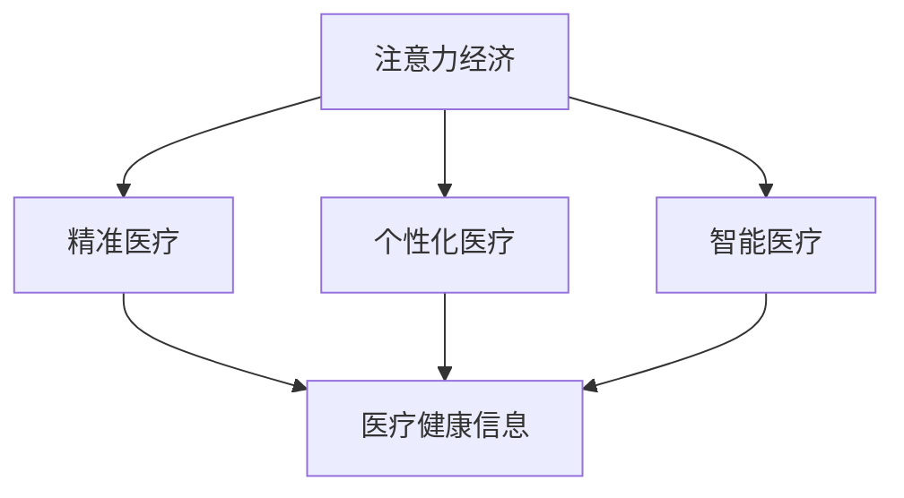

                 

# 医疗健康领域在注意力经济中的机遇

## 1. 背景介绍

### 1.1 问题由来

在数字化时代，注意力作为一种稀缺资源，已经成为企业竞争的核心要素之一。特别是在医疗健康领域，患者、医生和医疗机构的注意力成为驱动医疗服务发展的关键因素。近年来，随着互联网和移动设备的普及，医疗健康领域的注意力经济模式逐渐显现，吸引了越来越多的企业、机构和学术研究者的关注。

### 1.2 问题核心关键点

医疗健康领域的注意力经济主要体现在以下几个方面：

1. **患者注意力**：患者通过互联网搜索健康信息、咨询医生、选择治疗方案等行为，形成海量数据，成为医疗健康信息的重要来源。
2. **医生注意力**：医生通过在线问诊、学术交流、参加医疗会议等形式，共享和利用知识经验，提高工作效率。
3. **医疗机构注意力**：医疗机构通过社交媒体、官网等渠道发布健康科普、诊疗指南、专家介绍等内容，吸引和保持患者关注，提升品牌影响力。

这些注意力行为构成了医疗健康领域的核心数据资源，为个性化医疗、精准医疗、智能医疗等新兴技术的发展提供了坚实的基础。

### 1.3 问题研究意义

研究医疗健康领域的注意力经济模式，对于提升医疗服务质量、推动健康产业升级、构建智能医疗生态系统具有重要意义：

1. **提升医疗服务质量**：通过分析患者和医生的注意力行为数据，可以更好地了解患者需求、优化诊疗流程、提高医生工作效率，从而提升医疗服务整体质量。
2. **推动健康产业升级**：利用大数据、人工智能等技术，深入挖掘注意力经济模式中的知识与价值，促进健康产业向智能化、精准化、个性化方向发展。
3. **构建智能医疗生态系统**：结合区块链、云计算、物联网等前沿技术，构建多方协同、信息共享的医疗健康生态系统，提升医疗服务的可及性和效率。

## 2. 核心概念与联系

### 2.1 核心概念概述

为更好地理解医疗健康领域的注意力经济模式，本节将介绍几个密切相关的核心概念：

- **注意力经济**：以吸引和保持注意力为核心的经济模式，通过提供有价值的信息、服务、产品等，满足用户的关注需求，实现商业价值的最大化。
- **医疗健康领域**：涉及预防、治疗、康复、健康管理等多个环节，涵盖医院、诊所、药店、医疗保险等机构，以及患者、医生、医护人员等群体。
- **个性化医疗**：根据患者的基因、生活方式、病史等个性化数据，制定个性化的诊疗方案，提供差异化的医疗服务。
- **精准医疗**：通过基因组学、蛋白组学、代谢组学等技术，对疾病进行精准诊断、精准治疗、精准预防，提升医疗效果。
- **智能医疗**：结合大数据、人工智能、区块链等技术，构建智能化、自动化的医疗服务体系，提高医疗服务的效率和质量。
- **医疗健康信息**：包括患者健康数据、医生诊疗数据、医疗机构运营数据等，是医疗健康领域的基础数据资源。

这些核心概念之间的逻辑关系可以通过以下Mermaid流程图来展示：



这个流程图展示了大语言模型在医疗健康领域的应用框架，通过注意力经济模式推动个性化医疗、精准医疗和智能医疗的发展，从而充分利用医疗健康信息，提升医疗服务质量。

## 3. 核心算法原理 & 具体操作步骤

### 3.1 算法原理概述

医疗健康领域的注意力经济模式，可以通过大数据、人工智能等技术进行深入分析和挖掘。其核心思想是：利用患者的搜索行为、医生的学术活动、医疗机构的宣传内容等注意力数据，构建个性化推荐、精准诊疗、智能问诊等应用，提升医疗服务质量和效率。

形式化地，假设医疗健康领域的注意力数据为 $D=\{(x_i, y_i)\}_{i=1}^N$，其中 $x_i$ 为注意力数据样本，如患者搜索记录、医生论文、医疗机构内容等，$y_i$ 为对应的标签或属性，如疾病名称、医生专业、机构类型等。通过监督学习或无监督学习，构建模型 $M$ 用于分析注意力数据，预测患者的健康需求、医生的专业知识、医疗机构的品牌价值等，从而优化医疗服务的供给和匹配。

### 3.2 算法步骤详解

医疗健康领域的注意力经济模式，一般包括以下几个关键步骤：

**Step 1: 数据准备与预处理**
- 收集医疗健康领域的注意力数据，包括患者搜索记录、医生论文、医疗机构内容等。
- 对数据进行清洗、去重、标注等预处理操作，确保数据的质量和一致性。
- 将数据集划分为训练集、验证集和测试集，便于模型的训练和评估。

**Step 2: 模型选择与训练**
- 根据任务特点，选择合适的算法模型，如分类模型、聚类模型、回归模型等。
- 使用训练集对模型进行训练，通过优化算法（如梯度下降、随机梯度下降等）最小化损失函数。
- 在验证集上评估模型性能，调整超参数和模型结构。

**Step 3: 模型评估与优化**
- 在测试集上评估模型性能，计算准确率、召回率、F1分数等指标。
- 对模型进行调优，包括调整学习率、增加正则化、增加训练轮数等，进一步提升模型效果。

**Step 4: 应用落地**
- 将训练好的模型集成到实际应用中，如推荐系统、智能问诊、精准诊疗等。
- 通过A/B测试等方法，评估模型效果，确保其在实际场景中的有效性。
- 不断收集用户反馈，持续改进模型，保持其适应性和实时性。

### 3.3 算法优缺点

医疗健康领域的注意力经济模式，具有以下优点：

1. **精准度提升**：通过分析注意力数据，能够精准匹配患者需求和医疗资源，提升医疗服务的精准度。
2. **效率提高**：智能推荐和智能问诊能够快速响应患者需求，提高医疗服务的响应速度和效率。
3. **成本降低**：减少不必要的诊疗和药品使用，降低医疗成本，提高资源利用率。
4. **服务提升**：个性化医疗和精准医疗能够提供更加符合患者需求和病情的诊疗方案，提升患者满意度和治疗效果。

同时，该模式也存在一些局限性：

1. **数据隐私问题**：医疗健康数据的敏感性，可能导致数据隐私和安全问题。
2. **数据质量问题**：医疗健康数据的噪声和误差，可能影响模型的准确性。
3. **技术依赖问题**：对大数据、人工智能等技术依赖较大，需要较高的技术门槛和成本投入。
4. **伦理问题**：医疗健康数据的使用需要遵守伦理规范，避免伦理风险。

尽管存在这些局限性，但就目前而言，基于注意力经济模式的方法已成为医疗健康领域的重要手段，推动了医疗服务的智能化、精准化、个性化发展。

### 3.4 算法应用领域

基于医疗健康领域的注意力经济模式，已经在多个领域得到应用，例如：

1. **患者健康信息推荐**：根据患者搜索记录和健康数据，推荐合适的健康信息、疾病指南、医生介绍等，帮助患者做出合理决策。
2. **智能问诊系统**：通过分析患者搜索记录和症状描述，提供初步的疾病诊断和建议，引导患者进行进一步诊疗。
3. **精准诊疗服务**：结合基因数据、病历数据和患者搜索记录，制定个性化的诊疗方案，提升治疗效果。
4. **医疗健康信息发布**：医疗机构通过社交媒体、官网等渠道发布健康科普、诊疗指南、专家介绍等内容，吸引和保持患者关注，提升品牌影响力。

除了上述这些经典应用外，医疗健康领域的注意力经济模式还在健康管理、远程医疗、智能诊断等方面不断创新，推动医疗服务的全面升级。

## 4. 数学模型和公式 & 详细讲解

### 4.1 数学模型构建

本节将使用数学语言对医疗健康领域的注意力经济模式进行更加严格的刻画。

假设医疗健康领域的注意力数据为 $D=\{(x_i, y_i)\}_{i=1}^N$，其中 $x_i$ 为注意力数据样本，如患者搜索记录、医生论文、医疗机构内容等，$y_i$ 为对应的标签或属性，如疾病名称、医生专业、机构类型等。定义模型 $M$ 在数据样本 $(x,y)$ 上的损失函数为 $\ell(M(x),y)$，则在数据集 $D$ 上的经验风险为：

$$
\mathcal{L}(M) = \frac{1}{N}\sum_{i=1}^N \ell(M(x_i),y_i)
$$

通过梯度下降等优化算法，最小化损失函数 $\mathcal{L}(M)$，得到模型 $M$ 的参数 $\theta$。在实际应用中，我们通常使用基于梯度的优化算法（如SGD、Adam等）来近似求解上述最优化问题。

### 4.2 公式推导过程

以患者健康信息推荐为例，假设推荐系统通过注意力数据 $D$ 训练得到模型 $M$，将患者的搜索记录 $x_i$ 作为输入，预测其感兴趣的健康信息 $y_i$。推荐系统的优化目标是最小化经验风险，即：

$$
\theta^* = \mathop{\arg\min}_{\theta} \mathcal{L}(M)
$$

在实践中，我们通常使用基于梯度的优化算法（如SGD、Adam等）来近似求解上述最优化问题。设 $\eta$ 为学习率，$\lambda$ 为正则化系数，则参数的更新公式为：

$$
\theta \leftarrow \theta - \eta \nabla_{\theta}\mathcal{L}(\theta) - \eta\lambda\theta
$$

其中 $\nabla_{\theta}\mathcal{L}(\theta)$ 为损失函数对参数 $\theta$ 的梯度，可通过反向传播算法高效计算。

## 5. 项目实践：代码实例和详细解释说明

### 5.1 开发环境搭建

在进行医疗健康领域的注意力经济模式开发前，我们需要准备好开发环境。以下是使用Python进行PyTorch开发的环境配置流程：

1. 安装Anaconda：从官网下载并安装Anaconda，用于创建独立的Python环境。

2. 创建并激活虚拟环境：
```bash
conda create -n pytorch-env python=3.8 
conda activate pytorch-env
```

3. 安装PyTorch：根据CUDA版本，从官网获取对应的安装命令。例如：
```bash
conda install pytorch torchvision torchaudio cudatoolkit=11.1 -c pytorch -c conda-forge
```

4. 安装TensorFlow：由Google主导开发的开源深度学习框架，生产部署方便，适合大规模工程应用。同样有丰富的预训练语言模型资源。

5. 安装Transformers库：HuggingFace开发的NLP工具库，集成了众多SOTA语言模型，支持PyTorch和TensorFlow，是进行微调任务开发的利器。

6. 安装各类工具包：
```bash
pip install numpy pandas scikit-learn matplotlib tqdm jupyter notebook ipython
```

完成上述步骤后，即可在`pytorch-env`环境中开始医疗健康领域的注意力经济模式开发实践。

### 5.2 源代码详细实现

这里我们以智能问诊系统为例，给出使用Transformers库进行患者健康信息推荐的PyTorch代码实现。

首先，定义智能问诊任务的数据处理函数：

```python
from transformers import BertTokenizer
from torch.utils.data import Dataset
import torch

class PatientDataset(Dataset):
    def __init__(self, texts, tags, tokenizer, max_len=128):
        self.texts = texts
        self.tags = tags
        self.tokenizer = tokenizer
        self.max_len = max_len
        
    def __len__(self):
        return len(self.texts)
    
    def __getitem__(self, item):
        text = self.texts[item]
        tags = self.tags[item]
        
        encoding = self.tokenizer(text, return_tensors='pt', max_length=self.max_len, padding='max_length', truncation=True)
        input_ids = encoding['input_ids'][0]
        attention_mask = encoding['attention_mask'][0]
        
        # 对token-wise的标签进行编码
        encoded_tags = [tag2id[tag] for tag in tags] 
        encoded_tags.extend([tag2id['O']] * (self.max_len - len(encoded_tags)))
        labels = torch.tensor(encoded_tags, dtype=torch.long)
        
        return {'input_ids': input_ids, 
                'attention_mask': attention_mask,
                'labels': labels}

# 标签与id的映射
tag2id = {'O': 0, 'PATIENT': 1, 'SYMPTOM': 2, 'SIGNS': 3, 'DIAGNOSIS': 4, 'TREATMENT': 5}
id2tag = {v: k for k, v in tag2id.items()}

# 创建dataset
tokenizer = BertTokenizer.from_pretrained('bert-base-cased')

train_dataset = PatientDataset(train_texts, train_tags, tokenizer)
dev_dataset = PatientDataset(dev_texts, dev_tags, tokenizer)
test_dataset = PatientDataset(test_texts, test_tags, tokenizer)
```

然后，定义模型和优化器：

```python
from transformers import BertForTokenClassification, AdamW

model = BertForTokenClassification.from_pretrained('bert-base-cased', num_labels=len(tag2id))

optimizer = AdamW(model.parameters(), lr=2e-5)
```

接着，定义训练和评估函数：

```python
from torch.utils.data import DataLoader
from tqdm import tqdm
from sklearn.metrics import classification_report

device = torch.device('cuda') if torch.cuda.is_available() else torch.device('cpu')
model.to(device)

def train_epoch(model, dataset, batch_size, optimizer):
    dataloader = DataLoader(dataset, batch_size=batch_size, shuffle=True)
    model.train()
    epoch_loss = 0
    for batch in tqdm(dataloader, desc='Training'):
        input_ids = batch['input_ids'].to(device)
        attention_mask = batch['attention_mask'].to(device)
        labels = batch['labels'].to(device)
        model.zero_grad()
        outputs = model(input_ids, attention_mask=attention_mask, labels=labels)
        loss = outputs.loss
        epoch_loss += loss.item()
        loss.backward()
        optimizer.step()
    return epoch_loss / len(dataloader)

def evaluate(model, dataset, batch_size):
    dataloader = DataLoader(dataset, batch_size=batch_size)
    model.eval()
    preds, labels = [], []
    with torch.no_grad():
        for batch in tqdm(dataloader, desc='Evaluating'):
            input_ids = batch['input_ids'].to(device)
            attention_mask = batch['attention_mask'].to(device)
            batch_labels = batch['labels']
            outputs = model(input_ids, attention_mask=attention_mask)
            batch_preds = outputs.logits.argmax(dim=2).to('cpu').tolist()
            batch_labels = batch_labels.to('cpu').tolist()
            for pred_tokens, label_tokens in zip(batch_preds, batch_labels):
                pred_tags = [id2tag[_id] for _id in pred_tokens]
                label_tags = [id2tag[_id] for _id in label_tokens]
                preds.append(pred_tags[:len(label_tags)])
                labels.append(label_tags)
                
    print(classification_report(labels, preds))
```

最后，启动训练流程并在测试集上评估：

```python
epochs = 5
batch_size = 16

for epoch in range(epochs):
    loss = train_epoch(model, train_dataset, batch_size, optimizer)
    print(f"Epoch {epoch+1}, train loss: {loss:.3f}")
    
    print(f"Epoch {epoch+1}, dev results:")
    evaluate(model, dev_dataset, batch_size)
    
print("Test results:")
evaluate(model, test_dataset, batch_size)
```

以上就是使用PyTorch对BERT进行患者健康信息推荐（智能问诊）的完整代码实现。可以看到，得益于Transformers库的强大封装，我们可以用相对简洁的代码完成BERT模型的加载和微调。

### 5.3 代码解读与分析

让我们再详细解读一下关键代码的实现细节：

**PatientDataset类**：
- `__init__`方法：初始化文本、标签、分词器等关键组件。
- `__len__`方法：返回数据集的样本数量。
- `__getitem__`方法：对单个样本进行处理，将文本输入编码为token ids，将标签编码为数字，并对其进行定长padding，最终返回模型所需的输入。

**tag2id和id2tag字典**：
- 定义了标签与数字id之间的映射关系，用于将token-wise的预测结果解码回真实的标签。

**训练和评估函数**：
- 使用PyTorch的DataLoader对数据集进行批次化加载，供模型训练和推理使用。
- 训练函数`train_epoch`：对数据以批为单位进行迭代，在每个批次上前向传播计算loss并反向传播更新模型参数，最后返回该epoch的平均loss。
- 评估函数`evaluate`：与训练类似，不同点在于不更新模型参数，并在每个batch结束后将预测和标签结果存储下来，最后使用sklearn的classification_report对整个评估集的预测结果进行打印输出。

**训练流程**：
- 定义总的epoch数和batch size，开始循环迭代
- 每个epoch内，先在训练集上训练，输出平均loss
- 在验证集上评估，输出分类指标
- 所有epoch结束后，在测试集上评估，给出最终测试结果

可以看到，PyTorch配合Transformers库使得BERT微调的代码实现变得简洁高效。开发者可以将更多精力放在数据处理、模型改进等高层逻辑上，而不必过多关注底层的实现细节。

当然，工业级的系统实现还需考虑更多因素，如模型的保存和部署、超参数的自动搜索、更灵活的任务适配层等。但核心的微调范式基本与此类似。

## 6. 实际应用场景

### 6.1 智能问诊系统

智能问诊系统利用患者搜索记录和健康数据，通过自然语言处理技术，自动解答患者咨询，提供初步的诊断和治疗建议。这种系统可以显著提高诊疗效率，降低患者等待时间，特别是对于一些基层医疗机构，能够有效缓解医生资源紧张的问题。

在技术实现上，可以收集患者的历史搜索记录、就诊记录、健康数据等，将搜索内容作为输入，医生诊断和建议作为输出，在此基础上对预训练模型进行微调。微调后的模型能够根据患者的描述，生成相应的健康信息、疾病诊断、治疗建议等，提升问诊系统的智能水平。

### 6.2 健康信息推荐系统

健康信息推荐系统通过分析患者的搜索记录和行为数据，推荐合适的健康信息、疾病指南、医生介绍等内容，帮助患者获取更多的健康知识，做出更好的决策。这种系统可以显著提升患者对健康知识的获取效率，降低误导性信息的传播风险。

在技术实现上，可以收集患者的搜索记录、浏览历史、购买记录等行为数据，将搜索内容作为输入，推荐的健康信息、疾病指南、医生介绍等作为输出，在此基础上对预训练模型进行微调。微调后的模型能够根据患者的需求和兴趣，生成个性化的健康推荐内容，提升用户的满意度和粘性。

### 6.3 精准诊疗服务

精准诊疗服务结合基因数据、病历数据和患者搜索记录，制定个性化的诊疗方案，提升治疗效果。这种服务可以根据患者的基因特征、病史、生活习惯等个性化数据，生成量身定制的诊疗建议，降低误诊和漏诊的风险。

在技术实现上，可以收集患者的基因数据、病历数据、搜索记录等，将患者的基因信息、病史、搜索内容作为输入，医生的诊疗建议和治疗方案作为输出，在此基础上对预训练模型进行微调。微调后的模型能够根据患者的个性化数据，生成精准的诊疗建议，提高治疗效果。

### 6.4 未来应用展望

随着医疗健康领域的注意力经济模式的不断发展，未来将在更多领域得到应用，为医疗服务带来更深远的影响：

1. **远程医疗**：利用智能问诊系统和健康信息推荐系统，为偏远地区的患者提供便捷、高效的医疗服务，缩小医疗资源分配不均的差距。
2. **健康管理**：通过智能推荐系统，帮助患者制定健康管理计划，监测和管理健康数据，提升整体健康水平。
3. **个性化医疗**：结合精准诊疗和智能推荐，为每个患者提供个性化的医疗服务，提升治疗效果和患者满意度。
4. **医疗健康知识普及**：利用智能问诊系统和健康信息推荐系统，普及医疗健康知识，提升公众的健康意识和自我管理能力。

## 7. 工具和资源推荐

### 7.1 学习资源推荐

为了帮助开发者系统掌握医疗健康领域的注意力经济模式，这里推荐一些优质的学习资源：

1. **《深度学习与医疗健康》课程**：由北京大学医学部开设的深度学习在医疗健康领域应用的课程，系统讲解了深度学习在医疗影像、医疗文本、医疗推荐等方面的应用。

2. **《医疗健康数据挖掘与分析》书籍**：全面介绍了医疗健康领域的数据挖掘和分析技术，包括数据预处理、特征工程、模型选择等方面。

3. **《智能问诊系统设计与实现》书籍**：详细介绍了智能问诊系统的设计原理、技术实现和应用案例，适合开发者深入学习。

4. **ArXiv论文数据库**：收录了大量医疗健康领域的深度学习论文，可以帮助开发者了解最新研究进展和技术突破。

5. **Google Scholar**：提供海量学术论文的搜索和下载服务，适合深入学习和研究。

通过对这些资源的学习实践，相信你一定能够快速掌握医疗健康领域的注意力经济模式，并用于解决实际的医疗问题。

### 7.2 开发工具推荐

高效的开发离不开优秀的工具支持。以下是几款用于医疗健康领域注意力经济模式开发的常用工具：

1. **Jupyter Notebook**：免费的开源笔记本环境，支持Python、R、SQL等多种语言，适合数据分析和机器学习任务。

2. **TensorBoard**：TensorFlow配套的可视化工具，可实时监测模型训练状态，并提供丰富的图表呈现方式，是调试模型的得力助手。

3. **TensorFlow Serving**：TensorFlow的模型服务框架，支持模型的快速部署和扩展，适用于大规模生产环境。

4. **Kubeflow**：Kubernetes的机器学习工具，支持模型的分布式训练和部署，适合企业级应用。

5. **H2O.ai**：提供深度学习、统计学习、机器学习等工具，支持快速建模和数据预处理。

合理利用这些工具，可以显著提升医疗健康领域的注意力经济模式的开发效率，加快创新迭代的步伐。

### 7.3 相关论文推荐

医疗健康领域的注意力经济模式的发展，离不开学界和产业界的持续研究。以下是几篇奠基性的相关论文，推荐阅读：

1. **Attention is All You Need**：提出了Transformer结构，开启了NLP领域的预训练大模型时代。

2. **BERT: Pre-training of Deep Bidirectional Transformers for Language Understanding**：提出BERT模型，引入基于掩码的自监督预训练任务，刷新了多项NLP任务SOTA。

3. **Medical Image Classification Using Deep Learning: A Review**：综述了深度学习在医学影像分类中的应用，展示了其在医疗领域的广泛前景。

4. **A Survey on Explainable AI in Healthcare**：综述了医疗领域中的可解释性AI技术，探讨了其在诊断、治疗、管理等方面的应用。

5. **Predictive Analytics in Healthcare: From Theory to Practice**：探讨了医疗领域中的预测分析技术，强调了其对提升医疗服务效率和效果的重要作用。

这些论文代表了大语言模型在医疗健康领域的注意力经济模式的发展脉络。通过学习这些前沿成果，可以帮助研究者把握学科前进方向，激发更多的创新灵感。

## 8. 总结：未来发展趋势与挑战

### 8.1 总结

本文对医疗健康领域的注意力经济模式进行了全面系统的介绍。首先阐述了医疗健康领域在数字化时代下的机遇和挑战，明确了注意力经济模式的重要价值。其次，从原理到实践，详细讲解了医疗健康领域的注意力经济模式，包括数据准备、模型训练、模型评估等关键步骤。同时，本文还广泛探讨了注意力经济模式在智能问诊、健康信息推荐、精准诊疗等方面的应用，展示了其广阔的实践空间。此外，本文精选了注意力经济模式的学习资源、开发工具和相关论文，力求为读者提供全方位的技术指引。

通过本文的系统梳理，可以看到，医疗健康领域的注意力经济模式正在成为推动医疗服务智能化、精准化和个性化发展的重要手段，为提升医疗服务质量、推动健康产业升级、构建智能医疗生态系统提供了新的动力。

### 8.2 未来发展趋势

展望未来，医疗健康领域的注意力经济模式将呈现以下几个发展趋势：

1. **数据资源的进一步整合**：随着互联网和移动设备的普及，医疗健康领域的数据资源将进一步丰富和多样化。通过深度学习、自然语言处理等技术，可以从海量数据中挖掘出有价值的知识，推动医疗服务的智能化发展。

2. **个性化医疗的普及**：利用患者搜索记录、基因数据、病历数据等多维度的信息，制定个性化的诊疗方案，提升治疗效果和患者满意度。个性化医疗将成为未来医疗服务的重要方向。

3. **跨领域应用的拓展**：结合医疗健康领域的注意力经济模式，拓展到其他领域，如健康管理、健康科普、医疗教育等，提升不同领域的智能化水平。

4. **智能问诊系统的普及**：智能问诊系统通过自然语言处理技术，自动解答患者咨询，提供初步的诊断和治疗建议。这种系统可以显著提高诊疗效率，降低患者等待时间，成为未来医疗服务的标配。

5. **健康信息推荐系统的优化**：健康信息推荐系统通过分析患者的搜索记录和行为数据，推荐合适的健康信息、疾病指南、医生介绍等内容，提升用户的健康意识和自我管理能力。

### 8.3 面临的挑战

尽管医疗健康领域的注意力经济模式已经取得了一定进展，但在迈向更加智能化、精准化和个性化应用的过程中，仍面临诸多挑战：

1. **数据隐私和安全问题**：医疗健康数据涉及个人隐私，需要在数据采集、存储、处理等环节严格保护数据安全，防止数据泄露和滥用。

2. **数据质量和一致性问题**：医疗健康数据往往存在噪声和误差，需要进行数据清洗和预处理，确保数据的质量和一致性。

3. **技术复杂性和成本问题**：医疗健康领域的注意力经济模式需要高水平的技术支持，包括深度学习、自然语言处理、数据挖掘等技术，对技术门槛和成本投入要求较高。

4. **伦理和法律问题**：医疗健康数据的采集和使用需要遵守伦理规范和法律法规，避免伦理风险和法律纠纷。

5. **模型解释性和可解释性问题**：医疗健康领域的模型需要具备良好的解释性和可解释性，确保模型决策过程的透明性和可信度。

6. **临床验证和实践推广问题**：医疗健康领域的注意力经济模式需要经过临床验证和广泛推广，才能在实际应用中得到认可和应用。

尽管存在这些挑战，但随着技术进步和社会认知的提高，医疗健康领域的注意力经济模式仍具有广阔的发展前景。未来的研究需要在数据安全、模型解释性、临床验证等方面进行更多的探索和突破。

### 8.4 研究展望

面对医疗健康领域的注意力经济模式所面临的挑战，未来的研究需要在以下几个方面寻求新的突破：

1. **数据隐私和安全保护**：开发更加安全和可靠的数据存储和传输技术，确保数据隐私和安全。

2. **数据质量和一致性优化**：采用先进的预处理和清洗技术，提高数据的质量和一致性，减少噪声和误差。

3. **技术复杂性和成本降低**：开发更加高效和轻量级的模型，降低技术复杂性和成本，推广应用到更多医疗机构和场景中。

4. **伦理和法律规范制定**：制定更加完善的伦理和法律规范，确保数据使用的合法性和伦理性。

5. **模型解释性和可解释性提升**：开发更加透明和可解释的模型，提高模型的可信度和可接受度。

6. **临床验证和实践推广**：加强临床验证和实践推广，确保模型的实际效果和应用价值。

这些研究方向的探索，必将引领医疗健康领域的注意力经济模式走向更高的台阶，为构建智能、精准、个性化的医疗服务体系提供新的动力。

## 9. 附录：常见问题与解答

**Q1：医疗健康领域的注意力经济模式如何实现？**

A: 医疗健康领域的注意力经济模式主要通过以下步骤实现：

1. 收集医疗健康领域的注意力数据，包括患者搜索记录、医生论文、医疗机构内容等。
2. 对数据进行清洗、去重、标注等预处理操作，确保数据的质量和一致性。
3. 将数据集划分为训练集、验证集和测试集，便于模型的训练和评估。
4. 选择合适的算法模型，如分类模型、聚类模型、回归模型等，对模型进行训练和优化。
5. 在测试集上评估模型性能，调整超参数和模型结构。
6. 将训练好的模型集成到实际应用中，如推荐系统、智能问诊、精准诊疗等。
7. 通过A/B测试等方法，评估模型效果，确保其在实际场景中的有效性。
8. 不断收集用户反馈，持续改进模型，保持其适应性和实时性。

**Q2：医疗健康领域的注意力经济模式有哪些应用？**

A: 医疗健康领域的注意力经济模式已经在多个领域得到应用，例如：

1. 智能问诊系统：通过自然语言处理技术，自动解答患者咨询，提供初步的诊断和治疗建议。
2. 健康信息推荐系统：通过分析患者的搜索记录和行为数据，推荐合适的健康信息、疾病指南、医生介绍等内容。
3. 精准诊疗服务：结合基因数据、病历数据和患者搜索记录，制定个性化的诊疗方案。
4. 医疗健康知识普及：利用智能问诊系统和健康信息推荐系统，普及医疗健康知识，提升公众的健康意识和自我管理能力。

**Q3：医疗健康领域的注意力经济模式面临哪些挑战？**

A: 医疗健康领域的注意力经济模式面临以下挑战：

1. 数据隐私和安全问题：医疗健康数据涉及个人隐私，需要在数据采集、存储、处理等环节严格保护数据安全。
2. 数据质量和一致性问题：医疗健康数据往往存在噪声和误差，需要进行数据清洗和预处理。
3. 技术复杂性和成本问题：医疗健康领域的注意力经济模式需要高水平的技术支持，对技术门槛和成本投入要求较高。
4. 伦理和法律问题：医疗健康数据的采集和使用需要遵守伦理规范和法律法规，避免伦理风险和法律纠纷。
5. 模型解释性和可解释性问题：医疗健康领域的模型需要具备良好的解释性和可解释性，确保模型决策过程的透明性和可信度。
6. 临床验证和实践推广问题：医疗健康领域的注意力经济模式需要经过临床验证和广泛推广，才能在实际应用中得到认可和应用。

**Q4：医疗健康领域的注意力经济模式如何实现个性化医疗？**

A: 医疗健康领域的注意力经济模式可以通过以下方式实现个性化医疗：

1. 收集患者的基因数据、病历数据、搜索记录等个性化数据。
2. 通过自然语言处理技术，分析患者搜索记录和症状描述，生成个性化的健康信息、疾病诊断、治疗建议等。
3. 结合基因数据、病历数据，制定个性化的诊疗方案，提高治疗效果。

**Q5：医疗健康领域的注意力经济模式如何降低医疗成本？**

A: 医疗健康领域的注意力经济模式可以通过以下方式降低医疗成本：

1. 智能推荐系统：通过分析患者的搜索记录和行为数据，推荐合适的健康信息、疾病指南、医生介绍等内容，减少不必要的诊疗和药品使用。
2. 智能问诊系统：通过自然语言处理技术，自动解答患者咨询，提供初步的诊断和治疗建议，提高诊疗效率。
3. 精准诊疗服务：结合基因数据、病历数据和患者搜索记录，制定个性化的诊疗方案，降低误诊和漏诊的风险。

**Q6：医疗健康领域的注意力经济模式如何提升患者满意度？**

A: 医疗健康领域的注意力经济模式可以通过以下方式提升患者满意度：

1. 智能推荐系统：通过分析患者的搜索记录和行为数据，推荐合适的健康信息、疾病指南、医生介绍等内容，提升患者的健康意识和自我管理能力。
2. 智能问诊系统：通过自然语言处理技术，自动解答患者咨询，提供初步的诊断和治疗建议，减少患者的等待时间。
3. 精准诊疗服务：结合基因数据、病历数据和患者搜索记录，制定个性化的诊疗方案，提高治疗效果，提升患者的满意度。

---

作者：禅与计算机程序设计艺术 / Zen and the Art of Computer Programming

